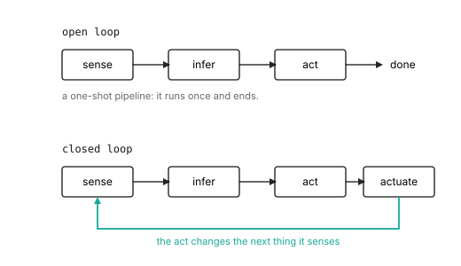

# From TinyML to Physical AI: The Loop

::: {.callout-question}

Why is a robot not just a model with a motor attached?

:::

Ask the robot to keep its eyes on the child as she moves around the room. The
perception is the easy part, and it is the part TinyML already solved: grab a
frame, run a small face detector, get back an angle to her face. On a
microcontroller that is a finished job. Sense, infer, done.

But "keep its eyes on her" is not a finished job. The instant the robot turns
its head toward the angle the detector reported, the camera is pointing
somewhere new, the child has taken another step, and the frame it just acted on
is already stale. To hold her in view it has to look again, decide again, and
turn again, and every turn it makes changes the next thing it sees. The single
inference that was the whole task in TinyML is now one step in a loop that does
not end while the robot is awake.

That is the answer to the question, and it is not a small one. A model with a
motor attached runs the model and moves the motor. A physical AI system acts
into the world its next input comes from, so it lives in the consequences of its
own motion. The model is a part. The loop is the subject.

## From a pipeline to a loop

[The Discipline](the-discipline.qmd) called this coupling the line that divides
physical AI from its neighbors. @fig-open-closed draws the two shapes next to
each other. An open loop is a pipeline: a signal enters at one end, passes
through sensing, inference, and a single action, and exits. It runs once. A
closed loop bends that pipeline back on itself. The action actuates the world,
the world changes, and the changed world is the next input. None of the boxes
moved. The arrow that returns is the entire subject of this book.

::: {#fig-open-closed fig-cap="**Open loop versus closed loop**: an open loop runs sensing, inference, and one action and then ends; a closed loop actuates the world and feeds the changed world back as its next input." fig-alt="Two diagrams. Top: three boxes labeled sense, infer, act connected left to right by arrows, ending at the word done. Bottom: four boxes labeled sense, infer, act, actuate connected left to right, with a curved arrow returning from actuate back to sense."}

:::

Once that arrow exists, a property a one-shot classifier never had to weigh
becomes the one that decides everything: timeliness. In an open loop a slow
answer is just a slow answer; you wait longer and still get the right label. In
a closed loop a slow answer is the wrong answer, because by the time it arrives
the world it described has moved on, and the system is about to act on a picture
of a room that no longer exists. Lateness here does not degrade the result. It
inverts it.

::: {.column-margin}
**Properties in tension**: timeliness against reliability and safety, the
instant the loop closes.
:::

So the same perception model lands in a different place the moment you close the
loop around it. In TinyML the question was whether the model fit on the device.
Here the question is whether the whole loop closes fast enough, every time, to
stay ahead of the thing it tracks. That is a placement decision, the discipline's
recurring move, and timeliness is the property that binds it.

## The iron law of the loop

You can settle that placement before building anything, on the back of a napkin.
The time from sensing the world to having acted on it is the sum of the stages
the signal passes through:

$$t_\text{loop} = t_\text{sense} + t_\text{infer} + t_\text{act} + t_\text{actuate}$$

The terms are what matter, not the digits. Put rough numbers on each stage and
the budget either closes or it does not. Say sensing a frame takes 8 ms, the
detector 22 ms, turning its angle into a motor command 3 ms, and the head
finishing its move 15 ms. The loop closes in about 48 ms. That sum is the loop's
latency, how out of date its action is by the time it lands. A simple reflex runs
one cycle at a time, so its latency is also its period, and at 48 ms
that is about twenty cycles a second; pipelining the stages can raise that rate
but never makes the action less stale. A face at conversational speed stays roughly
put for about 400 ms, so the loop runs with wide margin: as a reflex on the
device, it should hold her in frame. That margin is the prediction.

The second half of the iron law is what makes the first half matter: that time,
latency and period alike for a one-at-a-time loop, has to stay shorter than the
timescale of the thing the loop tracks.
Beat that deadline and the system lives slightly in the past but keeps up; miss it
and each cycle falls further behind, acting on a world that has already left.

Now move one stage off the device. Send the frame to the cloud for inference and
the 22 ms local step becomes a network round trip, easily 150 to 200 ms once you
count the upload, the queue, and the download. The loop balloons past a fifth of
a second, four or five cycles a second. Its mean might still sit under the 400 ms
deadline, so one cycle looks fine on paper. But a loop does not get to be average.
One slow round trip or one dropped packet, and the head is aimed at where the
child stood half a second ago; the next frame is of empty wall, the next
inference has nothing to find, and the error feeds itself. In a loop, timeliness
binds on the worst cycle, not the typical one. That is what forces the tracking
loop onto the device, and you can see it before writing a line of robot code.

## Predict, then build

::: {.callout-build title="Close the loop, then time it"}

Start from an open-loop classifier you already have, on any board or just your
laptop: read one input (a camera frame, a microphone window), run the model,
print the result. Now close it. Feed the result to an action that changes the
next input, the simplest one you can wire up: rotate the camera toward the
detection, or in simulation, shift the crop window toward it. Run it
continuously.

Before you measure, predict. Write down your four terms, sum them, and that is
your expected loop latency. Then measure: stamp the clock when a frame arrives
and again when the action completes, and log the gap over a few hundred cycles.
Report the median, and then the slowest five percent.

The lesson is in the gap between your prediction and that tail, not in whether
the build "worked."

:::

## What the number says

Two things usually surprise people the first time. The median loop latency comes
in above the napkin sum, because the stages do not run in a vacuum: the
operating system schedules other work, the camera buffers a frame or two, and
the act and actuate stages overlap with the next sense in ways the clean formula
ignored. And the tail is far worse than the median, because that is where a
scheduling pause or a missed frame lands.

Reconciling is not about making reality match the estimate. It is about seeing
which term you mis-budgeted and by how much, and noticing that the worst-case
tail, not the average, is what a closed loop has to survive. That measured tail
is the defense of the placement. If the on-device loop holds its deadline at the
ninety-fifth percentile and the cloud loop does not, you have shown with your own
numbers that this capability belongs in the reflex loop on the device. The
placement is no longer a preference; it is a measurement you can point to. Every
later chapter adds one capability and asks the same question, and from here you
answer it the way an engineer does, by closing the loop, timing it, and reading
the tail.

## Read

The split this chapter draws is an old one in robotics. The classical
sense-plan-act paradigm, embodied by Shakey at SRI in the late 1960s, treated
perception, world modeling, planning, and action as sequential stages: a long
open pipeline run once per decision. Rodney Brooks's subsumption architecture
(*A Robust Layered Control System for a Mobile Robot*, 1986) rejected that for
fast, layered reactive loops with no central model, arguing that the world is its
own best model and that staying coupled to it beats reasoning over a stored copy.
The tension those two traditions opened, between deliberating slowly and reacting
fast, is exactly the placement question this book turns into a measurement, and
it returns in force once a system needs both a fast loop and a slow one.

::: {.callout-teaching}

- **Hook**: contrast a doorbell camera (open loop: detect, notify, done) with
  balancing a stick on a fingertip (closed loop: every correction changes the
  next tilt). Ask which one a half-second delay ruins, and why. The stick is the
  whole chapter.
- **Open question**: introduce the three timescales (reflex, deliberation,
  learning) here, or hold them until the placement chapter? The argument for
  holding is that this chapter needs only one loop, and naming three before the
  reader has felt one turns a felt distinction into a taxonomy.
- **Watch**: keep "timeliness" from collapsing into "speed." The point is not
  that faster is better; it is that in a loop, late is wrong, and the worst case
  is what binds.

:::
