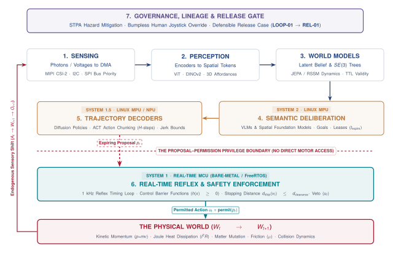
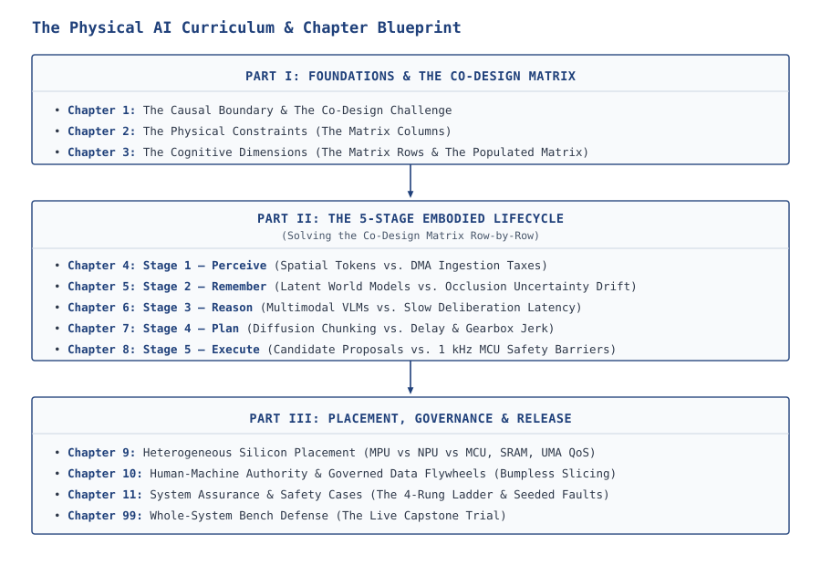

# The Causal Boundary

### *Matter, Momentum, and the Co-Design Challenge* {.unnumbered .unlisted}

{#fig-locator-ch01 width=100%}

*Why does an error in machine learning cost nothing on a screen, but break hardware in the physical world?*

For sixty years, computing evolved under the protective abstraction of idempotency, where digital state transitions could be retried, discarded, or buffered without physical penalty. Deploying learned neural policies into physical systems shatters this abstraction: commanding an actuator accelerates mass, dissipates energy, alters thermodynamic state, and permanently mutates the environment. When inference latency exceeds a dynamical system's critical timescale, or when out-of-distribution perception drives an irreversible physical action, software errors become structural fractures, thermal runaway, or mechanical collisions. Physical AI is the rigorous co-design of machine learning architectures, real-time compute fabrics, and physical dynamics to govern systems where bits dictate irreversible physical consequence.



::: {.callout-objective}
After studying this chapter, you will be able to:

1. **Formalize** the Causal Boundary distinguishing idempotent advisory inference from non-reversible physical actuation.
2. **Decompose** physical AI systems across the three canonical archetypes of mobility, contact manipulation, and cybernetic processes.
3. **Formulate** the state transition dynamics linking perception, policy inference, actuator torque, and environment state.
4. **Quantify** the real-time closed-loop latency deadline where compute delay induces dynamic instability.
5. **Evaluate** failure propagation modes where distribution shift produces catastrophic physical side effects.
6. **Synthesize** the dual-brain computing architecture partitioning cognitive planning from hard real-time reflex control.
:::

## Crossing the Threshold: From Advisory Bits to Physical Consequence

Every major leap in computing has been defined by the boundary across which bits travel. In personal computing, bits crossed from mainframe backplanes to human eyes through glowing displays. In cloud computing, bits crossed global fiber networks to synchronize distributed databases. In modern generative artificial intelligence, bits traverse deep neural networks to produce text, synthesize imagery, or recommend financial transactions. Yet across all these transformations, one fundamental property of software remained inviolate: the computation lived safely behind glass.

When a digital neural network misclassifies an image in a cloud benchmark, the consequence is confined to an incorrect integer stored in a memory register. When an autoregressive language model generates an ungrounded hallucination, the failure manifests as superfluous text on a browser screen. The software engineer can catch exceptions with a `try/catch` block, discard invalid payloads, re-execute the transaction from a checkpoint, or rely on the user to ignore the output. In computer systems engineering, this property is known as *idempotency*: the state of the physical universe $W_t$ remains completely decoupled from the intermediate outputs of the software pipeline. The computational state can be wiped clean, registers zeroed, and processes restarted without permanent side effects on the surrounding environment.

Physical artificial intelligence begins at the exact instant this isolation breaks. The moment an algorithmic prediction leaves the digital domain to modulate a pulse-width modulated (PWM) motor drive, fire a valve solenoid, or adjust an electrical grid inverter, software crosses what this book terms the *Causal Boundary*. 

::: {.callout-definition title="Causal Boundary"}
**Causal Boundary** is the structural interface where software execution transitions from decoupled information processing to irreversible physical energy exchange.

* **Significance:** Crossing the boundary couples compute latency, numerical uncertainty, and algorithmic errors directly to physical state dynamics, momentum, and heat.
* **Distinction:** Advisory systems produce outputs that can be buffered, validated, or discarded without altering the external world, whereas physical systems command actuators whose generalized forces immediately and permanently alter environment state.
* **Common Pitfall:** Treating physical actuators as passive I/O devices identical to network sockets, ignoring that delayed or erroneous outputs cannot be rolled back once mechanical work has occurred.
:::

Crossing the Causal Boundary replaces the benevolent, idempotent sandbox of classical computer science with the unyielding laws of mechanics, thermodynamics, and electromagnetism. In this new regime, software bugs are no longer mere runtime exceptions; they are burnt motor windings, snapped manipulator tendons, fractured quadrotor arms, or unstable power grids.

### The Causal Closed Loop: How Physical AI Breaks the Digital Covenant

To understand why physical deployment demands a complete rethinking of computer systems architecture, consider the contrast between advisory machine learning behind glass and closed-loop physical artificial intelligence.

In traditional advisory machine learning, the target task is framed as pattern recognition or sequence generation. A learned model computes a prediction $\hat{y}$ from an input observation. Crucially, the physical world state $W_t$ evolves completely independently of the model's intermediate computations. If an inference server stalls due to memory bus contention or garbage collection, the user experiences a brief visual delay on a screen, but the physical world does not collapse. The bits remain isolated inside digital memory.

Physical AI completely destroys this decoupling. The learned model is no longer an advisor; it is an active agent emitting action commands ($a_t$) that directly energize physical actuators—switching inverter MOSFETs, pressurizing hydraulic valves, or deflecting aerodynamic surfaces. The resulting physical forces and currents immediately mutate the external physical universe from state $W_t$ to $W_{t+1}$.

Crucially, because the physical world has changed, every subsequent observation ($o_{t+1}$) gathered by onboard cameras, IMUs, and encoders is a direct consequence of the model's own prior action. The interaction unfolds as an unyielding causal feedback loop:

$$a_t \longrightarrow \text{Physical Actuation } u(t) \longrightarrow \text{World State Change } W_{t+1} \longrightarrow \text{Next Observation } o_{t+1} \longrightarrow a_{t+1}$$

This closed loop creates three profound systems consequences that never occur in digital software:

1. **Compounding Distribution Shift:** In digital machine learning, if an image classifier makes a mistake on frame $t$, frame $t+1$ is still a valid image sampled from the distribution. In Physical AI, an incorrect steering or torque command at time $t$ physically drives the machine into unfamiliar regions of state space that were never captured in training datasets. Errors do not merely add linearly; they compound dynamically along the physical trajectory.
2. **Compute Delay as Physical Displacement:** In cloud computing, computational delay is an elastic quality-of-service metric. In Physical AI, time is physical motion. While an accelerator executes a neural forward pass requiring latency $\Delta t$, moving mass continues traveling along its kinematic trajectory:
   $$d_{\text{coast}} = v \cdot \Delta t$$
   At an operating speed of $1.5\text{ m/s}$, a $100\text{ ms}$ scheduling stall translates into $15\text{ cm}$ of completely blind, unguided physical travel before software even begins to react.
3. **Thermodynamic Irreversibility:** In digital memory, flipping a bit from `1` to `0` and back to `1` can be achieved in picoseconds with zero permanent side effects. In physical mechanics, accelerating a mechanism of mass $m$ to velocity $v$ injects kinetic energy ($E_k = \frac{1}{2} m v^2$) and dissipates irreversible Joule heat ($Q \propto I^2 R \cdot t$). Bringing that mass back to rest requires applying physical counter-force over time, transferring kinetic energy into braking friction and heat. There is no `try/catch` block for kinetic momentum.

### The Three Canonical Archetypes

The scope of Physical AI extends far beyond traditional factory robotics. The coupling between learned inference and physical state governs three distinct, universal archetypes of engineering systems: Mobility, Contact Manipulation, and Cybernetic Energy and Processes. While these domains differ in their underlying governing equations, they share the identical fundamental constraint: bits command irreversible physical state transitions.

#### Archetype 1: Mobility (Kinematic and Aerodynamic Systems)
Mobility encompasses systems that navigate continuous physical space, including autonomous ground rovers, multi-rotor aerial vehicles, autonomous mobile robots (AMRs), and submersibles. These systems are governed by Newton-Euler mechanics, momentum conservation, non-holonomic kinematic constraints, and fluid drag dynamics. 

In mobility, the core physical resource is kinetic momentum $p = mv$. Because mass possesses inertia, stopping or altering a trajectory requires finite distance and time. The stopping distance $d_{\text{stop}}$ of a ground vehicle moving at velocity $v_0$ under maximum braking deceleration $a_{\text{max}} = \mu g$ (where $\mu$ is the tire-road friction coefficient) is strictly bounded by the total system latency $\tau_{\text{latency}}$:

$$d_{\text{stop}} = v_0 \cdot \tau_{\text{latency}} + \frac{v_0^2}{2 \mu g}$$

Here, $\tau_{\text{latency}}$ encompasses sensor exposure, serialized bus transport, neural network forward-pass inference, and actuator torque ramp-up. If a deep vision policy requires $250\text{ ms}$ to detect an obstacle, that compute latency is not an abstract profiling statistic; it is a physical displacement during which the machine travels completely blind under open-loop momentum.

#### Archetype 2: Contact Manipulation (Rigid and Deformable Linkages)
Contact manipulation encompasses robotic arms, dexterous multi-fingered hands, surgical tools, and industrial assembly effectors. These systems interact with physical objects through intermittent mechanical contact.

Unlike free-space mobility, manipulation is characterized by extreme structural stiffness. When a rigid metallic gripper contacts a stiff workpiece or fixture, the contact force $F_c$ spikes almost instantaneously with even microscopic positional overshoots:

$$F_c \approx k_{\text{contact}} \cdot \Delta x$$

In stiff environments where material stiffness exceeds $k_{\text{contact}} > 10^5\text{ N/m}$, an unperceived overshoot of merely $1\text{ mm}$ produces an instantaneous contact force exceeding $100\text{ N}$. If a learned tactile feedback policy experiences even a $10\text{ ms}$ tail latency spike on an edge processor, the actuator continues driving forward before software can register the force threshold—shearing gearbox pins or fracturing the workpiece.

#### Archetype 3: Cybernetic Energy and Processes (Power, Thermal, and Fluid Networks)
Physical AI is not limited to machines with moving joints; it governs cybernetic systems where learned models manage continuous flows of electrical energy, heat, and fluids. This archetype includes grid-tied battery storage inverters, high-density datacenter cooling loops, and chemical batch reactors.

Consider a grid-forming battery storage inverter where a learned reinforcement learning policy optimizes power dispatch. The inverter switches power MOSFETs at tens of kilohertz to synchronize with the alternating current grid. A timing jitter or algorithmic delay of just a few milliseconds creates a phase angle mismatch ($\Delta \phi$), driving massive circulating reactive currents that trip circuit breakers or destabilize the local feeder. Similarly, in high-rate electric vehicle battery charging, an algorithm that miscalculates cooling valve timing allows resistive Joule heat ($Q = I^2 R \cdot t$) to accumulate faster than the fluid loop can extract it, risking thermal runaway within seconds.

### Quantitative Systems Rigor: The Stability-Latency Horizon

Why can't software engineers simply take a state-of-the-art vision transformer or large language model, deploy it on an embedded system, and run it as fast as the hardware allows? The answer lies in the fundamental relationship between computational delay and closed-loop dynamic stability.

In any physical feedback loop, the physical plant (a balancing robot, a flying drone, or a motor drive) has intrinsic natural dynamics characterized by an operating bandwidth or natural frequency $\omega_c$. When software is inserted into this closed loop, every millisecond of end-to-end compute delay $\tau_{\text{delay}}$ (from photon arrival on the sensor to current ramp-up in the motor) injects an unavoidable phase lag into the feedback signal:

$$\Delta \phi = -\omega_c \cdot \tau_{\text{delay}} \quad \text{[radians]}$$

Phase lag means the controller is always reacting to where the physical system *used to be* rather than where it *is now*. If you push a child on a playground swing, pushing half a second too late fights the swing's momentum rather than building it. In physical machines, as compute latency $\tau_{\text{delay}}$ grows, the system's phase margin (its safety buffer against oscillation) erodes. When phase margin drops to zero ($\text{PM} \le 0^\circ$), negative feedback flips into destructive positive feedback: minor sensor noise no longer dampens out—it amplifies exponentially into violent limit-cycle oscillations, motor saturation, and mechanical failure.

This physical reality establishes the **Stability-Latency Horizon**: for any dynamical system with crossover frequency $\omega_c$ and a required stability phase margin $\text{PM}_{\text{margin}}$, there exists a hard physical deadline on end-to-end computational latency:

$$\tau_{\text{delay}}^{\text{max}} < \frac{\text{PM}_{\text{margin}}}{\omega_c}$$

Consider a robotic balancing platform with an operating bandwidth of $\omega_c = 20\text{ rad/s}$ ($\approx 3.2\text{ Hz}$) and a nominal phase margin of $45^\circ$ ($0.785\text{ rad}$). The maximum allowable end-to-end compute latency is:

$$\tau_{\text{delay}}^{\text{max}} < \frac{0.785\text{ rad}}{20\text{ rad/s}} \approx 39.3\text{ ms}$$

This simple back-of-the-envelope calculation reveals a profound systems principle: **A massive foundation model that achieves 99.9% prediction accuracy but takes $50\text{ ms}$ to execute will cause this robot to lose stability and crash.** Conversely, a lightweight, lower-accuracy model executing deterministically in $5\text{ ms}$ preserves a healthy phase margin of over $39^\circ$, keeping the machine rock-solid. 

In Physical AI, computational latency is not a software profiling vanity metric; it is a primary state variable that governs physical stability.

### Architectural Consequence: The Dual-Brain System Contract

Standard software stacks—from Linux operating systems and Python runtimes to standard deep learning inference frameworks—were architected around average-case throughput rather than worst-case deterministic latency. Virtual memory paging, garbage collection, dynamic thread scheduling, and asynchronous DMA transfers introduce latency jitter that ranges from milliseconds to seconds. 

In an advisory web server, a $50\text{ ms}$ tail latency spike on the 99th percentile is invisible to the user. In a Physical AI system, a $50\text{ ms}$ latency spike during a high-speed maneuver drops the phase margin to zero, triggering dynamic instability.

To reconcile the massive computational capacity required for deep neural representations with the rigid, deterministic timing required for physical stability, Physical AI architectures abandon monolithic execution. Instead, they enforce a formal architectural separation known as the **Dual-Brain System Contract**:

1. **The Cognitive Brain (Soft Real-Time / High Throughput):** Implemented on high-performance application microprocessors (MPUs) or neural processing units (NPUs) running operating systems such as Linux. The Cognitive Brain processes rich, high-dimensional sensory data using large vision-language-action models and deep neural networks. It operates at macroscopic timescales ($100\text{ ms}$ to $1000\text{ ms}$) to perform semantic reasoning, global path planning, and task decomposition. Its execution is asynchronous and throughput-optimized.
2. **The Reflex Brain (Hard Real-Time / Low Latency):** Implemented on dedicated real-time microcontrollers (MCUs) or real-time cores executing bare-metal code or deterministic real-time operating systems (RTOS). The Reflex Brain executes tightly coupled, low-dimensional feedback loops ($100\ \mu\text{s}$ to $10\text{ ms}$) directly on high-rate proprioceptive sensors (encoders, IMUs, current shunts). It computes state estimation, dynamic obstacle avoidance shields, and high-frequency motor commutation.

The Reflex Brain acts as a physical gatekeeper: it receives nominal trajectory plans from the Cognitive Brain but continuously monitors safety invariants. If the Cognitive Brain stalls, drops a frame, or issues an out-of-distribution torque command, the Reflex Brain intercepts the command in hard real time, overriding the output with an active stabilization or safe-braking policy.

## The Failure Mode That Recurs: Anatomy of an Embodied Crash

In classical computer science education and industry software engineering, runtime failures are treated as benign, isolated events. When an unhandled exception propagates through a software stack, the operating system halts the offending thread, prints a stack trace to a log, and reclaims allocated heap memory, page tables, and file descriptors. The computational state is cleanly discarded, allowing the engineer to diagnose the fault, modify the source code, and restart the process without lingering side effects. Sixty years of computing abstractions—from virtual memory paging to containerized microservices—have reinforced the implicit belief that software execution is decoupled from the physical universe.

When algorithmic predictions command physical actuators, this mental model collapses. The physical world possesses neither an exception handler nor an undo operation. The kinetic energy stored in a moving robotic link, the magnetic flux circulating through an electric motor, and the thermal energy accumulating in a power inverter do not pause when an application thread terminates. The following composite autopsy documents how standard operating system process cleanup and software exception handling structurally fail to protect physical hardware when software crosses the Causal Boundary without an independent real-time privilege architecture.

::: {.callout-autopsy title="Latched Duty Cycle After Host Crash"}
* **System:** Six-degree-of-freedom tabletop manipulator running a vision-language-action policy with direct host write access to motor timer registers.
* **Incident:** The arm crushed an aluminum calibration fixture at $1.2\text{ m/s}$ and sheared the wrist cycloidal drive pins.
* **Telemetry Snapshot:** At $T+12.410\text{ s}$ the Linux application processor emitted a motor current target. Two milliseconds later an unhandled lighting reflection produced a zero-detection exception in an open-vocabulary detector, and the Python runtime crashed. Capture and compare registers remained latched at $78\%$ duty cycle on an independent silicon clock tree.
* **Root Cause:** When the operating system reclaimed the process’s virtual memory, memory-mapped timer peripherals kept pulsing gate drivers. The inverter continued driving phase current into the stator windings until impact.
* **Architectural Flaw:** Monolithic authority—learned software held direct electrical control over motor timers with no independent real-time permission supervisor on dedicated microcontroller silicon.
* **Provenance:** Engineered composite. The mechanism and failure path are drawn from documented incident classes; the system, telemetry, and costs are constructed for teaching and are not a report of a specific event.
:::

To understand why the manipulator in this incident continued driving into the fixture after the Python interpreter crashed, one must examine the physical silicon architecture of modern system-on-chip (SoC) hardware. In high-performance embedded processors, pulse-width modulation (PWM) peripherals and timer counters are implemented as discrete digital logic blocks connected to the system bus via peripheral bridges. These timer peripherals operate on dedicated hardware clock trees driven by independent phase-locked loops (PLLs) and bus prescalers. Once software initializes a timer counter and writes a duty cycle value into its capture and compare registers, the peripheral operates as an autonomous hardware state machine. It continuously counts clock cycles, toggles output pins, and generates gate-driver switching waveforms at frequencies of tens of kilohertz without requiring ongoing central processing unit (CPU) instruction execution.

When an unhandled exception or runtime panic terminates a user-space application process, the Linux kernel executes standard process teardown. The kernel invalidates the process's page directory, reclaims virtual memory allocations, closes open network sockets, and frees user-space file descriptors. However, physical memory-mapped I/O (MMIO) registers controlling external peripheral timers reside in hardware registers outside the operating system's virtual memory subsystem. The standard operating system kernel does not implicitly reconfigure, reset, or de-energize external peripheral timer registers upon user-space process termination. Because the timer peripheral resides on an independent silicon clock domain, its internal digital counters continue cycling, holding the gate-driver control lines at the last latched duty cycle. The motor inverter's solid-state H-bridge continues commutating electrical power, phase currents continue flowing through the stator windings, and electromagnetic torque accelerates the mechanical linkage until physical impact arrests the motion.

This failure demonstrates why statistical improvements in artificial intelligence models cannot resolve fundamental architectural vulnerabilities. A common fallacy in embodied AI development is the assumption that fine-tuning a vision-language-action model, expanding training datasets, or increasing parameter scale will eliminate physical crashes. In open-world physical environments, stochastic perception models will inevitably encounter unmodeled corner cases, such as extreme specular reflections, dynamic occlusions, sensor degradation, or unexpected illumination shifts. Furthermore, complex operating systems running on application processors are inherently susceptible to transient hardware faults, dynamic memory allocation failures, shared-bus contention, and runtime scheduler preemption. Elevating perception accuracy from ninety-five percent to ninety-nine point nine percent merely reduces the frequency of anomalous outputs; it does not alter the failure domain when an anomaly inevitably occurs. When an architecture grants learned, stochastic software direct write access to physical actuation registers without an isolated, deterministic permission supervisor, any host runtime failure translates immediately into unconstrained physical destruction.

## The Four Bedrock Laws of Physical AI Systems

The physical destruction of the manipulator illustrates that deploying artificial intelligence into physical environments requires fundamentally different architectural principles than developing cloud or desktop software. The crash was not an isolated software defect, but the inevitable consequence of violating the boundary between unverified cognitive proposals and physical actuation authority. To prevent such structural failures, every system in Physical AI must be designed, analyzed, and verified against four foundational physical and architectural laws. These laws govern every chapter of this textbook, establishing the non-negotiable boundaries that separate safe, robust physical autonomy from catastrophic hardware failure.

::: {.callout-law title="1. The Law of Physical Causality and Irreversibility"}
Software state can be caught with an exception block, isolated in a virtual container, or restored from a checkpoint. Physical actions ($W_t \to W_{t+1}$) governed by mass, inertia, friction ($\mu$), and gravity ($g$) are permanent and irreversible. Every actuation permanently alters the physical environment, dissipates energy, and alters all future sensory observations endogenously ($a_t \to u(t) \to W_{t+1} \to o_{t+1}$).
:::

The first bedrock law formalizes the physical irreversibility of actuation. In traditional digital computing, state mutations are largely virtual and mathematically reversible; a database transaction can be rolled back, a file system snapshot restored, and a failed computation retried with zero residual impact on the physical world. In contrast, physical actuation couples software directly to classical mechanics and thermodynamics. When motor inverter transistors switch, electrical energy flows through inductive coils, generating magnetic fields that accelerate mechanical mass against inertia, gravity, and friction. 

This energy exchange cannot be rewound. Accelerating a manipulator arm, an autonomous vehicle, or an aerial drone injects kinetic momentum into the environment. Once kinetic momentum has been transferred to a physical mechanism, arresting that motion requires applying opposing physical forces over finite distances and finite intervals of time, inevitably dissipating energy as non-recoverable heat and mechanical strain. If an erroneous torque command is applied to an actuator, no software command can retroactively cancel the resulting kinetic energy before physical forces interact with the surrounding workspace. Furthermore, because physical state transitions are strictly causal, every actuation immediately alters the physical universe ($W_{t+1}$), which in turn alters all subsequent sensory observations ($o_{t+1}$). An actuation error does not merely corrupt an internal software variable; it endogenously shifts the physical state space from which all future sensor measurements originate, making error recovery a physical control problem rather than a digital debugging exercise.

::: {.callout-law title="2. The Law of Information Freshness (The Time Law)"}
The physical world does not pause while an artificial intelligence model computes. Sensor observations age the microsecond photons strike the photodiode or acoustic waves reach a transducer. Mean latency ($P_{50}$) is a dangerous illusion; tail latency ($P_{99}$), memory bus contention, and information age ($\Delta t$) dictate physical closed-loop stability and dynamic stopping distances ($d_{\text{stop}}$).
:::

The second bedrock law establishes that in physical systems, computational latency is a physical displacement. In digital web services or batch data processing, software performance is typically evaluated by average throughput or median response time ($P_{50}$). If an inference server takes an additional fifty milliseconds to process a query, the user experiences an imperceptible delay, but the underlying validity of the computed result remains unaffected. In the physical realm, however, dynamical systems evolve continuously along the time axis according to differential equations of motion. The physical environment never halts its evolution to accommodate computational processing delays.

Consequently, sensory information begins decaying the precise instant it is transduced by physical hardware. A camera frame does not capture the current state of the world; it captures the state of the world at the instant photons struck the image sensor. As that frame traverses direct memory access (DMA) buffers, system buses, operating system device drivers, and deep neural network layers, the physical machine continues moving along its unconstrained trajectory. Relying on average execution times provides a dangerously false sense of security, because dynamic stability and collision avoidance are bounded strictly by worst-case latency tails ($P_{99}$). A single multi-millisecond latency spike caused by operating system thread scheduling, memory bus contention, or garbage collection increases the total information age ($\Delta t$), directly expanding the physical stopping distance required to avoid an obstacle and eroding the closed-loop phase margin necessary to maintain mechanical equilibrium.

::: {.callout-law title="3. The Law of Proposal–Permission Privilege (The Architecture Law)"}
No stochastic, learned neural network (VLM, VLA, or Diffusion Policy) may hold direct motor authority. Learned models running on application processors are untrusted proposal services. Real-time physical permission belongs exclusively to dedicated, zero-allocation microcontrollers running deterministic mathematical safety envelopes and physical fallbacks.
:::

The third bedrock law defines the fundamental structural separation of authority required to survive the Causal Boundary. Modern deep neural networks—such as large vision-language models, diffusion policies, and transformer-based action chunk decoders—possess immense representational capacity, enabling machines to interpret unstructured scenes and generate sophisticated behavioral plans. However, these models are fundamentally statistical function approximators running within complex, non-deterministic software runtimes that require multi-gigabyte memory footprints and dynamic memory allocations. Because these software stacks cannot provide deterministic real-time execution guarantees, they must never be granted direct, unmediated electrical control over physical power electronics.

To resolve this tension, Physical AI architectures enforce a strict privilege boundary between cognitive proposal and physical permission. High-capacity learned models running on application processors operate strictly as untrusted proposal engines. They generate candidate trajectories and parameterized behavioral intents, publishing them as time-bounded leases to a shared communication interface. Sole authority to energize power inverters, write timer capture and compare registers, and toggle gate-driver enable lines is reserved for a dedicated, trusted permission authority executing on isolated real-time microcontroller silicon. Operating with zero dynamic memory allocation and deterministic execution cycles, the permission supervisor continuously evaluates candidate proposals against hard mathematical safety invariants, dynamic stopping limits, and kinematic constraints. If a proposed action violates a physical safety boundary, or if the host processor experiences a latency spike, memory fault, or software crash, the permission authority instantaneously rejects the proposal and engages a deterministic physical fallback to bring the mechanism to a safe, controlled state.

::: {.callout-law title="4. The Law of Governed Change and Defensible Release (The Safety Law)"}
A physical agent shapes its own future data distribution. Naive training on raw operational logs without isolating safety interventions induces severe covariate shift and policy collapse. A cherry-picked video demo or simulation benchmark is not evidence of safety; defensible release requires cross-layer fault injection and a formal safety case rendering an accountable release verdict.
:::

The fourth bedrock law governs the lifecycle, learning dynamics, and deployment criteria of physical artificial intelligence systems. In static machine learning benchmarks, models are evaluated on fixed, independent and identically distributed validation datasets where predictions do not influence future data collection. In Physical AI, an agent acts continuously within a closed causal loop, meaning the policy's own past actions determine the distribution of physical states and sensory observations it will encounter in the future. When a real-time permission supervisor intervenes to override an unsafe action, it fundamentally alters the vehicle or manipulator trajectory. If operational logs record these overridden transitions without explicitly isolating and tagging supervisor interventions, subsequent model retraining on raw telemetry teaches the neural network that dangerous actions lead to safe trajectories, inducing catastrophic covariate shift and policy collapse during future deployments.

Furthermore, the governance of Physical AI systems demands that verification extend far beyond empirical demonstration. Demonstrating that an autonomous robot completed a task in a simulated environment or survived several dozen test runs in a controlled laboratory provides no formal guarantee of physical safety under rare, out-of-distribution conditions. Defensible deployment requires rigorous, cross-layer fault injection testing that systematically subjects the hardware and software stack to simulated silicon clock failures, operating system thread freezes, direct memory access bus saturation, sensor dropouts, and sudden physical payload variations. System release must be justified through a structured Claim-Argument-Evidence safety case that explicitly documents verified invariants, physical fallback envelopes, and fault containment boundaries, producing a definitive and accountable Deploy, Condition, or Refuse verdict before learned software is permitted to act upon the physical world.

## Physical Constraints in Silicon and Steel

When machine learning software transitions from cloud datacenters to physical bench hardware, four physical realities immediately assert themselves (@tbl-software-vs-physics). In simulation and digital sandboxes, these realities are routinely abstracted away: state transitions occur instantaneously upon variable assignment, commanded torques materialize without inductive rise times, and collisions register as scalar cost penalties without causing plastic deformation or structural fracture. On the physical bench, however, digital bits commanding an actuator must negotiate directly with conservation of momentum, finite inductive rise times, thermal dissipation limits, and mechanical transmission tolerances. Every systems engineer designing physical AI architectures must be equipped to compute these physical boundaries on the back of an envelope before energizing a power stage.

| Physical Phenomenon | Software Assumption (Simulation) | Physical Bench Reality | Systems & Architectural Impact |
| :--- | :--- | :--- | :--- |
| **Kinetic Momentum ($\mathbf{p} = m\mathbf{v}$)** | Velocity drops to zero instantly upon command | Continuous momentum requires finite stopping distance ($d_{\text{stop}}$) | Unmitigated compute latency causes physical collisions |
| **Joule Heating ($I^2 R$)** | Motor produces unlimited continuous peak torque | Resistive winding losses accumulate as heat in thermal capacitance ($C_{\text{th}}$) | Sustained stall current destroys stator insulation and demagnetizes rotors |
| **Inductance ($\tau_e = L/R$)** | Torque setpoint responds in $0\text{ ms}$ | Stator inductance enforces exponential current rise time | Actuation phase lag erodes closed-loop stability margin |
| **Backlash & Compliance** | Infinitely rigid, continuous kinematic chain | Gearbox tooth clearances create angular deadbands during reversals | Limit-cycle oscillation and impact shock upon tooth re-engagement |
| **Mechanical Jerk ($\dddot{\mathbf{q}}$)** | Step acceleration and discontinuous force allowed | Infinite torque rate ($\dot{\boldsymbol{\tau}} \to \infty$) injects high-frequency shock waves | Excites structural resonances, chips gear teeth, and shears drive pins |

: Digital software assumptions versus physical hardware realities. {#tbl-software-vs-physics}

### Kinetic Momentum and Mechanical Inertia

In digital computing, an executing thread can be paused instantly with a software breakpoint, freezing execution state without physical side effects. In the physical realm, a mass $m$ translating at linear velocity $\mathbf{v}$ carries kinetic momentum $\mathbf{p} = m\mathbf{v}$ and scalar kinetic energy:

$$E_k = \frac{1}{2} m \|\mathbf{v}\|^2$$

For articulated robotic mechanisms with multiple rotating joints, this relationship generalizes across configuration space $\mathbf{q} \in \mathbb{R}^n$ through the configuration-dependent generalized inertia tensor $\mathbf{M}(\mathbf{q}) \in \mathbb{R}^{n \times n}$:

$$E_k = \frac{1}{2} \dot{\mathbf{q}}^T \mathbf{M}(\mathbf{q}) \dot{\mathbf{q}}$$

Because energy and momentum are strictly conserved physical quantities, software cannot instantly zero the kinetic energy of a moving mechanism. Bringing mass to rest requires applying an opposing physical force over a finite displacement and time interval, dissipating that energy through controlled deceleration or unconstrained structural deformation. If an application processor freezes or drops frames while the mechanism is in motion, mechanical momentum continues carrying the linkage along its unguided trajectory.

A concrete calculation on benchtop hardware demonstrates how rapidly an unmitigated software stall translates into mechanical destruction. Consider a lightweight manipulator carrying a tooling mass of $m = 0.40\text{ kg}$ operating at an end-effector velocity of $v = 1.2\text{ m/s}$, matching the operational regime of the tabletop arm autopsy. If an application processor crashes or experiences an operating system scheduling stall that creates an unmitigated permission outage of $\Delta t = 50\text{ ms}$, the unguided mechanism coasts over a blind displacement:

$$d_{\text{coast}} = v \cdot \Delta t = (1.2\text{ m/s})(0.050\text{ s}) = 0.060\text{ m} = 60\text{ mm}$$

During this $60\text{ mm}$ displacement, the mechanism delivers kinetic energy:

$$E_k = \frac{1}{2} m v^2 = \frac{1}{2}(0.40\text{ kg})(1.2\text{ m/s})^2 = 0.288\text{ J}$$

directly into any rigid obstacle in its path. While $0.288\text{ J}$ appears modest in macroscopic terms, concentrating that energy across the rigid contact boundary of a calibration fixture generates localized contact forces exceeding several hundred newtons. The resulting stress wave easily shears precision dowel pins and cracks cycloidal gear teeth. Dynamic stopping distance is not a theoretical abstraction; it is an inescapable kinematic cost dictated by velocity and permission latency.

### Joule Heating and Thermal Accumulation

Transducing electrical energy into mechanical work through electromagnetic actuators incurs unavoidable resistive losses. When an inverter drives phase current $I(t)$ across motor stator windings having phase resistance $R$, the instantaneous electrical power dissipated as heat is governed by Joule's law, accumulating total thermal energy according to:

$$Q(t) = \int_{0}^{t} I^2(\tau) R \, d\tau$$

An electric actuator possesses a lumped thermal capacitance $C_{\text{th}}$ (representing the heat capacity of the copper coils and stator iron core) and a thermal resistance $R_{\text{th}}$ governing conductive and convective heat transfer to the ambient environment. During brief dynamic acceleration bursts, stator windings safely absorb transient heat spikes because $C_{\text{th}}$ buffers the temperature rise. In steady-state operation, however, heat dissipation must balance ambient rejection, strictly limiting continuous current to the manufacturer's rated threshold $I_{\text{cont}}$.

When an autonomous policy encounters a planning deadlock, an unmodeled obstacle, or an out-of-distribution visual occlusion, it frequently commands sustained stall torque against an immovable surface. Under stall conditions, the back-electromotive force drops to zero, and the motor draws continuous stall current $I_{\text{stall}} \gg I_{\text{cont}}$. Within seconds, thermal energy accumulation exceeds the thermal dissipation capacity of the motor housing. As winding temperatures exceed the dielectric breakdown rating of the wire enamel insulation (typically $155^\circ\text{C}$ to $180^\circ\text{C}$ for Class F and H insulation), inter-turn electrical short circuits form, destroying the stator. Simultaneously, excessive core temperatures risk exceeding the thermal knee limit of rare-earth rotor magnets (such as neodymium-iron-boron, NdFeB), causing permanent, irreversible demagnetization that degrades the motor's torque constant $K_t$. Thermal accumulation transforms transient software deadlocks into permanent hardware destruction.

### Electromagnetic Actuation and Inductive Rise Time

In discrete-time policy simulation, roboticists often assume that commanding a joint torque $\boldsymbol{\tau}_{\text{cmd}}$ results in instantaneous torque production at the physical joint. In physical silicon and copper, however, electric current cannot change discontinuously due to stator winding inductance $L$. The voltage-current relationship of a brushless motor phase is governed by Faraday's law of induction:

$$V(t) = R I(t) + L \frac{dI(t)}{dt} + K_e \omega(t)$$

where $V(t)$ is the applied inverter terminal phase voltage, $R$ is winding resistance, $L$ is winding inductance, and $K_e \omega(t)$ represents the counter-electromotive force (back-EMF) generated by rotor angular velocity $\omega(t)$.

The electrical time constant of the motor winding, defined as $\tau_e = L / R$, dictates the fundamental physical rate at which magnetic flux and electromagnetic torque can ramp up. Even if an artificial intelligence model evaluates instantaneously with zero compute latency, the physical inductance of the stator enforces an exponential current rise time:

$$I(t) = \frac{V - K_e \omega}{R} \left(1 - e^{-t / \tau_e}\right)$$

This inductive lag introduces an unavoidable phase delay between digital software commands and physical force generation. Furthermore, as rotor velocity $\omega(t)$ increases during high-speed maneuvers, back-EMF rises proportionally, opposing the applied terminal voltage. When the sum of resistive drop and back-EMF matches the maximum DC supply rail voltage $V_{\text{bus}}$, the inverter encounters a hard voltage saturation boundary. Beyond this boundary, the motor cannot produce additional torque, regardless of the magnitude of the torque vector output by a neural network.

### Mechanical Non-Idealities: Backlash, Compliance, and Jerk

Physical mechanical transmissions—such as cycloidal speed reducers, harmonic strain-wave drives, and planetary gearboxes—diverge substantially from ideal rigid kinematic linkages. Precision gear teeth require microscopic manufacturing clearances to prevent binding, introducing angular backlash $\theta_{\text{backlash}}$. Backlash manifests as a non-linear deadband during motion reversals: when an actuator reverses direction, the motor rotor rotates through the backlash gap without transmitting torque to the output link until mechanical contact is re-established on the opposing tooth face. When a neural policy commands high-frequency sign reversals in joint velocity, crossing this deadband creates phase lag and limit-cycle chattering, followed by abrupt impact shock when the gear teeth collide.

Furthermore, physical mechanisms exhibit structural compliance across drive shafts, flexsplines, and structural linkages. When a manipulator makes contact with an environment having material stiffness $k_{\text{contact}}$ and damping $b_{\text{contact}}$, the normal contact force scales with penetration depth $\Delta x$ and contact velocity $\Delta \dot{x}$:

$$F_{\text{contact}}(t) = k_{\text{contact}} \Delta x(t) + b_{\text{contact}} \Delta \dot{x}(t)$$

In rigid industrial and scientific workspaces where contact stiffness routinely exceeds $k_{\text{contact}} > 10^5\text{ N/m}$, an unperceived positional overshoot of merely $0.5\text{ mm}$ generates an instantaneous contact force exceeding $50\text{ N}$. If the control loop cannot react within sub-millisecond timescales, the impact shock propagates directly through the drivetrain, damaging delicate load cells and bearings.

Finally, discrete-time policies that output discontinuous joint trajectory steps inject severe mechanical jerk, defined as the third time derivative of joint position $\dddot{\mathbf{q}} = d^3\mathbf{q} / dt^3$. Discontinuous acceleration profiles demand infinite torque rates ($\dot{\boldsymbol{\tau}} \to \infty$), exciting structural resonant frequencies in the robot chassis, accelerating gear tooth fatigue, and shearing drive pins. Robust physical AI architectures must treat mechanical jerk, contact compliance, and inductive lag as primary physical constraints that bound policy execution.

## The Proposal and Permission Privilege Split

A seductive but dangerous fallacy in modern deep learning is the monolithic architecture: the belief that scaling a single end-to-end neural network—from raw sensor pixels directly to motor pulse-width modulation (PWM) switching—will eliminate classical control theory, real-time operating systems, and hardware safety supervisors.

Wiring learned neural network weights directly to motor timer peripherals violates the fundamental systems principles of fault containment, privilege separation, and real-time determinism [@saltzer1984end; @brooks1986robust]. Deep neural networks are statistical function approximators whose predictions under rare visual artifacts, specular reflections, dynamic occlusions, or out-of-distribution scenes are inherently non-deterministic and unverified. Granting such models unmediated electrical control over motor inverters guarantees eventual hardware destruction. Furthermore, general-purpose operating systems like Linux and complex execution frameworks like PyTorch or ONNX Runtime prioritize average-case throughput over worst-case execution time. Dynamic memory allocation, virtual memory paging, shared-bus memory contention, and kernel scheduler preemption produce multi-millisecond tail latency spikes ($P_{99} > 100\text{ ms}$) that a high-frequency motor control loop cannot absorb without losing dynamic stability. If a user-space application thread panics or terminates—as demonstrated in the tabletop arm autopsy—the underlying motor power stage must remain governed by an independent, living processor.

{#fig-anatomy width=100%}

### The Two-Brain Architecture

To resolve the fundamental tension between high-capacity cognitive representation and deterministic real-time safety, Physical AI systems abandon monolithic execution. Instead, the computing substrate is partitioned across a hardware privilege boundary into a **Two-Brain Architecture** (@fig-anatomy and @tbl-processor-comparison):

1. **The Untrusted Proposal Engine (MPU / Linux Tier):** Implemented on high-performance application microprocessors (MPUs) or neural processing units (NPUs) running general-purpose operating systems such as Linux. The proposal engine executes high-capacity foundation models, multimodal vision-language-action (VLA) models at macroscopic cognitive rates ($0.5\text{--}2\text{ Hz}$), and diffusion-based action-chunk policies at intermediate rates ($20\text{--}50\text{ Hz}$). Operating in rich virtual memory with dynamic heap allocation, this tier interprets semantic intent, maintains latent world representations, and generates candidate trajectory chunks $\mathbf{a}_{t:t+H}$. The proposal engine emits time-bounded intent leases accompanied by periodic real-time heartbeats into a shared memory interface. Crucially, the proposal engine holds **zero direct electrical authority** over motor inverters, timer registers, or gate-driver enable pins.
2. **The Trusted Permission Authority (MCU / RTOS Tier):** Implemented on dedicated real-time microcontrollers (MCUs) or isolated deterministic cores running bare-metal firmware or a hard real-time operating system (RTOS). The permission authority executes in zero-wait-state static SRAM with strictly zero dynamic heap allocation (`malloc = 0`). Operating at a deterministic $1000\text{ Hz}$ loop cadence ($1\text{ ms} \pm 5\,\mu\text{s}$ timing jitter), this tier continuously validates candidate proposals against hard mathematical safety invariants, kinematic limits, and dynamic stopping inequalities ($d_{\text{stop}} \le d_{\text{clearance}}$). The permission authority projects candidate proposals onto a verified forward-invariant safe set $\mathcal{U}_{\text{safe}}$:

$$u_t = \arg\min_{u \in \mathcal{U}_{\text{safe}}} \|u - p_t\|^2 \quad \text{subject to } h(\mathbf{x}) \ge 0$$

While the full mathematical formulation of Control Barrier Function (CBF) quadratic programs and field-oriented current loops (FOC) is developed in Chapter 8 [@ames2019control], the architectural contract is established here: the MCU alone holds the electrical privilege to configure PWM timer registers and toggle gate-driver enable lines, and it possesses absolute authority to reshape or refuse any proposal issued by the MPU.

::: {.callout-contract}
| Component | Execution Substrate | Contract Specification |
| :--- | :--- | :--- |
| **MPU Proposes** | Untrusted · Linux MPU / NPU | Emits candidate action chunks $\mathbf{a}_{t:t+H}$ within an expiring intent lease $\mathcal{L}_{\text{intent}} = \langle \mathbf{a}_{t:t+H}, t_{\text{issue}}, \tau_{\text{TTL}}, \text{seq} \rangle$; emits heartbeats at $\le 20\text{ ms}$ periods; possesses zero direct electrical authority over motor gate drivers. |
| **MCU Permits** | Trusted · Bare-Metal MCU / RTOS | Validates joint limits, velocity bounds, and dynamic stopping clearances ($d_{\text{stop}} \le d_{\text{clearance}}$); projects or rejects proposals under barrier invariants $h(\mathbf{x}) \ge 0$; holds sole privilege to write PWM registers and toggle gate enable lines. |
| **Failure Escalation** | MCU Hardware Reflex | Upon intent lease expiration, heartbeat timeout ($> 20\text{ ms}$), or invariant violation, immediately revokes PWM drive and executes controlled dynamic braking toward Safe Torque Off (STO). |
:::

| Architectural Dimension | Untrusted Proposal Engine (MPU / Linux) | Trusted Permission Authority (MCU / RTOS) |
| :--- | :--- | :--- |
| **Compute Hardware** | Multi-core ARM Cortex-A / x86 + NPU / GPU accelerator | Single-core ARM Cortex-M / RISC-V real-time core |
| **Operating Environment** | General-purpose Linux (best-effort / Preempt-RT) | Bare-metal firmware / FreeRTOS (hard real-time) |
| **Memory Architecture** | Multi-gigabyte shared DRAM (virtual memory paging) | Tightly coupled static SRAM / TCM (zero heap allocation) |
| **Workload Profile** | Vision transformers, world models, diffusion action chunks | Barrier invariants, watchdog monitors, field-oriented control |
| **Execution Cadence** | $20\text{ ms}$ to $2000\text{ ms}$ ($0.5\text{--}50\text{ Hz}$) | $1\text{ ms} \pm 5\,\mu\text{s}$ deterministic ($1000\text{ Hz}$) |
| **Actuator Authority** | **Untrusted** (no direct peripheral or timer access) | **Trusted (sole electrical motor gate authority)** |

: Processor dimension comparison across the Proposal and Permission Privilege Split. {#tbl-processor-comparison}

Under this two-brain contract, refusal is an active, deterministic mechanism rather than an optional design choice. The proposal channel operates strictly under an expiring intent lease model. If the shared memory mailbox age or heartbeat arrival gap exceeds a hard real-time budget—set to $\tau_{\text{heartbeat}} = 20\text{ ms}$ on the reference kit—the microcontroller immediately invalidates the active lease, rejects subsequent candidate actions, and autonomously executes a controlled deceleration trajectory toward Safe Torque Off (STO). This single timing mechanism guarantees that when an upstream artificial intelligence model crashes, hangs, or experiences an operating system memory stall, the physical hardware comes to a safe, controlled stop rather than latching open-loop power.

On the Arduino UNO Q reference hardware used throughout this book, this architectural split is directly observable on the bench. The Qualcomm Dragonwing application processor executes Linux and hosts the untrusted proposal engine, writing candidate action chunks into a shared mailbox. The onboard STM32 microcontroller alone is physically connected to the motor timer peripherals and gate-driver enable pins. A student can empirically verify this privilege boundary by intentionally terminating the Linux proposal process with a `kill -9` signal during active trajectory tracking: the motor timers do not latch open-loop current; instead, the STM32 detects the heartbeat lapse within $20\text{ ms}$ and safely de-energizes the actuators.

### Silicon-Level Privilege Isolation

On modern heterogeneous systems-on-chip, application processor cores and real-time microcontroller cores share common silicon substrate and system interconnects. Consequently, privilege separation cannot rely on software goodwill; it must be enforced through hardware bus firewalls.

Hardware peripheral protection units (such as ARM TrustZone controllers, peripheral protection units, and bus memory management units) physically isolate the memory-mapped I/O (MMIO) registers of advanced motor timers, PWM channels, and GPIO gate-enable pins within the microcontroller bus domain. These register addresses are completely unmapped and physically inaccessible from user-space Linux. The application processor communicates with the real-time microcontroller exclusively through a dedicated, non-cacheable shared SRAM ring buffer. Inter-processor communication utilizes lock-free circular mailboxes synchronized with 64-bit monotonic atomic sequence counters and inter-processor interrupts (IPIs). This architecture enables high-bandwidth exchange of candidate trajectory chunks and telemetry while physically preventing the application processor from acquiring a direct bus path to the motor inverters.

### Digital Agents versus Physical Agents

The term *agent* has become ubiquitous across computer science, yet digital agents operating in virtual environments differ fundamentally from physical agents operating in the material world (@tbl-digital-vs-physical). Digital agents—such as large language models orchestrating web browsers, code interpreters, or database transactions—operate in forgiving virtual sandboxes. When a digital agent fails, the runtime raises an exception, containerized processes restart, database transactions roll back, and client requests retry without altering the physical state of the universe.

| Dimension | The Digital Agent | The Physical Agent |
| :--- | :--- | :--- |
| **Operational Realm** | Virtual sandboxes, REST APIs, web browsers, databases | Physical matter, 3D space, kinetic momentum ($W_t \to W_{t+1}$) |
| **Execution Medium** | Python runtimes, cloud virtual machines, serverless containers | Heterogeneous silicon: Linux MPU + bare-metal real-time MCU |
| **Error Handling** | Software exceptions, HTTP retries, transactional rollbacks | Mechanical collisions, Joule heating ($I^2 R$), drivetrain fatigue |
| **Time Model** | Turn-based, asynchronous, unbounded wait states | Continuous real-time, microsecond freshness ($\Delta t$), $P_{99}$ latency tails |
| **Action Authority** | Emits JSON payloads, tool-call tokens, or text strings | Emits PWM waveforms, phase currents, and physical contact forces |
| **Safety Paradigm** | Guardrails, prompt filters, schema validators | Control barrier certificates, stopping bounds ($d_{\text{stop}}$), hardware interlocks |

: Digital Agents versus Physical Agents. {#tbl-digital-vs-physical}

A physical agent is an entirely different engineering object. Its outputs are not text tokens or JSON payloads; they are gate-driver switching commands that draw high currents across inductive windings, accelerate inertial mass, and permanently alter the environment. In the physical realm, errors cannot be caught with a `try/catch` block once kinetic momentum has been transferred to mechanical linkages.

### Success Is Dual

In digital machine learning benchmarks, performance is evaluated along a purely statistical dimension: average test accuracy, top-1 classification rate, or loss across a static dataset. In classical industrial automation, performance is evaluated along a deterministic safety dimension: satisfying hard invariant boundaries within a structured, unchanging workcell.

In **Physical AI Systems**, success is dual, multiplicative, and non-negotiable:

$$\text{Physical AI Success} = \underbrace{\text{Semantic Competence}}_{\text{Task achieved from sensor input}} \quad \mathbf{AND} \quad \underbrace{\text{Physical Invariant Survival}}_{\text{Zero collisions, hardware damage, or safety violations}}$$

A vision-language-action model that successfully grasps a delicate target object 99 times out of 100, but shears a cycloidal gearbox or strikes an obstacle on the 100th trial, is not a 99% successful system; it is a total system failure. Physical AI systems engineering requires maximizing semantic competence while mathematically guaranteeing that physical invariant survival cannot be compromised.

### The Embodiment Spectrum

While benchtop manipulators serve as the primary laboratory platform throughout this text, **Physical AI is not limited to robotics**. It represents the systems discipline for *any* machine where learned software exercises delegated authority over physical matter and energy (@tbl-embodiment-spectrum).

| Embodiment Domain | Untrusted Proposal Engine (MPU Tier) | Physical Matter & Energy Dynamics ($W_t \to W_{t+1}$) | Trusted Permission Authority (MCU Tier) |
| :--- | :--- | :--- | :--- |
| **Mobility & Aerospace** | Neural trajectory and waypoint planner | Kinetic momentum ($p = mv$), tire-road friction ($\mu$), aerodynamic drag | Hard-real-time brake-by-wire and steering envelope supervisor |
| **Grid & High-Voltage Systems** | Learned renewable battery dispatch predictor | Megawatt current flows, grid phase angle, inverter thermal dissipation | Sub-millisecond over-current trip relays and anti-islanding supervisors |
| **Active Medical Devices** | Neural glucose and continuous drug-rate predictor | Infusion volume, biochemical plasma concentration, receptor binding | Hardware-clamped stepper motor limiters and dose watchdog circuits |
| **Precision Manufacturing** | Vision-guided toolpath and laser router optimizer | Spindle motor torque, workpiece thermal fluence, cutting shear forces | Hardware axis limit enforcers and optical beam-interruption E-stops |
| **Autonomous Robotics** | Multimodal VLA diffusion action-chunk policy | Joint torque, linkage inertia ($\mathbf{M}(\mathbf{q})$), contact stiffness ($k_{\text{contact}}$) | $1000\text{ Hz}$ bare-metal Control Barrier Function and dynamic brake reflex |

: The Physical AI Embodiment Spectrum across diverse engineering domains. {#tbl-embodiment-spectrum}

Reading @tbl-embodiment-spectrum from left to right illustrates the universal architectural principle: across every domain, high-capacity learned models operate as untrusted proposal engines, while deterministic real-time supervisors hold exclusive physical permission authority over actuators, relays, and valves. Whether governing megawatts in an electrical power grid or microliters in an automated insulin infusion pump, the proposal-permission privilege split provides the structural foundation that allows learned software to safely interact with the physical world.

## The Physical AI Co-Design Matrix

In conventional engineering education, robotics, machine learning, and embedded systems are frequently taught in isolation. Mechanical engineers analyze kinematics and rigid-body dynamics assuming ideal commanded forces; computer scientists train deep neural networks on static offline datasets assuming instantaneous computation and infinite memory bandwidth; embedded systems engineers write real-time firmware for deterministic microcontrollers assuming fixed, hand-crafted control laws. In Physical AI, these three disciplines collide directly at the Causal Boundary. High-capacity neural representations cannot interact with the material world without negotiating with physical inertia, finite electrical time constants, and shared-bus memory contention. Conversely, bare-metal microcontrollers cannot achieve open-world semantic competence without consuming candidate trajectories generated by stochastic foundation models. The **Physical AI Co-Design Matrix** serves as the master intellectual compass of this textbook, organizing the complex multi-dimensional design space by crossing physical reality against cognitive agency (@fig-codesign-matrix).

{#fig-codesign-matrix width=100%}

The horizontal columns of the matrix represent the five foundational physical constraint columns that bound real-time embodied machines, detailed with rigorous sense-to-actuation metrology in Chapter 2:

1. *Time and Freshness:* The physical universe does not pause during neural computation. Sensory evidence decays continuously from the instant of transduction, and closed-loop dynamic stability is bounded strictly by worst-case latency tails ($P_{99}$) and information age ($\Delta t$).
2. *Inertia and Stopping:* Mechanical mass possesses kinetic momentum ($\mathbf{p} = m\mathbf{v}$), dictating non-zero dynamic stopping distances ($d_{\text{stop}}$) and enforcing hard reaction deadlines before irreversible collisions occur.
3. *Actuation and Jerk:* Electromagnetic torque production is constrained by stator winding inductance and electrical time constants ($\tau_e = L/R$), while higher-order trajectory derivatives ($\dddot{\mathbf{q}}$) excite structural resonances, cause mechanical fatigue, and damage gear transmissions.
4. *Energy and Thermal Load:* Continuous current flow dissipates resistive Joule heat ($I^2 R$) within motor windings and power electronics, establishing strict thermal capacitance limits ($C_{\text{th}}$) and demanding active power management across embedded accelerators.
5. *Silicon and Bus Determinism:* Unified memory architectures, direct memory access (DMA) traffic, and multi-core memory bus contention introduce non-deterministic execution jitter, requiring strict hardware isolation and zero-dynamic-heap execution in real-time safety paths.

The vertical rows of the matrix represent the five canonical stages of the embodied cognitive lifecycle, formalized as a multi-rate runtime architecture in Chapter 3:

1. *Perceive:* Transducing raw physical energy into high-dimensional sensory representations and metric affordance tokens under strict memory bus bandwidth and exposure constraints.
2. *Remember:* Maintaining temporal context, spatial coordinate frame trees, and latent belief distributions across dynamic occlusions and sensor dropouts.
3. *Reason:* Evaluating high-level goals, semantic task decompositions, and behavioral affordances within bounded-validity intent leases.
4. *Plan:* Synthesizing kinematically and dynamically feasible trajectory action chunks that bridge multi-millisecond neural inference latencies.
5. *Execute:* Enforcing deterministic, bare-metal reflexes and mathematical control barrier certificates that project untrusted candidate proposals onto verified safe sets at kilohertz cadences.

Crucially, the 5x5 matrix is not an abstract taxonomic catalog, nor is each cell an isolated design problem. Every intersection represents an inescapable systems tension where physical reality confronts cognitive agency. Reading across the matrix reveals the core systems questions addressed throughout this text:

* *Perception $\times$ Time (Chapter 4):* Camera exposure times, serialized MIPI-CSI transport, and direct memory access (DMA) buffering introduce sensor transport lag, causing spatial blur and frame staleness that must be resolved through hardware-synchronized global shutters and zero-copy ring buffers.
* *Memory $\times$ Inertia (Chapter 5):* When moving mass coasts under continuous momentum during visual occlusions or sensor dropouts, internal world-model belief states diverge from physical reality, requiring predictive state estimators that explicitly propagate kinematic covariance bounds.
* *Reasoning $\times$ Actuation (Chapter 6):* High-capacity foundation models emitting abstract semantic goals lack intrinsic awareness of physical reachability and motor saturation, demanding that cognitive intent be packaged into expiring leases ($\mathcal{L}_{\text{intent}}$) bounded by dynamic feasibility.
* *Planning $\times$ Silicon (Chapter 7):* Diffusion policies and transformer-based action chunk decoders must generate sequences of future actions over a receding horizon ($H$) to amortize heavy neural inference latency and mask shared-DRAM memory bus contention on application processors.
* *Execution $\times$ Stopping (Chapter 8):* Dedicated real-time microcontrollers must evaluate dynamic stopping inequalities ($d_{\text{stop}} \le d_{\text{clearance}}$) and solve quadratic-program Control Barrier Functions (CBFs) in under one millisecond to project untrusted candidate actions onto forward-invariant safe sets before gate drivers are energized.

The Co-Design Matrix guarantees that systems engineering decisions are never made in a vacuum. A modification in a neural perception backbone alters memory bus traffic; a shift in motor gearing alters inductive time constants and required control loop frequencies; an increase in vehicle velocity expands dynamic stopping distances and tightens the freshness deadline for global planning. By navigating this matrix systematically, the systems engineer develops a unified mental model where bits, buses, and bearings operate as a single coherent machine.

## The Curriculum Roadmap and The Loop Charter

To master the 5x5 Co-Design Matrix, this textbook and its paired 14-week university project course (developed at Harvard University and ETH Zurich) follow a structured three-part progression (@fig-curriculum-blueprint). The curriculum transitions students from foundational physical and systems metrology, through the systematic construction of the embodied cognitive pipeline, to whole-system integration, governance, and defensible release.

{#fig-curriculum-blueprint width=100%}

The curriculum blueprint organizes the 14-week course into three cohesive educational arcs:

* **Part I — Foundations (Chapters 1–3):** Part I establishes the foundational physics, timing metrology, and architectural primitives of Physical AI. Chapter 1 fixes the Causal Boundary, formalizes the Proposal and Permission Privilege Split, and introduces the 5x5 Co-Design Matrix. Chapter 2 unpacks the five physical columns with rigorous sense-to-actuation metrology, tracing the latency waterfall from photon arrival to motor torque generation and demonstrating why worst-case latency tails ($P_{99}$) govern dynamic stopping distance and closed-loop stability. Chapter 3 formalizes the multi-rate runtime architecture, establishing the asynchronous execution model that decouples macroscopic semantic reasoning ($0.5\text{--}2\text{ Hz}$), intermediate action chunking ($20\text{--}50\text{ Hz}$), and bare-metal motor reflexes ($1000\text{ Hz}$) across lock-free shared memory mailboxes.
* **Part II — The Embodied Lifecycle (Chapters 4–8):** Part II systematically conquers the 5x5 Co-Design Matrix row by row, building the complete agent pipeline from sensory ingestion to physical actuation. Chapter 4 investigates Perception, exploring spatial tokenization, sensor fusion, and zero-copy DMA ring buffers under memory bus contention. Chapter 5 explores Memory and State, developing metric coordinate frame trees, spatial memory maps, and latent world models that maintain state belief across dynamic occlusions. Chapter 6 examines Reasoning and Intent, framing multimodal vision-language models as generators of expiring intent leases. Chapter 7 addresses Planning and Action Generation, implementing diffusion policies, transformer action decoders, and continuous jerk optimization to bridge neural inference latencies. Chapter 8 culminates in Real-Time Enforcement, implementing bare-metal Control Barrier Functions, hardware watchdogs, and dynamic braking reflexes on dedicated microcontroller silicon.
* **Part III — System Integration, Governance, and Release (Chapters 9–11 and Capstone 12):** Part III addresses the architectural integration, operational safety, and rigorous certification required to deploy physical AI systems into the real world. Chapter 9 tackles Silicon Placement and Workload Partitioning, mapping neural inference and real-time control across heterogeneous MPU, NPU, MCU, and edge-cloud silicon under strict power and thermal budgets. Chapter 10 covers Human-Machine Governance and Safe Learning, designing bumpless authority transitions, shared autonomy interfaces, and telemetry isolation pipelines that prevent catastrophic policy collapse from untagged supervisor overrides. Chapter 11 establishes Assurance Cases and Defensible Release, formulating Claim-Argument-Evidence (CAE) safety cases and cross-layer fault injection frameworks to render an evidence-backed Deploy, Condition, or Refuse verdict. Capstone 12 integrates the entire hardware and software stack on the benchtop kit, challenging students to defend closed-loop physical autonomy under live, seeded hardware faults, sensor dropouts, and operating system panics.

In Physical AI systems engineering, architectural contracts must be frozen before writing algorithmic code. The **Loop Charter** represents Milestone 1 of the student's 11-artifact Engineering Dossier. Before deploying learned policies or commanding motor current, the engineering team must formally define, measure, and record the privilege boundaries, communication cadences, and safety invariants governing their bench platform (@tbl-loop-privilege).

| Subsystem | Trust Tier | Execution Cadence | Physical Actuation Authority |
| :--- | :--- | :--- | :--- |
| **Proposal Engine (MPU)** | Untrusted | $1\text{ Hz}$ VLM $\to$ $20\text{ Hz}$ Policy | Emits expiring candidate action chunks $\mathbf{a}_{t:t+H}$; zero direct inverter access |
| **Permission Authority (MCU)** | Trusted | $1000\text{ Hz}$ Enforcer ($1\text{ ms} \pm 5\,\mu\text{s}$) | Sole PWM timer and gate-enable privilege; evaluates barrier invariants |

: Privilege split and authority boundaries recorded in the Loop Charter. {#tbl-loop-privilege}

To complete the Loop Charter, engineering teams must empirically measure, verify, and freeze six non-negotiable platform parameters:

1. *Heartbeat and lease timeout budget ($\tau_{\text{heartbeat}} = 20\text{ ms}$):* The maximum allowable time interval between consecutive host alive pulses before the real-time microcontroller invalidates the active proposal lease and assumes host failure.
2. *Emergency deceleration trajectory toward Safe Torque Off (STO):* The deterministic, open-loop or closed-loop braking profile executed by the microcontroller to bring moving linkages to a complete, controlled stop without exceeding mechanical stress limits upon lease expiration or hardware faults.
3. *Strict ban on dynamic heap allocation in the real-time loop (`malloc = 0`):* The architectural requirement that all microcontroller memory buffers, ring queues, and state variables reside in statically allocated SRAM, eliminating non-deterministic memory allocator latency and heap fragmentation.
4. *Thermal and $I^2t$ continuous current clamp:* The firmware and hardware current thresholds that prevent resistive Joule heating from exceeding stator thermal capacitance ($C_{\text{th}}$) and damaging winding insulation or rotor magnets during sustained stall conditions.
5. *Hard joint position and velocity envelopes:* The physical kinematic bounds and maximum joint speed limits configured directly in microcontroller registers to prevent mechanisms from colliding with mechanical hardstops or exceeding rated gearbox input speeds.
6. *Rejection threshold for stale or out-of-order candidate proposals:* The timestamp and sequence verification logic that instantly discards any proposal whose total information age ($\Delta t = t_{\text{current}} - t_{\text{transduce}}$) exceeds the freshness wall or whose sequence counter indicates transport reordering.

## Common Systems Fallacies in Physical AI

When software engineers and machine learning practitioners transition to Physical AI, they frequently bring assumptions formed in the digital computing realm. In cloud computing and desktop software, computing operates within virtual sandboxes where failures are cheap, execution can be paused, and state can be rolled back. In the physical realm, these assumptions become dangerous fallacies that lead directly to mechanical fracture, burnt electronics, and uncontained collisions.

### The Digital Sandbox Fallacy
This fallacy assumes that traditional software error-handling abstractions, such as `try/catch` exception blocks or operating system process isolation, protect physical hardware. In modern System-on-Chip architectures, peripheral timer registers operate on autonomous silicon clock trees. When a user-space application thread crashes, the operating system kernel reclaims virtual memory but leaves memory-mapped I/O timer registers latched at their last written duty cycle. The motor inverter continues commutating electrical power, driving high stall currents through stator windings until mechanical linkages strike physical obstacles or thermal runaway destroys the actuator.

### The Monolithic End-to-End Fallacy
This fallacy assumes that scaling a single deep neural network from raw sensor pixels directly to motor pulse-width modulation (PWM) duty cycles eliminates the need for classical control theory, real-time operating systems, and hardware safety supervisors. Because deep neural networks are statistical function approximators susceptible to out-of-distribution visual artifacts, dynamic occlusions, and specular reflections, and general-purpose operating systems exhibit multi-millisecond tail latency spikes ($P_{99} > 100\text{ ms}$), granting an end-to-end model unmediated electrical authority over motor inverters guarantees eventual physical destruction.

### The Average Throughput Fallacy
This fallacy assumes that achieving a high median frame rate ($P_{50}$) or average inference throughput guarantees closed-loop physical safety. In continuous dynamical systems, closed-loop stability and dynamic stopping distances are governed strictly by worst-case latency tails ($P_{99}$ and $P_{99.9}$). A single $250\text{ ms}$ scheduling blackout caused by memory bus contention or garbage collection while a vehicle travels at $2.0\text{ m/s}$ translates into half a meter of blind, unguided motion, transforming an otherwise safe trajectory into an unavoidable collision.

### The Simulation-to-Real Equivalence Fallacy
This fallacy assumes that a learned policy achieving high task success in rigid-body physics simulation will transfer directly to benchtop hardware without architectural modification. Physics simulation engines routinely abstract away electromagnetic inductance, mechanical transmission backlash, structural compliance, memory bus contention, and irreversible Joule heating. On physical hardware, unmodeled phase lags and discontinuous torque commands generate severe mechanical jerk, excite chassis resonances, chip gearbox teeth, and induce thermal faults.

### Chapter Summary

This chapter crossed the foundational threshold from digital computing into Physical AI. In the digital realm, software operates behind glass: bits can be reset, transactions rolled back, and exceptions caught without physical consequence. In Physical AI, software commands energy flows that accelerate mass, dissipate heat, and permanently mutate the environment ($W_t \to W_{t+1}$). Because every actuation causally reshapes all subsequent sensory observations ($a_t \to u(t) \to W_{t+1} \to o_{t+1}$), errors cannot be resolved through digital debugging; they must be prevented through rigorous systems co-design. 

To reconcile high-capacity stochastic neural deliberation with deterministic real-time safety, physical AI architectures enforce the Proposal and Permission Privilege Split, reserving exclusive electrical motor authority for dedicated, zero-allocation microcontrollers running mathematical safety barriers. The 5x5 Co-Design Matrix organizes the complete engineering discipline, while the Loop Charter establishes the immutable baseline for hardware realization.

In Chapter 2 (*The Physical Constraints*), we attach physical instruments to every stage of the sense-to-actuation pipeline. We trace the complete latency waterfall—from the arrival of photons at an image sensor through direct memory access transfers, neural network matrix multiplications, inter-processor mailboxes, and inductive current rise times in motor windings—quantifying the precise microsecond budgets and freshness boundaries that dictate physical survival.
