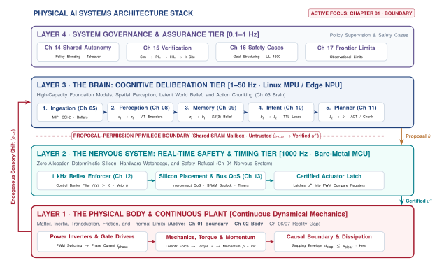

# Boundary\chaptersubtitle{Introduction to Physical AI Systems} {#sec-boundary}

{width=100%}

*Why does an error that costs nothing on a screen destroy hardware in the physical world?*

For six decades, computing evolved under the protective abstraction of idempotency. In the digital world, software operates safely behind glass: an unhandled exception prints a stack trace, database transactions roll back to clean checkpoints, and the physical universe remains untouched. Physical AI begins the exact instant algorithmic predictions leave the digital domain to command physical actuators. When bits cross the causal boundary into the material world, they accelerate moving mass, dissipate irreversible Joule heat, and alter the environment permanently. In this regime, an error is no longer a benign runtime exception; it is a sheared gearbox, a burnt motor winding, or a catastrophic collision. Physical AI is the systems engineering discipline that bridges high-capacity learned deliberation with unyielding dynamical physics, transforming stochastic neural models into dependable, real-time machines that sense, reason, and act in the physical world.



::: {.callout-objective}
After studying this chapter, you will be able to:

1. Locate the causal boundary in a system architecture and state what changes on each side of it.
2. Contrast how traditional machine learning and physical AI handle state, timing, and error recovery.
3. Classify an embodied machine into one of three canonical physical archetypes and identify which physical budget binds it first.
4. Apply the three-pillar scope test to determine whether a given system requires the engineering discipline of physical AI.

*Core chapter takeaway.* The causal boundary is a physical location, not an abstraction. Below it, the machine shapes its own future sensory observations, computational delay is paid in physical displacement, and energy released into the world cannot be recalled.
:::

## The Convergence: Brain, Body, and Nervous System {#sec-boundary-1-1}

Every major leap in computing has been defined by the boundary across which bits travel. In personal computing, bits crossed from mainframe backplanes to human eyes through glowing displays. In cloud computing, bits crossed global fiber networks to synchronize distributed databases. In modern generative artificial intelligence, bits traverse deep neural networks to produce text, synthesize imagery, or recommend financial transactions. Yet across all these transformations, one fundamental property of software remained inviolate: the computation lived safely behind glass.

::: {.callout-definition}
## Physical Artificial Intelligence (Physical AI)
Physical Artificial Intelligence (Physical AI) is the systems engineering discipline of embedding learned statistical models into closed-loop physical machines that sense, deliberate, and act under the unyielding laws of classical mechanics, thermodynamics, and electromagnetism.
:::

When a digital neural network misclassifies an image in a cloud benchmark, the consequence is confined to an incorrect integer stored in a memory register. When an autoregressive language model generates an ungrounded hallucination, the failure manifests as superfluous text on a browser screen. Software engineers can catch runtime errors, discard invalid outputs, roll back transactions to a clean checkpoint, or rely on human users to ignore an answer. In computer systems engineering, this property is known as idempotency: the state of the surrounding physical universe remains completely decoupled from the intermediate outputs of the software pipeline. Memory can be cleared, registers zeroed, and processes restarted without permanent side effects on the environment.

Physical artificial intelligence begins at the exact instant this isolation breaks. The moment an algorithmic prediction leaves the digital domain to modulate a pulse-width modulation motor drive, fire a valve solenoid, or adjust an electrical grid inverter, computation ceases to be advice and becomes physical force. At this threshold, an unhandled exception is no longer a benign runtime error; it is a burnt motor winding, a sheared gearbox, or a collision with an obstacle in the physical world.

A physical artificial intelligence system decomposes structurally into three subsystems that govern this transition (@fig-agent-anatomy):

1. **The Body**: The physical plant comprising structural mass, mechanical linkages, gearboxes, electric motor windings, power transistors, and thermal heat sinks. The body does not obey software abstractions or compiler optimizations; it obeys the immutable laws of classical mechanics, thermodynamics, and electromagnetism. It accelerates according to Newton's second law, resists motion through friction, and accumulates irreversible heat whenever electrical current flows through resistive coils.
2. **The Brain**: The high-capacity learned policies, foundation models, vision-language-action (VLA) networks, and deliberative planners executing on onboard application processors (MPUs and NPUs). The brain provides semantic competence precisely because its weights are learned from massive data rather than hand-coded. However, this statistical formulation means it cannot provide closed-form deterministic guarantees and remains unpredictable on out-of-distribution inputs.
3. **The Nervous System**: The deterministic embedded computing fabric, real-time buses, shared SRAM mailboxes, and hardware safety supervisors that carry telemetry and evaluate commands under microsecond deadlines. Executing on isolated, bare-metal microcontrollers (MCUs), the nervous system enforces the rigid timing constraints dictated by the body's physical dynamics, runs high-rate reflex loops, and holds exclusive write authority over actuator hardware registers.

{#fig-agent-anatomy fig-pos="t" width=100%}

### Three Disciplines Converging into One Machine

Historically, these three subsystems evolved within three isolated engineering cultures (@fig-01-three-tribes):

- *Computer Science & Machine Learning (The Brain)* focused on representation learning, semantic reasoning, and statistical loss minimization, operating under the assumption that computation lives in virtual sandboxes where failures carry zero physical cost.
- *Mechanical Engineering & Dynamics (The Body)* focused on kinematics, multi-body dynamics, structural stress, and formal control theory, modeling physical systems through analytical differential equations and Lyapunov stability envelopes, historically distrusting black-box statistical models.
- *Embedded Systems & Electrical Engineering (The Nervous System)* focused on microsecond clock determinism, bare-metal register access, bus arbitration, and fault-tolerant safety circuits, historically treating software as fixed, static state machines.

{#fig-01-three-tribes fig-pos="t" width=100%}

Physical AI is the systems engineering synthesis of these three traditions. When an embodied machine operates in the real world, none of these disciplines can succeed in isolation:
- A high-capacity neural policy (Brain) without real-time arbitration (Nervous System) will crash the machine whenever inference latency spikes.
- A deterministic real-time controller (Nervous System) without rich perceptual representations (Brain) remains blind to open-world semantic complexity.
- A physical mechanism (Body) without coordinated thermal and kinematic budgeting will destroy its own actuators under aggressive policy setpoints.

To make these three traditions work together safely, physical AI introduces an asymmetric **Proposal–Permission Privilege Boundary**. High-capacity neural models execute on an unprivileged application processor (Linux MPU) to generate rich, context-aware action *proposals*, while deterministic safety monitors execute on an isolated, real-time microcontroller (bare-metal MCU) with exclusive authority over the actuator hardware registers.

## Software That Acts: Traditional ML vs. Physical AI {#sec-boundary-1-2}

To understand why physical AI requires a distinct systems discipline, we must contrast software that *advises* against software that *acts*.

### Traditional Systems and ML: Computing "Behind Glass"

Traditional machine learning and enterprise software operate inside an informational sandbox where errors carry zero physical momentum. When a cloud recommender serves an irrelevant item, a vision model mislabels a benchmark photo, or a language model hallucinates an inaccurate sentence, the computation terminates at a display buffer or network socket.

The failure is strictly **idempotent**:
- No physical momentum is transferred ($p = 0$).
- No thermodynamic work is performed on the environment ($W = 0$).
- No heat is dissipated into mechanical hardware ($\Delta Q = 0$).

If a cloud service crashes or an inference fails, the operating system catches the exception, unwinds the stack, reallocates memory, and restores state from a database log. The software is immune to its own mistakes because of *where it stops*, not because of how it was built.

### Physical AI: Operating in the Material World

Physical AI eliminates that protective barrier. In an embodied machine, the final instruction of a control loop does not write to a screen; it writes to a hardware register that modulates electrical current into motor coils or opens a hydraulic valve.

At this interface, four fundamental systems realities govern the machine (@tbl-01-paradigm-comparison):

1. **The Closed Causal Loop**: In offline ML, data is static and exogenous ($x \sim P(X)$). An error on sample $i$ has no causal influence on sample $i+1$. In Physical AI, the perception-action loop is dynamically closed:
   $$s_{t+1} \sim P(\cdot \mid s_t, a_t), \quad o_{t+1} \sim P(\cdot \mid s_{t+1})$$
   Every torque command moves the body, shifts camera poses, and alters contact forces. The machine creates its own future sensory observations. An erroneous action pushes the hardware into an unfamiliar state space where neural uncertainty is high, triggering compounding errors and policy collapse (@fig-01-causal-loop).
2. **Computational Delay as Physical Displacement**: While an inference model executes matrix operations on an onboard accelerator, moving mass continues traveling along its kinematic path. At velocity $v(t)$, an end-to-end compute and communication delay $\Delta t$ produces an unavoidable spatial displacement:
   $$\Delta x = \int_0^{\Delta t} v(t) \, dt$$
   Latency is paid directly in physical distance, compressing obstacle clearance margins before corrective action can begin (@fig-01-sensor-rack).
3. **Thermodynamic Irreversibility**: Once electrical current energizes an actuator, electrical energy converts into kinetic energy ($E_k = \frac{1}{2}mv^2$) and resistive heat ($I^2 R$). If an incorrect joint command drives a tool into a rigid obstacle, the kinetic energy converts into plastic deformation and sheared gear teeth. No software catch block can un-bend metal or extract dissipated heat from motor coils.
4. **Decoupled Privilege Hierarchy**: Because neural networks are statistical and prone to out-of-distribution failures, they cannot be trusted with direct write access to actuator registers. The machine must enforce a strict privilege separation: untrusted proposals from the MPU gated by deterministic referees on the MCU.

| Architectural Dimension | Digital Machine Learning (Advisory) | Classical Robotics & Control | Physical Artificial Intelligence (Closed-Loop) |
|:---|:---|:---|:---|
| **Operational Substrate** | Decoupled virtual memory buffers (GPU VRAM, DRAM, web/socket endpoints) | Continuous analog state space governed by deterministic differential equations | Hybrid: high-dimensional neural representations mapped to analog physical actuators |
| **Model Formulation & Policy Representation** | High-capacity statistical approximators (LLMs, ViTs, deep diffusion models) | Analytically specified transfer functions, linear/nonlinear ODEs ($\dot{\mathbf{x}} = f(\mathbf{x}, \mathbf{u})$), state-space matrices | Foundation policies (VLMs, ACT, Diffusion) paired with deterministic runtime safety filters |
| **Data Flow & Observation Dynamics** | Exogenous and static; independent and identically distributed ($x \sim P(X)$) | Continuous deterministic state feedback ($\mathbf{x}(t)$); modeled white Gaussian sensor noise | Endogenous, non-stationary closed loop ($s_{t+1} \sim P(\cdot \mid s_t, a_t)$); actions shape future observations |
| **Execution Cadence & Timing Budget** | Throughput-optimized batching; soft or unbounded latency ($P_{50} \approx 100\text{--}1000\text{ ms}$) | Hard real-time single-rate loops ($100\text{--}1000\text{ Hz}$ on bare-metal MCUs); deterministic WCET | Asynchronous multi-rate cadences: System 2 ($1\text{ Hz}$), System 1.5 ($50\text{ Hz}$), System 1 ($1000\text{ Hz}$) |
| **Actuation Authority & Register Access** | Advisory; sandboxed APIs, display buffers, or human-in-the-loop validation | Hardcoded feedback directly driving power inverter timers and PWM compare registers | Decoupled Proposal–Permission architecture; untrusted neural proposals gated by MCU safety referee |
| **Failure Semantics & Consequence** | Idempotent; call-stack unwind, database rollback, or human alert dismissal | Actuator saturation or tracking error within analytically bounded stability envelope | Irreversible thermodynamic work, plastic deformation, kinetic collision ($d_{\text{stop}}$ breach), or stator overheating ($I^2 R$) |
| **Verification & Safety Assurance** | Offline statistical loss minimization ($\mathcal{L}_{\text{val}}$, $P_{99}$ accuracy metrics) | Formal mathematical stability proofs (Lyapunov functions, gain/phase margins) | Layered runtime invariant enforcement, forward-invariant Control Barrier Functions (CBFs), and fault injection |
: **Comparison Matrix of Computing Paradigms across the Causal Boundary.** Systematic comparison of Advisory Digital Machine Learning, Classical Robotics & Control Theory, and Physical Artificial Intelligence across structural execution media, model representation, observation feedback dynamics, temporal budgets, failure consequence semantics, and safety certification primitives. {#tbl-01-paradigm-comparison}

![**The Closed Causal Loop of Physical AI versus Open-Loop Digital Computation.** (a) Open-loop advisory machine learning operates behind glass on exogenous benchmark distributions $x \sim P(X)$, where computational errors $\hat{y}$ are idempotent and bounded by software exception handling or transactional rollbacks ($p=0, W=0$). (b) In Physical AI, neural deliberation proposals $\hat{a}_t \sim \pi_\theta(\cdot \mid o_t)$ pass through a deterministic nervous system safety gate before committing to hardware actuator registers ($u_t$). Once memory-mapped pulse-width modulation compare registers latch, electrical current converts into Lorentz force, mechanical torque ($\tau$), kinetic momentum ($p=mv$), and Joule heat ($\Delta Q = I^2 R \Delta t$), permanently mutating environment state ($W_t \to W_{t+1}$) and endogenously shifting all subsequent sensory observations ($o_{t+1} \sim P(O \mid s_{t+1})$).](figures/fig01_causal_loop.svg){#fig-01-causal-loop fig-pos="t" width=95%}

![**Multi-Modal Sensor Array and Structural Integration.** High-resolution photograph of the rotating 64-beam LiDAR scanner (Velodyne HDL-64E) and optical camera framework mounted on the roof rack of the autonomous vehicle testbed "Junior" (Stanford Racing Team / DARPA Urban Challenge). Physical AI systems must continuously ingest multi-gigabit-per-second sensor streams across serialized buses, compute state representations, and issue actuator commands within strict latency envelopes $\Delta t$. (Source: Steve Jurvetson, CC BY 2.0).](figures/fig01_real_lidar_sensor_rack.jpg){#fig-01-sensor-rack fig-pos="t" width=85%}

## Anatomy of a Crash {#sec-boundary-1-3}

To see how these principles determine whether a machine survives, consider a concrete failure. A physical crash in an autonomous machine is rarely caused by an inaccurate prediction alone, but by the absence of an architectural mechanism with the authority to refuse one.

### The Causal Sequence of a Collision

On a clear night in March 2018, an automated test vehicle traveling at forty-three miles per hour ($19.2\text{ m/s}$) along a public roadway in Tempe, Arizona, detected an unmodeled obstacle eighty-two meters ahead (@fig-01-tempe-vehicle).

![**Autonomous Test Vehicle Sensor Configuration from NTSB Collision Investigation.** The modified 2017 Volvo XC90 sport utility vehicle operating Uber ATG's developmental Automated Driving System (ADS) during the March 2018 fatal collision in Tempe, Arizona. The physical sensor suite comprised a roof-mounted 64-beam Velodyne LiDAR (360° azimuth, >100 m range), a 10-camera optical sensing suite including forward-facing stereo and wide-angle cameras, and eight medium- and long-range radar units providing 360° perimeter coverage. Despite continuous sensor contact starting at 82 meters ($T-5.6\text{ s}$), classification instability in the perception pipeline and an unverified 1.2-second suppression delay prevented the planner from requesting braking until 0.2 seconds before impact. (Source: NTSB Highway Accident Report NTSB/HAR-19/03, Public Domain).](figures/fig01_real_ntsb_tempe_vehicle.jpg){#fig-01-tempe-vehicle fig-pos="t" width=95%}

Deconstructing the telemetry recorded during the five seconds before impact reveals a direct chain of timing, classification, and privilege failures:

1. **Perception Contact ($T - 5.6\text{ s}$)**: The vehicle primary LiDAR and radar detected an object at a distance of $82.0\text{ m}$, initializing a tracked state in host memory.
2. **Classification Jitter ($T - 4.4\text{ s}$ to $T - 1.2\text{ s}$)**: The neural perception classifier repeatedly toggled its semantic label between vehicle, bicycle, and unknown obstacle. Because the tracking pipeline associated state filters with discrete semantic labels, each reclassification reset the tracking history and velocity estimate to zero, preventing the system from recognizing that the obstacle was stationary in its path.
3. **Software Suppression Delay ($T - 1.2\text{ s}$)**: To prevent false-positive emergency braking alarms, the engineering team had inserted a $1.2\text{ s}$ suppression delay between hazard detection and actuator engagement. In software, $1.2\text{ s}$ was an arbitrary filter constant. At $19.2\text{ m/s}$, that delay forced the vehicle to travel forward for an unalterable reaction distance:
   $$d_{\text{react}} = v_0 \times \Delta t_{\text{suppress}} = (19.2\text{ m/s}) \times (1.2\text{ s}) = 23.04\text{ m}$$
4. **Available Clearance Collapse ($T - 0.2\text{ s}$)**: When the autonomy stack completed its suppression window and finally requested emergency braking at $T - 0.2\text{ s}$, remaining physical clearance had collapsed to $d_{\text{clear}} = 3.8\text{ m}$. At maximum braking deceleration ($a_{\max} = 8.0\text{ m/s}^2$), bringing a vehicle from $19.2\text{ m/s}$ to rest requires:
   $$d_{\text{brake}} = \frac{v_0^2}{2 a_{\max}} = \frac{(19.2\text{ m/s})^2}{2 \times (8.0\text{ m/s}^2)} = 23.04\text{ m}$$
   The total stopping distance required was $d_{\text{stop}} = d_{\text{react}} + d_{\text{brake}} = 46.08\text{ m}$. Because available clearance was only $3.8\text{ m}$, kinetic impact was physically unavoidable.

### The Architectural Lesson

The Tempe vehicle crashed not because its neural networks failed to emit floating-point outputs, but because the autonomy architecture lacked an independent nervous system running on dedicated real-time hardware with the authority to evaluate physical stopping envelopes and say **NO**.

If a deterministic safety supervisor had continuously evaluated the invariant $d_{\text{stop}} \le d_{\text{clear}}$ at the hardware floor, the machine would have executed emergency braking at $T - 2.5\text{ s}$, bringing the vehicle to a safe halt regardless of semantic label fluctuations in the upstream perception stack.

## Three Kinds of Physical Machines {#sec-boundary-1-4}

Physical AI spans an enormous variety of physical embodiments—from autonomous warehouse vehicles and multi-jointed surgical robots to chemical bioreactors and power inverters. To engineer dependable systems across this diversity, we distill embodied machines into **three canonical archetypes** based on their dominant physical dynamics (@fig-01-three-archetypes and @tbl-01-machine-archetypes):

1. **Mass-Dominated Machines (Moving Mass)**:
   - *Representative Systems*: Autonomous mobile robots (AMRs), self-driving vehicles, quadrotors, and automated cranes.
   - *Governing Physics*: Conservation of momentum ($p = mv$), kinetic energy dissipation ($E_k = \frac{1}{2}mv^2$), and friction limits.
   - *Primary Systems Budget*: **Stopping distance ($d_{\text{stop}}$)** and sensing freshness. Computational delays translate directly into unguided spatial travel.
2. **Contact-Dominated Machines (Applying Force through Contact)**:
   - *Representative Systems*: Articulated robotic manipulators, bimanual assembly arms, and legged robotic platforms.
   - *Governing Physics*: Contact mechanics, mechanical impedance, and reflected rotor inertia ($J_{\text{ref}} = N^2 J_{\text{rotor}}$).
   - *Primary Systems Budget*: **Actuator bandwidth, gear stress, and torque limits**. Millimeter tracking errors against stiff fixtures produce massive reaction forces that can shear gear teeth.
3. **Flow-Dominated Plants (Regulating Continuous Flow)**:
   - *Representative Systems*: Thermal regulation units, chemical reactors, fuel bypass valves, and grid-tied power inverters.
   - *Governing Physics*: Thermodynamics, mass and energy conservation, and fluid transport delays.
   - *Primary Systems Budget*: **Thermal capacity and phase timing**. Delays accumulate heat or cause alternating-current phase mismatches that trigger breaker trips.

![**The Three Canonical Machine Archetypes of Physical AI.** Taxonomy distilling physical machines by their governing dynamical equations, first-exhausted physical budgets, dominant failure modes, and primary real-time fallbacks. (1) Mass-dominated mobility systems governed by momentum and stopping distance ($d_{\text{stop}}$); (2) Contact-dominated manipulation arms governed by contact stiffness ($k_c$) and reflected inertia ($J_{\text{ref}}$); (3) Flow-dominated process plants governed by thermal dissipation ($\Delta Q = I^2 R \Delta t$) and phase timing.](figures/fig01_three_archetypes.svg){#fig-01-three-archetypes fig-pos="t" width=100%}

| Machine Archetype | Primary Physical Substrate | Governing Physical Equation | Dominant Failure Mode | Primary Safety Fallback |
|:---|:---|:---|:---|:---|
| **Mass-Dominated (Mobility)** | Moving mass ($m$), linear velocity ($v$) | $d_{\text{stop}} = v_0 \Delta t + \frac{v_0^2}{2 a_{\text{brake}}}$ | Kinematic boundary breach, barrier collision | Dynamic braking reflex, obstacle clearance monitor |
| **Contact-Dominated (Manipulation)** | Articulated links, transmissions ($N$), contact stiffness ($k_c$) | $F_{\text{contact}} \approx k_c \Delta x$; $J_{\text{ref}} = N^2 J_{\text{rotor}}$ | Gearbox tooth shear, workpiece damage, high-jerk stall | $C^2$ continuous motion profiler, torque clamp |
| **Flow-Dominated (Process/Thermal)** | Thermal mass ($C_{\text{th}}$), thermal resistance ($\theta_{JA}$), fluid flow | $D \le \frac{T_{\text{max}} - T_{\text{amb}}}{I^2 R \theta_{JA}}$ | Thermal runaway, insulation breakdown, overpressure | Hardware thermal observer, pressure relief interlock |
: **The Three Canonical Machine Archetypes of Physical AI.** Taxonomy distilling physical machines by their governing dynamical equations, first-exhausted physical budgets, dominant failure modes, and primary real-time fallbacks. {#tbl-01-machine-archetypes}

::: {.callout-tip icon=false}
## Physical AI Kit Grounding: The Educational Desktop Twin
To explore these three archetypes on an engineer's desk without requiring industrial factory floors, this course utilizes a canonical heterogeneous dual-brain System-on-Chip (SoC) as an accessible desktop reference twin. The architecture pairs an unprivileged Linux microprocessor (MPU) executing neural vision and planning models with an isolated, deterministic bare-metal microcontroller (MCU) running $1\text{ kHz}$ safety filters over shared SRAM mailboxes. This desk-bench platform mirrors the exact proposal–permission boundary used in commercial autonomous vehicles and industrial workcells.
:::

## The Four Bedrock Laws of Physical AI {#sec-boundary-1-5}

Every physical AI system operates under four immutable systems laws that govern the causal boundary between computation and the material world:

1. **Law 1: Latency is Paid in Displacement ($\Delta x = \int v \, dt$)**:
   The physical universe does not pause while a neural network executes matrix contractions. Any time spent deliberating, paging memory, or arbitrating buses allows moving mass to coast forward unchecked, expanding stopping envelopes and eroding clearance margins.
2. **Law 2: Actuation is Thermodynamically Irreversible**:
   Software transactions can be rolled back; physical work cannot. Once electrical current energizes an actuator coil, energy converts into kinetic momentum and Joule heat. No software interrupt can un-crush a structure or extract heat from a burning motor winding.
3. **Law 3: The Observation Stream is Causally Endogenous ($s_{t+1} \sim P(s \mid s_t, a_t)$)**:
   A physical machine creates its own future data. Every executed action alters the machine's pose and environment, shaping subsequent sensor observations. Erroneous commands induce compounding covariate shift, driving the policy into unfamiliar state spaces where variance explodes.
4. **Law 4: Learned Models Propose; Deterministic Enforcers Permit**:
   High-capacity statistical models are unprivileged proposal services. They possess the capacity to understand open-world semantics, but they lack closed-form safety bounds. Exclusive write authority over physical actuator registers must reside with isolated, deterministic safety monitors that possess the permanent authority to say **NO**.

## The Physical AI Scope Test {#sec-boundary-1-6}

Not every system with a microcontroller or a neural network is Physical AI. The field exists strictly at the three-way intersection of three engineering pillars (@fig-01-scope-venn):

1. **Learned Statistical Component (Unspecifiable Policy)**: The system contains a policy learned inductively from data (VLA, ACT, Diffusion) rather than specified analytically in closed mathematical form.
2. **Delegated Physical Authority**: The computational pipeline has delegated authority to write directly to hardware actuator registers without a synchronous human in the loop.
3. **Consequential Closed-Loop Physical Feedback**: The machine's physical actions alter the environment ($s_t \xrightarrow{a_t} s_{t+1}$), shaping subsequent sensory observations under the immutable laws of mechanics and thermodynamics.

![**The Physical AI Scope Test: The Three-Pillar Systems Convergence.** Physical AI exists strictly at the three-way intersection of Machine Learning Systems (Criterion 1: unspecifiable learned policies), Real-Time Embedded Systems (Criterion 2: delegated physical authority over memory-mapped actuator registers), and Physical Dynamics & Mechanics (Criterion 3: consequential closed-loop physical feedback $s_{t+1} \sim P(s \mid s_t, a_t)$ under conservation laws). Systems satisfying exactly two criteria define adjacent engineering fields: Advisory Decision Support (no physical authority), Classical Control Theory (analytical transfer functions with Lyapunov certificates), and Digital Autonomous Systems (transactional databases with idempotency and rollback). The shared autonomy reflex gap marks the operational boundary where human neuromuscular reflex latency ($150\text{--}250\text{ ms}$) delegates transient authority to the learned model.](figures/fig01_scope_venn.svg){#fig-01-scope-venn fig-pos="t" width=90%}

If any single pillar is missing, the system collapses into an adjacent discipline with different failure modes and verification methods (@tbl-01-scope-matrix):
- *Missing Authority*: Advisory Decision Support (e.g., driver drowsiness alert chime).
- *Missing Learned Policy*: Classical Control Theory (e.g., PID quadrotor autopilot).
- *Missing Physical Feedback*: Digital Autonomy / FinTech (e.g., algorithmic trading).

| System Candidate / Case | Criterion 1: Learned Model (Unspecifiable Policy) | Criterion 2: Consequential Physical Feedback ($s_{t+1} \sim P(s_t, a_t)$) | Criterion 3: Delegated Physical Authority (Direct Actuator Write) | Scope Classification & Discipline | Limiting Physics & Critical Failure Mode |
|:---|:---|:---|:---|:---|:---|
| **Autonomous Warehouse AMR (Class 1)** | **Yes** (VLA navigation policy / learned costmap) | **Yes** (Kinetic momentum, chassis inertia, and wheel-ground traction) | **Yes** (Direct CAN bus motor drive packets without human in the loop) | **Physical AI** | Kinetic impact ($d_{\text{stop}} > d_{\text{clear}}$); tire slip and odometry loss |
| **Articulated Contact Manipulator (Class 2)** | **Yes** (Diffusion action chunking for precision assembly) | **Yes** (Mechanical contact impedance, stiffness $k_c$, and reaction forces) | **Yes** (Direct joint torque and velocity register writes) | **Physical AI** | Structural yield stress exceedance; gearbox tooth shear |
| **High-Speed Drone Classical Autopilot** | **No** (Analytically tuned $1000\text{ Hz}$ PID / LQR / cascaded loop) | **Yes** (Aerodynamic lift, drag, and gyroscopic dynamics) | **Yes** (Direct timer PWM motor speed control) | **Classical Control Theory** | Gain/phase margin erosion; rotor thrust saturation |
| **High-Frequency Market Maker** | **Yes** (Deep transformer order-flow sequence predictor) | **No** (Digital order-book state; memory and network queues) | **Yes** (Automated limit order execution over $10\text{ GbE}$) | **Digital Machine Learning / FinTech** | Financial capital loss and market liquidity flash crash (idempotent rollback) |
| **Advisory Driver Drowsiness Monitor** | **Yes** (Facial landmark convolutional vision network) | **Yes** (Vehicle kinematics and driver physiological state) | **No** (Auditory warning buzzer and dashboard LED alert only) | **Advisory Decision Support** | Human perception-reaction latency ($\Delta t_{\text{human}} \approx 1.5\text{ s}$); zero physical authority |
| **Offline Trajectory Optimizer** | **Yes** (Deep neural network for time-optimal path search) | **No** (Static CAD workcell model; offline batch execution) | **No** (Motion plan verified and loaded via human engineer) | **Offline Optimization Tool** | Numerical non-convergence; zero direct runtime plant coupling |
| **Shared-Autonomy Surgical Assist** | **Yes** (Learned haptic tremor filter / virtual fixtures) | **Yes** (Anatomical tissue compliance and tool reaction forces) | **Conditional** (Model injects forces within human reflex window $\Delta t < 200\text{ ms}$) | **Borderline / Shared Physical AI** | Human neuromuscular reflex latency vs. tool force rise rate ($\dot{F}$) |
: **The Physical AI Scope Test Decision Matrix.** Systematic evaluation of representative engineering systems across the three joint criteria (Learned Model, Consequential Physical Feedback, and Delegated Physical Authority), establishing the governing engineering discipline, limiting physical factors, and primary failure modes for each candidate. {#tbl-01-scope-matrix}

## Summary {#sec-boundary-1-7}

The causal boundary is the physical interface where digital information irreversibly converts into physical energy. It is not an abstract concept, but a physical boundary drawn at the memory-mapped registers of motor inverters, valve solenoids, and power stages.

Surviving this boundary requires organizing the machine into three structural organs. The physical Body moves mass, exerts contact force, and dissipates heat under the immutable laws of classical mechanics and thermodynamics. The high-capacity Brain delivers semantic intelligence through learned models that propose candidate actions based on statistical pattern matching. Between them, the deterministic real-time Nervous System enforces hard deadlines, evaluates physical safety invariants on isolated silicon, and maintains the independent authority to say **NO**.

The physical limits governing these machines have been named conceptually throughout this chapter, but naming a limit does not provide the quantitative ledger required to engineer a dependable system. An engineer cannot design a safety enforcer or configure real-time budgets using qualitative concepts alone. Defending a machine against failure requires knowing the exact sense-to-torque latency waterfall, the thermal duty cycle of stator coils, the reflected rotor inertia of gearboxes, and the electrical droop of power rails.

@sec-body transitions from conceptual boundaries to physical measurement on the hardware floor, deriving the governing equations and budgeting disciplines that every subsequent chapter must respect.
