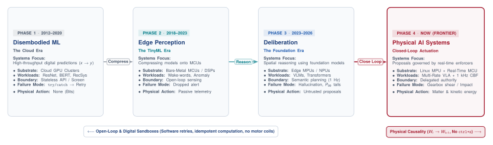

# The Causal Boundary: Matter, Momentum, and the Co-Design Challenge

{#fig-locator-ch01 width=100%}

::: {.callout-objective}
By the conclusion of this chapter, you will be able to:

1. **Formulate the Causal Feedback Boundary:** Contrast digital open-loop computation ($y = f(x)$) with closed-loop physical irreversibility ($A_t \to W_{t+1} \to O_{t+1}$), proving why software cannot undo kinetic energy or thermal dissipation.
2. **Quantify Physical Invariants:** Calculate physical limits across kinetic momentum ($\mathbf{p} = m\mathbf{v}$), winding Joule heating ($I^2 R$), actuator saturation, and gear backlash.
3. **Architect the Proposal–Permission Privilege Split:** Separate untrusted, stochastic neural policies on Linux application processors (MPU) from deterministic, bare-metal safety supervisors on microcontrollers (MCU) across hardware bus firewalls.
4. **Navigate the Physical AI Curriculum Blueprint:** Trace the 3-part progression from foundations through the 5-stage embodied lifecycle to heterogeneous placement and defensible release.
5. **Apply the Physical AI Co-Design Matrix:** Navigate the 20-cell grand matrix crossing physical constraints (Columns: Time, Inertia, Jerk, Silicon) with cognitive agency (Rows: Perceive, Remember, Reason, Plan, Execute).
6. **Freeze the Loop Charter (`LOOP-01`):** Author the foundational specification in the Cumulative Design Dossier establishing non-negotiable physical safety invariants, timing budgets, and authority boundaries.
:::

::: {.callout-autopsy}
* **System:** 6-DoF Articulated Tabletop Manipulator (Vision-Language-Action Policy).
* **Incident:** Manipulator end-effector crushed an aluminum calibration fixture at $1.2\text{ m/s}$, shearing wrist cycloidal gearbox drive pins ($850\text{ USD}$ hardware replacement).
* **Telemetry Snapshot:** The Linux application processor (MPU) emitted a motor current target vector at $T+12.410\text{ s}$. At $T+12.412\text{ s}$, an unhandled lighting reflection caused a zero-detection exception in an open-vocabulary detector; the Python runtime threw an uncaught `ValueError` and crashed.
* **Root Cause:** Memory-mapped timer peripherals operate on an independent silicon clock tree (`PCLK`). When the Linux kernel terminated the crashed user-space process, it reclaimed virtual memory pages but left timer capture/compare registers (`TIMx_CCRx`) latched at $78\%$ duty cycle. The inverter continued driving phase current into motor stator windings until mechanical impact.
* **Architectural Flaw:** Monolithic authority—learned software held direct electrical control over motor timer registers without an independent, real-time safety permission supervisor on dedicated silicon.
* **Provenance:** Engineered composite. The mechanism and the failure path are drawn from documented incident classes; the system, telemetry, and costs are constructed for teaching and are not a report of a specific event.

:::

::: {.callout-contract}
| Component | Authority and Substrate | Contract Specification |
| :--- | :--- | :--- |
| **What the MPU Proposes (System 2 / 1.5)** | *Untrusted · Stochastic · Linux MPU* | • Candidate action chunk: $\mathbf{a}_{t:t+H} \in \mathbb{R}^{H \times D}$<br>• Expiring Intent Lease: $\mathcal{L}_{\text{intent}} = \langle \mathbf{T}_{\text{target}}, \mathcal{B}, \dot{\mathbf{x}}_{\text{max}}, t_{\text{issue}}, \Delta t_{\text{TTL}} \rangle$<br>• Zero direct electrical authority over motor gate drivers |
| **What the MCU Permits (System 1)** | *Trusted · Deterministic · Bare-Metal MCU* | • Validates physical invariants: joint limits, velocity bounds, stopping distance ($d_{\text{stop}} \le d_{\text{clear}}$)<br>• Projects proposals onto forward-invariant safe set: $h(\mathbf{x}) \ge 0$<br>• Sole privilege to write PWM registers and toggle gate enable (`EN_GATE`) |
| **Failure Escalation** | *MCU Hardware Reflex* | On lease expiration ($\Delta t > \tau_{\text{watchdog}}$), communication stall, or invariant breach, MCU revokes PWM and executes IEC 60204-1 Category 1 dynamic braking halt $\to$ Safe Torque Off (STO). |
:::

::: {.callout-note icon=false}
**The Sim-to-Real Delta:**
* **What Simulation Assumes:** Actions are instantaneous mathematical state assignments ($s_{t+1} = f(s_t, a_t)$); physics resets cleanly via `env.reset()`; motor torques appear without inductive lag; collisions produce numeric scalar penalties without hardware deformation.
* **What the Bench Measures:** Electrical energy converts to kinetic momentum through non-linear magnetic fields; motor windings accumulate Joule heat ($I^2 R$); gearboxes exhibit backlash and tooth wear; DMA ring buffers contend for shared DRAM bandwidth; collisions shear physical drive pins.
:::

---

## Crossing the Threshold: From Pure Logic to Physical Action

For most programmers and machine learning practitioners, writing software is an act of pure symbolic manipulation. You sit at a desk, define data structures, train neural networks in PyTorch, write unit tests, and compile binaries. The computer's memory is a private, forgiving realm. If an algorithm contains a logic bug, throws an unhandled exception, or runs out of memory, the consequences remain safely contained behind glass: an error log appears on your terminal, a debugger pauses at a breakpoint, or a cloud container quietly restarts.

In this digital universe, you can always undo your mistakes. State can be snapshotted, transactions can be rolled back, and dropped packets can be retried across a network connection.

**Physical AI Systems begin at the exact moment software crosses the boundary into the physical world.**

The moment you connect that same Python script to the gate drivers of an electric motor inverter, the steering rack of a delivery rover, or the proportional valve of a hydraulic actuator, the variables in your code cease to be abstract bits in RAM. A floating-point number emitted by a neural policy is directly transduced into pulse-width modulated (PWM) switching sequences loaded into hardware timer registers. These gate signals switch 3-phase MOSFET bridges across a DC power bus, driving amperes of phase current through copper stator windings to generate magnetic flux that accelerates kilograms of aluminum, steel, and glass through three-dimensional space.

The instant computation moves matter, the comforting guarantees of digital software vanish:

$$\text{Digital World: } \text{Software Exception} \xrightarrow{\quad \text{try/catch} \quad} \text{HTTP 500 Retry} \quad (W_t \text{ Unchanged})$$

$$\text{Physical AI: } \text{Actuation } A_t \implies \text{Matter and Momentum Mutate } (W_t \longrightarrow W_{t+1}) \implies O_{t+1}$$

In the physical world, there is no `try/catch` block for kinetic momentum ($\mathbf{p} = m\mathbf{v}$). If an electric motor accelerates an arm toward a rigid fixture, the mechanism accumulates kinetic energy that cannot be undone by software.^[For an articulated $n$-link manipulator, the total kinetic energy is $E_k = \frac{1}{2}\dot{\mathbf{q}}^T \mathbf{M}(\mathbf{q})\dot{\mathbf{q}}$, where $\mathbf{M}(\mathbf{q})$ is the configuration-dependent generalized inertia tensor. Even if motor drive commands drop to zero, velocity decays only through physical friction, counter-torques, or impact.] If an inverter commands excessive continuous current, copper stator coils accumulate irreversible Joule heat ($I^2 R$) that degrades insulation and demagnetizes permanent magnets.^[The thermal rise in motor windings follows the energy balance $\Delta T(t) = \int_{0}^{t} \frac{I^2(\tau) R - \Delta T(\tau) / R_{\text{th}}}{C_{\text{th}}} \, d\tau$, where $R_{\text{th}}$ and $C_{\text{th}}$ are the thermal resistance and capacitance of the stator assembly. While brief transient spikes are absorbed safely by $C_{\text{th}}$, steady-state current must remain strictly below the continuous rating $I_{\text{cont}}$.] **You cannot `ctrl+z` kinetic energy.**

To understand why traditional software engineering patterns break down in physical systems, consider what happened in our opening Incident Autopsy: when an application processor crashes, the operating system cleans up user-space virtual memory, but hardware timer state machines on the memory bus continue pulsing gate drivers at their last written duty cycle. In physical systems, software crashes do not de-energize copper coils.

---

## The Three On-Ramps: Crossing the Systems Chasm

Physical AI sits at the convergence of three distinct engineering traditions. Practitioners enter this discipline from three different backgrounds—each possessing essential strengths, yet each challenged by a critical systems blind spot (@fig-three-tribes):

{#fig-three-tribes width=100%}

| Dimension | ML and AI (The "Brain") | Embedded and ECE (The "Nervous System") | Robotics and Control (The "Body") |
| :--- | :--- | :--- | :--- |
| **Familiar Mental Anchor** | PyTorch, Linux, tensors, foundation models, simulation | C/C++, FreeRTOS, memory-mapped I/O, timers, PWM | Dynamics, kinematics ($SE(3)$), PIDs, gearboxes, torques |
| **The Critical Blindspot** | *The Digital Sandbox Illusion:* Assuming simulation proof guarantees safety and software exceptions are harmless. | *The Static Automation Illusion:* Treating systems as rigid, rule-based loops unable to parse unstructured open worlds. | *The Closed-World Illusion:* Distrusting learned models as black boxes; assuming the environment can be fully modeled in CAD. |
| **The "Aha!" Systems Breakthrough** | An OS process crash does **not** zero hardware registers; timer PWM runs in silicon indefinitely until an independent MCU supervisor vetoes power. | How to host multi-gigabyte foundation models as untrusted MPU proposal services without compromising real-time MCU timing. | You do not reject learned models—you cage them inside real-time $1000\text{ Hz}$ Control Barrier Functions on the MCU. |

: The Three Engineering On-Ramps. Contrasting the background assumptions, critical blind spots, and breakthrough insights of the converging disciplines. {#tbl-three-tribes}

* **For the Computer Science and Machine Learning Practitioner:** You are accustomed to the assumption that computation is stateless or sandboxed. In Physical AI, you will learn why average inference latency is a dangerous metric compared to tail latency ($P_{99}$), how memory bus contention from camera streaming spikes neural runtime, and why stochastic model outputs must be isolated from physical power stages.
* **For the Electrical Engineering and Embedded Systems Practitioner:** You are accustomed to deterministic microcontrollers, state machines, and classical PID control. While classical control provides mathematical determinism, it relies on hand-engineered state estimators that fail in unstructured, open-world environments (e.g., picking deformable items under variable warehouse lighting). Physical AI embraces high-capacity neural representations to parse unstructured environments, but strictly confines their candidate proposals within real-time mathematical safety envelopes.
* **For the Robotics and Mechanical Engineering Practitioner:** You are accustomed to rigid kinematic chains, CAD tolerances, and conservative feedback gains. While classical robotics guarantees stability in calibrated workcells, it cannot generalize to open-vocabulary natural language tasks or novel object geometries. Physical AI provides the semantic intelligence needed for open-world autonomy, while using Control Barrier Functions to guarantee that physical invariants (stopping distances, jerk limits, thermal thresholds) are never breached.

{#fig-eras-evolution width=100%}

---

## The Causal Feedback Loop and Irreversibility

What distinguishes a Physical AI system from digital machine learning, classical automation, or simple embedded sensors? We formulate the formal definition:

::: {.callout-definition title="Physical AI Systems"}
**Physical AI Systems** is the systems engineering discipline for machines where learned foundation models exercise delegated physical authority across the analog–digital boundary under irreversible physical laws and hard real-time constraints.

Unlike digital ML systems, every permitted physical action irreversibly mutates the state of the physical world ($W_t \to W_{t+1}$) and endogenously alters all future sensory observations ($A_t \to W_{t+1} \to O_{t+1}$).
:::

### The Three Universal Defining Properties of Physical AI

Across every embodiment—from high-profile humanoid robots to deep energy infrastructure—three universal properties define a **Physical AI System** and distinguish it from digital machine learning and classical automation:

1. **A Learned Foundation Component (Generalization over Variability):**  
   The system does not rely exclusively on hardcoded if-then rules or pre-programmed CAD trajectories; it employs learned foundation models (Vision-Language-Action models, Latent World Models, Diffusion Policies) to generalize over unstructured, open-world physical environments.
2. **Operations Across the Analog $\longleftrightarrow$ Digital Boundary (Transducing Bits to Fluxes):**  
   Digital computations (discrete clock ticks, token embeddings, tensor matrices) directly command continuous analog energy fluxes (3-phase motor inverters, PWM gate drivers, hydraulic valves, magnetic flux, chemical reaction rates).
3. **Governed by Irreversible Physical Laws (Zero `ctrl+z`):**  
   Every permitted action permanently mutates matter and energy in the physical universe ($W_t \to W_{t+1}$). If an algorithm hallucinates or experiences a latency tail spike, it cannot `ctrl+z`—it risks physical collisions, sheared gear teeth, thermal runaway ($I^2R$), or human injury.

---

### The Three Canonical Archetypes of Physical AI

To make the physics and systems engineering universal and teachable, we distill every physical machine into three canonical interaction archetypes that will serve as recurring case studies throughout this book (@tbl-canonical-archetypes):

| Dimension | Archetype 1: Locomotion & Mobility | Archetype 2: Contact Manipulation | Archetype 3: Cybernetic Energy & Process |
| :--- | :--- | :--- | :--- |
| **Physical Interaction** | Moving in Free Space | Touching & Shaping Matter | Regulating Continuous State Flows |
| **Primary Physical Law** | Inertial Momentum ($\mathbf{p} = m\mathbf{v}$) & Stopping Kinematics | Contact Forces, Friction & Torque Derivatives ($\dot{\boldsymbol{\tau}}$) | Thermodynamics ($I^2R$ Heat) & Energy Conservation |
| **Primary Silicon Tension**| High-speed sensory DMA & $P_{99}$ latency tails | Multi-rate trajectory IPC & $\mathcal{C}^2$ jerk continuity | ADC sampling latency & hard thermal safe sets |
| **Real-World Anchors** | • Humanoid Walking<br>• Autonomous Cars (Waymo)<br>• Flying Drones (Skydio) | • Dexterous Manipulators<br>• Humanoid Hands (Optimus)<br>• Surgical Robotic Tools | • EV Battery Thermal Management<br>• Smart Grid Inverters<br>• Closed-Loop Medical Infusion |
| **Role in the Curriculum** | Teaches Time, Freshness, Stopping Distance & Latency Tails | **The Primary Teaching Spine & Desk Lab Kit** (Arduino UNO Q) | Proves Physical AI spans the entire Analog–Digital Seam! |

: The Three Canonical Archetypes of Physical AI. Grounding every physical system into three universal interaction regimes. {#tbl-canonical-archetypes}

1. **Archetype 1: Locomotion & Free-Space Mobility (The Moving Body):**  
   The system moves its own mass through 3D space ($\mathbf{p} = m\mathbf{v}$). The dominant physical constraint is **stopping distance and the freshness wall**: if latency spikes by even $100\text{ ms}$, stopping distance expands by meters ($d_{\text{stop}} = v \cdot \Delta t + \frac{v^2}{2a}$). We will see this in autonomous vehicles (Waymo), high-speed delivery drones (Skydio), and quadruped scouts (Spot).
2. **Archetype 2: Contact Manipulation & Tool Interaction (The Shaping Hand):**  
   The system touches, grasps, cuts, or deforms external matter in $SE(3)$. The dominant physical constraint is **contact stiffness, friction ($\mu$), and torque derivatives ($\dot{\boldsymbol{\tau}}$)**: step-wise neural waypoints create infinite torque rates that shear gear teeth. This serves as our **primary teaching spine and desk lab kit** (the 6-DoF arm on the Arduino UNO Q dual-brain kit), as well as humanoid hands (Optimus, Figure) and surgical tools.
3. **Archetype 3: Cybernetic Process & Energy Regulation (The Regulated Substrate):**  
   The system regulates continuous analog states without spatial movement—governed by thermodynamics ($I^2R$), fluid pressure, and electrochemistry. This proves that Physical AI is far larger than robotics: an autonomous EV battery thermal management system, a smart grid inverter balancing renewable intermittency, or a closed-loop artificial pancreas are all Physical AI agents where learned models command physical safety invariants.


### Digital Agents vs. Physical Agents: The Irreversibility Boundary

In modern computing, the term *agent* has become ubiquitous. Software engineers build **digital agents**—large language models wired to web scrapers, code interpreters, database APIs, and conversational user interfaces. While digital agents demonstrate impressive emergent reasoning, they operate entirely within forgiving, virtual sandboxes. When a digital agent fails, the runtime raises an exception, the cloud container restarts, transactions roll back, and the client retries the request.

A **Physical Agent** operates under fundamentally different laws (@tbl-digital-vs-physical). When a physical agent acts, its outputs do not return JSON—they switch pulse-width-modulated (PWM) gate drivers, accelerate kilograms of mechanical mass, draw amperes of current across inductive coils, and permanently mutate the environment.

| Dimension | The Digital Agent (Cloud and Software) | The Physical Agent (Physical AI) |
| :--- | :--- | :--- |
| **Operational Realm** | Virtual sandboxes, APIs, browsers, databases | Physical matter, 3D space, kinetic energy ($W_t \to W_{t+1}$) |
| **Execution Medium** | Python runtimes, cloud VMs, serverless containers | Heterogeneous silicon: Linux MPU + Bare-Metal Real-Time MCU |
| **Error Handling** | `try/catch` exceptions, HTTP 500 retries, transactional rollbacks | **Zero `ctrl+z`**: collisions, Joule heat ($I^2R$), stripped gearboxes |
| **Time Model** | Turn-based, asynchronous, unbounded wait states | Continuous real-time, microsecond freshness ($\Delta t$), $P_{99}$ latency tails |
| **Action Authority** | Emits JSON, tool calls, or text tokens | Emits PWM gate switching, motor torques, and physical force |
| **Safety Paradigm** | Guardrails, prompt filters, schema validation | **Control Barrier Invariants**, stopping bounds ($d_{\text{stop}}$), hardware power interlocks |

: Digital Agents versus Physical Agents. Fundamental systems differences across execution, time, authority, and safety regimes. {#tbl-digital-vs-physical}

### The Universal Definition of Success in Physical AI

In digital machine learning, performance is evaluated along a single statistical dimension: average test accuracy or loss over a dataset. In classical automation, performance is evaluated along a single deterministic dimension: invariant satisfaction within a structured, unchanging workcell.

In **Physical AI Systems**, success is inherently **dual and non-negotiable**:

$$\text{Physical AI Success} = \underbrace{\text{Semantic Competence}}_{\text{Task achieved from pixels}} \quad \mathbf{AND} \quad \underbrace{\text{Physical Invariant Survival}}_{\text{Zero collisions or hardware damage}}$$

A vision-language-action model that successfully grasps a target object 99 times out of 100, but shears a cycloidal gearbox or strikes a human operator on the 100th attempt, is a **failed system ($0\%$ release viability)**. Physical AI systems engineering is the discipline of maximizing semantic competence while mathematically guaranteeing that catastrophic invariant violations cannot occur.

### The Causal Boundary Criterion

To establish whether an engineering system operates within the domain of Physical AI, we apply our three-part test:

| System Type | 1. Learned Model? | 2. Analog-Digital Boundary? | 3. Irreversible Laws ($W_{t+1}$)? | Domain Classification |
| :--- | :---: | :---: | :---: | :--- |
| **Industrial PLC Controller** | No (PID / State Logic) | Yes (Inverters) | Yes | Classical Deterministic Automation |
| **Diagnostic Radiology AI** | Yes (Vision Transformer) | No (Screen only) | No | Advisory Digital Software |
| **Teleoperated Surgical Robot** | Yes (Vision Filtering) | Yes (Motorized) | Yes | Shared-Control Teleoperation |
| **Autonomous Robotic Arm** | Yes (VLA Diffusion Policy) | Yes (Inverters) | Yes | **Physical AI System (Archetype 2)** |
| **Autonomous Vehicle / Drone** | Yes (Learned Trajectory Planner) | Yes (Motor ESCs) | Yes | **Physical AI System (Archetype 1)** |
| **Smart Grid Inverter Controller** | Yes (Learned Load Predictor) | Yes (AC Inverters) | Yes | **Physical AI System (Archetype 3)** |

: The Causal Boundary Classification. Establishing the three-property test separating advisory software and classical automation from Physical AI. {#tbl-causal-boundary}

If an algorithm generates bounding boxes on a screen for a human security operator to inspect, it is an **Advisory System**. The instant that software directly commands a motorized pan-tilt gimbal or energizes an automated door interlock without human confirmation, it crosses the **Causal Boundary**.


### The Physical AI Embodiment Spectrum

Although benchtop manipulators and mobile rovers provide visible experimental embodiments, **Physical AI Systems is not a robotics-only discipline**. Rather, Physical AI is the universal systems engineering discipline for *any machine where learned software exercises delegated authority over matter and energy* (@tbl-embodiment-spectrum).

Across every physical domain, the exact same architectural contract applies: high-capacity learned models running on application processors act as **untrusted proposal services**, while deterministic real-time supervisors hold **permission authority** over hardware inverters, relays, and valves.

| Embodiment Domain | Untrusted Proposal Engine (MPU / GPU) | Physical Matter and Energy ($W_t \to W_{t+1}$) | Trusted Permission Authority (MCU / FPGA) |
| :--- | :--- | :--- | :--- |
| **Autonomous Mobility and Aerospace** | Neural trajectory planner and vision backbone | Kinetic momentum, steering angle, tire friction ($\mu$) | ASIL-D brake-by-wire and steering envelope supervisor |
| **Smart Grid and High-Voltage Energy** | Learned battery dispatch and load predictor | Mega-joule current flow, thermal inverter heating | Microsecond hardware over-current and thermal relay interlock |
| **Active Medical Cybernetics** | Neural glucose and drug rate predictor | Insulin volume, biochemical blood concentration | Hard-limited stepper motor clamp and dose rate watchdog |
| **Precision Advanced Manufacturing** | Vision transformer toolpath and laser router | High-speed spindle torque, laser beam thermal fluence | Axis limit switch enforcer and optical E-stop watchdog |
| **Autonomous Robotics** | VLA diffusion action chunk decoder | Joint torque, linkage inertia, contact force | 1 kHz bare-metal Control Barrier Function (CBF) |

: The Physical AI Embodiment Spectrum. Demonstrating how the Proposal–Permission architecture applies across diverse physical engineering domains. {#tbl-embodiment-spectrum}

### Policy Endogeneity and Compounding Error

In digital machine learning, datasets are assumed independent and identically distributed ($i.i.d.$). In Physical AI, the system is locked in an endogenous causal loop:

$$A_t \longrightarrow W_{t+1} \longrightarrow O_{t+1}$$

Every action $A_t$ mutates the world state into $W_{t+1}$, which directly generates the subsequent sensor observation $O_{t+1}$. 

In standard supervised learning, test error scales linearly with time $\mathcal{O}(T \epsilon)$. In sequential physical systems, however, a small steering mistake pushes the machine into an unfamiliar state outside its training distribution. The neural policy makes an even larger error, compounding rapidly into a catastrophic divergence that scales quadratically with horizon length $\mathcal{O}(T^2 \epsilon)$ [@ross2011reduction]. 

Furthermore, when an MCU safety supervisor overrides a dangerous proposal, it alters the physical trajectory. If telemetry logs these override transitions without explicitly tagging them as safety interventions, retraining on raw logs causes the AI model to learn that dangerous trajectories are nominal behavior. Slicing and tagging these interventions is a central governance requirement formalized in Chapter 10.

---

## Matter, Momentum, and Energy: Physical Constraints in Silicon and Steel

Why can we not simply deploy a PyTorch foundation model onto a robot and call it an autonomous machine? What makes Physical AI a distinct, rigorous systems engineering discipline?

When software leaves the epistemic sandbox of the datacenter and interacts with physical matter, four unyielding physical realities emerge:

### 1. Kinetic Momentum and Mechanical Inertia ($\mathbf{p} = m\mathbf{v}$)

In digital software, a running loop can be paused immediately with a breakpoint or a `sleep()` call. In the physical realm, physical mass $m$ moving at velocity $\mathbf{v}$ carries kinetic momentum $\mathbf{p} = m\mathbf{v}$ and kinetic energy:

$$E_k = \frac{1}{2} m \|\mathbf{v}\|^2 \quad \text{or for articulated linkages: } E_k = \frac{1}{2} \dot{\mathbf{q}}^T \mathbf{M}(\mathbf{q}) \dot{\mathbf{q}}$$

where $\mathbf{M}(\mathbf{q})$ is the configuration-dependent generalized inertia tensor. 

If an application processor freezes, physical momentum continues to carry the mechanism forward along its trajectory. The moving mass will not stop until physical counter-torques decelerate it, mechanical friction absorbs the energy, or it collides with a rigid fixture. **Software cannot instantly zero kinetic energy.**

### 2. Joule Heating and Thermal Accumulation ($I^2 R$)

Driving motor current $I(t)$ across stator winding resistance $R$ produces continuous thermal dissipation:

$$Q(t) = \int_{0}^{t} I^2(\tau) R \, d\tau$$

While copper coils and stator iron tolerate brief acceleration bursts (absorbing transient heat into their thermal capacitance $C_{\text{th}}$), steady-state current must remain strictly below the continuous current rating $I_{\text{cont}}$. If a software bug or controller stall commands continuous stall current for even two seconds, winding temperatures exceed the $85^\circ\text{C}$ insulation derating knee, permanently melting enamel coatings and demagnetizing neodymium rotor magnets.

### 3. Electromagnetic Actuation and Inductive Rise Time

In idealized simulation, software commands torque $\tau_t$ and it appears instantaneously. In real silicon and copper, motor phase current cannot change instantaneously due to stator winding inductance $L$:

$$V(t) = R I(t) + L \frac{dI(t)}{dt} + K_e \omega(t)$$

where $K_e \omega(t)$ is the back-electromotive force (back-EMF) generated by rotor rotation. 

The electrical time constant $\tau_e = L / R$ introduces an inescapable $5\text{--}15\text{ ms}$ electrical rise time before commanded current produces physical magnetic flux. Furthermore, back-EMF limits the maximum obtainable torque at high rotational speeds, enforcing a hard voltage saturation boundary.

### 4. Mechanical Non-Idealities: Backlash, Compliance, and Jerk

Real mechanical transmissions are not rigid mathematical linkages:
* **Gear Tooth Backlash ($\theta_{\text{backlash}}$):** Cycloidal and harmonic drives exhibit angular deadbands ($0.5\text{--}3\text{ arcmin}$) where motor rotation produces zero output torque until tooth contact is re-established.
* **Gearbox Tooth Shear:** Discontinuous torque commands (infinite torque derivative $\dot{\boldsymbol{\tau}} \to \infty$, or acceleration jerk $\dddot{\mathbf{q}}$) create high-frequency shock waves that chip gearbox teeth and shear alignment pins.
* **Contact Compliance:** When an arm strikes a surface, the impact force scales with the stiffness of the contact interface ($F = k \Delta x$). Without sub-millisecond reflex loops, rigid impacts generate peak forces exceeding $10\times$ the structural rating of the arm.

| Physical Phenomenon | Software Assumption (Simulation) | Physical Reality (The Bench) | Systems Impact |
| :--- | :--- | :--- | :--- |
| **Momentum ($\mathbf{p} = m\mathbf{v}$)** | Velocity can be set to $0$ instantaneously | Mass requires finite deceleration distance $d_{\text{stop}}$ | Collision if latency spike delays braking command |
| **Joule Heating ($I^2 R$)** | Unlimited peak torque available | Windings overheat at $T > 85^\circ\text{C}$; demagnetization | Software stall current melts motor stator coils |
| **Inductance ($\tau_e = L/R$)** | Torque responds in $0\text{ ms}$ | Current rises exponentially ($5\text{--}15\text{ ms}$ rise time) | Phase lag degrades high-speed closed-loop stability |
| **Gear Backlash ($\theta_{\text{bl}}$)** | Continuous kinematic chain | Discontinuous contact deadband ($1\text{--}3\text{ arcmin}$) | Limit-cycle oscillation during directional reversals |
| **Jerk ($\dddot{\mathbf{q}}$)** | Step changes in acceleration allowed | Infinite jerk causes mechanical shock and vibration | Sheared cycloidal drive pins and gear tooth fatigue |

: Digital Software Assumptions versus Physical Hardware Realities. The physical constraints that software cannot ignore. {#tbl-software-vs-physics}

---

## The Proposal–Permission Privilege Split: Decoupling Cognition from Control

A common misconception in modern deep learning is the **Monolithic Fallacy**: the belief that scaling a single end-to-end multimodal neural network (e.g., raw pixels in $\to$ raw motor PWM out) will eliminate the need for classical control systems, real-time operating systems, and hardware safety supervisors.

From a systems engineering perspective, the monolithic model violates fundamental principles of fault containment, privilege separation, and real-time determinism [@saltzer1984end; @brooks1986robust]:

1. **Stochasticity vs. Determinism:** Neural networks are statistical function approximators. Under rare lighting shifts, occlusions, or out-of-distribution scenes, a model will eventually output an erratic action vector. Connecting neural weights directly to motor timer registers guarantees eventual hardware destruction.
2. **Scheduling Jitter vs. Real-Time Deadlines:** Application operating systems (Linux, Android) prioritize throughput over latency determinism. Memory page faults, garbage collection, and thread preemption cause multi-millisecond tail spikes ($P_{99} > 100\text{ ms}$). A physical motor loop executing at $1000\text{ Hz}$ cannot tolerate a $100\text{ ms}$ scheduling blackout.
3. **Fault Containment:** If a user-space Python process crashes (as in the Latent Runaway Actuator autopsy), the motor power stage must be safely controlled by an independent processor that remains fully operational.

{#fig-anatomy width=100%}

### The Two-Brain Architecture

We resolve this tension by splitting the computing substrate into two distinct execution tiers across a hardware bus firewall (@fig-anatomy):

* **The Untrusted Proposal Engine (Linux MPU / NPU):**
  * Runs high-capacity learned models: Multimodal VLMs for semantic reasoning ($0.5\text{--}2\text{ Hz}$) and Diffusion Action Chunking policies ($20\text{--}50\text{ Hz}$).
  * Operates in rich virtual memory with dynamic memory allocation (`malloc`, PyTorch tensors).
  * Emits time-bounded, candidate action proposals ($p_t$) across a shared SRAM mailbox.
  * **Holds zero direct electrical authority over motor gate drivers.**

* **The Trusted Permission Authority (Bare-Metal MCU):**
  * Runs a deterministic $1000\text{ Hz}$ safety supervisor (System 1) and a $20\text{ kHz}$ Field-Oriented Control (FOC) current loop (Tier 0).
  * Executes in zero-wait-state static SRAM with **zero dynamic heap allocation** (`malloc` strictly forbidden).
  * Evaluates formal **Control Barrier Functions (CBFs)** [@ames2019control] and dynamic stopping envelopes ($d_{\text{stop}} \le d_{\text{clearance}}$), projecting candidate proposals onto a forward-invariant safe set:
    $$u_t = \arg\min_{u \in \mathcal{U}_{\text{safe}}} \|u - p_t\|^2$$
  * **Holds exclusive hardware authority over motor PWM timer registers and hardware gate enable lines (`EN_GATE`).**

| Dimension | Untrusted Proposal Engine (MPU / Linux) | Trusted Permission Authority (MCU / FreeRTOS) |
| :--- | :--- | :--- |
| **Compute Substrate** | Multi-core ARM Cortex-A + NPU (Arduino UNO Q MPU) | Single-core ARM Cortex-M / RISC-V (UNO Q MCU) |
| **Operating System** | Linux (Preempt-RT / Non-deterministic) | Bare-metal / FreeRTOS (Deterministic) |
| **Memory Architecture** | 2 GB LPDDR4 DRAM (Shared UMA Bus) | 256 KB Zero-Wait-State SRAM / TCM (No Heap) |
| **Workloads** | ViT Encoders, JEPAs, VLMs, Diffusion ACT | Control Barrier Invariants, Watchdogs, FOC |
| **Timing Horizon** | $20\text{ ms} \text{ to } 2000\text{ ms}$ ($0.5\text{--}50\text{ Hz}$) | $1\text{ ms} \pm 5\,\mu\text{s}$ ($1000\text{ Hz}$) |
| **Memory Allocation** | Dynamic heap (`malloc`, PyTorch tensors) | Statically allocated SRAM buffers only |
| **Physical Privilege** | Untrusted (No direct actuator access) | **Trusted (Sole motor gate driver authority)** |

: Processor Dimension Comparison. Detailed systems contrast between the application processor and real-time microcontroller. {#tbl-processor-comparison}

### Silicon-Level Privilege Isolation

In heterogeneous dual-brain SoCs (such as the Arduino UNO Q platform), the Linux application core (Cortex-A) and real-time core (Cortex-M) share the same silicon die. Privilege separation is enforced at the silicon bus level:

1. **Hardware Peripheral Firewalls:** Advanced motor timers (`TIM1_CCR1-3`, `TIM1_BDTR`) and gate-driver enable GPIOs are locked to the Cortex-M domain via hardware bus firewalls (ARM TrustZone / Resource Isolation Framework), rendering them bus-inaccessible to Linux user space.
2. **Lock-Free Inter-Core Mailbox:** The MPU communicates with the MCU via a shared, non-cacheable SRAM ring buffer with hardware mailbox interrupts (IPCC) and monotonic 32-bit atomic sequence counters.

---

## The Physical AI Curriculum and Chapter Blueprint

To master this discipline, the textbook follows a backward-designed 11-chapter pedagogical spine organized into three distinct parts (@fig-curriculum-blueprint):

{#fig-curriculum-blueprint width=100%}

### Part I: Foundations and the Co-Design Matrix (Chapters 1–3)
* **Chapter 1 (The Causal Boundary):** Establishes the physical laws of matter, momentum, and heat, introduces the Proposal–Permission Split, and unveils the grand Co-Design Matrix. Freezes `LOOP-01`.
* **Chapter 2 (The Physical Constraints):** Traces every microsecond across the 7-stage Latency Ledger, derives dynamic stopping distance ($d_{\text{stop}}$), and proves why $P_{99}$ latency tails govern survival. Freezes `REQ-01`.
* **Chapter 3 (The Cognitive Dimensions):** Formalizes the 5-stage cognitive lifecycle, populates the complete 20-cell Co-Design Matrix, and implements the multi-rate inter-core runtime. Freezes `FLOW-01`.

### Part II: The 5-Stage Embodied Lifecycle (Chapters 4–8)
Part II resolves the Co-Design Matrix row by row, building each cognitive organ on real bench silicon:
* **Chapter 4 (Stage 1: Perceive):** Transforms raw photons into 3D metric spatial affordance tokens in $SE(3)$, budgets the pre-inference DMA ingestion tax, and eliminates motion blur and rolling shutter shear. Freezes `OBS-01`.
* **Chapter 5 (Stage 2: Remember):** Builds latent predictive world models (JEPAs) and $SE(3)$ dynamic frame trees, bounding state uncertainty drift under visual occlusions with expiring validity leases. Freezes `STATE-01`.
* **Chapter 6 (Stage 3: Reason):** Deploys multimodal VLMs for open-world semantic deliberation at $1\text{ Hz}$, decoupling slow inference from fast control via Expiring Intent Leases ($\mathcal{L}_{\text{intent}}$). Freezes `INTENT-01`.
* **Chapter 7 (Stage 4: Plan):** Implements Diffusion Policies and Action Chunking with Transformers (ACT), amortizing compute latency and enforcing quintic $\mathcal{C}^2$ jerk continuity to protect mechanical gearboxes. Freezes `PLAN-01`.
* **Chapter 8 (Stage 5: Execute):** Builds the $1000\text{ Hz}$ zero-heap bare-metal MCU safety enforcer, executing real-time Control Barrier Function Quadratic Programs (CBF-QP) and Safe Torque Off (STO). Freezes `ENF-01`.

### Part III: Placement, Governance, and Release (Chapters 9–11 and Capstone 99)
* **Chapter 9 (Heterogeneous Silicon Placement):** Maps neural models, state estimators, and safety filters across MPU, NPU, MCU, and SRAM domains, managing UMA memory bus QoS. Freezes `PLACE-01`.
* **Chapter 10 (Human Governance and Lineage):** Coordinates bumpless human teleoperation overrides and implements intervention data slicing to prevent policy covariate shift. Freezes `AUTH-01`.
* **Chapter 11 (Defensible System Assurance):** Applies STPA hazard analysis and builds the 4-Rung Assurance Ladder to construct a formal Claim-Argument-Evidence (CAE) safety case. Freezes `REL-01`.
* **Chapter 99 (Capstone Bench Defense):** The live capstone trial—defending the complete physical AI handling system under seeded real-time faults, memory stress, and physical obstacles.

---

## Unveiling the Physical AI Co-Design Matrix

The centerpiece of this textbook is the **Physical AI Co-Design Matrix** (@fig-codesign-matrix). It establishes the permanent architectural compass crossing **Physical Constraints (Chapter 2 Columns)** with **Cognitive Agency (Chapter 3 Rows)**:

{#fig-codesign-matrix width=100%}

### The 4 Columns: Physical Reality (Chapter 2 Constraints)

1. **Column 1: Time and Freshness ($\Delta t_{\text{wall}}, P_{99}$):** The physical world sets the clock. Sensory evidence decays over elapsed information age $\Delta t$, bounded by the Freshness Wall ($\Delta t_{\text{wall}}$) and tail latency spikes.
2. **Column 2: Inertia and Stopping ($\mathbf{p} = m\mathbf{v}, d_{\text{stop}}$):** Moving mass carries kinetic momentum. The system must continuously guarantee that dynamic stopping distance does not exceed remaining physical clearance ($d_{\text{stop}} \le d_{\text{clearance}}$).
3. **Column 3: Jerk and Actuation ($\dot{\boldsymbol{\tau}}, \dddot{\mathbf{q}}, I^2 R$):** Electrical and mechanical actuation limits. High torque rates chip gearbox teeth; continuous stall currents melt motor stator coils.
4. **Column 4: Silicon Determinism and UMA Bus:** Shared memory bandwidth contention, DMA stream saturation, zero dynamic heap allocation in real-time ISR loops.

### The 5 Rows: Cognitive Agency (The Embodied Lifecycle)

Every row represents one stage of the 5-stage embodied lifecycle, resolving its tensions against all four physical constraint columns:

1. **Stage 1: Perceive (Chapter 4):**
   * *vs. Time:* Optical exposure latency ($t_{\text{exp}}$) and PTP cross-sensor hardware synchronization.
   * *vs. Inertia:* Motion blur smear ($\Delta x_{\text{blur}} = \|\mathbf{v}\| \cdot t_{\text{exp}}$) destroying sub-millimeter grasp accuracy.
   * *vs. Jerk:* Rolling shutter geometric distortion under high angular velocity $\boldsymbol{\omega}$.
   * *vs. Silicon:* $1.5\text{ GB/s}$ camera DMA write bursts saturating UMA DRAM crossbar interconnects.
2. **Stage 2: Remember (Chapter 5):**
   * *vs. Time:* Unobserved state belief age decay bounded by Time-to-Live leases ($\Delta t_{\text{TTL}}$).
   * *vs. Inertia:* Occlusion spatial uncertainty drift ($\sigma(t) = \sigma_0 + \|\mathbf{v}_{\text{target}}\| \Delta t$) expanding collision volumes.
   * *vs. Jerk:* Motor stator $I^2 R$ winding temperature drift derating available actuator torque.
   * *vs. Silicon:* $SE(3)$ transform tree graph lookup latencies cached in zero-wait-state SRAM.
3. **Stage 3: Reason (Chapter 6):**
   * *vs. Time:* Slow deliberation latency ($1\text{ Hz}$) decoupled from control via asynchronous proposal streams.
   * *vs. Inertia:* Kinematic reachability bounds filtering out unreachable 3D target coordinates.
   * *vs. Jerk:* Operational velocity clamping ($\|\mathbf{v}\| \le v_{\text{max}}$) embedded into semantic intent leases.
   * *vs. Silicon:* Expiring Intent Leases ($\mathcal{L}_{\text{intent}}$) falling back to safe hold on communication loss.
4. **Stage 4: Plan (Chapter 7):**
   * *vs. Time:* Action chunk horizon ($H = 16$) amortizing neural compute latency ($t_{\text{amort}} = t_{\text{infer}} / H$).
   * *vs. Inertia:* Receding-horizon temporal ensembling preventing end-of-chunk kinematic stalls.
   * *vs. Jerk:* Quintic polynomial $\mathcal{C}^2$ jerk splines eliminating high-frequency gearbox shock.
   * *vs. Silicon:* Lock-free SRAM chunk ring buffers bridging $20\text{ Hz}$ MPU planners to $1000\text{ Hz}$ MCU loops.
5. **Stage 5: Execute (Chapter 8):**
   * *vs. Time:* Deterministic $1000\text{ Hz}$ tick with execution jitter bounded to $<15\,\mu\text{s}$.
   * *vs. Inertia:* Continuous dynamic stopping evaluation ($d_{\text{stop}} \le d_{\text{clearance}}$) triggering IEC 60204-1 dynamic halts.
   * *vs. Jerk:* Hardware Safe Torque Off (STO) relays and gate enable lines under sole MCU authority.
   * *vs. Silicon:* Bare-metal zero-heap Control Barrier Function QP solver projecting proposals in $<400\,\mu\text{s}$.

---

## Systems Fallacies and Pitfalls

::: {.callout-warning}
### Common Engineering Fallacies in Physical AI
* **Fallacy 1: The Digital Sandbox Fallacy.**  
  *Assumption:* Software exceptions are harmless because the OS will catch the error and the runtime can retry the request.  
  *Physical Reality:* Silicon timer peripherals operate on independent hardware clock trees. When user-space crashes, PWM compare registers remain latched, driving continuous power into motor coils until mechanical destruction.
* **Fallacy 2: The Monolithic End-to-End Fallacy.**  
  *Assumption:* Scaling a single neural network to predict raw PWM gate switching directly from pixels eliminates classical control and RTOS supervisors.  
  *Physical Reality:* Learned models are stochastic and suffer from out-of-distribution hallucinations and OS scheduling tail latency spikes ($P_{99} > 100\text{ ms}$). Dedicated MCU permission supervisors are required to enforce physical safety invariants.
* **Fallacy 3: The Average Throughput Fallacy.**  
  *Assumption:* Achieving 60 FPS average inference speed guarantees real-time safety.  
  *Physical Reality:* An autonomous machine moving at $2.0\text{ m/s}$ executes 180,000 cycles per hour. A single $P_{99.9}$ latency spike of $250\text{ ms}$ causes the machine to travel $0.50\text{ meters}$ completely blind before its next action.
* **Fallacy 4: The Simulation-to-Real Equivalence Fallacy.**  
  *Assumption:* If a reinforcement learning or VLA policy achieves $99.9\%$ success in MuJoCo or Isaac Sim, it is ready for unconstrained deployment on bench hardware.  
  *Physical Reality:* Simulators assume rigid bodies, instantaneous torque generation, and zero thermal accumulation. Real hardware exhibits stator inductance lag, cycloidal gearbox backlash, UMA memory bus contention, and irreversible thermal wear.
:::

---

::: {.callout-decision}
### Dossier Delta: Loop Charter (`LOOP-01`)

Every chapter in this book freezes an industrial-grade engineering specification for the **Cumulative Design Dossier**. In Chapter 1, we establish the foundational **Loop Charter (`LOOP-01`)**, defining the physical limits, causal boundaries, and authority hierarchy of our reference platform:

#### System Boundary and Silicon Privilege Split

| Subsystem Domain | Processor and Trust Tier | Cadence and Memory Boundary | Granted Physical Authority |
| :--- | :--- | :--- | :--- |
| **Proposal Engine** | ARM Cortex-A Linux (MPU)<br>*UNTRUSTED_PROPOSAL_SERVICE* | $1\text{ Hz}$ VLM $\to$ $20\text{ Hz}$ ACT Policy<br>2 GB LPDDR4 (Shared UMA) | **Zero electrical authority** over inverters; emits expiring proposals ($p_t$) with $\text{TTL} \le 100\text{ ms}$. |
| **Permission Authority** | Bare-Metal MCU (Cortex-M / RISC-V)<br>*TRUSTED_PERMISSION_SUPERVISOR* | $1000\text{ Hz}$ CBF Enforcer $\to$ $20\text{ kHz}$ FOC<br>256 KB Static SRAM (Zero Heap) | **Sole hardware veto**; controls physical gate enable (`EN_GATE`), watchdog lease ($\tau_{\text{watchdog}} \le 10\text{ ms}$). |

: System Boundary and Silicon Privilege Split. Codifying the hardware execution domains and authority boundaries in `LOOP-01`. {#tbl-loop-privilege}

#### Non-Negotiable Safety Invariants (`LOOP-01`)

| Invariant ID | Title | Safety Specification and Limits | Enforcement Mechanism |
| :--- | :--- | :--- | :--- |
| **`INV-01-STOP`** | Two-Stage Emergency Deceleration | Heartbeat timeout ($>10\text{ ms}$) triggers IEC 60204-1 SS1 dynamic halt ($t_{\text{stop}} \le 12.4\text{ ms}$) $\to$ STO. | Hardware Timer and GPIO |
| **`INV-02-CBF`** | Forward Invariance via Barrier Functions | Every proposal $p_t$ is projected onto safe set $\mathcal{C}$ at $1000\text{ Hz}$; out-of-envelope commands clamped. | Real-Time QP Solver |
| **`INV-03-RT`** | Zero Dynamic Heap Allocation | Zero dynamic allocations (`malloc`/`free`) permitted in $1\text{ kHz}$ loop or $20\text{ kHz}$ ISR. All buffers static in SRAM. | Static Allocator and Linter |
| **`INV-04-THERMAL`** | Joule Heating and $I^2t$ Protection | Continuous current clamped to $I_{\text{cont}} \le 4.2\text{ A}$; transient peaks up to $8.5\text{ A}$ bounded by thermal integral. | Current Controller ISR |
| **`INV-05-KINEMATICS`**| Hard Joint and Velocity Envelopes | $q_{\text{min}} + \delta \le q_t \le q_{\text{max}} - \delta$ and $\|\dot{\mathbf{q}}\| \le \dot{q}_{\text{max}}$ enforced at all times. | Geometric Enforcer |
| **`INV-06-JERK`** | Gearbox Stress and Jerk Clamping | Commanded torque rate $\|\dot{\boldsymbol{\tau}}\| \le \dot{\tau}_{\text{max}}$ and jerk $\|\dddot{\mathbf{q}}\| \le 120\text{ rad/s}^3$ to prevent tooth shear. | Rate Limiter |
| **`INV-07-FRESH`** | Monotonic Sequencing and Latency TTL | Reject action chunks with age $\Delta t > 100\text{ ms}$ or non-monotonic sequence counters; hold position. | Communication Watchdog |
| **`INV-08-PREEMPT`** | Bumpless Human Preemption | Hardware E-Stop and manual joystick deflection signals preempt MPU proposals within $t \le 1.0\text{ ms}$. | Hardware GPIO Interrupt |

: Non-Negotiable Safety Invariants (`LOOP-01`). The eight fundamental physical safety invariants enforced by the real-time microcontroller. {#tbl-loop-invariants}

```yaml
# ==============================================================================
# PHYSICAL AI SYSTEMS DESIGN DOSSIER: ARTIFACT LOOP-01
# SPECIFICATION: LOOP CHARTER & NON-NEGOTIABLE SAFETY INVARIANTS
# ==============================================================================
dossier_version: "1.0.0"
artifact_id: "LOOP-01"
chapter_reference: "01-boundary"
system_name: "PhysicalAI-DualBrain-HandlingPlatform"

system_boundary:
  proposal_service:
    substrate: "ARM Cortex-A55 (MPU) @ 1.5 GHz + 4 TOPS NPU"
    os: "Embedded Linux 6.6 (PREEMPT_RT)"
    memory: "2 GB LPDDR4 (Shared UMA Bus)"
    trust_tier: "UNTRUSTED_PROPOSAL_SERVICE"
    granted_authority: "NONE (Candidate action proposals only)"
    max_proposal_ttl_ms: 100

  permission_authority:
    substrate: "ARM Cortex-M4 (MCU) @ 168 MHz"
    os: "Bare-Metal / FreeRTOS 10.5"
    memory: "256 KB Zero-Wait-State SRAM (Zero Heap)"
    trust_tier: "TRUSTED_PERMISSION_SUPERVISOR"
    granted_authority: "EXCLUSIVE_ACTUATOR_PWM_AND_GATE_ENABLE"
    control_tick_hz: 1000
    watchdog_timeout_ms: 10

safety_invariants:
  - id: "INV-01-STOP"
    name: "Two-Stage Emergency Deceleration"
    specification: "SS1 dynamic halt within 12.4 ms upon heartbeat loss, followed by STO"
    enforcement: "HARDWARE_TIMER_AND_RELAY"

  - id: "INV-02-CBF"
    name: "Forward Invariance via Control Barrier Functions"
    specification: "h(x) >= 0 for all states; minimal-intervention QP projection at 1000 Hz"
    enforcement: "BARE_METAL_QP_SOLVER"

  - id: "INV-03-RT"
    name: "Zero Dynamic Heap Allocation"
    specification: "malloc/free forbidden in 1 kHz control loop and 20 kHz ISR"
    enforcement: "STATIC_MEMORY_MAP_AND_LINTER"

  - id: "INV-04-THERMAL"
    name: "Joule Heating and I2t Current Clamping"
    specification: "Continuous current <= 4.2 A, peak current <= 8.5 A, winding temp <= 85 C"
    enforcement: "FOC_CURRENT_CONTROLLER_ISR"

  - id: "INV-05-KINEMATICS"
    name: "Hard Joint Position and Velocity Limits"
    specification: "q_min + delta <= q <= q_max - delta, ||q_dot|| <= q_dot_max"
    enforcement: "GEOMETRIC_ENFORCER"

  - id: "INV-06-JERK"
    name: "Gearbox Jerk Clamping"
    specification: "Torque rate ||tau_dot|| <= tau_dot_max, jerk ||q_triple_dot|| <= 120 rad/s^3"
    enforcement: "QUINTIC_SPLINE_RATE_LIMITER"

  - id: "INV-07-FRESH"
    name: "Monotonic Sequence and TTL Freshness"
    specification: "Reject proposals older than 100 ms or with out-of-order sequence ID"
    enforcement: "SRAM_MAILBOX_WATCHDOG"

  - id: "INV-08-PREEMPT"
    name: "Bumpless Human Preemption"
    specification: "Manual joystick deflection preempts autonomous policy in <= 1.0 ms"
    enforcement: "HARDWARE_GPIO_INTERRUPT"
```
:::

---

## Hands-On Bench Laboratory: `labs/01-close-the-loop`

::: {.callout-lab title="Lab 1: Closing the Causal Loop"}
* **Objective:** Prove on the Arduino UNO Q dual-brain hardware kit that closing the physical loop introduces irreversible state mutation ($A_t \to W_{t+1} \to O_{t+1}$) and freeze the `LOOP-01` Loop Charter.
* **Phenomenon:** Run the vision policy in **Advisory Mode** (rendering proposed trajectories on a screen without motor authority) versus **Actuating Mode** (energizing the 3-DoF actuator power rail under MCU supervision).
* **Observation:** In Advisory Mode, external physical perturbations to the environment do not affect the dataset stream. In Actuating Mode, every permitted motor current command physically displaces the mechanism, endogenously altering all subsequent camera frames and encoder readings.
* **Measurement:** Measure the sensory-motor response latency from camera exposure to shaft displacement, and record the physical trajectory deviation under an external physical obstacle.
* **Dossier Milestone:** Author, validate, and freeze the `LOOP-01` YAML charter in your team's Cumulative Design Dossier.
:::

---

## Summary and What Comes Next

In this chapter, we crossed the Causal Boundary into Physical AI:

1. **Digital Idempotency vs. Physical Irreversibility:** Software bits can be rolled back; physical momentum ($\mathbf{p} = m\mathbf{v}$), Joule heating ($I^2 R$), and mechanical wear cannot.
2. **The 3-Criterion Causal Boundary:** A system enters Physical AI when it combines learned models, delegated authority, and irreversible physical state mutation ($W_t \to W_{t+1}$).
3. **The Proposal–Permission Split:** Proved why monolithic deep learning architectures fail on physical hardware, isolating untrusted proposal engines (Linux MPU) from deterministic 1 kHz safety enforcers (bare-metal MCU) via silicon bus firewalls.
4. **The Curriculum Blueprint:** Mapped the 11-chapter backward-designed spine across Foundations (Part I), the Embodied Lifecycle (Part II), and Placement and Governance (Part III).
5. **The Co-Design Matrix:** Unveiled the permanent 2D compass crossing physical constraints (Time, Inertia, Jerk, Silicon) with cognitive agency (Perceive, Remember, Reason, Plan, Execute).
6. **Dossier Artifact `LOOP-01`:** Formalized the system boundary, timing tiers, and 8-invariant safety suite in the Cumulative Design Dossier.

In **Chapter 2 (Time, Freshness, and Latency)**, we put physical clocks on every microsecond of this pipeline: tracing photons from camera exposure through DMA transfer, neural inference, and IPC buffers to prove why mean latency is a dangerous lie and how information freshness ($\Delta t$) dictates dynamic stopping distance ($d_{\text{stop}}$).
