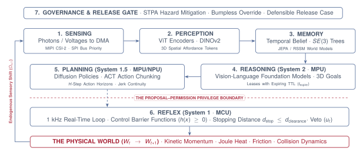

# Physical Causality

{#fig-locator-ch01 width=100%}

::: {.callout-objective}
By the conclusion of this chapter, you will be able to:

1. **Formulate the Causal Boundary:** Contrast digital software idempotency (`try/catch`) with physical irreversibility ($W_t \to W_{t+1}$) governed by mass, momentum, and heat.
2. **Define Physical AI Systems:** Apply the formal 3-criterion boundary separating advisory ML from systems exercising delegated physical authority.
3. **Map the Embodiment Spectrum:** Apply the Proposal–Permission architecture across robotics, mobility, smart energy grids, and medical devices.
4. **Decompose the 7 Agent Organs:** Trace sensory-motor signals—from vision tokens ($SE(3)$) and latent world models to intent leases, action chunks (ACT), and real-time reflex loops.
5. **Architect the Proposal–Permission Split:** Isolate untrusted stochastic neural models (Linux MPU) from deterministic real-time supervisors (bare-metal MCU) using hardware bus firewalls.
6. **Freeze the Loop Charter (`LOOP-01`):** Author the foundational YAML specification of the Cumulative Design Dossier establishing physical limits, timing budgets, and safety invariants.
:::

---

## Crossing the Threshold: From Pure Logic to Physical Action

For most programmers and machine learning practitioners, writing software is an act of pure symbolic manipulation. You sit at a desk, define data structures, train neural networks in PyTorch, write unit tests, and compile binaries. The computer's memory is a private, forgiving realm. If an algorithm contains a logic bug, throws an unhandled exception, or runs out of memory, the consequences remain safely contained behind glass: an error log appears on your terminal, a debugger pauses at a breakpoint, or a cloud container quietly restarts.

In this digital universe, you can always undo your mistakes. State can be snapshotted, transactions can be rolled back, and dropped packets can be retried across a network connection.

**Physical AI Systems begin at the exact moment software crosses the boundary into the physical world.**

The moment you connect that same Python script to the gate drivers of an electric motor inverter, the steering rack of a delivery rover, or the proportional valve of a hydraulic actuator, the variables in your code cease to be abstract bits in RAM. A floating-point number emitted by a neural policy is directly transduced into pulse-width modulated (PWM) switching sequences loaded into hardware timer registers. These gate signals switch 3-phase MOSFET bridges across a DC power bus, driving amperes of phase current through copper stator windings to generate magnetic flux that accelerates kilograms of aluminum, steel, and glass through three-dimensional space.

The instant computation moves matter, the comforting guarantees of digital software vanish:

$$\text{Digital World: } \text{Software Exception} \xrightarrow{\quad \text{try/catch} \quad} \text{HTTP 500 Retry} \quad (W_t \text{ Unchanged})$$

$$\text{Physical AI: } \text{Actuation } A_t \implies \text{Matter \& Momentum Mutate } (W_t \longrightarrow W_{t+1}) \implies O_{t+1}$$

In the physical world, there is no `try/catch` block for kinetic momentum ($\mathbf{p} = m\mathbf{v}$). If an electric motor accelerates an arm toward a rigid fixture, the mechanism accumulates kinetic energy that cannot be undone by software.^[For an articulated $n$-link manipulator, the total kinetic energy is $E_k = \frac{1}{2}\dot{\mathbf{q}}^T \mathbf{M}(\mathbf{q})\dot{\mathbf{q}}$, where $\mathbf{M}(\mathbf{q})$ is the configuration-dependent generalized inertia tensor. Even if motor drive commands drop to zero, velocity decays only through physical friction, counter-torques, or impact.] If an inverter commands excessive continuous current, copper stator coils accumulate irreversible Joule heat ($I^2 R$) that degrades insulation and demagnetizes permanent magnets.^[The thermal rise in motor windings follows the energy balance $\Delta T(t) = \int_{0}^{t} \frac{I^2(\tau) R - \Delta T / R_{\text{th}}}{C_{\text{th}}} \, d\tau$, where $R_{\text{th}}$ and $C_{\text{th}}$ are the thermal resistance and capacitance of the stator assembly. While brief transient spikes are absorbed safely by $C_{\text{th}}$, steady-state current must remain strictly below the continuous rating $I_{\text{cont}}$.] **You cannot `ctrl+z` kinetic energy.**

To understand why traditional software engineering patterns break down in physical systems, consider what happens when a modern vision-action model encounters a common software crash on real bench hardware:

::: {.callout-autopsy title="The Latent Runaway Actuator"}
* **System:** 6-DoF Articulated Tabletop Manipulator (Vision-Language-Action Policy)
* **Incident:** End-effector crushed an aluminum calibration fixture at $1.2\text{ m/s}$; sheared wrist cycloidal gearbox drive pins ($850\text{ USD}$ hardware replacement).
* **Telemetry Snapshot:** The Linux application processor (MPU) emitted a motor current target vector at $T+12.410\text{ s}$. At $T+12.412\text{ s}$, an unhandled lighting reflection caused a zero-detection exception in an open-vocabulary bounding box detector; the Python runtime threw an uncaught `ValueError` and crashed.
* **Root Cause:** In silicon, memory-mapped timer peripherals operate on an independent clock tree. When the Linux kernel tore down the user-space Python process, it reclaimed virtual memory but did not zero the hardware compare registers. The PWM timer remained latched at $78\%$ duty cycle, continuously driving gate pulses into the inverter without an independent supervisor to cut power.
* **Architectural Flaw:** Monolithic authority—learned software held direct electrical control over motor timer registers without an independent, real-time safety permission supervisor.
:::

To software engineers accustomed to operating system sandboxes, this failure reveals a crucial hardware reality: **silicon timer peripherals run autonomously**.^[In ARM Cortex and STM32 architectures, advanced timer capture/compare registers (`TIMx_CCRx`) run on the peripheral clock domain (`PCLK`) independently of the main processor core (`HCLK`). Linux process termination frees `task_struct` and user memory pages, but does not reset peripheral hardware registers without an explicit driver shutdown hook or an independent hardware supervisor.] When an application process crashes, the operating system cleans up user-space virtual memory, but hardware timer state machines on the memory bus continue pulsing gate drivers at their last written duty cycle. In physical systems, software crashes do not de-energize copper coils.

---

## The Three On-Ramps to Physical AI

Physical AI sits at the convergence of three distinct engineering traditions. Practitioners enter this discipline from three different backgrounds—each possessing essential strengths, yet each challenged by a critical systems blind spot:

| Dimension | ML / AI (The "Brain") | Embedded / ECE (The "Nervous System") | Robotics & Control (The "Body") |
| :--- | :--- | :--- | :--- |
| **Familiar Mental Anchor** | PyTorch, Linux, tensors, foundation models, simulation | C/C++, FreeRTOS, memory-mapped I/O, timers, PWM | Dynamics, kinematics ($SE(3)$), PIDs, gearboxes, torques |
| **The Critical Blindspot** | *The Digital Sandbox Illusion:* Assuming simulation proof guarantees safety and software exceptions are harmless. | *The Static Automation Illusion:* Treating systems as rigid, rule-based loops unable to parse unstructured open worlds. | *The Closed-World Illusion:* Distrusting learned models as black boxes; assuming the environment can be fully modeled in CAD. |
| **The "Aha!" Systems Breakthrough** | An OS process crash does **not** zero hardware registers; timer PWM runs in silicon indefinitely until an independent MCU supervisor vetoes power. | How to host multi-gigabyte foundation models as untrusted MPU proposal services without compromising real-time MCU timing. | You don't reject learned models—you cage them inside real-time $1000\text{ Hz}$ Control Barrier Functions on the MCU! |

* **For the Computer Science / Machine Learning Practitioner:** You are accustomed to the assumption that computation is stateless or sandboxed. In Physical AI, you will learn why average inference latency is a dangerous metric compared to tail latency ($P_{99}$), how memory bus contention from camera streaming spikes neural runtime, and why stochastic model outputs must be isolated from physical power stages.
* **For the Electrical Engineering / Embedded Systems Practitioner:** You are accustomed to deterministic microcontrollers, state machines, and classical PID control. While classical control provides mathematical determinism, it relies on hand-engineered state estimators that fail in unstructured, open-world environments (e.g., picking deformable items under variable warehouse lighting). Physical AI embraces high-capacity neural representations to parse unstructured environments, but strictly confines their candidate proposals within real-time mathematical safety envelopes.
* **For the Robotics and Mechanical Engineering Practitioner:** You are accustomed to rigid kinematic chains, CAD tolerances, and conservative feedback gains. While classical robotics guarantees stability in calibrated workcells, it cannot generalize to open-vocabulary natural language tasks or novel object geometries. Physical AI provides the semantic intelligence needed for open-world autonomy, while using Control Barrier Functions to guarantee that physical invariants (stopping distances, jerk limits, thermal thresholds) are never breached.

---

## Defining Physical AI Systems

What distinguishes a Physical AI system from digital machine learning, classical automation, or simple embedded sensors? We formulate the formal definition:

::: {.callout-definition title="Physical AI Systems"}
**Physical AI Systems** is the systems engineering discipline for machines where learned components exercise delegated physical authority over matter and energy under hard real-time constraints.

Unlike digital ML systems, every permitted physical action irreversibly mutates the state of the physical world ($W_t \to W_{t+1}$) and endogenously alters all future sensory observations ($A_t \to W_{t+1} \to O_{t+1}$).
:::

### The Universal Definition of Success in Physical AI

In digital machine learning, performance is evaluated along a single statistical dimension: average test accuracy or loss over a dataset. In classical automation, performance is evaluated along a single deterministic dimension: invariant satisfaction within a structured, unchanging workcell.

In **Physical AI Systems**, success is inherently **dual and non-negotiable**:

$$\text{Physical AI Success} = \underbrace{\text{Semantic Competence}}_{\text{Task achieved from pixels}} \quad \mathbf{AND} \quad \underbrace{\text{Physical Invariant Survival}}_{\text{Zero collisions or hardware damage}}$$

A vision-language-action model that successfully grasps a target object 99 times out of 100, but shears a cycloidal gearbox or strikes a human operator on the 100th attempt, is a **failed system ($0\%$ release viability)**. Physical AI systems engineering is the discipline of maximizing semantic competence while mathematically guaranteeing that catastrophic invariant violations cannot occur.

### Digital Agents vs. Physical Agents: The Irreversibility Boundary

In modern computing, the term *agent* has become ubiquitous. Software engineers build **digital agents**—large language models wired to web scrapers, code interpreters, database APIs, and conversational user interfaces. While digital agents demonstrate impressive emergent reasoning, they operate entirely within forgiving, virtual sandboxes. When a digital agent fails, the runtime raises an exception, the cloud container restarts, transactions roll back, and the client retries the request.

A **Physical Agent** operates under fundamentally different laws. When a physical agent acts, its outputs do not return JSON—they switch pulse-width-modulated (PWM) gate drivers, accelerate kilograms of mechanical mass, draw amperes of current across inductive coils, and permanently mutate the environment.

| Dimension | The Digital Agent (Cloud / Software) | The Physical Agent (Physical AI) |
| :--- | :--- | :--- |
| **Operational Realm** | Virtual sandboxes, APIs, browsers, databases | Physical matter, 3D space, kinetic energy ($W_t \to W_{t+1}$) |
| **Execution Medium** | Python runtimes, cloud VMs, serverless containers | Heterogeneous silicon: Linux MPU + Bare-Metal Real-Time MCU |
| **Error Handling** | `try/catch` exceptions, HTTP 500 retries, transactional rollbacks | **Zero `ctrl+z`**: collisions, Joule heat ($I^2R$), stripped gearboxes |
| **Time Model** | Turn-based, asynchronous, unbounded wait states | Continuous real-time, microsecond freshness ($\Delta t$), $P_{99}$ latency tails |
| **Action Authority** | Emits JSON, tool calls, or text tokens | Emits PWM gate switching, motor torques, and physical force |
| **Safety Paradigm** | Guardrails, prompt filters, schema validation | **Control Barrier Invariants**, stopping bounds ($d_{\text{stop}}$), hardware power interlocks |

::: {.callout-definition title="The Physical Agent"}
**A Physical Agent** is an autonomous computational system that couples learned, open-world semantic models to real-time physical actuators, exercising delegated authority over matter and energy under hard physical constraints, non-zero mass, and bounded latency.
:::

### The Causal Boundary Criterion

To establish whether an engineering system operates within the domain of Physical AI, we apply a strict three-part test:

1. **Learned Proposal Shaping:** The system uses learned representations (neural networks, vision transformers, diffusion decoders) to translate unstructured sensory observations into candidate physical action proposals.
2. **Delegated Physical Authority:** The machine possesses autonomous authority to energize actuators without requiring synchronous human confirmation for each individual millisecond control cycle.
3. **Irreversible State Mutation ($W_t \to W_{t+1}$):** Actuator commands transduce electrical power into kinetic force, torque, pressure, or heat that permanently alters the physical environment.

| System Type | Learned Model? | Actuator Authority? | Autonomous Loop? | Domain Classification |
| :--- | :---: | :---: | :---: | :--- |
| **Industrial PLC Controller** | No (PID / State Logic) | Yes | Yes | Classical Deterministic Automation |
| **Diagnostic Radiology AI** | Yes (Vision Transformer) | No (Screen only) | No | Advisory Digital Software |
| **Teleoperated Surgical Robot** | Yes (Vision Filtering) | Yes (Motorized) | No (Human master) | Shared-Control Teleoperation |
| **Autonomous Robotic Arm** | Yes (VLA Diffusion Policy) | Yes (Inverters) | Yes | **Physical AI System** |
| **Autonomous Mobile Robot / Drone** | Yes (Learned Trajectory Planner) | Yes (Motor ESCs) | Yes | **Physical AI System** |

If an algorithm generates bounding boxes on a screen for a human security operator to inspect, it is an **Advisory System**. The instant that software directly commands a motorized pan-tilt gimbal or energizes an automated door interlock without human confirmation, it crosses the **Causal Boundary**.

### The Physical AI Embodiment Spectrum

Although benchtop manipulators and mobile rovers provide visible experimental embodiments, **Physical AI Systems is not a robotics-only discipline**. Rather, Physical AI is the universal systems engineering discipline for *any machine where learned software exercises delegated authority over matter and energy*.

Across every physical domain, the exact same architectural contract applies: high-capacity learned models running on application processors act as **untrusted proposal services**, while deterministic real-time supervisors hold **permission authority** over hardware inverters, relays, and valves.

| Embodiment Domain | Untrusted Proposal Engine (MPU / GPU) | Physical Matter & Energy ($W_t \to W_{t+1}$) | Trusted Permission Authority (MCU / FPGA) |
| :--- | :--- | :--- | :--- |
| **Autonomous Mobility & Aerospace** | Neural trajectory planner & vision backbone | Kinetic momentum, steering angle, tire friction ($\mu$) | ASIL-D brake-by-wire & steering envelope supervisor |
| **Smart Grid & High-Voltage Energy** | Learned battery dispatch & load predictor | Mega-joule current flow, thermal inverter heating | Microsecond hardware over-current & thermal relay interlock |
| **Active Medical Cybernetics** | Neural glucose & drug rate predictor | Insulin volume, biochemical blood concentration | Hard-limited stepper motor clamp & dose rate watchdog |
| **Precision Advanced Manufacturing** | Vision transformer toolpath & laser router | High-speed spindle torque, laser beam thermal fluence | Axis limit switch enforcer & optical E-stop watchdog |
| **Autonomous Robotics** | VLA diffusion action chunk decoder | Joint torque, linkage inertia, contact force | 1 kHz bare-metal Control Barrier Function (CBF) |

Across all five domains, three inescapable systems truths govern the machine:

1. **Physical Irreversibility:** Software bits can be rolled back; energy and matter cannot. An over-infused drug dose, a tripped high-voltage substation breaker, or an autonomous vehicle sliding across ice are permanent, non-reversible state mutations.
2. **The Freshness Law ($P_{99}$):** The physical environment changes continuously. The safety of a power grid inverter, a surgical tool, or a delivery rover is governed not by average execution speed, but by tail latency ($P_{99}$) and sensory staleness ($\Delta t$).
3. **Privilege Separation:** Stochastic models must never hold direct electrical authority over power electronics without an independent, deterministic supervisor.

---

## What Makes Physical AI Systems Hard?

Why can we not simply deploy a PyTorch foundation model onto a robot and call it an autonomous machine? What makes Physical AI a distinct, rigorous systems engineering discipline?

When software leaves the epistemic sandbox of the datacenter and interacts with physical matter, four inescapable physical realities emerge:

### 1. Physical Irreversibility and Momentum Accumulation ($\mathbf{p} = m\mathbf{v}, I^2 R$)
In software engineering, developers rely on transactional rollbacks, `try/catch` handlers, and container restarts. In the physical world, mass carries momentum and electrical current dissipates thermal energy:

* **Momentum Accumulation:** When an autonomous mechanism is moving, physical inertia carries the mass forward along its trajectory. If an application processor freezes, physical momentum continues to drive the mechanism until counter-torque decelerates it or it strikes an obstacle.
* **Thermal Energy Accumulation ($I^2 R$):** Driving motor current $I(t)$ across stator winding resistance $R$ produces continuous thermal dissipation. While copper coils tolerate brief acceleration bursts, a software glitch commanding continuous stall current for even a fraction of a second melts winding insulation and demagnetizes rotor magnets. **You cannot `ctrl+z` kinetic energy.**

### 2. The Time Law and Information Freshness ($\Delta t, P_{99}$)
In digital web serving, if a query takes $20\text{ ms}$ or $200\text{ ms}$, the answer is still valid. In the physical world, **the environment does not pause for computation**. 

Sensor data decays the microsecond photons hit the camera sensor. A camera frame capturing an obstacle is already stale ($\Delta t$) by the time neural tensor operations complete. Furthermore, mean latency is a dangerous metric: a robot's dynamic stopping distance ($d_{\text{stop}}$) is dictated by the **tail latency ($P_{99}, P_{99.9}$)**:

$$d_{\text{stop}}(v_t) = v_t \cdot \Delta t_{\text{tail}} + \frac{v_t^2}{2 a_{\text{brake}}}$$

where complete-path tail latency aggregates across hardware and software tiers:

$$\Delta t_{\text{tail}} = t_{\text{exposure}} + t_{\text{dma}} + t_{\text{infer}}^{(P_{99})} + t_{\text{ipc}} + t_{\text{enforce}} + \tau_{\text{electrical}}$$

If tail latency spikes due to memory bus contention or garbage collection, stopping distance expands, causing catastrophic collisions.

### 3. Policy Endogeneity and Compounding Feedback Loops
In digital ML, datasets are assumed independent and identically distributed ($i.i.d.$). In Physical AI, the system is locked in an endogenous causal loop:

$$A_t \longrightarrow W_{t+1} \longrightarrow O_{t+1}$$

Every action $A_t$ mutates the world state into $W_{t+1}$, which directly generates the subsequent sensor observation $O_{t+1}$. 

In standard supervised learning, test error scales linearly with time. In sequential physical systems, however, a small steering mistake pushes the machine into an unfamiliar state outside its training distribution. The neural policy makes an even larger error, compounding rapidly into a catastrophic divergence.^[In sequential decision making, compounding distribution shift scales quadratically with horizon length $\mathcal{O}(T^2 \epsilon)$, as formalized in reduction frameworks like DAgger [@ross2011reduction].] Furthermore, when an MCU safety supervisor overrides a dangerous proposal, it alters the physical trajectory. If telemetry logs these override transitions without explicitly tagging them as safety interventions, retraining on raw logs causes the AI model to learn that dangerous trajectories are nominal behavior.

### 4. Heterogeneous Multi-Rate Asynchrony
A physical agent operates across four distinct temporal tiers:

| Tier | Subsystem Function | Frequency / Period | Silicon & Execution Domain |
| :--- | :--- | :--- | :--- |
| **Tier 0** | Inner FOC Current Loop | $10\text{--}25\text{ kHz}$ ($40\text{--}100\,\mu\text{s}$) | Dedicated Timer ISR / ADC-DMA |
| **Tier 1** | Real-Time Reflex (CBF) | $1000\text{ Hz}$ ($1\text{ ms}$) | Bare-Metal MCU / TCM SRAM |
| **Tier 2** | Action Chunking (ACT) | $20\text{--}50\text{ Hz}$ ($20\text{--}50\text{ ms}$) | MPU NPU / PyTorch TensorRT |
| **Tier 3** | Semantic Deliberation | $0.5\text{--}2\text{ Hz}$ ($500\text{--}2000\text{ ms}$) | MPU VLM / Foundation Model |

Coupling these asynchronous temporal scales safely without race conditions or starvation requires dedicated multi-rate systems architecture.

::: {.callout-note title="The Sim-to-Real Delta" icon=false}
* **What Simulation Assumes:** Actions are instantaneous mathematical assignments ($s_{t+1} = f(s_t, a_t)$); physics resets cleanly via `env.reset()`; motor torques appear without inductive lag; collisions produce numeric scalar penalties without hardware deformation.
* **What the Bench Measures:** Electrical energy converts to kinetic momentum through non-linear magnetic fields; motor windings accumulate Joule heat ($I^2 R$); gearboxes exhibit backlash and wear; DMA ring buffers contend for shared DRAM bandwidth; collisions shear physical drive pins.
:::

---

## The Anatomy of a Physical AI Agent

::: {.callout-note title="The Architectural Blueprint" icon=false}
The seven organs below define the comprehensive systems map for the entire textbook. Each upcoming chapter will isolate, benchmark, and implement one organ at a time on bench hardware.
:::

To address these physical challenges systematically, we structure the agent into **Seven Canonical Pipeline Organs**. Rather than treating these organs as abstract mathematical equations, we trace each organ directly down to its physical silicon, memory buses, electrical signals, and mechanical dynamics:

{#fig-anatomy width=100%}

### Stage 1: Sensing and Ingestion (Photons to DMA)
Analog phenomena—photons hitting photodiode wells, magnetic fields inducing Hall voltages, strain gauges flexing under contact pressure—are transduced and streamed across MIPI CSI-2, SPI, or I2C buses into Direct Memory Access (DMA) ring buffers. This stage incurs a measurable **pre-inference memory bus tax**: continuous DMA transactions contend with neural accelerators and CPU cores for Unified Memory Architecture (UMA) bandwidth, introducing non-deterministic latency jitter before a single neural weight is computed.

### Stage 2: Perception and Vision Encoders (Tensors to 3D Affordance Tokens)
High-dimensional raw image frames ($1920 \times 1080 \times 3$) are ingested by vision backbones such as Vision Transformers (ViT) [@dosovitskiy2020image] and self-supervised feature extractors like DINOv2 [@oquab2023dinov2]. Rather than emitting passive semantic text labels, the perception engine lifts 2D visual patch tokens into metric 3D space using calibrated camera geometry and depth fields. This compresses millions of raw pixels into compact **3D spatial affordance tokens**—contact point distributions, surface normals, obstacle bounding volumes, and grasp approach vectors in three-dimensional coordinate space ($SE(3)$).

### Stage 3: World Models and Temporal State (Latent Belief and Frame Trees)
Because physical sensors suffer from optical glare, occlusions, and asynchronous transport jitter, an acting machine cannot operate under memoryless Markovian assumptions. Instead, the agent maintains an internal world model. 

Rejecting computationally prohibitive pixel-generation pipelines (which cost hundreds of milliseconds and risk non-physical visual hallucinations), the state organ leverages latent predictive architectures—such as Joint Embedding Predictive Architectures (JEPA) [@lecun2022path; @assran2023self] and Recurrent State Space Models (RSSM) [@ha2018worldmodels; @hafner2023mastering]. The world model predicts future latent transitions directly in compact representation space with fixed computational cost ($<5\text{ ms}$), filtering out task-irrelevant visual entropy. It maintains continuous $SE(3)$ coordinate frame trees, tracks spatial uncertainty, bounds state staleness via Time-to-Live (TTL) leases, and estimates proprioceptive joint dynamics.

### Stage 4: Semantic Deliberation and Intent (System 2: 1 Hz VLMs)
Running on the application processor (MPU), multimodal Vision-Language Models (VLMs) and spatial reasoning transformers [@brohan2023rt2] interpret natural language instructions (*"sort the damaged bearings into the red bin"*) against open-vocabulary scene context. Due to autoregressive token generation and large parameter footprints ($7\text{B}\text{--}70\text{B}$ weights), System 2 operates at a deliberate frequency ($0.5\text{--}2\text{ Hz}$) with heavy tail latencies ($P_{99} > 500\text{ ms}$). It emits time-bounded **Expiring Intent Leases**:

$$\mathcal{L}_{\text{intent}} = \left\langle \mathbf{T}_{\text{target}} \in SE(3), \; \mathcal{B}_{\text{workspace}} \subset \mathbb{R}^3, \; \dot{\mathbf{x}}_{\text{max}}, \; t_{\text{issue}}, \; \Delta t_{\text{TTL}} \right\rangle$$

System 2 holds zero direct electrical authority over actuators.

### Stage 5: Trajectory Decoders and Action Chunking (System 1.5: 20–50 Hz)
The trajectory generator decodes high-level semantic intent into continuous joint waypoint trajectories. Utilizing modern embodied paradigms—specifically **Diffusion Policy** [@chi2023diffusionpolicy] and **Action Chunking with Transformers (ACT)** [@zhao2023learning]—the policy predicts an action chunk of $H$ future waypoints in parallel. 

Action chunking breaks the single-step Markovian latency bottleneck, creates an asynchronous execution buffer for the real-time core, and models complex multimodal trajectory distributions without mode collapse. Receding-horizon temporal ensembling with $\mathcal{C}^2$ jerk continuity smooths overlapping trajectory chunks to protect mechanical linkages and cycloidal gearboxes from high-frequency shock.

### Stage 6: Real-Time Reflex and Safety Enforcement (System 1: 1 kHz MCU)
Running deterministically at $1000\text{ Hz}$ on a dedicated bare-metal microcontroller (MCU), the safety enforcer intercepts all proposed action chunks before they reach actuator inverters. Grounded in formal **Control Barrier Functions** [@ames2019control] and layered safety envelopes [@brooks1986robust], the MCU executes a minimal-intervention projection operator, verifying that candidate proposals satisfy invariant safety bounds and dynamic stopping limits ($d_{\text{stop}} \le d_{\text{clearance}}$).^[In Chapter 8, we formalize this enforcer as a minimal-intervention Control Barrier Function (CBF), guaranteeing forward invariance of the safe operating set $\mathcal{C}$.] The MCU alone writes permitted current setpoints $u_t$ to motor PWM timer registers. If an MPU proposal expires, suffers latency jitter, or violates safety invariants, the MCU executes a deterministic, zero-software mechanical halt.

### Stage 7: Governance, Lineage and Defensible Release Gate
The governance organ coordinates bumpless human teleoperation overrides, logs cryptographically immutable sensory-motor telemetry records, and tags safety interventions to prevent policy covariate shift during retraining. It constructs the formal Claim-Argument-Evidence (CAE) safety case [@bishop1998methodology] required to render an accountable **Deploy / Condition / Refuse** release verdict under rigorous STPA hazard analysis [@leveson2011engineering].

---

## Dismantling the Monolithic Fallacy: The Proposal–Permission Split

A common misconception in modern deep learning is the **Monolithic Fallacy**: the belief that scaling a single end-to-end multimodal neural network (e.g., raw pixels in $\to$ raw motor PWM out) will eliminate the need for classical control systems, real-time operating systems, and hardware safety supervisors.

From a systems engineering perspective, the monolithic model violates fundamental principles of fault containment, privilege separation, and real-time determinism [@saltzer1984end]:

::: {.callout-contract title="The Proposal–Permission Privilege Contract"}
$$\text{MPU Proposals } p_t \in \mathcal{P} \quad \xrightarrow{\quad \text{Shared SRAM Mailbox} \quad} \quad \left[ \text{MCU Safety Enforcer} \right] \quad \xrightarrow{\quad \text{Permitted Setpoints} \quad} \quad u_t \in \mathcal{U}_{\text{safe}}$$

1. **Untrusted Proposal Service (Linux MPU / NPU):** The stochastic neural network running in a high-level operating system (Python, PyTorch, Linux) generates **untrusted candidate action proposals** ($p_t$). It operates at variable frequencies and possesses zero direct electrical connection to motor power stages.
2. **Trusted Permission Authority (Real-Time MCU):** A bare-metal microcontroller running a deterministic $1000\text{ Hz}$ timing loop intercepts all candidate proposals. It evaluates physical boundaries, stopping distances, and jerk limits before permitting any actuator command. The MCU alone holds the electrical privilege to pulse motor gate drivers ($u_t$).
3. **Two-Stage Emergency Fallback (IEC 60204-1):** If the proposal service crashes, exhausts memory, throws an uncaught exception, or exceeds its communication lease ($t > \tau_{\text{watchdog}}$), the MCU executes an active **Category 1 dynamic braking stop (Safe Stop 1 / SS1)** followed by **Safe Torque Off (STO / Category 0)**.
:::

| Dimension | Untrusted Proposal Engine (MPU / Linux) | Trusted Permission Authority (MCU / FreeRTOS) |
| :--- | :--- | :--- |
| **Compute Substrate** | Multi-core ARM Cortex-A + NPU (Arduino UNO Q MPU) | Single-core ARM Cortex-M / RISC-V (UNO Q MCU) |
| **Operating System** | Linux (Preempt-RT / Non-deterministic) | Bare-metal / FreeRTOS (Deterministic) |
| **Memory Architecture** | 2 GB LPDDR4 DRAM (Shared UMA Bus) | 256 KB Zero-Wait-State SRAM / TCM (No Heap) |
| **Workloads** | ViT Encoders, JEPAs, VLMs, Diffusion ACT | Control Barrier Invariants, Watchdogs, FOC |
| **Timing Horizon** | $20\text{ ms} \text{ to } 2000\text{ ms}$ ($0.5\text{--}50\text{ Hz}$) | $1\text{ ms} \pm 5\,\mu\text{s}$ ($1000\text{ Hz}$) |
| **Memory Allocation** | Dynamic heap (`malloc`, PyTorch tensors) | Statically allocated SRAM buffers only |
| **Physical Privilege** | Untrusted (No direct actuator access) | **Trusted (Sole motor gate driver authority)** |

### Silicon-Level Privilege Isolation

In heterogeneous dual-brain SoCs (such as the Arduino UNO Q platform), the Linux application core (Cortex-A) and real-time core (Cortex-M) share the same silicon die. Privilege separation is enforced at the silicon bus level:

1. **Hardware Peripheral Firewalls:** Advanced motor timers (`TIM1_CCR1-3`, `TIM1_BDTR`) and gate-driver enable GPIOs are locked to the Cortex-M domain via hardware bus firewalls (ARM TrustZone / Resource Isolation Framework), rendering them bus-inaccessible to Linux user space.
2. **Lock-Free Inter-Core Communication:** The MPU communicates with the MCU via a shared, non-cacheable SRAM ring buffer with hardware mailbox interrupts (IPCC) and monotonic 32-bit atomic sequence counters.

---

::: {.callout-decision}
### Dossier Delta: Loop Charter (`LOOP-01`)

Every chapter in this book freezes an industrial-grade engineering specification for the **Cumulative Design Dossier**. In Chapter 1, we establish the foundational **Loop Charter (`LOOP-01`)**, defining the physical limits, causal boundaries, and authority hierarchy of our reference platform:

#### System Boundary and Silicon Privilege Split

| Subsystem Domain | Processor & Trust Tier | Cadence & Memory Boundary | Granted Physical Authority |
| :--- | :--- | :--- | :--- |
| **Proposal Engine** | ARM Cortex-A Linux (MPU) *UNTRUSTED_PROPOSAL_SERVICE* | $1\text{ Hz}$ VLM $\to$ $20\text{ Hz}$ ACT Policy 2 GB LPDDR4 (Shared UMA) | **Zero electrical authority** over inverters; emits expiring proposals ($p_t$) with $\text{TTL} \le 100\text{ ms}$. |
| **Permission Authority** | Bare-Metal MCU (Cortex-M / RISC-V) *TRUSTED_PERMISSION_SUPERVISOR* | $1000\text{ Hz}$ CBF Enforcer $\to$ $20\text{ kHz}$ FOC 256 KB Static SRAM (Zero Heap) | **Sole hardware veto**; controls physical gate enable (`EN_GATE`), watchdog lease ($\tau_{\text{watchdog}} \le 10\text{ ms}$). |

#### Non-Negotiable Safety Invariants (`LOOP-01`)

| Invariant ID | Title | Safety Specification & Limits | Enforcement Mechanism |
| :--- | :--- | :--- | :--- |
| **`INV-01-STOP`** | Two-Stage Emergency Deceleration | Heartbeat timeout ($>10\text{ ms}$) triggers IEC 60204-1 SS1 dynamic halt ($t_{\text{stop}} \le 12.4\text{ ms}$) $\to$ STO. | Hardware Timer & GPIO |
| **`INV-02-CBF`** | Forward Invariance via Barrier Functions | Every proposal $p_t$ is projected onto safe set $\mathcal{C}$ at $1000\text{ Hz}$; out-of-envelope commands clamped. | Real-Time QP Solver |
| **`INV-03-RT`** | Zero Dynamic Heap Allocation | Zero dynamic allocations (`malloc`/`free`) permitted in $1\text{ kHz}$ loop or $20\text{ kHz}$ ISR. All buffers static in SRAM. | Static Allocator & Linter |
| **`INV-04-THERMAL`** | Joule Heating & $I^2t$ Protection | Continuous current clamped to $I_{\text{cont}} \le 4.2\text{ A}$; transient peaks up to $8.5\text{ A}$ bounded by thermal integral. | Current Controller ISR |
| **`INV-05-KINEMATICS`**| Hard Joint & Velocity Envelopes | $q_{\text{min}} + \delta \le q_t \le q_{\text{max}} - \delta$ and $\|\dot{\mathbf{q}}\| \le \dot{q}_{\text{max}}$ enforced at all times. | Geometric Enforcer |
| **`INV-06-JERK`** | Gearbox Stress & Jerk Clamping | Commanded torque rate $\|\dot{\boldsymbol{\tau}}\| \le \dot{\tau}_{\text{max}}$ and jerk $\|\dddot{\mathbf{q}}\| \le 120\text{ rad/s}^3$ to prevent tooth shear. | Rate Limiter |
| **`INV-07-FRESH`** | Monotonic Sequencing & Latency TTL | Reject action chunks with age $\Delta t > 100\text{ ms}$ or non-monotonic sequence counters; hold position. | Communication Watchdog |
| **`INV-08-PREEMPT`** | Bumpless Human Preemption | Hardware E-Stop and manual joystick deflection signals preempt MPU proposals within $t \le 1.0\text{ ms}$. | Hardware GPIO Interrupt |

*(The complete, machine-readable YAML template for `LOOP-01` is maintained in @sec-dossier-templates).*
:::

---

## Hands-On Bench Laboratory: `labs/01-close-the-loop`

::: {.callout-lab title="Lab 1: Closing the Causal Loop"}
* **Objective:** Prove on the Arduino UNO Q dual-brain hardware kit that closing the physical loop introduces irreversible state mutation ($A_t \to W_{t+1} \to O_{t+1}$) and freeze the `LOOP-01` Loop Charter.
* **Phenomenon:** Run the vision policy in **Advisory Mode** (rendering proposed trajectories on a screen without motor authority) versus **Actuating Mode** (energizing the 3-DoF actuator power rail under MCU supervision).
* **Observation:** In Advisory Mode, external physical perturbations to the environment do not affect the dataset stream. In Actuating Mode, every permitted motor current command physically displaces the mechanism, endogenously altering all subsequent camera frames and encoder readings.
* **Measurement:** Measure the sensory-motor response latency from camera exposure to shaft displacement, and record the physical trajectory deviation under an external physical obstacle.
* **Dossier Milestone:** Author, validate, and freeze the `LOOP-01` YAML charter in your team's Cumulative Design Dossier.
:::

---

## Summary and What Comes Next

In this chapter, we crossed the Causal Boundary:

1. **Digital Idempotency vs. Physical Irreversibility:** Software bits can be rolled back; physical momentum ($\mathbf{p} = m\mathbf{v}$), Joule heating ($I^2 R$), and mechanical wear cannot.
2. **The 3-Criterion Causal Boundary:** A system enters Physical AI when it combines learned models, delegated authority, and irreversible physical mutation ($W_t \to W_{t+1}$).
3. **The 7 Canonical Organs:** Decomposed the agent into Sensing, Perception, Memory, Reasoning, Planning, Reflex, and Governance.
4. **The Proposal–Permission Split:** Proved why monolithic deep learning architectures fail on physical hardware, isolating untrusted proposal engines from deterministic 1 kHz safety enforcers via silicon bus firewalls.
5. **Dossier Artifact `LOOP-01`:** Formalized the system boundary, timing tiers, and 8-invariant safety suite in the Cumulative Design Dossier.

In **Chapter 2 (Time and Latency)**, we put physical clocks on every microsecond of this pipeline: tracing photons from camera exposure through DMA transfer, neural inference, and IPC buffers to prove why mean latency is a dangerous lie and how information freshness ($\Delta t$) dictates dynamic stopping distance ($d_{\text{stop}}$).
