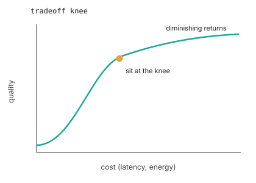

# Perception on the edge

> **Question:** how do raw signals become something a model can use, on a tight
> budget?

## The margin

Accuracy versus latency versus energy, and what quantization actually costs you.

:::: {.column-margin}
**Properties in tension**: timeliness, energy, and robustness, traded against the accuracy you want.

The trade has a knee: accuracy climbs with compute, then flattens. The job is to sit at the knee (@fig-knee).
::::

::: {#fig-knee fig-cap="**The tradeoff knee**: quality rises with cost, then flattens; the operating point worth choosing is the knee, not the peak." fig-alt="A curve of quality against cost that rises steeply, then levels off, with the knee marked."}

:::

## Components you use

- Camera, MEMS microphone, IMU.
- A small model running on the MPU.

## What you build

An on-device perception task: a wake word, or a simple detector.

## What you measure

Inferences per second, milliwatts, accuracy, and the curve that connects them.

## Read

MLPerf Tiny; quantization and distillation.

## Teaching notes

*Work in progress.*

- This is the TinyML bridge: students arrive on familiar ground, which buys us
  goodwill before the harder closed-loop material.
- Hook: run the same model at three operating points (cloud GPU, laptop, MCU)
  and watch accuracy, latency, and energy trade against each other.
- Open question: how much TinyML do we assume versus reteach?
