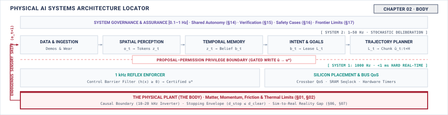

# The Body\chaptersubtitle{What the Physical World Will Not Allow} {#sec-body}

{#fig-locator-ch02 fig-pos="H" width=100%}

*What does the physical world refuse to negotiate?*

<!-- HOOK: one substantive paragraph answering the question above. -->



::: {.callout-objective}
After studying this chapter, you will be able to:

1. Measure the sense-to-actuation delay of a real loop and report it as a distribution rather than a mean.
2. Compute how stopping distance responds to a change in speed and to a change in delay, and explain why the two differ in shape.
3. Derive a duty cycle from a thermal limit rather than from a torque requirement.
4. State, for a given processor and workload, which timing guarantees are available and which are not.

:::

## Introduction {#sec-body-2-1}

<!-- SECTION 2.1 -->
<!-- claim: The body sets terms nobody negotiates, and every later decision in this book is an allocation against them. -->
<!-- covers: The physical world as an unyielding boundary: physical AI systems differ from pure software because the body obeys mechanics, thermodynamics, and electromagnetism rather than software instructions. -->
<!-- covers: Irreversibility and causal authority: once an actuator imparts force or momentum to physical mass, software cannot revoke or roll back the physical event. -->
<!-- covers: The five non-negotiable physical limits: measurement freshness (transduction age), kinetic momentum (stopping distance), actuator bandwidth (torque saturation and rate limits), thermal capacity (heat accumulation and duty cycle), and electrical power integrity (rail voltage sag and regeneration). -->
<!-- covers: Why datasheet specifications mislead: vendor ratings measure isolated components on open test benches at 25°C, whereas operational limits emerge only after mechanical coupling, thermal containment, and harness resistance inside a complete enclosure. -->
<!-- covers: The systems engineering principle of budgeting: establishing hard empirical ceilings that upper software layers must allocate against rather than treating physical limits as optimization targets. -->
<!-- GROUNDING: mechanism — one limit stated as a datasheet figure and as a measured one, side by side -->
<!-- FIGURE: A comparison diagram showing the unconstrained datasheet operating envelope of an isolated actuator versus its severely restricted empirical operating envelope inside a sealed chassis across torque, speed, and ambient temperature. -->

<!-- BEGIN -->

<!-- END -->

## Measurement Age and Freshness {#sec-body-2-2}

<!-- SECTION 2.2 -->
<!-- claim: A measurement begins decaying at transduction, and what matters is its age at the moment something acts on it. -->
<!-- covers: Define measurement age at physical response as the interval from the source observation’s exposure or transduction time to the first resulting force, motion, or flow change. -->
<!-- covers: Account separately for exposure, readout, transport, buffering, computation, scheduling, command transmission, and actuator response. -->
<!-- covers: Show why end-to-end tail latency must be measured directly because the percentile of a sum is not the sum of the stage percentiles. -->
<!-- covers: Derive a freshness deadline from the maximum tolerable state error and the fastest credible rate at which that state can change. -->
<!-- covers: Work one stage-by-stage example with median, high-percentile, and maximum observed age, all with sample count and test conditions. -->
<!-- covers: Name stale-data use as the failure and timestamp comparison at the action boundary as its detector. -->
<!-- GROUNDING: number — age accumulated stage by stage, transducer to command, totalled -->
<!-- FIGURE: A calibrated timing waterfall must show proportional stage durations, the end-to-end latency distribution, and the freshness deadline on one time axis. -->
<!-- DERIVE: Derive the freshness deadline from allowable state error divided by a measured or bounded rate of world-state change. -->

<!-- BEGIN -->

<!-- END -->

## Momentum and Stopping Distance {#sec-body-2-3}

<!-- SECTION 2.3 -->
<!-- claim: Stopping distance grows linearly with delay and quadratically with speed, and that difference sets the speed limit. -->
<!-- covers: Derive reaction travel as speed multiplied by the measured sense-to-brake delay. -->
<!-- covers: Derive braking travel from work and energy, or constant-deceleration kinematics, using the machine’s measured credible deceleration rather than a drive rating. -->
<!-- covers: State the assumptions behind the braking term, then require a measured stopping trial when grade, tire force, compliance, or brake buildup invalidates them. -->
<!-- covers: Use one analytical example to show that doubling delay doubles only reaction travel, while doubling speed doubles reaction travel and quadruples braking travel. -->
<!-- covers: Combine reaction and braking travel with localization error and clearance margin to form the defended stopping envelope. -->
<!-- covers: Solve the clearance inequality for maximum permitted speed rather than merely asserting that clearance sets a speed limit. -->
<!-- GROUNDING: number — stopping distance at a speed and a delay, both terms separated -->
<!-- FIGURE: A common-axis plot must show reaction travel, braking travel, and total stopping distance as speed rises, with a fixed clearance crossing the total curve. -->
<!-- DERIVE: Derive both stopping-distance terms and solve their sum for the maximum speed allowed by a stated clearance. -->

<!-- BEGIN -->

<!-- END -->

## Actuator and Transmission Limits {#sec-body-2-4}

<!-- SECTION 2.4 -->
<!-- claim: An actuator will refuse a command in ways that damage the mechanism rather than reporting an error. -->
<!-- covers: Define the actuator contract in delivered force, torque, or flow, response time, slew rate, and output error rather than in commanded setpoints. -->
<!-- covers: Derive the electrical rise time from the winding resistance and inductance, ending at the budgetable time required to reach a specified fraction of commanded torque. -->
<!-- covers: Convert the measured current limit into a torque or force ceiling, including transmission ratio and measured efficiency only where the example requires them. -->
<!-- covers: Measure reversal behavior at the output so backlash and compliance appear as dead travel, hysteresis, or lag rather than as motor-side assumptions. -->
<!-- covers: Trace a discontinuous command to current saturation, delayed delivered torque, and transmission load; cite motion-profile design rather than teaching it. -->
<!-- covers: Name output saturation or lost motion as the failure and an output-side encoder, load cell, or flow sensor as the detector. -->
<!-- GROUNDING: number — the electrical time constant as a rise time, and torque at saturation -->
<!-- FIGURE: A paired command-and-response trace must show rise time, saturation, slew limitation, and reversal deadband at the actuator output. -->
<!-- DERIVE: Derive the current rise and resulting time-to-torque from the first-order electrical relation instead of quoting the time constant alone. -->

<!-- BEGIN -->

<!-- END -->

## Thermal Limits and Duty Cycle {#sec-body-2-5}

<!-- SECTION 2.5 -->
<!-- claim: Heat arrives in seconds and leaves in minutes, so duty cycle is a design variable rather than a footnote. -->
<!-- covers: Treat thermal capacity as the accumulated side of the energy limit and identify the temperature whose material rating is actually being defended. -->
<!-- covers: Derive resistive loss from current and winding resistance, then balance that input against stored heat and heat rejected to ambient. -->
<!-- covers: Fit or measure the installed heating and cooling responses with the enclosure closed and the relevant neighboring loads active. -->
<!-- covers: Explain why a peak rating is incomplete without starting temperature, duration, ambient temperature, and required recovery time. -->
<!-- covers: Calculate the cyclic steady-state peak temperature for the proposed on and off intervals, then reduce duty cycle until it remains below the insulation limit with margin. -->
<!-- covers: Name insulation-temperature exceedance as the failure and a winding sensor or validated thermal estimator as the detector. -->
<!-- GROUNDING: number — time to the insulation limit at rated current, and the duty cycle that follows -->
<!-- FIGURE: Repeated heating and cooling curves must show the cyclic steady-state peak, the insulation limit, and the largest allowable on-time fraction. -->
<!-- DERIVE: Derive the temperature trajectory and allowable cyclic duty from the thermal energy balance; the asserted heating-cooling asymmetry must come from measured thermal parameters. -->

<!-- BEGIN -->

<!-- END -->

## Power and Electrical Faults {#sec-body-2-6}

<!-- SECTION 2.6 -->
<!-- claim: A machine that browns out mid-motion fails physically, and the supply is a shared resource like any other. -->
<!-- covers: Present rail sag, regenerative overvoltage, and thermal accumulation as different consequences of the same shared energy limit. -->
<!-- covers: Sum simultaneous rail claimants and derive transient voltage droop from source impedance and stored capacitance. -->
<!-- covers: Calculate the energy returned during braking and compare it with the supply’s measured ability to absorb that energy. -->
<!-- covers: Trace an undervoltage crossing through processor reset, driver state, command persistence, and the body’s resulting coast, brake, or hold behavior. -->
<!-- covers: Measure behavior after power removal instead of assuming that removing power produces a safe state; leave fallback selection to Chapter 12. -->
<!-- covers: Name brownout and bus overvoltage as failures and capture rail voltage, reset status, and physical output on a common clock. -->
<!-- GROUNDING: mechanism — a supply sagging under load, and the command already in flight -->
<!-- FIGURE: Synchronized current, rail-voltage, reset, command, and physical-output traces must show what persists after a load step crosses the brownout threshold. -->
<!-- DERIVE: Derive both transient rail droop and regenerative bus rise from current, impedance, capacitance, and returned mechanical energy. -->

<!-- BEGIN -->

<!-- END -->

## Measuring a Machine's Own Limits {#sec-body-2-7}

<!-- SECTION 2.7 -->
<!-- claim: A measurement that cannot state its instrument, its percentile, and its sample count cannot support an argument later. -->
<!-- covers: Begin each measurement from the later decision it must support, then choose the quantity, observation points, instrument bandwidth, resolution, and clock. -->
<!-- covers: Quantify instrument uncertainty and probe intrusion, including cases where logging changes scheduling, power draw, or thermal behavior. -->
<!-- covers: Record payload, ambient temperature, supply state, enclosure, software version, workload, and competing activity with every result. -->
<!-- covers: Distinguish measured values, values derived from measurements, cited ratings, and explicitly illustrative numbers. -->
<!-- covers: Derive what a sample count can support: with no exceedances in \(n\) independent trials, the one-sided failure-rate bound follows from \((1-p)^n\), subject to the stationarity assumption. -->
<!-- covers: Store each limit with its conditions, distribution or bound, uncertainty, margin, detector, and provenance so later chapters can reuse it without reinterpretation. -->
<!-- GROUNDING: mechanism — instrument, percentile, sample count, and how provenance is recorded -->
<!-- DERIVE: Derive the confidence bound implied by sample count and explain why correlated or changing operating conditions invalidate the independent-trial calculation. -->

<!-- BEGIN -->

<!-- END -->

## Systems Stress-Tests {#sec-body-2-8}

<!-- SECTION 2.8 -->
<!-- claim: Limits interact, and the interaction is usually what breaks the machine. -->
<!-- covers: Thermal-latency coupling: how elevated ambient or motor temperatures trigger compute thermal throttling (DVFS), inflating inference latency and suddenly violating the sensor freshness budget. -->
<!-- covers: The velocity-clearance-thermal cascade: how demanding higher operational velocity increases reaction distance linearly, braking distance quadratically, motor current quadratically, and thermal dissipation at $I^2 R$, compressing all margins simultaneously. -->
<!-- covers: Combined compute and actuation power surge: how a heavy neural network inference burst coinciding with peak multi-axis acceleration causes severe bus voltage drops that reset low-voltage sensors. -->
<!-- covers: Multi-variable stress testing protocols: designing bench and field tests that simultaneously apply maximum payload, lowest allowable battery voltage, maximum ambient temperature, and continuous high-duty cycles. -->
<!-- covers: Failure signature diagnosis: instrumenting the machine to isolate whether an operational failure originated from mechanical stall, thermal derating, voltage collapse, or latency deadline expiration. -->
<!-- FIGURE: A coupled constraint interaction diagram showing how exceeding margins in velocity, payload, or duty cycle propagates across thermal, electrical, and freshness limits simultaneously. -->

<!-- BEGIN -->

<!-- END -->

## Summary {#sec-body-2-9}

<!-- SECTION 2.9 -->
<!-- claim: These five limits bound everything built in Part II. -->
<!-- covers: Restate the five limits once, with thermal behavior and rail behavior explicitly grouped under energy. -->
<!-- covers: Distill each limit to the quantity an engineer must measure or bound: age, stopping envelope, delivered actuation, energy state, and worst-case response time. -->
<!-- covers: State that every limit is conditional on a declared operating configuration and loses authority when that configuration changes. -->
<!-- covers: Carry forward the required record: value or distribution, conditions, uncertainty, margin, detector, and provenance. -->
<!-- covers: Hand Chapter 3 the constrained machine and ask what a learned component contributes inside those measured bounds. -->

<!-- BEGIN -->

<!-- END -->
