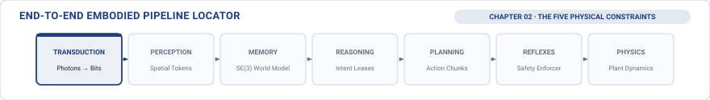

# The Physical Constraints\chaptersubtitle{Sense-to-Actuation Metrology and the Five Columns}

{#fig-locator-ch02 width=100% fig-pos="H"}

*Why does a neural model that comfortably meets its 30 frames-per-second benchmark in testing cause a catastrophic collision on the physical hardware bench?*

In digital cloud computing, software treats time as an artificial, turn-based coordinate: threads pause, memory buffers hold data, and execution resumes once bandwidth clears while the digital world patiently waits. In Physical AI, time is an unyielding dynamical state variable governed by the external universe. Every microsecond spent deliberating in silicon displaces moving mass through physical space, degrades the freshness of sensory observations as spatial uncertainty envelopes expand, accumulates irreversible Joule heat across copper motor windings, and injects phase lag that systematically destroys closed-loop control stability. When learned models command physical actuators, physical survival is governed not by average computational throughput, but by the thermodynamic, mechanical, and silicon limits of the physical operating envelope.



::: {.callout-objective}
After studying this chapter, you will be able to:

1. Contrast synthetic software clock domains with physical world time, explaining why physical closed-loop stability requires hardware-grounded metrology.
2. Navigate the Five Physical Columns that define the non-negotiable operating envelope of any embodied AI system.
3. Trace end-to-end latency across the seven-stage sense-to-actuation waterfall, calculating the geometric Freshness Wall ($\Delta t_{\text{wall}}$) where internal belief diverges from physical reality.
4. Derive two-phase dynamic stopping kinematics ($d_{\text{stop}}$) combining linear reaction displacement and quadratic braking distance under worst-case tail latency spikes.
5. Enforce electromagnetic inductance limits ($\tau_e = L/R$) and $\mathcal{C}^2$ differential jerk continuity ($\dddot{\mathbf{q}}$) to protect mechanical transmissions from stress fracture and tooth shear.
6. Budget thermal and energy headroom using stator winding Joule heating differential equations and edge silicon thermal throttling models.
7. Architect silicon determinism on heterogeneous System-on-Chips using unified memory bus quality-of-service arbitration, lock-free static SRAM mailboxes, and the Iron Law of Zero-Heap Execution (`malloc = 0`).
8. Compile the empirical Requirements Ledger to freeze physical safety invariants prior to deploying learned models on hardware.
:::


## The World Sets the Clock: Why Physical Constraints Bound Intelligence

In traditional computer science and machine learning, algorithms execute inside abstract, idealized software environments. A sorting algorithm is characterized by asymptotic time complexity $\mathcal{O}(n \log n)$; a neural network is evaluated by accuracy on an offline validation dataset. Across these digital domains, time is elastic: if an operating system thread encounters a resource stall or a cloud server experiences a sudden burst in traffic, the processor pauses execution until resources free up. The output remains correct because the digital universe patiently holds its state.

Deploying software into the physical world completely destroys this comfortable abstraction. In Physical AI, the physical universe serves as the master clock. Physical time cannot be paused, suspended, or rolled back. While an onboard processor executes floating-point matrix multiplications, the physical environment continues evolving along continuous differential equations of motion. A vehicle moving at speed continues covering physical meters of roadway; an articulated arm carrying a payload continues deflecting under gravity; a power converter continues conducting high electrical currents that heat copper windings.

To engineer dependable physical AI systems, we must organize these unyielding physical boundaries into a coherent, systematic framework. Rather than viewing physical limitations as disconnected engineering headaches, we structure them into Five Physical Columns that collectively define the boundary between safe agency and catastrophic hardware failure.


## The Five Physical Columns: A Guided Map

Every physical intelligent machine—whether an autonomous drone navigating a forest, a six-axis arm assembling electronics, or a megawatt battery inverter stabilizing an electrical grid—operates within an envelope bounded by Five Physical Columns (@fig-physical-columns):

1. **Column 1: Time (Information Freshness & Latency Tails):** How fast does sensory evidence age, and what happens when computational delay causes the agent's internal belief to drift away from physical reality?
2. **Column 2: Inertia (Momentum & Dynamic Stopping):** Why moving mass cannot stop instantaneously, and how milliseconds of computational delay translate directly into physical meters of unguided collision hazard.
3. **Column 3: Actuation (Inductive Rise Time & Mechanical Stress):** Why electric motors cannot deliver instantaneous torque, and why sharp, stepped software commands shear mechanical gearboxes.
4. **Column 4: Energy (Joule Heating & Thermal Accumulation):** Why physical work dissipates irreversible heat in copper windings and power silicon, and how accumulating thermal load forces computational and mechanical derating.
5. **Column 5: Silicon (Memory Crossbars & Deterministic Execution):** How internal memory bus contention on edge System-on-Chips generates catastrophic tail latency spikes, and why real-time safety paths must enforce compile-time static memory allocation.

{#fig-physical-columns width=100%}

These five columns form an interdependent physical chain. If high-level software requests an aggressive motion, Column 1 dictates whether the sensory evidence is still fresh enough to justify it; Column 2 checks whether the machine has sufficient clearance to stop if an obstacle appears; Column 3 verifies that motor coils and gear teeth can deliver the torque without shearing; Column 4 confirms that copper windings will not overheat; and Column 5 ensures that the underlying silicon executes the command with microsecond determinism.

We now examine each column in depth, deriving its governing mathematical laws and observing its physical consequences on real hardware.


## Column 1: Time and Information Freshness

In classical software engineering, latency is treated as a quality-of-service tuning parameter; if a cloud database responds slowly, the user interface simply displays a loading indicator. In Physical AI, time is an irreversible thermodynamic coordinate. Sensory data degrades from the exact microsecond of photon exposure, and closed-loop stability is governed not by comfortable median averages, but by the statistical tails of the execution distribution.

### True Metrology: The Software Timestamp Delusion

Software engineers transitioning to embodied systems almost universally attempt to quantify latency by wrapping high-level code in standard user-space software timers:

```python
# THE SOFTWARE TIMESTAMP DELUSION (DO NOT DO THIS)
t_start = time.time()
action = policy_model(camera_image)
t_end = time.time()
measured_latency = t_end - t_start
```

Listing 2.1 illustrates this practice, which we term the *software timestamp delusion*. The developer captures a timestamp before calling the model, records a second timestamp upon return, and calculates the difference. Because Python reports a comfortable fifteen or twenty milliseconds, the team assumes the system has ample timing headroom. On physical hardware, this measurement is a dangerous delusion that conceals extensive physical delays:

1. *Operating System Blindness:* User-space timers measure only the slice of time when the CPU executes the Python thread. They are completely blind to the time required for photons to integrate charge on the camera die ($8\text{--}15\text{ ms}$), the transfer of image packets over serial buses into main memory, memory crossbar contention, and the electromagnetic time constant required for motor phase current to build against winding inductance. A pipeline reported by Python to take twenty milliseconds routinely incurs an actual physical sense-to-actuation delay exceeding one hundred milliseconds.
2. *The Observer Effect:* Calling timing functions (`time.time()` or `clock_gettime()`) triggers operating system system calls, forcing context switches and evicting cache lines. In high-frequency control loops, the diagnostic code itself distorts the very latency distribution under test.
3. *Clock Domain Skew:* Multi-processor architectures run on separate quartz crystals with independent thermal drift (10 to 50 parts per million). Without hardware synchronization lines, software clocks across processors accumulate uncontrolled millisecond-scale skew.

To measure true physical latency, engineers must measure physical electrical transitions directly: from the hardware strobe line when light strikes the camera sensor, across memory buses and processor mailboxes, all the way to the analog current probe measuring stator phase current rise on the motor inverter.

### The 7-Stage Latency Waterfall

{#fig-latency-waterfall width=100%}

When instrumented at the hardware level, the complete sense-to-actuation pathway decomposes into seven distinct, sequential physical and computational stages (@fig-latency-waterfall and @tbl-latency-breakdown):

1. **Stage 1: Optical and Physical Transduction ($t_{\text{transduce}}$):** Photons striking the camera sensor require an integration exposure duration between $8\text{ and } 15\text{ ms}$ under ambient indoor lighting to accumulate sufficient electrical charge in silicon photodiode wells.
2. **Stage 2: Direct Memory Access (DMA) Ingestion ($t_{\text{dma}}$):** The camera serializes digitized pixel data across high-speed lanes into the host System-on-Chip, where an autonomous Direct Memory Access engine transfers frames into main DRAM ($3\text{ to } 8\text{ ms}$).
3. **Stage 3: Spatial Perception and Feature Tokenization ($t_{\text{perceive}}$):** The vision model on the neural accelerator processes the raw image into compact 3D spatial feature tokens ($12\text{ to } 25\text{ ms}$).
4. **Stage 4: Policy Planning and Trajectory Decoding ($t_{\text{inference}}$):** The policy network decodes spatial tokens into multi-step motion trajectories ($22\text{ to } 60\text{ ms}$).
5. **Stage 5: Inter-Processor Communication ($t_{\text{ipc}}$):** The host processor packages candidate trajectories into shared static memory and signals the real-time microcontroller via a hardware mailbox interrupt ($0.8\text{ to } 2.0\text{ ms}$).
6. **Stage 6: Real-Time Safety Veto and Enforcement ($t_{\text{enforce}}$):** Operating deterministically at $1000\text{ Hz}$ in static microcontroller memory, the real-time safety supervisor validates the candidate trajectory against physical invariants ($0.4\text{ to } 1.0\text{ ms}$).
7. **Stage 7: Electromagnetic Actuator Rise Time ($t_{\text{actuator}}$):** Motor stator coils possess electrical inductance $L$ and resistance $R$, requiring approximately three electrical time constants ($3\tau_e = 3L/R \approx 6\text{ to } 15\text{ ms}$) to build ninety-five percent of commanded physical torque.

| Stage | Subsystem and Mechanism | $P_{50}$ | $P_{99}$ | Bottleneck Classification |
| :--- | :--- | :---: | :---: | :--- |
| **1. Transduce ($t_{\text{transduce}}$)** | Photodiode charge well integration | $8.0\text{ ms}$ | $15.0\text{ ms}$ | Physics (Optical flux) |
| **2. DMA Ingest ($t_{\text{dma}}$)** | DMA transfer over MIPI CSI-2 to DRAM | $3.0\text{ ms}$ | $8.0\text{ ms}$ | Bandwidth (Memory crossbar) |
| **3. Perception ($t_{\text{perceive}}$)** | ViT / DINOv2 spatial tokenization | $12.0\text{ ms}$ | $25.0\text{ ms}$ | Compute (Accelerator execution) |
| **4. Policy ($t_{\text{inference}}$)** | Trajectory & action chunk decoding | $22.0\text{ ms}$ | $60.0\text{ ms}$ | Compute (Model evaluation) |
| **5. Inter-IPC ($t_{\text{ipc}}$)** | Shared SRAM mailbox transfer | $0.8\text{ ms}$ | $2.0\text{ ms}$ | Scheduling (Mailbox interrupt) |
| **6. Enforce ($t_{\text{enforce}}$)** | Safety barrier evaluation (1 kHz) | $0.4\text{ ms}$ | $1.0\text{ ms}$ | Determinism (1 kHz control tick) |
| **7. Actuator ($t_{\text{actuator}}$)** | Stator coil $L/R$ electrical rise time | $6.0\text{ ms}$ | $15.0\text{ ms}$ | Physics (Coil inductance) |
| **TOTAL** | **End-to-End Latency Chain** | **$52.2\text{ ms}$** | **$126.0\text{ ms}$** | **Budget Ceiling: $\le 80.0\text{ ms}$** |

: The 7-stage sense-to-actuation latency breakdown. Deconstructing end-to-end delay across physical transduction, memory bus transfers, neural processing, inter-core communication, real-time safety evaluation, and electromagnetic actuator rise time. {#tbl-latency-breakdown}

The sum of these seven stages forms the total sense-to-actuation latency ($t_{\text{total}}$). Under nominal operating conditions ($P_{50}$), the pipeline executes in $52.2\text{ ms}$, comfortably beneath the system's physical deadline of $\tau_{\text{world}} = 80.0\text{ ms}$. Under worst-case tail conditions ($P_{99}$), however, memory bus contention and scheduling jitter inflate the delay to $126.0\text{ ms}$—a catastrophic breach of the physical timing budget.

### The Freshness Wall

Sensory observations begin aging the exact microsecond photons strike the camera sensor. An image frame does not describe the present state of the physical world; it describes where the physical world was located at the historical instant of exposure.

We define the *information age* ($\Delta t$) as the total elapsed time between sensor exposure and the application of motor torque. During this elapsed interval $\Delta t$, any moving obstacle in the workspace continues along its trajectory with velocity $\mathbf{v}_{\text{target}}$. The spatial uncertainty envelope ($\sigma_{\text{pos}}$) bounding the agent's internal belief expands linearly:

$$\sigma_{\text{pos}}(t) = \sigma_0 + \|\mathbf{v}_{\text{target}}\| \cdot \Delta t$$

where $\sigma_0$ represents intrinsic sensor calibration noise. When the spatial uncertainty envelope $\sigma_{\text{pos}}(t)$ expands to equal the available physical clearance $d_{\text{clearance}}$, the robot can no longer guarantee collision-free operation. Setting $\sigma_{\text{pos}}(t) = d_{\text{clearance}}$ and solving for elapsed time yields the *Freshness Wall* ($\Delta t_{\text{wall}}$):

$$\Delta t_{\text{wall}} = \frac{d_{\text{clearance}} - \sigma_0}{\|\mathbf{v}_{\text{target}}\|}$$

The Freshness Wall is a hard, geometrically grounded temporal deadline imposed by the kinematics of the physical environment. If total sense-to-actuation latency $\Delta t$ equals or exceeds $\Delta t_{\text{wall}}$, the agent's internal representation has drifted so far from physical ground truth that candidate neural proposals become active collision hazards.

::: {.callout-case title="The Stale Sensor Collision"}
Consider an autonomous mobile robot navigating a warehouse aisle at $2.0\text{ m/s}$ with an obstacle clearance margin of $d_{\text{clearance}} = 0.20\text{ m}$ and sensor calibration noise $\sigma_0 = 0.02\text{ m}$. The Freshness Wall collapses to $\Delta t_{\text{wall}} = (0.20 - 0.02) / 2.0 = 90\text{ ms}$. When a background operating system garbage collection sweep delayed neural inference, total latency spiked to $130\text{ ms}$. Although the neural model generated a mathematically valid steering command based on the captured frame, the command arrived $40\text{ ms}$ after the Freshness Wall had been breached. The robot steered into the new physical position of the obstacle, colliding at full operational speed.
:::


## Column 2: Inertia, Momentum, and Stopping Kinematics

In digital computing, setting an actuator velocity to zero in software memory is an instantaneous, single-cycle operation. In physical mechanics, moving bodies possess physical mass and inertia ($p = mv$, $E_k = \frac{1}{2}mv^2$). Bringing mass to rest requires applying opposing force over time, dissipating kinetic energy as friction and heat. Consequently, physical mass cannot halt instantaneously; deceleration is a continuous physical process that unfolds over both time and space.

### The Two-Phase Stopping Equation

{#fig-stopping-distance width=100%}

As illustrated in @fig-stopping-distance, the total dynamic stopping distance ($d_{\text{stop}}$)—from the instant an obstacle appears until the machine reaches a complete halt—divides into two distinct physical phases:

$$\underbrace{d_{\text{stop}}(v_0, \Delta t_{\text{delay}})}_{\text{Total Stopping Distance}} = \underbrace{v_0 \cdot \Delta t_{\text{delay}}}_{\text{Phase 1: Linear Reaction Distance}} \;+\; \underbrace{\frac{v_0^2}{2 a_{\text{max}}}}_{\text{Phase 2: Quadratic Braking Distance}}$$

During Phase 1 (the linear reaction phase, $v_0 \cdot \Delta t_{\text{delay}}$), the robot is mechanically blind to the obstacle while computation transpires. It coasts forward at velocity $v_0$ with zero deceleration, exposing the fundamental bridge between computer systems and physics: computational delay is linear unguided travel through space. Once braking begins in Phase 2 (the quadratic braking phase, $\frac{v_0^2}{2 a_{\text{max}}}$), the machine decelerates at maximum available deceleration $a_{\text{max}}$, dissipating kinetic energy over a distance that scales quadratically with initial velocity.

::: {.callout-case title="The Dynamic Stopping Overrun"}
Consider an autonomous mobile platform operating in a warehouse with an initial velocity $v_0 = 1.0\text{ m/s}$, a maximum braking deceleration $a_{\text{max}} = 2.0\text{ m/s}^2$, and an available obstacle clearance $d_{\text{clearance}} = 0.350\text{ m}$ ($35\text{ cm}$).

Under nominal $P_{50}$ execution ($\Delta t = 30\text{ ms}$), the reaction distance is $1.0 \times 0.030 = 3\text{ cm}$, the braking distance is $\frac{1.0^2}{2 \times 2.0} = 25\text{ cm}$, and the total stopping distance is $28\text{ cm}$. The robot halts safely with a $7\text{ cm}$ safety margin. 

However, under a tail $P_{99}$ latency spike ($\Delta t = 230\text{ ms}$) caused by memory bus contention and kernel thread preemption, the reaction distance expands from $3\text{ cm}$ to $23\text{ cm}$, while the mechanical braking distance remains fixed at $25\text{ cm}$. Total stopping distance explodes to $48\text{ cm}$, causing a destructive collision with an overrun of $+13\text{ cm}$. A $200\text{ ms}$ computational scheduling stall adds exactly $20\text{ cm}$ of unguided projectile travel.
:::

### Dynamic Safety Clearance Invariants

To guarantee collision-free operation under worst-case tail latency, the real-time microcontroller continuously evaluates the *Dynamic Safety Clearance Invariant* on every 1 kHz tick in static SRAM:

$$d_{\text{clearance}} \ge d_{\text{stop}}\left(v_0, \Delta t(P_{99.9})\right) + d_{\text{margin}}$$

Whenever available obstacle clearance violates this invariant, the microcontroller automatically vetoes high-level neural proposals and commands immediate controlled braking.


## Column 3: Actuation Limits and Mechanical Jerk

Actuators are not idealized mathematical torque sources. They must build magnetic flux against stator winding impedance, transmit torque through finite-stiffness gear teeth, and continuously respect mechanical structural limits.

### Stator Inductance and Electrical Rise Time

The voltage-current relationship of a motor phase winding follows Faraday's law:

$$V(t) = R \cdot I(t) + L \frac{dI(t)}{dt} + K_e \cdot \omega(t)$$

Because motor torque is proportional to current ($\tau = K_t I$), torque cannot change instantaneously. Stator coil inductance $L$ and resistance $R$ define the electrical time constant:

$$\tau_e = \frac{L}{R}$$

When applying voltage, phase current rises exponentially: $I(t) = \frac{V_{\text{bus}} - K_e\omega}{R}\left(1 - e^{-t/\tau_e}\right)$. Achieving 95% commanded torque consumes approximately $3\tau_e$ ($6\text{ to } 15\text{ ms}$). Furthermore, as rotor speed $\omega(t)$ increases, back-EMF ($K_e\omega$) opposes bus voltage, reducing torque responsiveness at high speeds.

### Transmissions and Jerk Continuity

Transmissions (such as harmonic drives, planetary reducers, and cycloidal drives) transfer torque through gear teeth subject to shear stress limits ($\sigma_{\text{shear}} \le \sigma_{\text{yield}}$). If a discrete neural policy emits step changes in trajectory waypoints, commanded acceleration jumps discontinuously, implying unbounded mechanical jerk:

$$\mathbf{j}(t) = \dddot{\mathbf{q}}(t) = \frac{d^3\mathbf{q}}{dt^3} \longrightarrow \infty$$

Unbounded jerk triggers three severe physical failure modes:
1. *Structural Resonance:* High-frequency vibration modes in robotic linkages are excited, leading to violent oscillations.
2. *Gear Tooth Shear:* Thin-walled flexsplines and precision gear teeth suffer shock loading, causing tooth pitting, micro-fractures, and tooth shear.
3. *Sensor Saturation:* Mechanical vibrations propagate through the chassis, saturating MEMS IMUs and corrupting state estimators.

To protect mechanical hardware, trajectory commands must maintain $\mathcal{C}^2$ differential continuity with bounded jerk ($\|\dddot{\mathbf{q}}\| \le \dddot{q}_{\text{max}}$). Modern systems enforce this by fitting quintic splines across predicted action chunks and applying temporal ensembling to blend overlapping trajectory chunks smoothly across time.

::: {.callout-case title="The Sheared Harmonic Flexspline"}
During high-speed trajectory tracking on an articulated 6-axis manipulator, a neural policy updated its target joint positions at $50\text{ Hz}$ using un-smoothed step setpoints. At an aggressive direction reversal, the commanded acceleration stepped instantaneously from $+12\text{ rad/s}^2$ to $-12\text{ rad/s}^2$, generating an impulsive jerk spike exceeding $2400\text{ rad/s}^3$. The resulting shock load exceeded the shear yield limit of the titanium-alloy flexspline cup, stripping the gear teeth and permanently destroying the joint actuator.
:::


## Column 4: Energy, Joule Heating, and Thermal Derating

Every actuation command requests physical work, and no energy conversion is perfectly conservative. Resistive losses in motor coils and power converters generate irreversible Joule heat ($P_{\text{loss}} = I^2 R$).

### Thermal Time Constants and Continuous Ratings

An electric motor has thermal capacitance $C_{\text{th}}$ (heat storage in copper and iron) and thermal resistance $R_{\text{th}}$ (dissipation to ambient). These parameters define the thermal time constant:

$$\tau_{\text{th}} = R_{\text{th}} C_{\text{th}}$$

While electrical currents settle in milliseconds ($\tau_e \approx 10\text{ ms}$), thermal energy accumulates over tens or hundreds of seconds ($\tau_{\text{th}} \approx 10\text{ to } 300\text{ s}$). 

In steady state, heat generation must balance ambient dissipation, establishing the continuous current rating ($I_{\text{cont}}$):

$$I_{\text{cont}} = \sqrt{\frac{\Delta T_{\text{max}}}{R \cdot R_{\text{th}}}}$$

For short acceleration bursts ($\Delta t_{\text{burst}} \ll \tau_{\text{th}}$), actuators can safely draw peak currents ($I_{\text{peak}} \approx 2\text{--}5 \times I_{\text{cont}}$) because thermal mass buffers the temperature rise. However, the maximum permissible burst duration shrinks quadratically with peak current:

$$\Delta t_{\text{burst, max}} \le \tau_{\text{th}} \left( \frac{I_{\text{cont}}}{I_{\text{peak}}} \right)^2$$

Commanding double the continuous current reduces the safe burst window to one-quarter of $\tau_{\text{th}}$; commanding four times the continuous current reduces it to one-sixteenth. Exceeding this limit causes stator insulation breakdown ($>180^\circ\text{C}$) or irreversible rotor magnet demagnetization ($>100^\circ\text{C}$).

### Firmware $I^2t$ Thermal Clamping

Because physical thermistors mounted on motor casings exhibit a $5\text{--}30\text{ s}$ spatial conduction lag, the real-time microcontroller cannot wait for thermistor readings during stall events. Instead, the firmware maintains an $I^2 t$ thermal energy accumulator in static SRAM on every 1 kHz tick:

$$E_{\text{thermal}}[k] = \max\left( 0, \; E_{\text{thermal}}[k-1] + \left( I^2[k] - I_{\text{cont}}^2 \right) \Delta t \right)$$

When $E_{\text{thermal}}$ crosses safety thresholds, the microcontroller autonomously scales down allowed current, clamping motor drive to $I_{\text{cont}}$ before wire insulation melts.

::: {.callout-case title="Thermal Throttling in a Sealed Enclosure"}
Thermal accumulation also governs edge silicon executing neural models ($P_{\text{SoC}} \propto V_{\text{core}}^2 f_{\text{clk}}$). When junction temperatures exceed throttling thresholds ($85\text{--}95^\circ\text{C}$), on-die Dynamic Thermal Management downclocks the neural accelerator to protect the package.

This creates the *Cold Bench Fallacy*: a vision-language-action policy benchmarked on a cold laboratory bench executes in $22\text{ ms}$, comfortably meeting its $50\text{ ms}$ real-time intent lease. But after 20 minutes of continuous operation inside an enclosed chassis, thermal throttling cuts clock frequencies in half. Inference latency inflates to $48\text{ ms}$ ($P_{50}$) and $120\text{ ms}$ ($P_{99}$). The neural policy produces mathematically valid outputs, but they arrive after the intent lease has expired, causing the microcontroller to reject proposals and engage dynamic braking, collapsing system operational availability.
:::

| Physical Subsystem | Dominant Thermal Mechanism | Characteristic $\tau_{\text{th}}$ | Critical Temperature Limit | Physical Breakdown Failure Mode | Real-Time Safety Countermeasure |
| :--- | :--- | :---: | :---: | :--- | :--- |
| **Motor Stator Coils** | Joule heating in copper windings ($I^2 R$) | $30\text{ to } 120\text{ s}$ | $155^\circ\text{C}\text{ to } 180^\circ\text{C}$ (Class F/H) | Dielectric enamel pyrolytic breakdown and short circuits | Firmware $I^2t$ energy accumulator clamping to $I_{\text{cont}}$ |
| **Rotor Magnets** | Conductive/radiative heat transfer from stator | $60\text{ to } 300\text{ s}$ | $80^\circ\text{C}\text{ to } 120^\circ\text{C}$ (NdFeB) | Irreversible thermal demagnetization and loss of $K_t$ | Stator thermal observer and continuous torque derating |
| **Inverter Switches (IGBT/SiC)** | Conduction and switching losses ($V_{\text{ce}}I + E_{\text{sw}}f$) | $0.1\text{ to } 2.0\text{ s}$ | $150^\circ\text{C}\text{ to } 175^\circ\text{C}$ ($T_j$) | Thermal runaway, gate latch-up, and wire bond shear | Hardware desaturation detection and microsecond PWM shutdown |
| **Edge Neural Silicon (SoC/NPU)** | Dynamic switching and leakage ($C V^2 f + I_{\text{leak}} V$) | $10\text{ to } 60\text{ s}$ | $85^\circ\text{C}\text{ to } 100^\circ\text{C}$ ($T_j$) | Hardware DVFS downclocking inflating inference latency | Thermally conditioned intent leases and adaptive model pruning |

: Thermal characteristics, breakdown mechanisms, and safety countermeasures across physical and computational subsystems in Physical AI architectures. {#tbl-thermal-domains}

::: {.callout-archetype title="Cybernetic Energy and Process Systems — Megawatt Grid Storage Inverter"}
* **Physical System:** 500 kW grid-tied battery energy storage inverter with liquid cooling loop.
* **Archetype Domain:** Archetype 3 (Cybernetic Energy and Process Systems).
* **Governing Physical Column:** Column 4 (Energy, Thermal Accumulation, and Derating).
* **Physical State Dynamics ($W_t \to W_{t+1}$):** Thermal capacitance $C_{\text{th}}$ of insulated-gate bipolar transistor (IGBT) silicon junctions, coolant fluid flux $\dot{V}$, and $I^2R$ resistive Joule dissipation in converter magnetics.
* **The Systems Tension:** A high-level neural policy running on an edge server optimizes wholesale grid price arbitrage and battery state-of-charge ($1\text{ Hz}$ dispatch). If a sudden grid voltage sag occurs, the model commands maximum reactive current, but thermal accumulation ($\tau_{\text{th}} = 45\text{ s}$) threatens to destroy power semiconductor junctions ($T_j \ge 150^\circ\text{C}$).
* **The Proposal–Permission Contract:** The untrusted MPU proposes active/reactive power dispatch vectors ($P_t, Q_t$). The trusted DSP/microcontroller permission supervisor executes at $1000\text{ Hz}$ in zero-allocation static SRAM, continuously integrating the $I^2t$ thermal accumulator and autonomously clamping current to $I_{\text{cont}}$ before silicon breakdown occurs.
* **Cross-Archetype Synthesis:** While Mobility (Archetype 1) is bounded by kinetic stopping distances ($d_{\text{stop}}$) and Contact Manipulation (Archetype 2) is bounded by gearbox tooth shear ($\sigma_{\text{shear}}$), Cybernetic Energy Systems (Archetype 3) are bounded by thermal accumulation ($I^2t$) and fluid transport lags under the exact same proposal-permission architecture.
:::


## Column 5: Silicon Contention and Hardware Determinism

While Columns 1 through 4 examined the physical constraints governing the external world and the robotic plant—time freshness, inertial momentum, electromagnetic torque rise time, and thermal accumulation—the fifth physical column addresses the solid-state silicon substrate itself. In Physical AI, intelligence executes on physical semiconductor circuits characterized by finite memory crossbar bandwidth, shared interconnect buses, multi-level cache hierarchies, and independent clock domains.

### UMA DRAM Crossbar Contention

Modern embedded computing platforms deployed at the physical edge almost universally adopt heterogeneous System-on-Chip (SoC) architectures based on a Unified Memory Architecture (UMA). Under a UMA design, multi-core application CPUs, high-throughput Neural Processing Units (NPUs), GPUs, image signal processors (ISPs), and autonomous Direct Memory Access (DMA) engines all connect to a single shared dynamic RAM (DRAM) subsystem through an on-die system crossbar interconnect.

This unified topology introduces an intense architectural tax during real-time perception workloads, termed the *ingestion tax*. A dual-camera $1080\text{p}$ RGB streaming pipeline at $60\text{ FPS}$ ingests approximately $746\text{ MB/s}$ of raw pixel data, while an uncompressed $4\text{K}$ perception stream demands over $1.49\text{ GB/s}$ of continuous memory write throughput. The camera interface receivers and DMA engines autonomously blast these massive byte streams across the system crossbar directly into DRAM circular buffers.

::: {.callout-case title="The UMA Bus Ingestion Blackout"}
Concurrently, the neural accelerator executes vision-language-action backbones or diffusion policy models. During every forward evaluation pass, the NPU must stream hundreds of megabytes of neural network weights from DRAM into its local on-chip SRAM register files. When high-bandwidth camera DMA write bursts coincide with dense NPU weight read transactions, the aggregate demand exceeds the saturation threshold of the shared DRAM crossbar interconnect. The memory controller's internal read queues become congested behind queued DMA write transactions, degrading effective memory bus efficiency by 40 to 60 percent. As a direct consequence, the NPU compute pipeline suffers extensive memory stall cycles, inflating neural inference execution time from a nominal median of $P_{50} = 22\text{ ms}$ to severe tail spikes exceeding $P_{99} > 135\text{ ms}$.
:::

### Hardware QoS and Zero-Copy Buffers

To prevent memory bus contention from inducing catastrophic latency tails, physical AI architectures enforce hardware-level traffic shaping and zero-copy memory pipelines across the SoC fabric:

1. **Hardware Quality-of-Service (QoS) Arbitration:** Embedded architectures configure the memory controller's hardware QoS priority registers (such as ARM CoreLink AXI QoS engines). Read requests originating from the neural processing unit and high-frequency real-time control packets are assigned the highest hardware priority classes, while bulk sensor DMA ingestion streams are assigned lower, bandwidth-throttled priority tiers. When crossbar congestion occurs, the memory controller autonomously pauses lower-priority DMA write bursts, servicing time-critical neural weight reads with bounded, deterministic memory access latency.
2. **Non-Cacheable Zero-Copy DMA Buffers:** In naive software implementations, incoming camera frames stream through the CPU/NPU cache hierarchy (L2 and L3 caches), evicting hot neural network weights and activation scratchpads. Physical AI architectures eliminate this cache thrashing by allocating physically contiguous memory regions using contiguous memory allocators (such as Linux DMA-BUF) configured with non-cacheable memory attributes. The camera DMA engine writes digitized pixel packets directly into DRAM without routing data through cache lines, preserving cache residency for critical model weights.

### Cache Coherency and SRAM Mailboxes

Embodied autonomy fundamentally relies on a heterogeneous compute topology: an application processor (MPU) executes the complex, non-deterministic cognitive stack under Linux, while a dedicated real-time microcontroller (MCU) executes hard real-time dynamic safety enforcement in physical address space using deterministic static SRAM.

To bridge these two distinct silicon domains without cache coherency bugs or OS locking overhead:
1. Inter-core communication is hosted entirely within a dedicated region of on-chip static SRAM mapped as non-cacheable in the MPU's MMU page tables.
2. Trajectory proposals and actuator telemetry are transferred across shared SRAM using lock-free single-producer single-consumer circular ring buffers synchronized via 64-bit atomic monotonic sequence counters.
3. When the application processor commits an action chunk into the shared ring buffer, it asserts a memory-mapped hardware mailbox interrupt line, firing directly into the microcontroller's physical interrupt vector table to wake the safety loop in sub-microsecond time.

### The Iron Law: Zero Dynamic Heap Allocation

To guarantee that worst-case execution time (WCET) on the real-time microcontroller remains strictly bounded and deterministic, real-time embedded safety systems enforce the Iron Law of Zero Dynamic Heap Allocation.

::: {.callout-important title="The Iron Law of Real-Time Safety: Zero Dynamic Heap Allocation"}
Zero dynamic memory allocations (`malloc`, `free`, `new`, `delete`, or dynamically resizing STL containers such as `std::vector` and `std::map`) are permitted inside the $1000\text{ Hz}$ safety supervisor loop, the Control Barrier Function solver, or high-frequency motor control interrupt service routines.
:::

Permitting dynamic heap allocation within real-time control silicon introduces three severe, irrecoverable failure modes:
1. *Non-Deterministic Pointer Chasing:* Standard free-list allocators exhibit variable execution times during free-list traversal, causing timing stalls that miss real-time deadlines.
2. *Heap Fragmentation:* Continuous dynamic allocation over multi-hour physical missions fragments memory, eventually triggering catastrophic out-of-memory allocation failures.
3. *Stack-Heap Collisions:* Real-time microcontrollers lack MMUs to catch memory collisions; an expanding dynamic heap silently overwrites descending execution call stack frames, destroying return addresses and causing fatal unhandled processor lockups (`HardFault_Handler`) that leave actuators unguided.

All memory structures on the real-time safety microcontroller are statically allocated at compile time. Every ring buffer, state vector, transformation matrix, and quadratic program workspace is declared as fixed-size global static storage residing in dedicated SRAM sections (`.bss` and `.data`). Compile-time static allocation guarantees that the total memory footprint is mathematically verifiable prior to flashing firmware, ensuring absolute temporal determinism.


## The Requirements Ledger: Freezing Physical Invariants

Every engineering discipline requires a formal specification sheet that establishes the physical operating envelope of a machine prior to deployment. In Physical AI, deploying learned policies without an empirical, hardware-verified specification sheet invites hardware destruction. Before any autonomous agent is permitted to command physical actuators, the engineering team must measure, calculate, and freeze the system's physical operating limits in a formal *Requirements Ledger*.

### The Five Columns Across Applications

The Five Physical Columns provide a universal analytical framework that applies across the entire spectrum of physical AI embodiments (@tbl-columns-across-applications).

| Physical Column | Governing Physical Principle | Terrestrial & Aerial Mobility (AMRs, Drones, Quadrupeds) | Contact Manipulation & Surgery (Industrial Arms, Grippers) | High-Voltage Cybernetics (Grid Inverters, Fast Chargers) | Fluid, Thermal & Chemical (Datacenter Cooling, Reactors) | Active Medical & Bio-Cybernetics (Ventilators, Dialysis) |
| :--- | :--- | :--- | :--- | :--- | :--- | :--- |
| **Column 1: Time** | Information age decay & tail latency distributions | High closing velocities; tight Freshness Wall ($\Delta t_{\text{wall}} \le 80\text{ ms}$) | Tactile slip-prevention reflexes ($< 10\text{ ms}$) | Sub-cycle AC phase-lock synchronization ($\Delta\phi < 1\text{ ms}$) | Fluid pipe transport delays & exothermic runaway windows | Physiological sensor latency (blood gas & glucose lag) |
| **Column 2: Inertia** | Conservation of momentum & kinetic energy | Translational momentum $mv$; dynamic stopping distance $d_{\text{stop}}$ | Linkage inertia matrix $\mathbf{M}(\mathbf{q})\ddot{\mathbf{q}}$ & payload mass variations | Synthetic grid inertia & line reactance ($X_L$) | Bulk fluid mass momentum & hydraulic water hammer surges | Patient limb inertia & dynamic gait momentum |
| **Column 3: Actuation** | Electromechanical rate limits & transmission stress | Rotor aerodynamic response; steering slew rates | Gearbox shear $\sigma_{\text{shear}}$, flexspline fatigue, $\mathcal{C}^2$ jerk | Solid-state switch $di/dt$ & $dv/dt$ inductive surge limits | Proportional valve slew limits & pump displacement dynamics | Pneumatic solenoid limits & tendon tension bounds |
| **Column 4: Energy** | Joule dissipation & thermal mass accumulation | Battery pack C-rate discharge & pack thermal gradients | Stator winding Joule heating ($I^2R$) in continuous stalls | Semiconductor junction heat ($T_j \le 150^\circ\text{C}$) & coolant flux | Continuous exothermic reaction heat extraction | Localized tissue heating dissipation & battery runtime |
| **Column 5: Silicon** | Solid-state memory contention & determinism | Multi-camera DMA streaming vs. NPU weight bus contention | 1 kHz Control Barrier Function in zero-heap static SRAM | Microsecond DSP ADC sampling & hardware PWM determinism | Embedded PLC / RTOS loop execution determinism | Isolated safety MCU firmware with zero heap allocation |

: The Five Physical Columns across the application spectrum. Mapping foundational physical principles to diverse Physical AI embodiments. {#tbl-columns-across-applications}

### Archetypes across the Physical Columns

Not all physical systems are constrained equally by every column. Understanding how the Three Canonical Archetypes map across the Five Physical Columns allows engineers to tailor safety enforcement architectures to the specific physical laws that bind their hardware platform (@tbl-archetype-columns).

| Physical Column | Archetype 1: Mobility (Rovers, Drones, AMRs) | Archetype 2: Contact Manipulation (Arms, Hands, Tooling) | Archetype 3: Cybernetic Energy & Processes (Grid Inverters, Fluid Loops) |
| :--- | :--- | :--- | :--- |
| **Column 1: Time** | **Binding:** High-speed dynamic obstacle avoidance; tight Freshness Wall $\Delta t_{\text{wall}}$. | **Binding:** Rapid contact detection and slip-prevention reflexes ($< 10\text{ ms}$). | **Moderate:** Multi-second chemical and thermal transport delays. |
| **Column 2: Inertia** | **Binding:** Translational kinetic momentum; two-phase dynamic stopping distance $d_{\text{stop}}$. | **Binding:** Multi-link rigid body inertia matrix $\mathbf{M}(\mathbf{q})\ddot{\mathbf{q}}$ and payload mass changes. | **Non-binding:** Fluid and thermal mass have storage capacity but zero kinematic momentum. |
| **Column 3: Actuation** | **Moderate:** Steering actuator rate limits; rotor aerodynamic thrust response. | **Binding:** Gear tooth shear $\sigma_{\text{shear}}$, flexspline fatigue, and $\mathcal{C}^2$ jerk continuity. | **Binding:** Solid-state power switch $di/dt$ and $dv/dt$ inductive surge protection. |
| **Column 4: Energy** | **Moderate:** Traction battery discharge C-rates and thermal pack management. | **Binding:** Motor stator winding Joule heating ($I^2 R$) during continuous high-load stalls. | **Binding:** Power semiconductor junction thermal limits ($T_j \le 150^\circ\text{C}$) and coolant flux. |
| **Column 5: Silicon** | **Binding:** Multi-camera DMA streaming vs. neural weight memory bus contention. | **Binding:** 1 kHz Control Barrier Function safety enforcer in zero-heap static SRAM. | **Binding:** Microsecond-level DSP grid phase-lock synchronization and ADC sampling. |

: The Canonical Archetypes across the Five Physical Columns. Qualitative binding severity across physical embodiments (Binding constraint, Moderate constraint, Non-binding constraint). {#tbl-archetype-columns}

### The Requirements Ledger

The *Requirements Ledger* records the eight foundational physical constants and execution thresholds that define a platform's non-negotiable safety envelope (@tbl-requirements-ledger). Every parameter in the ledger is grounded in SI units, derived from first principles, and verified through hardware bench metrology.

| Parameter Symbol | Physical Constraint Name | SI / Engineering Unit | Hardware Benchmark Method | Real-Time Safety Invariant Rule |
| :--- | :--- | :---: | :--- | :--- |
| **$\tau_{\text{world}}$** | World Reaction Deadline | $\text{ms}$ | Closed-loop disturbance impulse response | $t_{\text{total}}(P_{99.9}) + t_{\text{margin}} < \tau_{\text{world}}$ |
| **$\Delta t_{\text{wall}}$** | The Freshness Wall | $\text{ms}$ | Geometric spatial uncertainty analysis | $\Delta t = t_{\text{act}} - t_{\text{trans}} \le \frac{d_{\text{clearance}} - \sigma_0}{\|\mathbf{v}_{\text{target}}\|}$ |
| **$d_{\text{stop}}$** | Dynamic Stopping Distance | $\text{m}$ | High-speed optical tracking vs. bench ground truth | $d_{\text{clearance}} \ge v_0 \cdot \Delta t(P_{99.9}) + \frac{v_0^2}{2a_{\text{max}}} + d_{\text{margin}}$ |
| **$\dot{\boldsymbol{\tau}}_{\text{max}}$** | Maximum Torque Slew Rate | $\text{N}\cdot\text{m}/\text{s}$ | Inverter current probe and dynamometer torque cell | $\|\dot{\boldsymbol{\tau}}(t)\| \le \dot{\tau}_{\text{max}} = W_p \sigma_{\text{yield}} / \Delta t_{\text{rise}}$ |
| **$\dddot{q}_{\text{max}}$** | Maximum Mechanical Jerk | $\text{rad}/\text{s}^3$ or $\text{m}/\text{s}^3$ | Tri-axial MEMS accelerometer vibration spectral log | $\|\dddot{\mathbf{q}}(t)\| \le \dddot{q}_{\text{max}}$ via $\mathcal{C}^2$ quintic splines |
| **$I_{\text{cont}}$** | Continuous Thermal Current | $\text{A}$ | Steady-state stall thermal equilibrium chamber | $I \le \sqrt{\Delta T_{\text{max}} / (R R_{\text{th}})}$ |
| **$E_{\text{thermal, max}}$** | Maximum $I^2t$ Thermal Energy | $\text{A}^2\cdot\text{s}$ | Adiabatic pulse heating measurement | $\int_0^t \max(0, I^2 - I_{\text{cont}}^2) d\tau \le C_{\text{th}} \Delta T_{\text{max}}$ |
| **`malloc = 0`** | Static Memory Heap Policy | $\text{Bytes allocated}$ | Static firmware ELF symbol table `.bss` audit | Dynamic allocations in 1 kHz loop $= 0\text{ B}$ |

: The Requirements Ledger. The eight foundational physical and silicon parameters that bound real-time safety enforcement on the hardware platform. {#tbl-requirements-ledger}

Once measured and certified, the values in @tbl-requirements-ledger are compiled directly into the real-time microcontroller's immutable firmware constants. These values form the mathematical boundary conditions evaluated by the Control Barrier Function safety enforcer on every 1 kHz tick.


## Fallacies and Pitfalls in Physical Constraints

When engineering embodied systems, teams frequently inherit intuitions from desktop software or cloud machine learning that fail catastrophically in the physical world:

::: {.callout-fallacy title="Frame Rate Guarantees Low Latency"}
* **The Fallacy:** A vision and policy pipeline operating at a high processing frame rate (such as $60\text{ frames per second}$) guarantees low closed-loop control latency and safe real-time interaction.
* **The Physical Reality:** Frame rate measures computational throughput (frames processed per unit time); latency measures elapsed transit duration (photons to motor torque). A multi-stage FIFO pipeline processing 60 FPS through a four-frame queue achieves high throughput, but every dispatched action is derived from observations that are over $66\text{ ms}$ stale. In physical closed-loop dynamical systems, throughput without information freshness is an active collision hazard.
:::

::: {.callout-fallacy title="Software Timers Measure Information Age"}
* **The Fallacy:** Measuring execution duration with high-level software timing functions (such as `time.time()` or `clock_gettime()`) provides an accurate measure of sense-to-actuation latency.
* **The Physical Reality:** User-space software timers measure only thread scheduling duration on the host CPU. They are completely blind to optical photodiode integration ($8\text{--}15\text{ ms}$), MIPI-CSI serialization, DMA memory bus contention, inter-processor shared memory handoffs, and motor stator inductive rise times ($3\tau_e \approx 6\text{--}15\text{ ms}$). Ground-truth latency metrology requires external hardware logic analyzer strobes and analog current probes.
:::

::: {.callout-fallacy title="Certifying Against Median Latency ($P_{50}$)"}
* **The Fallacy:** Certifying closed-loop safety against median response time ($P_{50}$) provides an adequate statistical margin for physical deployment.
* **The Physical Reality:** A physical control loop running at $50\text{ Hz}$ completes 180,000 discrete cycles every hour. In this high-frequency regime, certifying against $P_{50}$ leaves 90,000 unmitigated timing violations per hour. Even a $0.1\%$ tail ($P_{99.9}$) generates 180 severe stalls per hour (3 computational blackouts per minute). Physical safety and stopping distance invariants must be certified exclusively against extreme tail distributions ($P_{99.9}$).
:::

::: {.callout-fallacy title="FIFO Queues Smooth Neural Inference Jitter"}
* **The Fallacy:** Buffering incoming camera frames and outgoing action commands in deep FIFO queues absorbs neural inference timing jitter without compromising safety.
* **The Physical Reality:** In closed-loop systems, deep FIFO queues inject catastrophic transport delay, rotating the phase angle of the control loop ($\Delta \phi = -\omega t_{\text{delay}}$) and destroying phase margin ($\text{PM} \le 0^\circ$). Physical AI architectures must drop stale intermediate frames, sampling exclusively the latest completed observation and bridging inference intervals with multi-step action chunks.
:::

::: {.callout-fallacy title="Permitting Dynamic Heap Allocation in Safety Paths"}
* **The Fallacy:** Using dynamic memory allocation (`malloc`, `new`, or resizing containers) in microcontroller safety loops is safe as long as the memory heap is pre-warmed during startup.
* **The Physical Reality:** Dynamic heap allocators exhibit non-deterministic pointer-chasing latency during free-list traversal and induce heap fragmentation over multi-hour missions. Furthermore, real-time microcontrollers lack MMUs to catch stack-heap collisions, resulting in silent memory corruption and unhandled CPU lockups. Real-time safety supervisors must execute strictly in compile-time static SRAM (`malloc = 0`).
:::


## Summary

Physical AI begins where digital software abstractions collide with unyielding physical laws. Throughout this chapter, we established the quantitative instruments, physical constraints, and silicon mechanisms that govern the boundary between learned deliberation and physical reality. Unlike digital computing where execution delay is benign, physical dynamical systems evolve along an unyielding time axis, dictating that worst-case tail latency must remain strictly within the physical world deadline ($t_{\text{total}}(P_{99.9}) + t_{\text{margin}} < \tau_{\text{world}}$) to prevent destructive phase margin erosion ($\text{PM} \le 0^\circ$).

By tracing the seven-stage sense-to-actuation waterfall—from optical charge integration through neural compute to electromagnetic rise times—we established the Five Physical Columns. We proved why $P_{50}$ throughput is an illusion, derived the Freshness Wall ($\Delta t_{\text{wall}}$), formalized dynamic stopping kinematics ($d_{\text{stop}}$), bounded inductive rise times ($\tau_e = L/R$), enforced $\mathcal{C}^2$ jerk continuity ($\dddot{\mathbf{q}}$), and codified the Iron Law of Zero Dynamic Heap Allocation (`malloc = 0`) in static SRAM. With the physical columns established, Chapter 3 turns to the horizontal rows of the Co-Design Matrix (*Perceive*, *Remember*, *Reason*, *Plan*, *Execute*), orchestrating multi-rate cognitive execution across heterogeneous silicon.
