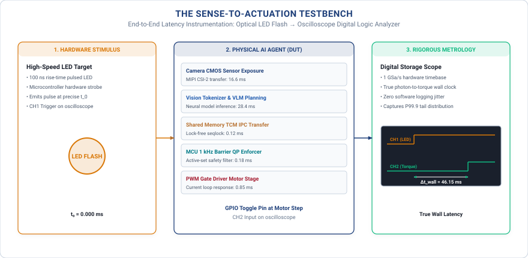

# The Physical Constraints

### *Sense-to-Actuation Metrology and the Five Columns* {.unnumbered .unlisted}

{#fig-locator-ch02 width=100%}

*Why does a neural model that comfortably meets its 30 frames-per-second benchmark in testing cause a catastrophic collision on the physical hardware bench?*

In cloud computing and conventional digital intelligence, software operates in an artificial universe where time is a synthetic, turn-based coordinate. If an inference server stalls during a large-model forward pass, the operating system pauses the thread, buffers incoming network packets, and resumes execution once memory bandwidth clears; the digital universe patiently waits. In Physical AI, time is an unyielding, continuous dynamical state variable governed by the external universe. The physical world never waits for a neural network to finish deliberating. Every microsecond spent executing floating-point operations in silicon displaces moving mass through space ($d = v \cdot \Delta t$), degrades the freshness of sensory observations while spatial uncertainty expands ($\sigma_{\text{pos}}(t) = \sigma_0 + v_{\text{target}}\Delta t$), accumulates non-recoverable Joule heat across motor windings ($Q \propto I^2 R \cdot t$), and introduces phase lag that systematically erodes closed-loop control stability. To build embodied machines that survive in the material world, this chapter establishes the physical instruments, International System of Units (SI) metrology, and quantitative budgets across the five fundamental physical columns: Time and Freshness, Inertia and Stopping, Actuation Limits, Energy and Thermal Headroom, and Silicon Determinism.



::: {.callout-objective}
### Learning Objectives

After studying this chapter, you will be able to:

1. **Trace** end-to-end latency across the seven-stage sense-to-actuation waterfall, accounting for microsecond delays from photon transduction to electromagnetic motor torque generation.
2. **Evaluate** tail latency distributions ($P_{90}$, $P_{99}$, $P_{99.9}$) against the $P_{50}$ throughput illusion, proving why extreme tail blowouts govern physical survival in closed-loop systems.
3. **Model** information freshness decay across time and calculate the geometric Freshness Wall ($\Delta t_{\text{wall}}$) where spatial belief diverges catastrophically from physical reality.
4. **Derive** two-phase dynamic stopping kinematics ($d_{\text{stop}}$) combining linear reaction displacement and quadratic braking distance under worst-case tail latency spikes.
5. **Enforce** electromagnetic inductance limits ($\tau_e = L/R$) and $\mathcal{C}^2$ differential jerk continuity ($\dddot{\mathbf{q}}$) to protect mechanical gearboxes and transmissions from stress fracture and tooth shear.
6. **Budget** thermal and energy headroom using stator winding Joule heating differential equations and edge silicon thermal throttling models.
7. **Architect** silicon determinism on heterogeneous System-on-Chips using unified memory bus quality-of-service arbitration, lock-free static SRAM mailboxes, and the Iron Law of Zero-Heap Execution (`malloc = 0`).
:::


## The World Sets the Clock: Metrology and the 7-Stage Latency Waterfall

In digital computing, time is an artificial coordinate created by a quartz oscillator. A clock crystal pulses at a fixed frequency, driving synchronous logic gates and stepping register states forward across discrete cycles. When an operating system thread encounters a resource stall, the kernel deschedules the process, suspends its instruction pointer, and queues incoming network packets in dynamic memory buffers. Once system bandwidth recovers, the scheduler restores the thread context and execution resumes without data corruption. In this synthetic domain, computational delay is benign: an algorithm that takes twice as long to complete consumes more energy and delays the delivery of an advisory result, but the digital universe patiently holds its state.

Deploying neural policies into the physical world shatters this computational comfort. In Physical AI, the physical universe serves as the unyielding master clock. Physical time cannot be paused, suspended, or rolled back. While an application processor executes floating-point operations inside silicon, external dynamical state evolves continuously under immutable differential equations. Every microsecond of computational delay displaces moving mass through space ($d = \int v(t) \, dt$), ages sensory evidence while spatial uncertainty boundaries expand ($\sigma_{\text{pos}}(t) = \sigma_0 + v_{\text{target}} \Delta t$), accumulates irreversible Joule heat across copper motor windings ($Q = \int I^2 R \, dt$), and injects transport lag that systematically destroys closed-loop feedback stability. In embodied systems, elapsed time is never neutral; physical dynamics impose a non-negotiable physical deadline ($\tau_{\text{world}}$) that bounds the survival envelope of the machine.

```python
# THE SOFTWARE TIMESTAMP DELUSION (DO NOT DO THIS)
t_start = time.time()
action = policy_model(camera_image)
t_end = time.time()
measured_latency = t_end - t_start
```

Software engineers transitioning to embodied systems almost universally attempt to quantify latency by wrapping high-level model invocations in standard user-space software timers. Listing 2.1 illustrates this widespread practice, which we term the *software timestamp delusion*. The developer captures a system clock value immediately prior to invoking the neural policy, records a second timestamp upon function return, and computes the arithmetic difference. Because the resulting duration often clocks in at a comfortable fifteen or twenty milliseconds, the engineering team assumes their pipeline operates with ample timing headroom. On physical hardware, however, this simplistic measurement represents a catastrophic distortion of ground truth, concealing extensive physical and electrical delays across three fatal blindspots.

The first blindspot is operating system scheduling blindness. User-space software timers measure only the interval during which a specific application thread executes on the host central processing unit or dispatches kernels to an attached accelerator. This measurement completely ignores the extensive physical and silicon pipeline that precedes and follows user-space execution. It fails to account for the physical duration required for photons to integrate charge within silicon photodiode wells, the serialization delay across MIPI CSI-2 camera lanes, the memory bus contention incurred by Direct Memory Access (DMA) transfers into DRAM, the inter-process shared memory mailbox handoffs, and the electromagnetic time constant required for motor phase current to build against winding inductance. A policy reported by Python to execute in twenty milliseconds routinely incurs an actual physical sense-to-actuation delay exceeding one hundred milliseconds.

The second blindspot is the observer effect inherent to software profiling. Invoking timing primitives such as POSIX `clock_gettime(CLOCK_MONOTONIC, ...)` or high-level wrappers like `time.time()` requires executing kernel system calls or reading specialized architecture timer registers. These diagnostic invocations force user-to-kernel context transitions, introduce execution bubbles in superscalar execution pipelines, and invalidate instruction and data cache lines. In high-frequency control loops running at hundreds of hertz, the computational overhead of profiling alters the cache occupancy and scheduling behavior of the very pipeline under test, distorting the empirical latency distribution.

The third blindspot is clock domain skew across heterogeneous processing silicon. Robust physical architectures partition cognitive planning from deterministic safety enforcement across separate chips: a high-throughput Microprocessor Unit (MPU) executes the operating system and neural accelerators, while an independent Real-Time Microcontroller Unit (MCU) executes hard real-time safety supervisors. Each physical chip operates from its own independent quartz crystal oscillator. Due to semiconductor manufacturing tolerances, supply voltage fluctuations, and localized thermal gradients, these independent crystals exhibit thermal frequency drift of ten to fifty parts per million. Without specialized hardware timestamp synchronization lines, software clocks across the two processors accumulate uncontrolled millisecond-scale skew, rendering cross-chip software timestamps statistically meaningless.

{#fig-metrology-setup width=100%}

Establishing true latency metrology requires bypassing software abstractions entirely in favor of physical, hardware-grounded instrumentation (@fig-metrology-setup). By capturing physical electrical transitions at the boundary of silicon pins and power inverters, engineering teams measure the absolute passage of time dictated by the external universe. This ground-truth topology employs a four-probe instrumentation architecture synchronized across high-bandwidth digital logic analyzers and mixed-signal oscilloscopes:

To capture the true physical inception of sensory data, Probe 1 connects a digital logic analyzer channel directly to the image sensor's hardware Start-of-Frame (SOF) strobe line or the low-level serial interface interrupt line. This hardware trigger marks the exact microsecond when optical charge integration concludes on the sensor die and active serialization across the camera bus begins, capturing the physical birth of the observation.

To measure cognitive processing completion on the host application processor, Probe 2 monitors a dedicated physical General Purpose Input/Output (GPIO) pin driven directly by the MPU. The neural execution runtime toggles this hardware pin via a direct memory-mapped register write at the precise machine instruction where candidate action chunks are committed into shared static memory. Because this write bypasses operating system system-call layers, it records cognitive completion without introducing observer timing jitter.

To verify the hard real-time safety boundary, Probe 3 interfaces a logic analyzer channel to a dedicated GPIO pin on the real-time microcontroller. The safety runtime asserts this pin upon completing its deterministic Control Barrier Function (CBF) quadratic program in static SRAM, precisely delineating the computational transition from an unverified neural proposal to an authorized physical control command.

To record the final delivery of mechanical effort, Probe 4 attaches an isolated oscilloscope current probe to a low-side current shunt resistor on the motor inverter bridge. Rather than measuring a digital command packet in software memory, this analog probe captures the physical rise of stator winding phase current ($I(t)$), establishing the exact microsecond when electromagnetic torque is applied to the mechanical transmission. 

Subtracting the timestamp of Probe 1 from Probe 4 reveals the true, uncorrupted sense-to-actuation latency of the embodied system.

{#fig-latency-waterfall width=100%}

When instrumented with hardware-level metrology, the complete sense-to-actuation pathway decomposes into seven distinct, sequential physical and computational stages (@fig-latency-waterfall and @tbl-latency-ledger). Each stage represents a concrete hardware mechanism with its own characteristic delay distribution and physical scaling laws:

Stage 1 represents Optical and Physical Transduction ($t_{\text{transduce}}$). When photons reflected from the environment strike the camera optical stack, they pass through a Bayer color filter array and enter the silicon depletion region of active pixel photodiodes. Under standard indoor operational illumination levels ($150\text{ to } 300\text{ lux}$), photodiode wells require an integration exposure duration between $8\text{ and } 15\text{ ms}$ to accumulate sufficient electrical charge to overcome thermal noise and achieve an acceptable signal-to-noise ratio. Once integration completes, on-die correlated double sampling circuits measure the accumulated charge and integrated analog-to-digital converters (ADCs) digitize the voltage levels. This temporal delay is governed strictly by the physics of optical flux and semiconductor bandgap properties; it cannot be compressed by increasing downstream computing power.

Stage 2 is Direct Memory Access (DMA) Ingestion and Serialization ($t_{\text{dma}}$). Following analog digitization, the image sensor serializes digitized pixel data into high-speed packet streams transmitted across MIPI CSI-2 differential physical lanes (D-PHY or C-PHY). At the host System-on-Chip (SoC), a dedicated camera serial interface receiver deserializes the packet stream and hands the byte blocks to an autonomous Direct Memory Access engine. The DMA engine arbitrates for access across the internal system crossbar interconnect, transferring raw image frames into circular ring buffers located in main dynamic RAM ($3\text{ to } 8\text{ ms}$). Latency jitter in this stage arises from system bus contention when concurrent high-throughput processing units generate simultaneous memory requests.

Stage 3 encompasses Perception and Spatial Feature Tokenization ($t_{\text{perceive}}$). Once the raw image frame resides in accessible memory, dedicated Neural Processing Units (NPUs) or graphics accelerators execute the vision backbone. Modern embodied architectures utilize vision transformers or self-supervised models such as DINOv2 to extract high-dimensional semantic representations. The model divides the input image into non-overlapping spatial patches (typically $14\times 14$ or $16\times 16$ pixels), projects them linearly into embedding vectors, and executes sequential multi-head self-attention and feed-forward layers across dense tensor execution arrays ($12\text{ to } 25\text{ ms}$). This stage converts raw two-dimensional pixel arrays into structured three-dimensional spatial token maps representing workspace geometry and object affordances.

Stage 4 represents Policy Planning and Action Chunk Decoding ($t_{\text{inference}}$). The extracted spatial tokens pass to the primary policy network, which generates coordinated motion trajectories. Embodied AI policies, such as Action Chunking with Transformers (ACT) or Denoising Diffusion Policy Architectures, decode spatial embeddings into multi-step chunks of continuous joint waypoints ($22\text{ to } 60\text{ ms}$). Because diffusion models require multiple sequential denoising iterations and autoregressive transformers execute iterative token decoding, this stage constitutes the single largest computational workload in the pipeline, exhibiting significant tail variance when memory bandwidth saturates.

Stage 5 is Inter-Processor Communication ($t_{\text{ipc}}$). Because the high-throughput operating system on the MPU cannot guarantee hard real-time scheduling determinism, the generated trajectory chunks must cross the physical boundary to the deterministic real-time microcontroller. The MPU packs the candidate waypoints into a structured, contiguous memory payload within shared tightly-coupled SRAM and triggers a hardware mailbox interrupt line ($0.8\text{ to } 2.0\text{ ms}$). The latency of this stage depends on kernel interrupt dispatch latency, memory barrier synchronization overhead, and bus bridge arbitration.

Stage 6 constitutes Real-Time Safety Veto and Enforcement ($t_{\text{enforce}}$). Operating deterministically at a strict $1000\text{ Hz}$ control cadence ($1.0\text{ ms}$ cycle budget) within static microcontroller SRAM, the real-time safety supervisor evaluates the candidate action chunk against physical invariants. The microcontroller verifies dynamic stopping distances, checks kinematic joint velocity limits, and solves a continuous Control Barrier Function (CBF) quadratic program ($0.4\text{ to } 1.0\text{ ms}$). If the candidate trajectory approaches an unsafe state boundary, the quadratic program smoothly projects the command onto the boundary of the safe set $\mathcal{C}$, producing certified, dynamically feasible actuator references.

Stage 7 is Electromagnetic Actuator Rise Time ($t_{\text{actuator}}$). Even after the microcontroller modulates pulse-width modulated (PWM) gate drive signals to the motor inverter bridges, mechanical torque cannot appear instantaneously. Electric motor stator coils possess intrinsic electrical inductance $L$ and internal winding resistance $R$. In accordance with Kirchhoff's voltage law and Faraday's law of induction, the terminal phase voltage $V(t)$ relates to phase current $I(t)$ and back-electromotive force $e_{\text{emf}}(t)$ by:

$$V(t) = R \cdot I(t) + L \frac{dI(t)}{dt} + e_{\text{emf}}(t)$$

When a step voltage is applied to the stator windings, the resulting phase current rises exponentially toward its target level according to:

$$I(t) = I_{\text{target}} \left( 1 - e^{-t / \tau_e} \right)$$

where $\tau_e = L / R$ represents the electrical time constant of the actuator. Because electromagnetic Lorentz force and motor torque are directly proportional to stator phase current ($\tau_{\text{motor}} = k_t \cdot I$), achieving ninety-five percent of commanded physical torque requires approximately three electrical time constants ($3\tau_e$), consuming between $6\text{ and } 15\text{ ms}$. This electromagnetic inertia is an unavoidable physical barrier; software cannot command torque faster than the electrical $L/R$ characteristics of the motor windings permit.

| Stage | Subsystem and Mechanism | $P_{50}$ | $P_{99}$ | Bottleneck Classification |
| :--- | :--- | :---: | :---: | :--- |
| **1. Transduce ($t_{\text{transduce}}$)** | Photodiode charge well integration | $8.0\text{ ms}$ | $15.0\text{ ms}$ | Physics (Optical flux) |
| **2. DMA Ingest ($t_{\text{dma}}$)** | DMA transfer over MIPI CSI-2 to DRAM | $3.0\text{ ms}$ | $8.0\text{ ms}$ | Bandwidth (Memory crossbar) |
| **3. Perception ($t_{\text{perceive}}$)** | ViT / DINOv2 spatial tokenization | $12.0\text{ ms}$ | $25.0\text{ ms}$ | Compute (Accelerator execution) |
| **4. Policy ($t_{\text{inference}}$)** | Diffusion / ACT action chunk decoding | $22.0\text{ ms}$ | $60.0\text{ ms}$ | Compute (Model evaluation) |
| **5. Inter-IPC ($t_{\text{ipc}}$)** | Shared SRAM mailbox transfer | $0.8\text{ ms}$ | $2.0\text{ ms}$ | Scheduling (Mailbox interrupt) |
| **6. Enforce ($t_{\text{enforce}}$)** | Control Barrier Function evaluation | $0.4\text{ ms}$ | $1.0\text{ ms}$ | Determinism (1 kHz control tick) |
| **7. Actuator ($t_{\text{actuator}}$)** | Stator coil $L/R$ electrical rise time | $6.0\text{ ms}$ | $15.0\text{ ms}$ | Physics (Coil inductance) |
| **TOTAL** | **End-to-End Latency Chain** | **$52.2\text{ ms}$** | **$126.0\text{ ms}$** | **Budget Ceiling: $\le 80.0\text{ ms}$** |

: The 7-stage sense-to-actuation latency ledger. Deconstructing end-to-end delay across physical transduction, memory bus transfers, neural processing, inter-core communication, real-time safety evaluation, and electromagnetic actuator rise time. {#tbl-latency-ledger}

The cumulative summation of these seven stages forms the total sense-to-actuation latency ledger (@tbl-latency-ledger):

$$t_{\text{total}} = t_{\text{transduce}} + t_{\text{dma}} + t_{\text{perceive}} + t_{\text{inference}} + t_{\text{ipc}} + t_{\text{enforce}} + t_{\text{actuator}}$$

Under nominal operating conditions ($P_{50}$), the complete sense-to-actuation pipeline executes in $52.2\text{ ms}$, comfortably beneath the system's physical deadline ceiling of $\tau_{\text{world}} = 80.0\text{ ms}$. Under worst-case tail conditions ($P_{99}$), however, memory bus saturation, operating system scheduling jitter, and neural decoding tails inflate the total delay to $126.0\text{ ms}$. This tail expansion represents a catastrophic violation of the physical timing boundary.

In classical feedback control theory, computational latency acts as a pure transport delay ($e^{-s t_{\text{total}}}$) inserted directly into the feedback path. Evaluating this delay operator in the frequency domain ($s = j\omega$) reveals that while transport delay exhibits a constant unity gain magnitude ($|e^{-j\omega t_{\text{total}}}| = 1$), it introduces a phase lag that grows linearly with frequency:

$$\Delta \phi(\omega) = -\omega \cdot t_{\text{total}} \quad \text{[radians]} = -\omega \cdot t_{\text{total}} \left(\frac{180^\circ}{\pi}\right) \quad \text{[degrees]}$$

For a physical plant with open-loop transfer function $L_0(s)$, the system phase margin ($\text{PM}$) at the gain crossover frequency $\omega_c$ (where $|L_0(j\omega_c)| = 1$) is defined as:

$$\text{PM} = 180^\circ + \angle L_0(j\omega_c) - \omega_c \cdot t_{\text{total}} \left(\frac{180^\circ}{\pi}\right)$$

To guarantee asymptotic stability in the presence of unmodeled dynamics, the closed-loop system must maintain a strictly positive phase margin ($\text{PM} > 0^\circ$). This requirement establishes the fundamental Closed-Loop Stability Criterion for Physical AI:

$$t_{\text{total}}(P_{99}) + t_{\text{margin}} < \tau_{\text{world}}$$

Designing reliable Physical AI systems therefore requires budgeting and certifying every microsecond of the 7-stage latency waterfall against extreme tail distributions rather than nominal averages.

The physical world deadline ($\tau_{\text{world}}$) varies substantially across the Three Canonical Archetypes introduced in Chapter 1:
* **Archetype 1: Mobility (Kinematic & Aerodynamic Systems):** High-speed obstacle avoidance and aerodynamic flight stabilization impose world deadlines between $\tau_{\text{world}} \approx 30\text{ and } 80\text{ ms}$. A drone encountering turbulent wind gusts or an autonomous mobile robot navigating dynamic warehouse corridors must close its sense-to-actuation loop before unguided displacement breaches safety clearance margins.
* **Archetype 2: Contact Manipulation (Rigid & Compliant Linkages):** Physical contact dynamics, grasping transitions, and tactile slip-prevention reflexes operate on tighter horizons of $\tau_{\text{world}} \approx 5\text{ to } 20\text{ ms}$. When an articulated gripper grasps a delicate or compliant object, delaying motor counter-torque allows micro-slips to escalate into dropped objects or excessive contact forces to fracture parts.
* **Archetype 3: Cybernetic Energy & Processes (Fluid, Chemical & Grid Flows):** High-voltage power electronics and grid-tied battery inverters demand sub-millisecond phase-lock synchronization ($\tau_{\text{world}} < 1\text{ ms}$) to prevent grid instability, while bulk chemical reactors and fluid thermal loops operate across slower transport horizons ($\tau_{\text{world}} \approx 0.5\text{ to } 5\text{ s}$). Regardless of the specific archetype, the mathematical stability criterion remains invariant: total worst-case latency must never breach $\tau_{\text{world}}$.


## Column 1: Time Constants and The Freshness Wall

Having established hardware ground-truth metrology and mapped the seven sequential stages of delay in Section 1, we now formalize the first physical column bounding embodied agency: the physics of time and information freshness. In classical software engineering, latency is treated as a quality-of-service tuning parameter; if a cloud database responds slowly, the user interface simply displays a loading indicator. In Physical AI, time is an irreversible thermodynamic coordinate. Sensory data degrades from the exact microsecond of photon exposure, and closed-loop stability is governed not by comfortable median averages, but by the catastrophic statistical tails of the execution distribution.

### The Tail Latency Law: Why $P_{50}$ Is an Unsafe Metric

In web services and datacenter computing, engineering teams routinely evaluate system performance using median throughput ($P_{50}$) or moderate percentiles such as $P_{95}$. In digital workloads, occasional tail latency spikes merely delay page rendering or cause transient network packet retransmissions without corrupting persistent system state. In Physical AI systems, however, evaluating software efficiency through median latency is a dangerous practice that conceals fatal physical risks.

Physical AI platforms operate within continuous, high-frequency closed-loop control environments. An autonomous robot or articulated manipulator executing at a standard $50\text{ Hz}$ control cadence completes exactly 180,000 discrete control cycles every hour ($50\text{ cycles/second} \times 3,600\text{ seconds/hour}$). In this high-frequency regime, statistical tail probabilities multiply rapidly into frequent operational events. Certifying a safety envelope against the 99th percentile ($P_{99}$) means that the remaining one percent tail manifests as 1,800 timing violations per hour—an unmitigated timing blowout once every two seconds. Even if an engineering team expends substantial effort to optimize software execution and certifies against the 99.9th percentile ($P_{99.9}$), the remaining 0.1% tail still unleashes 180 severe timing stalls every hour, translating to three computational blackouts every single minute. In high-speed physical interaction, where unbraked inertia carries mass into obstacles within tens of milliseconds, three stalls per minute represents an unacceptable operational hazard.

| Latency Percentile | Execution Condition on Embedded SoC | Systems Impact on Hardware |
| :--- | :--- | :--- |
| **$P_{50}$ ($33.0\text{ ms}$)** | Nominal cache-hot execution; low bus contention | Baseline tracking performance within safety margin |
| **$P_{90}$ ($68.0\text{ ms}$)** | L2 cache misses; background DMA frame transfer | Consumes $85\%$ of closed-loop timing budget |
| **$P_{99}$ ($126.0\text{ ms}$)** | Memory crossbar saturation; thread preemption | Breaches $\tau_{\text{world}}$; triples dynamic stopping distance |
| **$P_{99.9}$ ($240.0\text{ ms}$)** | Kernel page writeback; memory compaction stall | Loss of closed-loop control; blind travel over $0.48\text{ m}$ |

: Latency percentile behavior on embedded heterogeneous System-on-Chips. As execution shifts from nominal cache-hot states to operating system scheduling stalls, latency expands substantially. {#tbl-latency-percentiles}

On embedded Linux Systems-on-Chip (SoCs), latency distributions are heavily right-skewed (@tbl-latency-percentiles). These catastrophic tail spikes are driven by concrete silicon and operating system resource contention mechanisms. When high-priority kernel interrupts or asynchronous device drivers preempt user-space neural runtime threads, hot L1 and L2 cache lines holding active weights and spatial feature maps are evicted. Upon thread resumption, the processor suffers a cascade of pipeline stalls while reloading data from main memory. Furthermore, virtual memory management operations such as page migration, memory compaction, and dirty page writebacks trigger inter-processor interrupts (IPIs) that force synchronous Translation Lookaside Buffer (TLB) shootdowns across all CPU cores, freezing instruction pipelines for tens of microseconds. Simultaneously, high-bandwidth camera Direct Memory Access (DMA) channels and background storage daemons saturate the shared memory crossbar interconnect. When neural accelerator weight streaming contends with concurrent DMA bursts for DRAM access, memory controller queues back up, inflating nominal $33.0\text{ ms}$ inference passes into $240.0\text{ ms}$ computational blackouts. For an agent moving at $2.0\text{ m/s}$, a $240.0\text{ ms}$ tail blowout forces more than $0.48\text{ m}$ of uncommanded, blind forward travel before braking can even be initiated.

### The Pipelining Paradox: Throughput vs. Freshness

In classical computer architecture, instruction pipelining and multi-stage FIFO queues are fundamental techniques used to maximize processing throughput. By dividing a task into sequential stages (such as ingestion, feature extraction, neural inference, and command dispatch) and executing successive frames concurrently across specialized execution units, a system can maintain a high frame rate (such as $60\text{ frames per second}$) even when the total latency of each individual frame is substantial.

In Physical AI systems, applying this classical pipelining paradigm creates the *Pipelining Paradox*: maximizing computational throughput through deep queues systematically degrades information freshness. While pipelining increases the frequency of emitted control commands, it increases the temporal age of the sensory evidence upon which those commands are based. If an autonomous agent buffers three consecutive camera frames through a multi-stage FIFO queue, the motor torque vector executed at time $t$ is derived from sensory photons captured three full cycles in the past. If a dynamic obstacle moves into the robot's trajectory or an unexpected contact occurs, the agent remains completely oblivious, continuing to execute obsolete commands until the deep queue drains. In physical systems, high throughput with stale data is an active hazard.

Embodied AI architectures resolve the pipelining paradox by combining **low-latency latest-frame sampling** with **Action Chunking**. Under latest-frame sampling, the system replaces deep FIFO queues with a drop-oldest, zero-queue shared memory buffer. Whenever the neural policy completes an inference cycle, it samples exclusively the single most recently completed sensor frame from memory, instantly discarding any intermediate frames that arrived while the processor was busy. To bridge the frequency mismatch between relatively slow neural inference ($10\text{ to } 50\text{ Hz}$) and high-frequency deterministic motor control ($500\text{ to } 1000\text{ Hz}$), the neural policy does not output single-step commands. Instead, it predicts multi-step action chunks—temporal horizons of future joint waypoints and feedforward torques. A deterministic real-time safety supervisor running on an independent microcontroller consumes these chunks, verifying physical constraints and interpolating smooth setpoints at $1\text{ kHz}$ while the high-level policy deliberates on the latest available observation.

### Spatial Uncertainty Expansion

Sensory observations begin aging the exact microsecond photons strike the photodiode depletion region or acoustic waves reach a transducer. An image frame does not describe the present state of the physical world; it describes where the physical world was located at the historical instant of exposure $t_{\text{transduce}}$.

We define the **Information Age** ($\Delta t$) at the instant of physical actuation as the total elapsed time between physical transduction and the application of electromagnetic motor torque:

$$\Delta t = t_{\text{actuation}} - t_{\text{transduce}}$$

During this elapsed interval $\Delta t$, any unmodeled or moving entity in the workspace continues along its dynamic trajectory. For a dynamic target or obstacle moving with velocity vector $\mathbf{v}_{\text{target}}$, the spatial uncertainty envelope ($\sigma_{\text{pos}}$) bounding the agent's internal belief expands as a function of information age:

$$\sigma_{\text{pos}}(t) = \sigma_0 + \|\mathbf{v}_{\text{target}}\| \cdot \Delta t$$

where $\sigma_0$ represents intrinsic sensor calibration and measurement noise, and $\|\mathbf{v}_{\text{target}}\|$ is the characteristic velocity of dynamic objects in the environment. As computational delays, memory bus transfers, and actuator rise times accumulate, the spatial volume in which the obstacle might reside expands outward from its last observed coordinates, steadily eroding the physical clearance margin available for safe motion.

### The Freshness Wall

Every physical manipulation or navigation task defines a finite geometric clearance boundary $d_{\text{clearance}}$ between the robot's physical body and surrounding workspace obstacles. When the spatial uncertainty envelope $\sigma_{\text{pos}}(t)$ expands to equal the available clearance $d_{\text{clearance}}$, the robot can no longer guarantee that its planned trajectory is collision-free. Setting $\sigma_{\text{pos}}(t) = d_{\text{clearance}}$ and solving for elapsed time yields the **Freshness Wall** ($\Delta t_{\text{wall}}$):

$$\Delta t_{\text{wall}} = \frac{d_{\text{clearance}} - \sigma_0}{\|\mathbf{v}_{\text{target}}\|}$$

The Freshness Wall is not a soft performance guideline or an optimization heuristic; it is a hard, geometrically grounded temporal deadline imposed by the kinematics of the physical environment. If total sense-to-actuation latency $\Delta t$ equals or exceeds $\Delta t_{\text{wall}}$, the agent's internal representation has drifted so far from physical ground truth that candidate neural proposals become active collision hazards rather than safe control actions.

The physical meaning of the Freshness Wall manifests distinctly across our Three Canonical Archetypes:
* In **Archetype 1 (Mobility)**, $\Delta t_{\text{wall}}$ is governed by closing velocity with external workspace obstacles ($\|\mathbf{v}_{\text{target}}\|$). For a warehouse AMR traveling at $2.0\text{ m/s}$ with an obstacle clearance of $0.20\text{ m}$ (and sensor noise $\sigma_0 = 0.02\text{ m}$), the Freshness Wall collapses to $\Delta t_{\text{wall}} = (0.20 - 0.02)/2.0 = 90\text{ ms}$. Any sense-to-actuation latency tail exceeding $90\text{ ms}$ guarantees that the robot is making steering decisions based on hallucinated spatial clearance.
* In **Archetype 2 (Contact Manipulation)**, $\Delta t_{\text{wall}}$ is dictated by end-effector approach velocities and microscopic tactile slip rates. When an articulated manipulator inserts a peg into a chamfered hole with $2\text{ mm}$ clearance at an approach velocity of $0.2\text{ m/s}$, the Freshness Wall is a razor-thin $\Delta t_{\text{wall}} = 10\text{ ms}$. Exceeding this limit causes the gripper to jam against the fixture before contact forces can be sensed and relieved.
* In **Archetype 3 (Cybernetic Energy & Processes)**, $\Delta t_{\text{wall}}$ represents the critical phase angle drift window during grid frequency disturbances or the chemical reaction runaway horizon in an exothermic reactor. If a power inverter's telemetry age exceeds the grid fault clearing window ($16\text{ to } 33\text{ ms}$), active current injection exacerbates voltage collapse rather than stabilizing the grid.

| Operating Regime | Information Age $\Delta t$ | Physical State and Action Authority |
| :--- | :--- | :--- |
| **Fresh Observation** | $\Delta t \ll \Delta t_{\text{wall}}$ | Spatial uncertainty is bounded ($\sigma_{\text{pos}} < d_{\text{clearance}}$); candidate neural proposals are valid and permitted. |
| **Degraded Freshness** | $\Delta t \to \Delta t_{\text{wall}}$ | Uncertainty approaches obstacle boundary; safety enforcer derates commanded velocity to compress stopping distance. |
| **Beyond Freshness Wall** | $\Delta t \ge \Delta t_{\text{wall}}$ | Sensory evidence is stale ($\sigma_{\text{pos}} \ge d_{\text{clearance}}$); neural proposals are vetoed and deterministic controlled dynamic braking is engaged. |

: Information freshness regimes and physical action authority. How sensory staleness $\Delta t$ relative to the Freshness Wall $\Delta t_{\text{wall}}$ dictates whether candidate neural proposals are executed, derated, or vetoed. {#tbl-freshness-regimes}

To guarantee continuous physical safety, the real-time microcontroller monitors information age against $\Delta t_{\text{wall}}$ and arbitrates action authority across three distinct operating regimes (@tbl-freshness-regimes). In the *Fresh Observation* regime ($\Delta t \ll \Delta t_{\text{wall}}$), spatial uncertainty remains tightly bounded within safe clearance margins, allowing verified neural proposals to pass directly to low-level motor controllers. As sensory delay grows into the *Degraded Freshness* regime ($\Delta t \to \Delta t_{\text{wall}}$), the safety supervisor autonomously derates the robot's operational velocity, compressing reaction distance and preserving stopping headroom. If a tail latency spike pushes the system *Beyond the Freshness Wall* ($\Delta t \ge \Delta t_{\text{wall}}$), all high-level neural trajectory proposals are immediately vetoed, and the deterministic safety supervisor engages controlled dynamic braking to bring the mechanism to an autonomous, safe halt.

---

## Column 2: Inertia, Momentum, and Dynamic Stopping Kinematics

While Column 1 established how computational delay degrades information freshness in the temporal domain, Column 2 translates that temporal delay into the physical spatial domain. In the digital world, stopping a computational process requires only resetting an instruction pointer or clearing an execution queue. In the material world, moving mass carries kinetic momentum that cannot be erased by software assertion. To guarantee physical survival, an embodied system must govern its operational velocity so that its total dynamic stopping distance—combining linear reaction displacement during computational blackouts with quadratic braking kinematics—never exceeds available physical clearance.

### Inertia, Kinetic Energy, and the Physics of Deceleration

In digital computing, changing a velocity state variable or zeroing an actuator setpoint in software memory is an instantaneous, single-cycle operation. In physical mechanics, however, moving bodies possess physical mass and inertia. According to Newtonian mechanics, a body of mass $m$ translating at velocity vector $\mathbf{v}$ carries linear momentum $\mathbf{p}$ and kinetic energy $E_k$:

$$\mathbf{p} = m\mathbf{v}, \qquad E_k = \frac{1}{2} m v_0^2$$

Because momentum is conserved, bringing a moving physical body to rest requires applying an opposing force $\mathbf{F}_{\text{brake}}$ over a finite duration $\Delta t$, governed by the impulse-momentum theorem:

$$\int_0^{\Delta t} \mathbf{F}_{\text{brake}}(t) \, dt = \Delta \mathbf{p} = -m v_0$$

Simultaneously, halting the mass requires completely dissipating its kinetic energy $E_k$. In embodied machines, this kinetic energy must be converted into thermal energy through friction braking or absorbed via electromagnetic counter-torque in the motor drives. The rate at which counter-force can be applied is fundamentally bounded by mechanical constraints: actuator peak torque ratings, drivetrain structural stress limits, and tire or end-effector traction boundaries before slip occurs. Consequently, physical mass cannot halt instantaneously; deceleration is a continuous physical process that unfolds over both time and space.

### Deriving the Two-Phase Stopping Equation

{#fig-stopping-distance width=100%}

To quantify the physical hazard introduced by computational latency, we derive the **Dynamic Stopping Distance** ($d_{\text{stop}}$): the total displacement traversed by an embodied agent from the exact microsecond an obstacle enters the sensory field until the mechanism reaches a complete physical halt ($v = 0$).

As illustrated in @fig-stopping-distance, the dynamic stopping envelope divides into two distinct physical regimes: an unguided reaction phase governed by computational latency, and an active braking phase governed by mechanical deceleration limits.

#### Phase 1: The Linear Reaction Phase ($0 \le t \le \Delta t_{\text{delay}}$)

During the initial interval $0 \le t \le \Delta t_{\text{delay}}$, the agent remains mechanically blind to the newly appeared obstacle. While photons integrate in photodiode charge wells, Direct Memory Access engines transfer raw frame buffers, neural accelerators compute spatial embeddings, and inter-processor mailboxes synchronize across chip boundaries, the low-level motor drives continue executing prior setpoints with zero commanded deceleration ($a(t) = 0$). 

Throughout this computational blackout, the vehicle or manipulator travels forward at its initial velocity $v_0$. Integrating velocity over the duration of the computational delay yields the **Reaction Distance** ($d_{\text{react}}$):

$$d_{\text{react}} = \int_{0}^{\Delta t_{\text{delay}}} v_0 \, dt = v_0 \cdot \Delta t_{\text{delay}}$$

This result exposes the fundamental insight bridging computer systems architecture and physical mechanics: **computational latency $\Delta t_{\text{delay}}$ is not an abstract temporal overhead, but a direct, linear physical displacement through space.** Every millisecond of scheduling delay, memory bus contention, or neural inference tail translates into unguided projectile travel where the machine moves forward with zero obstacle awareness.

#### Phase 2: The Quadratic Braking Phase ($\Delta t_{\text{delay}} < t \le t_{\text{stop}}$)

At timestamp $t = \Delta t_{\text{delay}}$, the real-time controller processes the perception update and commands maximum safe deceleration $a_{\text{max}}$, bounded by motor peak counter-torque and mechanical traction limits. The equation of motion governing the velocity trajectory during this deceleration phase is:

$$\frac{dv(t)}{dt} = -a_{\text{max}} \implies v(t) = v_0 - a_{\text{max}} \left( t - \Delta t_{\text{delay}} \right)$$

The mechanism comes to a complete rest ($v(t_{\text{stop}}) = 0$) at the terminal stopping time $t_{\text{stop}}$:

$$t_{\text{stop}} = \Delta t_{\text{delay}} + \frac{v_0}{a_{\text{max}}}$$

Integrating velocity over the active braking interval from $t = \Delta t_{\text{delay}}$ to $t = t_{\text{stop}}$ yields the **Braking Distance** ($d_{\text{brake}}$):

$$d_{\text{brake}} = \int_{\Delta t_{\text{delay}}}^{t_{\text{stop}}} \left[ v_0 - a_{\text{max}} (t - \Delta t_{\text{delay}}) \right] dt = \frac{v_0^2}{2 a_{\text{max}}}$$

While the reaction distance scales linearly with velocity, the braking distance scales **quadratically with velocity** ($v_0^2$) and inversely with maximum available deceleration ($a_{\text{max}}$).

#### The Unified Two-Phase Stopping Equation

Summing the displacement across both physical phases yields the **Two-Phase Stopping Equation**:

$$d_{\text{stop}}(v_0, \Delta t_{\text{delay}}) = \underbrace{v_0 \cdot \Delta t_{\text{delay}}}_{\text{Phase 1: Linear Reaction Distance}} \;+\; \underbrace{\frac{v_0^2}{2 a_{\text{max}}}}_{\text{Phase 2: Quadratic Braking Distance}}$$

The two terms in this equation represent two fundamentally different physical regimes. Phase 1 is governed by computer systems efficiency, memory hierarchy arbitration, and algorithm execution latency. Phase 2 is governed by classical Newtonian mechanics, electromagnetic torque capacity, and friction limits. The total dynamic stopping distance couples both domains into a single kinematic constraint.

This dynamic stopping formulation applies across the Three Canonical Archetypes with distinct mechanical transformations:
* In **Archetype 1 (Mobility)**, $d_{\text{stop}}$ directly governs chassis displacement. If an autonomous rover travels at forward velocity $v_0$, every millisecond of sensory latency expands the vehicle's unguided trajectory, risking high-speed vehicle impact with terrain or pedestrians.
* In **Archetype 2 (Contact Manipulation)**, the stopping formulation translates into joint-space angular displacement $\boldsymbol{\theta}_{\text{stop}}(\dot{\mathbf{q}}_0, \Delta t) = \dot{\mathbf{q}}_0 \cdot \Delta t + \frac{\dot{\mathbf{q}}_0^2}{2\ddot{\mathbf{q}}_{\text{max}}}$, parameterized by the configuration-dependent multi-body inertia tensor $M(\mathbf{q})$. When a 6-DoF arm decelerates toward an assembly fixture, latency tails force the end-effector forward along its Cartesian path, crushing tooling pins before joint counter-torques engage.
* In **Archetype 3 (Cybernetic Energy & Processes)**, macroscopic kinematic momentum is physically absent (rendering $d_{\text{stop}}$ non-binding), but fluid momentum in pressurized cooling loops exhibits an identical dynamical analog: the Joukowsky water hammer equation ($\Delta P = \rho c \cdot \Delta v$). When a high-pressure pump or fast-acting solenoid valve is abruptly stepped by an AI controller without ramp smoothing, fluid inertia creates severe acoustic shock waves that rupture pipe fittings.

### Quantitative Kinematic Case Walkthrough

To observe how computational tail latency directly determines physical survival, consider an autonomous mobile platform operating in an industrial warehouse. The vehicle navigates at an initial velocity $v_0 = 1.0\text{ m/s}$ with a certified maximum braking deceleration of $a_{\text{max}} = 2.0\text{ m/s}^2$. The vehicle approaches a workspace boundary with an initial obstacle clearance distance of $d_{\text{clearance}} = 0.350\text{ m}$ ($35\text{ cm}$).

Under nominal operating conditions ($P_{50}$), where cache lines remain hot and the memory bus experiences low contention, the end-to-end sense-to-actuation pipeline executes in $\Delta t_{\text{delay}} = 30\text{ ms}$ ($0.030\text{ s}$). Evaluating the two-phase stopping equation yields:

$$d_{\text{react}} = 1.0\text{ m/s} \times 0.030\text{ s} = 0.030\text{ m} \quad (3\text{ cm})$$

$$d_{\text{brake}} = \frac{(1.0\text{ m/s})^2}{2 \times 2.0\text{ m/s}^2} = 0.250\text{ m} \quad (25\text{ cm})$$

$$d_{\text{stop}} = 0.030\text{ m} + 0.250\text{ m} = 0.280\text{ m} \quad (28\text{ cm})$$

Because the total dynamic stopping distance ($28\text{ cm}$) is smaller than the available clearance ($35\text{ cm}$), the mobile platform comes to a controlled halt with a safe residual margin of $7\text{ cm}$ ($0.070\text{ m}$).

Now consider the identical mechanical maneuver when the application processor encounters a tail latency spike ($P_{99}$). Due to memory crossbar saturation and kernel thread preemption, the sense-to-actuation delay inflates to $\Delta t_{\text{delay}} = 230\text{ ms}$ ($0.230\text{ s}$). Evaluating the stopping distance under this tail condition reveals:

$$d_{\text{react}} = 1.0\text{ m/s} \times 0.230\text{ s} = 0.230\text{ m} \quad (23\text{ cm})$$

$$d_{\text{brake}} = \frac{(1.0\text{ m/s})^2}{2 \times 2.0\text{ m/s}^2} = 0.250\text{ m} \quad (25\text{ cm})$$

$$d_{\text{stop}} = 0.230\text{ m} + 0.250\text{ m} = 0.480\text{ m} \quad (48\text{ cm})$$

While the mechanical braking distance remains unchanged at $25\text{ cm}$, the linear reaction distance expands from $3\text{ cm}$ to $23\text{ cm}$. The resulting total stopping distance of $48\text{ cm}$ substantially exceeds the available $35\text{ cm}$ clearance, causing the vehicle to collide with the obstacle at an overrun of $+13\text{ cm}$ ($0.130\text{ m}$). 

The systems takeaway is stark: a $200\text{ ms}$ computational scheduling stall adds exactly $20\text{ cm}$ of unguided projectile travel, turning a certified safe maneuver into a destructive physical impact.

### The Dynamic Safety Clearance Invariant

Because high-level neural policies execute on complex operating systems subject to non-deterministic scheduling tails, physical safety cannot rely on the expectation that neural inference will meet its nominal deadline. Instead, the real-time microcontroller must independently evaluate and enforce safety at hardware speeds.

Operating deterministically within static SRAM at a strict $1\text{ kHz}$ control cadence ($1.0\text{ ms}$ cycle loop), the microcontroller evaluates the **Dynamic Safety Clearance Invariant** on every execution tick:

$$d_{\text{clearance}} \ge d_{\text{stop}}\left(v_0, \Delta t(P_{99.9})\right) + d_{\text{margin}}$$

where $d_{\text{margin}}$ is an empirical safety buffer accounting for sensor measurement noise, ground traction variations, and slope irregularities. Crucially, the invariant evaluates the dynamic stopping distance parameterized not by average latency, but by the empirical worst-case tail latency distribution ($\Delta t(P_{99.9})$). 

If the measured clearance distance to any obstacle violates this inequality, the microcontroller immediately revokes execution authority from the upstream application processor. Bypassing any pending neural trajectory proposals, the microcontroller commands autonomous closed-loop dynamic braking, ensuring that the physical mechanism halts safely before the clearance boundary is breached.

---

## Column 3: Actuation Limits, Inductive Rise Time, and Jerk Continuity

Macroscopic safety models frequently abstract robotic actuators into idealized, instantaneous torque and force sources governed by a constant peak acceleration bound. In physical embodiments, however, mechanical motion is fundamentally constrained by the coupled dynamics of electromagnetic fields and elastic mechanical transmissions. Actuators cannot step torque instantaneously; they must build magnetic flux against the electrical impedance of stator windings, transmit torque through finite-stiffness gear teeth, and continuously respect the structural vibration modes of the physical robot. When deep learning policies generate discrete action waypoints without regard for these continuous physical transduction boundaries, the resulting commanded trajectories demand infinite derivatives of acceleration, risking catastrophic actuator fatigue, sensor corruption, and mechanical failure.

### Electromagnetic Stator Inductance and Electrical Rise Time

The primary transduction interface of an electromagnetic actuator converts electrical energy from a DC power bus into mechanical rotor torque. A brushless DC (BLDC) or permanent-magnet synchronous motor (PMSM) is characterized by stator windings possessing non-zero electrical resistance and inductance. The dynamic relationship governing phase voltage, phase current, and rotor velocity follows the fundamental differential equation:

$$V(t) = R \cdot I(t) + L \frac{dI(t)}{dt} + K_e \cdot \omega(t)$$

where $V(t)$ is the applied terminal phase voltage, $R$ represents the phase winding resistance, $L$ is the phase winding inductance, $I(t)$ is the phase current, $K_e$ is the motor back-electromotive force (back-EMF) constant, and $\omega(t)$ is the instantaneous angular velocity of the rotor. 

Because electromagnetic torque is directly proportional to phase current ($\boldsymbol{\tau}_{\text{rotor}}(t) = K_t I(t)$, where $K_t$ is the motor torque constant), torque generation is constrained by the rate at which current can change within the stator coils. The electrical dynamics are characterized by the electrical time constant:

$$\tau_e = \frac{L}{R}$$

When an inverter applies a step change in voltage from the DC bus $V_{\text{bus}}$, the phase current rises not instantaneously, but exponentially according to:

$$I(t) = \frac{V_{\text{bus}} - K_e\omega(t)}{R}\left(1 - e^{-t/\tau_e}\right)$$

This exponential rise creates a fundamental physical lag between the command issued by an AI policy and the physical generation of torque. Furthermore, as rotor speed $\omega(t)$ increases, the back-EMF voltage $K_e\omega(t)$ grows linearly in opposition to the bus voltage. This effect drastically narrows the net voltage headroom $(V_{\text{bus}} - K_e\omega(t))$, thereby suppressing the maximum attainable current derivative $dI/dt$ and diminishing dynamic torque responsiveness at high operational velocities.

### Mechanical Transmission Deflection and Torque Rate Limits

The mechanical torque produced by the rotor must pass through a transmission system—such as a harmonic strain wave drive, planetary gearhead, or cycloidal reducer—to match the low-speed, high-torque demands of robotic joints. Transmissions are not rigid kinematic couplers; they are elastic structures subject to continuous stress, compliance, and material limits. The transmission gear teeth experience concentrated shear stresses at the tooth root during torque transfer, governed by:

$$\sigma_{\text{shear}} = \frac{\boldsymbol{\tau}}{W_p} \le \sigma_{\text{yield}}$$

where $\boldsymbol{\tau}$ is the transmitted joint torque, $W_p$ is the polar section modulus of the gear tooth geometry, and $\sigma_{\text{yield}}$ is the material yield strength of the alloy.

If a control policy demands a step change in commanded torque, the theoretical torque derivative approaches infinity:

$$\dot{\boldsymbol{\tau}} = \frac{d\boldsymbol{\tau}}{dt} \longrightarrow \infty$$

In physical hardware, an unbounded torque rate launches high-frequency mechanical stress waves through the gear teeth and flexspline cups. This impulsive loading induces localized surface fatigue, gear tooth micro-pitting, and flexspline shear fracture. In geared mechanisms with non-zero backlash, sudden torque reversals cause the gear teeth to separate across the deadband and collide at high relative velocity, multiplying peak impact stresses and accelerating mechanical degradation. To protect the mechanical transmission and ensure stable closed-loop control, embedded motor drives must enforce an explicit torque rate limit:

$$\|\dot{\boldsymbol{\tau}}(t)\| \le \dot{\tau}_{\text{max}}$$

### The Danger of Discontinuous AI: Mechanical Jerk

A critical architectural tension exists between modern discrete neural network policies and continuous mechanical systems. Deep reinforcement learning, diffusion policies, and spatial action transformers typically operate at discrete control frequencies between $10\text{ Hz}$ and $50\text{ Hz}$, generating waypoint commands every $20\text{ to } 100\text{ ms}$. When a downstream controller directly executes discrete joint setpoints without continuous interpolation, the commanded acceleration jumps discontinuously at each policy inference boundary. The third time derivative of generalized position—mechanical jerk $\mathbf{j}(t)$—diverges to infinity:

$$\mathbf{j}(t) = \dddot{\mathbf{q}}(t) = \frac{d^3\mathbf{q}}{dt^3} = \frac{d\mathbf{a}}{dt} \longrightarrow \infty$$

Unbounded mechanical jerk triggers three severe physical failure modes in embodied systems. First, high-frequency jerk spikes inject energy across a broad spectral bandwidth, exciting unmodeled structural resonance modes in robotic links and flexible chassis, which induces violent self-sustaining oscillations. Second, in strain-wave harmonic drives, sudden acceleration transients subject the thin-walled elastic flexspline to cyclical torsional shock loads, accelerating micro-crack propagation and leading to catastrophic tooth shear. Third, the resulting high-frequency vibrations saturate the dynamic range of onboard MEMS accelerometers and gyroscopes, introducing high-amplitude sensor noise that corrupts state estimation filters and causes state estimators, such as Extended Kalman Filters, to diverge.

### Enforcing $\mathcal{C}^2$ Differential Continuity and Temporal Blending

To maintain mechanical integrity, trajectory commands dispatched to low-level motor controllers must exhibit $\mathcal{C}^2$ differential continuity. This requires continuous position $\mathbf{q}(t)$, continuous velocity $\dot{\mathbf{q}}(t)$, and continuous acceleration $\ddot{\mathbf{q}}(t)$, ensuring that mechanical jerk remains strictly bounded within physical limits:

$$\|\dddot{\mathbf{q}}(t)\| \le \dddot{q}_{\text{max}}$$

Modern physical AI architectures bridge the gap between discrete policy predictions and continuous control via action chunking and spline synthesis. Rather than emitting isolated waypoints, policies predict an entire chunk of future waypoints spanning a temporal horizon $H$. An onboard real-time trajectory generator fits piecewise quintic Hermite polynomial splines across the discrete waypoint sequence:

$$\mathbf{q}(t) = \sum_{k=0}^{5} \mathbf{c}_k t^k$$

Because a quintic polynomial possesses six boundary coefficients per interval, it uniquely satisfies continuous position, velocity, and acceleration constraints at both the start and end of every trajectory segment, guaranteeing $\mathcal{C}^2$ continuity across the entire chunk. Furthermore, running action chunking in a receding horizon with temporal ensembling blends overlapping predictions from successive inference cycles using exponentially decaying weights. This continuous blending filters high-frequency policy noise and eliminates step-to-step jerk discontinuities, delivering smooth, dynamically feasible control trajectories to the underlying actuator hardware.

The severity and physical domain of actuation limits vary across our Three Canonical Archetypes:
* In **Archetype 2 (Contact Manipulation)**, mechanical transmissions represent the most vulnerable bottleneck. High-ratio strain-wave gears and planetary reducers experience intense tooth root shear stress ($\sigma_{\text{shear}}$). Without strict torque rate limiting ($\dot{\boldsymbol{\tau}}_{\text{max}}$) and $\mathcal{C}^2$ jerk continuity ($\dddot{\mathbf{q}}_{\text{max}}$), discontinuous policy commands induce micro-fractures in steel flexsplines and destroy expensive robotic gearboxes.
* In **Archetype 1 (Mobility)**, actuation limits protect contact traction and chassis stability. Discontinuous acceleration commands break tire friction boundaries, inducing uncontrolled vehicle skids or wheel slip that corrupts wheel odometry, while in aerial drones, sudden rotor thrust steps trigger aerodynamic vortex ring states and structural frame resonance.
* In **Archetype 3 (Cybernetic Energy & Processes)**, actuation boundaries shift from mechanical linkages to high-voltage power semiconductors. In megawatt grid inverters, the analog of jerk is the electrical current slew rate ($di/dt$) and voltage rate-of-rise ($dv/dt$). Switching multi-kiloampere circuits too rapidly generates extreme inductive voltage spikes ($V = L \cdot di/dt$) that punch through gate oxide layers and destroy solid-state power switches.


## Column 4: Energy, Thermal Accumulation, and Derating

Every actuation command dispatched across the causal boundary requests a physical transfer of energy. In accordance with the first and second laws of thermodynamics, no physical energy conversion is perfectly conservative. Whether an embodied system drives an electromagnetic motor, switches a high-voltage power inverter, or pumps fluid through a chemical reactor, a substantial fraction of the applied electrical and mechanical energy degrades irreversibly into thermal energy. While the electromagnetic dynamics analyzed in Column 3 evolve across millisecond electrical time constants ($\tau_e = L/R \approx 5\text{ to } 15\text{ ms}$), thermal energy operates in a fundamentally slower dynamical regime governed by thermal time constants on the order of tens to hundreds of seconds ($\tau_{\text{th}} = R_{\text{th}}C_{\text{th}} \approx 10\text{ to } 300\text{ s}$).

Thermal accumulation establishes a non-negotiable physical constraint across both ends of an embodied architecture. In the physical plant, sustained Joule heating degrades conductor insulation, demagnetizes permanent magnets, and threatens power semiconductor junctions. In the computing substrate, prolonged high-throughput neural inference elevates silicon die temperatures, triggering hardware thermal throttling that dynamically degrades clock frequencies and inflates inference latency. An autonomous machine cannot maintain long-term physical stability without quantitatively modeling and actively managing this thermal balance across both actuators and compute silicon.

### Thermal Time Constants and First-Order Dissipation Dynamics

To formalize thermal accumulation, consider an arbitrary physical component subject to electrical current, such as an electric motor stator coil, a power semiconductor switch, or a grid battery bus bar. The instantaneous rate of thermal energy storage within the component is governed by the conservation of energy: the rate of heat generation minus the rate of heat dissipation to the surrounding environment equals the rate of internal energy change.

Internal heat generation is dominated by resistive Joule dissipation, where electrical power loss scales quadratically with current:

$$P_{\text{loss}}(t) = I^2(t) R$$

where $I(t)$ is the instantaneous root-mean-square (RMS) phase current and $R$ is the electrical resistance of the conductive path. Heat dissipation to the ambient thermal reservoir at temperature $T_{\text{ambient}}$ occurs via conduction, convection, and radiation. Under linear thermal modeling assumptions, this cooling flux is governed by Newton's law of cooling and Fourier's law of heat conduction, parameterized by the lumped thermal resistance $R_{\text{th}}$ (in $^\circ\text{C}/\text{W}$):

$$P_{\text{diss}}(t) = \frac{T(t) - T_{\text{ambient}}}{R_{\text{th}}} = \frac{\Delta T(t)}{R_{\text{th}}}$$

where $\Delta T(t) = T(t) - T_{\text{ambient}}$ represents the temperature rise above ambient. The component's capacity to store thermal energy without an instantaneous jump in temperature is defined by its lumped thermal capacitance $C_{\text{th}}$ (in $\text{J}/^\circ\text{C}$), which is the product of its physical mass $m$ and specific heat capacity $c_p$ ($C_{\text{th}} = m \cdot c_p$). Combining heat generation, dissipation, and thermal storage yields the **first-order thermal differential equation**:

$$C_{\text{th}} \frac{d\Delta T(t)}{dt} = I^2(t) R - \frac{\Delta T(t)}{R_{\text{th}}}$$

Multiplying through by the thermal resistance $R_{\text{th}}$ isolates the characteristic **thermal time constant** ($\tau_{\text{th}}$):

$$\tau_{\text{th}} = R_{\text{th}} C_{\text{th}}$$

$$\tau_{\text{th}} \frac{d\Delta T(t)}{dt} + \Delta T(t) = I^2(t) R R_{\text{th}}$$

For a constant current magnitude $I$ applied over time to a system starting from an initial temperature offset $\Delta T(0)$, solving this ordinary differential equation yields the continuous temperature trajectory:

$$\Delta T(t) = I^2 R R_{\text{th}} \left( 1 - e^{-t / \tau_{\text{th}}} \right) + \Delta T(0) e^{-t / \tau_{\text{th}}}$$

This formulation reveals the profound time-scale hierarchy separating electrical and thermal dynamics in physical systems. While the electrical current establishes its steady-state trajectory within milliseconds ($\tau_e \approx 5\text{ to } 15\text{ ms}$), the resulting temperature rise accumulates gradually over tens or hundreds of seconds ($\tau_{\text{th}} \approx 10\text{ to } 300\text{ s}$). Because thermal mass $C_{\text{th}}$ absorbs energy over time, physical actuators and power stages can safely support high current bursts far above their continuous ratings for brief intervals. However, if an artificial intelligence policy commands elevated current for a duration comparable to $\tau_{\text{th}}$, temperatures climb inexorably toward destructive steady-state ceilings.

### Continuous Current Ratings and Peak Burst Envelopes

The steady-state thermal behavior of an actuator defines its fundamental operational boundaries. When a constant current $I$ is applied indefinitely, the system eventually reaches thermal equilibrium ($\frac{d\Delta T}{dt} = 0$), where the rate of Joule heat generation exactly balances ambient heat dissipation:

$$I^2 R = \frac{\Delta T_{\text{ss}}}{R_{\text{th}}} \implies \Delta T_{\text{ss}} = I^2 R R_{\text{th}}$$

Every physical mechanism is constrained by a maximum safe operating temperature rise $\Delta T_{\text{max}} = T_{\text{critical}} - T_{\text{ambient, max}}$, beyond which irreversible material degradation occurs. Setting the steady-state temperature rise equal to this maximum allowable threshold ($\Delta T_{\text{ss}} = \Delta T_{\text{max}}$) and solving for current establishes the **continuous current rating** ($I_{\text{cont}}$):

$$I_{\text{cont}} = \sqrt{\frac{\Delta T_{\text{max}}}{R \cdot R_{\text{th}}}}$$

The continuous current rating $I_{\text{cont}}$ is fundamentally a thermal limit rather than an electrical or magnetic barrier. It represents the maximum current that the system can sustain in steady state under worst-case ambient conditions without exceeding material thermal tolerances.

Embodied tasks frequently demand brief bursts of high force or torque—such as a legged robot jumping over an obstacle, a robotic manipulator rapidly accelerating a heavy payload, or a power inverter injecting reactive current during a transient grid disturbance. During these short intervals ($\Delta t_{\text{burst}} \ll \tau_{\text{th}}$), the component can draw a peak current ($I_{\text{peak}} \approx 2\text{ to } 5 \times I_{\text{cont}}$). Because the burst duration is much shorter than the thermal time constant, heat dissipation to the environment during the pulse is negligible ($\int P_{\text{diss}} dt \approx 0$). The lumped thermal capacitance absorbs virtually all dissipated Joule energy, producing an adiabatic temperature rise:

$$\Delta T_{\text{pulse}} \approx \frac{I_{\text{peak}}^2 R \cdot \Delta t_{\text{burst}}}{C_{\text{th}}}$$

To prevent the component from exceeding its maximum allowable temperature rise $\Delta T_{\text{max}}$, the maximum permissible duration for a peak current burst is bounded by:

$$\Delta t_{\text{burst, max}} \le \frac{C_{\text{th}} \Delta T_{\text{max}}}{I_{\text{peak}}^2 R} = \tau_{\text{th}} \left( \frac{I_{\text{cont}}}{I_{\text{peak}}} \right)^2$$

Because the allowable burst duration shrinks quadratically with the current ratio ($I_{\text{cont}} / I_{\text{peak}})^2$, commanding double the continuous current reduces the safe execution window to one-quarter of the thermal time constant, while commanding four times the continuous current reduces the window to one-sixteenth. When a neural policy commands peak current beyond this strict temporal limit, the physical plant rapidly crosses into irreversible breakdown regimes.

### Physical Breakdown Modes across Energy and Actuation Subsystems

Exceeding thermal limits does not merely degrade performance; it induces permanent, catastrophic physical destruction across three primary hardware domains.

In electromagnetic actuators, the primary failure mode is stator winding insulation breakdown. Motor stator coils are wound from copper magnet wire coated with a microscopic dielectric polymer enamel, typically rated according to standard insulation classes such as Class F ($155^\circ\text{C}$) or Class H ($180^\circ\text{C}$). When high phase currents drive stator temperatures beyond these thermal thresholds, the polymer enamel undergoes accelerated pyrolytic degradation and embrittlement. In accordance with the Arrhenius reaction rate equation, every $10^\circ\text{C}$ increase in operating temperature above the rated class halves the insulation lifespan. Eventually, mechanical vibrations cause the brittle enamel to flake, creating direct turn-to-turn or phase-to-phase electrical short circuits that instantly destroy the motor.

Simultaneously, elevated temperatures threaten permanent magnet demagnetization. High-performance brushless servomotors rely on rare-earth neodymium-iron-boron ($\text{NdFeB}$) permanent magnets mounted on the rotor. The intrinsic magnetic coercivity of $\text{NdFeB}$ decreases sharply with increasing temperature, exhibiting a negative temperature coefficient between $-0.5\%$ and $-0.6\%$ per degree Celsius. When rotor temperatures rise into the range of $80^\circ\text{C}\text{ to } 120^\circ\text{C}$, the material operating point drops below the knee of the magnetic demagnetization curve. Under the opposing magnetic fields generated by high stator currents, the rotor magnets suffer irreversible thermal demagnetization. This loss of magnetic remanence permanently lowers the motor torque constant ($K_t$), permanently reducing the actuator's torque output per ampere and rendering all downstream control calibrations invalid.

In power electronics and conversion stages, insulated-gate bipolar transistors (IGBTs) and silicon MOSFETs are bounded by maximum semiconductor junction temperatures ($T_{j,\text{max}} \approx 150^\circ\text{C}\text{ to } 175^\circ\text{C}$). Operating power switches near or above this junction limit triggers massive increases in thermally generated intrinsic carrier concentrations, leading to loss of gate voltage control and localized current crowding. Furthermore, severe thermal cycling induces differential thermal expansion between the silicon die, copper baseplate, and direct bonded copper (DBC) ceramic substrate. This cyclic thermo-mechanical shear stress precipitates wire bond lift-off, solder fatigue, and catastrophic transistor thermal runaway.

### The Firmware $I^2t$ Thermal Energy Accumulator

Physical temperature sensors, such as negative temperature coefficient (NTC) thermistors or platinum resistance thermometers (PT100), are standard components in industrial hardware. However, relying solely on physical thermistors for real-time thermal protection is fundamentally unsafe. Because thermistors must be electrically isolated from high-voltage coils and are physically mounted on the exterior stator teeth, motor casing, or heat sink baseplates, they are separated from the internal copper conductors and silicon junctions by substantial thermal resistance and thermal capacitance. This physical separation introduces a spatial thermal conduction lag between $5\text{ and } 30\text{ seconds}$. During an intense stall current event, the internal winding insulation can vaporize or a semiconductor junction can melt long before the external thermistor registers a dangerous temperature rise.

To ensure deterministic, instantaneous protection, the real-time permission supervisor implements a mathematical **$I^2 t$ thermal energy accumulator** directly in firmware. Executing at a strict $1000\text{ Hz}$ control cadence ($1.0\text{ ms}$ loop tick) in static, zero-allocation SRAM, the supervisor continuously integrates excess Joule dissipation:

$$E_{\text{thermal}}[k] = \max\left( 0, \; E_{\text{thermal}}[k-1] + \left( I^2[k] - I_{\text{cont}}^2 \right) \Delta t \right)$$

where $I[k]$ is the measured root-mean-square phase current at discrete tick $k$, $I_{\text{cont}}$ is the certified continuous current rating, and $\Delta t = 0.001\text{ s}$ is the control period. When current remains below $I_{\text{cont}}$, the accumulator decays monotonically toward zero. When current exceeds $I_{\text{cont}}$, the accumulator increases in exact proportion to the un-dissipated thermal energy injected into the system.

Alternatively, for systems where ambient temperature variations and continuous cooling dynamics must be tracked across wide operating ranges, the supervisor evaluates a discrete first-order thermal state observer:

$$\Delta \hat{T}[k] = \Delta \hat{T}[k-1] \cdot e^{-\Delta t / \tau_{\text{th}}} + I^2[k] R R_{\text{th}} \left( 1 - e^{-\Delta t / \tau_{\text{th}}} \right)$$

The real-time supervisor compares the modeled thermal energy against an allowable thermal energy ceiling $E_{\text{thermal, max}} = C_{\text{th}} \Delta T_{\text{max}}$. When $E_{\text{thermal}}[k]$ reaches a predefined derating threshold (typically $80\%$ of $E_{\text{thermal, max}}$), the permission supervisor autonomously intervenes. Bypassing any aggressive torque or power dispatch vectors requested by upstream neural policies, the supervisor smoothly scales down the allowable current limit:

$$I_{\text{clamp}}[k] = I_{\text{cont}} + (I_{\text{peak}} - I_{\text{cont}}) \cdot \max\left( 0, \; \frac{E_{\text{thermal, max}} - E_{\text{thermal}}[k]}{E_{\text{thermal, max}} - E_{\text{derate}}} \right)$$

If the thermal accumulator reaches $E_{\text{thermal, max}}$, the supervisor clamps commanded current strictly to $I_{\text{cont}}$, or forces a controlled shutdown if ambient conditions prevent stabilization. This deterministic firmware clamp guarantees that unverified neural proposals running on the application processor cannot push physical actuators or power converters beyond their certified thermal capacity.

::: {.callout-archetype title="Archetype Focus: Cybernetic Energy and Process Systems — Megawatt Grid Storage Inverter"}
* **Physical System:** 500 kW grid-tied battery energy storage inverter with liquid cooling loop.
* **Archetype Domain:** Archetype 3 (Cybernetic Energy and Process Systems).
* **Governing Physical Column:** Column 4 (Energy, Thermal Accumulation, and Derating).
* **Physical State Dynamics ($W_t \to W_{t+1}$):** Thermal capacitance $C_{\text{th}}$ of insulated-gate bipolar transistor (IGBT) silicon junctions, coolant fluid flux $\dot{V}$, and $I^2R$ resistive Joule dissipation in converter magnetics ($C_{\text{th}}\frac{d\Delta T}{dt} = I^2 R - \frac{\Delta T}{R_{\text{th}}}$).
* **The Systems Tension:** A high-level neural policy running on an edge server optimizes wholesale grid price arbitrage and battery state-of-charge ($1\text{ Hz}$ dispatch). If a sudden grid voltage sag occurs, the model commands maximum reactive current, but thermal accumulation ($\tau_{\text{th}} = 45\text{ s}$) threatens to destroy power semiconductor junctions ($T_j \ge 150^\circ\text{C}$).
* **The Proposal–Permission Contract:** The untrusted MPU proposes active/reactive power dispatch vectors ($P_t, Q_t$). The trusted DSP/microcontroller permission supervisor executes at $1000\text{ Hz}$ in zero-allocation static SRAM, continuously integrating the $I^2t$ thermal accumulator and autonomously clamping current to $I_{\text{cont}}$ before silicon breakdown occurs.
* **Cross-Archetype Synthesis:** While Mobility (Archetype 1) is bounded by kinetic stopping distances ($d_{\text{stop}}$) and Contact Manipulation (Archetype 2) is bounded by gearbox tooth shear ($\sigma_{\text{shear}}$), Cybernetic Energy Systems (Archetype 3) are bounded by thermal accumulation ($I^2t$) and fluid transport lags under the exact same proposal-permission architecture.
:::

### Silicon Thermal Throttling and Latency Inflation in Neural Accelerators

Thermal accumulation is not confined to the physical plant; it governs the edge silicon executing the neural models themselves. Modern edge System-on-Chips (SoCs), graphics processing units (GPUs), and neural processing units (NPUs) dissipate substantial electrical power when executing deep neural networks. Total silicon power dissipation combines dynamic switching power and static subthreshold leakage power:

$$P_{\text{SoC}} = \alpha C_{\text{load}} V_{\text{core}}^2 f_{\text{clk}} + I_{\text{leak}}(T_j) V_{\text{core}}$$

where $\alpha$ is the switching activity factor, $C_{\text{load}}$ is total capacitive load, $V_{\text{core}}$ is the core supply voltage, $f_{\text{clk}}$ is the clock frequency, and $I_{\text{leak}}(T_j)$ is temperature-dependent subthreshold leakage current. Because subthreshold leakage current increases nonlinearly with silicon junction temperature ($I_{\text{leak}} \propto T_j^2 e^{-q V_{\text{th}} / k_B T_j}$), high-throughput neural inference workloads generate intense localized thermal flux across dense accelerator dies.

To protect the silicon package from permanent thermal breakdown ($T_j \ge 105^\circ\text{C}$), modern System-on-Chips integrate on-die Dynamic Thermal Management (DTM) controllers. When internal diode temperature sensors detect that junction temperature has crossed a critical thermal threshold (typically between $85^\circ\text{C}\text{ and } 95^\circ\text{C}$), the hardware DTM unit autonomously activates Dynamic Voltage and Frequency Scaling (DVFS). The hardware controller scales down the core operating frequency $f_{\text{clk}}$ and core voltage $V_{\text{core}}$, reducing thermal dissipation at the direct expense of computational throughput.

This hardware protection mechanism gives rise to a deceptive systems failure mode: the *cold bench fallacy*. In standard development workflows, an engineering team benchmarks an embodied AI model in a temperature-controlled laboratory on a cold test bench. Starting from an idle junction temperature of $25^\circ\text{C}$, the neural accelerator operates at its peak burst clock frequency (for example, $1.8\text{ GHz}$). Under these cold conditions, a vision-language-action policy evaluates its vision backbone and diffusion action chunk decoding in $22\text{ ms}$, comfortably meeting a $50\text{ ms}$ real-time intent lease.

When the identical system is deployed inside an enclosed physical chassis without active refrigeration, continuous high-frequency inference drives the compact thermal mass to its thermal steady state. Within twenty to thirty minutes of sustained operation, the junction temperature crosses the thermal throttling threshold. The on-die governor downclocks the neural accelerator to its sustained base frequency (for example, $900\text{ MHz}$). As a direct consequence, inference latency doubles from $22\text{ ms}$ to $48\text{ ms}$ at the median ($P_{50}$) and blows out to $120\text{ ms}$ at the tail ($P_{99}$).

Crucially, this failure occurs without a software crash, kernel panic, or numerical error. The neural policy continues to execute normally and produces mathematically valid control actions, but the outputs arrive after the real-time microcontroller's intent lease ($\mathcal{L}_{\text{intent}}$) has expired. The microcontroller, observing an expired lease, rejects the stale proposal and repeatedly engages fallback dynamic braking, degrading operational availability.

| Physical Subsystem | Dominant Thermal Mechanism | Characteristic $\tau_{\text{th}}$ | Critical Temperature Limit | Physical Breakdown Failure Mode | Real-Time Safety Countermeasure |
| :--- | :--- | :---: | :---: | :--- | :--- |
| **Motor Stator Coils** | Joule heating in copper windings ($I^2 R$) | $30\text{ to } 120\text{ s}$ | $155^\circ\text{C}\text{ to } 180^\circ\text{C}$ (Class F/H) | Dielectric enamel pyrolytic breakdown and short circuits | Firmware $I^2t$ energy accumulator clamping to $I_{\text{cont}}$ |
| **Rotor Magnets** | Conductive/radiative heat transfer from stator | $60\text{ to } 300\text{ s}$ | $80^\circ\text{C}\text{ to } 120^\circ\text{C}$ (NdFeB) | Irreversible thermal demagnetization and loss of $K_t$ | Stator thermal observer and continuous torque derating |
| **Inverter Switches (IGBT/SiC)** | Conduction and switching losses ($V_{\text{ce}}I + E_{\text{sw}}f$) | $0.1\text{ to } 2.0\text{ s}$ | $150^\circ\text{C}\text{ to } 175^\circ\text{C}$ ($T_j$) | Thermal runaway, gate latch-up, and wire bond shear | Hardware desaturation detection and microsecond PWM shutdown |
| **Edge Neural Silicon (SoC/NPU)** | Dynamic switching and leakage ($C V^2 f + I_{\text{leak}} V$) | $10\text{ to } 60\text{ s}$ | $85^\circ\text{C}\text{ to } 100^\circ\text{C}$ ($T_j$) | Hardware DVFS downclocking inflating inference latency | Thermally conditioned intent leases and adaptive model pruning |

: Thermal characteristics, breakdown mechanisms, and safety countermeasures across physical and computational subsystems in Physical AI architectures. {#tbl-thermal-domains}

To prevent thermal latency collapse, robust Physical AI architectures apply three co-design principles across the computing and control boundary (@tbl-thermal-domains). First, real-time safety supervisors must parameterize their intent lease durations and dynamic stopping clearance checks against the worst-case, thermally saturated latency distribution ($P_{99,\text{hot}}$) rather than idealized cold-bench measurements ($P_{50,\text{cold}}$). Second, the host operating system must stream real-time SoC junction temperature and frequency scaling metrics to the high-level policy scheduler. When thermal saturation approaches, the scheduler can dynamically adapt its computational workload—for instance, by reducing the number of diffusion denoising steps or downsampling visual token resolutions—maintaining predictable inference cadence without triggering hardware thermal throttling. Third, physical enclosures must be engineered with explicit thermal dissipation paths and fluid cooling loops, treating silicon heat dissipation as a primary mechanical constraint co-equal with structural payload capacity.

## Column 5: Silicon Determinism and Memory Bus Contention

While Columns 1 through 4 examined the physical constraints governing the external world and the robotic plant—time freshness, inertial momentum, electromagnetic torque rise time, and thermal accumulation—the fifth physical column addresses the solid-state silicon substrate itself. In conventional software engineering, algorithms are abstracted as mathematical operations executing inside an idealized, infinite-bandwidth computing fabric. In Physical AI, however, intelligence executes on physical semiconductor circuits characterized by finite memory crossbar bandwidth, shared interconnect buses, multi-level cache hierarchies, and independent clock domains. When dense neural policies, high-bandwidth camera ingestion pipelines, and deterministic real-time control loops share this physical silicon substrate, resource contention within the memory subsystem becomes the primary physical root cause of the tail latency blowouts ($P_{99}$ and $P_{99.9}$) introduced in Column 1. To guarantee deterministic closed-loop stability, the physical AI architect must design memory transactions, inter-core communication, and execution runtimes with the same architectural rigor applied to mechanical gearboxes and thermal cooling loops.

### UMA DRAM Crossbar Contention

Modern embedded computing platforms deployed at the physical edge—such as autonomous mobile robots, quadrupedal platforms, and articulated industrial manipulators—almost universally adopt heterogeneous System-on-Chip (SoC) architectures. To minimize physical silicon area, package footprint, and electrical power consumption, these edge SoCs rely on a Unified Memory Architecture (UMA). Under a UMA design, multi-core application central processing units (CPUs), high-throughput Neural Processing Units (NPUs), graphics processing units (GPUs), integrated image signal processors (ISPs), and autonomous Direct Memory Access (DMA) engines all connect to a single shared dynamic random-access memory (DRAM) subsystem through an on-die system crossbar interconnect.

This unified topology introduces an intense architectural tax during real-time perception workloads, termed the *ingestion tax*. Modern embodied policies require rich visual observations to resolve environmental geometry and semantic affordances, streaming uncompressed high-definition video from multiple cameras (such as stereo $1080\text{p}$ or $4\text{K}$ video streams at $60\text{ frames per second}$). A dual-camera $1080\text{p}$ RGB streaming pipeline at $60\text{ FPS}$ ingests approximately $746\text{ MB/s}$ of raw pixel data, while an uncompressed $4\text{K}$ perception stream demands over $1.49\text{ GB/s}$ of continuous memory write throughput. The camera interface receivers and DMA engines autonomously blast these massive byte streams across the system crossbar directly into DRAM circular buffers.

Concurrently, the neural accelerator executes vision-language-action backbones or diffusion policy models. Unlike compute-bound matrix multiplications in large datacenter clusters with gigabytes of high-bandwidth memory (HBM), edge neural inference is heavily memory-bandwidth bound. During every forward evaluation pass, the NPU must stream hundreds of megabytes of neural network weights from DRAM into its local on-chip SRAM register files and multiply-accumulate (MAC) arrays. 

When high-bandwidth camera DMA write bursts coincide with dense NPU weight read transactions, the aggregate demand exceeds the saturation threshold of the shared DRAM crossbar interconnect. The memory controller's internal read queues become congested behind queued DMA write transactions. Because dynamic RAM requires physical bank precharge and row-activation cycles ($\text{tRP}$ and $\text{tRCD}$) when switching across disparate memory addresses, rapid interleaving between sequential camera frame writes and non-contiguous neural weight reads degrades effective memory bus efficiency by forty to sixty percent. As a direct consequence, the NPU compute pipeline suffers extensive memory stall cycles, waiting for weight tensors to arrive. This silicon bus contention inflates neural inference execution time from a nominal median of $P_{50} = 22\text{ ms}$ to severe tail spikes exceeding $P_{99} > 135\text{ ms}$, transforming an otherwise capable neural planner into an unpredictable bottleneck that starves downstream real-time control.

### Hardware Quality-of-Service (QoS) and Zero-Copy Ring Buffers

To prevent memory bus contention from inducing catastrophic latency tails, physical AI architectures enforce hardware-level traffic shaping and zero-copy memory pipelines across the SoC fabric. Relying on operating system thread scheduling alone is insufficient because standard software schedulers have no visibility into low-level hardware bus transactions occurring on the silicon crossbar.

First, the embedded architecture configures the memory controller's hardware Quality-of-Service (QoS) arbitration logic, such as ARM CoreLink AXI QoS priority engines. In an unmanaged SoC, the crossbar interconnect treats all bus transactions under simple round-robin or first-come, first-served arbitration, allowing bulk sensor DMA writes to block time-critical compute requests. By configuring hardware QoS registers at the silicon interconnect level, the system establishes strict priority hierarchies. Read requests originating from the neural processing unit and high-frequency real-time control packets are assigned the highest hardware priority classes, while bulk sensor DMA ingestion streams are assigned lower, bandwidth-throttled priority tiers. When crossbar congestion occurs, the memory controller autonomously pauses lower-priority DMA write bursts, servicing time-critical neural weight reads with bounded, deterministic memory access latency.

Second, the perception pipeline must eliminate cache hierarchy pollution through non-cacheable zero-copy DMA buffers. In naive software implementations, incoming camera frames are ingested into standard user-space memory pools allocated by the operating system. As the CPU and NPU process these incoming frames, gigabytes of transient pixel data stream through the shared multi-level cache hierarchy (L2 and L3 caches). This flood of bulk pixel data rapidly evicts hot neural network weight tensors, activation scratchpads, and real-time state estimation lookup tables from the cache lines, forcing subsequent computation passes to incur costly cache misses and main memory reloads.

Physical AI architectures eliminate this cache thrashing by allocating dedicated, physically contiguous memory regions using contiguous memory allocators (such as Linux DMA-BUF or CMA subsystems) configured with non-cacheable memory attributes. The camera DMA engine writes digitized pixel packets directly into these physically mapped circular ring buffers in DRAM without routing data through the CPU or NPU cache hierarchies. The neural accelerator and image signal processor then read raw pixel tensors directly from these shared physical addresses via hardware pointers, achieving zero-copy data transfer. By bypassing cache allocation entirely during high-bandwidth ingestion, the system preserves cache residency for critical model weights and execution stacks, isolating neural inference from sensory ingestion jitter.

### Heterogeneous Cache Coherency and Inter-Core Mailboxes

Embodied autonomy fundamentally relies on a heterogeneous compute topology: an application processor (MPU) executes the complex, non-deterministic cognitive and perception stack under an operating system such as Linux, while a dedicated real-time microcontroller (MCU) executes hard real-time dynamic safety enforcement and high-frequency motor commutation. However, bridging these two distinct silicon domains exposes the *cache coherency chasm*.

The host application processor (typically a multi-core 64-bit ARM Cortex-A or x86 architecture) operates with complex multi-level cache hierarchies (L1 instruction and data caches, private L2 caches, and a shared system L3 cache), out-of-order execution pipelines, and a Memory Management Unit (MMU) governing virtual memory paging. In contrast, the real-time microcontroller (such as an ARM Cortex-M or real-time RISC-V core) operates in physical address space using deterministic, single-cycle static SRAM (such as Tightly-Coupled Memory, TCM), completely lacking an MMU, virtual page tables, or hardware cache snooping logic.

When the application processor computes a multi-step trajectory chunk and writes the candidate waypoints into shared DRAM, the newly generated data initially resides in the application core's dirty L1 or L2 write-back cache lines rather than in physical DRAM. Because the real-time microcontroller reads physical memory directly without participating in the application core's hardware cache coherency protocol, the microcontroller will read stale, uninitialized, or corrupted memory if it accesses the buffer before the application core's cache lines are evicted. Conversely, if the application core continuously performs explicit cache maintenance operations—issuing cache clean and invalidate instructions—the resulting software overhead introduces millisecond-scale execution jitter that undermines temporal predictability.

To bridge this cache coherency chasm deterministically, physical AI systems implement a three-part data exchange topology:

1. **Dedicated Non-Cacheable On-Chip SRAM Mailboxes:** Inter-core communication is hosted entirely within a dedicated region of on-chip static SRAM that is mapped as non-cacheable and strongly-ordered (or device memory) in the application processor's MMU page tables. By ensuring that writes from the application processor bypass the cache hierarchy and commit immediately to physical SRAM cells, the architecture eliminates the need for software cache flushing while guaranteeing zero staleness for the receiving microcontroller.
2. **Lock-Free Single-Producer Single-Consumer (SPSC) Ring Buffers:** Trajectory proposals and actuator telemetry are transferred across the shared SRAM using lock-free single-producer single-consumer circular ring buffers. The producer and consumer synchronize their access using 64-bit atomic monotonic sequence counters aligned to hardware cache line boundaries. This design guarantees wait-free execution, completely eliminating operating system mutual exclusion primitives (such as mutexes, semaphores, or spinlocks) that introduce non-deterministic blocking, priority inversion, and kernel scheduler latency.
3. **Hardware Mailbox Peripheral Interrupts:** When the application processor commits a verified action chunk into the shared ring buffer, it asserts a memory-mapped hardware mailbox peripheral line (such as an ARM Message Handling Unit). This hardware signal bypasses operating system software interrupt dispatch, firing directly into the microcontroller's Nested Vectored Interrupt Controller (NVIC) or physical interrupt vector table. The microcontroller transitions from its idle state or control baseline in sub-microsecond time, eliminating operating system polling loops and establishing microsecond-accurate inter-processor synchronization.

This heterogeneous silicon topology serves distinct real-time roles across our Three Canonical Archetypes:
* In **Archetype 1 (Mobility)**, silicon determinism isolates navigation models from sensory ingestion bursts. When autonomous rovers or drones ingest simultaneous multi-view RGB and depth streams, hardware QoS ensures that camera DMA transactions cannot stall the NPU during obstacle avoidance inference.
* In **Archetype 2 (Contact Manipulation)**, lock-free static SRAM mailboxes provide the sub-millisecond bridge required for tactile reflex loops. High-frequency joint torque sensors and tactile array interrupts stream directly into MCU TCM memory, enabling 1 kHz Control Barrier Functions to intervene before physical contact forces exceed part-breakage limits.
* In **Archetype 3 (Cybernetic Energy & Processes)**, hardware interrupt lines synchronize digital signal processors (DSPs) to high-voltage AC grid waveforms. Operating without operating system jitter, the DSP samples analog-to-digital converters (ADCs) at microsecond intervals, computing phase angles and driving PWM inverter gates in lockstep with the 50/60 Hz electrical utility grid.

### The Iron Law of Real-Time Safety: Zero Dynamic Heap Allocation

While high-level cognitive models running on application processors rely extensively on dynamic software abstractions, the low-level safety enforcer running on the real-time microcontroller operates under a radically different computational paradigm. Mechanical systems and closed-loop control laws cannot tolerate execution timing uncertainty; a motor control interrupt service routine that misses its $1.0\text{ ms}$ execution deadline by fifty microseconds can trigger current overshoot, inverter shoot-through, or dynamic instability.

To guarantee that worst-case execution time (WCET) remains strictly bounded and deterministic, real-time embedded safety systems enforce the Iron Law of Zero Dynamic Heap Allocation.

::: {.callout-important title="The Iron Law of Real-Time Safety: Zero Dynamic Heap Allocation"}
**Zero dynamic memory allocations (`malloc`, `free`, `new`, `delete`, or dynamically resizing STL containers such as `std::vector` and `std::map`) are permitted inside the $1000\text{ Hz}$ safety supervisor loop, the Control Barrier Function solver, or high-frequency motor control interrupt service routines.**
:::

Permitting dynamic heap allocation within real-time control silicon introduces three severe, irrecoverable failure modes:

1. **Non-Deterministic Execution Time (Free-List Traversal Jitter):** Standard heap allocators manage memory pools using dynamic linked free lists (such as boundary-tag allocators or segregated fit bins). When software invokes `malloc` or `free`, the allocator must traverse the free list to find a contiguous block of unallocated memory that satisfies the requested size. Under quiescent conditions, this search may complete in several hundred nanoseconds. However, as memory is allocated and released over time, the free list fragments, forcing the allocator to perform variable-length pointer chasing. Under worst-case fragmentation, a single allocation call can stall the processor for hundreds of microseconds, blowing through the real-time control tick deadline and destabilizing high-frequency feedback loops.
2. **Memory Fragmentation over Extended Multi-Hour Operation:** In long-duration physical missions, such as an autonomous mobile robot operating continuously for twelve hours, repeated dynamic allocation and deallocation of variable-sized buffers (such as dynamic trajectory arrays or incoming telemetry packets) inevitably fragments the heap. Over time, the heap becomes partitioned into a mosaic of small, non-contiguous free blocks. Eventually, a critical memory allocation fails because no single contiguous block exists that is large enough to satisfy the request, even though the total cumulative free memory appears abundant. This catastrophic out-of-memory condition causes the allocator to return a null pointer, precipitating unhandled runtime exceptions or abrupt system resets during active physical motion.
3. **Silent Stack-Heap Collisions Leading to Hard Processor Lockups:** Real-time microcontrollers operate within constrained static SRAM budgets (typically between $256\text{ KB}$ and $2\text{ MB}$) without hardware Memory Management Units or virtual memory guard pages. In this flat physical address space, the runtime execution stack grows downward from the highest static SRAM address, while the dynamic heap grows upward from the base of unallocated memory. Under bursty computational workloads or nested interrupt service routines, an expanding heap collides silently with the descending call stack. Because no MMU exists to catch the boundary crossing, the heap allocator silently overwrites active stack frames, destroying return addresses and local register backups. When the currently executing function attempts to return, the processor jumps to corrupted instruction addresses, triggering unrecoverable hardware faults (`HardFault_Handler`) that freeze the processor, disable PWM outputs, and leave physical actuators in unguided, free-wheeling states.

To eliminate these vulnerabilities, all memory structures on the real-time safety microcontroller are **statically allocated at compile time**. Every action chunk ring buffer, state estimation vector, kinematic transformation matrix, and Control Barrier Function quadratic program workspace is declared as fixed-size global static storage residing in dedicated SRAM memory sections (`.bss` and `.data`). Compile-time static allocation guarantees that the total memory footprint of the safety system is mathematically verifiable prior to flashing firmware onto silicon. The memory layout remains completely immutable throughout operation, reducing dynamic allocation overhead to zero, eliminating memory fragmentation, and guaranteeing that the real-time safety enforcer executes with absolu---

## The Requirements Ledger and The Studio Lab

Every engineering discipline requires a formal specification sheet that establishes the physical operating envelope of a machine prior to deployment. In civil engineering, structural blueprints record maximum load capacities and material yield strengths; in aeronautics, flight manuals record stall speeds, flutter margins, and service ceilings. In Physical AI, deploying learned policies without an empirical, hardware-verified specification sheet invites unmitigated hardware destruction. Before any autonomous agent or neural policy is permitted to command physical actuators, the engineering team must measure, calculate, and freeze the system's physical operating limits in a formal **Requirements Ledger**.

### Mapping the Canonical Archetypes to the Physical Columns

Not all physical systems are constrained equally by every column. A multi-megawatt grid battery storage system does not experience mechanical stopping distance or gearbox backlash, while a high-speed agile quadrotor is dominated by aerodynamic drag and translational momentum rather than high-voltage semiconductor thermal runaway. Understanding how the Three Canonical Archetypes map across the Five Physical Columns allows engineers to tailor safety enforcement architectures to the specific physical laws that bind their hardware platform (@tbl-archetype-columns).

| Physical Column | Archetype 1: Mobility (Rovers, Drones, AMRs) | Archetype 2: Contact Manipulation (Arms, Hands, Tooling) | Archetype 3: Cybernetic Energy & Processes (Grid Inverters, Fluid Loops) |
| :--- | :--- | :--- | :--- |
| **Column 1: Time & Freshness** | **● Dominant:** High-speed dynamic obstacle avoidance; tight Freshness Wall $\Delta t_{\text{wall}}$. | **● Dominant:** Rapid contact detection and slip-prevention reflexes ($< 10\text{ ms}$). | **◐ Moderately Constrained:** Multi-second chemical and thermal transport delays. |
| **Column 2: Inertia & Stopping** | **● Dominant:** Translational kinetic momentum; two-phase dynamic stopping distance $d_{\text{stop}}$. | **● Dominant:** Multi-link rigid body inertia matrix $M(\mathbf{q})\ddot{\mathbf{q}}$ and payload mass changes. | **○ Non-Binding:** Fluid and thermal mass have storage capacity but zero kinematic momentum. |
| **Column 3: Actuation Limits** | **◐ Moderately Constrained:** Steering actuator rate limits; rotor aerodynamic thrust response. | **● Dominant:** Gear tooth shear $\sigma_{\text{shear}}$, flexspline fatigue, and $\mathcal{C}^2$ jerk continuity. | **● Dominant:** Solid-state power switch $di/dt$ and $dv/dt$ inductive surge protection. |
| **Column 4: Energy & Thermal** | **◐ Moderately Constrained:** Traction battery discharge C-rates and thermal pack management. | **● Dominant:** Motor stator winding Joule heating ($I^2 R$) during continuous high-load stalls. | **● Dominant:** Power semiconductor junction thermal limits ($T_j \le 150^\circ\text{C}$) and coolant flux. |
| **Column 5: Silicon Determinism** | **● Dominant:** Multi-camera DMA streaming vs. neural weight memory bus contention. | **● Dominant:** 1 kHz Control Barrier Function safety enforcer in zero-heap static SRAM. | **● Dominant:** Microsecond-level DSP grid phase-lock synchronization and ADC sampling. |

: The Canonical Archetypes across the Five Physical Columns. Qualitative binding severity across physical embodiments (● Dominant / Binding constraint, ◐ Moderately Constrained, ○ Non-Binding constraint). {#tbl-archetype-columns}

By inspecting @tbl-archetype-columns, an engineering team can immediately identify the binding physical invariants that must be codified in firmware. For a mobile robot (Archetype 1), safety hinges primarily on Columns 1, 2, and 5: ensuring that latency tails do not cause the vehicle to overrun its dynamic stopping distance. For an articulated industrial arm (Archetype 2), Columns 1, 3, 4, and 5 dominate: preventing impulsive jerk from shearing gear teeth and clamping continuous motor currents to protect stator insulation. For a cybernetic power system (Archetype 3), Columns 3, 4, and 5 govern survival: preventing thermal semiconductor breakdown and maintaining microsecond silicon determinism.

### The Requirements Ledger (Milestone 2 Deliverable)

The **Requirements Ledger** is the second formal artifact in the student's 11-artifact Engineering Dossier (@tbl-requirements-ledger). It records the eight fundamental physical constants and execution thresholds that define the platform's non-negotiable safety envelope. Every parameter in the ledger is grounded in SI units, derived from first principles, and verified through hardware bench metrology.

| Parameter Symbol | Physical Constraint Name | SI / Engineering Unit | Hardware Benchmark Method | Real-Time Safety Invariant Rule |
| :--- | :--- | :---: | :--- | :--- |
| **$\tau_{\text{world}}$** | World Reaction Deadline | $\text{ms}$ | Closed-loop disturbance impulse response | $t_{\text{total}}(P_{99.9}) + t_{\text{margin}} < \tau_{\text{world}}$ |
| **$\Delta t_{\text{wall}}$** | The Freshness Wall | $\text{ms}$ | Geometric spatial uncertainty analysis | $\Delta t = t_{\text{act}} - t_{\text{trans}} \le \frac{d_{\text{clearance}} - \sigma_0}{\|\mathbf{v}_{\text{target}}\|}$ |
| **$d_{\text{stop}}$** | Dynamic Stopping Distance | $\text{m}$ | High-speed optical tracking vs. bench ground truth | $d_{\text{clearance}} \ge v_0 \cdot \Delta t(P_{99.9}) + \frac{v_0^2}{2a_{\text{max}}} + d_{\text{margin}}$ |
| **$\dot{\boldsymbol{\tau}}_{\text{max}}$** | Maximum Torque Slew Rate | $\text{N}\cdot\text{m}/\text{s}$ | Inverter current probe and dynamometer torque cell | $\|\dot{\boldsymbol{\tau}}(t)\| \le \dot{\tau}_{\text{max}} = W_p \sigma_{\text{yield}} / \Delta t_{\text{rise}}$ |
| **$\dddot{q}_{\text{max}}$** | Maximum Mechanical Jerk | $\text{rad}/\text{s}^3$ or $\text{m}/\text{s}^3$ | Tri-axial MEMS accelerometer vibration spectral log | $\|\dddot{\mathbf{q}}(t)\| \le \dddot{q}_{\text{max}}$ via $\mathcal{C}^2$ quintic splines |
| **$I_{\text{cont}}$** | Continuous Thermal Current | $\text{A}$ | Steady-state stall thermal equilibrium chamber | $I_{\text{RMS}} \le \sqrt{\Delta T_{\text{max}} / (R \cdot R_{\text{th}})}$ |
| **$E_{\text{thermal, max}}$** | Maximum $I^2t$ Thermal Energy | $\text{A}^2\cdot\text{s}$ | Adiabatic pulse heating measurement | $\int_0^t \max(0, I^2 - I_{\text{cont}}^2) d\tau \le C_{\text{th}} \Delta T_{\text{max}}$ |
| **`malloc = 0`** | Static Memory Heap Policy | $\text{Bytes allocated}$ | Static firmware ELF symbol table `.bss` audit | Dynamic allocations in 1 kHz loop $= 0\text{ B}$ |

: The Requirements Ledger (Milestone 2 Deliverable). The eight foundational physical and silicon parameters that bound real-time safety enforcement on the hardware platform. {#tbl-requirements-ledger}

Once measured and certified, the values in @tbl-requirements-ledger are compiled directly into the real-time microcontroller's immutable firmware constants. These values form the mathematical boundary conditions evaluated by the Control Barrier Function safety enforcer on every 1 kHz tick.

::: {.callout-lab title="Lab 2: Metrology, Freshness, and the Physical Columns"}
* **Platform:** Arduino UNO Q Dual-Brain (Linux application MPU + STM32 ARM Cortex-M4 real-time MCU).
* **Workspace:** `labs/02-metrology-and-freshness`
* **Objective:** Instrument the dual-brain hardware using 4-probe logic analyzer metrology, measure empirical latency tail distributions under induced memory bus contention, and implement a deterministic $1\text{ kHz}$ safety enforcer in static SRAM that clamps stopping distance and thermal energy.
* **Key Tasks:**
  1. *Hardware Ground-Truth Calibration:* Wire Probe 1 (Camera SOF interrupt), Probe 2 (Linux kernel mailbox GPIO), Probe 3 (MCU safety supervisor tick GPIO), and Probe 4 (oscilloscope motor current shunt). Capture 10,000 continuous control cycles to construct the empirical cumulative distribution function (CDF) of sense-to-actuation latency, isolating $P_{50}$, $P_{90}$, $P_{99}$, and $P_{99.9}$.
  2. *Inducing the Pipelining Paradox and Bus Contention:* Stream background high-resolution video across the shared memory bus to induce memory crossbar contention. Measure the expansion of $P_{99}$ latency tails and verify how a 3-frame FIFO queue causes obsolete actuation commands during rapid obstacle insertion. Replace the FIFO queue with low-latency latest-frame sampling.
  3. *Firmware Safety Invariant Enforcement:* In the Cortex-M4 microcontroller firmware (`mcu_safety_enforcer.c`), write a deterministic Control Barrier Function filter executing in zero-allocation static SRAM (`malloc = 0`). Implement the Two-Phase Stopping Equation ($d_{\text{stop}}$) and the discrete $I^2t$ thermal energy accumulator. Validate that when synthetic tail delays or over-current proposals are injected from Linux, the MCU autonomously clamps actuator setpoints and maintains physical safety invariants.
* **Milestone 2 Deliverable:** Commit your completed Requirements Ledger (@tbl-requirements-ledger) and empirical latency CDF plot into your engineering dossier repository.
:::

---

## Systems Fallacies, Summary, and What Comes Next

::: {.callout-warning}
### Five Common Engineering Fallacies in Timing and Physical Constraints
* **Fallacy 1: High Frame Rate Implies Low Latency.**  
  *Correction:* Frame rate measures processing throughput; latency measures elapsed transit time. A vision pipeline streaming at $60\text{ FPS}$ with a four-frame software queue delivers fresh frames at high frequency, but every frame is over $66\text{ ms}$ stale before neural inference even begins. In closed-loop physical systems, throughput without freshness is an active collision hazard.
* **Fallacy 2: Software Timestamps Accurately Measure Information Age.**  
  *Correction:* Software timers (`time.time()`) record when an operating system thread was scheduled by the kernel, completely missing optical photodiode integration, MIPI-CSI deserialization, DMA bus transfers, and motor coil electrical rise times. Only hardware-triggered logic probes measure true sense-to-actuation ground truth.
* **Fallacy 3: Average Latency ($P_{50}$) Is Sufficient to Certify Physical Safety.**  
  *Correction:* A physical machine executing at $50\text{ Hz}$ completes 180,000 cycles every hour. Certifying safety against median latency leaves 90,000 unmitigated cycles per hour where timing deadlines may be breached. Physical survival is dictated exclusively by the extreme statistical tails ($P_{99}$ and $P_{99.9}$).
* **Fallacy 4: Deep FIFO Queues Prevent Sensory Data Loss.**  
  *Correction:* In advisory computing, dropping data causes dropped records; in physical closed-loop control, buffering stale data injects destructive phase lag ($\Delta \phi = -\omega t_{\text{delay}}$) that destabilizes the plant. Systems must sample the single latest completed observation and immediately drop intermediate stale frames.
* **Fallacy 5: Dynamic Memory Allocation Is Safe if Heaps Are Pre-Warmed.**  
  *Correction:* Pre-allocating heap pools in user-space does not prevent runtime memory fragmentation, free-list traversal jitter, or kernel TLB shootdowns over multi-hour physical missions. Real-time safety filters must execute exclusively in compile-time static SRAM (`malloc = 0`).
:::

### Chapter Summary

Physical AI begins where digital software abstractions collide with unyielding physical laws. Throughout this chapter, we established the quantitative instruments, physical constraints, and silicon mechanisms that govern the boundary between learned deliberation and physical reality:

1. **The Physical Universe Sets the Clock:** Unlike digital cloud computing where threads wait benignly for data, physical dynamical systems evolve along an unyielding time axis. Closed-loop stability requires that worst-case tail latency plus an empirical safety reserve remain strictly within the physical world deadline ($t_{\text{total}}(P_{99.9}) + t_{\text{margin}} < \tau_{\text{world}}$), preventing phase margin erosion ($\text{PM} \le 0^\circ$).
2. **The 7-Stage Sense-to-Actuation Waterfall:** Deconstructed the complete latency chain from optical photodiode well charge integration ($t_{\text{transduce}}$), DMA ingestion ($t_{\text{dma}}$), spatial perception ($t_{\text{perceive}}$), and neural action decoding ($t_{\text{inference}}$), through inter-processor SRAM mailboxes ($t_{\text{ipc}}$), real-time safety enforcement ($t_{\text{enforce}}$), to electromagnetic stator rise time ($t_{\text{actuator}}$).
3. **The Five Physical Columns:**
   * *Column 1 (Time and Freshness):* Proved why $P_{50}$ throughput is a statistical illusion on high-frequency machines, resolved the Pipelining Paradox via latest-frame sampling and action chunking, and derived the geometric Freshness Wall ($\Delta t_{\text{wall}} = \frac{d_{\text{clearance}} - \sigma_0}{\|\mathbf{v}_{\text{target}}\|}$).
   * *Column 2 (Inertia and Stopping):* Derived the Two-Phase Stopping Equation ($d_{\text{stop}} = v_0 \cdot \Delta t + \frac{v_0^2}{2a_{\text{max}}}$), proving that computational delay $\Delta t$ translates into direct, linear unguided projectile travel through space.
   * *Column 3 (Actuation and Jerk):* Bounded electromagnetic rise times via stator winding dynamics ($\tau_e = L/R$), constrained gear tooth shear stress ($\sigma_{\text{shear}} \le \sigma_{\text{yield}}$) via torque rate limits ($\dot{\boldsymbol{\tau}}$), and eliminated mechanical vibration through $\mathcal{C}^2$ polynomial splines with bounded jerk ($\dddot{\mathbf{q}}$).
   * *Column 4 (Energy and Thermal Load):* Derived continuous current ratings ($I_{\text{cont}}$) and peak burst durations ($\Delta t_{\text{burst}} \le \tau_{\text{th}}(I_{\text{cont}}/I_{\text{peak}})^2$) using first-order thermal differential equations ($C_{\text{th}}\frac{d\Delta T}{dt} = I^2 R - \frac{\Delta T}{R_{\text{th}}}$), enforced firmware $I^2t$ current clamping, and exposed how silicon thermal throttling doubles neural inference latency.
   * *Column 5 (Silicon Determinism):* Mitigated UMA DRAM crossbar contention with hardware QoS and non-cacheable DMA ring buffers, bridged the heterogeneous cache coherency chasm with lock-free SRAM mailboxes and NVIC hardware interrupts, and codified the Iron Law of Zero Dynamic Heap Allocation (`malloc = 0`) in static SRAM.

### What Comes Next

With the Five Physical Columns established, the vertical pillars of the Physical AI Co-Design Matrix are complete. These physical laws define the boundaries within which all embodied computation must operate.

In **Chapter 3 (The Cognitive Dimensions: The 5-Stage Lifecycle and The Co-Design Matrix)**, we turn our focus to the horizontal rows of the Co-Design Matrix: **Perceive, Remember, Reason, Plan, and Execute**. We will examine how an embodied machine constructs spatial representations of 3D geometry, maintains persistent memory under sensory occlusion, reasons about long-horizon goals, plans multi-step action chunks, and executes real-time reflexes across heterogeneous, multi-rate silicon runtimes.
