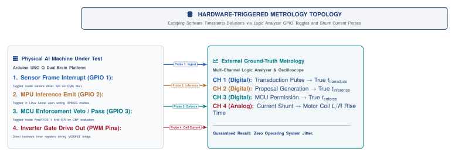

# Time, Freshness, and Latency

{#fig-locator-ch02 width=100%}

::: {.callout-objective}
By the conclusion of this chapter, you will be able to:

1. **Deconstruct the 7-Stage Sense-to-Actuation Chain:** Trace total delay ($t_{\text{total}}$) through photon transduction, DMA ingestion, neural tokenization, policy planning, inter-core IPC, MCU enforcement, and motor coil rise time.
2. **Classify System Bottlenecks:** Differentiate between compute-bound (NPU), bandwidth-bound (DMA/UMA), scheduling-bound (Linux jitter), and physics-bound ($L/R$ coil inductance) constraints.
3. **Analyze the Pipelining Paradox:** Contrast pipeline throughput (FPS) with information freshness ($\Delta t$), explaining why deep FIFO buffering causes physical instability and how action chunking amortizes compute delay.
4. **Model Information Freshness Decay ($\Delta t$):** Quantify how sensory staleness expands spatial state uncertainty ($\sigma_{\text{pos}}(t)$) and calculate the critical Freshness Wall ($\Delta t_{\text{wall}}$).
5. **Evaluate Tail Latency Distributions ($P_{99}, P_{99.9}$):** Measure why average throughput masks safety-critical operating system stalls occurring thousands of times per hour on bench hardware.
6. **Derive Dynamic Stopping Distance ($d_{\text{stop}}$):** Formulate the physical stopping envelope separating linear reaction distance from quadratic braking distance under worst-case latency tails.
7. **Execute Hardware-Triggered Metrology:** Implement microsecond-accurate GPIO logic analyzer triggers and shunt current probes to eliminate the software timestamp illusion.
8. **Freeze the Requirements Ledger (`REQ-01`):** Author the second quantitative specification of the Cumulative Design Dossier establishing timing budgets, stopping envelopes, and environmental limits.
:::

::: {.callout-autopsy}
* **System:** Autonomous Mobile Warehouse Cart ($2.0\text{ m/s}$ nominal speed).
* **Incident:** Rover struck a descending steel roll-up door at full velocity; front chassis crushed and cargo thrown ($3,200\text{ USD}$ hardware replacement).
* **Telemetry Snapshot:** Mean vision pipeline inference latency was $28\text{ ms}$ ($35\text{ FPS}$). At $T+45.120\text{ s}$, a background Linux logging daemon triggered a major memory page fault and LPDDR5 bus stall; inference latency spiked to $240\text{ ms}$ ($P_{99.9}$ tail event).
* **Root Cause:** During the $240\text{ ms}$ compute freeze, the cart traveled $0.48\text{ meters}$ without updating obstacle distance; dynamic stopping distance exceeded the remaining physical clearance.
* **Architectural Flaw:** The safety envelope was certified against mean benchmark latency rather than measured $P_{99.9}$ tail distributions.
:::

::: {.callout-contract}
| Component | Authority and Substrate | Contract Specification |
| :--- | :--- | :--- |
| **What the MPU Proposes (System 2)** | *Untrusted · Stochastic · Linux MPU* | • Timestamped trajectory proposal: $p_t(t_{\text{transduce}})$<br>• Model inference time budget: $t_{\text{inference}} \le 40\text{ ms}$<br>• Age of sensory evidence: $\Delta t_{\text{evidence}}$ |
| **What the MCU Permits (System 1)** | *Trusted · Deterministic · Real-Time MCU* | • Audits arrival age: $\Delta t_{\text{total}} = t_{\text{now}} - t_{\text{transduce}}$<br>• VETO if $\Delta t_{\text{total}}$ exceeds freshness wall ($\tau_{\text{wall}}$)<br>• Continuously computes: $d_{\text{stop}}(v, t_{\text{delay}})$ |
| **Failure Escalation** | *MCU Hardware Reflex* | If $P_{99}$ deadline is breached, discard stale proposal and execute active Category 1 controlled dynamic deceleration. |
:::

::: {.callout-note icon=false}
**The Sim-to-Real Delta:**
* **What Simulation Assumes:** Sensors deliver frames at perfect, unvarying $33.333\text{ ms}$ intervals; operating system thread scheduling has zero jitter; memory access is instantaneous; motor torque appears without electrical lag.
* **What the Bench Measures:** DMA memory transfers compete with neural accelerator weight streaming for shared DRAM bus bandwidth; Linux kernel background daemons trigger 100+ ms latency tail spikes; motor stator inductance ($L/R$) delays torque generation by 5–15 ms.
:::

---

## The World Sets the Clock: Physical Deadlines ($\tau_{\text{world}}$)

In classical digital computing, the clock is synthetic. A quartz oscillator pulses at a fixed frequency (e.g., $2.4\text{ GHz}$), and the processor steps through instructions at its own leisure. If a complex database query or web server request takes longer than expected, the clock simply keeps ticking until the output is ready. The client waits, the connection remains open, and no physical laws are violated.

In physical systems, **the physical environment sets the clock**. 

A warehouse rover traveling at $2.0\text{ m/s}$ toward an obstacle, a robotic arm descending toward a rigid tabletop at $0.8\text{ m/s}$, or a quadrotor caught in a wind gust does not pause while a vision transformer finishes computing its attention matrices. Every physical task defines a characteristic timescale—the **world deadline** ($\tau_{\text{world}}$)—within which a sensory observation must be transduced, processed, and converted into physical counter-force before the physical state diverges irreversibly into hardware destruction.

{#fig-latency-waterfall width=100%}

### The 7-Stage Latency Ledger: Where Does the Time Go?

To eliminate the illusion that latency is a single monolithic number, we establish the **7-Stage Latency Ledger**. Every millisecond between a physical event in the environment and the resulting motor torque is accounted for across distinct physical, silicon, and computational regimes:

| Stage | Subsystem & Physical Mechanism | Nominal ($P_{50}$) | Tail ($P_{99}$) | Bottleneck Classification | Chapter That Owns & Optimizes It |
| :--- | :--- | :---: | :---: | :--- | :--- |
| **1. Transduce ($t_{\text{transduce}}$)** | Photodiode charge well integration / IMU cantilever deflection | $8\text{ ms}$ | $15\text{ ms}$ | **Physics-Bound** (Optical exposure & photon flux) | Chapter 4 (*Perception & Spatial Encoders*) |
| **2. DMA Ingest ($t_{\text{dma}}$)** | Hardware DMA transfer across MIPI CSI-2 bus into shared DRAM buffer | $3\text{ ms}$ | $8\text{ ms}$ | **Bandwidth-Bound** (UMA memory bus contention) | Chapter 4 & Chapter 9 (*Workload Placement*) |
| **3. Perception ($t_{\text{perceive}}$)** | Vision Transformer (ViT) / DINOv2 3D spatial tokenization on NPU | $12\text{ ms}$ | $25\text{ ms}$ | **Compute-Bound** (Neural activation & token count) | Chapter 4 (*Token Pruning & Quantization*) |
| **4. Policy VLA ($t_{\text{inference}}$)** | Diffusion ACT / VLA action chunk generation forward pass | $22\text{ ms}$ | $60\text{ ms}$ | **Compute-Bound** (Diffusion steps & KV-cache) | Chapter 6 & Chapter 7 (*Action Chunking*) |
| **5. Inter-IPC ($t_{\text{ipc}}$)** | Serializing proposal chunk across shared SRAM mailbox to Cortex-M4 | $0.8\text{ ms}$ | $2.0\text{ ms}$ | **Scheduling-Bound** (RPMSG queue & mailbox IRQ) | Chapter 3 (*Real-Time Multi-Rate Runtime*) |
| **6. Enforce ($t_{\text{enforce}}$)** | Evaluating Control Barrier Functions and stopping distance $d_{\text{stop}}$ | $0.4\text{ ms}$ | $1.0\text{ ms}$ | **Determinism-Bound** (1 kHz FreeRTOS ISR budget) | Chapter 8 (*Real-Time Safety Enforcers*) |
| **7. Actuator ($t_{\text{actuator}}$)** | Motor stator coil $L/R$ electrical rise time to magnetic torque | $6\text{ ms}$ | $15\text{ ms}$ | **Physics-Bound** (Winding inductance & back-EMF) | Chapter 8 & Chapter 11 (*Hardware Assurance*) |
| **TOTALS** | **Cumulative End-to-End Latency Chain** | **$52.2\text{ ms}$** | **$126.0\text{ ms}$** | **System Budget: $\le 80\text{ ms}$** | **Whole-System Synthesis** |

### The Closed-Loop Stability Criterion

In classical control theory, feedback delay introduces a phase lag that degrades system gain and phase margins. For a learned physical AI agent, closed-loop stability requires that the cumulative $P_{99}$ latency, padded by an engineering safety margin, remains strictly less than the physical world deadline:

$$t_{\text{total}}(P_{99}) + t_{\text{margin}} < \tau_{\text{world}}$$

Where total end-to-end latency is the non-ideal sum of all seven stages:

$$t_{\text{total}} = t_{\text{transduce}} + t_{\text{dma}} + t_{\text{perceive}} + t_{\text{inference}} + t_{\text{ipc}} + t_{\text{enforce}} + t_{\text{actuator}}$$

If $t_{\text{total}}(P_{99}) \ge \tau_{\text{world}}$, the machine operates open-loop during latency spikes. The physical state drifts beyond the validity envelope of the policy, producing limit-cycle oscillations, violent mechanical shudder, or catastrophic collisions with the environment.

---

## The Bottleneck Taxonomy and The Pipelining Paradox

When an engineer seeks to optimize an autonomous agent, the first instinct is often to replace the neural model with a smaller architecture or buy a faster GPU. In physical systems, however, computational bottlenecks shift across four fundamentally different physical and architectural regimes:

### 1. The Four Systems Bottlenecks

1. **Compute-Bound Bottlenecks (Stages 3 & 4):** Dominated by arithmetic execution time on the neural processing unit (NPU) or GPU. For Vision Transformers (ViT) and Diffusion Policies, runtime scales with token count ($N^2$ attention) and denoising iteration steps. Squeezing this bottleneck requires model quantization (INT8/FP8), token pruning, and sparse attention (addressed in Chapter 4 and Chapter 7).
2. **Bandwidth & Memory Contention Bottlenecks (Stages 2 & 5):** In modern heterogeneous System-on-Chips (SoCs), CPU cores, NPUs, and camera DMA engines share a single Unified Memory Architecture (UMA) bus. When a $1080\text{p}$ camera streams uncompressed image frames at $60\text{ FPS}$ into LPDDR5 DRAM, continuous DMA transactions saturate memory bus channels, stalling neural weight prefetching and adding $15\text{--}30\text{ ms}$ of non-deterministic jitter (addressed in Chapter 9).
3. **Operating System Scheduling Jitter (Stages 4 & 5):** Standard Linux kernels are optimized for throughput, not determinism. Kernel thread preemption, background logging daemons, memory paging, and garbage collection introduce latency tail spikes exceeding $200\text{ ms}$. Eliminating this requires isolating the untrusted proposal engine from the deterministic 1 kHz microcontroller via zero-copy SRAM mailboxes (addressed in Chapter 3).
4. **Physics & Electromagnetic Bottlenecks (Stages 1 & 7):** Governed by unyielding physical laws. Photons require a finite integration time ($t_{\text{exposure}} \approx 8\text{--}15\text{ ms}$) to accumulate measurable charge in photodiode wells under ambient lighting. Similarly, motor stator copper coils possess electrical inductance $L$ and resistance $R$. The phase current $I(t)$ rises according to the first-order differential equation:
   $$I(t) = I_{\text{target}} \left( 1 - e^{-t / \tau_e} \right), \quad \tau_e = \frac{L}{R}$$
   Even if software computation took $0.00\text{ ms}$, magnetic flux and mechanical torque require $5\text{--}15\text{ ms}$ ($\sim 3\tau_e$) to reach commanded current setpoints. Software cannot optimize the speed of light or the inductance of copper coils.

### 2. The Pipelining Paradox: Throughput vs. Freshness

In computer architecture, pipelining is the standard technique to increase throughput: by overlapping the execution of consecutive stages across multiple clock cycles, an instruction finishes every cycle even if individual instructions take multiple cycles to complete.

In machine learning inference servers, engineers apply the same pattern:
$$\text{Cycle } k: \quad [\text{Expose Frame 3}] \longrightarrow [\text{DMA Frame 2}] \longrightarrow [\text{Infer Frame 1}] \longrightarrow [\text{Actuate Frame 0}]$$


This yields high frame rates (e.g., $60\text{ FPS}$). **In Physical AI, however, traditional FIFO pipelining creates a lethal trap: The Pipelining Paradox.**

While pipelining increases the *frequency* of emitted commands, it does not reduce the *age* of the sensory evidence upon which those commands are based. If an agent pipelines three frames through a deep queue, the action executed at time $t$ was computed from an observation captured $3 \times \Delta t$ in the past ($90\text{ ms}$ ago). If an obstacle suddenly steps into the robot's trajectory, the robot continues executing stale plans for three full pipeline stages before the new obstacle even reaches the policy output.

::: {.callout-important title="The Physical Pipelining Rule"}
**Never use deep FIFO queues in a physical sensory-motor loop.**

Physical AI systems employ **Low-Latency Latest-Frame Sampling**:
1. When the neural policy completes a forward pass, it grabs only the *most recently arrived* sensor frame and immediately drops all intermediate buffered frames.
2. To bridge the temporal gap between slow neural inference ($20\text{ Hz}$) and fast motor control ($1000\text{ Hz}$), the system employs **Action Chunking with Transformers (ACT)** (introduced in Chapter 7). The policy predicts a trajectory horizon of $H$ future waypoints in parallel, allowing the real-time core to execute smooth, continuous motions while the next chunk is computed in the background.
:::

---

## Information Freshness Decay ($\Delta t$) and the Freshness Wall

Sensor data decays the instant photons hit the camera sensor. An image frame does not describe the *current* state of the physical world; it describes where the world was at the timestamp of optical transduction $t_{\text{transduce}}$.

We define **Information Age** ($\Delta t$) at the instant of physical actuation as:

$$\Delta t = t_{\text{actuation}} - t_{\text{transduce}}$$

### Tier 2 Formalism: Spatial Uncertainty Expansion

Consider an obstacle, human worker, or target workpiece moving through the agent's workspace with velocity vector $\mathbf{v}_{\text{target}}$. The spatial uncertainty envelope ($\sigma_{\text{pos}}$) of the agent's belief expands linearly with information age:

$$\sigma_{\text{pos}}(t) = \sigma_0 + \|\mathbf{v}_{\text{target}}\| \cdot \Delta t$$

Where:
* $\sigma_0$ is the intrinsic sensor calibration and measurement noise (in meters).
* $\|\mathbf{v}_{\text{target}}\|$ is the characteristic velocity of dynamic entities in the workspace (in $\text{m/s}$).
* $\Delta t$ is the total elapsed information age from transduction to motor torque (in seconds).

As information age $\Delta t$ elapses, the spatial uncertainty boundary expands until it crosses the critical clearance threshold $d_{\text{clearance}}$, transforming safe trajectories into collision hazards.


### The Freshness Wall Equation

Every physical manipulation or navigation task defines a geometric clearance boundary $d_{\text{clearance}}$ (e.g., the distance to an obstacle or the tolerance of a precision peg-in-hole insertion). Setting $\sigma_{\text{pos}}(t) = d_{\text{clearance}}$ yields the **Freshness Wall** ($\Delta t_{\text{wall}}$):

$$\Delta t_{\text{wall}} = \frac{d_{\text{clearance}} - \sigma_0}{\|\mathbf{v}_{\text{target}}\|}$$

Beyond $\Delta t_{\text{wall}}$, the agent's spatial belief has drifted so far from physical reality that any planned trajectory proposal is invalid.

| Operating Regime | Information Age $\Delta t$ | Physical State & Machine Action |
| :--- | :--- | :--- |
| **Fresh Observation** | $\Delta t \ll \Delta t_{\text{wall}}$ | Spatial uncertainty is tightly bounded ($\sigma_{\text{pos}} < d_{\text{clearance}}$). Model proposals are physically valid and permitted. |
| **Degraded Freshness** | $\Delta t \to \Delta t_{\text{wall}}$ | Uncertainty approaches obstacle boundary. MCU safety enforcer derates commanded velocity. |
| **Beyond the Freshness Wall** | $\Delta t \ge \Delta t_{\text{wall}}$ | **State Drift Collapse:** Sensory evidence is stale. Proposals are invalidated and vetoed by the real-time reflex. |

### Tier 3 Systems Consequence: The Capacity vs. Freshness Dilemma

A common failure mode in embodied AI research is choosing a massive foundation model (e.g., a 7-billion-parameter Vision-Language-Action model) executing at $2\text{ Hz}$ ($500\text{ ms}$ latency) over a compact, distilled policy executing at $50\text{ Hz}$ ($20\text{ ms}$ latency).

Although the 7B model possesses superior semantic reasoning on static web images, its physical actions are computed from $500\text{ ms}$ stale sensory evidence. In a dynamic warehouse where workers and carts move at $1.5\text{ m/s}$, an information age of $500\text{ ms}$ expands spatial uncertainty by $0.75\text{ meters}$—breaching safe margins. **A lightweight model operating on fresh data consistently outperforms a massive foundation model operating on stale history.**

---

## The Tail Latency Lie: Why $P_{99}$ Governs Physical Survival

In standard machine learning literature, researchers evaluate model execution speed using mean throughput: *"Our model achieves 30 FPS (33.3 ms average latency)."*

In physical systems engineering, **mean latency is a dangerous metric**. Average latency describes the benign nominal path; physical destruction occurs in the tails of the probability distribution.

| Latency Percentile | Execution Mode | Systems Impact |
| :--- | :--- | :--- |
| **$P_{50}$ ($33\text{ ms}$)** | Nominal cache-hot execution | Expected baseline tracking performance |
| **$P_{99}$ ($185\text{ ms}$)** | Cache eviction & memory bus contention | Triples dynamic stopping distance ($d_{\text{stop}}$) |
| **$P_{99.9}$ ($320\text{ ms}$)** | GC stall or kernel scheduler preemption | Breaches Freshness Wall; triggers MCU safety override |


### The Heavy-Tailed Reality of Embedded Silicon

On embedded Linux SoCs, latency distributions are not Gaussian; they are heavy-tailed (log-normal with discrete multi-modal spikes). These spikes are triggered by deterministic hardware events:
1. **L1/L2 Cache Eviction:** A high-priority kernel interrupt evicts the neural network's weight matrices from cache.
2. **Translation Lookaside Buffer (TLB) Shootdowns:** Multi-core memory remapping forces CPU cores into synchronization wait states.
3. **DRAM Memory Refresh & Bus Contention:** Camera DMA bursts lock the memory controller, stalling NPU read transactions for $10\text{--}40\text{ ms}$.

### The Real-Time Arithmetic of Failure

Consider the relentless mathematics of continuous physical operation:

* An autonomous robot running a control loop at $50\text{ Hz}$ executes **180,000 cycles every single hour** ($50 \times 3,600$).
* If the system is certified to the 99th percentile ($P_{99}$), the remaining $1\%$ tail represents **1,800 latency violations every hour**—that is, one timing failure every two seconds!
* Even a $99.9\text{th}$ percentile ($P_{99.9}$) certification leaves **180 catastrophic tail events per hour** (three per minute).

If a mobile robot moves at $2.0\text{ m/s}$, a single $P_{99.9}$ spike of $250\text{ ms}$ causes the machine to travel **$0.50\text{ meters}$ completely open-loop** before evaluating its next sensory observation. In physical systems, systems are certified by bounding the maximum tail latency ($P_{99.99}$), never by celebrating the mean.

---

## Dynamic Stopping Distance Physics ($d_{\text{stop}}$)

The ultimate physical metric connecting computation time to physical safety is the **Dynamic Stopping Distance** ($d_{\text{stop}}$): the total distance required to bring a moving mechanism to a complete, safe halt after an obstacle is detected in the environment.

![**Dynamic Stopping Distance Physics ($d_{\text{stop}}$).** Translating milliseconds of computational delay into physical centimeters of collision hazard. The total stopping distance is the sum of the linear reaction phase ($v \cdot t_{\text{delay}}$) and the quadratic braking phase ($\frac{v^2}{2a_{\text{max}}}$). While the nominal case ($t_{\text{delay}} = 30\text{ ms}$) stops safely within the $0.35\text{ m}$ clearance barrier, a $P_{99}$ latency tail spike ($t_{\text{delay}} = 230\text{ ms}$) expands the blind reaction travel by $+20\text{ cm}$, causing a severe collision.](figures/fig02_stopping_distance.svg){#fig-stopping-distance width=100%}

### Tier 2 Formalism: The Two-Phase Stopping Equation

The stopping envelope is governed by Newtonian kinematics split into two distinct physical phases:

$$d_{\text{stop}}(t) = \underbrace{v(t) \cdot t_{\text{delay}}(t)}_{\text{\textbf{Phase 1: Reaction Distance (Linear)}}} \;+\; \underbrace{\frac{v(t)^2}{2 \cdot a_{\text{max}}}}_{\text{\textbf{Phase 2: Braking Distance (Quadratic)}}}$$

Where:
* $v(t)$ is the current velocity of the mechanism at the instant the obstacle appears (in $\text{m/s}$).
* $a_{\text{max}}$ is the maximum safe deceleration permitted by motor torque limits and ground tire friction ($\mu g$) without tipping or skidding (in $\text{m/s}^2$).
* $t_{\text{delay}}(t)$ is the cumulative sensory-motor latency across all seven stages of the Latency Ledger:
  $$t_{\text{delay}}(t) = t_{\text{transduce}} + t_{\text{dma}} + t_{\text{perceive}} + t_{\text{inference}} + t_{\text{ipc}} + t_{\text{enforce}} + t_{\text{actuator}}$$

### Physical Anatomy of the Two Phases

1. **Phase 1: The Reaction Distance ($v \cdot t_{\text{delay}}$):** During this interval, the machine is functionally **blind and deaf**. Photons are integrating in photodiodes, tensors are multiplying in the NPU, and shared memory packets are serializing. The machine continues moving forward at full, unreduced velocity $v(t)$. This distance scales **linearly with latency** and **linearly with velocity**.
2. **Phase 2: The Braking Distance ($\frac{v^2}{2 a_{\text{max}}}$):** The interval beginning the exact microsecond motor inverters energize reverse braking current. Deceleration is constrained by mechanical traction and motor back-EMF. This distance scales **quadratically with velocity**.

### Step-by-Step Numerical Walkthrough

Consider a warehouse cart traveling at $v = 1.0\text{ m/s}$ with maximum safe braking deceleration $a_{\text{max}} = 2.0\text{ m/s}^2$ approaching a workspace clearance limit of $d_{\text{clearance}} = 0.35\text{ m}$:

* **Nominal Execution ($P_{50}: t_{\text{delay}} = 30\text{ ms}$):**
  $$d_{\text{react}} = 1.0\text{ m/s} \times 0.030\text{ s} = 0.030\text{ m} \; (3\text{ cm})$$
  $$d_{\text{brake}} = \frac{(1.0\text{ m/s})^2}{2 \times 2.0\text{ m/s}^2} = 0.250\text{ m} \; (25\text{ cm})$$
  $$d_{\text{stop}} = 0.030\text{ m} + 0.250\text{ m} = \mathbf{0.280\text{ m}} \; (28\text{ cm}) \quad \implies \quad \mathbf{\text{SAFE (Margin } = 7\text{ cm})}$$

* **$P_{99}$ Tail Latency Spike ($t_{\text{delay}} = 230\text{ ms}$):**
  $$d_{\text{react}} = 1.0\text{ m/s} \times 0.230\text{ s} = 0.230\text{ m} \; (23\text{ cm})$$
  $$d_{\text{brake}} = \frac{(1.0\text{ m/s})^2}{2 \times 2.0\text{ m/s}^2} = 0.250\text{ m} \; (25\text{ cm})$$
  $$d_{\text{stop}} = 0.230\text{ m} + 0.250\text{ m} = \mathbf{0.480\text{ m}} \; (48\text{ cm}) \quad \implies \quad \mathbf{\text{CRASH (Overrun } = +13\text{ cm})}$$

A $200\text{ ms}$ operating system memory stall converted an entirely safe maneuver into an unavoidable $13\text{ cm}$ collision with the obstacle. In physical systems, latency is measured in centimeters on the floor.

---

## Hardware-Triggered Metrology: Escaping Software Timestamp Delusions

How do we measure the 7-stage latency chain accurately? In software engineering, developers routinely instrument code with timestamps:
```python
# THE SOFTWARE TIMESTAMP DELUSION (DO NOT DO THIS)
t_start = time.time()
action = model(image)
t_end = time.time()
latency = t_end - t_start
```

In embedded physical systems, **software timestamps are an illusion** caused by the *Heisenbug effect*:

1. **Scheduling Blindness:** `time.time()` or `clock_gettime()` measures when the Linux OS thread was *dispatched*, not when physical photons hit the camera sensor or when gate drivers pulsed motor coils.
2. **Measurement Perturbation:** Calling user-space timing APIs introduces system calls, context switches, and cache invalidations that artificially inflate the very latency being measured.
3. **Clock Domain Drift:** The high-performance application processor (MPU) and real-time microcontroller (MCU) run on separate quartz crystals with temperature-dependent clock drift (up to $\pm 50\text{ ppm}$, accumulating milliseconds of skew per hour).

{#fig-metrology-setup width=100%}

### The Hardware-Triggered Metrology Protocol

To obtain true ground-truth timing metrics, we instrument the physical silicon at the hardware boundary:

1. **Stage 1 (Sensor Arrival):** Configure the camera driver's low-level Interrupt Service Routine (ISR) to toggle a dedicated hardware GPIO pin (`GPIO 1`) high on the first MIPI CSI-2 Start-of-Frame (SOF) packet.
2. **Stage 4 (Proposal Emit):** Toggle a hardware GPIO pin (`GPIO 2`) inside the Linux kernel driver immediately upon committing a serialized action chunk into the shared SRAM ring buffer.
3. **Stage 6 (MCU Enforcement):** Toggle a hardware GPIO pin (`GPIO 3`) inside the FreeRTOS 1 kHz timer ISR when the Control Barrier Function successfully validates the action chunk.
4. **Stage 7 (Motor Current Rise):** Connect an active current probe across a precision low-side shunt resistor ($0.01\,\Omega$) on the motor inverter power stage. The oscilloscope measures the analog rise time ($dI/dt$) of the stator coil current.

Connecting an external multi-channel logic analyzer to these four GPIO pins provides microsecond-accurate, non-intrusive timing measurements with zero OS scheduling interference.

---

## Systems Fallacies and Pitfalls

::: {.callout-warning}
### Common Engineering Fallacies in Physical AI Timing
* **Fallacy 1: High Frame Rate Means Low Latency.**  
  *Correction:* Frame rate (FPS) measures throughput; latency measures elapsed time. A USB camera streaming at $60\text{ FPS}$ with a 4-frame internal driver buffer introduces $66.7\text{ ms}$ of unalterable stale information lag before data even reaches user memory.
* **Fallacy 2: Software Timestamps Measure Information Age.**  
  *Correction:* Software timestamps record when a user thread resumed execution, completely ignoring sensor exposure integration, DMA serialization, and motor coil electrical rise time.
* **Fallacy 3: Average Latency Certifies Safety.**  
  *Correction:* A system with a nominal latency of $30\text{ ms}$ that experiences $P_{99.9}$ spikes of $250\text{ ms}$ will experience 180 control freezes every single hour. In physical systems, the tail dictates survivability.
* **Fallacy 4: Deep FIFO Buffers Prevent Data Loss.**  
  *Correction:* In physical loops, old data is poison. Deep queues ensure the agent acts on obsolete history, causing phase lag and limit-cycle instability. Always sample the latest frame and discard the rest.
:::

---

::: {.callout-decision}
### Dossier Delta: Requirements and Latency Budgets (`REQ-01`)

Every chapter in this book freezes a concrete engineering specification for the **Cumulative Design Dossier**. In Chapter 2, we establish **`REQ-01` (Requirements, Latency Budgets & Environmental Ledger)**, codifying the quantitative timing and physical stopping envelopes for our reference platform:

#### Sense-to-Actuation 7-Stage Latency Budget Ledger (`REQ-01`)

| Stage | Subsystem & Physical Boundary | Nominal $P_{50}$ | Tail Ceiling $P_{99}$ | Budget Ceiling Allocation |
| :--- | :--- | :--- | :--- | :--- |
| **Stage 1** | Optical Transduction (CMOS Exposure) | $8.0\text{ ms}$ | $15.0\text{ ms}$ | Illumination $\ge 150\text{ lux}$ |
| **Stage 2** | MIPI CSI-2 DMA Ingestion to DRAM | $3.0\text{ ms}$ | $8.0\text{ ms}$ | Zero-copy ring buffer |
| **Stage 3** | Vision Backbone Feature Tokenization | $12.0\text{ ms}$ | $25.0\text{ ms}$ | INT8 ViT / DINOv2 on NPU |
| **Stage 4** | Action Chunk Policy Inference (ACT) | $22.0\text{ ms}$ | $60.0\text{ ms}$ | $H=16$ chunk prediction |
| **Stage 5** | Inter-Processor Mailbox IPC (RPMSG) | $0.8\text{ ms}$ | $2.0\text{ ms}$ | Shared static SRAM mailbox |
| **Stage 6** | Real-Time Safety Veto & CBF Projection | $0.4\text{ ms}$ | $1.0\text{ ms}$ | Bare-metal MCU QP solver |
| **Stage 7** | Motor Phase Inductance Rise Time ($L/R$) | $6.0\text{ ms}$ | $15.0\text{ ms}$ | Electrical torque generation |
| **Total** | **End-to-End Sense-to-Actuation Path** | **$52.2\text{ ms}$** | **$80.0\text{ ms}$** | **$\le \Delta t_{\text{wall}}$ (Freshness Wall)** |

#### Stopping Kinematics and Environmental Assumptions (`REQ-01`)

| Parameter | Specification | Units | Physical Justification / Derivation |
| :--- | :--- | :--- | :--- |
| **Max Operational Velocity ($v_{\text{max}}$)** | $0.75$ | $\text{m/s}$ | End-effector speed limit in collaborative workspace |
| **Controlled Deceleration ($a_{\text{max}}$)** | $4.50$ | $\text{m/s}^2$ | Max braking deceleration without tooth shear |
| **Reaction Delay Distance ($d_{\text{react}}$)** | $0.060$ | $\text{m}$ | $v_{\text{max}} \cdot \Delta t(P_{99} = 80.0\text{ ms})$ |
| **Dynamic Braking Distance ($d_{\text{brake}}$)** | $0.0625$ | $\text{m}$ | $v_{\text{max}}^2 / (2 \cdot a_{\text{max}})$ |
| **Total Stopping Distance ($d_{\text{stop}}$)** | **$0.1225$** | **$\text{m}$** | $d_{\text{react}} + d_{\text{brake}}$ ($12.25\text{ cm}$) |
| **Safety Clearance Buffer ($d_{\text{clear}}$)** | $0.150$ | $\text{m}$ | Barrier envelope required before safety override |

*(The complete, machine-readable YAML template for `REQ-01` is maintained in @sec-dossier-templates).*
:::


---

## Hands-On Bench Laboratory: `labs/02-metrology-wall`

::: {.callout-lab title="Lab 2: Mapping the Freshness Wall and Benchmarking P99 Tails"}
* **Objective:** Instrument the Arduino UNO Q dual-brain hardware kit with hardware GPIO triggers to construct the empirical Cumulative Distribution Function (CDF) of sense-to-actuation latency and map the Freshness Wall where task success collapses.
* **Phase 1 (GPIO Instrumentation):** Connect a logic analyzer to `GPIO 1` (camera SOF interrupt), `GPIO 2` (MPU RPMSG write), and `GPIO 3` (MCU PWM timer register update). Execute 10,000 inference cycles under simulated memory bus stress (`stress-ng --vm 2 --vm-bytes 512M` and background video streaming).
* **Phase 2 (Tail Latency Analysis):** Plot the latency CDF in Python. Calculate $P_{50}, P_{90}, P_{99}$, and $P_{99.9}$. Verify that $P_{99} \le 80\text{ ms}$.
* **Phase 3 (Mapping the Freshness Wall):** Artificially inject transport delay $\Delta t_{\text{delay}} \in [0\text{ ms}, 250\text{ ms}]$ into the camera stream. Record robot trajectory tracking error and obstacle clearance. Identify the empirical critical threshold $\Delta t_{\text{wall}}$ where task success drops to zero.
* **Dossier Milestone:** Validate all parameters against `REQ-01` and freeze the ledger in your team's design repository.
:::

---

## Summary and What Comes Next

In this chapter, we established the fundamental temporal laws of Physical AI:

1. **The Physical World Sets the Clock:** Autonomous systems are bound to the world deadline ($\tau_{\text{world}}$). Closed-loop stability requires $t_{\text{total}}(P_{99}) + t_{\text{margin}} < \tau_{\text{world}}$.
2. **The 7-Stage Latency Ledger:** Decomposed end-to-end latency into Transduction, DMA Ingestion, Perception, Policy Inference, Inter-Core IPC, Safety Enforcement, and Actuator Rise Time.
3. **The Bottleneck Taxonomy:** Classified delays into Compute-Bound (NPU), Bandwidth-Bound (DMA/UMA), Scheduling-Bound (Linux jitter), and Physics-Bound ($L/R$ coil inductance).
4. **The Pipelining Paradox:** Showed why deep FIFO queues destroy information freshness, and why Physical AI uses latest-frame sampling with Action Chunking.
5. **The Freshness Wall ($\Delta t_{\text{wall}}$):** Proved that spatial uncertainty grows linearly with information age ($\sigma_{\text{pos}}(t) = \sigma_0 + v_{\text{target}} \Delta t$).
6. **The Tail Latency Lie:** Demonstrated that $P_{99}$ and $P_{99.9}$ tails dictate survival across 180,000 cycles per hour.
7. **Dynamic Stopping Physics ($d_{\text{stop}}$):** Derived how computational latency translates into linear reaction distance and physical collision hazard.
8. **Hardware-Triggered Metrology:** Eliminated the software timestamp illusion using logic analyzer GPIO triggers and shunt current probes.

In **Chapter 3 (*Real-Time Multi-Rate Runtime*)**, we move inside the silicon to build the execution engine that guarantees these timing deadlines: multi-rate scheduling, zero-copy shared SRAM ring buffers, and hard hardware bus firewalls isolating untrusted Linux from deterministic microcontrollers.
