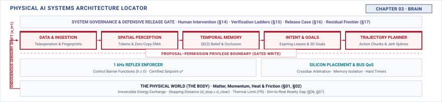

# The Brain\chaptersubtitle{What a Learned Component Gives You, and What It Costs} {#sec-brain}

{#fig-locator-ch03 fig-pos="H" width=100%}

*What do you actually get when you put a learned model inside a machine?*

<!-- HOOK: one substantive paragraph answering the question above. -->



::: {.callout-objective}
After studying this chapter, you will be able to:

1. Specify a learned model as a component: what it consumes, emits, costs, and how it degrades.
2. Measure an inference latency distribution on a target device and express it as a draw against the limits from Chapter 2.
3. Name the failure modes of a learned component and state which have practical detectors and which do not.
4. Explain why the five handoffs form a chain and what breaks when one is collapsed into another.

:::

## Introduction {#sec-brain-3-1}

<!-- SECTION 3.1 -->
<!-- claim: A learned component is capable precisely because nobody wrote down what it does, which is also why it cannot hold authority. -->
<!-- covers: Distinguish behavior fitted from examples from behavior enumerated in source code; inspecting the implementation cannot enumerate the conditions under which an output will be correct. -->
<!-- covers: Trace one inference from timestamped input to proposed physical consequence, identifying what the model contributes and what remains outside it. -->
<!-- covers: Separate properties observable before actuation, such as output range, age, and deadline compliance, from semantic correctness, which usually is not observable then. -->
<!-- covers: Establish that a learned output can be treated as a proposal but cannot supply its own permission to command energy. -->
<!-- covers: Frame the chapter around the contract, cost, and failure evidence needed before the rest of the machine can use that proposal. -->
<!-- GROUNDING: mechanism — a model restated as a component: what it consumes, emits, and costs -->
<!-- DERIVE: Derive the authority conclusion from the absence of an observable pre-actuation test for semantic correctness; do not rest it on “nobody wrote down what it does.” -->

<!-- BEGIN -->

<!-- END -->

## A Model as a Machine Part {#sec-brain-3-2}

<!-- SECTION 3.2 -->
<!-- claim: Inside a machine, a model stops being something you evaluate and becomes something you specify. -->
<!-- covers: Specify the input contract by shape, units, acquisition time, provenance, normalization, context length, and behavior when required fields are missing. -->
<!-- covers: Specify the output contract by type, units, range, production time, validity interval, and whether the value is a point estimate, score, sample, or action sequence. -->
<!-- covers: Record the required invocation rate and the conditions under which an old output must be discarded rather than reused. -->
<!-- covers: State the resource envelope as a conditional latency distribution, peak resident memory, transferred bytes per inference, energy per inference, and sustained thermal load. -->
<!-- covers: State the degradation envelope under quantization, missing context, resource contention, thermal throttling, and inputs unlike those used for qualification. -->
<!-- covers: Show how this contract permits replacement of one model by another without silently changing the assumptions made by downstream components. -->
<!-- GROUNDING: mechanism — a component specification: consumes, emits, costs, degrades -->
<!-- DERIVE: Derive peak resident memory from parameters, activations, and runtime state, and derive output age from acquisition, queuing, execution, and handoff times. -->

<!-- BEGIN -->

<!-- END -->

## The Case for a Learned Part {#sec-brain-3-3}

<!-- SECTION 3.3 -->
<!-- claim: You accept a stochastic component because the alternative cannot be written down. -->
<!-- covers: Use one bounded task whose relevant variations can be counted, then show which variations defeat a finite hand-written rule or template set. -->
<!-- covers: Compare the learned and hand-coded alternatives over the same operating envelope, using task coverage, failure count, and runtime cost rather than a general claim of superiority. -->
<!-- covers: Identify exactly what learning buys in the case, such as tolerance to previously unseen appearance, phrasing, or arrangement, without claiming unrestricted generalization. -->
<!-- covers: State the admission test: the measured gain in task coverage must justify the added latency, resource demand, uncertainty, and detection burden. -->
<!-- covers: Keep deterministic reflexes, tracking, and enforcement outside the bargain; the learned component earns proposal capability, not physical authority. -->
<!-- GROUNDING: case — one capability that resists hand-coding, shown rather than asserted -->
<!-- DERIVE: Derive the case for learning from measured coverage and system cost within a stated operating envelope; do not assert that the task “resists hand-coding” without the comparison. -->

<!-- BEGIN -->

<!-- END -->

## Classes of Learned Part {#sec-brain-3-4}

<!-- SECTION 3.4 -->
<!-- claim: Classify a learned part by the physical claim its output supports, how long that claim stays valid, what can be checked before anything moves, and how much authority has to remain downstream of it. Architecture is how it is built, and it is the least durable thing about it. -->
<!-- covers: State the four axes, because they survive the next architecture: the physical claim the output supports, the validity interval of that claim, what is checkable before actuation, and the authority that must remain downstream. -->
<!-- covers: Work one part per axis rather than one section per architecture. A component that answers "what is there" makes a different physical claim from one that answers "move like this," and they fail into different consequences. -->
<!-- covers: Validity interval: some outputs describe a world that has already moved on, and the class is decided by how fast the claim decays rather than by how the model was built. -->
<!-- covers: Checkability before action: range, units, age, and deadline compliance can be checked; semantic correctness usually cannot. Which side of that line a class falls on decides how much can be delegated to it. -->
<!-- covers: Authority proximity: a part whose output reaches an actuator through two checks is a different systems object from one whose output is the command, even if both are the same architecture. -->
<!-- covers: Only then, briefly, name the current instances against those axes, and cite an ML systems text for how any of them is built. What a token costs and why attention scales quadratically belongs in that book, not this one. -->
<!-- covers: Close with the durable test: given a learned component nobody has seen before, a reader should be able to place it on all four axes without knowing its architecture. -->
<!-- GROUNDING: mechanism — four axes a reader can place an unseen component on: physical claim, validity interval, checkability, authority proximity -->
<!-- DERIVE: Derive the validity interval from the physical rate of change of the thing the output claims, not from the model's invocation rate. -->

<!-- BEGIN -->

<!-- END -->

## Outputs as Distributions {#sec-brain-3-5}

<!-- SECTION 3.5 -->
<!-- claim: A model returns a distribution, and the number it reports as confidence usually does not mean what it appears to mean. -->
<!-- covers: Distinguish a point estimate, an unnormalized score, a normalized class score, a sample, and a predictive distribution; deployment code must not call all five “confidence.” -->
<!-- covers: Define the event to which confidence refers, including its time horizon and success criterion, before testing calibration. -->
<!-- covers: Compute empirical success frequency within score bins and retain the sample count in each bin so that a sparse bin is not mistaken for reliable calibration. -->
<!-- covers: Show that calibration is population-level evidence and does not certify the next individual output. -->
<!-- covers: Use a risk-coverage curve to choose an abstention threshold, and require a downstream response that remains safe when the model abstains. -->
<!-- covers: Explain why distribution shift can invalidate an offline calibration result while providing no immediate correctness label at runtime. -->
<!-- GROUNDING: number — reported confidence against measured frequency of being right -->
<!-- FIGURE: A two-panel empirical plot must SHOW a model whose reported scores are miscalibrated and how lowering coverage through abstention changes the observed error rate. -->
<!-- DERIVE: Derive calibration error from reported scores and observed frequencies, including bin counts; do not infer calibrated probability from softmax normalization. -->

<!-- BEGIN -->

<!-- END -->

## The Cost of Inference {#sec-brain-3-6}

<!-- SECTION 3.6 -->
<!-- claim: Every property of a learned part is a withdrawal from one of the five limits. -->
<!-- covers: Define the inference timing boundary from input-ready to output-ready, including device synchronization and asynchronous accelerator completion. -->
<!-- covers: Measure warm, cold, isolated, contended, and thermally throttled runs rather than reporting one benchmark average. -->
<!-- covers: Report the latency distribution with sample count, $P_{50}$, relevant tail percentiles, maximum observed value, and the body limit against which each is judged. -->
<!-- covers: Decompose peak memory into weights, activations, retained context, allocator overhead, and copies introduced at component boundaries. -->
<!-- covers: Convert bytes transferred per inference and invocation rate into sustained bandwidth, then identify the sensors, trackers, and enforcer competing for that bandwidth. -->
<!-- covers: Integrate measured power over an inference to obtain energy, then show how invocation rate creates sustained heat and how throttling feeds back into latency. -->
<!-- covers: Map every measurement to a remaining Chapter 2 margin and label analytical extrapolations separately from target-device measurements. -->
<!-- GROUNDING: number — latency, footprint, bandwidth, and heat, each as a draw on Ch2 -->
<!-- FIGURE: A target-device latency CDF under isolated, contended, and thermally throttled runs must SHOW how the same model consumes different fractions of the body’s freshness limit. -->
<!-- DERIVE: Derive bandwidth from bytes per invocation and rate, energy from the power trace, and sustained thermal draw from energy and duty cycle rather than using vendor throughput as a proxy. -->

<!-- BEGIN -->

<!-- END -->

## How Learned Parts Fail {#sec-brain-3-7}

<!-- SECTION 3.7 -->
<!-- claim: The failure modes of a learned component are few, well understood, and mostly undetectable at runtime. -->
<!-- covers: Replace the claim that failures are “few” with a bounded taxonomy covering incorrect outputs, misleading uncertainty, deployment shift, and missed runtime contracts. -->
<!-- covers: Treat an out-of-distribution score as an imperfect statistical signal whose false-accept rate must be measured on named near- and far-shift cases. -->
<!-- covers: Show that a calibration or abstention monitor can flag some risky outputs but cannot determine semantic correctness without a timely reference label. -->
<!-- covers: Detect deployment drift over a population and time window, while stating that such a detector usually cannot adjudicate the current action. -->
<!-- covers: Detect deadline, range, freshness, and missing-output failures deterministically from timestamps and interface checks, then expire or refuse the proposal. -->
<!-- covers: Record the input provenance, model version, output, monitor result, timing, and disposition needed to reconstruct every detected or later-discovered failure. -->
<!-- GROUNDING: failure — four failure modes, each with its detector or the absence of one -->
<!-- DERIVE: Derive runtime detectability by identifying what observable evidence exists before actuation for each failure class; remove “mostly undetectable” unless the resulting taxonomy supports it. -->

<!-- BEGIN -->

<!-- END -->

## The Five Handoffs {#sec-brain-3-8}

<!-- SECTION 3.8 -->
<!-- claim: Observe, estimate, intend, plan, enforce. Five things get handed along, each boundary exists because the sender cannot supply what the receiver needs, and only the last may command energy. -->
<!-- covers: Observe hands over timestamped evidence with provenance and validity metadata, not an interpretation of what the world contains. -->
<!-- covers: Estimate hands over a state or belief with uncertainty and age, because observations do not state system state directly. -->
<!-- covers: Intend hands over a goal with issuer, scope, priority, and expiration, because a state does not choose a goal and a once-valid objective must not become permanent. -->
<!-- covers: Plan hands over a time-indexed candidate with feasibility assumptions and a validity horizon, because a goal does not supply a feasible trajectory. -->
<!-- covers: Enforce hands over either an allowed bounded command or an explicit refusal with a reason, because a trajectory does not grant permission; only this output may enter the command path. -->
<!-- covers: Derive each boundary from the rejection test it makes possible: an invalid timestamp refused at Observe, an over-age estimate refused before Intend, an expired intent refused before Planning, an infeasible plan refused without relitigating the goal, and a feasible proposal clipped or refused at the current physical limit. -->
<!-- covers: Carry age, uncertainty, and validity metadata forward rather than stripping them when the primary value crosses an interface. -->
<!-- covers: Treat the five names as system functions rather than as five models or processes, and distinguish logical separation from deployment placement: an end-to-end policy may span several functions, and what it costs is the inspection point, the expiry, and the refusal that the collapsed contract used to provide. -->
<!-- covers: Compress the chain into what is at stake at each step, because this is the shape Part III follows: a prediction is not a decision, a decision is not a command, and a command is not yet an action. Perception and memory produce predictions, intent produces a decision, planning produces a candidate command, and only enforcement turns one into an action. -->
<!-- GROUNDING: mechanism — five handoffs, each named by what it produces and by the rejection test its boundary makes possible -->
<!-- FIGURE: The canonical chain must SHOW each named handoff and its artifact, with dashed proposal paths becoming a solid allowed-command path only after Enforce and with refusals terminating visibly. A second register draws the same machine as one end-to-end policy, with the lost inspection points marked. -->
<!-- DERIVE: Derive the chain from the distinct information transformation and rejection test at each boundary; collapsing stages does not automatically remove refusal unless the lost test is identified. -->

<!-- BEGIN -->

<!-- END -->

## Systems Stress-Tests {#sec-brain-3-9}

<!-- SECTION 3.9 -->
<!-- claim: A part can be accurate, fast, and still unusable. -->
<!-- covers: In an analytical transport case, compare a $40\text{ ms}$ mean with a $180\text{ ms}$ tail at $1.5\text{ m/s}$ and compute the additional $0.21\text{ m}$ traveled before a proposal arrives. -->
<!-- covers: Given one hundred outputs reported near $0.90$ confidence with sixty-four observed successes, compute the $0.26$ calibration gap and decide whether any useful abstention threshold remains. -->
<!-- covers: Compare two models with equal task success but different peak memory and tail latency, then select the one that preserves the larger Chapter 2 margins. -->
<!-- covers: Reevaluate a model that meets its deadline in isolation after camera traffic and retained context contend for the same memory bandwidth. -->
<!-- covers: Decide the disposition of a semantically plausible plan whose intent lease has expired before enforcement receives it. -->

<!-- BEGIN -->

<!-- END -->

## Summary {#sec-brain-3-10}

<!-- SECTION 3.10 -->
<!-- claim: Part II pins down what each handoff must be right about. -->
<!-- covers: Restate the learned component as an interface contract plus a measured resource and degradation envelope. -->
<!-- covers: State that learning is admitted only when its measured capability gain justifies the uncertainty and system cost it introduces. -->
<!-- covers: Preserve the distinction among scores, probabilities, samples, and calibrated uncertainty. -->
<!-- covers: Carry forward the separation between deterministically detectable contract violations and semantic failures that lack timely runtime labels. -->
<!-- covers: Restate the five handoffs through the artifact each produces and the check made possible at its boundary. -->
<!-- covers: Hand Chapter 4 the unresolved questions of invocation rate, tracking rate, enforcement rate, and which path may command physical energy. -->

<!-- BEGIN -->

<!-- END -->
