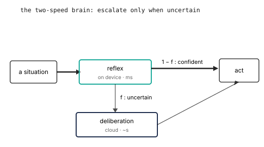

# Cognition and Agency: The Brain and the Agent Loop

::: {.callout-question}

How does the system decide what to do, and when to think hard?

:::

Meaning is expensive, as the last chapter showed. So the worst design is the one
that pays full price on every turn, asking a heavy model what to do when the
answer is almost always the same simple thing. A robot that thinks hard about
whether to keep tracking a face will miss the face.

The fix is a brain with two speeds. A fast reflex handles the common case on the
device, and a slow deliberation step, a heavier model and often the cloud, is
called only when the reflex is out of its depth.

## Two speeds, one decision

The reflex and the deliberation step are the two timescales placement has been
trading all along, now running in one system. @fig-two-speed-brain shows the
shape. A situation arrives, the reflex handles it, and most of the time it is
confident and acts at once. When it is not, it escalates: it hands the situation
up to the slower, more capable step, waits for an answer, and then acts. The
reflex is cheap and fast and limited. Deliberation is expensive and slow and
capable. The escalation gate between them is where the system decides when it is
worth thinking hard.

::: {#fig-two-speed-brain fig-cap="**The two-speed brain**: a reflex on the device handles the confident majority and acts at once; only the uncertain fraction escalates to a slower, more capable deliberation step before acting." fig-alt="A situation enters a reflex on the device. A thick arrow labeled one minus f goes straight to act when the reflex is confident; a thin arrow labeled f escalates the uncertain fraction down to a deliberation step in the cloud, which then also leads to act."}

:::

::: {.column-margin}
**Properties in tension**: timeliness and cost against capability. Escalate too
freely and the average turn blows the deadline.
:::

## The escalation budget

The split only pays if you escalate rarely, and it stays safe only because
escalation never stalls the body. The reflex acts on every situation in real
time, which is what keeps the loop inside the deadline from
[the loop chapter](00-from-tinyml-to-physical-ai.qmd). When it is unsure it
escalates, but the slow step runs alongside the reflex, not in front of it, and
returns a more considered action a beat later. In that window the body is neither
frozen nor committed to a guess: when the reflex is unsure, its own immediate
action is the cautious default, slow down or hold, and the considered answer
decides the committed move once it lands. So the deadline in play here is not
the reflex's control deadline, which the reflex always meets, but the softer one
on a considered response. The reflex's deadline is hard, bounded on the worst
cycle the way the loop chapter demanded; the considered response is soft, judged
by its average, because a late one is a slower good answer, not an unsafe one.
Call the fraction of situations that escalate $f$. The
reflex answer is ready first, and the escalated fraction waits for deliberation on
top of it, so the average time to a considered response is:

$$\bar{t} = t_\text{reflex} + f \cdot t_\text{deliberate} \le \text{response deadline}$$

This is the iron law of the two-speed brain, and it is unforgiving in a familiar
way. The reflex latency is a tax on every decision, and because
$t_\text{deliberate}$ is large, even a modest $f$ adds a great deal on top.
Escalate one turn in five to a step that takes a second, and you have added two
hundred milliseconds to the average response no matter how fast the reflex is.
The same term governs cost, with dollars per call in place of seconds. So the escalation policy is not a detail; it is the design. Keep $f$
small and the system is fast and cheap and mostly local. Let it creep up and you
have built an expensive cloud service with a robot attached.

## Where the line sits

The policy is a confidence threshold: the reflex escalates when its own certainty
falls below some bar. Set the bar too low and $f$ climbs, the average slows, and
the bill grows. Set it too high and the reflex acts on cases it should have
escalated, and the quality of the decisions falls. The right threshold is the one
that keeps $f$ small enough to hold the response deadline while escalating the cases that
genuinely need the capability. You find it by measuring, not by guessing, and you
watch it over time, because the mix of situations the robot meets will drift.

This is also where observability earns its keep again. When the system escalates,
log why: what the reflex was uncertain about, what deliberation decided, and
whether it helped. Without that trace the escalation policy is a black box you
cannot tune, and $f$ will drift without your knowing which cases are driving it.

## Build

::: {.callout-build title="Count the escalations"}

Build the cheap path first: a reflex that handles the common situation on the
device and reports a confidence with each decision. Add the escalation gate: when
confidence falls below a threshold, hand the situation to a heavier model, a local
one or a cloud call over a tool interface, and let its answer decide the committed
move while the reflex holds a safe default in the meantime.

Now run it on a realistic stream of situations and measure two numbers: $f$, the
fraction that escalated, and the response time of each path. Compute the average
from the iron law and compare it to your response deadline. Then sweep the threshold and
watch $f$, the average time, and the decision quality move together. Pick the
threshold you can defend, and say which of the three it optimized.

If connectivity or setup blocks the live cloud call, analyze the provided
conversation log: it records the same situations, confidences, and outcomes, and
the policy decision is identical.

:::

## What the number says

The cheap path is almost always enough, more often than it feels like it should
be, because the situations a robot meets are dominated by a few common ones the
reflex handles well. The expensive surprise is usually the tail: a small $f$ of
genuinely hard situations that escalate, take a second each, and dominate the
average and the bill. Tuning the threshold is really about that tail, deciding
which hard cases are worth the round trip and which the reflex should just handle,
imperfectly, on its own. The split is not free capability. It is a budgeted
amount of thinking, spent where it changes the outcome.

## Read

The reflex-and-deliberation split is the System 1 and System 2 framing
(Kahneman, 2011) made into an architecture. The deliberation step is an agent in
the tool-using sense, and the interface it reaches tools and context through is,
in this project, the Model Context Protocol, a standard way for a model to call
tools and pull in the context a decision needs. The escalation idea, cheap model
first and expensive model only on the hard cases, is the same cascade that model
routing and speculative methods use to hold quality while cutting average cost.

::: {.callout-teaching}

- **Hook**: a turn counter that shows how often the cheap local path was enough.
  The number is usually higher than students expect, and it makes the escalation
  budget concrete before the formula appears.
- **Open question**: introduce the Model Context Protocol concretely here, since
  it is the project's spine, or keep the chapter architecture-neutral and name MCP
  only in the lab?
- **Watch**: this is where placement first costs the student something they can
  feel, the price of thinking. Keep that cost in dollars and seconds, not
  adjectives.

:::
