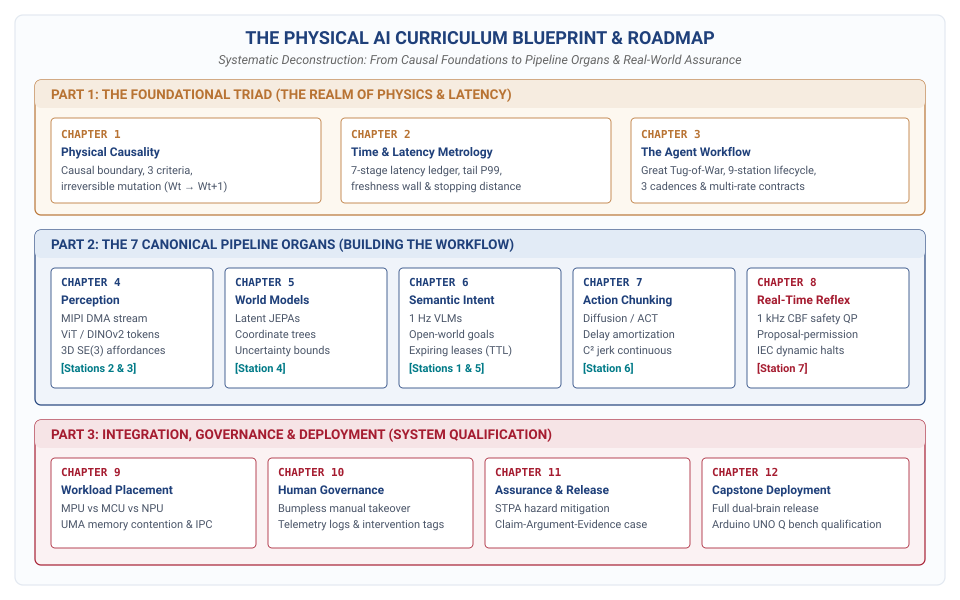

# Cognitive Architecture and Multi-Rate Runtimes\chaptersubtitle{The Five Dimensions, Multi-Rate Runtimes, and the Co-Design Matrix}

{#fig-locator-ch03 width=100%}

*How do we bridge the massive temporal gap between a slow, stochastic foundation model and a microsecond-deterministic motor reflex without crashing the machine?*

In classical digital computing, software execution is abstracted from physical time: if an autoregressive transformer experiences an attention stall or page fault that inflates inference latency from 200 milliseconds to 2 seconds, the digital universe patiently waits behind glass. In Physical AI, time is an unyielding physical coordinate. An embodied agent's primary purpose is to enact continuous, stateful mutations upon an external physical universe ($W_t \to W_{t+1}$). The moment photons strike a sensor or an encoder registers rotor angle, sensory evidence begins an irreversible decay toward obsolescence. While an algorithm deliberates, inertia carries linkages forward, gravity accelerates ungrounded masses, and kinetic energy continues along its dynamical vector. If the computational pipeline fails to produce a valid actuation command before physical state diverges from internal belief, the result is mechanical collision, joint over-torquing, or structural failure. 

This chapter formalizes the systems architecture that resolves this fundamental tension: the 9-station dataflow lifecycle, the Three Cadences spanning four orders of temporal magnitude, and the Master 5×5 Physical Agent Co-Design Matrix that couples cognitive workloads directly to physical silicon and mechanical realities.



::: {.callout-objective}
After studying this chapter, you will be able to:

1. Deconstruct an embodied physical task into the five canonical cognitive stages: spatial perception, temporal memory, semantic reasoning, trajectory planning, and real-time execution.
2. Trace end-to-end dataflow across the 9 lifecycle stations from open-world goal ingestion through physical state mutation and endogenous feedback ($W_t \to W_{t+1} \to O_{t+1}$).
3. Architect the Three Cadences of Physical AI, decoupling slow semantic deliberation ($0.5\text{--}2\text{ Hz}$ on Linux MPU) from intermediate trajectory decoding ($20\text{--}50\text{ Hz}$ on edge NPU) and deterministic safety reflexes ($1000\text{ Hz}$ on bare-metal MCU).
4. Analyze the fundamental systems tension between high-capacity AI deliberation and unyielding physical dynamics.
5. Navigate the 5×5 Physical Agent Co-Design Matrix, evaluating systems tensions and identifying binding versus non-binding intersections.
6. Enforce the Three Architectural Contracts: Proposal–Permission privilege separation, Action Chunk delay amortization, and Expiring Intent Leases ($\mathcal{L}_{\text{intent}}$).
7. Implement a multi-rate dual-brain execution runtime with lock-free SRAM ring buffers, atomic sequence counters, and zero dynamic heap allocation (`malloc = 0`).
:::

::: {.callout-autopsy title="The Cadence Desynchronization Overrun"}
* **System:** Autonomous mobile manipulator sorting parcels in an active logistics warehouse, driven by an onboard vision-language-action (VLA) policy running in user-space Linux with direct Ethernet socket control to motor drives.
* **Incident:** While navigating toward a pallet at $1.4\text{ m/s}$, the robot failed to detect a newly positioned steel roll cage, collided at full speed, bent the chassis steering tie-rods, and fractured an active stereo depth camera mount.
* **Telemetry Snapshot:** At $T+44.120\text{ s}$, the high-level VLA model issued an open-ended navigation waypoint. Two hundred milliseconds later, the robot's visual backbone encountered a dynamic scene shift, triggering a massive key-value (KV) attention cache reallocation and garbage collection sweep in the Python runtime. The user-space control thread stalled for $1.150\text{ seconds}$. Because the trajectory was streamed without an expiring intent lease or real-time microcontroller safety supervisor, the motor drives continued executing the last latched velocity setpoint ($1.4\text{ m/s}$ forward) for $1.61\text{ meters}$ blind.
* **Root Cause:** Temporal coupling and unbounded execution leases—the high-level deliberative AI was directly coupled to actuation timing without an intermediate trajectory chunker or a bare-metal microcontroller enforcing dynamic stopping distance limits.
* **Architectural Flaw:** Monolithic cadence architecture. The system lacked multi-rate cadence decoupling, hardware-enforced intent leases, and an independent 1 kHz safety reflex to initiate autonomous dynamic braking upon host deliberation stalls.
* **Provenance:** Engineered composite. The mechanism and failure path are drawn from documented field incidents; the system parameters and telemetry are constructed for pedagogical instruction.
:::

## The Embodied Cognitive Lifecycle: 9 Stations of Dataflow

Every physical action executed by an embodied intelligent machine—whether a bipedal robot adjusting its center of mass over icy terrain, a dual-arm manipulator threading a flexible wire harness into a chassis, or a thermal management system modulating refrigerant expansion valves across an exascale datacenter—is the culmination of a continuous, 9-station dataflow lifecycle (@fig-agent-workflow). This lifecycle bridges the gap between open-world, high-level semantic intent and deterministic, low-level electro-mechanical actuation.

{#fig-agent-workflow width=100%}

As illustrated in @fig-agent-workflow, the cognitive lifecycle forms a closed causal loop spanning the physical and digital domains. Information flows across nine distinct stations, each executing a specialized mathematical transformation upon the data stream while operating under strict temporal and representation contracts.

### Station 1: Goal Ingestion and Semantic Conditioning
The cognitive lifecycle initiates with the ingestion of an external goal specification. In modern Physical AI architectures, this goal is rarely presented as a sequence of hardcoded joint trajectories; rather, it arrives as an open-world semantic directive, such as a natural language instruction, a multimodal demonstration prompt, or a declarative mission objective.

At Station 1, the system parses the unstructured goal input and tokenizes it into a conditioned semantic goal vector $\mathbf{g} \in \mathbb{R}^d$. This vector projects abstract human intentions into a latent conditioning space accessible to downstream neural foundation models. The primary systems responsibility of Station 1 is grounding: it decomposes high-level mission goals into a structured hierarchy of actionable sub-goals, identifying semantic affordances, target objects, environmental constraints, and completion criteria. This semantic conditioning vector $\mathbf{g}$ persists across multiple deliberative cycles, serving as the conditioning key for both spatial perception and high-level reasoning.

### Station 2: Physical Transduction and Kernel Ingestion
Simultaneously, the physical universe expresses its instantaneous state through raw physical emissions, including photons reflected from surfaces, mechanical vibrations transmitted through structural frames, magnetic flux variations across encoder disks, and thermal gradients across heatsinks. Station 2 captures these physical phenomena through sensor transducers, such as CMOS image sensors, piezoresistive micro-electromechanical systems (MEMS) inertial measurement units (IMUs), capacitive tactile arrays, and magnetic rotary encoders.

Transduction converts physical quantities into digital representations: photodiode potential wells integrate photons into analog voltages, which on-chip analog-to-digital converters (ADCs) quantize into raw pixel arrays. Crucially, the systems architecture at Station 2 must enforce microsecond-accurate hardware timestamping ($t_{\text{capture}}$) at the exact physical capture instant, such as the mid-point of CMOS sensor exposure or the latching clock edge of an SPI bus transaction. The raw digitized data is ingested into system memory via zero-copy direct memory access (DMA) engines across high-speed physical interfaces such as MIPI-CSI2, PCIe, or Ethernet. Ingested frames are deposited directly into pinned, cache-coherent ring buffers within kernel space, bypassing user-space copy overheads to minimize transport latency and eliminate memory bus jitter.

### Station 3: 3D Spatial Perception and Geometric Featurization
Raw sensory arrays, such as two-dimensional RGB pixel matrices $\mathbf{I} \in \mathbb{R}^{H \times W \times 3}$ and sparse LiDAR point clouds $\mathbf{P} \in \mathbb{R}^{N \times 3}$, contain no intrinsic geometric or metric coordinate structure. Station 3 ingests these raw streams to construct a metric representation of the local environment.

Executing on dedicated neural accelerators, spatial perception models (such as Vision Transformers, DINOv2 backbones, and spatial cross-attention encoders) extract metric spatial tokens. This stage performs three simultaneous operations in continuous dataflow: it transforms unprojected 2D pixel coordinates into calibrated 3D Euclidean coordinates using camera intrinsic matrices and extrinsic transformations; it segments actionable surfaces, estimates metric object bounding volumes, and predicts continuous surface normal vectors for candidate grasp or contact locations; and it constructs local Truncated Signed Distance Fields (TSDF) or Euclidean Signed Distance Fields (ESDF) that map every coordinate $\mathbf{x} \in \mathbb{R}^3$ to its scalar distance $d(\mathbf{x})$ from the nearest physical obstacle boundary.

The output of Station 3 is a dense, metric spatial representation $\mathbf{S}_t$ that strips away lighting artifacts and sensor noise, preserving only the geometric and semantic topology of the physical workspace.

### Station 4: Latent World Model and State Estimation
Raw spatial perception provides only a momentary, partially occluded snapshot of the world. If an object passes behind an obstacle or a camera view is momentarily blinded by specular reflection, instantaneous perception collapses. Station 4 maintains temporal continuity by fusing instantaneous spatial perception with historical state memory within a dynamic latent world model and state estimation engine.

Station 4 maintains the agent's central kinematic coordinate transform tree ($\mathcal{T}_{\text{frames}}$), continuously updating spatial relationships between the world frame, base frame, camera frames, and end-effector tool frames. Concurrently, a state estimator maintains estimated state $\hat{\mathbf{x}}_t = [\mathbf{p}_t, \mathbf{v}_t, \mathbf{q}_t, \boldsymbol{\omega}_t]^T$. When an object leaves sensor view, the latent world model preserves belief continuity, expanding its spatial uncertainty envelope over occlusion time:

$$\sigma_{\text{pos}}(t) = \sigma_0 + \|\mathbf{v}_{\text{target}}\| \cdot \Delta t_{\text{occluded}}$$

This continuous belief state ensures that downstream decision-making operates on a coherent representation of reality rather than transient sensor flickers.

### Station 5: Semantic Deliberation and Intent Leases
Equipped with the conditioned goal vector from Station 1 and the coherent belief state from Station 4, Station 5 executes high-capacity semantic reasoning using large Vision-Language-Action (VLA) foundation models. Operating at the slowest temporal cadence ($0.5\text{--}2\text{ Hz}$), Station 5 analyzes complex scene interactions, evaluates causal dependencies, and plans multi-step manipulation sequences.

Crucially, in a robust Physical AI systems architecture, Station 5 never directly emits raw motor torques or low-level actuator setpoints. Because high-capacity foundation models exhibit variable inference latency and long-tail computational jitter ($400\text{--}1500\text{ ms}$), binding their direct output to physical actuators introduces catastrophic timing instability.

Instead, Station 5 produces a formal, time-bounded architectural contract known as an *expiring intent lease* ($\mathcal{L}_{\text{intent}}$):

$$\mathcal{L}_{\text{intent}} = \left\langle \text{GoalID}, \; \mathbf{T}_{\text{target}}, \; \mathcal{B}_{\text{safe}}, \; \|\mathbf{v}\|_{\text{max}}, \; t_{\text{issue}}, \; \Delta t_{\text{TTL}} \right\rangle$$

where $\mathbf{T}_{\text{target}}$ specifies the target spatial pose, $\mathcal{B}_{\text{safe}}$ defines a convex geometric corridor within which motion is guaranteed collision-free, $\|\mathbf{v}\|_{\text{max}}$ is the authorized velocity ceiling, $t_{\text{issue}}$ is the monotonic hardware timestamp of issue, and $\Delta t_{\text{TTL}}$ is the strictly enforced time-to-live ($500\text{--}1500\text{ ms}$). If the downstream runtime does not receive a renewed intent lease before expiration, the lease lapses, triggering a deterministic deceleration to a safe standby state.

### Station 6: Trajectory Decoding and Action Chunking
Station 6 bridges the gap between high-level semantic intent leases and high-rate physical control. Operating at an intermediate cadence ($20\text{--}50\text{ Hz}$), this station employs continuous control policies, such as Action Chunking Transformers (ACT) or conditional diffusion policies.

Rather than predicting a single step action $\mathbf{a}_t$—which would create a brittle dependency where any microsecond inference hiccup stalls the physical robot—Station 6 decodes an entire *action chunk* $\mathbf{A}_{t:t+H}$ across a multi-step rolling time horizon $H$ (typically $16\text{--}64$ steps, spanning $300\text{--}1000\text{ ms}$ of continuous physical motion):

$$\mathbf{A}_{t:t+H} = \left[ \mathbf{a}_t, \; \mathbf{a}_{t+1}, \; \mathbf{a}_{t+2}, \; \dots, \; \mathbf{a}_{t+H-1} \right]$$

where each action vector $\mathbf{a}_{t+k} = [\mathbf{q}_{\text{ref}}, \dot{\mathbf{q}}_{\text{ref}}, \boldsymbol{\tau}_{\text{ff}}]^T$ specifies reference joint positions, velocities, and feedforward torques.

Action chunking provides *delay amortization*: a $35\text{ ms}$ neural forward pass produces hundreds of milliseconds of continuous trajectory data, allowing high-rate motor controllers to execute uninterrupted while the accelerator computes the subsequent chunk in the background.

### Station 7: Real-Time Safety Reflex and Dynamic Shielding
Before any action vector $\mathbf{a}_t$ from an action chunk reaches physical hardware, it must pass through Station 7: the real-time safety reflex. Operating at $1000\text{ Hz}$ ($1\text{ ms}$ loop budget) on a dedicated bare-metal microcontroller, Station 7 enforces absolute physical invariants.

Station 7 acts as an un-bypassable dynamic safety shield. It evaluates candidate actions against joint limits, velocity bounds, torque rate limits, and dynamic stopping distances ($d_{\text{stop}} \le d_{\text{clearance}}$). Operating in static SRAM with zero dynamic memory allocation (`malloc = 0`), the microcontroller executes a minimal safety projection:

$$\mathbf{u}_t^* = \arg\min_{\mathbf{u} \in \mathcal{U}_{\text{safe}}} \|\mathbf{u} - \mathbf{a}_t\|^2 \quad \text{subject to } d_{\text{stop}}(\mathbf{v}) \le d_{\text{clearance}}$$

If the nominal action $\mathbf{a}_t$ is safe, it passes unmodified ($\mathbf{u}_t^* = \mathbf{a}_t$). If the action threatens safety boundaries, Station 7 minimally perturbs the command or engages autonomous controlled braking.

### Station 8: Actuation and Physical State Mutation
At Station 8, verified digital control commands $\mathbf{u}_t^*$ cross the physical threshold into hardware power electronics. Operating at high frequencies ($10\text{--}40\text{ kHz}$), motor drivers execute Field-Oriented Control (FOC) to synthesize pulse-width modulated (PWM) inverter gate voltages. The resulting phase currents generate electromagnetic Lorentz forces in stator windings, producing physical shaft torques that accelerate mechanical linkages against inertia and friction, definitively mutating the physical universe from state $W_t$ to $W_{t+1}$.

### Station 9: Endogenous Sensory Feedback and Causal Loop Closure
The cognitive lifecycle concludes—and immediately restarts—at Station 9. As the physical agent mutates the external universe ($W_t \to W_{t+1}$), the modified environment produces new physical emissions: optical scenes shift, contact forces generate strain gauge voltages, and motor motion generates back-EMF.

Station 9 captures these emissions as the subsequent observation vector $O_{t+1}$, closing the causal loop. By comparing measured observations against predicted forward dynamics ($r = O_{\text{measured}} - O_{\text{predicted}}$), the system extracts innovation residuals to update state estimates, correct model drift, detect unexpected physical collisions, and trigger re-deliberation if an obstacle blocks progress.

### Grounding the 9 Stations Across the Three Canonical Archetypes

To appreciate the universal applicability of this 9-station dataflow lifecycle, @tbl-lifecycle-archetypes illustrates how its execution manifests across the Three Canonical Archetypes of Physical AI:

| Lifecycle Station | Archetype 1: Mobility (e.g., Quadruped on Scree) | Archetype 2: Contact Manipulation (e.g., Dual-Arm Assembly) | Archetype 3: Cybernetic Processes (e.g., Chemical Batch Reactor) |
| :--- | :--- | :--- | :--- |
| **S1: Goal Ingestion** | *"Traverse scree slope to waypoint C"* | *"Seat multi-pin connector plug into chassis"* | *"Maintain 350 K reaction at 5 bar pressure"* |
| **S2: Transduction** | Stereo depth cameras, IMU, foot contact switches | Wrist-mounted RGB-D, 6-axis F/T load cell, joint encoders | Resistance temperature detectors (RTDs), pressure transducers |
| **S3: Perception** | Voxel elevation map, terrain friction classification | 6-DoF plug pose, chamfer surface normal vector | Thermal gradient map, reagent concentration estimation |
| **S4: Latent State** | Quadruped base pose, leg contact state, terrain slip | Gripper pose in fixture frame, contact force history | Reactor thermal mass state, jacket coolant temperature |
| **S5: Reasoning** | High-level gait selection, foothold re-planning | Grasp re-orientation, insertion retry strategy | Cooling valve ramp schedule, reagent feed rate policy |
| **S6: Planning** | 16-step leg swing trajectories and ground reaction forces | 32-step Cartesian end-effector compliance trajectory | 60-step coolant valve flow and heater duty cycle chunk |
| **S7: Safety Reflex** | Leg kinematic reachability, dynamic tipping margin | Maximum contact force clamp ($F \le 20\text{ N}$), zero-velocity barrier | Maximum pressure interlock ($P \le 6\text{ bar}$), thermal runaway clamp |
| **S8: Actuation** | 12x BLDC quasi-direct drive knee/hip actuators | 14x Brushless frameless motors with harmonic gearheads | Proportional solenoid valves, variable-speed coolant pumps |
| **S9: Loop Closure** | Foot slip acceleration detected by IMU $\to$ adjust swing | Contact force spike detected by load cell $\to$ engage compliance | Exothermic thermal surge detected by RTD $\to$ increase coolant |

: The 9-station embodied cognitive lifecycle across the Three Canonical Archetypes. {#tbl-lifecycle-archetypes}

## The Five Cognitive Work Dimensions (The 5 Rows)

The 9 stations of dataflow group naturally into five primary horizontal work dimensions that form the rows of the Physical Agent Co-Design Matrix (@tbl-five-cognitive-rows):

| Cognitive Row | Pipeline Stations | Primary Systems Transformation | Core Output Data Structure | Characteristic Lifetime |
| :--- | :--- | :--- | :--- | :--- |
| **Row 1: Perceive** | Stations 2, 3 | Photons $\to$ 3D Geometric Affordance Tokens | 3D Spatial Token Set $\mathbf{S}_t$ | Transient ($\approx 33\text{ ms}$) |
| **Row 2: Remember** | Station 4 | History $\to$ Dynamic Latent State & Transform Tree | Belief State $\mathbf{B}_t = \langle \hat{\mathbf{x}}_t, \sigma_{\text{pos}}(t), \mathcal{T}_{\text{frames}} \rangle$ | Persistent ($10^1\text{--}10^3\text{ s}$) |
| **Row 3: Reason** | Stations 1, 5 | Goal + Belief $\to$ Semantic Intent & Safety Corridors | Expiring Intent Lease $\mathcal{L}_{\text{intent}}$ | Macro-cadence ($0.5\text{--}1.5\text{ s}$) |
| **Row 4: Plan** | Station 6 | Lease $\to$ Multi-Step Trajectory Chunks & Splines | Action Chunk $\mathbf{A}_{t:t+H}$ | Rolling horizon ($0.3\text{--}1.0\text{ s}$) |
| **Row 5: Execute** | Stations 7, 8 | Chunks $\to$ Certified Phase Current & Commutation | Verified Control Command $\mathbf{u}_t^*$ | Micro-cadence ($1.0\text{ ms} \pm 5\,\mu\text{s}$) |

: The Five Cognitive Work Dimensions. Mapping the five horizontal cognitive rows of the Co-Design Matrix across pipeline stages, primary systems transformations, core data structures, temporal lifetimes, and owning chapters. {#tbl-five-cognitive-rows}

### Row 1 (Perceive): Spatial Grounding and 3D Affordance Tokens
The primary systems responsibility of the perception dimension is spatial grounding: converting high-dimensional sensory arrays into compact, metric geometric tokens (3D poses, surface normals, bounding volumes, and contact friction) referenced to the physical coordinate frame of the robot.

In digital ML, object detection operates in 2D pixel coordinates ($[u, v]$). In physical space, 2D coordinates contain no metric depth or surface normals. Attempting to grasp based on pixel boxes causes manipulators to close fingers on empty air or collide with obstacles.

Spatial perception models (such as Vision Transformers) ingest raw frames transferred via zero-copy Direct Memory Access (DMA) over MIPI-CSI2 buses. The systems bottleneck in Row 1 is memory bus contention: streaming multi-camera $4\text{K}$ video at $60\text{ Hz}$ saturates memory bandwidth, competing directly with neural weight streaming.

### Row 2 (Remember): Temporal World Modeling and Dynamic Belief Persistence
Physical environments are partially observable and plagued by occlusions. When a robotic arm approaches a workpiece, its own wrist occludes the camera line of sight during the final centimeters. If an agent relies only on instantaneous perception, its representation collapses.

Row 2 maintains an internal continuous belief state $\mathbf{B}_t = \langle \hat{\mathbf{x}}_t, \sigma_{\text{pos}}(t), \mathcal{T}_{\text{frames}} \rangle$. When an object is occluded, the world model propagates its kinematic state forward while expanding its spatial uncertainty envelope linearly over occlusion time:

$$\sigma_{\text{pos}}(t) = \sigma_0 + \|\mathbf{v}_{\text{target}}\| \cdot \Delta t_{\text{occluded}}$$

This signals downstream planners that clearance margins around occluded objects must widen over time.

### Row 3 (Reason): Semantic Deliberation and Open-World Goal Decomposition
The third cognitive dimension is semantic deliberation: parsing human directives, evaluating causal dependencies, decomposing complex tasks, and generating time-bounded Expiring Intent Leases ($\mathcal{L}_{\text{intent}}$).

Foundation models ($7\text{B}\text{ to } 70\text{B}$ parameters) exhibit non-deterministic inference latency ($400\text{--}1500\text{ ms}$) and must never directly command motor PWM registers. Instead, they produce intent leases specifying target poses, authorized velocity ceilings ($\|\mathbf{v}\|_{\text{max}}$), and strictly enforced times-to-live ($\Delta t_{\text{TTL}}$). If the model stalls, the lease expires, causing downstream controllers to decelerate smoothly to a safe holding state.

### Row 4 (Plan): Trajectory Generation and Action Chunking
The fourth cognitive dimension is trajectory planning: translating high-level spatial targets into continuous, kinematically feasible joint trajectories.

Action Chunking Transformers (ACT) and Diffusion Policies decode an entire Action Chunk $\mathbf{A}_{t:t+H}$ across a multi-step rolling time horizon $H$ (typically $16\text{--}64$ steps, spanning $300\text{--}1000\text{ ms}$):

$$\mathbf{A}_{t:t+H} = \left[ \mathbf{a}_t, \; \mathbf{a}_{t+1}, \; \dots, \; \mathbf{a}_{t+H-1} \right]
$$

Action chunking provides delay amortization: a $30\text{ ms}$ inference yields $320\text{ ms}$ of continuous motion. Fitting quintic splines across waypoints guarantees $\mathcal{C}^2$ continuity (bounded jerk $\|\dddot{\mathbf{q}}\| \le \mathbf{J}_{\text{max}}$), while receding-horizon temporal ensembling eliminates step-to-step jerk discontinuities.

### Row 5 (Execute): Real-Time Reflex and Mathematical Safety Filtering
The fifth cognitive dimension is the hard real-time execution gatekeeper. It evaluates candidate proposals against hard physical invariants using three strict design rules. First, it follows the minimal intervention principle: as long as candidate proposals satisfy physical safety constraints, the filter outputs $\mathbf{u}_t^* = p_t$ without modification, preserving the learned policy's nominal performance. Second, it executes deterministic projection: if a proposed action would drive the physical state toward joint limits, collisions, or thermal saturation boundaries, the safety filter minimally projects the command onto the boundary of the safe set. Third, it enforces hardware watchdog interlocks and zero-heap execution: to guarantee sub-millisecond execution deadlines without timing jitter, the execution runtime operates with strictly zero dynamic heap allocation (`malloc` and `free` are forbidden after boot; all data structures reside in static SRAM). Independent hardware watchdog timers ($\tau_{\text{watchdog}} \le 20\text{ ms}$) monitor communication health between the host processor and the MCU. If the host freezes or communication drops, the MCU autonomously overrides software, executing an active dynamic deceleration halt before asserting hardware Safe Torque Off (STO).

## The Three Cadences: Decoupling Cognitive Speeds Across Silicon

The central dilemma of embodied intelligence is the vast disparity in required computational frequencies across the cognitive lifecycle. Extracting semantic intent from open-world scenes requires billions of mathematical operations ($7\text{B}\text{ to } 70\text{B}$ parameter models) executing over $500\text{ to } 1500\text{ ms}$. Conversely, maintaining magnetic flux alignment in a brushless motor stator requires Field-Oriented Control (FOC) loops executing at $20\text{ kHz}$ ($50\,\mu\text{s}$), supervised by safety invariant filters executing at $1000\text{ Hz}$ ($1.0\text{ ms}$).

Attempting to execute these workloads within a single synchronous software loop creates the cadence chasm: non-deterministic execution spikes in deliberative AI models starve real-time control loops, leading directly to actuator phase lag, control instability, and physical destruction. Physical AI resolves this fundamental systems tension by decoupling execution into Three Distinct Temporal Cadences spanning four orders of magnitude (@fig-three-cadences).

{#fig-three-cadences width=100%}

### System 2 (Slow Cadence · $0.5\text{--}2\text{ Hz}$): Semantic Deliberation
System 2 represents the slow, high-capacity cognitive tier responsible for open-world semantic scene comprehension, multi-modal goal decomposition, visual affordance parsing, and topological task planning.

Operating at frequencies between $0.5\text{ Hz}$ and $2\text{ Hz}$ (periods of $500\text{ to } 2000\text{ ms}$), System 2 executes on multi-core Application Processors (such as ARM Cortex-A clusters or x86-64 server-class SoCs) coupled with high-throughput Neural Processing Units (NPUs) or cloud-based foundation model endpoints. The software environment is a general-purpose operating system (GPOS), typically embedded Linux with the `PREEMPT_RT` patch.

Workloads in System 2 consist of massive Vision-Language-Action foundation models with parameter counts ranging from $7\text{B}$ to $70\text{B}$. These models exhibit inherently non-deterministic execution times ranging from $400\text{ ms}$ to over $1500\text{ ms}$. This latency variance is driven by autoregressive token generation lengths, dynamic key-value (KV) attention cache line-fills, variable image tokenization overheads, and operating system virtual memory paging.

Because of this non-deterministic latency distribution, System 2 occupies the untrusted advisory proposal privilege tier. System 2 is completely isolated from physical power electronics; it possesses zero memory-mapped write access to hardware timer compare registers, PWM generators, or gate-driver enable circuits. It communicates exclusively via asynchronous inter-process communication (IPC) mailboxes or shared-memory queues, emitting structured Expiring Intent Leases ($\mathcal{L}_{\text{intent}}$).

Failure containment in System 2 is achieved through passive lease expiration. If an out-of-memory error, garbage collection cycle, or thermal throttling event causes System 2 to hang, no catastrophic runaway occurs. Because downstream controllers consume time-bounded leases, the expiration of the lease window ($\Delta t > \Delta t_{\text{TTL}}$) triggers an autonomous transition to a safe holding state without requiring active intervention from the stalled reasoning process.

### System 1.5 (Medium Cadence · $20\text{--}50\text{ Hz}$): Trajectory Decoding
System 1.5 represents the intermediate trajectory generation tier, bridging the temporal chasm between slow semantic deliberation and microsecond motor control. Its primary responsibility is converting active intent leases and high-rate proprioceptive joint states into continuous multi-waypoint action chunks.

Operating at frequencies between $20\text{ Hz}$ and $50\text{ Hz}$ (periods of $20\text{ to } 50\text{ ms}$), System 1.5 executes on dedicated Edge NPUs or Tensor Core accelerators running optimized INT8 or FP8 execution engines. The host environment consists of isolated real-time Linux user-space threads configured with POSIX `SCHED_FIFO` real-time scheduling priorities and locked memory pages (`mlockall()`) to eliminate page fault jitter.

Workloads in System 1.5 consist of compact, continuous control policies, such as Action Chunking Transformers (ACT) and conditional Diffusion Policies ($50\text{M}\text{ to } 200\text{M}$ parameters). In contrast to open-ended autoregressive language models, diffusion denoising schedules and transformer trajectory decoders execute over a fixed, predetermined number of tensor operations. This guarantees a tightly bounded forward-pass execution latency of $20\text{ to } 45\text{ ms}$.

System 1.5 operates as a candidate trajectory generator. It ingests the active intent lease $\mathcal{L}_{\text{intent}}$ from System 2 alongside real-time proprioceptive joint feedback, generating action chunks $\mathbf{A}_{t:t+H}$ across a rolling horizon $H$.

To prevent inter-cadence race conditions and memory bus contention, System 1.5 writes action chunks into lock-free, single-producer single-consumer (SPSC) ring buffers residing in shared static SRAM or pinned DMA-accessible memory. By double-buffering trajectory chunks and decoupling chunk generation from motor commutation, System 1.5 absorbs neural inference latency jitter and ensures downstream execution never experiences starvation.

### System 1 (Fast Cadence · $1000\text{ Hz}$): Hard Real-Time Reflex and Invariant Gatekeeper
System 1 represents the fast, hard real-time reflex tier responsible for deterministic safety invariant auditing, dynamic stopping distance calculation, Control Barrier Function projection, quintic spline interpolation, and high-frequency Field-Oriented Control motor phase commutation.

Operating deterministically at $1000\text{ Hz}$ ($1.0\text{ ms} \pm 5\,\mu\text{s}$ period) at the supervisory level and down to $20\text{--}40\text{ kHz}$ ($25\text{--}50\,\mu\text{s}$) at the motor current loop level, System 1 executes on dedicated Real-Time Microcontroller Units (such as ARM Cortex-M7 or dual-core 32-bit RISC-V processors) residing on physically isolated power and clock domains. The software environment is bare-metal firmware or a certified hard Real-Time Operating System (RTOS) such as FreeRTOS or Zephyr.

System 1 operates under a strict memory management constraint: zero dynamic heap allocation (`malloc` and `free` are strictly forbidden after boot). Every data structure, matrix workspace, and quadratic program solver state is statically allocated in tightly-coupled memory (TCM) or on-chip SRAM, eliminating memory fragmentation, page faults, and cache eviction jitter. Workloads consist of closed-form algebraic kinematic evaluations, friction cone projections, and microsecond-deterministic active-set QP solvers executing in under $400\,\mu\text{s}$ per millisecond tick.

System 1 holds the sole hardware permission authority. The MCU possesses exclusive, hardware-locked memory-mapped write authority over motor inverter PWM timer compare registers, dynamic braking FETs, and gate-driver enable pins.

On every $1.0\text{ ms}$ tick, System 1 consumes the next interpolated waypoint from the SPSC ring buffer, audits it against Control Barrier Functions and physical stopping distance bounds, and either approves it or minimally projects it onto the safe control boundary. System 1 continuously refreshes independent hardware watchdog timers ($\tau_{\text{watchdog}} \le 20\text{ ms}$). If inter-processor communication drops or upstream software fails to assert its heartbeat, System 1 autonomously overrides all external inputs, executing an active Category 1 dynamic deceleration profile before asserting hardware Safe Torque Off (STO).

### Master Cadence Comparison

The architectural boundaries, hardware substrates, memory models, privilege tiers, and failure semantics across all three cadences are summarized in @tbl-three-cadences:

| Technical Dimension | System 2: Deliberation | System 1.5: Trajectory | System 1: Real-Time Reflex |
| :--- | :--- | :--- | :--- |
| **Cadence & Period ($\Delta t$)** | $0.5\text{ to } 2\text{ Hz}$ ($500\text{ to } 2000\text{ ms}$) | $20\text{ to } 50\text{ Hz}$ ($20\text{ to } 50\text{ ms}$) | $1000\text{ Hz}$ ($1.0\text{ ms} \pm 5\,\mu\text{s}$) |
| **Silicon Substrate** | Multi-Core ARM Cortex-A / x86 + NPU | Edge NPU / Tensor Core Accelerator | Bare-Metal ARM Cortex-M7 / RISC-V |
| **Operating Runtime / OS** | Embedded Linux (`PREEMPT_RT`) | Linux Real-Time (`SCHED_FIFO`) | Bare-Metal Firmware / Hard RTOS |
| **Memory Model** | Dynamic Virtual Memory / Paged Heap | Pinned Paged Memory (`mlockall`) | Zero Heap (Static SRAM Only) |
| **Workload Architecture** | Multimodal VLM ($7\text{B}\text{ to } 70\text{B}$) | Diffusion / ACT ($50\text{M}\text{ to } 200\text{M}$) | CBF-QP Solver / Splines / FOC |
| **Output Representation** | Expiring Intent Lease ($\mathcal{L}_{\text{intent}}$) | Action Trajectory Chunk $\mathbf{A}_{t:t+H}$ | Permitted PWM Duty Ratio ($u_t^*$) |
| **Privilege & Authority Tier** | Untrusted Advisory Proposal | Candidate Trajectory Generator | Sole Hardware Gatekeeper (PWM Locks) |
| **IPC Interface** | Asynchronous DRAM Shared Mailbox | Lock-Free SPSC SRAM Ring Buffer | Memory-Mapped Hardware Registers |
| **Failure Containment** | Passive lease timeout ($\Delta t_{\text{TTL}}$) | Discard chunk and replan | Category 1 Deceleration to STO |

: Comparison of the Three Cadences. Substrates, operating runtimes, memory models, workloads, privilege tiers, communication interfaces, and failure containment mechanisms across the multi-rate temporal hierarchy. {#tbl-three-cadences}

### Grounding the Cadences Across the Three Canonical Archetypes

To understand how the Three Cadences operate in physical hardware, we examine how the temporal hierarchy manifests across the Three Canonical Archetypes of Physical AI:

In mobile systems (Archetype 1, such as a legged quadruped on scree), System 2 operates at $1\text{ Hz}$ on an application processor, analyzing panoramic depth images to identify traversable terrain corridors and emitting an intent lease designating a stable foothold region $2\text{ meters}$ ahead. System 1.5 operates at $50\text{ Hz}$ on an edge NPU, running a conditional diffusion policy to generate 16-step action chunks ($320\text{ ms}$ horizon) containing center-of-mass momentum targets and foot swing trajectories. System 1 operates at $1000\text{ Hz}$ on an ARM Cortex-M7 microcontroller, executing whole-body operational space control and auditing ground reaction forces against the friction cone ($F_{\text{tangential}} \le \mu F_{\text{normal}}$). When a foot encounters shifting scree and begins to slip, System 1 detects the loss of traction within $2\text{ ms}$, overrides the nominal trajectory chunk, and modulates foot penetration depth at $20\text{ kHz}$ via Field-Oriented Control motor torque adjustments—re-establishing traction long before System 1.5 or System 2 could process a single frame.

In contact manipulation (Archetype 2, such as high-precision dual-arm assembly), System 2 operates at $0.5\text{ Hz}$, parsing visual scene context to identify connector orientation and issuing an intent lease with a maximum insertion force limit ($F_{\text{max}} \le 15\text{ N}$) and a sub-millimeter approach corridor. System 1.5 operates at $30\text{ Hz}$, decoding 32-step hybrid position/force action chunks that guide the wrist toward the socket while seeking tactile alignment. System 1 operates at $1000\text{ Hz}$ on a bare-metal microcontroller, reading 6-axis force-torque load cells and tactile arrays. The moment the connector pin makes contact with the socket bevel, the contact force rises sharply ($F_c = k_{\text{contact}} \delta x$). System 1's Control Barrier Function projects the command onto the force boundary within $500\,\mu\text{s}$, preventing mechanical pin shear and maintaining compliance even if the neural trajectory policy attempts to drive deeper into the rigid surface.

In cybernetic processes (Archetype 3, such as grid-forming inverters and chemical batch reactors), physical dynamics dictate temporal boundaries across silicon. In a solid-state grid-forming power inverter, System 2 operates at $0.1\text{ Hz}$ optimizing wholesale energy market economic dispatch, System 1.5 operates at $10\text{ Hz}$ generating reactive power droop curve chunks, and System 1 operates at $1000\text{ Hz}$ evaluating phase-locked loop (PLL) grid synchronization and anti-islanding invariants, supervising $40\text{ kHz}$ Space Vector PWM gate drivers to prevent catastrophic circulating reactive currents ($I_{\text{reactive}} \approx V_0 \Delta\phi / X_{\text{line}}$). In a fluid chemical reactor, System 2 operates at $0.01\text{ Hz}$ ($100\text{ s}$ period) optimizing reaction yield trajectories, System 1.5 operates at $1\text{ Hz}$ generating predictive valve aperture chunks, and System 1 operates at $100\text{ Hz}$ monitoring chamber pressure transducers and thermal runaway boundaries, maintaining direct electrical authority over mechanical emergency quench valves.

## The Great Conflict: When Agent Deliberation Meets Physical Dynamics

Physical AI is born from the collision of two engineering disciplines operating under fundamentally irreconcilable physical and computational paradigms. On one side stands modern generative artificial intelligence, whose foundational premise is that computational capacity, representational expressiveness, and task generalization scale directly with parameter volume, multi-head attention depth, and iterative chain-of-thought deliberation. On the other side stands physical dynamics, whose governing laws—conservation of momentum, irreversible thermodynamic entropy, and electromagnetic phase lag—demand microsecond-deterministic execution, unyielding temporal deadlines, and continuous physical contact stability.

{#fig-great-tension width=100%}

### The Structural Tension Between Two Realms
As illustrated in @fig-great-tension, this systems conflict is not an incidental engineering inconvenience that can be eliminated through faster silicon or compiler optimization. Rather, it represents an intrinsic structural tension between two opposing operational realms:

The AI Deliberation Realm operates in an environment where computation is fundamentally time-elastic. In digital machine learning, natural language processing, and multimodal reasoning, an algorithm benefits from being granted additional time to compute. An autoregressive vision-language-action (VLA) foundation model containing $7\text{B}$ to $70\text{B}$ parameters can evaluate multiple reasoning branches, search over topological task graphs, perform self-reflection across visual tokens, and execute multi-step diffusion denoising schedules ($10\text{ to } 100$ denoising steps) to refine its predictions. In the digital domain, if a complex scene requires an inference pipeline to expand its compute duration from $200\text{ ms}$ to $1200\text{ ms}$, the digital universe waits patiently. The host operating system suspends the process, incoming network packets reside in dynamic memory queues, and no physical state is compromised. Digital computation thrives under asynchronous, batch-oriented, variable-latency execution.

In stark contrast, the Physical Dynamics Realm operates in an environment where time is an immutable, continuous physical coordinate. The physical universe never pauses, yields, or buffers its state while a neural network deliberates. The moment photons strike a camera sensor or an encoder reads a joint displacement, the physical information begins an irreversible decay toward obsolescence. An ungrounded mass accelerates under gravity at $g = 9.81\text{ m/s}^2$; moving linkages carry kinetic momentum $\mathbf{p} = m\mathbf{v}$ along their dynamical vectors; and spatial uncertainty envelopes expand continuously:

$$\sigma_{\text{pos}}(t) = \sigma_0 + \|\mathbf{v}_{\text{target}}\| \Delta t$$

Furthermore, computational latency $\tau_{\text{delay}}$ directly injects phase lag into the feedback control loop:

$$\Delta \phi = -\omega \cdot \tau_{\text{delay}}$$

systematically eroding phase margin and driving mechanical actuators into violent limit-cycle instability. Electromagnetic motor drives require continuous phase commutation switching at $20\text{ to } 40\text{ kHz}$ to prevent catastrophic back-EMF voltage spikes, and structural transmissions risk tooth shear if subjected to discontinuous acceleration commands. The physical realm demands absolute, sub-millisecond determinism, bounded worst-case tail latencies ($P_{99.9} \le 1.0\text{ ms}$), and immediate reactive intervention.

### The Three Architectural Contracts
Physical AI resolves this structural tension not by forcing large foundation models to execute at microsecond control frequencies—a physical impossibility—nor by constraining embodied agents to primitive, hardcoded state machines. Instead, Physical AI institutes Three Formal Architectural Contracts that decouple cognitive reasoning from real-time physical control across heterogeneous silicon:

#### Contract 1: The Proposal–Permission Privilege Boundary
Stochastic foundation models, multimodal vision transformers, and trajectory diffusion networks executing on application processors (such as Linux MPUs and edge NPUs) occupy the untrusted advisory proposal privilege tier. Because deep neural networks are prone to distributional hallucination, out-of-distribution drift, and operating system scheduling jitter, they are strictly prohibited from possessing direct memory-mapped write access to actuator registers, motor inverter pulse-width modulation (PWM) timers, or gate-driver enable pins.

The physical machine is governed exclusively by a dedicated bare-metal microcontroller unit (MCU) executing at $1000\text{ Hz}$ ($1.0\text{ ms} \pm 5\,\mu\text{s}$). On every millisecond control tick, the MCU consumes candidate action proposals $p_t$ emitted by the upstream proposal engine and evaluates them against hard physical invariants using an embedded, zero-heap safety filter:

$$\mathbf{u}_t^* = \arg\min_{\mathbf{u} \in \mathcal{U}_{\text{safe}}} \|\mathbf{u} - p_t\|^2 \quad \text{subject to } d_{\text{stop}}(\mathbf{v}) \le d_{\text{clearance}}$$

Under nominal conditions where the candidate action proposal resides safely within the admissible safe set, the filter outputs the proposal unmodified ($\mathbf{u}_t^* = p_t$). If the proposal threatens joint mechanical limits or obstacle boundaries, the filter minimally projects the command onto the safe boundary or initiates controlled dynamic braking. Stochastic AI proposes; deterministic physics permits.

#### Contract 2: Action Chunking Delay Amortization
Rather than predicting single-step actions that stall whenever neural inference encounters an operating system cache miss, a memory bus contention spike, or a diffusion denoising delay, the planning tier decodes rolling Action Chunks ($\mathbf{A}_{t:t+H}$).

A diffusion policy requiring $35\text{ ms}$ of tensor compute generates an action chunk of $H = 32$ steps at $50\text{ Hz}$, yielding $640\text{ ms}$ of continuous physical trajectory. While the real-time microcontroller consumes and interpolates waypoints from the active chunk buffer in static SRAM using $\mathcal{C}^2$-continuous quintic splines, the neural accelerator computes the subsequent overlapping chunk in the background. Receding-horizon temporal ensembling blends overlapping chunks, delivering smooth physical actuation across continuous time.

#### Contract 3: Expiring Intent Leases and Hardware Watchdog Interlocks
System 2 foundation models communicate strictly through time-bounded Expiring Intent Leases ($\mathcal{L}_{\text{intent}}$):

$$\mathcal{L}_{\text{intent}} = \left\langle \text{GoalID}, \; \mathbf{T}_{\text{target}}, \; \mathcal{B}_{\text{safe}}, \; \|\mathbf{v}\|_{\text{max}}, \; t_{\text{issue}}, \; \Delta t_{\text{TTL}}, \; \tau_{\text{heartbeat}} \right\rangle$$

Downstream controllers are authorized to execute motion planning exclusively within the active spatial corridor $\mathcal{B}_{\text{safe}}$ and only while current hardware time satisfies $t \le t_{\text{issue}} + \Delta t_{\text{TTL}}$. If the host application processor stalls due to garbage collection, thermal throttling, or an infinite loop, the intent lease expires passively in memory.

Concurrently, independent hardware watchdog timers ($\tau_{\text{watchdog}} \le 20\text{ ms}$) monitor periodic heartbeat pulses from the host processor. If the host fails to refresh the watchdog or if an active intent lease expires, the microcontroller initiates an immediate, autonomous dynamic deceleration halt before asserting hardware Safe Torque Off (STO). Software failures on the application processor are cleanly contained within milliseconds, eliminating the possibility of physical runaway.

## The Physical Agent Co-Design Matrix and Master Architectural Blueprint

Crossing the five physical constraint columns established in Chapter 2 with the five cognitive work dimensions formalized in this chapter yields the foundational analytical instrument of this textbook: the *Physical Agent Co-Design Matrix* (@fig-codesign-matrix-ch3).

{#fig-codesign-matrix-ch3 width=100%}

Every embodied intelligent machine represents a concrete realization of this $5 \times 5$ design space. Each intersection in the matrix defines a specific systems engineering challenge where a computational transformation must satisfy a physical constraint without violating closed-loop timing or energy envelopes. @tbl-codesign-matrix-summary formalizes the complete $5 \times 5$ topology, categorizing the architectural weight of each intersection into Dominant, Full, Thin, and Non-Binding couplings:

| Cognitive Dimension | C1: Time & Freshness | C2: Inertia & Stopping | C3: Actuation Limits | C4: Thermal Budget | C5: Silicon Contention |
| :--- | :---: | :---: | :---: | :---: | :---: |
| **Row 1: Perceive (Ch 4)** | **Full** Exposure vs. motion blur; rolling shutter skew | **Full** Sensing horizon must exceed $d_{\text{stop}}(\mathbf{v})$ | **Non-Binding** No direct motor phase interaction | **Thin** Sensor die Joule dissipation ($\le 2.5\text{ W}$) | **Dominant** DMA frame ingestion saturates DRAM crossbar |
| **Row 2: Remember (Ch 5)** | **Dominant** Belief covariance expansion $\mathbf{\Sigma}(t)$ | **Full** Dynamic coordinate frame tracking ($\mathcal{T}_{\text{frames}}$) | **Thin** Kinematic joint limit verification | **Full** Continuous latent JEPA memory updating | **Full** KV cache streaming vs. image tokenization |
| **Row 3: Reason (Ch 6)** | **Dominant** Asynchronous intent lease TTL ($\Delta t_{\text{TTL}}$) | **Non-Binding** Abstract semantic task decomposition | **Non-Binding** Zero direct torque generation authority | **Full** Foundation model NPU power draw ($15\text{--}60\text{ W}$) | **Full** Large-parameter weights compete for memory bus |
| **Row 4: Plan (Ch 7)** | **Full** Action chunk horizon $H \Delta t \le \tau_{\text{world}}$ | **Full** Braking profile generation and corridor containment | **Dominant** $\mathcal{C}^2$ jerk bounds ($\dddot{\mathbf{q}} \le \mathbf{J}_{\text{max}}$) and splines | **Full** Diffusion denoising compute overhead | **Thin** Fixed-step tensor compute in isolated threads |
| **Row 5: Execute (Ch 8)** | **Full** $1000\text{ Hz}$ control tick ($1.0\text{ ms} \pm 5\,\mu\text{s}$) | **Dominant** Dynamic stopping distance CBF projection | **Full** Motor coil inductance $\tau_e$ and FOC current loops | **Full** Inverter MOSFET and winding Joule heat ($I^2 R$) | **Full** Lock-free SRAM vs. zero heap (`malloc=0`) |

: The Physical Agent Co-Design Matrix Summary. Mapping the twenty-five systems intersections across the Five Cognitive Dimensions (Rows) and the Five Physical Constraints (Columns), detailing the primary systems questions and coupling severities governing Part II. {#tbl-codesign-matrix-summary}

### How to Read an Uneven Grid

A fundamental insight revealed by @tbl-codesign-matrix-summary is that an engineering co-design matrix is not uniformly dense. The presence of non-binding and thin intersections is not a deficiency; rather, it reflects natural physical decoupling that systems architects must actively exploit.

First, non-binding cells enable formal isolation. Semantic Reasoning (Row 3) has zero direct coupling to Mechanical Actuation Limits (Column 3) or Inertia and Stopping (Column 2). This absence of physical coupling is precisely what makes the Proposal–Permission boundary viable. Because semantic foundation models produce high-level intent leases rather than raw motor voltages, they do not need to model the high-frequency inductance curves ($\tau_e = L/R$) of individual motor windings. Systems architects can formally isolate safety verification within the real-time microcontroller (Row 5), relieving the upstream deliberative models of microsecond control obligations.

Second, the matrix cleanly delineates between universal physical constraints and localized physical constraints. Thermal Dissipation (Column 4) and Silicon Contention (Column 5) touch every single stage of the cognitive lifecycle. Thermal dissipation is universal because every component—from CMOS image sensors integrating charge ($2.5\text{ W}$), to edge NPUs streaming $70\text{B}$ model weights ($35\text{ W}$), to power MOSFET inverter bridges and motor copper windings ($150\text{ W}$)—dissipates non-recoverable Joule heat into the shared physical enclosure. Silicon contention is universal because sensory frame ingestion, latent memory lookups, neural inference, and real-time command buffers all arbitrate for shared memory interconnects, cache lines, and system crossbars. In contrast, Inertia and Stopping (Column 2) and Actuation Limits and Jerk (Column 3) bind only the motion generation and execution stages (Rows 4 and 5). A vision transformer extracting spatial tokens from pixels does not directly accelerate mass or experience mechanical back-EMF; those physical dynamics bind only when trajectory splines and motor phase currents are synthesized.

### Archetype Specificity Across the Matrix

While the structure of the Co-Design Matrix is universal, the specific cells that dominate system design shift dynamically depending on the physical embodiment and governing physical laws:

In mobile systems (Archetype 1), design is heavily dominated by the intersection of Perceive/Remember with Time & Freshness (C1) and Inertia & Stopping (C2). Because a ground rover or aerial drone operates at high translational velocities ($v > 5\text{ m/s}$), linear reaction displacement ($d_{\text{react}} = v \tau_{\text{delay}}$) and quadratic braking distance ($d_{\text{brake}} = v^2 / 2\mu g$) expand rapidly. The perception sensing horizon must continuously exceed the dynamic stopping distance, forcing the spatial world model to maintain high information freshness over large geometric distances.

In contact manipulation (Archetype 2), design is heavily dominated by the intersection of Plan/Execute with Actuation Limits & Jerk (C3) and Time & Freshness (C1). In rigid assembly tasks, the mechanical contact stiffness ($k_{\text{contact}} > 10^5\text{ N/m}$) is extremely high. Any unperceived penetration of even $0.5\text{ mm}$ causes contact forces to surge past structural failure limits within single milliseconds. The execution tier must enforce $\mathcal{C}^2$ jerk bounds ($\dddot{\mathbf{q}} \le \mathbf{J}_{\text{max}}$) and execute sub-millisecond Control Barrier Function projections to prevent gearbox tooth shear and tool destruction.

In cybernetic energy and process systems (Archetype 3), non-kinematic processes are dominated by the intersection of Execute with Thermal Budget (C4) and Silicon Contention (C5). In solid-state grid-forming inverters and high-density battery reactors, mechanical inertia is replaced by electromagnetic reactance and thermal capacitance. The execution tier must maintain microsecond-deterministic phase-locked loop synchronization ($\Delta \phi \approx \omega_0 \tau_{\text{delay}}$) and continuously govern exothermic heat generation ($\dot{Q} = I^2 R$) to prevent dielectric breakdown and thermal runaway.

### The Master Architectural Blueprint and Curriculum Roadmap

The Co-Design Matrix serves as the master blueprint for the remainder of this textbook. As illustrated in @fig-modular-blueprint, the curriculum progresses systematically from physical foundations through sensory-motor organs to full-system governance and qualification:

{#fig-modular-blueprint width=100%}

Part I (Foundations, Chapters 1–3) establishes the physical bedrock. Chapter 1 defines the Causal Boundary and the Proposal–Permission split; Chapter 2 establishes sense-to-actuation metrology, tail latency distributions, and physical constraint columns; Chapter 3 constructs the 9-station cognitive lifecycle, the Three Cadences, and the Co-Design Matrix.

Part II (The Embodied Lifecycle, Chapters 4–8) deconstructs the rows of the Co-Design Matrix one by one, building the five canonical sensory-motor organs: Chapter 4 (Perceive: Spatial Grounding and 3D Affordance Tokens), Chapter 5 (Remember: Temporal World Modeling and Latent Belief States), Chapter 6 (Reason: Open-World Semantic Deliberation and Intent Leases), Chapter 7 (Plan: Trajectory Generation, Action Chunking, and $\mathcal{C}^2$ Splines), and Chapter 8 (Execute: Hard Real-Time Reflexes, Zero-Heap CBF-QP Solvers, and FOC).

Part III (Integration, Placement, and Governance, Chapters 9–11) synthesizes the individual organs into production physical agents: Chapter 9 (Placement: Edge-to-Cloud Workload Partitioning and Dual-Brain Silicon), Chapter 10 (Governance: Safety Lifecycles, Fault Trees, and Fail-Safe Envelopes), and Chapter 11 (Assurance: Hardware-in-the-Loop Qualification, Sim-to-Real, and Release Gates).

## The Intent Lease Protocol: Proposal–Permission in Practice

To bridge the architectural theory of Chapter 3 into concrete engineering practice, we formalize the communication contract between System 2 semantic reasoning and downstream real-time control.

The formal data structure governing the Intent Lease protocol is defined in @tbl-intent-lease-spec:

| Field Identifier | Data Type | Units / Format | Systems Description and Verification Invariant |
| :--- | :--- | :--- | :--- |
| `goal_id` | `uint64_t` | Monotonic Integer | Unique transaction identifier; increments with every new sub-goal to detect replayed or stale payloads. |
| `target_pose` | `Transform3D` | $SE(3)$ Matrix / Quaternion | 6-DoF target coordinate $[\mathbf{p} \in \mathbb{R}^3, \mathbf{q} \in \mathbb{H}]$ referenced strictly to the base kinematic frame $\mathcal{F}_{\text{base}}$. |
| `safe_corridor` | `Polytope3D` | Metric Polytope ($\mathbf{A}\mathbf{x} \le \mathbf{b}$) | Convex 3D geometric volume within which downstream trajectory splines are certified collision-free. |
| `max_velocity` | `VelocityBound` | $[\text{m/s}, \text{rad/s}]$ | Hard kinematic ceiling authorized for the active sub-goal ($\|\mathbf{v}\| \le v_{\text{max}}, \|\boldsymbol{\omega}\| \le \omega_{\text{max}}$). |
| `issue_timestamp` | `uint64_t` | Microseconds ($\mu\text{s}$) | Monotonic hardware clock timestamp captured at the exact instant the lease is committed to shared memory. |
| `time_to_live` | `uint32_t` | Microseconds ($\mu\text{s}$) | Strict temporal validity duration ($\Delta t_{\text{TTL}}$, typically $500{,}000\text{ to } 1{,}500{,}000\,\mu\text{s}$); un-renewed leases expire instantly. |
| `heartbeat_interval` | `uint32_t` | Microseconds ($\mu\text{s}$) | Maximum permissible interval between successive host keep-alive strobes ($\tau_{\text{heartbeat}} \le 100{,}000\,\mu\text{s}$). |
| `failure_action` | `enum8_t` | Fallback Enum | Deterministic fail-safe mode triggered upon expiration (`0x01: DECEL_TO_HOLD`, `0x02: RETURN_HOME`, `0x03: DYNAMIC_BRAKE_STO`). |

: The Formal Intent Lease Data Structure ($\mathcal{L}_{\text{intent}}$). Encapsulating spatial targets, convex safety corridors, velocity ceilings, monotonic timestamps, time-to-live bounds, and deterministic failure actions. {#tbl-intent-lease-spec}

In hardware execution, the intent lease struct is laid out as a 128-byte cache-aligned memory block in shared tightly-coupled SRAM. To guarantee thread safety without blocking the real-time microcontroller, writes from the Linux MPU are synchronized using atomic 64-bit sequence counters and memory barrier instructions (`__atomic_thread_fence(__ATOMIC_RELEASE)` on ARMv8-A; `dmb ish` on ARM Cortex-M). The microcontroller performs an acquire barrier before reading the payload, verifying that the start sequence counter matches the end sequence counter, guaranteeing zero data corruption across asynchronous memory access.

## Common Systems Fallacies in Cognitive Architectures

Embodied artificial intelligence shatters many intuitive assumptions inherited from classical computer science and digital machine learning. Before synthesizing the foundational principles of Part I, we examine four widespread systems fallacies:

::: {.callout-fallacy title="Monolithic Model Frequency Scaling"}
* **The Fallacy:** With sufficient semiconductor scaling, specialized tensor compilers, and deep model quantization, a single $70\text{B}$ parameter Vision-Language-Action foundation model will eventually execute at $1000\text{ Hz}$, eliminating the need for complex multi-rate cadences and heterogeneous dual-brain architectures.
* **The Physical Reality:** Even if digital floating-point computation latency were reduced to zero, the physical universe imposes immutable physical time constants. Optical sensor charge integration requires $8\text{ to } 15\text{ ms}$ under ambient illumination; electromagnetic motor coils require $5\text{ to } 15\text{ ms}$ of electrical rise time ($\tau_e = L/R$) to establish magnetic flux; and mechanical inertia restricts acceleration. Because physical sensing and actuation possess intrinsic analog time constants, high-rate reflex stabilization ($1000\text{ Hz}$) and deliberative semantic reasoning ($1\text{ Hz}$) operate on fundamentally different physical timescales that semiconductor scaling cannot compress into a single monolithic loop.
:::

::: {.callout-fallacy title="Infinite Action Chunk Horizons"}
* **The Fallacy:** If an action chunk horizon of $H = 16$ steps ($320\text{ ms}$) effectively amortizes neural network inference latency, then generating massive action chunks of $H = 256$ steps ($5.12\text{ s}$) is sixteen times better because it virtually eliminates inference compute bottlenecks.
* **The Physical Reality:** Action chunks execute open-loop with respect to unobserved environmental changes. While a long action chunk is unrolling on hardware, the external world continues to evolve dynamically. If a person steps into the robot's workspace or a target workpiece shifts during second two of a five-second chunk, the machine blindly executes its pre-computed trajectory, causing collision. Action chunk horizons must be strictly bounded by the physical information freshness horizon ($H \cdot \Delta t_{\text{step}} \le \tau_{\text{world}}$).
:::

::: {.callout-fallacy title="User-Space Software Profiling"}
* **The Fallacy:** Wrapping neural network inference and control loops in high-level Python software timers (`time.time()` or `time.perf_counter()`) provides an accurate, reliable measure of closed-loop sense-to-actuation latency and multi-rate synchronization.
* **The Physical Reality:** User-space timers measure only thread execution duration within the operating system; they are completely blind to sensor photodiode integration, MIPI-CSI2 DMA transfers, memory bus crossbar contention, IPC mailbox handoffs, and motor phase current rise time. Furthermore, invoking profiling system calls invalidates CPU cache lines and triggers OS context switches, distorting the very tail latencies under evaluation. Closed-loop latency metrology requires external hardware logic analyzers and current probes.
:::

::: {.callout-fallacy title="Static Discrete Setpoint Command"}
* **The Fallacy:** Commanding a sequence of discrete step position setpoints $(\mathbf{q}_k, \mathbf{q}_{k+1})$ from a neural policy directly to motor drives is perfectly acceptable as long as the control frequency is reasonably high ($50\text{ to } 100\text{ Hz}$).
* **The Physical Reality:** Stepped position commands represent mathematical step functions whose second and third time derivatives are infinite Dirac delta spikes ($\ddot{\mathbf{q}} \to \infty, \dddot{\mathbf{q}} \to \infty$). In physical hardware, unbounded kinematic jerk excites high-frequency structural resonances, induces destructive current surges through inverter MOSFETs, and rapidly shears the precision gear teeth of cycloidal drives and harmonic reducers. All discrete neural proposals must be continuously smoothed using $\mathcal{C}^2$-continuous quintic polynomial splines.
:::

## Chapter Summary and Part I Foundations Synthesis

With the completion of Chapter 3, we conclude **Part I: Foundations**. Across these opening three chapters, we have constructed the rigorous theoretical, metrological, and architectural foundation upon which all physical intelligent systems must be engineered:

1. **Chapter 1 (The Causal Boundary):** We established that software in physical systems moves matter and dissipates non-recoverable heat ($I^2 R$). We formalized the irreversible state transition loop ($W_t \to W_{t+1}$), proved that physical consequences cannot be undone with `try/catch` blocks, categorized physical systems across the Three Canonical Archetypes (Mobility, Contact Manipulation, and Cybernetic Processes), and instituted the foundational Proposal–Permission privilege boundary.
2. **Chapter 2 (The Physical Constraints):** We proved that the physical universe serves as the unyielding master clock. We deconstructed the 7-stage sense-to-actuation latency waterfall, demonstrated why extreme tail latency distributions ($P_{99.9}$) govern dynamic stopping distance ($d_{\text{stop}}$), formulated information freshness decay and the Freshness Wall ($\Delta t_{\text{wall}}$), derived mechanical stopping kinematics, and established the Iron Law of Zero-Heap Silicon Determinism (`malloc = 0`).
3. **Chapter 3 (The Cognitive Dimensions):** We traced the 9-station dataflow lifecycle of embodied intelligence, formalized the Five Cognitive Work Dimensions (Perceive, Remember, Reason, Plan, Execute), established the Three Cadences spanning four orders of temporal magnitude, resolved the compute-versus-physics conflict through the Three Architectural Contracts, and constructed the Master Physical Agent Co-Design Matrix.

Having mastered these foundational principles, we now cross from system constraints into concrete architectural construction. In **Part II (Chapters 4 through 8)**, we examine the Physical Agent Co-Design Matrix row by row, systematically designing, implementing, and validating the **Five Canonical Sensory-Motor Organs** that constitute an embodied agent. We begin in **Chapter 4 (Perceive: Spatial Grounding and 3D Affordance Tokens)**, investigating how physical CMOS image sensors and zero-copy Direct Memory Access engines transform raw, unprojected photons into metric, three-dimensional $SE(3)$ spatial affordances capable of guiding physical action in an uncertain world.
