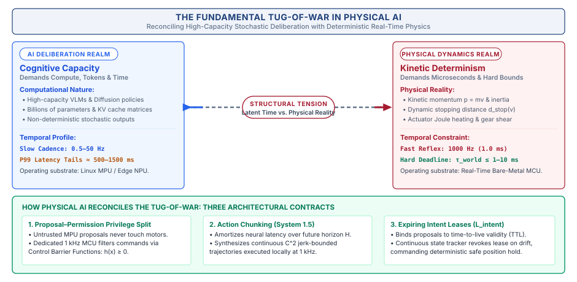

# Cognitive Architecture and Multi-Rate Runtimes\chaptersubtitle{The Five Dimensions, Multi-Rate Runtimes, and the Co-Design Matrix}

{#fig-locator-ch03 width=100% fig-pos="H"}

*How do we bridge the massive temporal gap between a slow, stochastic foundation model and a microsecond-deterministic motor reflex without crashing the machine?*

In classical computing, software is decoupled from physical time: if a foundation model stalls and inference jumps from 200 milliseconds to 2 seconds, the digital universe patiently waits behind glass. In Physical AI, time is an unyielding dynamical coordinate. While an algorithm deliberates in silicon, inertia carries moving linkages forward, gravity accelerates ungrounded masses, and sensory observations decay toward obsolescence. If the computational pipeline fails to deliver valid actuation commands before physical reality diverges from internal belief, the result is mechanical collision and structural failure. To survive in dynamic environments, embodied intelligence cannot execute as a single monolithic software loop; it must be architected as a layered, multi-rate hierarchy that decouples slow, high-capacity semantic reasoning from intermediate trajectory generation and deterministic, bare-metal safety reflexes.



::: {.callout-objective}
After studying this chapter, you will be able to:

1. Deconstruct an embodied physical task into the five canonical cognitive stages: spatial perception, temporal memory, semantic reasoning, trajectory planning, and real-time execution.
2. Trace end-to-end dataflow across the 9 lifecycle stations from open-world goal ingestion through physical state mutation and endogenous feedback ($W_t \to W_{t+1} \to O_{t+1}$).
3. Architect the Three Cadences of Physical AI, decoupling slow semantic deliberation ($0.5\text{--}2\text{ Hz}$ on Linux MPU) from intermediate trajectory decoding ($20\text{--}50\text{ Hz}$ on edge NPU) and deterministic safety reflexes ($1000\text{ Hz}$ on bare-metal MCU).
4. Analyze the fundamental systems tension between high-capacity AI deliberation and unyielding physical dynamics.
5. Navigate the 5×5 Physical Agent Co-Design Matrix, evaluating systems tensions and identifying binding versus non-binding intersections.
6. Enforce the Three Architectural Contracts: Proposal–Permission privilege separation, Action Chunk delay amortization, and Expiring Intent Leases ($\mathcal{L}_{\text{intent}}$).
7. Implement a multi-rate dual-brain execution runtime with lock-free SRAM ring buffers, atomic sequence counters, and zero dynamic heap allocation (`malloc = 0`).
:::

## The Cognitive Imperative: Why Embodiment Demands Layered Intelligence

In modern artificial intelligence research, the prevailing trend has been the relentless pursuit of scale: training larger autoregressive foundation models on vast datasets to produce increasingly capable general-purpose systems. In the digital realm, scaling model parameter count from billions to hundreds of billions yields remarkable emergent capabilities in reasoning, coding, and open-world language understanding. When software operates purely on text tokens or static pixels, the non-deterministic execution latency of these massive models—spanning hundreds of milliseconds to several seconds per forward pass—is an acceptable trade-off for their high semantic competence.

Attempting to apply this monolithic, single-model approach directly to physical embodied systems creates a profound computational and physical contradiction. A physical machine interacting with the real world does not operate on a single time scale. Consider what is required when an autonomous mobile robot navigates a crowded logistics warehouse. At the highest level of abstraction, the agent must interpret human instructions, recognize novel objects, and plan multi-step routes around dynamic obstacles—a high-level semantic deliberation workload that requires billions of parameters and consumes several hundred milliseconds. Simultaneously, the robot must track continuous motion trajectories at intermediate frequencies ($20\text{ to } 50\text{ Hz}$) to negotiate moving pedestrians. At the lowest level, the physical hardware must maintain magnetic field alignment across multi-phase motor windings and evaluate kinematic safety constraints at deterministic rates ($1000\text{ Hz}$ to $20\text{ kHz}$).

If a system attempts to execute these disparate tasks inside a single monolithic software loop, the computational variance of the high-level deliberative model directly pollutes the low-level real-time control loop. When the foundation model encounters a complex visual scene or suffers an operating system memory compaction stall, motor commands stop arriving. In the physical world, inertia does not pause: the unguided machine coasts blindly into obstacles, destroys mechanical transmissions, or loses dynamic balance.

Embodied Physical AI demands a principled cognitive architecture. Rather than forcing a single model to span all time scales, we must decompose intelligence into a layered hierarchy of asynchronous runtimes spanning four orders of temporal magnitude. We begin by examining an incident autopsy that demonstrates the catastrophic consequences of cadence coupling.

## Anatomy of a Cadence Failure: The Desynchronization Overrun

To understand why monolithic execution architectures fail on physical hardware, consider the following incident from industrial logistics:

::: {.callout-autopsy title="The Cadence Desynchronization Overrun"}
* **System:** Autonomous mobile manipulator sorting parcels in an active logistics warehouse, driven by an onboard vision-language-action (VLA) policy running in user-space Linux with direct Ethernet socket control to motor drives.
* **Incident:** While navigating toward a pallet at $1.4\text{ m/s}$, the robot failed to detect a newly positioned steel roll cage, collided at full speed, bent the chassis steering tie-rods, and fractured an active stereo depth camera mount.
* **Telemetry Snapshot:** At $T+44.120\text{ s}$, the high-level VLA model issued an open-ended navigation waypoint. Two hundred milliseconds later, the robot's visual backbone encountered a dynamic scene shift, triggering a massive key-value (KV) attention cache reallocation and garbage collection sweep in the Python runtime. The user-space control thread stalled for $1.150\text{ seconds}$. Because the trajectory was streamed without an expiring intent lease or real-time microcontroller safety supervisor, the motor drives continued executing the last latched velocity setpoint ($1.4\text{ m/s}$ forward) for $1.61\text{ meters}$ blind.
* **Root Cause:** Temporal coupling and unbounded execution leases—the high-level deliberative AI was directly coupled to actuation timing without an intermediate trajectory chunker or a bare-metal microcontroller enforcing dynamic stopping distance limits.
* **Architectural Flaw:** Monolithic cadence architecture. The system lacked multi-rate cadence decoupling, hardware-enforced intent leases, and an independent 1 kHz safety reflex to initiate autonomous dynamic braking upon host deliberation stalls.
* **Provenance:** Engineered composite based on documented industrial automation incident classes; telemetry and system parameters are constructed for pedagogical instruction.
:::

The incident autopsy exposes the fundamental vulnerability of monolithic cadence systems: when slow, stochastic neural deliberation is directly coupled to physical actuator setpoints, an operating system stall transforms into a physical projectile hazard. To eliminate this vulnerability, Physical AI architectures structure dataflow across nine canonical lifecycle stations.

## The Embodied Cognitive Lifecycle: 9 Stations of Dataflow

Every physical action executed by an embodied intelligent machine—whether a bipedal robot adjusting its center of mass over icy terrain, a dual-arm manipulator threading a flexible wire harness into a chassis, or a thermal management system modulating refrigerant expansion valves across an exascale datacenter—is the culmination of a continuous, 9-station dataflow lifecycle (@fig-agent-workflow). This lifecycle bridges the gap between open-world, high-level semantic intent and deterministic, low-level electro-mechanical actuation.

{#fig-agent-workflow width=100%}

As illustrated in @fig-agent-workflow, the cognitive lifecycle forms a closed causal loop spanning the physical and digital domains. Information flows across nine distinct stations, each executing a specialized mathematical transformation upon the data stream while operating under strict temporal and representation contracts.

### Station 1: Goal Ingestion and Semantic Conditioning
The cognitive lifecycle initiates with the ingestion of an external goal specification. In modern Physical AI architectures, this goal is rarely presented as a sequence of hardcoded joint trajectories; rather, it arrives as an open-world semantic directive, such as a natural language instruction, a multimodal demonstration prompt, or a declarative mission objective.

At Station 1, the system parses the unstructured goal input and tokenizes it into a conditioned semantic goal vector $\mathbf{g} \in \mathbb{R}^d$. This vector projects abstract human intentions into a latent conditioning space accessible to downstream neural foundation models. The primary systems responsibility of Station 1 is grounding: it decomposes high-level mission goals into a structured hierarchy of actionable sub-goals, identifying semantic affordances, target objects, environmental constraints, and completion criteria. This semantic conditioning vector $\mathbf{g}$ persists across multiple deliberative cycles, serving as the conditioning key for both spatial perception and high-level reasoning.

### Station 2: Physical Transduction and Kernel Ingestion
Simultaneously, the physical universe expresses its instantaneous state through raw physical emissions, including photons reflected from surfaces, mechanical vibrations transmitted through structural frames, magnetic flux variations across encoder disks, and thermal gradients across heatsinks. Station 2 captures these physical phenomena through sensor transducers, such as CMOS image sensors, piezoresistive micro-electromechanical systems (MEMS) inertial measurement units (IMUs), capacitive tactile arrays, and magnetic rotary encoders.

Transduction converts physical quantities into digital representations: photodiode potential wells integrate photons into analog voltages, which on-chip analog-to-digital converters (ADCs) quantize into raw pixel arrays. Crucially, the systems architecture at Station 2 must enforce microsecond-accurate hardware timestamping ($t_{\text{capture}}$) at the exact physical capture instant, such as the mid-point of CMOS sensor exposure or the latching clock edge of an SPI bus transaction. The raw digitized data is ingested into system memory via zero-copy direct memory access (DMA) engines across high-speed physical interfaces such as MIPI-CSI2, PCIe, or Ethernet. Ingested frames are deposited directly into pinned, cache-coherent ring buffers within kernel space, bypassing user-space copy overheads to minimize transport latency and eliminate memory bus jitter.

### Station 3: 3D Spatial Perception and Geometric Featurization
Raw sensory arrays, such as two-dimensional RGB pixel matrices $\mathbf{I} \in \mathbb{R}^{H \times W \times 3}$ and sparse LiDAR point clouds $\mathbf{P} \in \mathbb{R}^{N \times 3}$, contain no intrinsic geometric or metric coordinate structure. Station 3 ingests these raw streams to construct a metric representation of the local environment.

Executing on dedicated neural accelerators, spatial perception models (such as Vision Transformers, DINOv2 backbones, and spatial cross-attention encoders) extract metric spatial tokens. This stage performs three simultaneous operations in continuous dataflow: it transforms unprojected 2D pixel coordinates into calibrated 3D Euclidean coordinates using camera intrinsic matrices and extrinsic transformations; it segments actionable surfaces, estimates metric object bounding volumes, and predicts continuous surface normal vectors for candidate grasp or contact locations; and it constructs local Truncated Signed Distance Fields (TSDF) or Euclidean Signed Distance Fields (ESDF) that map every coordinate $\mathbf{x} \in \mathbb{R}^3$ to its scalar distance $d(\mathbf{x})$ from the nearest physical obstacle boundary.

The output of Station 3 is a dense, metric spatial representation $\mathbf{S}_t$ that strips away lighting artifacts and sensor noise, preserving only the geometric and semantic topology of the physical workspace.

### Station 4: Latent World Model and State Estimation
Raw spatial perception provides only a momentary, partially occluded snapshot of the world. If an object passes behind an obstacle or a camera view is momentarily blinded by specular reflection, instantaneous perception collapses. Station 4 maintains temporal continuity by fusing instantaneous spatial perception with historical state memory within a dynamic latent world model and state estimation engine.

Station 4 maintains the agent's central kinematic coordinate transform tree ($\mathcal{T}_{\text{frames}}$), continuously updating spatial relationships between the world frame, base frame, camera frames, and end-effector tool frames. Concurrently, a state estimator maintains estimated state $\hat{\mathbf{x}}_t = [\mathbf{p}_t, \mathbf{v}_t, \mathbf{q}_t, \boldsymbol{\omega}_t]^T$. When an object leaves sensor view, the latent world model preserves belief continuity, expanding its spatial uncertainty envelope over occlusion time:

$$\sigma_{\text{pos}}(t) = \sigma_0 + \|\mathbf{v}_{\text{target}}\| \cdot \Delta t_{\text{occluded}}$$

This continuous belief state ensures that downstream decision-making operates on a coherent representation of reality rather than transient sensor flickers.

### Station 5: Semantic Deliberation and Intent Leases
Equipped with the conditioned goal vector from Station 1 and the coherent belief state from Station 4, Station 5 executes high-capacity semantic reasoning using large Vision-Language-Action (VLA) foundation models. Operating at the slowest temporal cadence ($0.5\text{--}2\text{ Hz}$), Station 5 analyzes complex scene interactions, evaluates causal dependencies, and plans multi-step manipulation sequences.

Crucially, in a robust Physical AI systems architecture, Station 5 never directly emits raw motor torques or low-level actuator setpoints. Because high-capacity foundation models exhibit variable inference latency and long-tail computational jitter ($400\text{--}1500\text{ ms}$), binding their direct output to physical actuators introduces catastrophic timing instability.

Instead, Station 5 produces a formal, time-bounded architectural contract known as an *expiring intent lease* ($\mathcal{L}_{\text{intent}}$):

$$\mathcal{L}_{\text{intent}} = \left\langle \text{GoalID}, \; \mathbf{T}_{\text{target}}, \; \mathcal{B}_{\text{safe}}, \; \|\mathbf{v}\|_{\text{max}}, \; t_{\text{issue}}, \; \Delta t_{\text{TTL}} \right\rangle$$

where $\mathbf{T}_{\text{target}}$ specifies the target spatial pose, $\mathcal{B}_{\text{safe}}$ defines a convex geometric corridor within which motion is guaranteed collision-free, $\|\mathbf{v}\|_{\text{max}}$ is the authorized velocity ceiling, $t_{\text{issue}}$ is the monotonic hardware timestamp of issue, and $\Delta t_{\text{TTL}}$ is the strictly enforced time-to-live ($500\text{--}1500\text{ ms}$). If the downstream runtime does not receive a renewed intent lease before expiration, the lease lapses, triggering a deterministic deceleration to a safe standby state.

### Station 6: Trajectory Decoding and Action Chunking
Station 6 bridges the gap between high-level semantic intent leases and high-rate physical control. Operating at an intermediate cadence ($20\text{--}50\text{ Hz}$), this station employs continuous control policies, such as Action Chunking Transformers (ACT) or conditional diffusion policies.

Rather than predicting a single step action $\mathbf{a}_t$—which would create a brittle dependency where any microsecond inference hiccup stalls the physical robot—Station 6 decodes an entire *action chunk* $\mathbf{A}_{t:t+H}$ across a multi-step rolling time horizon $H$ (typically $16\text{--}64$ steps, spanning $300\text{--}1000\text{ ms}$ of continuous physical motion):

$$\mathbf{A}_{t:t+H} = \left[ \mathbf{a}_t, \; \mathbf{a}_{t+1}, \; \mathbf{a}_{t+2}, \; \dots, \; \mathbf{a}_{t+H-1} \right]$$

where each action vector $\mathbf{a}_{t+k} = [\mathbf{q}_{\text{ref}}, \dot{\mathbf{q}}_{\text{ref}}, \boldsymbol{\tau}_{\text{ff}}]^T$ specifies reference joint positions, velocities, and feedforward torques.

Action chunking provides *delay amortization*: a $35\text{ ms}$ neural forward pass produces hundreds of milliseconds of continuous trajectory data, allowing high-rate motor controllers to execute uninterrupted while the accelerator computes the subsequent chunk in the background.

### Station 7: Real-Time Safety Reflex and Dynamic Shielding
Before any action vector $\mathbf{a}_t$ from an action chunk reaches physical hardware, it must pass through Station 7: the real-time safety reflex. Operating at $1000\text{ Hz}$ ($1\text{ ms}$ loop budget) on a dedicated bare-metal microcontroller, Station 7 enforces absolute physical invariants.

Station 7 acts as an un-bypassable dynamic safety shield. It evaluates candidate actions against joint limits, velocity bounds, torque rate limits, and dynamic stopping distances ($d_{\text{stop}} \le d_{\text{clearance}}$). Operating in static SRAM with zero dynamic memory allocation (`malloc = 0`), the microcontroller executes a minimal safety projection:

$$\mathbf{u}_t^* = \arg\min_{\mathbf{u} \in \mathcal{U}_{\text{safe}}} \|\mathbf{u} - \mathbf{a}_t\|^2 \quad \text{subject to } d_{\text{stop}}(\mathbf{v}) \le d_{\text{clearance}}$$

If the nominal action $\mathbf{a}_t$ is safe, it passes unmodified ($\mathbf{u}_t^* = \mathbf{a}_t$). If the action threatens safety boundaries, Station 7 minimally perturbs the command or engages autonomous controlled braking.

### Station 8: Actuation and Physical State Mutation
At Station 8, verified digital control commands $\mathbf{u}_t^*$ cross the physical threshold into hardware power electronics. Operating at high frequencies ($10\text{--}40\text{ kHz}$), motor drivers execute Field-Oriented Control (FOC) to synthesize pulse-width modulated (PWM) inverter gate voltages. The resulting phase currents generate electromagnetic Lorentz forces in stator windings, producing physical shaft torques that accelerate mechanical linkages against inertia and friction, definitively mutating the physical universe from state $W_t$ to $W_{t+1}$.

### Station 9: Endogenous Sensory Feedback and Causal Loop Closure
The cognitive lifecycle concludes—and immediately restarts—at Station 9. As the physical agent mutates the external universe ($W_t \to W_{t+1}$), the modified environment produces new physical emissions: optical scenes shift, contact forces generate strain gauge voltages, and motor motion generates back-EMF.

Station 9 captures these emissions as the subsequent observation vector $O_{t+1}$, closing the causal loop. By comparing measured observations against predicted forward dynamics ($r = O_{\text{measured}} - O_{\text{predicted}}$), the system extracts innovation residuals to update state estimates, correct model drift, detect unexpected physical collisions, and trigger re-deliberation if an obstacle blocks progress.

### Grounding Across the Three Canonical Archetypes
To appreciate the universal applicability of this 9-station dataflow lifecycle, @tbl-lifecycle-archetypes illustrates how its execution manifests across the Three Canonical Archetypes of Physical AI:

| Lifecycle Station | Archetype 1: Mobility (e.g., Quadruped on Scree) | Archetype 2: Contact Manipulation (e.g., Dual-Arm Assembly) | Archetype 3: Cybernetic Processes (e.g., Chemical Batch Reactor) |
| :--- | :--- | :--- | :--- |
| **S1: Goal Ingestion** | *"Traverse scree slope to waypoint C"* | *"Seat multi-pin connector plug into chassis"* | *"Maintain 350 K reaction at 5 bar pressure"* |
| **S2: Transduction** | Stereo depth cameras, IMU, foot contact switches | Wrist-mounted RGB-D, 6-axis F/T load cell, joint encoders | Resistance temperature detectors (RTDs), pressure transducers |
| **S3: Perception** | Voxel elevation map, terrain friction classification | 6-DoF plug pose, chamfer surface normal vector | Thermal gradient map, reagent concentration estimation |
| **S4: Latent State** | Quadruped base pose, leg contact state, terrain slip | Gripper pose in fixture frame, contact force history | Reactor thermal mass state, jacket coolant temperature |
| **S5: Reasoning** | High-level gait selection, foothold re-planning | Grasp re-orientation, insertion retry strategy | Cooling valve ramp schedule, reagent feed rate policy |
| **S6: Planning** | 16-step leg swing trajectories and ground reaction forces | 32-step Cartesian end-effector compliance trajectory | 60-step coolant valve flow and heater duty cycle chunk |
| **S7: Safety Reflex** | Leg kinematic reachability, dynamic tipping margin | Maximum contact force clamp ($F \le 20\text{ N}$), zero-velocity barrier | Maximum pressure interlock ($P \le 6\text{ bar}$), thermal runaway clamp |
| **S8: Actuation** | 12x BLDC quasi-direct drive knee/hip actuators | 14x Brushless frameless motors with harmonic gearheads | Proportional solenoid valves, variable-speed coolant pumps |
| **S9: Loop Closure** | Foot slip acceleration detected by IMU $\to$ adjust swing | Contact force spike detected by load cell $\to$ engage compliance | Exothermic thermal surge detected by RTD $\to$ increase coolant |

: The 9-station embodied cognitive lifecycle across the Three Canonical Archetypes. {#tbl-lifecycle-archetypes}

## The Five Cognitive Work Dimensions (The 5 Rows)

The 9 stations of dataflow group naturally into five primary horizontal work dimensions that form the rows of the Physical Agent Co-Design Matrix (@tbl-five-cognitive-rows):

| Cognitive Row | Pipeline Stations | Primary Systems Transformation | Core Output Data Structure | Characteristic Lifetime |
| :--- | :--- | :--- | :--- | :--- |
| **Row 1: Perceive** | Stations 2, 3 | Photons $\to$ 3D Geometric Affordance Tokens | 3D Spatial Token Set $\mathbf{S}_t$ | Transient ($\approx 33\text{ ms}$) |
| **Row 2: Remember** | Station 4 | History $\to$ Dynamic Latent State & Transform Tree | Belief State $\mathbf{B}_t = \langle \hat{\mathbf{x}}_t, \sigma_{\text{pos}}(t), \mathcal{T}_{\text{frames}} \rangle$ | Persistent ($10^1\text{--}10^3\text{ s}$) |
| **Row 3: Reason** | Stations 1, 5 | Goal + Belief $\to$ Semantic Intent & Safety Corridors | Expiring Intent Lease $\mathcal{L}_{\text{intent}}$ | Macro-cadence ($0.5\text{--}1.5\text{ s}$) |
| **Row 4: Plan** | Station 6 | Lease $\to$ Multi-Step Trajectory Chunks & Splines | Action Chunk $\mathbf{A}_{t:t+H}$ | Rolling horizon ($0.3\text{--}1.0\text{ s}$) |
| **Row 5: Execute** | Stations 7, 8 | Chunks $\to$ Certified Phase Current & Commutation | Verified Control Command $\mathbf{u}_t^*$ | Micro-cadence ($1.0\text{ ms} \pm 5\,\mu\text{s}$) |

: The Five Cognitive Work Dimensions. Mapping the five horizontal cognitive rows of the Co-Design Matrix across pipeline stages, primary systems transformations, core data structures, and temporal lifetimes. {#tbl-five-cognitive-rows}

### Row 1 (Perceive): Spatial Grounding and 3D Affordance Tokens
The primary systems responsibility of the perception dimension is spatial grounding: converting high-dimensional sensory arrays into compact, metric geometric tokens (3D poses, surface normals, bounding volumes, and contact friction) referenced to the physical coordinate frame of the robot.

In digital ML, object detection operates in 2D pixel coordinates ($[u, v]$). In physical space, 2D coordinates contain no metric depth or surface normals. Attempting to grasp based on pixel boxes causes manipulators to close fingers on empty air or collide with obstacles.

Spatial perception models (such as Vision Transformers) ingest raw frames transferred via zero-copy Direct Memory Access (DMA) over MIPI-CSI2 buses. The systems bottleneck in Row 1 is memory bus contention: streaming multi-camera $4\text{K}$ video at $60\text{ Hz}$ saturates memory bandwidth, competing directly with neural weight streaming.

### Row 2 (Remember): Temporal World Modeling and Dynamic Belief Persistence
Physical environments are partially observable and plagued by occlusions. When a robotic arm approaches a workpiece, its own wrist occludes the camera line of sight during the final centimeters. If an agent relies only on instantaneous perception, its representation collapses.

Row 2 maintains an internal continuous belief state $\mathbf{B}_t = \langle \hat{\mathbf{x}}_t, \sigma_{\text{pos}}(t), \mathcal{T}_{\text{frames}} \rangle$. When an object is occluded, the world model propagates its kinematic state forward while expanding its spatial uncertainty envelope linearly over occlusion time:

$$\sigma_{\text{pos}}(t) = \sigma_0 + \|\mathbf{v}_{\text{target}}\| \cdot \Delta t_{\text{occluded}}$$

This signals downstream planners that clearance margins around occluded objects must widen over time.

### Row 3 (Reason): Semantic Deliberation and Open-World Goal Decomposition
The third cognitive dimension is semantic deliberation: parsing human directives, evaluating causal dependencies, decomposing complex tasks, and generating time-bounded Expiring Intent Leases ($\mathcal{L}_{\text{intent}}$).

Foundation models ($7\text{B}\text{ to } 70\text{B}$ parameters) exhibit non-deterministic inference latency ($400\text{--}1500\text{ ms}$) and must never directly command motor PWM registers. Instead, they produce intent leases specifying target poses, authorized velocity ceilings ($\|\mathbf{v}\|_{\text{max}}$), and strictly enforced times-to-live ($\Delta t_{\text{TTL}}$). If the model stalls, the lease expires, causing downstream controllers to decelerate smoothly to a safe holding state.

### Row 4 (Plan): Trajectory Generation and Action Chunking
The fourth cognitive dimension is trajectory planning: translating high-level spatial targets into continuous, kinematically feasible joint trajectories.

Action Chunking Transformers (ACT) and Diffusion Policies decode an entire Action Chunk $\mathbf{A}_{t:t+H}$ across a multi-step rolling time horizon $H$ (typically $16\text{--}64$ steps, spanning $300\text{--}1000\text{ ms}$):

$$\mathbf{A}_{t:t+H} = \left[ \mathbf{a}_t, \; \mathbf{a}_{t+1}, \; \dots, \; \mathbf{a}_{t+H-1} \right]$$

Action chunking provides delay amortization: a $30\text{ ms}$ inference yields $320\text{ ms}$ of continuous motion. Fitting quintic splines across waypoints guarantees $\mathcal{C}^2$ continuity (bounded jerk $\|\dddot{\mathbf{q}}\| \le \mathbf{J}_{\text{max}}$), while receding-horizon temporal ensembling eliminates step-to-step jerk discontinuities.

### Row 5 (Execute): Real-Time Reflex and Mathematical Safety Filtering
The fifth cognitive dimension is the hard real-time execution gatekeeper. It evaluates candidate proposals against hard physical invariants using three strict design rules. First, it follows the minimal intervention principle: as long as candidate proposals satisfy physical safety constraints, the filter outputs $\mathbf{u}_t^* = p_t$ without modification, preserving the learned policy's nominal performance. Second, it executes deterministic projection: if a proposed action would drive the physical state toward joint limits, collisions, or thermal saturation boundaries, the safety filter minimally projects the command onto the boundary of the safe set. Third, it enforces hardware watchdog interlocks and zero-heap execution: to guarantee sub-millisecond execution deadlines without timing jitter, the execution runtime operates with strictly zero dynamic heap allocation (`malloc` and `free` are forbidden after boot; all data structures reside in static SRAM). Independent hardware watchdog timers ($\tau_{\text{watchdog}} \le 20\text{ ms}$) monitor communication health between the host processor and the MCU. If the host freezes or communication drops, the MCU autonomously overrides software, executing an active dynamic deceleration halt before asserting hardware Safe Torque Off (STO).

## The Three Cadences: Decoupling Cognitive Speeds Across Silicon

The central dilemma of embodied intelligence is the vast disparity in required computational frequencies across the cognitive lifecycle. Extracting semantic intent from open-world scenes requires billions of mathematical operations ($7\text{B}\text{ to } 70\text{B}$ parameter models) executing over $500\text{ to } 1500\text{ ms}$. Conversely, maintaining magnetic flux alignment in a brushless motor stator requires Field-Oriented Control (FOC) loops executing at $20\text{ kHz}$ ($50\,\mu\text{s}$), supervised by safety invariant filters executing at $1000\text{ Hz}$ ($1.0\text{ ms}$).

Attempting to execute these workloads within a single synchronous software loop creates the cadence chasm: non-deterministic execution spikes in deliberative AI models starve real-time control loops, leading directly to actuator phase lag, control instability, and physical destruction. Physical AI resolves this fundamental systems tension by decoupling execution into Three Distinct Temporal Cadences spanning four orders of magnitude (@fig-three-cadences).

{#fig-three-cadences width=100%}

### System 2 (Slow Cadence · $0.5\text{--}2\text{ Hz}$): Semantic Deliberation
System 2 represents the slow, high-capacity cognitive tier responsible for open-world semantic scene comprehension, multi-modal goal decomposition, visual affordance parsing, and topological task planning.

Operating at frequencies between $0.5\text{ Hz}$ and $2\text{ Hz}$ (periods of $500\text{ to } 2000\text{ ms}$), System 2 executes on multi-core Application Processors (such as ARM Cortex-A clusters or x86-64 server-class SoCs) coupled with high-throughput Neural Processing Units (NPUs) or cloud-based foundation model endpoints. The software environment is a general-purpose operating system (GPOS), typically embedded Linux with the `PREEMPT_RT` patch.

Workloads in System 2 consist of massive Vision-Language-Action foundation models with parameter counts ranging from $7\text{B}$ to $70\text{B}$. These models exhibit inherently non-deterministic execution times ranging from $400\text{ ms}$ to over $1500\text{ ms}$. This latency variance is driven by autoregressive token generation lengths, dynamic key-value (KV) attention cache line-fills, variable image tokenization overheads, and operating system virtual memory paging.

Because of this non-deterministic latency distribution, System 2 occupies the untrusted advisory proposal privilege tier. System 2 is completely isolated from physical power electronics; it possesses zero memory-mapped write access to hardware timer compare registers, PWM generators, or gate-driver enable circuits. It communicates exclusively via asynchronous inter-process communication (IPC) mailboxes or shared-memory queues, emitting structured Expiring Intent Leases ($\mathcal{L}_{\text{intent}}$).

Failure containment in System 2 is achieved through passive lease expiration. If an out-of-memory error, garbage collection cycle, or thermal throttling event causes System 2 to hang, no catastrophic runaway occurs. Because downstream controllers consume time-bounded leases, the expiration of the lease window ($\Delta t > \Delta t_{\text{TTL}}$) triggers an autonomous transition to a safe holding state without requiring active intervention from the stalled reasoning process.

### System 1.5 (Medium Cadence · $20\text{--}50\text{ Hz}$): Trajectory Decoding
System 1.5 represents the intermediate trajectory generation tier, bridging the temporal chasm between slow semantic deliberation and microsecond motor control. Its primary responsibility is converting active intent leases and high-rate proprioceptive joint states into continuous multi-waypoint action chunks.

Operating at frequencies between $20\text{ Hz}$ and $50\text{ Hz}$ (periods of $20\text{ to } 50\text{ ms}$), System 1.5 executes on dedicated Edge NPUs or Tensor Core accelerators running optimized INT8 or FP8 execution engines. The host environment consists of isolated real-time Linux user-space threads configured with POSIX `SCHED_FIFO` real-time scheduling priorities and locked memory pages (`mlockall()`) to eliminate page fault jitter.

Workloads in System 1.5 consist of compact, continuous control policies, such as Action Chunking Transformers (ACT) and conditional Diffusion Policies ($50\text{M}\text{ to } 200\text{M}$ parameters). In contrast to open-ended autoregressive language models, diffusion denoising schedules and transformer trajectory decoders execute over a fixed, predetermined number of tensor operations. This guarantees a tightly bounded forward-pass execution latency of $20\text{ to } 45\text{ ms}$.

System 1.5 amortizes computational delay by predicting multi-step action chunks $\mathbf{A}_{t:t+H}$ across a rolling time horizon $H = 16\text{--}64$ steps ($300\text{--}1000\text{ ms}$). By evaluating overlapping chunks via receding-horizon temporal ensembling, System 1.5 delivers smooth, continuous trajectory waypoints while filtering out high-frequency sensor noise and inference jitter.

### System 1 (Fast Cadence · $1000\text{ Hz}$): Real-Time Safety Reflex
System 1 represents the deterministic real-time execution tier. Its primary responsibility is verifying candidate action chunks against hard physical invariants, solving real-time Control Barrier Function (CBF) quadratic programs, evaluating dynamic stopping distances ($d_{\text{stop}} \le d_{\text{clearance}}$), enforcing joint kinematic limits, and synthesizing high-frequency motor phase commutation.

Operating at a strict $1000\text{ Hz}$ loop frequency ($1.0\text{ ms}$ period with timing jitter $\le 5\,\mu\text{s}$), System 1 executes on dedicated Real-Time Microcontrollers (MCUs, such as ARM Cortex-M7 or lockstep RISC-V cores) or isolated bare-metal CPU cores. The software environment is a hard real-time operating system (such as FreeRTOS, Zephyr, or bare metal).

Crucially, System 1 enforces the Iron Law of Zero Dynamic Heap Allocation (`malloc = 0`). All memory arrays, ring buffers, matrix workspaces, and state vectors reside in static SRAM allocated at compile time.

System 1 holds exclusive physical privilege: it alone is connected to hardware PWM timer compare registers, gate-driver enable lines, and emergency Safe Torque Off (STO) hardware interlocks. System 1 possesses absolute authority to veto, reshape, or clamp candidate proposals from System 2 and System 1.5, guaranteeing that physical hardware invariants are never breached.

| Cadence Tier | Cognitive Role | Target Frequency | Hardware Substrate | Software Runtime | Trust & Authority Level |
| :--- | :--- | :---: | :--- | :--- | :--- |
| **System 2** | Semantic Deliberation & Affordance Parsing | $0.5\text{--}2\text{ Hz}$ | Multi-core MPU / Cloud Accelerator | Linux (`PREEMPT_RT`) / Python / PyTorch | Untrusted (Advisory Intent Leases) |
| **System 1.5** | Trajectory Planning & Action Chunking | $20\text{--}50\text{ Hz}$ | Edge NPU / Tensor Core GPU | Real-time C++ / TensorRT / ONNX Runtime | Semi-trusted (Candidate Action Chunks) |
| **System 1** | Safety Barrier Reflex & FOC Commutation | $1000\text{ Hz}$ | Hard Real-Time MCU / Bare-metal Core | FreeRTOS / Zephyr (`malloc = 0`) | Trusted (Sole Inverter & Gate Privilege) |

: The Three Cadences of Physical AI. Dimension comparison across the asynchronous multi-rate temporal hierarchy. {#tbl-three-cadences}

## Resolving the Compute-vs-Physics Conflict: The Three Contracts

Decoupling cognition across three distinct cadences resolves the compute-versus-physics conflict, but introduces a new systems challenge: how do asynchronous runtimes operating at vastly different frequencies exchange data safely without race conditions, stale buffers, or missed deadlines?

Physical AI systems resolve this inter-cadence coordination challenge through Three Architectural Contracts (@fig-conflict-resolution).

{#fig-conflict-resolution width=100%}

### Contract 1: Proposal–Permission Privilege Separation
The first architectural contract establishes the fundamental boundary of hardware trust. As formalized in Chapter 1, learned models running on application processors occupy the *untrusted proposal tier*, while real-time microcontroller firmware occupies the *trusted permission tier*.

The proposal tier generates rich, continuous candidate action trajectories $p_t$. The permission tier evaluates physical feasibility and projects candidate actions onto the forward-invariant safe set $\mathcal{U}_{\text{safe}}$:

$$u_t^* = \arg\min_{u \in \mathcal{U}_{\text{safe}}} \|u - p_t\|^2 \quad \text{subject to } h(\mathbf{x}) \ge 0$$

where $h(\mathbf{x}) \ge 0$ represents Control Barrier Function safety constraints (such as maintaining dynamic stopping distance $d_{\text{clearance}} \ge d_{\text{stop}}$). The permission authority alone holds the electrical privilege to configure PWM timer registers and toggle gate drivers.

### Contract 2: Action Chunk Delay Amortization
The second architectural contract resolves the temporal mismatch between neural inference and motor execution. If a policy network predicted only single-step actions $\mathbf{a}_t$ at $30\text{ Hz}$, the real-time loop would starve for $33\text{ ms}$ between consecutive predictions.

Action chunking amortizes computational delay by predicting multi-step trajectories $\mathbf{A}_{t:t+H}$ across a rolling horizon $H = 16\text{--}64$ steps ($300\text{--}1000\text{ ms}$). The high-rate microcontroller consumes waypoints from the active chunk at $1\text{ kHz}$, fitting $\mathcal{C}^2$-continuous splines and applying temporal ensembling to blend overlapping predictions seamlessly.

### Contract 3: Expiring Intent Leases
The third architectural contract provides fail-safe containment for long-horizon deliberation. High-level foundation models issue time-bounded Expiring Intent Leases $\mathcal{L}_{\text{intent}} = \langle \text{GoalID}, \mathbf{T}_{\text{target}}, \mathcal{B}_{\text{safe}}, \|\mathbf{v}\|_{\text{max}}, t_{\text{issue}}, \Delta t_{\text{TTL}} \rangle$.

If upstream deliberation hangs or experiences a scheduler blackout that exceeds $\Delta t_{\text{TTL}}$, the active lease expires passively. The real-time microcontroller detects the lease lapse within $20\text{ ms}$ and autonomously engages controlled dynamic braking, bringing the machine to a safe stop without requiring active shutdown commands from the crashed host.

## The Master Physical Agent Co-Design Matrix

We now synthesize the vertical pillars from Chapter 2 (The Five Physical Columns: Time, Inertia, Actuation, Energy, Silicon) with the horizontal rows of Chapter 3 (The Five Cognitive Dimensions: Perceive, Remember, Reason, Plan, Execute) to construct the master intellectual compass of this book: the 5×5 Physical Agent Co-Design Matrix (@fig-codesign-matrix and @tbl-codesign-matrix-full).

{#fig-codesign-matrix width=100%}

Every cell in the matrix represents an active systems tension where a cognitive requirement intersects an unyielding physical constraint. Designing an embodied system requires identifying which cells represent binding constraints for a given embodiment and engineering the appropriate hardware/software contracts to satisfy them.

| Cognitive Dimension (Rows) | Column 1: Time | Column 2: Inertia | Column 3: Actuation | Column 4: Energy | Column 5: Silicon |
| :--- | :--- | :--- | :--- | :--- | :--- |
| **Row 1: Perceive** | Sensor integration delay ($t_{\text{transduce}}$) & shutter sync | Moving mass creates motion blur during rapid maneuvers | High-rate tactile force feedback & strain gauge bandwidth | Camera & sensor power dissipation; illumination energy | MIPI-CSI2 DMA bandwidth & UMA memory bus contention |
| **Row 2: Remember** | Latent belief aging & spatial uncertainty expansion | Dynamic mass changes alter inertial parameters $\mathbf{M}(\mathbf{q})$ | Joint hysteresis, backlash, & transmission compliance | Non-volatile state logging energy & flash endurance | Cache hierarchy thrashing & DRAM crossbar saturation |
| **Row 3: Reason** | Non-deterministic VLA inference latency tails | Momentum bounds maximum safe reasoning horizon | Kinematic reachability corridors & wrench cones | NPU thermal dissipation & DVFS clock downclocking | Shared-memory IPC mailboxes & lock-free ring buffers |
| **Row 4: Plan** | Action chunk horizon ($H$) vs. world deadline ($\tau_{\text{world}}$) | Dynamic stopping distance bounds trajectory speed | $\mathcal{C}^2$ polynomial spline continuity & bounded jerk | Kinetic energy recovery & battery peak current discharge | Receding-horizon temporal ensembling in static memory |
| **Row 5: Execute** | Deterministic 1 kHz tick deadline ($1.0\text{ ms} \pm 5\,\mu\text{s}$) | Active momentum damping & dynamic braking profiles | Stator inductance ($\tau_e = L/R$) & FOC torque loops | Stator Joule heating ($I^2R$) & firmware $I^2t$ clamps | Iron Law of Zero Heap: static SRAM only (`malloc = 0`) |

: The Master Physical Agent Co-Design Matrix. Mapping the 25 intersections between the five cognitive rows and five physical columns. {#tbl-codesign-matrix-full}

## Systems Fallacies and Pitfalls in Cognitive Architecture

When architecting cognitive pipelines for Physical AI, software engineers frequently carry over paradigms from cloud computing that create catastrophic failures on hardware:

::: {.callout-fallacy title="Single-Cadence Monolithic Loops"}
* **The Fallacy:** Executing perception, foundation model reasoning, and motor trajectory generation within a single synchronous software loop ensures tight algorithmic coordination.
* **The Physical Reality:** Monolithic loops bind high-frequency motor control to the slowest, most variable component in the pipeline. A 500 ms inference tail in a vision-language model stalls the entire control loop, causing motor current starvation, loss of dynamic balance, and destructive crashes. Embodied architectures must decouple execution into asynchronous multi-rate cadences.
:::

::: {.callout-fallacy title="Stateless Single-Step Policy Inferences"}
* **The Fallacy:** Formulating physical control as stateless single-step Markov decision processes ($\mathbf{a}_t = \pi(o_t)$) is sufficient for complex manipulation and locomotion.
* **The Physical Reality:** Single-step inference creates a brittle dependency where any dropped sensor frame or inference jitter halts motion. Furthermore, instantaneous observations fail under sensory occlusions. Robust systems maintain continuous temporal belief states and predict multi-step action chunks to amortize computational delay.
:::

::: {.callout-fallacy title="Software Timers for Multi-Rate Synchronization"}
* **The Fallacy:** Wrapping neural network inference and control loops in high-level Python software timers (`time.time()` or `time.perf_counter()`) provides an accurate, reliable measure of closed-loop sense-to-actuation latency and multi-rate synchronization.
* **The Physical Reality:** User-space timers measure only thread execution duration within the operating system; they are completely blind to sensor photodiode integration, MIPI-CSI2 DMA transfers, memory bus crossbar contention, IPC mailbox handoffs, and motor phase current rise time. Closed-loop latency metrology requires external hardware logic analyzers and current probes.
:::

::: {.callout-fallacy title="Static Discrete Setpoint Commands"}
* **The Fallacy:** Commanding a sequence of discrete step position setpoints $(\mathbf{q}_k, \mathbf{q}_{k+1})$ from a neural policy directly to motor drives is perfectly acceptable as long as the control frequency is reasonably high ($50\text{ to } 100\text{ Hz}$).
* **The Physical Reality:** Stepped position commands represent mathematical step functions whose second and third time derivatives are infinite Dirac delta spikes ($\ddot{\mathbf{q}} \to \infty, \dddot{\mathbf{q}} \to \infty$). In physical hardware, unbounded kinematic jerk excites high-frequency structural resonances, induces destructive current surges through inverter MOSFETs, and rapidly shears the precision gear teeth of cycloidal drives and harmonic reducers. All discrete neural proposals must be continuously smoothed using $\mathcal{C}^2$-continuous quintic polynomial splines.
:::

## Chapter Summary and Part I Foundations Synthesis

With the completion of Chapter 3, we conclude **Part I: Foundations**. Across these opening three chapters, we have constructed the rigorous theoretical, metrological, and architectural foundation upon which all physical intelligent systems must be engineered:

1. **Chapter 1 (The Causal Boundary):** We established that software in physical systems moves matter and dissipates non-recoverable heat ($I^2 R$). We formalized the irreversible state transition loop ($W_t \to W_{t+1}$), proved that physical consequences cannot be undone with `try/catch` blocks, categorized physical systems across the Three Canonical Archetypes (Mobility, Contact Manipulation, and Cybernetic Processes), and instituted the foundational Proposal–Permission privilege boundary.
2. **Chapter 2 (The Physical Constraints):** We proved that the physical universe serves as the unyielding master clock. We deconstructed the 7-stage sense-to-actuation latency waterfall, demonstrated why extreme tail latency distributions ($P_{99.9}$) govern dynamic stopping distance ($d_{\text{stop}}$), formulated information freshness decay and the Freshness Wall ($\Delta t_{\text{wall}}$), derived mechanical stopping kinematics, and established the Iron Law of Zero-Heap Silicon Determinism (`malloc = 0`).
3. **Chapter 3 (The Cognitive Dimensions):** We traced the 9-station dataflow lifecycle of embodied intelligence, formalized the Five Cognitive Work Dimensions (Perceive, Remember, Reason, Plan, Execute), established the Three Cadences spanning four orders of temporal magnitude, resolved the compute-versus-physics conflict through the Three Architectural Contracts, and constructed the Master Physical Agent Co-Design Matrix.

Having mastered these foundational principles, we now cross from system constraints into concrete architectural construction. In **Part II (Chapters 4 through 8)**, we examine the Physical Agent Co-Design Matrix row by row, systematically designing, implementing, and validating the **Five Canonical Sensory-Motor Organs** that constitute an embodied agent. We begin in **Chapter 4 (Perceive: Spatial Grounding and 3D Affordance Tokens)**, investigating how physical CMOS image sensors and zero-copy Direct Memory Access engines transform raw, unprojected photons into metric, three-dimensional $SE(3)$ spatial affordances capable of guiding physical action in an uncertain world.
