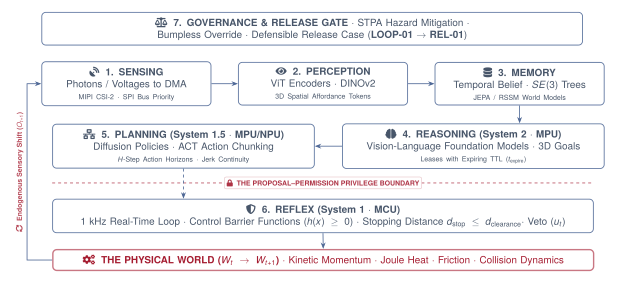

# The Physical AI Agent Workflow

{#fig-locator-ch03 width=100%}

::: {.callout-objective}
By the conclusion of this chapter, you will be able to:

1. **Formulate the Fundamental Tug-of-War:** Contrast the unbounded computational demands of semantic foundation models (tokens, context, diffusion steps) with the microsecond determinism demanded by Newtonian dynamics.
2. **Trace the End-to-End Agent Lifecycle:** Map a physical task from open-vocabulary prompt ingestion down through 3D affordance tokenization, latent world modeling, action chunking, real-time safety projection, motor PWM switching, and endogenous feedback.
3. **Deconstruct the Three Cadences of Intelligence:** Architect the multi-rate hierarchy decoupling slow semantic deliberation (System 2, $0.5\text{--}2\text{ Hz}$) from intermediate trajectory decoding (System 1.5, $20\text{--}50\text{ Hz}$) and bare-metal safety reflexes (System 1, $1000\text{ Hz}$).
4. **Apply the Three Architectural Peace Treaties:** Implement the Proposal–Permission split, Action Chunking delay amortization, and Expiring Intent Leases ($\mathcal{L}_{\text{intent}}$) to resolve the compute-vs-physics conflict.
5. **Map the Modular Blueprint for Parts 2 and 3:** Connect each station in the overarching agent workflow to its dedicated pipeline organ chapter (Chapters 4–8) and silicon placement chapter (Chapters 9–11).
6. **Freeze the Workflow Specification (`FLOW-01`):** Author the third formal specification of the Cumulative Design Dossier establishing inter-rate cadences, lease timeouts, and fallback state machines.
:::

::: {.callout-autopsy}
* **System:** Autonomous High-Speed Sorting Gantry (Linear Cartesian Actuator traveling at $1.5\text{ m/s}$).
* **Incident:** Carriage slammed into mechanical end-stop at full speed; stripped timing belt teeth and cracked linear guide bearing blocks ($1,400\text{ USD}$ repair).
* **Telemetry Snapshot:** The Vision-Language Model (VLM) running in user space encountered an unexpected multi-object clutter scene. Memory usage spiked, triggering the Linux kernel Out-Of-Memory (OOM) killer, which terminated the Python planning process at $T+14.200\text{ s}$.
* **Root Cause:** The system lacked a decoupled real-time supervisor. The motor gate driver remained latched in its last commanded forward torque state for $680\text{ ms}$ before power was manually severed.
* **Architectural Flaw:** Monolithic execution—slow, unconstrained AI software held direct electrical authority over motor inverters without a deterministic real-time watchdog to cut power upon host stall.
:::

::: {.callout-contract}
| Component | Authority and Substrate | Contract Specification |
| :--- | :--- | :--- |
| **What the MPU Proposes (System 2 / 1.5)** | *Untrusted · Stochastic · Linux MPU* | • Open-vocabulary intent lease: $\mathcal{L}_{\text{intent}}(t_{\text{expire}} \le 1000\text{ ms})$ • Action chunk trajectory: $H$ waypoints at $20\text{--}50\text{ Hz}$ • Monotonic heartbeat counter ($\tau_{\text{heartbeat}} \le 10\text{ ms}$) |
| **What the MCU Permits (System 1)** | *Trusted · Deterministic · Real-Time MCU* | • Audits proposal freshness: $\Delta t \le \tau_{\text{wall}}$ • Minimal-intervention barrier projection ($1000\text{ Hz}$) • Hardware watchdog timer ($\tau_{\text{watchdog}} = 20\text{ ms}$) |
| **Failure Escalation** | *MCU Hardware Reflex* | If heartbeat expires ($> 20\text{ ms}$) or intent lease lapses, immediately execute active Category 1 dynamic deceleration to zero velocity. |
:::

::: {.callout-note icon=false}
**The Sim-to-Real Delta:**
* **What Simulation Assumes:** The entire agent runs synchronously in a single Python thread (`obs = env.reset(); action = model(obs); env.step(action)`); compute takes zero real time; the environment pauses while the neural network thinks.
* **What the Bench Measures:** The physical world moves continuously while models compute; foundation models take $500\text{ ms}$ while motor loops demand $1\text{ ms}$; application processors suffer kernel panics and thread preemption mid-trajectory.
:::

---

## The Great Tug-of-War: Deliberation vs. Relentless Physics

Physical AI is not simply deep learning models connected to electric motors. Rather, Physical AI is the engineering discipline born from the violent collision of two worlds pulling with maximum force in **diametrically opposite directions**:

{#fig-great-tension width=100%}

### The Two Opposing Forces

1. **The AI and Deliberation Realm (The "Brain"):**
   * *What it craves:* Maximum expressive capacity, large parameter footprints ($7\text{B}\text{--}70\text{B}$ foundation models), multi-view spatial attention, deep token contexts, and iterative diffusion denoising ($10\text{--}100$ steps).
   * *Its temporal reality:* It thrives on having **time to deliberate**. In digital software, pausing an extra $200\text{ ms}$ to evaluate an autoregressive chain-of-thought prompt yields higher accuracy and better reasoning.
   * *Its battle cry:* *"Give me $500\text{ ms}$ to think for higher semantic intelligence!"*

2. **The Physical and Dynamics Realm (The "Body"):**
   * *What it craves:* Microsecond determinism, zero phase lag, and unyielding adherence to Newton's laws of motion.
   * *Its temporal reality:* **The universe does not wait for computation.** Gravity pulls downward at $9.8\text{ m/s}^2$ continuously. Kinetic momentum ($\mathbf{p} = m\mathbf{v}$) carries kilograms of mass forward along its trajectory. Information freshness decays instantly ($\sigma_{\text{pos}} = \sigma_0 + v\Delta t$). Motor stator coils demand microsecond PWM gate switching.
   * *Its battle cry:* *"Act in $1\text{ ms}$ or the mechanism collides!"*

### Why Monolithic Architectures Fail

If an engineer attempts to build a physical agent with a naive, monolithic architecture, the system collapses into one of two fatal failure modes:

* **Failure Mode A (The Stalled Brain):** Forcing the foundation model directly into the motor loop forces the control frequency down to $1\text{--}2\text{ Hz}$. During the $500\text{ ms}$ computation freeze, the machine moves blind, state uncertainty explodes past the Freshness Wall ($\Delta t_{\text{wall}}$), and the robot crashes violently.
* **Failure Mode B (The Blind Reflex):** Restricting the system exclusively to microsecond control loops eliminates latency, but strips away semantic intelligence. The machine cannot understand natural language instructions, parse novel object geometries, or adapt to unstructured, open-world environments.

Physical AI systems engineering is the discipline of **negotiating peace between these two opposing forces**.

---

## The Complete End-to-End Physical Agent Lifecycle

To understand how an autonomous agent resolves this tension in practice, we trace a complete task through its nine-stage lifecycle—from the arrival of an open-vocabulary human instruction down to physical torque on copper coils and endogenous sensory feedback:

{#fig-agent-workflow width=100%}

### The 9 Stations of the Agent Dataflow

| Lifecycle Station | Subsystem Function & Transform | Corresponding Curriculum Chapter |
| :--- | :--- | :--- |
| **1. Open-World Goal** | Ingests natural language instruction | Chapter 6 (*Semantic Deliberation*) |
| **2. Transduction** | Photons & IMU into DMA ring buffers | Chapter 4 (*Perception & Encoders*) |
| **3. 3D Perception** | Pixels $\to$ 3D Affordance Tokens ($SE(3)$) | Chapter 4 (*Perception & Encoders*) |
| **4. Latent World Model** | Filters noise, tracks coordinate trees | Chapter 5 (*World Models & State*) |
| **5. Intent Lease** | Emits bounded intent lease $\mathcal{L}_{\text{intent}}$ | Chapter 6 (*Semantic Deliberation*) |
| **6. Action Chunking** | Decodes $H$ future waypoints at 20–50 Hz | Chapter 7 (*Planning & Chunking*) |
| **7. Safety Reflex** | 1 kHz minimal-intervention CBF projection | Chapter 8 (*Real-Time Enforcement*) |
| **8. Physical Mutation** | PWM pulses coils; matter & momentum mutate | Chapter 1 & Chapter 11 (*Assurance*) |
| **9. Endogenous Loop** | Physical state $W_{t+1}$ emits observation | Whole-System Closed-Loop Synthesis |

1. **Station 1 (Open-World Goal Ingestion):** A human operator or high-level factory scheduler issues an open-vocabulary instruction: *"Unload the heated steel pin from the fixture and place it into the cooling bin."*
2. **Station 2 (Physical Transduction & Ingestion):** Photons reflect off the physical workpiece and integrate in CMOS photodiode wells ($t_{\text{transduce}} \approx 8\text{ ms}$). Hardware DMA engines stream raw Bayer image frames across the MIPI CSI-2 bus directly into shared system memory ($t_{\text{dma}} \approx 3\text{ ms}$) without CPU intervention.
3. **Station 3 (Perception & Spatial Tokenization):** An edge Vision Transformer (ViT) or DINOv2 backbone ingests the raw pixels, applies patch pruning, and lifts 2D visual features into metric 3D space using calibrated camera geometry. It outputs compact **3D spatial affordance tokens** ($SE(3)$ grasp approach vectors and obstacle bounding volumes).
4. **Station 4 (Latent World Model & State Estimation):** Rather than hallucinating expensive pixel predictions, a latent predictive world model (such as a Joint Embedding Predictive Architecture / JEPA) filters visual noise and updates the agent's internal belief state. It maintains coordinate frame trees and bounds spatial uncertainty ($\sigma_{\text{pos}}$).
5. **Station 5 (Semantic Deliberation & Intent Leases):** Running at a deliberate cadence ($1\text{ Hz}$), a multimodal Vision-Language Model (VLM) reasons over the 3D affordance tokens and language goal. It emits a time-bounded **Expiring Intent Lease** ($\mathcal{L}_{\text{intent}}$):
   $$\mathcal{L}_{\text{intent}} = \left\langle \mathbf{T}_{\text{target}} \in SE(3), \; \mathcal{B}_{\text{workspace}}, \; \dot{\mathbf{x}}_{\text{max}}, \; t_{\text{issue}}, \; \Delta t_{\text{TTL}} \right\rangle$$
   System 2 possesses zero electrical privilege over actuators; it only establishes the geometric goal and expiration deadline.
6. **Station 6 (Trajectory Decoding & Action Chunking):** An intermediate diffusion policy or Action Chunking with Transformers (ACT) decoder consumes the active intent lease and current proprioceptive joint angles. It predicts an action chunk of $H$ future waypoints in parallel, spanning $0.5\text{--}1.0\text{ seconds}$ of smooth motion.
7. **Station 7 (Real-Time Safety Reflex & Control Barrier Veto):** Running deterministically at $1000\text{ Hz}$ on a bare-metal microcontroller (MCU), the safety enforcer intercepts the proposed action chunk at the **Proposal–Permission Boundary**. It executes a minimal-intervention quadratic program (QP) to project candidate actions onto the forward-invariant safe set ($\mathcal{C}$), verifying joint jerk limits, thermal accumulators, and dynamic stopping clearances ($d_{\text{stop}} \le d_{\text{clearance}}$).
8. **Station 8 (Actuation & Physical Mutation):** Permitted torque commands $u_t$ are written to hardware timer registers, switching 3-phase inverter MOSFETs across the DC power bus. Current rises across stator coil inductance ($L/R$), generating magnetic flux that physically moves mechanical linkages:
   $$A_t \implies \text{Matter, Momentum, and Energy Mutate } (W_t \longrightarrow W_{t+1})$$
9. **Station 9 (Endogenous Sensory Feedback):** The displaced mechanism alters the physical environment into $W_{t+1}$, which directly generates the subsequent optical and proprioceptive observation stream $O_{t+1}$, closing the causal loop.

---

## The Three Cadences of Physical AI

To bridge the orders-of-magnitude temporal gap between semantic reasoning and motor physics, modern physical agents decouple execution into **Three Distinct Temporal Cadences**:

{#fig-three-cadences width=100%}

| Dimension | System 2: Semantic Intent | System 1.5: Action Chunking | System 1: Real-Time Reflex |
| :--- | :--- | :--- | :--- |
| **Operating Frequency** | $0.5\text{--}2\text{ Hz}$ ($500\text{--}2000\text{ ms}$) | $20\text{--}50\text{ Hz}$ ($20\text{--}50\text{ ms}$) | $1000\text{ Hz}$ ($1.0\text{ ms} \pm 5\,\mu\text{s}$) |
| **Silicon Substrate** | Multi-core MPU / Edge NPU / Cloud | Edge NPU / Application Processor | Bare-Metal Cortex-M / RISC-V MCU |
| **Operating System** | Embedded Linux (PREEMPT_RT) | Linux User Space / C++ TensorRT | Bare-Metal / FreeRTOS (No Dynamic Heap) |
| **Underlying Model** | Multimodal VLM ($7\text{B}\text{--}70\text{B}$ weights) | Diffusion Policy / ACT Transformer | Control Barrier Invariants / Watchdogs |
| **Output Artifact** | Expiring Intent Lease ($\mathcal{L}_{\text{intent}}$) | Horizon of $H$ future joint waypoints | Permitted motor gate PWM setpoints ($u_t$) |
| **Privilege Level** | **Untrusted Proposal Service** | **Candidate Trajectory Generator** | **Sole Electrical Permission Authority** |
| **Failure Response** | Lease expires; system holds position | Drops stale chunks; replans next horizon | Executes active Category 1 dynamic stop |

---

## Negotiating the Peace: The Three Architectural Contracts

How do these three asynchronous cadences cooperate without race conditions, thread starvation, or mechanical runaway? Physical AI systems rely on **Three Formal Architectural Contracts**:

### 1. The Proposal–Permission Privilege Split

The first and most fundamental architectural law is the absolute separation of proposal generation from execution permission:

$$\text{Untrusted Neural Proposals } p_t \quad \xrightarrow{\quad \text{Shared SRAM Mailbox} \quad} \quad \left[ \text{MCU Safety Enforcer} \right] \quad \xrightarrow{\quad \text{Permitted Current } u_t \quad} \quad \text{Inverter PWM}$$

* **The MPU is an Advisory Proposal Engine:** The high-capacity neural network running in Linux user space generates untrusted candidate proposals ($p_t$). It possesses zero physical routing to motor timer registers or gate drivers.
* **The MCU is the Trusted Gatekeeper:** A deterministic bare-metal microcontroller evaluates physical safety invariants at $1000\text{ Hz}$. It alone holds the electrical privilege to pulse motor inverters.

### 2. Action Chunking: Amortizing Inference Delay Across Time

In single-step Markovian policies, the robot must pause at every time-step $t$ to compute action $a_t$. If neural inference takes $30\text{ ms}$, the control frequency is capped at an unstable $33\text{ Hz}$.

**Action Chunking breaks this bottleneck.** Instead of predicting a single next action, the trajectory decoder predicts a temporal chunk of $H$ future waypoints:

$$\mathbf{A}_{t:t+H} = \pi_{\theta}(\mathbf{s}_t) = \left[ a_t, a_{t+1}, a_{t+2}, \dots, a_{t+H-1} \right]$$

While the real-time microcontroller smoothly interpolates and enforces safety across waypoints $a_t \dots a_{t+k}$, the neural accelerator computes the *next* action chunk in the background. Action chunking **amortizes the heavy computational cost of neural inference across continuous physical time**.

### 3. Expiring Intent Leases ($\mathcal{L}_{\text{intent}}$) and Hardware Watchdogs

To prevent mechanical runaway when the application processor panics, freezes, or encounters an Out-of-Memory stall, all authority is time-bounded:

1. **Semantic Intent Leases:** System 2 emits intents with a strict Time-to-Live (TTL) lease:
   $$\mathcal{L}_{\text{intent}} = \langle \text{Goal}, \; t_{\text{issue}}, \; \Delta t_{\text{TTL}} \rangle$$
   If the VLM freezes, $\Delta t_{\text{TTL}}$ lapses ($t > t_{\text{issue}} + \Delta t_{\text{TTL}}$). The trajectory generator automatically decelerates and enters a safe hover/hold state.
2. **Hardware Watchdog Heartbeats:** The Linux MPU must toggle a hardware heartbeat register every $\tau_{\text{heartbeat}} \le 10\text{ ms}$. If the Linux kernel panics or freezes, the hardware watchdog expires ($t > 20\text{ ms}$), triggering a non-maskable interrupt (NMI) on the MCU that immediately trips the motor gate-driver enable line (Safe Torque Off / STO).

---

## The Modular Blueprint: How the Rest of the Book Builds the Agent

With the complete agent workflow established, the entire structure of the book becomes a modular engineering build:

{#fig-modular-blueprint width=100%}

---

## Cumulative Design Dossier Checkpoint: Freezing `FLOW-01`

In Chapter 3, we freeze the formal **Workflow & Multi-Rate Lifecycle Charter (`FLOW-01`)** in the Cumulative Design Dossier:

### Temporal Cadence Contracts (`FLOW-01`)

| Subsystem Tier | Nominal Rate | Worst-Case Tail Budget | Lease TTL / Buffer Horizon | Fail-Safe Fallback Action |
| :--- | :--- | :--- | :--- | :--- |
| **System 2: Semantic Intent** | $1.0\text{ Hz}$ | Latency $\le 1000\text{ ms}$ | $\text{TTL} = 1500\text{ ms}$ | Hold position under closed-loop PD control |
| **System 1.5: Action Chunking** | $20.0\text{ Hz}$ | $P_{99} \le 45\text{ ms}$ | $H = 16$ steps ($800\text{ ms}$ window) | Receding-horizon temporal ensemble blending |
| **System 1: Real-Time Reflex** | $1000\text{ Hz}$ | Jitter $\le 15\,\mu\text{s}$ | $1.0\text{ ms}$ tick deadline | 1 kHz Control Barrier Function safety veto |

### Privilege Isolation Rules (`FLOW-01`)

| Rule ID | Architectural Requirement | Enforcement Mechanism |
| :--- | :--- | :--- |
| **`ISO-01-MEM`** | Zero shared dynamic heap memory across MPU and MCU | Pre-allocated static SRAM ring buffers with atomic sequence counters |
| **`ISO-02-GATE`** | Exclusive MCU ownership of inverter gate drivers | Hardware pin multiplexing and memory protection unit (MPU) locks |
| **`ISO-03-DOG`** | Hardware heartbeat watchdog interlock ($\tau \le 20\text{ ms}$) | Active Category 1 dynamic deceleration ($t_{\text{stop}} \le 15\text{ ms}$) $\to$ STO |

*(The complete, machine-readable YAML template for `FLOW-01` is maintained in @sec-dossier-templates).*

---

## Hands-On Bench Laboratory: `labs/03-agent-workflow`

::: {.callout-lab title="Lab 3: Tracing the Multi-Rate Agent Workflow on Silicon"}
* **Objective:** Deploy and trace the complete three-cadence agent lifecycle on the Arduino UNO Q dual-brain platform, verifying that the system survives intentional MPU user-space crashes.
* **Phase 1 (Multi-Rate Bringup):** Launch the System 2 VLM mock intent generator ($1\text{ Hz}$) and System 1.5 ACT trajectory decoder ($20\text{ Hz}$) on the Linux MPU. Stream action chunks into the shared SRAM ring buffer. Run the System 1 Control Barrier Function loop ($1000\text{ Hz}$) on the Cortex-M MCU.
* **Phase 2 (Lifecycle Instrumentation):** Use logic analyzer GPIO probes to record the concurrent timing waveforms of intent lease generation, action chunk unrolling, and 1 kHz MCU PWM permission updates.
* **Phase 3 (Fault Injection & Survival Test):** Trigger an artificial kernel panic and process SIGKILL (`kill -9`) on the Linux planning process mid-trajectory. Verify on the oscilloscope that the MCU detects the heartbeat timeout ($t > 20\text{ ms}$) and executes an active Category 1 dynamic deceleration halt without physical collision.
* **Dossier Milestone:** Freeze the validated `FLOW-01` charter in your project repository.
:::

---

## Summary & What Comes Next

In this chapter, we resolved the foundational conflict of Physical AI:

1. **The Great Tug-of-War:** Showed why semantic intelligence wants infinite deliberation time while Newtonian physics demands immediate deterministic action.
2. **The 9-Stage Lifecycle:** Traced how a task flows from open-vocabulary prompt ingestion down through 3D affordances, world models, intent leases, action chunks, barrier reflexes, motor PWM, and endogenous feedback ($W_t \to W_{t+1} \to O_{t+1}$).
3. **The Three Cadences:** Decoupled execution into System 2 ($1\text{ Hz}$ Intent), System 1.5 ($20\text{--}50\text{ Hz}$ Action Chunking), and System 1 ($1000\text{ Hz}$ Safety Reflex).
4. **The Three Peace Treaties:** Reconciled compute with physics through the Proposal–Permission split, Action Chunking delay amortization, and Expiring Intent Leases.
5. **The Modular Blueprint:** Established how Part 2 (Chapters 4–8) builds each organ in this workflow, and Part 3 (Chapters 9–11) places, governs, and verifies the complete system.

Now that the entire foundational triad of Part 1 is complete—**Physical Causality (Ch 1)**, **Time and Latency (Ch 2)**, and **The Agent Workflow (Ch 3)**—we enter **Part 2 (*The 7 Canonical Pipeline Organs*)**. 

In **Chapter 4 (*Perception and Spatial Encoders*)**, we begin building the first station in the pipeline: converting raw photon streams into metric 3D spatial affordance tokens without saturating the shared memory bus.
