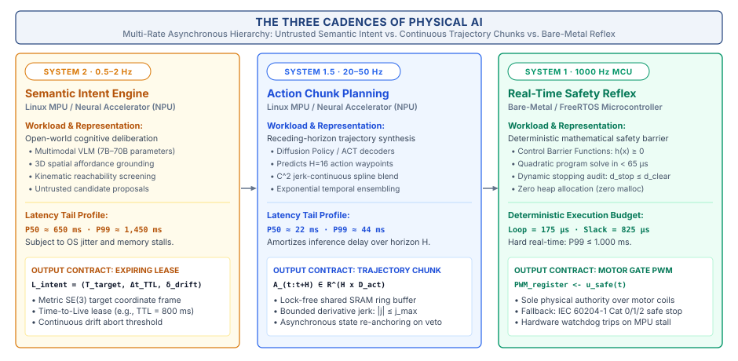
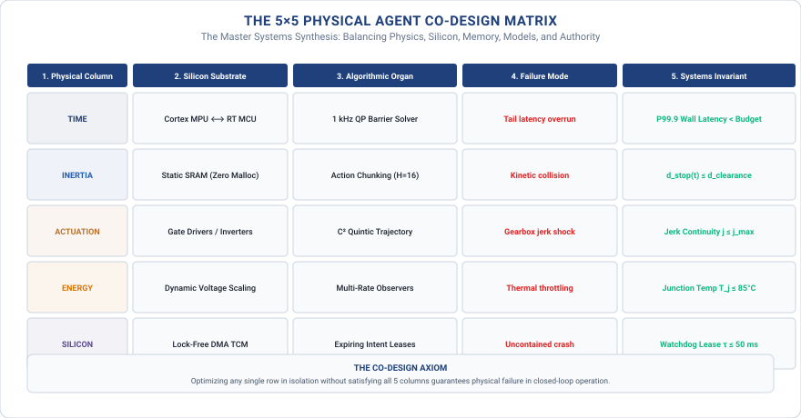

# Multi-Rate Systems Hierarchy\chaptersubtitle{Decoupling Cognitive Speeds Across Heterogeneous Silicon}

{#fig-locator-ch04 width=100% fig-pos="H"}

*How do we bridge the massive temporal gap between a slow, stochastic foundation model and a microsecond-deterministic motor reflex without crashing the machine?*

In classical computing, software is decoupled from physical time. If a foundation model stalls and its inference latency spikes from 200 milliseconds to 2 seconds, the digital universe patiently waits behind glass. A loading spinner appears, but nothing breaks. In Physical AI, however, time is an unyielding dynamical coordinate. While an algorithm deliberates in silicon, inertia carries moving linkages forward, gravity accelerates ungrounded masses, and sensory observations rapidly decay toward obsolescence. If your computational pipeline fails to deliver valid actuation commands before physical reality diverges from internal belief, the result is mechanical collision and structural failure.



::: {.callout-objective}
After studying this chapter, you will be able to:

1. **Quantify the Cadence Chasm:** Analyze the fundamental frequency mismatch between semantic deliberation ($0.5\text{--}2\text{ Hz}$), trajectory decoding ($20\text{--}50\text{ Hz}$), and reactive motor reflexes ($1000\text{ Hz}$).
2. **Dissect Cadence Failures:** Perform a forensic autopsy of the Tempe automated vehicle collision, tracing how classification jitter and software suppression delays consumed dynamic stopping margins.
3. **Partition Heterogeneous Silicon:** Map cognitive cadences across Application Processors (Linux MPUs), Neural Accelerators (Edge NPUs), and Real-Time Microcontrollers (Bare-Metal MCUs).
4. **Enforce the Proposal–Permission Boundary:** Separate unverified neural model proposals from deterministic hardware authority.
5. **Implement Expiring Intent Leases:** Author formal intent contracts ($\mathcal{L}_{\text{intent}}$) bounded by spatial validity hulls and hardware watchdog timers.
6. **Navigate the Master Co-Design Matrix:** Evaluate systems tensions across the 5×5 Physical Agent Co-Design Matrix to guide full-stack engineering.
7. **Architect Zero-Allocation Inter-Cadence IPC:** Design lock-free SRAM ring buffers using atomic sequence counters and zero dynamic heap allocation (`malloc = 0`).

**Core Chapter Takeaway:** Embodied intelligence cannot execute as a single monolithic software loop; it demands an asynchronous multi-rate hierarchy that decouples slow foundation models from deterministic, bare-metal safety reflexes across a strict Proposal–Permission boundary.
:::

## The Cadence Chasm: Why Single-Rate Software Fails in Physical Time

A physical agent interacting with the real world cannot operate on a single, uniform clock. The central dilemma of embodied intelligence is the vast disparity in required computational frequencies across the cognitive lifecycle:

1. **Semantic Deliberation ($0.5\text{--}2\text{ Hz}$):** Ingesting multi-camera video streams, running deep neural spatial backbones, and querying large vision-language models to interpret open-world goals.
2. **Trajectory Planning ($20\text{--}50\text{ Hz}$):** Generating continuous spatial waypoints, solving inverse kinematics, and blending multi-step action chunks into smooth reference paths.
3. **Actuator Execution ($1000\text{ Hz}$):** Modulating inverter gate pulses, measuring stator phase currents, and evaluating real-time kinematic safety envelopes every single millisecond.

The fundamental architectural error occurs when software engineers couple these disparate cadences into a single monolithic loop. When high-level deliberative software experiences an unexpected computational delay, garbage collection pause, or memory compaction stall, low-level motor commands stop arriving. In the physical world, inertia never pauses: moving mass continues coasting along its last commanded trajectory, rapidly obliterating dynamic safety margins.

## Anatomy of a Cadence Failure: The Tempe Desynchronization Crash

To understand why monolithic software execution fails on physical hardware, we examine the formal NTSB investigation of the March 2018 Uber ATG automated vehicle collision in Tempe, Arizona.

{#fig-tempe-testbed width=85%}

The vehicle was traveling at $43.5\text{ mph}$ ($19.4\text{ m/s}$) on an unlit road at night. The high-level perception system ingested sensor data at $10\text{ Hz}$ ($100\text{ ms}$ intervals). As the vehicle approached the pedestrian over a 5.6-second window, the deep neural perception model failed to maintain a stable semantic classification:

* At $T - 5.6\text{ s}$, the system detected an object and classified it as an *unknown vehicle*.
* At $T - 4.5\text{ s}$, the classifier flipped the label to *other / static obstacle*.
* At $T - 2.6\text{ s}$, the classifier flipped the label to *bicycle*.
* At $T - 1.5\text{ s}$, the classifier flipped the label back to *unknown object*.

Every time the neural classifier flipped the object's categorical label, the tracker treated the detection as an entirely new entity: it wiped the historical tracking buffer, discarded the accumulated velocity vector, and re-initialized the Kalman filter state from scratch. Because the tracker could never maintain continuous velocity history across label flips, it could not project the pedestrian's path across the vehicle's future travel corridor.

To compound the cadence failure, software engineers had introduced an artificial $1000\text{ ms}$ software delay to suppress emergency braking commands to prevent transient false-positive alarms. When collision was predicted at $T - 1.2\text{ s}$ ($d_{\text{clearance}} = 23.3\text{ m}$), the software withheld braking commands. At $v = 19.4\text{ m/s}$, the linear reaction travel consumed:

$$d_{\text{react}} = v \cdot \Delta t_{\text{suppression}} = 19.4\text{ m/s} \times 1.0\text{ s} = 19.4\text{ meters}$$

During this one-second blackout, the vehicle traveled $19.4\text{ meters}$ forward with zero deceleration. By the time the suppression timer expired, only $d_{\text{remaining}} = 23.3\text{ m} - 19.4\text{ m} = 3.9\text{ meters}$ of clearance remained. Even under maximum emergency braking ($a_{\text{max}} = 8.0\text{ m/s}^2$), bringing a two-ton vehicle to a complete stop required:

$$d_{\text{brake}} = \frac{v^2}{2 a_{\text{max}}} = \frac{(19.4\text{ m/s})^2}{2 \times 8.0\text{ m/s}^2} = 23.5\text{ meters}$$

Because the suppression delay had consumed nearly the entire available clearance, a catastrophic collision was physically inevitable.

| Timestamp | Subsystem & Substrate | Recorded State / Telemetry Event | Physical Implication |
| :--- | :--- | :--- | :--- |
| **$T - 5.6\text{ s}$** | 64-Beam LiDAR / Radar | Ingested at $82\text{ m}$ range; classified as `unknown_vehicle`; initial velocity $\hat{\mathbf{v}} = \mathbf{0}$. | Tracking initialized. |
| **$T - 4.5\text{ s}$** | Neural Classifier | Label flipped to `static_obstacle` ($67\text{ m}$ range); tracker wipes history. | Kalman velocity state buffer reset to zero. |
| **$T - 2.6\text{ s}$** | Vision Backbone | Label flipped to `bicycle` ($48\text{ m}$ range); tracking history re-initialized again. | Motion path projection across lane wiped. |
| **$T - 1.2\text{ s}$** | Planning / Autonomy Stack | Collision predicted ($d_{\text{clearance}} = 23.3\text{ m}$); software asserts $1000\text{ ms}$ suppression delay. | Braking commands withheld to prevent false alarms. |
| **$T - 0.2\text{ s}$** | Motion Planner | Suppression timer expires; emergency braking requested ($d_{\text{clearance}} = 3.9\text{ m}$). | Clearance ($3.9\text{ m}$) is far less than required braking distance ($d_{\text{brake}} = 23.5\text{ m}$). |
| **$T + 0.0\text{ s}$** | Vehicle Chassis / Actuators | Vehicle strikes pedestrian at $19.4\text{ m/s}$ ($43.5\text{ mph}$); impact occurs with zero automated braking. | Fatal collision. |
| **Root Cause** | *Perception & Cadence* | Classification thrashing repeatedly wiped tracking velocity buffers; $1000\text{ ms}$ suppression delay consumed dynamic stopping clearance. |
| **Architectural Flaw** | *Privilege & Co-Design* | Monolithic authority—safety braking was subordinate to stochastic neural classifications and software timers rather than an independent 1 kHz microcontroller evaluating $d_{\text{clearance}} \ge d_{\text{stop}}$. |

: **Flight-Recorder Telemetry Ledger: NTSB Incident Docket (Tempe Autonomous Collision).** Tracing high-level classification thrashing and software suppression delays to unmitigated physical impact. {#tbl-telemetry-ch04}

## Decoupling Cognitive Speeds: The Three Cadences of Physical AI

Physical AI resolves this fundamental systems tension by decoupling execution into Three Distinct Temporal Cadences spanning four orders of magnitude (@fig-three-cadences).

{#fig-three-cadences width=100%}

### System 2 (Slow Cadence · $0.5\text{--}2\text{ Hz}$): Semantic Deliberation
Operating at frequencies between $0.5\text{ Hz}$ and $2\text{ Hz}$ on multi-core Application Processors (Linux MPUs) and Cloud accelerators, System 2 executes large Vision-Language-Action foundation models ($7\text{B}\text{ to } 70\text{B}$ parameters). It occupies the untrusted advisory proposal privilege tier, emitting structured Expiring Intent Leases ($\mathcal{L}_{\text{intent}}$).

### System 1.5 (Medium Cadence · $20\text{--}50\text{ Hz}$): Trajectory Decoding
Operating at frequencies between $20\text{ Hz}$ and $50\text{ Hz}$ on dedicated Edge NPUs and real-time Linux threads (`PREEMPT_RT`, `mlockall`), System 1.5 converts active intent leases into continuous multi-waypoint action chunks via Action Chunking Transformers (ACT), Diffusion Policies, or Model Predictive Control (MPC).

### System 1 (Fast Cadence · $1000\text{ Hz}$): Real-Time Safety Reflex
Operating at a strict $1000\text{ Hz}$ loop on dedicated Real-Time Microcontrollers (ARM Cortex-M7 / lockstep RISC-V) in static SRAM (`malloc = 0`), System 1 evaluates Control Barrier Functions (CBF-QPs) and dynamic stopping distances ($d_{\text{stop}} \le d_{\text{clearance}}$), holding sole privilege over hardware inverter PWM lines.

| Cadence Tier | Cognitive Role | Target Frequency | Hardware Substrate | Software Runtime | Trust & Authority Level |
| :--- | :--- | :---: | :--- | :--- | :--- |
| **System 2** | Semantic Deliberation & Affordance Parsing | $0.5\text{--}2\text{ Hz}$ | Multi-core MPU / Cloud Accelerator | Linux (`PREEMPT_RT`) / Python / PyTorch | Untrusted (Advisory Intent Leases) |
| **System 1.5** | Trajectory Planning & Action Chunking | $20\text{--}50\text{ Hz}$ | Edge NPU / Tensor Core GPU | Real-time C++ / TensorRT / ONNX Runtime | Semi-trusted (Candidate Action Chunks) |
| **System 1** | Safety Barrier Reflex & FOC Commutation | $1000\text{ Hz}$ | Hard Real-Time MCU / Bare-metal Core | FreeRTOS / Zephyr (`malloc = 0`) | Trusted (Sole Inverter & Gate Privilege) |

: The Three Cadences of Physical AI. Dimension comparison across the asynchronous multi-rate temporal hierarchy. {#tbl-three-cadences}

## The Master Physical Agent Co-Design Matrix

We synthesize the foundational physical constraints from Chapter 2 (Time, Inertia, Actuation, Energy, and Silicon) with the five cognitive stages from Chapter 3 (Perceive, Remember, Reason, Plan, and Execute) to construct the master intellectual compass of this book: the 5×5 Physical Agent Co-Design Matrix (@fig-codesign-matrix).

{#fig-codesign-matrix width=100%}

| Cognitive Stage | Time & Freshness | Inertia & Mass | Actuation & Jerk | Energy & Thermals | Silicon & Interconnect |
| :--- | :--- | :--- | :--- | :--- | :--- |
| **Stage 1: Perceive** | Sensor exposure delay; isochronous PTP sync | Platform vibration jitter | Shutter skew mitigation | Sensor wattage budget | DMA bus crossbar contention |
| **Stage 2: Remember** | Covariance drift growth | Inertial frame propagation | Actuator non-linearities | SRAM retention power | Lock-free ring buffer contention |
| **Stage 3: Reason** | Asynchronous lease emission | Load reachability bounds | Torque envelope limits | NPU thermal throttling | KV-cache memory bandwidth |
| **Stage 4: Plan** | Real-time re-planning ($50\text{ Hz}$) | Non-linear Coriolis dynamics | Jerk rate clamping | Solver compute energy | Multi-core DSP/vector utilization |
| **Stage 5: Execute** | $1000\text{ Hz}$ zero-jitter deadlines | Impact energy absorption | Field-Oriented Control (FOC) | Inverter switching losses | Hard-real-time MCU determinism |

: Master 5x5 Physical Agent Co-Design Matrix. Systems tensions across the cognitive-physical spectrum. {#tbl-codesign-matrix-full}

## Chapter Summary and Forward Handoff to Part II

This chapter established the multi-rate execution architecture of Physical AI, decoupling slow semantic foundation models from microsecond motor reflexes across the Proposal–Permission boundary. With the physical constraints (Chapter 2), cognitive agency lifecycle (Chapter 3), and multi-rate execution hierarchy (Chapter 4) fully locked in, we now open **Part II (The Five Cognitive Organs)**, beginning with **Chapter 5 (Perception and Spatial Encoders)**.
