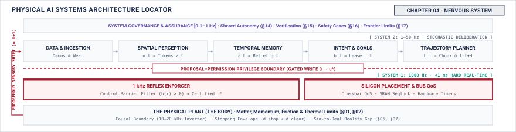

# Nervous System\chaptersubtitle{Who Is Allowed to Move the Motors} {#sec-nervous}

{#fig-locator-ch04 fig-pos="H" width=100%}

*Who is allowed to move the motors?*

A physical AI system is an uneasy coalition of fundamentally incompatible computational regimes. At the high level, foundation models and vision-language networks deliberate over abstract goals across seconds. At the intermediate level, trajectory generators and motion planners smooth spline waypoints at dozens of Hertz. At the lowest level, current regulators and safety tripwires execute deterministic control cycles every millisecond on bare metal. Connecting these asynchronous tiers into a single stable machine requires an explicit nervous system. The nervous system enforces rigid execution cadences, manages lock-free data exchanges across multi-rate boundaries, and maintains the exclusive privilege barrier that prevents unverified high-level software from directly commanding physical motor drive registers.



::: {.callout-objective}
After studying this chapter, you will be able to:

1. Derive the rate of each execution path from a physical property rather than choosing it.
2. State which component may write the registers that deliver energy, and justify the choice structurally.
3. List what would have to be true for two paths to be genuinely independent, and name what would falsify each.
4. Populate one row of the grid for a machine of your own and defend the squares that do not bind.

**Core Chapter Takeaway:** Authority over actuation is settled structurally, in hardware, and the rate each part runs at follows from physics rather than preference. The architecture arrives as the answer to @sec-body and @sec-brain, not as a premise.

:::

## Introduction {#sec-nervous-4-1}

<!-- SECTION 4.1 -->
<!-- claim: Given a body that will not wait and a brain that cannot be relied on, the nervous system is what makes one machine out of them. -->
<!-- covers: The reconciliation problem: bridging a deterministic physical plant that obeys mechanics (Chapter 2) with an unbounded, stochastic model that generates proposals (Chapter 3). -->
<!-- covers: Why the two irreducible architectural decisions in physical AI systems are execution rate selection and authority allocation. -->
<!-- covers: The nervous system defined: the deterministic hardware and software fabric that transports signals under physical deadlines and retains exclusive veto authority over actuators. -->
<!-- covers: Why procedural software discipline and cooperative multitasking fail under compute starvation, memory corruption, or soft lockups. -->
<!-- covers: Structural roadmap: deriving rates from mechanics, isolating hardware authority domains, handling boundary conditions (adversaries, fast policies, humans), and assembling the Part I synthesis grid. -->
<!-- GROUNDING: number — the two kinds of work, and the rate each one needs -->
<!-- FIGURE: A timeline comparing a deterministic 1 kHz physical plant deadline against a stochastic 5 to 20 Hz policy latency distribution with heavy-tailed jitter. -->

<!-- BEGIN -->
A physical plant obeys mechanics, not computation. In an analytical example of a robotic manipulator decelerating a $5.0\text{ kg}$ payload from a linear velocity of $1.5\text{ m/s}$, momentum and gravity enforce an unforgiving schedule. If the joint controllers miss their update deadline by even $10\text{ ms}$, the mechanical plant drifts outside its stable envelope, converting kinetic energy into destructive contact force against a fixture. The learned policy governing that manipulator operates under an entirely different regime. Built on deep neural networks with millions or billions of parameters, the model processes camera streams and tokenized goals, producing action proposals whose compute time varies with sequence length, memory bus contention, and thermal throttling. The physical plant demands absolute determinism at high frequency; the learned model delivers stochastic proposals at variable, low frequency. As highlighted in the system architecture locator (@fig-locator-ch04), a physical AI machine functions across three fundamentally distinct execution tiers spanning multiple orders of temporal magnitude on a single time axis. Given a body that will not wait and a brain that cannot be relied on, the **nervous system** is what makes one machine out of them.

Bridging this gap requires two fundamental architectural choices that define every physical AI system, which are execution rate selection and authority allocation. Execution rate selection determines how frequently each layer of the machine samples physical state and updates its output. A designer cannot pick these rates arbitrarily from software benchmarks. The physical dynamics of the actuators, the inertia of the linkages, and the bandwidth of the sensors dictate the lower bound on control frequencies, while compute capacity and memory bandwidth set the upper bound on policy evaluation. Authority allocation determines which component has the physical power to command the motors. If a learned model can write pulse-width modulation signals or target current setpoints directly to a motor driver, any numerical divergence, out-of-distribution visual input, or delayed inference becomes an uncontrolled physical trajectory. The architecture must partition who proposes motion from who permits it.

The necessity of this separation becomes visible in the timing mismatch between the two kinds of work. In an analytical example, consider a low-level actuator loop operating as a hard real-time cycle at $1000\text{ Hz}$, with a strict period of $1.0\text{ ms}$ to sample encoder positions, compute field-oriented currents, and update inverter switching states. If a single execution cycle slips to $1.2\text{ ms}$, the inverter misses its phase alignment, producing torque ripple, acoustic noise, or immediate loss of position hold. Meanwhile, a vision-based policy running on an onboard neural accelerator operates at a nominal target frequency of $10\text{ Hz}$, giving a nominal period of $100\text{ ms}$. Under realistic operating conditions, background memory management, kernel scheduling, and variable image processing introduce heavy-tailed jitter. While the mean inference latency may sit at $85\text{ ms}$, the $P_{99}$ latency extends to $220\text{ ms}$, and occasional $P_{99.9}$ stalls reach $450\text{ ms}$. If an autonomous ground vehicle travels at a forward velocity of $2.0\text{ m/s}$, a $450\text{ ms}$ inference stall means the vehicle covers a distance of $\Delta x = 2.0\text{ m/s} \times 0.45\text{ s} = 0.90\text{ m}$ without an updated motion plan. A machine that couples raw actuator output directly to model evaluation moves nearly a meter blind before the brain issues its next proposal.

The **nervous system** is the deterministic hardware and software fabric that transports signals under physical deadlines and retains exclusive veto authority over actuators. It sits between the stochastic compute engines running learned inference and the physical power electronics driving the motors. Rather than executing learned models itself, the nervous system provides the predictable infrastructure that samples sensors, validates proposed trajectories against kinematic and dynamic limits, interpolates coarse action chunks into high-frequency setpoints, and commands mechanical brakes when bounds are exceeded. It translates the slow, variable plans generated by the brain into the continuous, bounded currents required by the body.

Engineers frequently attempt to manage this arbitration through procedural software discipline, relying on cooperative multitasking, thread priorities, or shared memory conventions within a single operating system. This approach fails because it assumes that software bugs, memory exhaustion, and hardware faults respect logical priority flags. When an inference runtime exhausts unified memory, triggers an operating system memory manager purge, or enters a kernel spinlock during a device driver fault, high-priority software threads sharing that processor or memory bus stall alongside the model. If safety enforcement depends on the same memory bus or kernel scheduler as the vision pipeline, a soft lockup in the model runtime disables the safety monitor at the exact moment an unvalidated action is in flight. Protection cannot be an agreement between software libraries. It requires isolated hardware execution domains and physical interlocks that operate regardless of whether the central processor is healthy, thrashing, or completely hung.

Designing this architecture requires deriving execution rates directly from mechanical dynamics, isolating hardware authority domains, and establishing deterministic boundaries for fast reflex policies, adversarial inputs, and human override channels. When these boundaries are drawn correctly, the system preserves the generalization of learned policies without compromising the physical determinism of hard real-time control. The structural foundation of the machine rests on recognizing that slow, stochastic deliberation and fast, deterministic enforcement are fundamentally incompatible computational tasks that cannot share a single execution path.

::: {.callout-definition}
## Core Physical AI Definitions: The Nervous System

- **Deterministic Nervous System Enforcer**: The cycle-deterministic, hardware-isolated execution substrate (bare-metal microcontroller, FPGA, or dedicated real-time core) that retains exclusive write privilege over actuator power electronics, evaluating physical safety invariants (kinematic boundaries, jerk limits, thermal budgets) and clamping or overriding untrusted policy proposals in hard real time ($\ge 1000\text{ Hz}$).
- **Multi-Rate Execution Cadence**: The hierarchical scheduling architecture that executes perception, learned deliberation, motion interpolation, and motor commutation across decoupled temporal tiers ($1\text{ Hz}$ to $20\text{ kHz}$) derived directly from physical time constants ($\tau_e = L/R$, exposure times, mechanical resonance) rather than computational convenience.
- **Lock-Free Seqlock Buffer**: A single-producer single-consumer (SPSC) shared memory synchronization mechanism governed by an atomic sequence counter that allows high-rate real-time consumers to latch the freshest deliberate policy waypoints in bounded time ($< 1.5\ \mu\text{s}$) without acquiring mutex locks or risking priority inversion.
- **Worst-Case Execution Time (WCET)**: The provable, analytical upper bound on the time required to execute a software routine on a specific silicon substrate under worst-case hardware interference, cache eviction, bus contention, and blocking, satisfying $R = C + B + I \le D$ for hard real-time deadline guarantees.
:::
<!-- END -->

## Two Kinds of Work in One Machine {#sec-nervous-4-2}

<!-- SECTION 4.2 -->
<!-- claim: Deliberation is slow and unpredictable, enforcement must be fast and predictable, and no single path can be both. -->
<!-- covers: The profile of deliberate work: variable runtime, deep compute graphs, gigabyte-scale memory footprints, soft failure modes, and batch-oriented parallel hardware. -->
<!-- covers: The profile of reactive work: bounded execution cycles on microsecond budgets, fixed memory footprints, zero runtime allocations, hard real-time deadlines, and cycle-counted processors. -->
<!-- covers: Why general-purpose OS schedulers and preemptible kernels fail to convert deliberate hardware into hard real-time controllers. -->
<!-- covers: Hardware floor differences: GPU/NPU memory hierarchies and PCIe DMA latencies versus bare-metal MCU and FPGA register-mapped I/O. -->
<!-- covers: The dual-processor imperative: proving why deliberate and reactive execution paths cannot safely share a single compute core, cache hierarchy, or memory bus. -->
<!-- GROUNDING: number — what each kind of work requires, in cycles and in predictability -->
<!-- FIGURE: Side-by-side execution trace contrasting stochastic deliberation with heavy tail latency against a deterministic cycle-counted inner loop. -->
<!-- DERIVE: The probability of missing a hard physical deadline as a function of inference runtime variance under log-normal compute distributions. -->

<!-- BEGIN -->
The computational workload of a physical AI machine divides cleanly into two regimes with opposing requirements. The first regime is deliberation, where learned models evaluate sensory context, infer environmental state, and propose future action plans. The second regime is reactive enforcement, where deterministic control logic samples joints, validates kinematic limits, interpolates motion commands, and regulates electrical currents to the motors. These two regimes differ not by degrees of priority, but in their fundamental mathematical profiles, hardware architectures, and tolerance for temporal error.

Deliberate work is defined by deep computational graphs, large memory footprints, and variable execution times. A vision-language-action model processing video frames, tactile history, and tokenized prompts requires billions of multiply-accumulate operations across hundreds of neural network layers. Storing the parameters and intermediate activation tensors demands gigabytes of high-bandwidth memory. To achieve acceptable arithmetic throughput, deliberate computation executes on massively parallel accelerators such as graphics processing units or dedicated neural processing units. These processors maximize aggregate throughput across wide vector registers and batched memory pipelines at the direct expense of deterministic latency. Memory access stalls, dynamic tensor kernel selection, PCIe bus transfers, and runtime memory management cause the execution time of consecutive inferences to vary across a wide distribution. If a deliberate model experiences a temporary delay, the failure mode is soft, resulting in a delayed proposal or a stale trajectory that can be held or discarded without immediate hardware damage.

Reactive work operates under the inverse constraints. An inner control loop computing inverse dynamics, joint limit monitoring, or field-oriented motor control requires a few thousand arithmetic operations per update. Its memory footprint is static, measured in kilobytes rather than gigabytes, with every variable allocated at compile time to eliminate heap fragmentation and runtime garbage collection. Reactive routines execute on cycle-counted microcontrollers or field-programmable gate arrays designed for bounded execution rather than maximum parallel throughput. The deadlines governing this work are hard real-time constraints dictated by the mechanical inertia and electrical inductance of the physical system, typically running at rates between $1000\text{ Hz}$ and $10000\text{ Hz}$ on update budgets of $100\text{ }\mu\text{s}$ to $1000\text{ }\mu\text{s}$. If a reactive loop misses its execution deadline, the failure mode is hard, resulting in lost current control, destabilizing torque ripple, or a physical collision before the next command can execute.

Because learned inference runtimes depend on memory access patterns, cache residency, and dynamic dispatch, their execution times are stochastic. Consider an analytical example where an inference pipeline runs on a dedicated accelerator with an execution time $T_{\text{inf}}$ modeled by a log-normal distribution, where the natural logarithm of latency follows $\mathcal{N}(\mu_{\ln}, \sigma_{\ln}^2)$. Suppose the nominal median runtime is $m = 50\text{ ms}$, corresponding to $\mu_{\ln} = \ln(50) \approx 3.912$, with a log-scale standard deviation $\sigma_{\ln} = 0.35$, and the deliberate loop is assigned a fixed execution deadline of $T_{\text{deadline}} = 100\text{ ms}$ at $10\text{ Hz}$. The probability of an inference exceeding this deadline is given by the complementary cumulative distribution function, $P(T_{\text{inf}} > T_{\text{deadline}}) = 1 - \Phi\left((\ln(100) - \mu_{\ln}) / \sigma_{\ln}\right)$. Evaluating the standard normal variable yields $z = (4.605 - 3.912) / 0.35 \approx 1.98$, giving an overrun probability of approximately $0.0238$, or $2.38\%$. At an operating rate of $10\text{ Hz}$, the system attempts $36000$ planning cycles per hour, producing an expected $857$ deadline violations every hour. Even if accelerator hardware delivers an average latency well below the deadline, heavy-tail variance guarantees frequent misses. While a $P_{99}$ latency of $88\text{ ms}$ appears acceptable under standard software benchmarks, the $P_{99.9}$ tail extends to $132\text{ ms}$, creating intervals where the motor actuators receive no updated commands unless an independent, deterministic process bridges the gap.

General-purpose operating systems and real-time kernel patches cannot reconcile these two execution profiles on a shared processor. Although real-time extensions allow static task priorities and preemptible kernels, they cannot eliminate shared microarchitectural resources. When a low-priority thread executing a learned model streams gigabytes of weight matrices across the memory bus, it evicts cache lines belonging to high-priority control tasks. If the deliberate runtime triggers a translation lookaside buffer shootdown, enters a driver-level spinlock, or saturates the memory bus arbiter with direct memory access requests, the hardware pipeline stalls.[^dma_coherence_errata] A high-priority real-time interrupt can preempt software execution, but it cannot preempt a hardware memory transaction already occupying the bus. The resulting jitter ranges from tens of microseconds to several milliseconds, easily exceeding the entire time budget of a $1000\text{ Hz}$ control loop.

The hardware floor exposes this physical separation at the interface boundary. A host processor running an accelerator communicates across high-latency bus topologies such as PCIe, where direct memory access transfers require ring-buffer synchronization, host interrupt service routines, and cache coherency handshakes that consume $10\text{ }\mu\text{s}$ to $100\text{ }\mu\text{s}$ per transaction. In contrast, an embedded microcontroller or FPGA interfaces directly with sensor transceivers and motor gate drivers through memory-mapped registers, single-cycle input and output pins, and tightly coupled static memory with zero wait states. Reading an absolute joint encoder over a serial peripheral interface takes less than $1\text{ }\mu\text{s}$ of bounded execution time, completely isolated from system bus contention.

These physical realities enforce a strict dual-processor design requirement. Deliberate planning and reactive enforcement cannot safely share a processor core, a cache hierarchy, or a common memory bus. The slow, stochastic path requires parallel hardware optimized for raw throughput across wide data streams, while the fast, deterministic path requires isolated hardware optimized for worst-case execution time and cycle-counted predictability. Separating these paths into dedicated hardware domains converts safety enforcement from a software scheduling policy into a physical architectural boundary.
<!-- END -->

## Multiple Rates in One System {#sec-nervous-4-3}

<!-- SECTION 4.3 -->
<!-- claim: Each rate is set by a physical property, and only one of them has an origin that is not negotiable. -->
<!-- covers: Deriving the inner loop rate (100 to 1000 Hz): dictated by mechanical resonance, sensor bandwidth, and actuator electrical time constants $\tau = L/R$. -->
<!-- covers: Deriving the perception rate (10 to 100 Hz): dictated by sensor integration times, camera exposure windows, and target velocity relative to sensor field of view. -->
<!-- covers: Deriving the planning rate (1 to 10 Hz): dictated by the environmental state change horizon and available compute energy budgets. -->
<!-- covers: Asynchronous data exchange across rate boundaries: lock-free single-producer single-consumer (SPSC) ring buffers, double-buffering, and atomic sequence counters without blocking either producer or consumer. -->
<!-- covers: Failure modes of rate mismatches: phase lag accumulation eroding control stability margins, aliasing, and buffer starvation or overflow. -->
<!-- covers: State this as an imported result rather than a derived one: name the source, the assumptions under which it holds, how this machine establishes that those assumptions hold, and what the machine does at the moment they stop holding. -->
<!-- GROUNDING: number — each rate derived from a physical property, not chosen -->
<!-- FIGURE: Multi-rate execution timeline showing asynchronous, non-blocking zero-copy handoffs across three rate tiers using atomic latching. -->
<!-- DERIVE: The maximum permissible loop latency as a function of plant time constant $\tau$ before phase margin drops below stability thresholds. -->

<!-- BEGIN -->
The physical separation of compute domains reflects a constraint in which no single execution frequency satisfies both the mechanics of the plant and the computational requirements of perception and learned inference. A physical AI nervous system operates across three distinct rate tiers, each determined by a different physical process. The fast inner loop runs between $100\text{ Hz}$ and $1000\text{ Hz}$, the perception pipeline processes incoming sensor streams between $10\text{ Hz}$ and $100\text{ Hz}$, and the deliberate planner updates action targets between $1\text{ Hz}$ and $10\text{ Hz}$. Among these tiers, only the fastest rate has an origin that is non-negotiable.

The inner loop rate is governed by the physical time constants of the actuator and the structural resonance of the machine. In an electromagnetic actuator, winding inductance $L$ and phase resistance $R$ define the electrical time constant $\tau_e = L/R$. As an analytical example, consider a brushless permanent magnet motor with phase resistance $R = 0.60\text{ }\Omega$ and winding inductance $L = 120\text{ }\mu\text{H}$. The electrical time constant is $\tau_e = 120\text{ }\mu\text{H} / 0.60\text{ }\Omega = 0.20\text{ ms}$. Regulating current requires sampling phase currents and updating pulse-width modulation duty cycles before winding current drifts beyond acceptable control tolerances, setting an execution interval of $T_s \le 1.0\text{ ms}$ ($1000\text{ Hz}$). At the joint level, the mechanical time constant $\tau_m$ and structural stiffness dictate the required closed-loop bandwidth. Sampled-data control theory [@astrom1997computer] establishes that a discrete sample-and-hold loop introduces an effective phase delay of $\Delta \phi \approx \omega (T_s / 2 + T_d)$, where $T_s$ is the sampling interval and $T_d$ is the computation latency.[^zoh_phase_derivation] If a joint with a target closed-loop crossover frequency of $\omega_c = 100\text{ rad/s}$ experiences a cumulative loop latency of $T_s + T_d = 5.0\text{ ms}$, the sampling process injects $\Delta \phi = 100\text{ rad/s} \times 0.0050\text{ s} = 0.50\text{ rad} \approx 28.6^\circ$ of phase lag. This phase lag directly erodes the phase margin of the feedback controller, driving the mechanical assembly toward resonance or uncontrolled oscillations when loop execution slows below $500\text{ Hz}$.

The perception tier executes at an intermediate rate dictated by photon collection physics, exposure windows, and target velocity relative to the sensor field of view. An optical image sensor operating under typical indoor illumination ($300\text{ lux}$) requires an integration window of $10\text{ ms}$ to $30\text{ ms}$ to accumulate sufficient charge on each pixel without amplifying thermal read noise. If a manipulator end-effector moves at $1.5\text{ m/s}$, an exposure time of $15\text{ ms}$ causes an edge feature to blur across $\Delta x = 1.5\text{ m/s} \times 0.015\text{ s} = 22.5\text{ mm}$ on the image plane. Increasing the frame rate beyond $60\text{ Hz}$ or $100\text{ Hz}$ provides diminishing returns because the physical shutter cannot shorten without inducing underexposure, while reducing the frame rate below $10\text{ Hz}$ allows moving objects to traverse tens of centimeters between frames, breaking visual tracking associations. The rate of the perception pipeline is bounded from above by photon flux and from below by spatial displacement across consecutive frames.

The slowest tier, the deliberate planner, runs between $1\text{ Hz}$ and $10\text{ Hz}$ based on the macroscopic horizon of environmental change and the thermal limits of onboard compute. A vision-language-action policy evaluates hundreds of millions of parameters, consuming tens of joules of electrical energy per inference step. The external environment, including walking pedestrians, opening doors, and adjacent mobile machines, changes over intervals of $200\text{ ms}$ to $1000\text{ ms}$. Evaluating a learned policy at $5\text{ Hz}$ ($200\text{ ms}$ period) matches this environmental evolution rate while maintaining accelerator dissipation within an embedded power envelope of $30\text{ W}$. Increasing the policy evaluation rate to $100\text{ Hz}$ would demand twenty times the electrical power while producing near-identical action proposals over an external scene that has barely altered.

Because these three tiers execute on isolated hardware domains at different frequencies, data exchange across rate boundaries must be asynchronous, non-blocking, and zero-copy (@fig-04-multirate-cadence-buffer). If a $1000\text{ Hz}$ control loop waits on a lock held by a $5\text{ Hz}$ neural network runtime, the real-time deadline is immediately missed. As illustrated in the multi-rate execution timeline and lock-free exchange protocol (@fig-04-multirate-cadence-buffer), the nervous system bridges these boundaries using lock-free **single-producer single-consumer** (SPSC) triple buffers governed by atomic sequence counters. When the deliberate planner finishes computing a batch of future trajectory waypoints, it writes the payload into an inactive memory buffer and increments a 64-bit atomic sequence counter. The real-time control loop latches the newest published waypoints by verifying that the atomic sequence counter remained even and unchanged before and after the read operation. If the counter changes during reading, which indicates an in-progress write, the controller rejects the partial frame and continues executing its active local spline. Neither producer nor consumer ever stalls waiting for the other.

![**Multi-Rate Execution Cadence and Lock-Free Triple-Buffer Memory Exchange.** (a) Execution timeline across three heterogeneous rate tiers: stochastic VLA policy deliberation on the Linux MPU/NPU ($50\text{ Hz}$, $T=20\text{ ms}$, variable inference $T_{\text{inf}} \sim \text{LogNormal}$ with occasional tail overruns), optical perception and state tokenization ($50-100\text{ Hz}$, $10\text{ ms}$ sensor exposure), and deterministic real-time reflex control on the bare-metal MCU ($1000\text{ Hz}$, $T_s=1.0\text{ ms}$). Inset breakdown shows microsecond-scale slot budgeting ($C \le 240\ \mu\text{s} \ll D = 1000\ \mu\text{s}$) with a $760\ \mu\text{s}$ safety jitter margin. (b) Single-producer single-consumer (SPSC) seqlock triple-buffering memory architecture. The producer MPU writes new action chunks ($H=16$ steps) into an inactive buffer with an odd sequence counter ($c_{\text{seq}} = 2k+1$) and commits via an atomic store of an even counter ($c_{\text{seq}} = 2k+2$). The real-time MCU latches the newest committed buffer in $<1.5\ \mu\text{s}$ without holding mutexes or risking priority inversion, safely falling back to local spline extrapolation or watchdog-driven emergency braking ($T_{\text{wd}} \le 87.6\text{ ms}$) upon buffer starvation.](figures/fig04_multirate_cadence_buffer.svg){#fig-04-multirate-cadence-buffer fig-pos="H" width=100%}

Rate mismatches introduce three failure modes, comprising phase lag accumulation, aliasing, and buffer starvation. Directly applying a planner setpoint across multiple inner loop cycles creates a zero-order hold delay of $T_{plan}/2$. At a $5\text{ Hz}$ planning rate, this delay amounts to $100\text{ ms}$ of uncompensated lag, degrading control margins if applied without local interpolation. The inner loop avoids this by evaluating local continuous splines between waypoints. Aliasing occurs when high-frequency sensor noise folds into low-rate estimators, which the system prevents through analog filtering and digital decimation within the high-rate domain. Following classical nonlinear control results [@slotine1991applied], stability guarantees hold under the assumption that inner-loop execution jitter remains bounded within a narrow fraction of the sampling period and that setpoint updates arrive before the local trajectory buffer drains. The nervous system establishes these assumptions by enforcing cycle-deterministic interrupt timing on the microcontroller and tracking buffer depth. If the planner stalls and the buffer drains to its final valid waypoint, the operational assumption no longer holds. At that moment, the nervous system rejects further planner inputs and executes an autonomous, deterministic stopping trajectory computed locally at $1000\text{ Hz}$, bringing all joints safely to rest.

The operational characteristics, physical time constants, hardware allocation, and failure protocols governing each tier across this multi-rate hierarchy are formalized in @tbl-04-cadence-hierarchy.

| Execution Tier & Frequency | Nominal Period ($T$) | Max Jitter Budget ($\Delta T_{\max}$) | Hardware & Compute Domain | Payload & State Representation | Inter-Tier Transport Contract | Overrun & Failure Protocol |
|:---|:---|:---|:---|:---|:---|:---|
| **Reflex & Safety** ($\ge 1000\text{ Hz}$) | $T \le 1.0\text{ ms}$ ($50\text{ }\mu\text{s}$ at $20\text{ kHz}$) | $\Delta T_{\max} < 10\text{ }\mu\text{s}$ (hard real-time) | Bare-metal MCU (Cortex-M7/R5) or FPGA fabric | Phase currents, encoder ticks, PWM duty cycles, emergency clamp flags | Single-cycle MMIO registers, tightly-coupled memory (TCM) | Immediate low-side MOSFET phase short (dynamic braking) or brake drop |
| **Motion & Tracking** ($100\text{--}500\text{ Hz}$) | $T = 2.0\text{--}10.0\text{ ms}$ | $\Delta T_{\max} \le 200\text{ }\mu\text{s}$ (firm real-time) | Real-time RTOS / RT-Linux (`PREEMPT_RT`) core | Continuous polynomial splines, $SE(3)$ wrenches, feedforward torques | Lock-free SPSC circular ring buffer with atomic pointers | Local spline extrapolation ($50\text{ ms}$ horizon); controlled deceleration |
| **Planning & Policy** ($10\text{--}50\text{ Hz}$) | $T = 20.0\text{--}100.0\text{ ms}$ | $\Delta T_{\max} \le 15\text{ ms}$ ($P_{99}$ tail bound) | Edge tensor accelerator (NPU / GPU), host SoC | Action chunks ($K$-step horizon waypoints), visual embeddings | Double-buffered shared memory with 64-bit sequence counters | Expiration of intent lease ($T_{\text{lease}} \le 87.6\text{ ms}$) revokes proposal |
| **Reasoning & Deliberation** ($0.5\text{--}2\text{ Hz}$) | $T = 500\text{--}2000\text{ ms}$ | Asynchronous ($\Delta T > 500\text{ ms}$) | Multi-core host CPU, workstation, cloud VLA coprocessor | Semantic task goals, topological sub-graphs, natural language tokens | Asynchronous inter-process messaging (gRPC / zero-copy DDS) | Planner pauses; local motion layer retains stationary impedance hold |
: **Multi-Rate Cadence Hierarchy of Physical AI Execution.** Formal specification of execution tiers, physical time constants, jitter tolerances, hardware substrates, memory transport contracts, and deterministic failure protocols. The hierarchy bridges four orders of temporal magnitude, deriving update rates directly from actuator electrical time constants ($\tau_e = L/R$), mechanical phase margins ($\Delta \phi \approx \omega(T_s/2 + T_d)$), optical exposure windows, and thermal compute dissipation limits. Hard real-time reflexes at $\ge 1000\text{ Hz}$ execute in bare-metal silicon with sub-microsecond determinism to prevent hardware damage, while stochastic high-level models at $1\text{--}10\text{ Hz}$ generate candidate action proposals across lock-free atomic buffers under explicit intent leases. {#tbl-04-cadence-hierarchy}

<!-- END -->

## Timing Guarantees in Silicon {#sec-nervous-4-4}

<!-- SECTION 4.4 -->
<!-- claim: A processor promises far less about timing than most software assumes, and the gap is where deadlines are missed. -->
<!-- covers: Separate an observed latency percentile from a hard timing guarantee, which requires a bound on every execution, blocking, and interference term. -->
<!-- covers: Express the timing condition as worst-case execution plus blocking and interference no greater than the deadline. -->
<!-- covers: Measure the same workload unloaded and under representative memory, I/O, accelerator, and thermal contention. -->
<!-- covers: Classify each source of variation as bounded, experimentally characterized, or presently unbounded. -->
<!-- covers: Correct the allocation claim: unbounded dynamic allocation is incompatible with a hard path, while a bounded allocator can be included if its worst case is known. -->
<!-- covers: Name deadline overrun as the failure and an independent timestamp or deadline monitor as the detector. -->
<!-- GROUNDING: number — measured jitter, loaded and unloaded, against a deadline -->
<!-- FIGURE: Loaded and unloaded complementary latency distributions must show the deadline crossing while clearly distinguishing empirical observations from a proved bound. -->
<!-- DERIVE: Derive which guarantee is available by composing the bounded execution, blocking, and interference terms; do not infer a hard guarantee from a finite latency sample. -->

<!-- BEGIN -->
A processor promises far less about timing than most software assumes, and the gap between an observed latency distribution and a structural guarantee is where deadlines are missed. In statistical performance analysis, an engineer measures ten million executions of a task, notes that the ninety-ninth percentile $P_{99}$ latency is $135\text{ }\mu\text{s}$ and the maximum observed latency $P_{\max}$ is $150\text{ }\mu\text{s}$, and infers that the computation fits comfortably inside a $1.0\text{ ms}$ control deadline. That inference is invalid. An empirical distribution is a record of what happened under a finite sequence of test conditions, whereas a hard real-time guarantee is a proof of what can happen under all legal states of the hardware. When an execution platform includes out-of-order pipelines, shared memory hierarchies, speculative prefetchers, and concurrent direct memory access traffic, a finite latency sample cannot establish an upper bound. The missing tail events do not vanish; they simply wait for the rare hardware collision that triggers them in production.

Establishing a deterministic timing guarantee requires bounding every term that contributes to task response time. For a periodic workload with period $T$ and relative deadline $D \le T$, the worst-case response time $R$ comprises three distinct components:
$$R = C + B + I \le D$$
where $C$ is the **worst-case execution time** of the computation in isolation, $B$ is the maximum blocking duration incurred while waiting for shared resources held by lower-priority tasks, and $I$ is the cumulative interference from higher-priority tasks, hardware interrupt handlers, bus arbitration delays, and memory access contention. If any one of these three terms lacks a provable upper bound, the response time $R$ is unbounded and the system possesses no timing guarantee, regardless of how small the mean latency appears in bench benchmarks.

To see how unanalyzed interference breaks an empirical guarantee, consider an analytical example of a robotic torque computation running at $1000\text{ Hz}$ with a hard deadline $D = 1000\text{ }\mu\text{s}$. On an isolated $2.0\text{ GHz}$ application processor with empty bus queues and hot caches, the workload exhibits an unloaded baseline execution time of $C = 120\text{ }\mu\text{s}$. Across millions of undisturbed bench cycles, the measured tail latency never exceeds $P_{99.99} = 150\text{ }\mu\text{s}$, leaving an apparent safety margin of $850\text{ }\mu\text{s}$.

When the same binary runs on an integrated system-on-chip amidst normal machine activity, the operating environment introduces contention across shared silicon resources. High-resolution camera streams transfer image frames via direct memory access at $1.2\text{ GB/s}$, an onboard neural network accelerator reads weight matrices in large bursts from shared memory, and ambient thermal buildup causes the dynamic voltage and frequency scaling governor to drop core clock frequency from $2.0\text{ GHz}$ to $1.2\text{ GHz}$. The core slowdown expands the base compute time by a factor of $2.0 / 1.2 = 1.67$, raising execution to $C = 200\text{ }\mu\text{s}$. Concurrent bus traffic invalidates cache lines and stalls load instructions at the memory crossbar, introducing $I_{\text{bus}} = 750\text{ }\mu\text{s}$ of memory interference, while unmasked device driver interrupts and lock contention add $B = 180\text{ }\mu\text{s}$ of blocking. Summing these terms yields a total response time of $R = 200\text{ }\mu\text{s} + 180\text{ }\mu\text{s} + 750\text{ }\mu\text{s} = 1130\text{ }\mu\text{s}$. The task crosses the $1000\text{ }\mu\text{s}$ deadline by $130\text{ }\mu\text{s}$, not because the algorithmic complexity grew, but because shared silicon resources lacked isolation.

Taming this latency spread requires classifying every source of execution variance into one of three structural categories. The first category contains bounded sources, including fixed-pipeline instruction latencies, static branch decisions, round-robin bus arbitration, and deterministic interrupt dispatch on dedicated microcontrollers, all of which can be modeled with analytical upper bounds. The second category consists of experimentally characterized sources, such as shared last-level cache misses, write-buffer stalls, dynamic DRAM refresh intervals, and thermal throttling envelopes. These mechanisms exhibit bounded maximum latencies under strict hardware configuration, but their bounds are established through exhaustive stress profiling rather than algebraic proofs. The third category contains unbounded sources, including demand-paged virtual memory, preemptive operating system scheduling without priority inheritance,[^pathfinder_priority_inversion] speculative cache pollution from branch mispredictions, and unscheduled peripheral bus mastering. A hard real-time path cannot include any mechanism from this third category.

A common misconception in real-time software design asserts that dynamic memory allocation is categorically forbidden on a hard timing path. The prohibition is imprecise. Unbounded dynamic allocation, exemplified by general-purpose heap allocators that traverse fragmented free lists or execute variable-length page coalescing, is incompatible with a hard path because its search latency depends on allocation history and heap fragmentation. In contrast, a bounded allocator, such as a fixed-size block pool or a two-level segregated fit allocator with guaranteed constant-time $O(1)$ allocation and deallocation bounds, can be integrated safely into the hard path. The criterion for exclusion is not whether memory is requested at runtime, but whether the worst-case execution time of the allocator can be bounded before execution begins.

The choice of physical communication bus directly dictates the magnitude of the interference term $I$ and blocking term $B$ in the worst-case response time equation. As summarized in @tbl-04-fieldbus-comparison, robotics interconnects divide across a trade-off surface spanning raw throughput, transport latency, cycle jitter, and hardware determinism. In industrial robotic platforms, this deterministic physical layer is implemented through dedicated fieldbus hardware architectures (@fig-industrial-ethercat-controller), which couple hard real-time host processors to modular input/output and motor drive terminals over synchronized Ethernet frames.

| Interconnect Protocol | Physical Topology & Signaling | Payload Throughput ($\beta$) | Transfer Latency & Cycle Jitter | Determinism Classification | Physical Reach & Wiring Harness | Physical AI Subsystem Placement |
|:---|:---|:---|:---|:---|:---|:---|
| **SPI** (Serial Peripheral Interface) | Synchronous 4-wire full-duplex (SCLK, MOSI, MISO, CS), point-to-point | $10\text{--}50\text{ Mbps}$ (up to $80\text{ Mbps}$ in QSPI/OSPI) | Latency: $0.5\text{--}2.0\text{ }\mu\text{s}$ Jitter: $< 50\text{ ns}$ | **Bounded** (cycle-deterministic register reads) | $< 0.3\text{ m}$ (intra-board PCB traces / flat flex) | Joint magnetic angle encoders, 3-phase current-sense ADCs, gate drivers |
| **CAN-FD** (Controller Area Network FD) | 2-wire differential multidrop with bitwise priority arbitration | $1\text{ Mbps}$ arbitration, $5\text{--}8\text{ Mbps}$ data phase (64-byte payload) | Latency: $25\text{--}150\text{ }\mu\text{s}$ Jitter: $10\text{--}50\text{ }\mu\text{s}$ | **Analytically Bounded** (strictly bounded for top IDs) | $\le 40\text{ m}$ at $1\text{ Mbps}$ / $\le 15\text{ m}$ at $5\text{ Mbps}$ (twisted pair) | Chassis management, battery management systems (BMS), auxiliary actuators |
| **EtherCAT** (Ethernet Control Automation) | 100BASE-TX full-duplex daisy-chain; on-the-fly hardware frame processing | $100\text{ Mbps}$ ($1\text{ Gbps}$ in EtherCAT G), payload efficiency $> 90\%$ | Latency: $10\text{--}100\text{ }\mu\text{s}$ Jitter: $< 100\text{ ns}$ (Distributed Clocks) | **Bounded & Certified** (sub-$\mu\text{s}$ synchronization across nodes) | $\le 100\text{ m}$ per segment (shielded Cat5e/Cat6) | Synchronized multi-axis joint servos (arms/legs), force-torque sensors |
| **PCIe Gen 4/5** (Peripheral Component Interconnect) | High-speed differential point-to-point serial links ($\times 1\text{ to }\times 16$) via root complex | $16.0\text{--}32.0\text{ GT/s}$ per lane ($31.5\text{--}63.0\text{ GB/s}$ in $\times 16$) | Latency: $10\text{--}100\text{ }\mu\text{s}$ (DMA/ISR setup) Jitter: $5\text{--}50\text{ }\mu\text{s}$ (bus contention) | **Presently Unbounded / Soft-Tail** (host OS & DMA contention) | $< 0.5\text{ m}$ (motherboard traces, CEM slots, twinax) | Host CPU to GPU/NPU neural accelerators, multi-camera frame grabbers |
: **Robotics Fieldbus and Interconnect Protocol Comparison.** Comparative systems matrix contrasting physical topology, data throughput ($\beta$), transfer latency, cycle jitter, determinism classifications, physical reach, and subsystem placement across the physical AI hierarchy. Hardware interconnects determine the interference term $I$ and blocking term $B$ in the worst-case response time equation ($R = C + B + I \le D$). While high-throughput buses like PCIe Gen 4/5 deliver gigabytes per second for perception and weight streaming, their direct memory access handshakes and host interrupt servicing introduce multi-microsecond tail jitter. Conversely, deterministic fieldbuses (SPI, EtherCAT) sacrifice peak throughput to guarantee sub-microsecond cycle jitter and hardware-bounded latency for real-time motor commutation and safety invariant checking. {#tbl-04-fieldbus-comparison}

![**Hardware Implementation of Deterministic Multi-Rate Fieldbus Control.** Industrial DIN-rail automation controller (Beckhoff CX5120) paired with modular EtherCAT slice terminals for real-time robotic nervous systems. The host controller executes hard real-time kernel routines on an isolated x86 core, communicating over dual Fast Ethernet / EtherCAT ports with sub-microsecond distributed clock jitter ($<100\text{ ns}$). Modular bus slice terminals interface directly with analog transducers, high-speed optical encoder counters, digital emergency-stop circuits, and distributed motor inverter nodes across physical plant zones.](figures/fig04_real_industrial_ethercat_controller.jpg){#fig-industrial-ethercat-controller fig-pos="H" width=85%}

When response time exceeds the deadline, the failure mode is **deadline overrun**. In a discrete-time control loop, an overrun starves the digital-to-analog converter or motor driver of its scheduled update, forcing the actuator to hold stale torque commands or float unpowered during the subsequent physical interval, eroding the phase margin derived in @sec-body. Software executing on the overloaded processor cannot serve as its own detector, because a thread blocked on a bus lock or preempted by a runaway interrupt handler cannot execute the recovery routine that would preempt it. Detection requires an independent hardware timer or a dedicated coprocessor operating on an isolated clock domain. When the hardware deadline monitor observes that the elapsed duration between task release and completion exceeds $D$, it immediately asserts a physical interrupt, disconnects the faulted compute domain from the motor drive circuitry, and transitions the plant to a deterministic fail-safe state.
<!-- END -->

## Authority Over Actuation {#sec-nervous-4-5}

<!-- SECTION 4.5 -->
<!-- claim: Which component may command energy is a hardware question, because software discipline does not survive a software failure. -->
<!-- covers: The privilege model: treating energy delivery to coils, bridges, and hydraulic valves as privileged hardware operations. -->
<!-- covers: The learned policy as a proposer: learned models emit unauthenticated candidate actions rather than raw PWM duty cycles or gate voltages. -->
<!-- covers: The enforcer / permitter: a deterministic hardware or bare-metal execution block with exclusive write access to motor-drive registers. -->
<!-- covers: Envelope clipping, dynamic braking, and hardware interlocks: validating velocity, acceleration, jerk, and thermal limits before committing register writes. -->
<!-- covers: The state of no command: defining deterministic fail-safe actuator configurations (dynamic braking, high-impedance freewheeling, or mechanical locking) when proposal streams halt. -->
<!-- covers: Invariant preservation under total compromise: a remote exploit, an adversarial sensor input, and a model hallucination are the same event at this boundary, an unauthorized proposal, and the physical limit is enforced at the register floor even when the host running the brain is fully compromised. -->
<!-- covers: Out-of-band supervisory channels and physical disconnects: hardware paths that remove motor power independently of any software stack, and what they cost in availability. -->
<!-- GROUNDING: mechanism — which component can write the registers that deliver energy -->
<!-- FIGURE: Register access map contrasting an unsafe shared-bus design with an exclusive-access enforcer architecture controlling motor-drive registers. -->
<!-- DERIVE: Stopping distance and thermal dissipation incurred when transitioning to a fail-safe state under worst-case payload momentum. -->

<!-- BEGIN -->
Which component may command energy is a hardware question, because software discipline does not survive a software failure [@leveson1993therac]. In a physical machine, energy delivery to H-bridge gate drivers, motor coil windings, and hydraulic solenoid valves is an inherently privileged operation. In conventional computer systems, privilege separation isolates unprivileged application code from privileged kernel routines through processor rings and memory protection units. In an embodied machine, software-level privilege separation is insufficient. If a general-purpose processor executing a complex operating system shares a physical memory bus with the memory-mapped registers of pulse-width modulation timers, any memory corruption, stack overflow, or kernel deadlock can generate arbitrary write cycles to actuator gate pins. Preventing unauthorized motion requires treating actuator register writes as a protected hardware boundary rather than a software convention.[^iso26262_interference]

Under this privilege boundary, a learned model functions strictly as an unauthenticated **proposer**. Learned policies generate high-level candidate actions, such as desired end-effector poses, joint position setpoints, or Cartesian wrench vectors expressed in engineering units. They do not emit raw bridge duty cycles, commutation timings, or gate voltages. Because the policy executes on an accelerator or host processor subject to non-deterministic operating system scheduling, memory fragmentation, and potential numerical anomalies, its candidate outputs cannot be trusted with direct hardware authority. When a neural network outputs infinite values, encounters out-of-distribution sensor artifacts, or stalls during matrix multiplication, the hardware that controls the physical plant must remain completely decoupled from the corrupted compute domain.

Physical authority resides exclusively in a deterministic execution block termed the **enforcer**. The enforcer is implemented in bare-metal microcontroller firmware or dedicated gate logic that possesses sole, private write access to the memory-mapped motor-drive registers. As contrasted in the architectural topologies of @fig-04-privilege-enforcer-registers, an unsafe architecture allows a general-purpose compute host and motor drivers to share a common peripheral bus, where any operating system kernel deadlock, DMA corruption, or model hallucination can commit destructive write cycles directly to pulse-width modulation configuration registers. In an enforcer architecture (@fig-04-privilege-enforcer-registers), motor-drive registers are physically isolated on a private local bus behind the enforcer. The compute host communicates with the enforcer across an isolated boundary, such as a unidirectional serial link or a dual-port memory buffer with strict packet framing. The enforcer treats every incoming candidate action as an untrusted message, validating the proposal against hard boundary invariants before translating it into register writes. At the silicon and circuit board floor, this privilege boundary is physically implemented inside dedicated motion-driver hardware (@fig-motor-drive-controller), where power MOSFET bridges, gate switching stages, and low-side current shunts operate under local microsecond current regulation while presenting isolated digital control interfaces to upstream processors.

![**Actuator Authority and the Register-Level Privilege Boundary.** (a) Unsafe shared-bus architecture (anti-pattern): the untrusted Linux host (MPU/GPU/NPU running OS kernel, VLA models, and middleware) shares a system bus (PCIe/AXI) with memory-mapped motor registers. A single OS panic, memory leak, or model hallucination translates directly into unauthorized PWM writes and physical damage ($I^2R$ coil burnout or gear shear). (b) Hardened dual-domain architecture with control multiplexer: autonomous policy proposals ($50\text{ Hz}$, $p_t \in \mathcal{P}$) and human teleoperation inputs ($5-10\text{ Hz}$, $u_{\text{human}}$, RTT $\le 70\text{ ms}$) pass through an arbitration multiplexer that evaluates administrative priority and heartbeat leases ($T_{\text{wd}} \le 87.6\text{ ms}$). The candidate proposal ($p_{\text{cand}}$) crosses a physical privilege boundary into a $1000\text{ Hz}$ bare-metal MCU enforcer, which executes pre-actuation invariant checks (kinematic envelope clipping, jerk bounds $|\Delta\tau/\Delta t| \le \dot{\tau}_{\max}$, passivity energy tank $T(t) \ge T_{\min}$, and Control Barrier Functions $\dot{h} + \gamma(h) \ge 0$) before committing permitted actions ($u_t$) to an exclusive private actuator register bus. An independent out-of-band analog E-stop circuit severs the DC bus contactor unconditionally.](figures/fig04_privilege_enforcer_registers.svg){#fig-04-privilege-enforcer-registers fig-pos="H" width=100%}

![**Physical Privilege Boundary at the Motor-Drive Silicon Floor.** Macro photograph of a dedicated hardware motor driver board (Trinamic TMC2209). Physical authority over power delivery to motor windings is enforced in silicon: the driver IC integrates power MOSFET H-bridges, hardware thermal shutdown, and stealthchop/stallguard back-EMF load measurement circuitry. Dual low-side precision current-sense shunt resistors ($R220 = 0.22\ \Omega$, lower left) provide instantaneous phase-current feedback for cycle-by-cycle torque regulation ($\tau_e = L/R$), while isolated digital input pins (STEP, DIR, UART, DIAG) physically enforce the privilege barrier that prevents unauthenticated high-level host software from directly commanding raw bridge gate voltages.](figures/fig04_real_motor_drive_controller.jpg){#fig-motor-drive-controller fig-pos="H" width=85%}

The enforcer evaluates candidate proposals against hard kinematic and electrical limits, performing envelope clipping on commanded joint positions, velocities, accelerations, and jerks while tracking winding current and thermal accumulation. When an unauthenticated proposal exceeds an operating envelope, the enforcer clamps the command to the boundary limit rather than terminating the control loop. If the proposal stream halts entirely or violates basic structural invariants, the enforcer transitions the actuator into a **state of no command**. This fail-safe state is not an unpowered floating condition, but an active, deterministic hardware configuration chosen according to the mechanics of the plant.

The state of no command takes one of three physical forms depending on load dynamics. In dynamic braking, the enforcer configures the power bridge to short the motor phase windings together through low-side field-effect transistors, using the resulting back-electromotive force to generate a counter-torque that opposes motion and dissipates kinetic energy as heat. In high-impedance freewheeling, all bridge transistors remain open, allowing the rotor to coast freely when external backdrives present no collision hazard. In mechanical locking, the enforcer de-energizes an electromechanical holding brake, allowing internal springs to clamp the shaft when kinetic energy drops below the dynamic friction threshold of the brake lining.

Transitioning a moving load to a fail-safe state incurs a quantifiable stopping distance and thermal dissipation that must be budgeted during design. Consider an analytical example of a single-axis rotary joint carrying a payload with total reflected inertia $J = 0.05\text{ kg}\cdot\text{m}^2$ rotating at an initial angular velocity $\omega_0 = 10.0\text{ rad/s}$. The kinetic energy stored in the moving mass is $E_k = \frac{1}{2} J \omega_0^2 = 2.5\text{ J}$. If the enforcer commands dynamic braking subject to a peak deceleration limit $\alpha_{\max} = 50.0\text{ rad/s}^2$, the time required to arrest motion is $t_{\text{stop}} = \omega_0 / \alpha_{\max} = 0.20\text{ s}$ ($200\text{ ms}$). The angular displacement traversed during braking is $\Delta \theta = \omega_0^2 / (2 \alpha_{\max}) = 1.00\text{ rad}$. Over this $200\text{ ms}$ interval, the entire $2.5\text{ J}$ of kinetic energy converts to heat within the motor winding resistance $R = 1.2\ \Omega$ and the switching transistors, yielding an average thermal dissipation rate $P_{\text{avg}} = 2.5\text{ J} / 0.20\text{ s} = 12.5\text{ W}$. The physical plant must absorb this energy without exceeding winding insulation temperatures or allowing the joint to exceed its geometric clearance boundary of $1.00\text{ rad}$.

At the enforcer boundary, the origin of an aberrant proposal is irrelevant. A remote memory exploit executing in an operating system daemon, an adversarial camera perturbation inducing model hallucination, and an arithmetic overflow in a matrix multiplier produce the identical boundary event, which is an invalid proposal packet. Because the enforcer evaluates invariant bounds against physical sensor feedback from optical encoders and current shunts rather than inspecting neural network weights or transport packets, physical safety bounds hold even under complete compromise of the host operating system. The privilege boundary guarantees that software compromise cannot manifest as a violation of physical limits.

To guard against internal hardware faults or microcontroller latch-ups within the enforcer itself, the system incorporates out-of-band supervisory channels and physical disconnects. These channels consist of unprogrammable analog circuits, emergency stop loops, and electromechanical contactors that sever power to the motor inverter bridges independently of all digital logic. While these disconnects provide absolute power interruption, they impose a severe cost on system availability. Re-energizing a tripped high-voltage direct-current bus requires pre-charging the inverter filter capacitors through current-limiting resistors to prevent contactor welding. In an analytical system with a $2200\ \mu\text{F}$ capacitor bank charged through a $50\ \Omega$ pre-charge resistor, restoring the bus to $95\%$ of nominal voltage requires three time constants ($3RC$), consuming $330\text{ ms}$ before motor control can resume. Physical disconnects therefore trade system availability and continuous tracking for unconditional energy removal. Ensuring that these supervisory circuits and enforcer channels remain capable of acting when the primary controller fails requires verifying that they share no hidden dependencies in their clocks, power rails, or silicon substrates.
<!-- END -->

## Separating the Two Paths {#sec-nervous-4-6}

<!-- SECTION 4.6 -->
<!-- claim: Independence is a claim about shared clocks, buses, rails, and memory, and it is usually wrong the first time it is checked. -->
<!-- covers: The four dimensions of hardware isolation: independent execution cores, separate clocks and oscillators, isolated power rails, and segregated memory domains. -->
<!-- covers: Shared-resource failure modes: PCIe bus contention, shared rail voltage sag during GPU compute bursts, crystal oscillator failure, and common-substrate thermal throttling. -->
<!-- covers: Distinguishing brain unresponsiveness from brain corruption: monotonic heartbeat leases versus invalid proposal generation. -->
<!-- covers: Degradation strategies: graceful handoffs from nominal trajectory tracking to envelope-bounded dead reckoning or controlled deceleration. -->
<!-- covers: Falsification criteria: bench tests including fault injection, clock glitching, power-rail droop testing, and bus flooding to verify true independence. -->
<!-- GROUNDING: mechanism — what independence requires: separate execution, timing, and failure -->
<!-- FIGURE: Fault domain map showing physical, electrical, thermal, clock, and communication isolation boundaries between the brain and the nervous system. -->
<!-- DERIVE: The maximum allowable watchdog timeout before an uncontrolled plant exceeds its dynamically safe state envelope. -->

<!-- BEGIN -->
Independence is a claim about shared clocks, buses, rails, and memory, and it is usually wrong the first time it is checked. System architectures routinely label the brain and the nervous system as isolated because software tasks execute in separate processes, containers, or hypervisor partitions. True physical isolation requires four distinct hardware dimensions, consisting of independent execution silicon with private instruction pipelines, separate timing references derived from physically segregated crystal oscillators, isolated power rails fed by independent regulator stages, and segregated memory domains that share neither physical dynamic random-access memory chips nor internal interconnect arbitration buses. If any of these four physical boundaries collapses onto a shared substrate, a transient failure in the unverified learned model propagates directly into the deterministic nervous system through the physics of the underlying electronics.

Shared electrical and physical infrastructure creates cross-domain failure modes that bypass all software access controls. During a sudden burst of dense matrix multiplication, a deep learning accelerator can pull a transient current spike of $50\text{ A}$ with a slew rate exceeding $100\text{ A}/\mu\text{s}$. If the accelerator and the safety enforcer share a direct-current power rail without dedicated galvanic or inductive isolation, the resulting voltage sag causes the enforcer rail to droop below its microcontroller reset threshold, dropping below $3.0\text{ V}$ for $5\ \mu\text{s}$ and resetting the safety supervisor while the plant is moving under power. On a shared silicon package or common thermal heat sink, sustained computational load in the brain elevates junction temperatures beyond $105^\circ\text{C}$, triggering thermal throttling or silicon shutdown in adjacent real-time cores. When communication relies on an arbitrated interface such as a shared peripheral interconnect or memory bus, a high-bandwidth visual pipeline or a misbehaving direct memory access controller can saturate bus bandwidth, starving the nervous system of encoder feedback and sensor telemetry. Even a common clock oscillator creates an unbudgeted single point of failure, where thermal drift, mechanical vibration, or crystal cracking desynchronizes both domains at the same instant.

A deterministic nervous system must distinguish between two fundamentally distinct failure modes in the brain, unresponsiveness and corruption. Unresponsiveness occurs when an inference pipeline hangs, a scheduling deadline is missed, or operating system memory fragmentation blocks execution, producing no output. The nervous system detects unresponsiveness through a monotonic heartbeat lease, where the brain must deliver a cryptographically authenticated or sequentially incrementing token across an isolated serial channel before a hardware countdown timer reaches zero. Corruption occurs when the brain remains fully active and passes its heartbeat deadline, but generates kinematically impossible setpoints, discontinuous velocity requests, or numerical infinities resulting from out-of-distribution visual inputs or matrix overflow. The enforcer treats these failures through separate mechanisms; unresponsiveness triggers a time-based lease expiration, whereas corruption triggers an immediate invariant rejection on the arrival of the malformed proposal packet.

The duration of the watchdog heartbeat lease is not an arbitrary software tuning parameter, but a bound dictated by the physical dynamics of the uncontrolled plant. Consider an analytical mobile platform or robotic link traveling with an initial velocity $v_0 = 1.00\text{ m/s}$ toward a geometric constraint, possessing a remaining safe clearance margin $d_{\text{margin}} = 0.25\text{ m}$. In the event of a silent brain stall, assume the actuators continue applying their last commanded torque, producing a worst-case uncommanded acceleration $a_{\text{fault}} = 2.00\text{ m/s}^2$ until the enforcer detects the timeout and commands emergency braking with deceleration $a_{\text{brake}} = 5.00\text{ m/s}^2$. If the enforcer hardware requires a physical actuation delay $t_{\text{act}} = 10\text{ ms}$ to engage the braking circuits, the plant accelerates unchecked for a total duration $\tau = T_{\text{wd}} + t_{\text{act}}$, where $T_{\text{wd}}$ is the watchdog timeout. During this unbraked interval, the plant travels a displacement $d_1 = v_0 \tau + \frac{1}{2} a_{\text{fault}} \tau^2$ and reaches a peak velocity $v_1 = v_0 + a_{\text{fault}} \tau$. The subsequent stopping distance under maximum deceleration is $d_{\text{brake}} = v_1^2 / (2 a_{\text{brake}})$. Enforcing the geometric boundary condition $d_1 + d_{\text{brake}} \le d_{\text{margin}}$ yields the inequality
$$v_0 \tau + \frac{1}{2} a_{\text{fault}} \tau^2 + \frac{(v_0 + a_{\text{fault}} \tau)^2}{2 a_{\text{brake}}} \le d_{\text{margin}}.$$
Substituting the analytical parameters produces $1.00 \tau + 1.00 \tau^2 + 0.10(1.00 + 2.00 \tau)^2 \le 0.25$, which simplifies to $1.40 \tau^2 + 1.40 \tau - 0.15 \le 0$. Solving the positive root gives a maximum allowable unbraked interval $\tau \le 97.6\text{ ms}$. Subtracting the $10\text{ ms}$ actuation delay yields a strict upper bound on the watchdog timeout of $T_{\text{wd}} \le 87.6\text{ ms}$. Setting the lease any higher permits the physical plant to breach its dynamic safety envelope before the nervous system is permitted to intervene.

When a lease expires or an enforcer rejects a corrupted proposal, the nervous system executes an explicit degradation strategy rather than an unconditioned power cut. In a moving mechanical system, abruptly removing motor power turns active control into unconstrained ballistic coasting, where stored kinetic and potential energy can back-drive gearboxes into mechanical stops. Degradation follows a deterministic state hierarchy calculated within the nervous system. The first tier is envelope-bounded dead reckoning, in which the nervous system extrapolates the trajectory for a fixed horizon of $50\text{ ms}$ using a low-order kinematic model constrained by certified velocity limits. If nominal communication does not resume within this horizon, the nervous system transitions to controlled deceleration, commanding torque profiles that bring joint velocities to zero at the maximum allowable rate that avoids mechanical tipping or thermal damage to the motor windings. If the platform cannot maintain static equilibrium under zero velocity, such as a multi-axis arm under gravitational loading, the nervous system engages electromechanical holding brakes to lock the joints mechanically.

Verifying that these isolation boundaries function as designed requires physical falsification on the test bench. Four specific fault-injection regimes must be executed against the physical prototype. First, power-rail droop testing injects maximum-slew current steps on the computational rails of the brain while high-speed oscilloscopes verify that the nervous system voltage rails experience less than $50\text{ mV}$ of cross-coupling noise. Second, clock glitching and frequency sweeps applied to the crystal oscillator of the brain verify that the independent timing domains of the enforcer maintain stable cycle counts without phase drift. Third, communication bus flooding saturates shared physical links with maximum-bandwidth babbling packets to demonstrate that the safety heartbeat channel and encoder telemetry retain their deterministic transmission slots.[^can_arbitration_quirk] Fourth, numerical fault injection streams synthetic proposals containing NaNs, infinite floats, and instantaneous velocity steps to verify that the invariant checker rejects invalid packets in a single cycle without software exceptions or execution stalls.

This separation of authority and failure domains is straightforward to manage when the brain runs at $10\text{ Hz}$ and the nervous system enforces invariants at $1000\text{ Hz}$. A slow proposal rate gives the enforcer a wide window of hundreds of local cycles to detect unresponsiveness, evaluate trajectory constraints, and execute graceful deceleration before the physical plant deviates from its path. When the learned model is optimized to emit torque commands directly at hundreds of hertz, this comfortable temporal buffer disappears, and the physical isolation boundary must operate under identical cycle times.
<!-- END -->

## When the Brain Runs at Nervous-System Rates {#sec-nervous-4-7}

<!-- SECTION 4.7 -->
<!-- claim: A learned policy emitting torques at 500 Hz puts the brain and the nervous system on the same cycle, and the split has to survive that. -->
<!-- covers: High-rate learned policies: end-to-end visuomotor models and reinforcement learning locomotion policies producing actuator setpoints at 100 to 500 Hz. -->
<!-- covers: The architectural trap: assuming that matching the execution rate of the nervous system eliminates the need for separate proposal and permission layers. -->
<!-- covers: Preserving structural authority: why high inference frequency does not grant register-level privilege to unverified model outputs. -->
<!-- covers: Jitter, compute underrun, and out-of-distribution torque spikes occurring within high-rate inference loops. -->
<!-- covers: Synchronous invariant checking: executing microsecond-scale boundary checks (energy conservation, joint torque limits, acceleration envelopes) inline with high-rate proposals. -->
<!-- GROUNDING: failure — a learned policy inside the fast loop, and what must stay independent -->
<!-- FIGURE: Dataflow diagram contrasting a standard multi-rate pipeline with a high-rate learned policy governed by a synchronous, inline invariant enforcer. -->

<!-- BEGIN -->
Locomotion policies trained with reinforcement learning and compact visuomotor diffusion models can be compiled to execute on edge tensor processors at rates between $100\text{ Hz}$ and $500\text{ Hz}$. At $500\text{ Hz}$, the model emits a new actuator command every $2.0\text{ ms}$. Because this latency is on the same order as the mechanical time constant of small electric motors and matches the update rate of conventional field-oriented current controllers, software designs often fall into an architectural trap by collapsing the distinction between the brain and the nervous system. The argument made for this collapse is computational efficiency. If the policy directly produces joint torques at the native rate of the plant, intermediate setpoint generators, trajectory interpolators, and tracking controllers appear to add latency without adding expressiveness.

Rate matching does not confer authority. A neural network emitting torques at $500\text{ Hz}$ is governed by the same statistical uncertainty as a large model generating waypoints at $5\text{ Hz}$. It remains an unverified function approximator operating over high-dimensional input spaces where safety guarantees cannot be proven statically. Granting the policy direct access to motor-drive registers eliminates the independent physical layer that enforces mechanical boundaries. The requirement for separate proposal and permission stages is not an artifact of mismatched clock rates, but a structural necessity for maintaining invariant boundaries. Even when the policy and the enforcer execute within the same $2.0\text{ ms}$ scheduling period, the output of the neural network is strictly a proposal that must obtain permission before changing current in a physical winding.

Operating a learned model inside the fast loop introduces three distinct physical failure modes. The first is compute underrun caused by execution jitter. If memory contention on the system-on-chip or a transient thermal throttle extends the inference duration from a nominal $1.4\text{ ms}$ to $2.2\text{ ms}$, the model misses its actuation deadline. In a decoupled architecture where the nervous system runs an independent tracking loop, a late trajectory waypoint causes the local controller to hold position or extrapolate along a certified spline. When the model directly drives the motor bridges, a missed deadline leaves the hardware with no valid command. The nervous system detects this failure deterministically using a hardware watchdog timer mapped to the inference completion interrupt. If the model fails to post a validated command before the $2.0\text{ ms}$ boundary, the nervous system drops the proposal and applies zero-torque freewheeling or shorts the motor phases for dynamic braking.

The second failure mode is an out-of-distribution torque spike. If a sensor lens is obscured or an unexpected impact occurs, the policy can transition to an untrained region of its latent space and emit an instantaneous torque reversal. In an analytical example of a direct-drive actuator with a rotor inertia of $0.001\text{ kg}\cdot\text{m}^2$ and a $10:1$ gearhead reduction, resulting in a reflected inertia of $0.1\text{ kg}\cdot\text{m}^2$, stepping the commanded torque from $+30\text{ N}\cdot\text{m}$ to $-30\text{ N}\cdot\text{m}$ across a single $2.0\text{ ms}$ step represents an angular jerk of $3\times 10^5\text{ rad/s}^3$. This transient can shear gear teeth or destroy inverter switching stages before any physical displacement registers. The nervous system detects this condition synchronously by evaluating rate-of-change limits against the previous cycle. The third failure mode is high-frequency limit cycling, where policy feedback interacts with unmodelled structural flexibility in the robot links. A pre-actuation invariant checker cannot detect this resonance from the command tensor alone; detection occurs only after the mechanical oscillation appears as phase-lagged acceleration on the joint encoders, triggering an energy-dissipation limit.

To prevent these failures without degrading loop frequency, the architecture implements **synchronous invariant checking** directly inline with the high-rate inference pipeline. Under a $2.0\text{ ms}$ cycle budget, the system allocates $1.5\text{ ms}$ to sensor acquisition and neural network execution on the host accelerator, reserving the final $500\text{ }\mu\text{s}$ for the nervous system to evaluate physical invariants on an independent deterministic core. The enforcer evaluates fixed-point arithmetic expressions that check kinematic boundaries, maximum torque, maximum jerk, and power envelopes. It also computes an energy tank model that measures the net mechanical energy injected into the system over time, clamping any proposal that would drive the plant into unbounded kinetic accumulation.

When a proposed torque violates an invariant, the enforcer does not attempt numerical optimization, which would introduce unpredictable execution latency. Instead, it clips the command to the boundary of the safe set or substitutes a pre-computed safe control law, such as gravity compensation combined with joint damping. The fast loop achieves high throughput for task performance, but physical safety remains governed by deterministic hardware with independent execution guarantees. The plant treats high-rate model inferences as untrusted proposals arriving under strict temporal deadlines. This discipline establishes how the nervous system arbitrates authority among automated processes, and it extends directly to external agents whose timing and intentions are equally external to the loop.
<!-- END -->

## The Place of a Human Operator {#sec-nervous-4-8}

<!-- SECTION 4.8 -->
<!-- claim: A person is a third holder of authority, arriving asynchronously with a latency of their own, and their commands are proposals like any other. -->
<!-- covers: Establish the human as a third authority holder alongside the proposal path and the enforcement path, with a rate and a latency that belong on the same timing diagram as the other two. -->
<!-- covers: Route operator input through the identical physical invariant checks before actuation, because a person can command something the body will not survive. -->
<!-- covers: Note that authority states, transfer mechanics, authentication, and supervisory bandwidth are the subject of Chapter 14, and carry only the timing and privilege consequences into the grid that follows. -->
<!-- GROUNDING: mechanism — a third authority holder placed on the same timing diagram as the other two -->
<!-- FIGURE: Control multiplexer topology showing the arbitration hierarchy between autonomous policy proposals, human supervisory inputs, and physical enforcer vetoes. -->
<!-- DERIVE: Maximum tolerable communications round-trip latency before a remote human teleoperation link must drop to an autonomous safe stop. -->

<!-- BEGIN -->
The nervous system places a human operator on the exact same structural footing as an autonomous policy. A human operator is not an external master switch with unmediated access to motor amplifiers, but a third authority holder whose inputs are proposals subject to finite transport delays and physical execution limits. On a common execution timing diagram, the three authority paths occupy distinct bands. The nervous system reflex enforcer executes deterministically on an internal core at $1000\text{ Hz}$, evaluating safety invariants every $1.0\text{ ms}$. The autonomous learned policy executes on an onboard accelerator at $20\text{ Hz}$ to $50\text{ Hz}$, delivering a fresh proposal every $20\text{ ms}$ to $50\text{ ms}$ with an internal compute latency of $15\text{ ms}$. A remote human operator operates at visual-motor bandwidths between $5\text{ Hz}$ and $10\text{ Hz}$, transmitting setpoints across an external communications link that adds variable packet transport delays. Because biological nervous systems exhibit an intrinsic neuromuscular reaction latency of $150\text{ ms}$ to $250\text{ ms}$, an operator viewing a video stream is issuing commands based on physical states that existed hundreds of milliseconds in the past.

Treating human inputs as unconditional commands leads directly to hardware damage. In an emergency or under high cognitive load, an operator can pull a joystick to its mechanical stop, commanding an angular acceleration that exceeds inverter current ratings or commanding a rapid velocity reversal that shears gear teeth. Even during nominal teleoperation, network jitter and latency can transform an operator's stabilizing correction into phase-lagged positive feedback, driving the mechanical structure into divergent oscillations. To prevent these failures, the system routes all operator inputs through an arbitration stage termed the **control multiplexer**. The control multiplexer selects whether the active proposal originates from the autonomous policy stream or the human supervisory channel based on operational mode and heartbeat validity. The output of the multiplexer does not connect directly to the motor gate drivers. Instead, it passes into the identical pre-actuation invariant checker that inspects autonomous proposals, where physical constraints on joint velocity, rotor jerk, and energy accumulation are evaluated at $1000\text{ Hz}$. If a human operator commands a trajectory that violates an invariant boundary, the enforcer clips the command to the safe set boundary or substitutes a stabilizing damping law.

Because human inputs arrive across a communications channel subject to latency and packet loss, the physical mechanics of the plant define an upper bound on tolerable network delay before the nervous system must intervene. Consider an analytical example of a mobile manipulator moving along a linear track at velocity $v = 1.2\text{ m/s}$ toward an obstacle or workspace limit, with a maximum emergency braking deceleration $a_{\max} = 3.0\text{ m/s}^2$. The physical distance required to bring the moving mass to rest from velocity $v$ is given by the kinetic stopping distance $d_{\text{stop}} = v^2 / (2 a_{\max})$, which equals $(1.2\text{ m/s})^2 / (2 \times 3.0\text{ m/s}^2) = 0.24\text{ m}$. If the local sensing horizon or reserved spatial margin is $d_{\text{margin}} = 0.60\text{ m}$, the vehicle travels an unmonitored distance $d_{\text{travel}} = v \cdot T_{\text{delay}}$ during a communications drop or latency spike of duration $T_{\text{delay}}$ before corrective braking begins. Total forward displacement before coming to a complete halt cannot exceed the spatial margin, yielding the inequality
$$v \cdot T_{\text{delay}} + \frac{v^2}{2 a_{\max}} \le d_{\text{margin}}.$$
Solving for the maximum tolerable latency yields
$$T_{\text{delay}} \le \frac{d_{\text{margin}}}{v} - \frac{v}{2 a_{\max}}.$$
Substituting the analytical parameters produces $T_{\text{delay}} \le (0.60\text{ m} / 1.2\text{ m/s}) - (1.2\text{ m/s} / (2 \times 3.0\text{ m/s}^2)) = 0.50\text{ s} - 0.20\text{ s} = 0.30\text{ s}$, or $300\text{ ms}$. This total allowable delay budget must accommodate the onboard video capture and encoding latency $T_{\text{cam}} = 30\text{ ms}$, the bidirectional network round-trip time $T_{\text{RTT}}$, and the human visual-motor reaction time $T_{\text{human}} = 200\text{ ms}$. The maximum allowable network round-trip latency before teleoperation becomes physically uncontrollable is therefore $T_{\text{RTT}} \le 300\text{ ms} - 200\text{ ms} - 30\text{ ms} = 70\text{ ms}$. If $P_{99}$ network round-trip latency exceeds $70\text{ ms}$, or if a command packet fails to arrive within a watchdog interval of $300\text{ ms}$, the nervous system cannot wait for an operator update. The onboard enforcer revokes teleoperation authority and executes an autonomous braking profile to bring the machine to rest within the reserved margin.

Placing the human inside the proposal hierarchy clarifies the distinction between administrative priority and physical authority. An operator holds higher administrative priority than an autonomous model, meaning the control multiplexer grants preemption rights to human inputs whenever an active override signal is received. However, administrative priority does not grant immunity from physical invariants. Both the human operator and the machine learning model sit strictly upstream of the invariant enforcer, differing only in the temporal characteristics and origin of their proposals. The broader systems problems of human supervision, including formal state transitions during authority transfer, cryptographic authentication over wireless uplinks, operator workload limits, and supervisory user interfaces, constitute the safety case examined in @sec-intervention. Within the nervous system, human intervention introduces only the arrival latency of the proposal stream and the invariant envelope that restricts its physical realization.

With the human operator integrated into the timing budget alongside the autonomous policy and the reflex enforcer, the three authority holders of the machine are fully defined. Each source operates on an independent clock, generates commands or vetoes under measurable latency constraints, and faces non-negotiable boundaries enforced by mechanical dynamics and thermal capacities. Structuring these interactions requires mapping every command pathway against the limits that protect the hardware.
<!-- END -->

## The Grid of Handoffs and Limits {#sec-nervous-4-9}

<!-- SECTION 4.9 -->
<!-- claim: Five handoffs against five limits, assembled here because this is the first point at which both axes exist, and the record that carries them forward is defined once, here. -->
<!-- covers: Defining the axes: five canonical system handoffs (Sensing $\to$ Perception, Perception $\to$ State, State $\to$ Plan, Plan $\to$ Enforcer, Enforcer $\to$ Actuator) evaluated against five physical limits (Latency, Bandwidth, Energy/Thermal, Determinism, Fault Domain). -->
<!-- covers: Populating the matrix: identifying the primary binding constraint for each cell across the end-to-end pipeline. -->
<!-- covers: Defending unbound squares: demonstrating why specific handoff-limit intersections do not bind due to structural architectural choices rather than oversight. -->
<!-- covers: Using the grid as a diagnostic rubric: mapping real-world system failures back to unbudgeted limit crossings on specific handoff boundaries. -->
<!-- covers: Synthesis of Part I: how Chapters 1 through 4 define the physical boundaries and structural rules before Part II constructs the learned policies. -->
<!-- covers: Define the engineering notebook once: its entry schema, the provenance each field carries, how a value is versioned when it is remeasured, and the rule that a later chapter adds fields rather than restating the schema. -->
<!-- GROUNDING: mechanism — five handoffs against five limits, and the one notebook schema every later chapter adds to -->
<!-- FIGURE: The complete 5x5 Part I synthesis grid highlighting binding constraints, non-binding justifications, and corresponding chapter ownership. -->

<!-- BEGIN -->
The nervous system governs five canonical handoffs that bridge physical mechanics and computational inference. Upstream, sensing transfers raw transducer signals to perception pipelines. Perception yields intermediate representations that fuse into an estimated world state. The state feeds the learned policy to produce an action plan. The plan submits candidate trajectories to the safety enforcer. Finally, the approved command passes from the enforcer to the physical actuators. Across each boundary, five physical limits govern feasibility, namely latency, bandwidth, thermal energy, temporal determinism, and fault domain isolation. These two axes form a five-by-five matrix that maps every signal path to the physical budgets of the machine.

Each cell in this matrix identifies where physical reality constrains computation or communication. At the sensing-to-perception boundary, bandwidth and latency bind simultaneously. A mobile robot streaming uncompressed video from four high-resolution image sensors over a multi-lane serial interface consumes gigabytes of bus bandwidth every second, where any bus contention introduces frame-drop tail latency. Between perception and state estimation, and again between state and planning, energy and latency form the primary binding constraints. Neural network inference on edge accelerators demands electrical power that converts directly to heat, while batch processing and autoregressive token generation introduce tens of milliseconds of computational latency. At the terminal handoff from the enforcer to the actuators, determinism and thermal dissipation bind. Motor drivers and current loops running at $1000\text{ Hz}$ require microsecond-level timing determinism over deterministic fieldbuses, while continuous torque demands dissipate energy as resistive heat in copper windings.

Not every cell in the grid binds with equal severity, and the absence of a constraint in a particular cell is a deliberate outcome of system structure rather than an oversight. The boundary between the learned planner and the enforcer carries an action proposal, which typically consists of a compact spline parameterization or a sequence of joint setpoints. Transmitting this payload requires negligible bandwidth, often less than $100\text{ kB/s}$, ensuring that communication bandwidth never constrains planner-to-enforcer handoffs. Instead, this boundary binds strictly on temporal determinism and fault isolation, because a malformed or late proposal must never compromise the real-time execution of the enforcer. Similarly, the sensing-to-perception interface does not bind on fault domain isolation in software, because sensor hardware interfaces terminate in dedicated physical transceivers and direct memory access controllers that isolate electrical faults before algorithmic processing begins.

When a physical AI system fails, the failure manifests as an unbudgeted limit crossing at a specific handoff boundary rather than an abstract deficiency in learned intelligence. If an autonomous manipulator drops a delicate payload during high-speed trajectory tracking, the root cause is rarely an inability of the model to predict correct grasping poses. Tracing the signal pipeline reveals that the $P_{99}$ latency of the perception-to-state estimator drifted from an analytical budget of $30\text{ ms}$ to an unbudgeted $85\text{ ms}$ under thermal throttling, or that direct memory access transfers on the main system bus caused jitter in the enforcer loop that exceeded the $1\text{ ms}$ deadline. Evaluating field failures against the grid isolates the exact cell where a physical invariant was violated, turning diffuse behavioral anomalies into concrete hardware and timing diagnostics.

The complete five-by-five synthesis grid mapping every canonical signal handoff against the five physical limits is formalized in @tbl-04-synthesis-grid.

| Canonical Handoff Boundary | Latency Limit ($\tau$) | Bandwidth Limit ($\beta$) | Energy & Thermal Limit ($\mathcal{E}$) | Determinism Limit ($\sigma_t$) | Fault Domain Isolation ($\mathcal{F}$) |
|:---|:---|:---|:---|:---|:---|
| **$\mathcal{H}_1$: Sensing $\to$ Perception** | **BINDING** $\tau \le 16.7\text{ ms}$ (exposure & readout interval sets perception age) | **BINDING** $\beta \ge 1.2\text{ GB/s}$ (multi-camera 4K uncompressed streams) | *Non-binding* $P < 3\text{ W}$ (sensor head dissipation isolated from compute) | **BINDING** $\sigma_t \le 1.0\text{ ms}$ (hardware frame-sync triggers prevent skew) | *Non-binding* Defended by dedicated SerDes transceivers & DMA ring buffers |
| **$\mathcal{H}_2$: Perception $\to$ State** | **BINDING** $\tau \le 30.0\text{ ms}$ (visual-inertial odometry & feature window) | *Non-binding* $\beta \approx 10\text{--}50\text{ MB/s}$ (compressed keypoints & voxels) | **BINDING** $P \approx 15\text{--}35\text{ W}$ (edge vision backbone accelerator envelope) | *Non-binding* Defended by sliding-window state estimator buffers | **BINDING** Spatial memory isolation: MPUs prevent vision memory corruption |
| **$\mathcal{H}_3$: State $\to$ Plan** | **BINDING** $\tau \le 100.0\text{ ms}$ (autoregressive tokenization & diffusion horizon) | *Non-binding* $\beta < 5\text{ MB/s}$ (low-dimensional state & prompt embeddings) | **BINDING** $P \approx 30\text{--}75\text{ W}$ (transformer/diffusion matrix accelerators) | *Non-binding* Defended by receding-horizon chunking & spline buffers | **BINDING** Sandboxed policy container prevents host panics halting telemetry |
| **$\mathcal{H}_4$: Plan $\to$ Enforcer** | **BINDING** $\tau \le 5.0\text{ ms}$ (intent lease validation & CBF projection deadline) | *Non-binding* Defended by compact parameterized splines ($\beta < 100\text{ kB/s}$) | *Non-binding* $P < 0.5\text{ W}$ (fixed-point constraint evaluation on MCU) | **BINDING** $\sigma_t \le 100\text{ }\mu\text{s}$ (cycle-deterministic packet reception on MCU) | **BINDING** Hardware boundary: private bus, separate oscillator, isolated rail |
| **$\mathcal{H}_5$: Enforcer $\to$ Actuator** | **BINDING** $\tau \le 1.0\text{ ms}$ (servo interval $1.0\text{ ms}$; PWM loop $50\text{ }\mu\text{s}$) | *Non-binding* $\beta \approx 1\text{--}5\text{ Mbps}$ (cyclic PDOs over deterministic fieldbus) | **BINDING** $I^2 R$ copper winding dissipation, MOSFET switching losses | **BINDING** $\sigma_t < 10\text{ }\mu\text{s}$ (hard real-time PWM phase alignment & FOC) | **BINDING** Galvanic isolation, out-of-band analog E-stops, STO circuits |
: **Master 5x5 Handoffs-by-Limits Synthesis Grid for Physical AI Systems.** The foundational architectural matrix mapping five canonical signal handoffs ($\mathcal{H}_1\text{--}\mathcal{H}_5$) against five physical limits ($\tau, \beta, \mathcal{E}, \sigma_t, \mathcal{F}$). Cells marked **BINDING** indicate the non-negotiable physical constraints that dictate hardware selection, timing budgets, and safety mechanisms. Cells designated *Non-binding* are architecturally defended by structural decoupling (such as compact spline parameterization reducing bandwidth demands or dedicated SerDes hardware eliminating software fault propagation). This matrix serves as the unified diagnostic rubric across Part I, formalizing why safety and determinism are properties of isolated hardware boundaries rather than software conventions. {#tbl-04-synthesis-grid}

The grid unifies the four foundations established across Part I. @sec-boundary separated the machine into a mechanical body, a learned brain, and a deterministic nervous system. @sec-body defined the physical capabilities of the body, establishing the torque ceilings, thermal limits, and inertia budgets of actuators. @sec-brain bounded the sensory pipeline, characterizing transducer noise, spatial resolution, and transport latencies. @sec-nervous established the execution rates of the nervous system, proving that authority over actuation must be arbitrated by deterministic reflexes operating under strict physical deadlines. Together, these chapters define the complete physical envelope and operational rules of the machine. Only with these hard constraints formally established can Part II introduce learned policies that operate safely within them.

To ensure these budgets survive the lifecycle of the machine, every boundary condition in the grid is recorded in an engineering notebook. The notebook serves as the single verifiable contract between hardware designers, systems engineers, and model developers. Each entry in the notebook follows a strict schema containing seven mandatory fields, specifically a unique signal identifier, the source and destination subsystems defining the handoff, the physical dimension with explicit measurement units, the numerical value, the bound category (distinguishing hard mechanical invariants from statistical percentiles such as $P_{99}$ latency), the provenance of the value, and the verification status with a timestamp.

Provenance explicitly records whether a number originates from an analytical first-principles calculation, a physics simulation, or direct hardware measurement on a physical test bench. When a subsystem is revised and a value is remeasured, the notebook updates the entry by creating a versioned record that preserves historical measurements and links the revision to the modified hardware or firmware configuration. Later chapters in this text build upon this exact schema, adding domain-specific fields for policy distributions, safety integrity levels, and formal safety cases without restating or redefining the core data structure.
<!-- END -->

## Systems Stress-Tests {#sec-nervous-4-10}

<!-- SECTION 4.10 -->
<!-- claim: A separation that is correct on a block diagram and absent in the machine. -->
<!-- covers: Anti-pattern 1 (The Shared Rail Trap): GPU transient current spikes causing voltage brownouts and unexpected resets on the real-time microcontroller rail. -->
<!-- covers: Anti-pattern 2 (The Self-Feeding Watchdog): a software watchdog serviced by a high-priority timer ISR while the safety-critical control task is stalled. -->
<!-- covers: Anti-pattern 3 (The Bypass Backdoor): maintenance interfaces (JTAG, UART, diagnostic sockets) allowing direct register manipulation that bypasses safety enforcers. -->
<!-- covers: Anti-pattern 4 (The Phantom Feedback Loop): the safety enforcer evaluating state invariants using commanded actuator positions rather than isolated physical encoder readings. -->
<!-- covers: Diagnostic bench protocol: a structured hardware-in-the-loop stress testing suite to uncover hidden couplings prior to deployment. -->
<!-- FIGURE: Schematic comparing four common hardware-isolation anti-patterns with their corresponding verified isolation layouts. -->
<!-- DERIVE: Total voltage drop $\Delta V = I R + L \frac{di}{dt}$ across a shared power distribution network during simultaneous compute burst and motor acceleration. -->

<!-- BEGIN -->
A separation that is correct on an architectural block diagram is often absent in the physical machine. In design schematics, functional modules are partitioned by clean margins and labeled arrows, encouraging the assumption that a deliberative compute engine and a real-time safety enforcer occupy independent fault domains. On physical hardware, however, these subsystems share copper traces, power distribution networks, ground planes, interrupt controllers, and diagnostic buses. When electrical and firmware architectures fail to enforce physical isolation down to the circuit board floor, subtle cross-couplings create bypass pathways that disable or circumvent the safety enforcer. The following five analytical stress-tests evaluate where block-diagram independence breaks down in embodied machines and define the diagnostic protocols required to expose hidden couplings before field deployment.

#### Stress-Test 1: The Shared Rail Trap (Coupled Power Distribution and Brownout Resets) {.unnumbered}

**The Scenario:** An autonomous quadruped robot operates from a nominal $24.0\text{ V}$ lithium-ion battery pack with an internal discharge state yielding an open-circuit bus voltage of $21.6\text{ V}$. The power distribution network routes current across a shared bus bar with trace resistance $R_{\text{bus}} = 35\text{ m}\Omega$ and parasitic wiring inductance $L_{\text{bus}} = 120\text{ nH}$. The main board supplies both a high-throughput neural accelerator and a hard real-time microcontroller running the $1000\text{ Hz}$ invariant enforcer. The microcontroller is powered through a step-down buck converter with an undervoltage lockout threshold of $V_{\text{uvlo}} = 18.0\text{ V}$. During a dynamic leaping maneuver, the neural accelerator initiates an autoregressive vision burst, drawing a current step of $\Delta I_{\text{gpu}} = 25.0\text{ A}$ with a rise time of $\Delta t = 2.0\text{ }\mu\text{s}$, while twelve joint actuators simultaneously accelerate, drawing a steady $I_{\text{motor}} = 45.0\text{ A}$.

**The Systems Dilemma:** The total instantaneous voltage drop across the shared power distribution network follows from Ohm's law and Faraday's law of induction,
$$\Delta V = I_{\text{total}} R_{\text{bus}} + L_{\text{bus}} \frac{di}{dt}.$$
Evaluating this relation for the total current $I_{\text{total}} = 25.0\text{ A} + 45.0\text{ A} = 70.0\text{ A}$ and current derivative $di/dt = 25.0\text{ A} / (2.0\times 10^{-6}\text{ s}) = 1.25\times 10^7\text{ A/s}$ yields a resistive drop $I_{\text{total}} R_{\text{bus}} = 70.0\text{ A} \times 0.035\text{ }\Omega = 2.45\text{ V}$ and an inductive spike $L_{\text{bus}} (di/dt) = 1.20\times 10^{-7}\text{ H} \times 1.25\times 10^7\text{ A/s} = 1.50\text{ V}$, producing a combined transient drop of $\Delta V = 3.95\text{ V}$. This sag pulls the bus voltage to $21.6\text{ V} - 3.95\text{ V} = 17.65\text{ V}$, breaching the $18.0\text{ V}$ regulator threshold and causing an uncommanded brownout reset of the safety microcontroller during peak torque delivery. Determine the required decoupling capacitance and electrical isolation architecture needed to keep microcontroller supply voltage above $20.0\text{ V}$ during worst-case switching transients.

**What a Good Answer Establishes:** The response must derive the compound voltage drop from first principles, quantify the duration of the sub-threshold excursion, and prove why software-level safety guarantees cannot execute when digital processors share an unbuffered power rail with high-current switching loads. It must defend galvanic isolation or dedicated sub-rail regulation stages over simple bulk capacitance filtering.

**The Physical AI Insight:** Electrical power is an instantaneous physical medium where compute loads and magnetic actuators interact. High-throughput neural processing can collapse supply rails, rebooting the safety enforcer at the precise instant of maximum mechanical force.

#### Stress-Test 2: The Self-Feeding Watchdog (Interrupt Servicing and Task Starvation) {.unnumbered}

**The Scenario:** An industrial mobile manipulator incorporates an external windowed hardware watchdog timer that de-energizes the main actuator contactor if it does not receive a service pulse every $10.0\text{ ms}$. To simplify firmware maintenance, the engineering team places the watchdog refresh call inside a $1000\text{ Hz}$ hardware timer interrupt service routine running at the highest hardware priority on the real-time microcontroller. The safety-critical invariant enforcement task runs as a lower-priority real-time operating system thread. While evaluating a workspace keep-out boundary, the enforcement task attempts to acquire a shared memory mutex that has been locked by a stalled telemetry logging thread, entering an unrecoverable priority inversion deadlock.

**The Systems Dilemma:** With the enforcement thread blocked, the controller ceases updating joint torque limits, validating obstacle clearance, or servicing the physical heartbeat from the upstream planner. The motor inverter bridges continue applying the last latched pulse-width modulation setpoints, accelerating the manipulator arm toward a mechanical hard stop. Because the hardware timer interrupt executes independently of thread scheduling, the interrupt service routine continues firing every $1.0\text{ ms}$, consistently petting the watchdog and preventing the supervisor from tripping the emergency power relay. Analyze this architecture and design a sequence-verified heartbeat protocol where the watchdog can only be refreshed if all mandatory safety invariant routines complete within their assigned execution window.

**What a Good Answer Establishes:** The response must demonstrate how asynchronous timer interrupts decouple watchdog hardware from software correctness, proving that a running timer verifies clock generation rather than task progress. It must specify a multi-stage token-passing or monotonic sequence check that validates thread liveness, memory integrity, and invariant completion before issuing a physical refresh pulse.

**The Physical AI Insight:** A watchdog must monitor the physical execution of safety invariants, not the electrical ticking of a crystal oscillator. Servicing a watchdog from a high-priority interrupt certifies that the timer is alive while leaving the machine uncontrolled.

#### Stress-Test 3: The Bypass Backdoor (Diagnostic Interfaces and Unmediated Authority) {.unnumbered}

**The Scenario:** An autonomous forklift enforces workspace safety through an isolated microcontroller that validates all velocity proposals against a static warehouse map before dispatching current setpoints over a Controller Area Network bus. For factory line testing and motor parameter calibration, the intelligent wheel drive units include an auxiliary serial diagnostic interface and a high-speed JTAG debug header accessible over an internal service socket. During an edge runtime failure on the main host computer, a background diagnostic daemon initiates an automated hardware telemetry scan, writing direct register overrides to the motor drive control registers via the service interface to read rotor thermal resistance.

**The Systems Dilemma:** The diagnostic write command overwrites the inverter current target register with an unvalidated test value of $35.0\text{ A}$, commanding forward torque that moves the vehicle at $1.8\text{ m/s}$. The primary safety enforcer, reading zero velocity on its primary command mailbox, detects no safety violation in the proposal stream and leaves its emergency brake relays open. The vehicle moves forward without kinematic gating, obstacle avoidance, or human proximity checks. Evaluate the hardware layout and determine what physical interlocks, such as hardware pin pull-downs, blown configuration fuses, or physical interlock switches, are required to guarantee that diagnostic ports cannot alter motor drive registers during operational states.

**What a Good Answer Establishes:** The response must identify how unauthenticated maintenance buses create shadow authority paths that bypass the proposal-permission architecture. It must prove that software-level access controls fail under operating system faults, and it must design a hardware-level interlock that physically disconnects gate-driver power stages whenever diagnostic interfaces are active.

**The Physical AI Insight:** Actuation authority is the sum of every physical wire that can modify a gate driver register. A single unmediated diagnostic path bypasses the entire safety hierarchy, reducing a certified invariant enforcer to a passive observer.

#### Stress-Test 4: The Phantom Feedback Loop (Command Echo versus Measured State) {.unnumbered}

**The Scenario:** A six-axis articulated heavy manipulator ($m = 90.0\text{ kg}$) performs palletizing operations adjacent to an operator workstation. The safety enforcer executes a discrete Control Barrier Function at $1000\text{ Hz}$ to guarantee that the manipulator wrist remains outside a forbidden zone defined by $h(\mathbf{x}) \ge 0$. To minimize serial peripheral bus traffic and avoid optical encoder noise filtering latency, the enforcer evaluates the barrier invariant using the commanded joint position vector $\mathbf{q}_{\text{cmd}}$ supplied by the trajectory interpolator rather than the measured optical encoder vector $\mathbf{q}_{\text{meas}}$ sampled at the joint output shafts.

**The Systems Dilemma:** While moving a $20.0\text{ kg}$ payload at an angular velocity of $\dot{\mathbf{q}} = 1.5\text{ rad/s}$, the second joint experiences a mechanical gear tooth fracture inside its cycloidal drive, decoupling the motor rotor from the link. Gravity accelerates the link downward toward the workstation at $9.81\text{ m/s}^2$. Because the trajectory interpolator continues generating kinematically valid setpoints within the workspace bounds, the safety enforcer evaluates $h(\mathbf{q}_{\text{cmd}}) > 0$ and reports nominal operation, holding the mechanical emergency brakes disengaged. The physical link falls $0.35\text{ m}$ onto the workstation before the enforcer detects any anomaly. Analyze the latency and bandwidth costs of reading physical joint state, and specify the dual-channel encoder verification pipeline needed to eliminate command echo feedback.

**What a Good Answer Establishes:** The response must prove that software commands represent intent rather than physical truth, showing how mechanical compliance, transmission slip, and structural fractures cause unmonitored divergence between commanded and measured states. It must derive the maximum allowable encoder sampling and transport latency before state feedback becomes stale, establishing bounds for independent hardware-level position tracking.

**The Physical AI Insight:** An invariant checker that evaluates commands rather than physical state validates its own intentions rather than reality. Safety enforcement requires an unbroken, isolated sensory channel to the physical plant.

#### Stress-Test 5: The Diagnostic Bench Protocol (Hardware-in-the-Loop Fault Injection) {.unnumbered}

**The Scenario:** An engineering team prepares an autonomous mobile manipulator for factory qualification. The machine implements the complete Part I architecture, with isolated compute nodes, verified intent leases, and hardware-mediated emergency stopping circuits. To certify that the nervous system maintains physical safety under unexpected electrical, temporal, and mechanical stresses, the team must execute a comprehensive hardware-in-the-loop stress testing suite prior to physical release.

**The Systems Dilemma:** Design a four-stage diagnostic fault-injection protocol that systematically stresses the machine across all five physical columns. Stage one injects transient power rail perturbations, applying rapid load steps ($di/dt = 150.0\text{ A}/\mu\text{s}$) to measure voltage droop and verify that microcontroller supply rails maintain a minimum $20\%$ margin above brownout thresholds. Stage two floods the internal communication buses with malformed packets and maximum bandwidth traffic, verifying that the real-time enforcer experiences zero deadline jitter. Stage three injects memory bit-flips and thread deadlocks into the high-level policy runtime to verify that the self-verifying watchdog trips the emergency stop within $5.0\text{ ms}$. Stage four mechanically locks actuator output shafts on a dynamometer, verifying that the enforcer detects joint divergence exceeding $\Delta \theta = 1.5^\circ$ within $2.0\text{ ms}$ and clamps motor current.

**What a Good Answer Establishes:** The response must specify the test instrumentation, including programmable DC electronic loads, CAN bus traffic generators, hardware fault-injection probes, and dynamometer test benches. It must establish quantifiable pass/fail criteria for each stage, proving that safety guarantees survive the complete electrical, computational, and mechanical collapse of the deliberate compute tier.

**The Physical AI Insight:** Physical independence cannot be proven through nominal operating logs; it is demonstrated only when subsystems are pushed beyond their failure boundaries. A safety case is valid only if the enforcer survives the catastrophic collapse of every surrounding component.
<!-- END -->

## Summary {#sec-nervous-4-11}

<!-- SECTION 4.11 -->
<!-- claim: Part II fills in the grid, one row per chapter. -->
<!-- covers: Part I synthesized: the body establishes physical constraints, the brain generates stochastic candidate actions, and the nervous system enforces deterministic arbitration. -->
<!-- covers: The fundamental rule: proposal is never permission, and execution rates are dictated by physical time constants rather than computational convenience. -->
<!-- covers: Preview of Part II: transitioning from structural hardware mechanics to training, simulating, and evaluating learned policies. -->
<!-- covers: Mapping Part II to the synthesis grid: how Chapters 5 (Data), 6 (Training/Sim), and 7 (Evaluation) populate the deliberate layers of the architecture. -->

<!-- BEGIN -->
The architecture constructed across Part I establishes the mechanical and computational boundary conditions for physical autonomy. A physical AI system begins with the body, whose mass, inertia, friction, and thermal dissipation define the non-negotiable laws of the physical plant. Above this physical plant sits the brain, composed of high-capacity learned models that ingest high-dimensional sensory observations and generate stochastic candidate plans across extended horizons. Between these two tiers sits the nervous system, operating as a deterministic arbiter on isolated hardware. Where the brain is unverified and statistical, the nervous system is bounded and predictable. It measures plant telemetry directly from isolated sensors, evaluates candidate actions against a hard invariant envelope, and guarantees that actuator commands remain strictly within the thermal, electrical, and kinematic limits of the machine.

The central rule governing this three-part division is that proposal is never permission. A learned policy never drives motor windings or opens hydraulic valves directly. Instead, the policy submits candidate trajectories through time-bounded intent leases, treating high-level compute as an untrusted client requesting access to physical actuators. Execution rates across the machine follow directly from physical time constants rather than computational convenience. A brushless motor drive must update its field-oriented current loop at $20\text{ kHz}$ to prevent winding saturation, and a joint position controller must close its loop at $1000\text{ Hz}$ to track commanded paths against unexpected load disturbances. By contrast, a transformer-based vision-language-action model running on an accelerator may take $50\text{ ms}$ to process an image pair and output an action chunk. The nervous system bridges this three-order-of-magnitude frequency disparity by interpolating valid chunks into smooth reference trajectories, continually monitoring tracking error, and asserting local control whenever the lease expires or the state diverges.

With the physical boundaries, timing contracts, and arbitration hardware established, the machine no longer risks hardware destruction when executing experimental software. Part I treated the learned policy as a black box, assuming only that it generates stochastic proposals at low frequency and occasionally fails to meet its deadline or produces an invalid trajectory. Part II opens this black box to examine how learned policies are constructed, trained, and validated. The systems question shifts from who is permitted to move the motors to how the machine acquires the capacity to propose sensible physical actions in the first place.

Part II populates the architecture grid derived in @sec-nervous, addressing the deliberate layers of the system row by row. @sec-data examines the data systems that feed the policy, tracing the end-to-end pipeline required to collect, synchronize, and represent physical demonstrations. It treats human teleoperation, multisensory logging, and trajectory curation not as abstract datasets, but as high-throughput storage and network workloads where sensor timestamp skew, dropped frames, and proprioceptive drift introduce systematic errors into downstream training. The chapter quantifies the storage, bandwidth, and filtering budgets required to build training corpora that reflect true physical state rather than logging artifacts.

@sec-training addresses the computational and physical physics of training and simulation. It analyzes what it costs to train policies over millions of environment steps, contrasting the computational throughput of hardware-accelerated physics simulators against the reality gap of unmodeled contacts, friction hysteresis, and actuator dynamics. The chapter establishes the limits of domain randomization, detailing where physics approximations fail and how to budget compute across distributed simulation clusters to ensure policies transfer to physical hardware without unstable behaviors.

@sec-evaluation completes the policy foundation by establishing how to evaluate a learned model before it receives authority over physical hardware. Because statistical average-case metrics such as validation loss or mean reward hide catastrophic failure modes, the chapter defines systems-oriented evaluation protocols. It covers out-of-distribution detection, state-space coverage analysis, and stress-testing methodologies designed to measure tail-risk performance ($P_{99}$ tracking bounds and worst-case divergence times) under synthetic perturbations.

The synthesis grid assembled across Part I provides the architectural foundation that makes Part II possible. By anchoring physical safety and rate matching in the deterministic nervous system, an engineering team can iterate on large-scale models, diverse dataset mixtures, and complex simulation pipelines without relying on the learned weights for structural containment. Part II fills in the deliberate tiers of this architecture, establishing the systems engineering required to turn raw physical experience into verified, deployable action proposals.
<!-- END -->

[^zoh_phase_derivation]: The continuous-to-discrete zero-order hold (ZOH) transfer function is $G_{\text{zoh}}(s) = \frac{1 - e^{-s T_s}}{s}$. Evaluating frequency response along the imaginary axis ($s = j\omega$) gives $G_{\text{zoh}}(j\omega) = e^{-j \omega T_s / 2} \cdot T_s \operatorname{sinc}\left(\frac{\omega T_s}{2\pi}\right)$. The linear phase term $e^{-j \omega T_s / 2}$ introduces an intrinsic half-sample phase lag $\Delta \phi = -\frac{\omega T_s}{2}$ radians, proving that discrete sampling fundamentally erodes feedback phase margin independently of algorithmic execution delay $T_d$.

[^dma_coherence_errata]: On heterogeneous systems-on-chip lacking hardware cache coherency across non-coherent interconnect fabrics (such as ARM AXI or PCIe root complexes), software must execute explicit cache clean and invalidate operations before and after peripheral DMA transactions. A single omitted flush leaves stale cache lines in L1/L2 SRAM while direct memory access overwrites physical DRAM, producing phantom sensor telemetry or corrupting motor command buffers without raising hardware trap exceptions.

[^pathfinder_priority_inversion]: The vulnerability of preemptive real-time scheduling to unbounded priority inversion was demonstrated during the 1997 Mars Pathfinder mission. A low-priority meteorological gathering thread acquired an information bus mutex, was preempted by medium-priority communications tasks, and consequently blocked the high-priority attitude control thread from running. The resulting deadline miss tripped a watchdog timer, resetting the spacecraft computer on Mars until engineers remotely reconfigured the VxWorks RTOS to enable priority inheritance—a synchronization principle formalized by Sha, Rajkumar, and Lehoczky [@sha1990priority] following Liu and Layland's [@liu1973scheduling] foundational schedulability bounds.

[^iso26262_interference]: Functional safety standards such as ISO 26262 [@iso26262] (automotive, ASIL D) and IEC 61508 [@iec61508] (industrial, SIL 3/4) formalize this isolation as the principle of *Freedom from Interference* (FFI). Under ISO 26262 Part 9, an unverified or lower-integrity software element (such as a stochastic deep neural network) can share a physical compute or communication substrate with a safety-critical element only if cascading failures, resource starvation, and memory corruption across the partition are proven impossible through spatial and temporal hardware isolation.

[^can_arbitration_quirk]: Controller Area Network (CAN) arbitration relies on open-collector wired-AND differential signaling where dominant bits (logical 0) overwrite recessive bits (logical 1). In the event of a firmware defect or transceiver babbling fault where a node transmits frame identifier \texttt{0x000} continuously, the dominant zeroes seize bus arbitration indefinitely, causing complete starvation of all other real-time nodes on the harness unless isolated by an active bus guardian.
