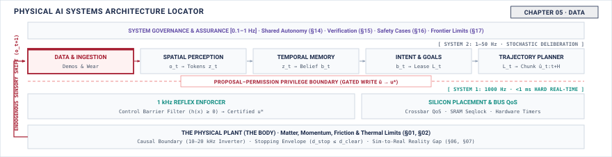

# Data\chaptersubtitle{Where a Physical Policy's Training Data Comes From} {#sec-data}

{#fig-locator-ch05 fig-pos="H" width=100%}

*Where does a physical policy's training data come from, and what does the machine that collected it put into it?*

<!-- HOOK: one substantive paragraph answering the question above. -->



::: {.callout-objective}
After studying this chapter, you will be able to:

1. Account for what one hour of demonstration data actually costs, in time and in wear.
2. Explain why the collecting policy determines the dataset's coverage, and why an episode that ends in a rescue must be cut where the policy diverged, not where the human intervened.
3. Identify which properties of a dataset are bound to the embodiment that produced it.
4. State what a dataset does not cover, in a form a later argument can rest on.

**Core Chapter Takeaway:** A physical dataset is made by moving a machine, so every sample costs wall-clock time and wear, and the policy that collected it decides what is in it. There is no scraping your way out of this.

:::

## Introduction {#sec-data-5-1}

<!-- SECTION 5.1 -->
<!-- claim: A physical dataset is made by moving a machine, which makes it expensive, slow, and shaped by whoever collected it. -->
<!-- covers: Open with an analytical $60\text{ min}$ collection session: $8\text{ min}$ of setup, $7\text{ min}$ of calibration, and $15\text{ min}$ of resets leave at most $30\text{ min}$ of motion before quality filtering. -->
<!-- covers: Establish that even automatically logged data was produced by actions that selected which physical states the recorder could observe. -->
<!-- covers: Distinguish scheduled time, motion time, retained episode time, and independent situations so that “one hour” does not conceal the acquisition denominator. -->
<!-- covers: State the chapter’s four deliverables: acquisition cost, collector-induced coverage, embodiment dependence, and an explicit boundary on unsupported use. -->
<!-- covers: Fence simulation and augmentation for Chapter 6 and policy evaluation for Chapter 7. -->
<!-- GROUNDING: number — what one hour of demonstration costs, before any of it is analysed -->

<!-- BEGIN -->

<!-- END -->

## Where Physical Data Comes From {#sec-data-5-2}

<!-- SECTION 5.2 -->
<!-- claim: A physical dataset is not found, logged, or scraped. Somebody moved a machine to make every sample in it. -->
<!-- covers: Classify physical sources by who chooses the action: a colocated demonstrator, a remote operator, a scripted controller, an exploratory policy, or the deployed machine itself. -->
<!-- covers: For each source, identify what is recorded as the action label: human input, command after interface mapping, command after enforcement, or measured physical response. -->
<!-- covers: Show that kinesthetic demonstration, teleoperation, play, and autonomous logging occupy different regions even when they attempt the same contact task. -->
<!-- covers: Separate samples, control steps, episodes, successful episodes, and independent task configurations; multiplying frequency by time produces correlated steps, not equivalent experience. -->
<!-- covers: Compute usable yield from attempt duration, reset duration, failed-log rate, and retention criteria rather than reporting raw recording hours. -->
<!-- covers: Defer simulated trajectories to Chapter 6 while preserving their physical provenance requirements when they are mixed with measured data. -->
<!-- GROUNDING: number — what one hour of demonstration costs, in time and in wear -->
<!-- DERIVE: Derive each source’s usable episode rate from attempt time, reset time, parallel rigs, and retention rate instead of asserting that abundance is unavailable “at any price.” -->

<!-- BEGIN -->

<!-- END -->

## Teleoperation and What It Costs {#sec-data-5-3}

<!-- SECTION 5.3 -->
<!-- claim: A human puppeting a machine is the dominant source of physical training data, and the interface shapes the data more than anyone admits. -->
<!-- covers: Trace the teleoperation loop from the operator’s displayed observation through input device, interface mapping, command path, machine response, and returned observation. -->
<!-- covers: Account separately for display latency, operator response time, command transport, and machine response because each changes the demonstrated correction. -->
<!-- covers: Compare two interfaces on the same touch task and show how limited axes, rate controls, or missing force feedback suppress actions that are difficult to express. -->
<!-- covers: Record the operator’s requested action, the mapped command, the enforced command, and the measured response as different quantities rather than treating them as one label. -->
<!-- covers: Derive usable minutes from setup, calibration, resets, pauses, invalid episodes, and quality review for a declared $60\text{ min}$ session. -->
<!-- covers: Express wear as attempts multiplied by mechanism cycles divided by the component’s rated service life; do not infer damage from elapsed time alone. -->
<!-- GROUNDING: mechanism — the operator, the interface, and the latency between them -->
<!-- FIGURE: SHOW the same contact task collected through two interfaces producing different reachable command sets and different occupied regions of state-action space. -->
<!-- DERIVE: Derive the usable-hour and service-life budgets; the claim that teleoperation is dominant is domain-dependent and requires scoped evidence or removal. -->

<!-- BEGIN -->

<!-- END -->

## Coverage and the Collecting Policy {#sec-data-5-4}

<!-- SECTION 5.4 -->
<!-- claim: The machine that gathers the data determines what is in it, which is the same endogeneity from Chapter 1 arriving at training time. -->
<!-- covers: Construct the collector’s empirical occupancy by counting the states and state-action pairs visited during complete trajectories. -->
<!-- covers: Compare a cautious collector with an exploratory collector on the same touch task and show that their datasets answer different questions despite identical sensors and logging rates. -->
<!-- covers: Explain that an action label exists only after the collector reaches the state, so an unvisited state has neither a preferred action nor evidence that no safe action exists. -->
<!-- covers: Trace behavioral-cloning error one step beyond the demonstrated region: a small prediction error changes the next observation, where the dataset may contain no corrective example. -->
<!-- covers: Define coverage against a deployment scenario ledger, including object pose, contact condition, payload, and disturbance range, rather than against the dataset’s own extrema. -->
<!-- covers: Detect unsupported deployment cells by joining required scenario bins to visitation counts and reporting zero-count and low-count cells explicitly. -->
<!-- GROUNDING: failure — states the collecting policy never visited, and therefore never labelled -->
<!-- FIGURE: SHOW two collectors occupying different subsets of the required deployment state space, with equal dataset sizes but unequal uncovered regions. -->
<!-- DERIVE: Derive collector dependence by reconstructing visitation counts from trajectories generated under two policies rather than asserting that the collector shapes coverage. -->

<!-- BEGIN -->

<!-- END -->

## Intervention, Censoring, and Recovery Data {#sec-data-5-5}

<!-- SECTION 5.5 -->
<!-- claim: An absent hazardous state means one of four different things, and training on rescues teaches the machine that the rescue was the correct behaviour. -->
<!-- covers: Four reasons a state is missing from a dataset: never reached, blocked by enforcement, corrected by an operator, or discarded. Each demands a different response from whoever uses the data. -->
<!-- covers: The selection trap: takeovers happen precisely when the policy has entered a state it handles badly, so intervention logs are not drawn from the same distribution as nominal operation. -->
<!-- covers: Naive imitation on rescued episodes: appending a rescued episode whole teaches the policy that drifting toward the hazard is followed by recovery, which is the opposite of the intended lesson. -->
<!-- covers: Where to cut the episode: terminating the autonomous trajectory at the moment of divergence rather than the moment of takeover, and what has to be logged for that moment to be recoverable at all. -->
<!-- covers: Corrective aggregation rather than passive logging: treating the intervention as expert feedback on the distribution the policy itself induced. -->
<!-- covers: The retraining cascade: what happens across successive policy generations trained on uncurated, human-rescued fleet data. -->
<!-- covers: State what the intervention record in Chapter 14 must carry for any of this to be possible, and require it there. -->
<!-- GROUNDING: failure — an absent state, the four different things that absence can mean, and where the episode has to be cut -->
<!-- FIGURE: A trajectory phase space showing nominal rollouts, divergence into a basin the policy cannot recover from, the takeover point, and the earlier divergence point where the training episode must actually be cut. -->
<!-- DERIVE: The compounding-error bound under naive behavioral cloning against the bound under corrective aggregation, so the reader sees why the cut point matters quadratically rather than linearly. -->

<!-- BEGIN -->

<!-- END -->

## Embodiment and Transfer {#sec-data-5-6}

<!-- SECTION 5.6 -->
<!-- claim: Data from one machine is not data about the task. Kinematics, sensing, and dynamics are baked into every sample. -->
<!-- covers: Define the embodiment contract carried by each sample: sensor geometry and calibration, observation rate and delay, action coordinates and limits, actuator response, and contact interface. -->
<!-- covers: Separate task-level facts, such as which surface should be touched, from embodiment-specific realizations, such as the command and observation that produced that touch. -->
<!-- covers: Work one numerical transfer between two end effectors with different jaw ranges, command rates, force limits, and camera offsets, and identify which recorded fields remain meaningful. -->
<!-- covers: Show that normalization can align numerical ranges while leaving differences in observability, delay, saturation, compliance, and available authority unchanged. -->
<!-- covers: Require a target-machine compatibility check before reuse: every observation field must be interpretable, and every action must map within declared rate, range, and timing bounds. -->
<!-- covers: Cite kinematics and dynamics where their guarantees are needed; keep the chapter at the interface quantities used to accept, adapt, relabel, or reject the data. -->
<!-- GROUNDING: number — the same task on two embodiments, and what does not transfer -->
<!-- FIGURE: SHOW identical normalized observation-action pairs crossing different sensor and actuator bounds on two embodiments, leaving only a smaller compatible intersection. -->
<!-- DERIVE: Derive transfer compatibility by mapping the worked dataset through both machines’ declared observation, action, timing, and saturation bounds. -->

<!-- BEGIN -->

<!-- END -->

## How Datasets Go Wrong {#sec-data-5-7}

<!-- SECTION 5.7 -->
<!-- claim: A physical dataset fails in ways a scraped one cannot: coverage gaps you cannot see, and a label that was correct only for that machine. -->
<!-- covers: Treat coverage failure as an external mismatch: compare required deployment cells with observed visitation rather than searching the dataset alone for evidence of states it never contains. -->
<!-- covers: Detect operator drift by partitioning collection chronologically and comparing completion time, correction count, command magnitude, and intervention rate across windows. -->
<!-- covers: Detect calibration or timebase discontinuities by joining every episode to calibration identifiers, clock checks, and configuration changes instead of trusting a uniform file schema. -->
<!-- covers: Detect silent embodiment mismatch by validating the recorded machine fingerprint and interface contract before loading any trajectory. -->
<!-- covers: Distinguish a failed attempt from a failed recording; attempt counts, retained counts, and exclusion reasons must reconcile. -->
<!-- covers: Place the incident case here only after these detectors are defined, and use it to trace one silent failure from acquisition through the resulting policy behavior. -->
<!-- GROUNDING: failure — coverage gaps, operator drift, and silent embodiment mismatch -->
<!-- INCIDENT: needs a documented, citable case. Do not invent one. -->
<!-- DERIVE: Derive why internal inspection cannot prove coverage by constructing two deployment requirements consistent with the same observed dataset but with different unsupported regions. -->

<!-- BEGIN -->

<!-- END -->

## The Data Record {#sec-data-5-8}

<!-- SECTION 5.8 -->
<!-- claim: What was collected, by whom, on what machine, and what it does not cover. -->
<!-- covers: State only the fields this chapter adds to the notebook. The schema, its provenance rules, and its versioning are established in Section 4.10 and are not restated here. -->
<!-- covers: Record the collection source, collector policy, operator or autonomous controller, interface version, enforcement configuration, and retention rule. -->
<!-- covers: Identify the physical machine by sensor calibration, action contract, firmware, replaceable contact parts, and relevant maintenance events rather than by model name alone. -->
<!-- covers: Report scheduled time, motion time, attempted episodes, retained episodes, control steps, and independent task configurations with their denominators. -->
<!-- covers: Preserve requested, mapped, enforced, and measured actions as separate fields, including overrides, truncations, and exclusion reasons. -->
<!-- covers: State the supported conditions and the known absences: unattempted states, environmental bounds, excluded failures, missing operators, and unmatched embodiments. -->
<!-- covers: Use a short record audit to show why two files with identical schemas and sample counts can support different deployment claims. -->
<!-- covers: Separate downstream uses: Chapter 14 needs the human and override provenance, while Chapter 16 needs the coverage, exclusions, and embodiment evidence for release. -->

<!-- BEGIN -->

<!-- END -->

## Systems Stress-Tests {#sec-data-5-9}

<!-- SECTION 5.9 -->
<!-- claim: A dataset that is large, clean, and wrong for the deployment. -->
<!-- covers: At $20\text{ Hz}$, add $72{,}000$ control steps by repeating one hour of the same successful motion, then show that the required scenario ledger gains no newly covered cell. -->
<!-- covers: Retain a clean dataset after replacing the contact pad and recalibrating the camera, then identify which embodiment-contract fields make the old labels conditionally usable or invalid. -->
<!-- covers: Collect only episodes that pass an online force limit and show how deleting the clipped and aborted attempts removes the recovery boundary the learned policy will later approach. -->
<!-- covers: Compare two operators using interfaces with different reachable axes and show that aggregation increases sample count while preserving a systematic hole. -->
<!-- covers: Require each stress test to end with a decision to accept, condition, recollect, relabel, or refuse the dataset. -->

<!-- BEGIN -->

<!-- END -->

## Summary {#sec-data-5-10}

<!-- SECTION 5.10 -->
<!-- claim: Chapter 6 receives a dataset, and the question of what to do with it. -->
<!-- covers: Distill acquisition cost into scheduled time, usable trajectory time, reset burden, and consumed service life. -->
<!-- covers: State that dataset coverage is the visitation record of a particular collector under particular constraints, not a property implied by sample count. -->
<!-- covers: Preserve embodiment, interface, enforcement, and exclusion provenance as part of the data rather than as optional metadata. -->
<!-- covers: Carry forward an explicit support boundary alongside the trajectories so later training cannot silently widen the dataset’s claim. -->
<!-- covers: Hand Chapter 6 both the dataset and its record; training choices cannot recover states, actions, or counterfactuals that collection omitted. -->

<!-- BEGIN -->

<!-- END -->
