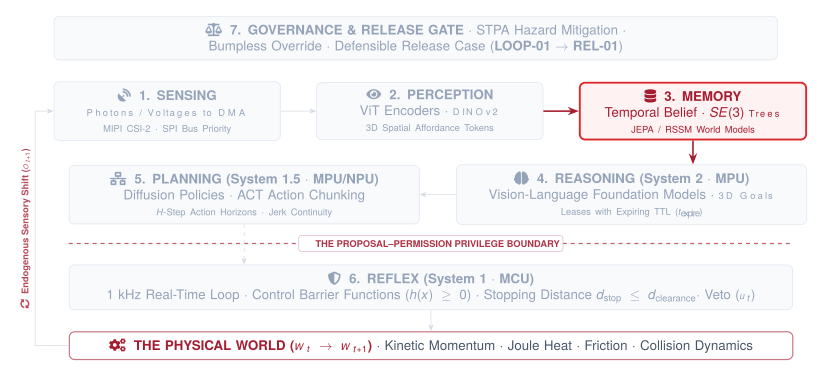

# Memory and Latent World Models

{#fig-locator-ch05 width=100%}

::: {.callout-objective}
By the conclusion of this chapter, you will be able to:

1. **Contrast Generative vs. Latent World Modeling:** Explain why real-time pixel generation (video diffusion) fails on compute and hallucination budgets, and deploy non-generative Latent World Models (JEPAs, RSSMs) that predict transitions in compact representation space $\mathcal{Z}$.
2. **Maintain Dynamic Metric $SE(3)$ Transform Graphs:** Construct and query time-indexed Lie group coordinate frame trees ($T_B^A \in SE(3)$) using Lie algebra ($\mathfrak{se}(3)$) tangent-space integration to eliminate gimbal lock and timestamp skew.
3. **Formulate Spatial Persistence Under Occlusion:** Model object permanence across visual dropouts using forward kinematic prediction and stochastic state propagation.
4. **Quantify Spatial Uncertainty Expansion & Expiration:** Formulate positional covariance growth ($\sigma_{\text{pos}}(t) = \sigma_0 + v_{\text{target}} \cdot \Delta t$) and enforce hard Time-To-Live (TTL) state leases.
5. **Architect Memory Domain Isolation:** Decouple high-bandwidth, non-deterministic latent belief updates (Linux MPU) from deterministic, high-rate proprioceptive state estimation (Real-Time MCU).
6. **Freeze the State and Timing Model (`STATE-01`):** Author the fifth artifact of the Cumulative Design Dossier establishing coordinate hierarchies, TTL windows, covariance bounds, and thermal derating regimes.
:::

::: {.callout-autopsy}
* **System:** Precision Electronic Assembly Arm (6-DoF Articulated Manipulator + Wrist-Mounted Camera).
* **Incident:** Vacuum gripper slammed into an aluminum printed circuit board (PCB) mounting fixture at $0.9\text{ m/s}$; shattered optical vacuum nozzle and crushed surface-mount components ($1,450\text{ USD}$ tooling damage).
* **Telemetry Snapshot:** Camera detected target PCB position at $T+08.100\text{ s}$. Due to MIPI-CSI image decoding and neural tokenization latency, the vision transform matrix arrived stamped $65\text{ ms}$ in the past. During the final descent phase, the robot's own mechanical forearm occluded the camera's optical line-of-sight for $180\text{ ms}$.
* **Root Cause:** The arm forward-kinematics tree was evaluated using current joint angles ($t_{\text{now}}$) but stale camera observations ($t_{\text{now}} - 65\text{ ms}$) without coordinate timestamp synchronization. Furthermore, the policy lacked a metric uncertainty model; upon visual occlusion, it treated the stale target pose as ground truth rather than expanding its spatial covariance bounds.
* **Architectural Flaw:** The system lacked a time-indexed $SE(3)$ transform buffer and failed to model spatial uncertainty expansion during visual occlusion.
:::

::: {.callout-contract}
| Component | Authority and Substrate | Contract Specification |
| :--- | :--- | :--- |
| **What the MPU Proposes (System 2)** | *Untrusted · Stochastic · Linux MPU* | • Estimated world state: $S_t = [T_{\text{target}}^{\text{world}}, \mathbf{v}_t, \Sigma_t]$<br>• Latent predictive rollout: $\mathbf{z}_{t+H} = g_\phi(\mathbf{z}_t, \mathbf{a}_{t:t+H})$<br>• Spatial uncertainty covariance bound: $\text{Tr}(\Sigma_t) \le \sigma_{\text{max}}^2$ |
| **What the MCU Permits (System 1)** | *Trusted · Deterministic · Real-Time MCU* | • Audits state lease freshness: $(t_{\text{now}} - t_{\text{stamp}}) \le \tau_{\text{TTL}}$<br>• Checks innovation residuals: $\|\mathbf{y}_t\| = \|\mathbf{z}_t - h(\hat{\mathbf{x}}_t)\| \le 3\sigma$<br>• Enforces dynamic thermal derating: $\tau \le \tau_{\text{max}}(T_{\text{motor}})$ |
| **Failure Escalation** | *MCU Hardware Reflex* | If state lease expires ($\Delta t > \tau_{\text{TTL}}$) or innovation residual breaches $3\sigma$, invalidate downstream MPU proposals and execute Category 2 smooth closed-loop velocity hold. |
:::

::: {.callout-note icon=false}
**The Sim-to-Real Delta:**
* **What Simulation Assumes:** The robot base and world origin share a static, mathematically perfect transformation matrix; coordinate transforms across all rigid bodies are instantaneous and perfectly synchronized; joint states and object positions are known with absolute certainty at every simulator step.
* **What the Bench Measures:** Camera mounting brackets flex under mechanical acceleration, distorting extrinsic calibration matrices ($T_{\text{cam}}^{\text{base}}$); microsecond crystal oscillator drift between sensor microcontrollers causes artificial velocity estimation spikes; physical objects are continuously occluded by robot links or environmental clutter, causing spatial uncertainty to expand rapidly in the absence of sensory updates.
:::

---

## The Illusion of the Stateless Agent

In digital computer science, memory is an infinite, addressable grid of bytes. In modern machine learning, memory is often conceptualized as the attention context window of a transformer: a static sequence of tokens cached in GPU high-bandwidth memory (HBM). If an object is described in token 42, the model attends to it with mathematical permanence. When the text stream ends or the context window shifts, the digital entity simply ceases to exist.

**The physical world is neither stateless nor an infinite text buffer.**

In the physical world, matter possesses mass, momentum, and continuous geometry ($W_t \to W_{t+1}$). When a robotic manipulator reaches toward a component on an assembly bench, the robot's own mechanical wrist inevitably passes between the overhead camera and the target object. For a span of $150\text{ to }300\text{ milliseconds}$, optical photons from the target cannot reach the camera sensor. The target object has vanished from the camera's field of view.

A naive perception system operating in a purely reactive loop suffers an immediate cognitive collapse:

$$\text{Reactive Vision: } \text{Photons Blocked} \implies \text{Zero Detections} \implies \text{Target Pose Lost / Hallucinated}$$

$$\text{Physical Reality: } \text{Matter Persists } (T_{\text{target}}^{\text{world}} \in SE(3)) \implies \text{Uncertainty Expands } (\sigma_{\text{pos}}(t) \propto \Delta t)$$

The physical object did not dissolve into non-existence simply because a camera lens was occluded. It still occupies space, possesses inertia, and presents a rigid physical boundary. However, because the agent can no longer observe it directly, the agent's internal certainty regarding the object's precise coordinates begins to decay. If the object is resting on a stationary workbench, its coordinates remain fixed, but mechanical vibration and base drift introduce positional doubt. If the object is carried on a moving conveyor belt, its position drifts rapidly according to the belt's velocity vector.

To act competently in an un-instrumented physical world, an embodied agent cannot rely on instantaneous pixel reactions alone. It must construct and maintain a continuous, metric **latent world model and temporal state belief** ($S(t)$). This internal state organ performs three load-bearing systems tasks:

1. **Temporal Synchronization:** It bridges the gap between high-frequency, jitter-free proprioception ($1000\text{ Hz}$ joint encoders, IMUs) and delayed, jitter-prone exteroception ($30\text{ Hz}$ vision, depth maps).
2. **Spatial Metric Persistence:** It maintains dynamic, tree-structured coordinate frame graphs ($SE(3)$) using Lie algebra ($\mathfrak{se}(3)$) tangent-space integration, enabling microsecond geometric reasoning without coordinate singularities.
3. **Bounded Uncertainty & Ephemeral Leases:** It models the expansion of spatial uncertainty during sensory dropouts ($\sigma_{\text{pos}}(t)$), enforcing strict Time-To-Live (TTL) validity leases that revoke delegated physical authority before geometric drift causes mechanical destruction.

---

## World Modeling Paradigms: Why Generative Pixel Diffusion Fails in Real Time

How should a physical AI agent represent its environment and predict future physical dynamics? In contemporary artificial intelligence research, world modeling is approached through three distinct paradigms (@fig-world-paradigms):

1. **Generative Pixel-Space World Models:** Autoregressive video transformers and diffusion models (e.g., Sora, Genie, DriveDreamer) that generate future raw image frames ($\hat{I}_{t+1} \in \mathbb{R}^{H \times W \times 3}$).
2. **Latent World Models:** Non-generative predictive architectures (e.g., Joint Embedding Predictive Architectures [JEPA], Recurrent State-Space Models [RSSM]) that predict transitions directly in compact latent feature spaces ($\mathbf{z}_{t+1} = g_\phi(\mathbf{z}_t, \mathbf{a}_t)$).
3. **Metric Spatial State Trees:** Deterministic kinematic frame graphs ($T_B^A \in SE(3)$) and Lie algebra tangent estimators fused with stochastic filtering (EKF).

{#fig-world-paradigms width=100%}

### The Fallacy of Pixel-Level Video Generation for Embodiment

Generative video models synthesize visually stunning scenes. Given a video prompt and an action token, a diffusion transformer (DiT) denoises random Gaussian noise across dozens of iterative steps to synthesize high-resolution future video frames. While compelling for media generation, **pixel-space generative models fail catastrophically as real-time world models for physical machines**.

This failure is rooted in three inescapable physical and systems constraints:

#### 1. The Inescapable FLOP and Bandwidth Tax
Generating a single $1080\text{p}$ image frame ($1920 \times 1080 \times 3 \approx 6.2\text{ MB}$ raw RGB) through iterative diffusion requires evaluating billions of neural parameters across $20\text{ to }50$ denoising steps. On datacenter-class GPUs ($300\text{--}700\text{ W}$), generating one second of video consumes tens of TeraFLOPs and takes several seconds. On embedded robotics System-on-Chips (SoCs) constrained to a $15\text{--}30\text{ W}$ thermal envelope (such as the NVIDIA Jetson Orin or embedded NPU accelerators), per-frame generative diffusion latency ranges from $400\text{ ms}$ to over $2000\text{ ms}$.

As established in Chapter 2, physical systems operate under strict physical world deadlines ($\tau_{\text{world}} \approx 20\text{--}50\text{ ms}$). A predictive world model that takes $800\text{ ms}$ to predict the next visual frame is fundamentally unviable for closed-loop control; the physical robot will collide with an obstacle long before the neural network finishes rendering its pixels.

#### 2. The Visual Hallucination Tax
Pixel generation forces the neural network to expend $>99\%$ of its representational capacity predicting task-irrelevant high-frequency textures: the intricate weave of a carpet, flickering fluorescent light ripples, dust particles floating in the air, or turbulent fluid swirls. Because autoregressive pixel predictors minimize perceptual or mean-squared pixel reconstruction losses, they frequently suffer from **non-rigid hallucinations**:
* Rigid aluminum fixtures subtly morph and stretch across frames.
* Thin obstacles (such as glass walls or wire cables) vanish and reappear.
* Objects pass through one another because the diffusion prior lacks rigid contact constraints.

An autonomous machine cannot base closed-loop obstacle avoidance or precision tool engagement on an elastic, hallucinated dream.

#### 3. The Lack of Metric Units
Raw pixel arrays have no intrinsic metric scale. A $50\text{-pixel}$ displacement in an image can represent a $2\text{ mm}$ shift at close range or a $2\text{ meter}$ translation in the background. Generative pixel models lack calibrated $SE(3)$ transformation coordinates, rendering them incapable of interfacing directly with motor joint kinematics or torque-level safety enforcers.

### The Necessity of Latent World Models: JEPAs and RSSMs

To overcome the fatal limitations of pixel diffusion, modern Physical AI architectures adopt **Latent World Models**. Instead of predicting raw RGB pixels, latent world models encode sensory observations into a compact, abstract representation space $\mathcal{Z} \subset \mathbb{R}^D$ ($D \ll H \times W \times 3$) and predict future states entirely within representation space:

$$\mathbf{z}_t = \text{Encoder}(O_t), \quad \hat{\mathbf{z}}_{t+1} = g_\phi(\mathbf{z}_t, \mathbf{a}_t) \quad (\text{No pixel decoder evaluated in the hot loop})$$

Two foundational latent architectures power modern physical reasoning:

#### 1. Joint Embedding Predictive Architecture (JEPA / V-JEPA)
Introduced by LeCun [-@lecun2022path], the JEPA discards generative decoders entirely. As shown in @tbl-world-model-comparison, a visual encoder maps raw image patches into a self-supervised embedding space $\mathbf{z}_t \in \mathbb{R}^D$. A lightweight latent predictor $g_\phi$ is trained to predict the embedding of a future masked observation $\mathbf{z}_{t+1}$ conditioned on an action $\mathbf{a}_t$. 

By training with energy-based invariance losses (such as VICReg or InfoNCE) rather than pixel reconstruction, the JEPA inherently ignores task-irrelevant visual noise (flickering lights, complex background wallpaper) while preserving load-bearing geometric and semantic affordances. On embedded NPUs, evaluating the latent predictor $g_\phi$ requires fewer than $50\text{ MFLOPs}$, enabling forward rollouts in under $1.5\text{ ms}$.

#### 2. Recurrent State-Space Models (RSSM)
Pioneered in the Dreamer architecture family [@hafner2023mastering], the RSSM decomposes the latent state into a deterministic recurrent path and a stochastic categorical path:

$$h_t = f_\theta(h_{t-1}, z_{t-1}, a_{t-1}) \quad (\text{Deterministic recurrent dynamics via GRU/Mamba})$$

$$z_t \sim q_\phi(z_t \mid h_t, O_t) \quad (\text{Stochastic posterior belief state})$$

$$\hat{z}_{t+1} \sim p_\psi(\hat{z}_{t+1} \mid h_{t+1}) \quad (\text{Stochastic prior transition model})$$

The deterministic recurrent state $h_t \in \mathbb{R}^{512}$ captures long-term temporal dependencies (such as object permanence across extended occlusions), while the stochastic latent state $z_t \in \mathbb{R}^{32 \times 32}$ models multi-modal environmental transitions (such as whether an unanchored part will tip left or right upon contact). 

Because the entire predictive loop operates in compact latent space without pixel decoding, an embedded NPU can unroll a $32\text{-step}$ future trajectory ($H = 32$) in less than $2.5\text{ ms}$. This enables online Model Predictive Control (MPC) and policy optimization directly inside the robot's real-time control cycle.

| Dimension | Generative Pixel Diffusion | Latent World Model (JEPA / RSSM) | Metric $SE(3)$ Kinematic Tree |
| :--- | :--- | :--- | :--- |
| **State Representation** | High-dim RGB pixels ($1920 \times 1080 \times 3$) | Compact latent embeddings ($\mathbf{z}_t \in \mathbb{R}^{512}$) | Homogeneous matrices ($T_B^A \in SE(3)$) |
| **Prediction Latency ($P_{50}$)** | $400\text{--}1500\text{ ms}$ (Multi-step DiT) | $1.0\text{--}2.5\text{ ms}$ (Single latent MLP/GRU pass) | $< 10\,\mu\text{s}$ (Matrix multiplication) |
| **Compute Footprint** | $> 30\text{ TFLOPs per frame}$ | $< 50\text{ MFLOPs per rollout}$ | $< 1\text{ KFLOP per transform}$ |
| **Real-Time Viability** | **Failed** ($t_{\text{infer}} \gg \tau_{\text{world}}$) | **Viable for 20 Hz Planning** (System 1.5) | **Viable for 1 kHz Reflex** (System 1) |
| **Geometric Fidelity** | Stochastic / Hallucinatory | Abstract semantic affordance | Exact millimetric metric space |
| **Handling of Occlusion** | Non-rigid visual drift | Recurrent memory persistence | Explicit covariance inflation ($\sigma_{\text{pos}}(t)$) |
: **Quantitative comparison of physical world modeling paradigms.** Generative pixel diffusion is computationally unviable on embedded edge silicon and lacks metric precision. Physical AI systems combine Latent World Models (for semantic forward rollouts on the MPU/NPU) with Metric $SE(3)$ Frame Trees (for millimetric safety enforcement on the MCU). {#tbl-world-model-comparison}

---

## Spatial Persistence Under Occlusion: Metric $SE(3)$ Frame Trees

While Latent World Models excel at semantic prediction and affordance planning, motor controllers and safety filters require exact metric geometry. When an arm closes its gripper, the contact point must be specified not in abstract embedding dimensions, but in millimeters relative to the workpiece fixture.

Every physical AI system must maintain an explicit, dynamic **Spatial Frame Graph** (@fig-se3-tree).

![**Dynamic $SE(3)$ Coordinate Frame Tree and Time-Indexed Transform Buffer.** (Left) The directed acyclic coordinate tree rooted at `world`, establishing spatial relationships between robot base, camera, end-effector, tool tip, and target object. (Right) The temporal transform buffer solves sensory latency: when a visual detection arrives with $\Delta t_{\text{lag}} = 65\text{ ms}$, the tree queries historical mounting transforms, chains coordinate transformations in $SE(3)$, and forward-propagates the state to $t_{\text{now}}$ using Lie algebra tangent-space integration ($\mathfrak{se}(3)$) without gimbal lock singularities.](figures/fig05_se3_frame_tree.svg){#fig-se3-tree width=100%}

### The Mathematics of Rigid Transformations: $SE(3)$

In Euclidean three-dimensional space, the position and orientation of any rigid physical body $B$ relative to reference frame $A$ is uniquely represented by an element of the **Special Euclidean Group** $T_B^A \in SE(3)$:

$$T_B^A = \begin{bmatrix} R_B^A & \mathbf{p}_B^A \\ \mathbf{0}_{1\times 3} & 1 \end{bmatrix} \in \mathbb{R}^{4 \times 4}$$

Where:
* $R_B^A \in SO(3)$ is a $3 \times 3$ orthonormal rotation matrix satisfying $R^T R = I$ and $\det(R) = +1$.
* $\mathbf{p}_B^A = [x, y, z]^T \in \mathbb{R}^3$ is the translation vector pointing from origin $A$ to origin $B$.

Coordinate transformations compose associatively via standard matrix multiplication:

$$T_{\text{target}}^{\text{world}} = T_{\text{base}}^{\text{world}} \cdot T_{\text{camera}}^{\text{base}} \cdot T_{\text{target}}^{\text{camera}}$$

The inverse transformation represents the reverse coordinate mapping:

$$\left(T_B^A\right)^{-1} = T_A^B = \begin{bmatrix} (R_B^A)^T & -(R_B^A)^T \mathbf{p}_B^A \\ \mathbf{0}_{1\times 3} & 1 \end{bmatrix}$$

### Why Euler Angles Fail: The Lie Algebra $\mathfrak{se}(3)$

In introductory robotics and computer graphics, orientation is frequently parameterized using three Euler angles (Roll, Pitch, Yaw: $\phi, \theta, \psi$). **Euler angles are forbidden in production Physical AI systems.**

Euler angle parameterizations suffer from two fatal mathematical flaws:
1. **Gimbal Lock Singularities:** When pitch reaches $\theta = \pm 90^\circ$, the roll and yaw axes align, causing the loss of one rotational degree of freedom. At this singularity, infinitesimal physical rotations require infinite angular rates in Euler space, causing numerical integration routines to crash or explode.
2. **Non-Euclidean Topology:** Rotations form a curved manifold ($SO(3)$), not a vector space. You cannot add angular velocities directly ($\theta(t+\Delta t) \neq \theta(t) + \dot{\theta}\Delta t$).

To integrate continuous joint velocities and IMU body rates without singularities or coordinate distortion, physical AI systems execute numerical integration in the **Lie algebra tangent space** ($\mathfrak{se}(3)$).

A continuous velocity twist vector combining linear velocity $\mathbf{v} \in \mathbb{R}^3$ and angular velocity $\boldsymbol{\omega} \in \mathbb{R}^3$ is defined as $\boldsymbol{\xi} = [\mathbf{v}, \boldsymbol{\omega}]^T \in \mathbb{R}^6$. The Lie algebra element $\boldsymbol{\xi}^\wedge \in \mathfrak{se}(3)$ is constructed via the skew-symmetric "hat" operator:

$$\boldsymbol{\xi}^\wedge = \begin{bmatrix} \boldsymbol{\omega}^\wedge & \mathbf{v} \\ \mathbf{0}_{1 \times 3} & 0 \end{bmatrix} = \begin{bmatrix} 0 & -\omega_z & \omega_y & v_x \\ \omega_z & 0 & -\omega_x & v_y \\ -\omega_y & \omega_x & 0 & v_z \\ 0 & 0 & 0 & 0 \end{bmatrix} \in \mathbb{R}^{4 \times 4}$$

Continuous forward propagation over a discrete integration timestep $\Delta t$ is computed in closed form using the matrix exponential map ($\exp: \mathfrak{se}(3) \to SE(3)$):

$$T(t + \Delta t) = T(t) \cdot \exp\left(\boldsymbol{\xi}^\wedge \cdot \Delta t\right)$$

Using Rodrigues' rotation formula and the closed-form left Jacobian of $SO(3)$, this exponential map evaluates in microseconds without trigonometric singularities or numerical drift.^[For an angular velocity vector with magnitude $\theta = \|\boldsymbol{\omega}\|\Delta t$ and unit axis $\mathbf{n} = \boldsymbol{\omega}/\|\boldsymbol{\omega}\|$, Rodrigues' formula yields the exact rotation matrix $R = \exp(\boldsymbol{\omega}^\wedge \Delta t) = I + \sin(\theta)\mathbf{n}^\wedge + (1 - \cos(\theta))(\mathbf{n}^\wedge)^2$. Translation propagates via $\mathbf{p} = V(\theta) \mathbf{v}\Delta t$, where $V(\theta) = I + \frac{1-\cos(\theta)}{\theta}\mathbf{n}^\wedge + \frac{\theta - \sin(\theta)}{\theta}(\mathbf{n}^\wedge)^2$. This guarantees orthonormal integrity with zero matrix renormalization overhead.]

### The Time-Indexed Transform Buffer (`tf2`)

In a real robot, sensors do not publish synchronously. An IMU emits linear accelerations and angular velocities at $1000\text{ Hz}$; optical motor encoders publish joint angles $q(t)$ at $500\text{ Hz}$; a depth camera publishes target detections at $30\text{ Hz}$ with a $65\text{ ms}$ ingestion pipeline delay.

If a control policy naively composes transforms across different sensor arrivals without matching timestamps, the resulting spatial estimate is corrupted by **timestamp skew**:

::: {.callout-caution}
### The Danger of Timestamp Skew
Imagine a robot arm moving at an end-effector velocity of $1.5\text{ m/s}$. If the vision system detects a target object in camera frame ($T_{\text{target}}^{\text{camera}}$) with a $65\text{ ms}$ ingestion delay, multiplying this delayed detection by the *current* forward-kinematics camera pose ($T_{\text{camera}}^{\text{base}}(t_{\text{now}})$) produces an artificial positional error of:

$$\Delta p_{\text{error}} = v_{\text{arm}} \cdot \Delta t_{\text{lag}} = 1.5\text{ m/s} \cdot 0.065\text{ s} = \mathbf{97.5\text{ mm}}$$

A $9.7\text{ cm}$ spatial error is catastrophic in precision manufacturing, causing the gripper to miss the workpiece or crash into tooling fixtures.
:::

To eliminate timestamp skew, the state estimation engine maintains a **Time-Indexed Transform Ring Buffer** (implemented in frameworks such as ROS 2 `tf2`). 

Every rigid transform edge in the coordinate tree is stored as a time-stamped history:

$$\mathcal{H}_{B}^{A} = \left\{ \left(t_k, T_B^A(t_k)\right) \right\}_{k=1}^{K} \quad (\text{Sliding window buffer, typical depth } K=500\text{ ms})$$

When a delayed vision token arrives stamped at historical capture time $t_{\text{capture}} = t_{\text{now}} - 65\text{ ms}$, the spatial engine executes a 4-step resynchronization query:

1. **Historical Transform Lookup:** The buffer retrieves the exact kinematic base-to-camera transform at the historical capture time: $T_{\text{camera}}^{\text{base}}(t_{\text{capture}})$ (using spherical linear interpolation [SLERP] between adjacent buffer keys).
2. **Historical Frame Composition:** The target's historical metric position in world coordinates is computed:
   $$T_{\text{target}}^{\text{world}}(t_{\text{capture}}) = T_{\text{base}}^{\text{world}} \cdot T_{\text{camera}}^{\text{base}}(t_{\text{capture}}) \cdot T_{\text{target}}^{\text{camera}}(t_{\text{capture}})$$
3. **Forward Lie Propagation:** The spatial state estimator uses the high-rate velocity twist $\boldsymbol{\xi}_{\text{target}}$ to forward-propagate the target pose from $t_{\text{capture}}$ to the current physical instant $t_{\text{now}}$:
   $$T_{\text{target}}^{\text{world}}(t_{\text{now}}) = T_{\text{target}}^{\text{world}}(t_{\text{capture}}) \cdot \exp\left(\boldsymbol{\xi}_{\text{target}}^\wedge \cdot (t_{\text{now}} - t_{\text{capture}})\right)$$
4. **Current Kinematic Clearance:** The clearance vector is evaluated against the *current* end-effector position $T_{\text{EE}}^{\text{base}}(t_{\text{now}})$ computed at $1000\text{ Hz}$ on the MCU.

---

## Modeling Spatial Uncertainty Expansion and Temporal Belief Decay

When sensors are streaming active, un-occluded observations, the state estimator continuously corrects its internal belief, maintaining tight spatial confidence bounds ($\sigma_{\text{pos}} \le 2\text{ mm}$). 

However, when an object is occluded—whether by the robot's arm, an opening door, or optical glare—the agent must transition from direct observation to **stochastic state propagation** (@fig-uncertainty-expansion).

![**Spatial Uncertainty Expansion and State TTL Expiration.** During active vision ($t < t_{\text{occlude}}$), sensory updates keep positional uncertainty tightly bounded ($\sigma_0 \approx 2\text{ mm}$) with innovation residuals within $1\sigma$. During visual occlusion, uncertainty expands according to target motion dynamics ($\sigma_{\text{pos}}(t) = \sigma_0 + v_{\text{target}}\Delta t$). When uncertainty breaches the safety threshold at $t_{\text{expire}} = t_{\text{occlude}} + \tau_{\text{TTL}}$, the MCU revokes proposal authority and executes a safe Category 2 velocity hold. Upon sensory re-acquisition ($t_{\text{reacquire}}$), innovation gating audits the new observation: if valid ($\le 3\sigma$), covariance resets; if invalid ($>3\sigma$), the anomaly is rejected.](figures/fig05_uncertainty_expansion.svg){#fig-uncertainty-expansion width=100%}

### The Positional Uncertainty Growth Equation

During sensory absence, how rapidly does internal belief degrade? 

For a target object with initial spatial covariance $\sigma_0$ at the moment of occlusion $t_0$, the positional uncertainty bound $\sigma_{\text{pos}}(t)$ expands as a function of elapsed sensory darkness $\Delta t = t - t_0$, maximum target velocity $v_{\text{target}}$, and maximum unobserved acceleration $a_{\text{target}}$:

$$\sigma_{\text{pos}}(t) = \sigma_0 + v_{\text{target}} \cdot \Delta t + \frac{1}{2} a_{\text{target}} \cdot (\Delta t)^2$$

In the full multivariate Extended Kalman Filter (EKF) formulation, the spatial covariance matrix $P_t \in \mathbb{R}^{n \times n}$ evolves during open-loop propagation according to:

$$P_t = F_t P_{t-1} F_t^T + Q_t$$

Where:
* $F_t = \left.\frac{\partial f}{\partial \mathbf{x}}\right|_{\hat{\mathbf{x}}_{t-1}}$ is the Jacobian of the continuous physical transition model.
* $Q_t = \mathbb{E}[\mathbf{w}_t \mathbf{w}_t^T]$ is the process noise covariance matrix representing unmodeled physical disturbances (vibration, motor cogging, air turbulence).

In the absence of sensory measurement updates, process noise $Q_t$ continuously injects variance into the diagonal and cross-terms of $P_t$. The geometric volume of the **uncertainty ellipsoid**—proportional to $\sqrt{\det(P_t)}$—expands monotonically.

### Innovation Residuals as Hardware Anomaly Detectors

When an observation arrives—either after a period of occlusion or during steady-state tracking—the state estimator evaluates the **innovation residual vector** $\mathbf{y}_t$:

$$\mathbf{y}_t = \mathbf{z}_t - h(\hat{\mathbf{x}}_t)$$

Where $\mathbf{z}_t$ is the raw sensory measurement (e.g., detected 3D bounding box centroid $[x, y, z]$) and $h(\hat{\mathbf{x}}_t)$ is the non-linear observation model projecting the internal predicted state into measurement space.

The innovation covariance matrix $S_t$ defines the expected statistical spread:

$$S_t = H_t P_t H_t^T + R_t$$

Where $H_t = \left.\frac{\partial h}{\partial \mathbf{x}}\right|_{\hat{\mathbf{x}}_t}$ is the observation Jacobian and $R_t$ is the sensor measurement noise covariance.

To determine whether the new measurement represents valid physical evidence or a corrupted sensor glitch, the system computes the normalized **Mahalanobis Distance** $d_M$:

$$d_M = \sqrt{\mathbf{y}_t^T S_t^{-1} \mathbf{y}_t}$$

Physical AI systems enforce a strict **$3\sigma$ Innovation Gating Rule**:

$$\text{Measurement Accepted If: } d_M \le 3.0 \quad (\text{Inside } 99.7\% \text{ statistical confidence bound})$$

$$\text{Measurement VETOED / Flagged If: } d_M > 3.0 \quad (\text{Out-of-Distribution Anomaly / Mechanical Collision})$$

If $d_M > 3.0$, the measurement is rejected. A sudden, massive innovation residual indicates one of three physical failure modes:
1. **False Positive Perception:** Optical glare or background clutter caused the vision model to detect an erroneous bounding box.
2. **Mechanical Slippage / Jam:** The robot's end-effector struck an unmodeled obstacle, causing joint motor encoders to slip or stall while internal kinematics assumed free-space motion.
3. **Severe Coordinate Frame Drift:** A camera mounting bracket was bumped or deformed, corrupting the extrinsic calibration matrix $T_{\text{camera}}^{\text{base}}$.

By gating updates with Mahalanobis distance, the state estimator prevents corrupted sensor frames from destabilizing internal belief.

---

## State Expiration Leases (TTL) and Memory Domain Isolation

In software web architectures, cache records carry Time-To-Live (TTL) timestamps to prevent stale database reads. In Physical AI, **a stale state estimate is an active physical hazard**.

If an autonomous mobile robot believes a pedestrian is $5\text{ meters}$ away, that belief is actionable for $100\text{ ms}$. If visual tracking drops out and the robot continues driving at $2.0\text{ m/s}$ based on that same $100\text{-ms-old}$ belief, the pedestrian could have stepped directly into the vehicle's braking path.

To enforce physical safety, every state estimate published by the perception and world modeling subsystem carries a strict **State Validity TTL Lease**:

$$\text{State Lease Valid } \iff (t_{\text{now}} - t_{\text{stamp}}) \le \tau_{\text{TTL}}$$

If elapsed time exceeds $\tau_{\text{TTL}}$, the state lease **expires immediately in hardware**. Downstream motion planners on the Linux MPU are forbidden from emitting trajectory proposals, and the real-time MCU safety reflex executes a controlled Category 2 deceleration hold.

### Memory Domain Isolation Across Silicon

A robust physical architecture isolates state memory into three decoupled execution domains across heterogeneous compute silicon (@tbl-memory-domains):

1. **Domain 1: Bare-Metal Real-Time MCU State ($1000\text{ Hz}$):**
   * **Substrate:** Arm Cortex-M4/M7 or RISC-V microcontroller executing FreeRTOS or bare metal.
   * **State Contents:** High-rate proprioception (joint angles $q$, joint velocities $\dot{q}$, motor phase currents $I$, winding temperatures $T_{\text{motor}}$, IMU linear accelerations).
   * **Memory Discipline:** Static, deterministic memory allocation in zero-wait-state internal SRAM. Zero heap allocation (`malloc` is prohibited). Circular ring buffers with fixed compile-time lengths.
   * **TTL Horizon:** $\tau_{\text{TTL,proprio}} = 5\text{ ms}$ ($5$ missed cycles triggers immediate hardware safety reflex).

2. **Domain 2: Kinematic Frame Graph on Real-Time Linux MPU ($200\text{ Hz}$):**
   * **Substrate:** Linux application processor running `PREEMPT_RT` real-time kernel patches.
   * **State Contents:** Complete $SE(3)$ coordinate tree (`tf2`), forward kinematics, wheel odometry fusion, dynamic transform ring buffer ($500\text{ ms}$ history).
   * **Memory Discipline:** Pre-allocated shared memory segments (`shm_open`, `mlockall` to prevent OS paging faults). Lock-free triple buffering for inter-process communication.
   * **TTL Horizon:** $\tau_{\text{TTL,kinematic}} = 20\text{ ms}$.

3. **Domain 3: Latent World Model & Semantic Belief on MPU/NPU ($10\text{--}30\text{ Hz}$):**
   * **Substrate:** Neural Processing Unit (NPU) and GPU memory.
   * **State Contents:** JEPA latent feature embeddings $\mathbf{z}_t$, RSSM recurrent states $h_t$, open-vocabulary 3D object bounding boxes, semantic scene graphs.
   * **Memory Discipline:** Dedicated tensor activation buffers in DRAM with hardware DMA channels.
   * **TTL Horizon:** $\tau_{\text{TTL,visual}} = 100\text{ ms}$.

| Memory Domain | Execution Substrate | State Representations | Update Rate | Memory Allocation | TTL Lease Horizon ($\tau_{\text{TTL}}$) |
| :--- | :--- | :--- | :---: | :--- | :---: |
| **Domain 1: Fast Proprioception** | Real-Time MCU (FreeRTOS / Bare Metal) | $q, \dot{q}, I_{\text{phase}}, T_{\text{motor}}, \mathbf{a}_{\text{imu}}, \boldsymbol{\omega}_{\text{imu}}$ | $1000\text{ Hz}$ | Static internal SRAM (Zero heap) | $5\text{ ms}$ |
| **Domain 2: Kinematic Frames** | Real-Time Linux MPU (`PREEMPT_RT`) | $T_B^A \in SE(3)$, Twist $\boldsymbol{\xi} \in \mathfrak{se}(3)$, `tf2` Tree | $200\text{ Hz}$ | Pinned Shared Memory (`mlockall`) | $20\text{ ms}$ |
| **Domain 3: Latent Semantic Belief** | Linux MPU + NPU / GPU Accelerator | JEPA $\mathbf{z}_t$, RSSM $h_t$, 3D Bounding Boxes | $10\text{--}30\text{ Hz}$ | DMA-mapped Unified DRAM (UMA) | $100\text{ ms}$ |
: **Three-tiered memory domain isolation architecture.** High-level stochastic semantic representations (Domain 3) are strictly isolated from high-rate deterministic proprioception (Domain 1). Even if Linux or the NPU experiences an OS stall, the MCU maintains continuous proprioceptive control and safety enforcement. {#tbl-memory-domains}

---

## Proprioceptive Interoception: Thermal Derating and Physical Health

State estimation is not restricted to external spatial coordinates. A physical machine must maintain an accurate model of its own internal physical health—its **interoceptive state**.

Electric actuators do not fail because an algorithm threw an exception; they fail because continuous current dissipation raises stator winding temperatures beyond the glass transition temperature of wire insulation ($T > 120^\circ\text{C}$), melting lacquer and causing catastrophic short circuits, or demagnetizing neodymium rotor magnets.

### The Stator Winding Thermal Model

The temperature rise $\Delta T(t)$ in a brushless DC (BLDC) motor stator winding follows the continuous thermal energy balance equation:

$$C_{\text{th}} \frac{d(\Delta T)}{dt} = I^2(t) R(T) - \frac{\Delta T(t)}{R_{\text{th}}}$$

Where:
* $I(t)$ is the root-mean-square (RMS) motor phase current.
* $R(T) = R_0 [1 + \alpha_{\text{cu}}(T - T_0)]$ is the temperature-dependent copper winding resistance ($\alpha_{\text{cu}} \approx 0.00393 / ^\circ\text{C}$).
* $C_{\text{th}}$ is the thermal capacitance of the stator assembly ($\text{J}/^\circ\text{C}$).
* $R_{\text{th}}$ is the thermal resistance from winding to ambient air ($^\circ\text{C}/\text{W}$).

While brief transient peak currents ($I_{\text{peak}} \approx 3 \cdot I_{\text{cont}}$) are safely buffered by the stator's thermal mass $C_{\text{th}}$ for $1\text{ to }3\text{ seconds}$, sustained high-torque operation causes winding temperatures to climb toward critical thresholds.

### The Dynamic 3-Zone Thermal Derating Law

To prevent thermal destruction while maximizing peak dynamic performance, the state model continuously evaluates a **Piecewise Thermal Derating Law** (@tbl-thermal-derating):

$$\tau_{\text{max}}(T_{\text{motor}}) = \begin{cases} \tau_{\text{nom}} & \text{if } T_{\text{motor}} < T_{\text{warn}} \\ \tau_{\text{nom}} \cdot \left(1 - \frac{T_{\text{motor}} - T_{\text{warn}}}{T_{\text{crit}} - T_{\text{warn}}}\right) & \text{if } T_{\text{warn}} \le T_{\text{motor}} \le T_{\text{crit}} \\ 0\text{ Nm} \quad (\text{Gate drives disabled}) & \text{if } T_{\text{motor}} > T_{\text{crit}} \end{cases}$$

| Operating Thermal Zone | Winding Temperature Range ($T_{\text{motor}}$) | Permissible Actuator Torque ($\tau_{\text{max}}$) | Systems Action & Reflex State |
| :--- | :---: | :---: | :--- |
| **1. Nominal Operating Zone** | $T_{\text{motor}} < 85^\circ\text{C}$ | $100\%$ Rated Continuous Torque | Full autonomous capability; high-speed trajectory proposals permitted. |
| **2. Linear Derating Zone** | $85^\circ\text{C} \le T_{\text{motor}} \le 105^\circ\text{C}$ | Linearly derated from $100\%$ down to $0\%$ | MPU motion planner scales down maximum acceleration; fan cooling forced to $100\%$. |
| **3. Thermal Emergency Cutoff** | $T_{\text{motor}} > 105^\circ\text{C}$ | $0\text{ Nm}$ (Inverter tri-state disconnect) | **Hardware Reflex:** Disables PWM gate drivers to prevent permanent winding demagnetization. |
: **Actuator thermal derating ledger.** As motor winding temperatures approach physical insulation limits, available torque authority is dynamically throttled, protecting mechanical actuators from permanent degradation. {#tbl-thermal-derating}

By incorporating winding temperature, battery bus voltage ($V_{\text{bus}}$), and inverter current into the core state schema (`STATE-01`), high-level foundation models and motion planners are prevented from commanding aggressive physical maneuvers that the physical hardware cannot thermally sustain.

---

## Systems Fallacies and Pitfalls

::: {.callout-warning}
### Common Engineering Fallacies in Embodied State Modeling
* **Fallacy 1:** *"The internal latent representation or context window of a Multi-Modal LLM serves as a robotic world model."*  
  *Correction:* LLM context windows store token sequences, not metric spatial coordinates ($SE(3)$), Lie algebra velocity twists ($\mathfrak{se}(3)$), or physical mass distributions. Autoregressive token generation lacks geometric invariance, metric scale calibration, and hard physical boundary enforcement.
* **Fallacy 2:** *"A high-resolution depth camera provides ground-truth 3D coordinates without extrinsic kinematic tracking."*  
  *Correction:* Camera mounting brackets flex and vibrate under mechanical robot accelerations ($>2g$). Without continuous extrinsic calibration tracking ($T_{\text{camera}}^{\text{base}}$) and timestamp synchronization, static camera assumptions introduce centimeter-level metric grasp errors.
* **Fallacy 3:** *"A Kalman filter will never diverge as long as process noise covariance $Q$ is set to a tiny value."*  
  *Correction:* Setting process noise $Q$ artificially small makes the estimator overconfident in its internal physical model. When real-world disturbances occur (such as wheel slip or external contact), an overconfident filter rejects valid sensory innovation updates ($y_t$), causing the filter to diverge completely from physical reality.
* **Fallacy 4:** *"State estimation can execute entirely in user-space Python on the Linux application processor."*  
  *Correction:* If Linux experiences a background page fault, memory compaction stall, or kernel panic, user-space Python state estimation freezes. The bare-metal microcontroller must maintain an independent proprioceptive state estimator ($1000\text{ Hz}$) to compute dynamic stopping envelopes and execute safe hardware stops during MPU stalls.
:::

---

::: {.callout-decision}
### Dossier Delta: State and Timing Model (`STATE-01`)
Freeze the fifth artifact of the Cumulative Design Dossier establishing spatial coordinate hierarchies, transform buffer configurations, state TTL lease horizons, uncertainty thresholds, and thermal derating envelopes.

| Parameter Category | Specification Key | Engineering Target Value | Verification Boundary |
| :--- | :--- | :--- | :--- |
| **Root Coordinate Frame** | `frame_graph.root_frame` | `world` | Static Euclidean origin $[0, 0, 0]^T$ |
| **Kinematic Base Frame** | `frame_graph.base_frame` | `robot_base` | Rigid physical mounting base |
| **Transform Interpolation** | `transform_buffer.max_history_ms` | $500.0\text{ ms}$ | Continuous circular ring buffer |
| **Visual State TTL Lease** | `state_ttl_leases.visual_tracking_ttl_ms` | $100.0\text{ ms}$ | Revokes MPU proposal authority if $\Delta t > 100\text{ ms}$ |
| **Proprioceptive TTL Lease** | `state_ttl_leases.proprioceptive_ttl_ms` | $5.0\text{ ms}$ | MCU trips Category 2 safe stop if encoders drop |
| **Max Spatial Uncertainty** | `uncertainty_bounds.sigma_pos_max_mm` | $15.0\text{ mm}$ | Hard spatial confidence ceiling |
| **Anomaly Innovation Gate** | `anomaly_detection.mahalanobis_gate` | $3.0\sigma$ ($d_M \le 3.0$) | Rejects corrupt sensory detections / collisions |
| **Thermal Warning Knee** | `thermal_limits.warning_temp_c` | $85.0^\circ\text{C}$ | Initiates linear torque derating |
| **Thermal Emergency Cutoff** | `thermal_limits.critical_cutoff_c` | $105.0^\circ\text{C}$ | Immediate inverter bridge shutdown ($0\text{ Nm}$) |
: **Quantitative specification parameters for the State & Timing Model (`STATE-01`).** {#tbl-dossier-state-01}

```yaml
# DOSSIER CHECKPOINT: STATE-01
state_timing_model:
  system_id: "PHYSICAL-AGENT-01"
  version: "1.0.0"
  dossier_checkpoint: "STATE-01"
  timestamp_standard: "IEEE_1588_PTP"
  
  # Dynamic Metric Frame Tree (SE(3))
  frame_graph:
    root_frame: "world"
    transforms:
      - parent: "world"
        child: "robot_base"
        type: "static_calibrated"
        translation_m: [0.0, 0.0, 0.0]
        rotation_quaternion_wxyz: [1.0, 0.0, 0.0, 0.0]
      - parent: "robot_base"
        child: "camera_optical"
        type: "extrinsic_rigid"
        translation_m: [0.085, -0.045, 0.420]
        rotation_quaternion_wxyz: [0.7071, 0.0, 0.7071, 0.0]
      - parent: "robot_base"
        child: "end_effector"
        type: "dynamic_forward_kinematics"
        update_rate_hz: 1000.0
      - parent: "end_effector"
        child: "tool_tip"
        type: "tool_offset"
        translation_m: [0.0, 0.0, 0.125]
        rotation_quaternion_wxyz: [1.0, 0.0, 0.0, 0.0]
        
  # Transform History & Buffer Allocation
  transform_buffer:
    storage_substrate: "SHM_PREALLOCATED"
    max_history_ms: 500.0
    interpolation_method: "SLERP_SO3_LINEAR_R3"
    max_query_latency_us: 10.0
    
  # Ephemeral State Validity TTL Leases
  state_ttl_leases:
    visual_tracking_ttl_ms: 100.0
    kinematic_frame_ttl_ms: 20.0
    proprioceptive_ttl_ms: 5.0
    heartbeat_lease_ttl_ms: 10.0
    
  # Stochastic Uncertainty & Anomaly Gating
  uncertainty_bounds:
    sigma_pos_nominal_mm: 2.0
    sigma_pos_max_mm: 15.0
    process_noise_q_pos: 1.0e-4
    process_noise_q_vel: 1.0e-2
    
  anomaly_detection:
    mahalanobis_gate_threshold: 3.0
    consecutive_rejections_to_fault: 3
    escalation_action: "CATEGORY_2_VELOCITY_HOLD"
    
  # Interoceptive Actuator Thermal Envelope
  thermal_limits:
    warning_temperature_c: 85.0
    critical_cutoff_temperature_c: 105.0
    derating_slope_pct_per_c: 5.0
    ambient_nominal_c: 25.0
    thermal_time_constant_tau_s: 42.0
```
:::

---

::: {.callout-lab}
### Hands-on Realization: Lab 5 — Latent State, Belief Drift and Frame Sync
Implement the multi-tier state estimation and coordinate frame synchronization engine on the **Physical AI Kit (Arduino UNO Q Dual-Brain Kit)**:

1. **PTP Hardware Timestamping:** Stream asynchronous sensor packets—$1000\text{ Hz}$ IMU and encoder telemetry from the Arm Cortex-M4 microcontroller alongside $30\text{ Hz}$ vision affordance tokens from the Linux MPU.
2. **Artificial Timestamp Skew Injection:** Introduce a calibrated $50\text{--}100\text{ ms}$ software delay into the vision transform pipeline. Measure how uncompensated timestamp skew generates massive phantom velocity spikes in Lie algebra tangent space ($\mathfrak{se}(3)$).
3. **Time-Indexed Transform Buffer (`tf2`):** Implement a circular transform buffer with SLERP interpolation. Verify that historical transform queries eliminate timestamp skew error.
4. **Occlusion & Covariance Inflation:** Physically block the camera sensor to simulate visual occlusion. Record how spatial uncertainty $\sigma_{\text{pos}}(t)$ expands according to target velocity.
5. **State Validity TTL Lease Trip:** Observe the system behavior when visual occlusion exceeds the $100\text{ ms}$ TTL lease window. Confirm that the MCU safety watchdog trips, invalidates MPU proposals, and safely transitions the robot into a Category 2 smooth position hold.
:::
