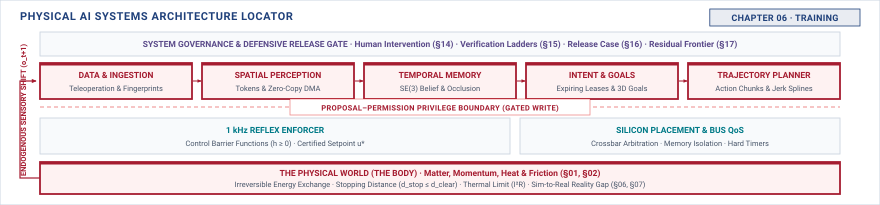

# Training\chaptersubtitle{What Each Way of Making a Policy Charges You} {#sec-training}

{#fig-locator-ch06 fig-pos="H" width=100%}

*What does each way of making a policy buy you, and what does it charge you at deployment?*

<!-- HOOK: one substantive paragraph answering the question above. -->



::: {.callout-objective}
After studying this chapter, you will be able to:

1. State what each training regime buys and what failure mode it charges.
2. Explain why compounding error in behavioural cloning is structural rather than a tuning problem.
3. Treat a simulator as a system component and state its specification and its omissions.
4. Predict a deployment failure mode from a training choice, before the machine exists.

**Core Chapter Takeaway:** Every way of making a policy buys a capability and charges a deployment failure mode. Cloning fails silently off-distribution. Trial-based learning imports a simulator, and everything wrong with the simulator becomes wrong with the policy.

:::

## Introduction {#sec-training-6-1}

<!-- SECTION 6.1 -->
<!-- claim: Every way of making a policy buys a capability and charges a failure mode, and the charge arrives at deployment. -->
<!-- covers: Open with two flow-regulation policies that achieve the same training score but inherit different deployment failures: one leaves demonstrated states after its first correction error, while the other assumes the simulator’s instantaneous valve response. -->
<!-- covers: Define a training regime by the evidence it exposes the policy to, including which states it visits, which outcomes it observes, and who or what supplies the target. -->
<!-- covers: Establish “buy” as a deployment capability and “charge” as a dependency on the data-generating process, reward, simulator, or adaptation environment. -->
<!-- covers: Separate success on the training objective from behavior under the state distribution the deployed policy creates for itself. -->
<!-- covers: Name demonstration, trial-based learning, simulation, and real-machine adaptation as representative regimes rather than an exhaustive algorithm catalog. -->
<!-- covers: State the chapter’s output: a predicted deployment failure, its required detector, and the provenance that must accompany the trained policy. -->
<!-- GROUNDING: mechanism — the regimes named as trades rather than as techniques -->
<!-- FIGURE: A causal chain must show how training evidence creates a learned dependency that becomes a deployment failure when its underlying assumption is violated. -->
<!-- DERIVE: The introduction must trace at least one training assumption through the policy to a physical failure instead of presenting the buy-and-charge formulation as a slogan. -->

<!-- BEGIN -->

<!-- END -->

## Learning from Demonstration {#sec-training-6-2}

<!-- SECTION 6.2 -->
<!-- claim: Cloning behaviour is the cheapest route to a working policy and the one whose failure mode is best understood. -->
<!-- covers: Explain that behavioral cloning fits an action conditional on observations or observation history drawn from demonstrated trajectories; it does not directly fit task completion or recovery. -->
<!-- covers: Use a regulator whose demonstrations remain near the setpoint to show why low held-out action error says nothing about recovery from saturation, delay, or an earlier mistaken command. -->
<!-- covers: Derive the probability of at least one error over \(T\) decisions as \(1-(1-\epsilon)^T\); an illustrative \(\epsilon=0.005\) over 500 decisions produces about a 92 percent chance of at least one error. -->
<!-- covers: Trace how the first erroneous action changes the physical state and therefore changes the next observation, moving the policy away from the distribution on which its error rate was measured. -->
<!-- covers: Derive the standard compounding bound by allowing the probability of being off-distribution at step \(t\) to grow with \(t\epsilon\), then summing across the rollout to obtain order-\(T^2\epsilon\) cumulative cost under the stated assumptions. -->
<!-- covers: Explain why lowering one-step error postpones this process but does not remove the structural dependence on demonstrated state coverage. -->
<!-- covers: Identify the silent signature: the policy continues emitting syntactically valid actions while state occupancy leaves demonstrated support; detection therefore requires validated support or uncertainty telemetry rather than training loss alone. -->
<!-- GROUNDING: number — compounding error over a rollout, and how fast it leaves the distribution -->
<!-- FIGURE: A rollout plot must show one early action error moving the deployed trajectory outside demonstrated state support and increasing subsequent error exposure. -->
<!-- DERIVE: Derive both \(1-(1-\epsilon)^T\) and the assumptions behind the order-\(T^2\epsilon\) compounding bound. -->

<!-- BEGIN -->

<!-- END -->

## Learning by Trial {#sec-training-6-3}

<!-- SECTION 6.3 -->
<!-- claim: You cannot run a million trials on hardware, so trial-based learning imports a simulator and everything wrong with it. -->
<!-- covers: Establish what trial-based learning buys: experience with states produced by the current policy, including failed actions and recovery attempts absent from expert demonstrations. -->
<!-- covers: Compute hardware trial time as \(N(t_{\text{rollout}}+t_{\text{reset}})/P\), where \(P\) is safe parallelism; one million eight-second trials already require about 93 continuous days before reset time. -->
<!-- covers: Convert the same trial count into actuator cycles, contact events, consumed material, energy, and operator resets, then compare each quantity with the machine’s available budget. -->
<!-- covers: Explain that physical exploration changes or damages the system being learned from, so reward collection is not a reversible software operation. -->
<!-- covers: Treat the reward as an interface specification: any measurable proxy it omits or misweights becomes behavior the policy is free to exploit. -->
<!-- covers: Qualify the simulator claim: simulation becomes necessary when the required trial count exceeds hardware time, wear, reset, or risk budgets, not because trial-based learning is categorically impossible on hardware. -->
<!-- covers: State the resulting charge: the policy inherits both the reward’s omissions and the simulator’s account of which actions lead to which outcomes. -->
<!-- GROUNDING: number — trials affordable on hardware against trials required -->
<!-- FIGURE: A log-scale accumulation plot must show where elapsed time, reset labor, and actuator cycles make the required trial count exceed the hardware budget while simulated trials remain affordable. -->
<!-- DERIVE: Derive the hardware affordability boundary from trial duration, reset duration, parallelism, wear per trial, and available machine life instead of asserting that a million trials are unaffordable. -->

<!-- BEGIN -->

<!-- END -->

## The Simulator as a System Component {#sec-training-6-4}

<!-- SECTION 6.4 -->
<!-- claim: A simulator is not a tool used beside the system. It is a component of it, with its own assumptions and its own failure modes. -->
<!-- covers: Define the simulator as a versioned policy-production component whose assumptions remain embedded in the policy even when the simulator is absent at deployment. -->
<!-- covers: Specify its contract at the first budgetable quantities: observation and action interfaces, update period, command delay, actuator limits, sensor errors, reset conditions, termination conditions, and parameter distributions. -->
<!-- covers: Distinguish a modeled value from an omitted mechanism; an omitted delay, compliance, or correlation is unsupported, not implicitly zero. -->
<!-- covers: For a touching machine, specify contact fidelity through errors in contact onset, peak force, impulse, slip, and release rather than through the internal construction of the contact solver. -->
<!-- covers: Identify friction, compliance, backlash, saturation, transport delay, and sensor dropout as candidate omissions whose relevance must be established for the particular policy. -->
<!-- covers: Require paired simulator and hardware probes that apply the same command and compare the resulting traces against declared tolerances. -->
<!-- covers: Record simulator version, solver settings, asset versions, randomization ranges, and known invalid regimes as part of the policy’s identity. -->
<!-- GROUNDING: mechanism — the simulator specified as a component, with its omissions listed -->
<!-- FIGURE: A training-boundary figure must show how simulator assumptions become latent policy dependencies that persist after the simulator is removed from the deployment path. -->
<!-- DERIVE: Replace the universal assertion that contact and friction are “hardest” with paired-trace error budgets showing which mismatches dominate for the worked machine. -->

<!-- BEGIN -->

<!-- END -->

## What the Gap Is Made Of {#sec-training-6-5}

<!-- SECTION 6.5 -->
<!-- claim: Sim-to-real is not one gap. It is several, and they are not equally hard to close. -->
<!-- covers: Define the sim-to-real gap as a vector of task-relevant mismatches rather than a single scalar distance between simulation and reality. -->
<!-- covers: Size dynamics mismatch from paired command-response traces, including response delay, gain, saturation, compliance, and contact impulse at the policy’s operating points. -->
<!-- covers: Size sensing mismatch through bias, noise, dropout bursts, quantization, occlusion, and timestamp error measured under matched physical conditions. -->
<!-- covers: Size appearance mismatch through changes in policy-relevant perceptual outputs under matched geometry, lighting, materials, and camera settings rather than through pixel difference alone. -->
<!-- covers: Size timing mismatch through observation age, command latency, jitter, update-rate variation, and event ordering; identical state transitions at the wrong times are not equivalent experience. -->
<!-- covers: Explain that parameter randomization broadens coverage over mechanisms already represented but cannot create an omitted mechanism, missing correlation, or unrepresented rare event. -->
<!-- covers: End with a supported deployment envelope and an explicit residual mismatch list that becomes input to evaluation, monitoring, and release. -->
<!-- GROUNDING: number — the gap decomposed: dynamics, sensing, appearance, timing, each sized -->
<!-- FIGURE: Four aligned paired-trace panels must show that dynamics, sensing, appearance, and timing mismatches have different units, detectors, and residuals, so no scalar “gap” can represent them faithfully. -->
<!-- DERIVE: Derive each mismatch from paired simulator and hardware measurements with stated tolerances instead of assigning generic sizes to the four categories. -->

<!-- BEGIN -->

<!-- END -->

## Fine-Tuning on the Real Machine {#sec-training-6-6}

<!-- SECTION 6.6 -->
<!-- claim: Adapting a policy on the deployed machine closes an observed gap and charges physical exposure for every sample it takes. -->
<!-- covers: Why adaptation is attractive after a simulator mismatch is measured -->
<!-- covers: What each real sample costs, in wear and in risk -->
<!-- covers: What changes about the evidence when the policy is no longer the one that was evaluated -->
<!-- covers: The record that must be re-opened when a policy is fine-tuned -->
<!-- GROUNDING: number — what each real sample costs in wear and in exposure -->

<!-- BEGIN -->

<!-- END -->

## How Training Choices Go Wrong {#sec-training-6-7}

<!-- SECTION 6.7 -->
<!-- claim: Each regime has a signature failure, and you can predict it before the machine is built. -->
<!-- covers: Give the reader a repeatable inference chain: training exposure, learned dependency, violated deployment condition, observable failure signature, and required detector. -->
<!-- covers: For cloning, trace missing recovery states to state-distribution departure and then to valid-looking but unsupported commands. -->
<!-- covers: For simulated trial, trace an incorrect delay, friction law, contact response, or termination rule to a policy that succeeds by exploiting behavior unavailable on the machine. -->
<!-- covers: For hardware trial, trace reward omission or unsafe exploration to a physically real but unwanted strategy rather than treating real dynamics as protection against specification error. -->
<!-- covers: For fine-tuning, trace narrow adaptation data to regained local capability, censored intervention states, and regression on conditions no longer represented. -->
<!-- covers: Show that hybrid training can move the dominant failure from coverage error to simulator exploitation or forgetting without removing the earlier dependencies. -->
<!-- covers: Require every predicted failure to produce a predeployment test obligation, a runtime observable where detection is possible, and an explicit unsupported condition where it is not. -->
<!-- GROUNDING: failure — each regime's signature failure, predicted before the machine exists -->
<!-- INCIDENT: needs a documented, citable case. Do not invent one. -->
<!-- DERIVE: Derive each signature failure through the inference chain rather than asserting a fixed failure taxonomy for all implementations of a regime. -->

<!-- BEGIN -->

<!-- END -->

## The Training Record {#sec-training-6-8}

<!-- SECTION 6.8 -->
<!-- claim: How the policy was made, on what data, against what simulator, and what that predicts about deployment. -->
<!-- covers: State only the fields this chapter adds to the notebook. The schema, its provenance rules, and its versioning are established in Section 4.10 and are not restated here. -->
<!-- covers: Record the regime sequence, initial checkpoint, objective or reward, stopping rule, and reason each training stage was introduced. -->
<!-- covers: Identify every dataset by version, collection policy, operating conditions, demonstrator or controller source, and the state-action support it actually covers. -->
<!-- covers: Preserve interventions, vetoes, aborted episodes, and truncated trajectories so the record does not silently exclude the states in which the policy required help. -->
<!-- covers: Record simulator version, interface contract, reward definition, solver settings, randomization distributions, and known omissions. -->
<!-- covers: Record real-machine adaptation by hardware configuration, exposure count, changed parameters, retained regression suite, and observed failures. -->
<!-- covers: State the claimed operating envelope and list unobserved, excluded, or weakly supported conditions separately from successful training results. -->
<!-- covers: Connect the record to Chapter 7 evaluation and to the later verification and release case; Chapter 14 should not be named as its sole consumer. -->

<!-- BEGIN -->

<!-- END -->

## Systems Stress-Tests {#sec-training-6-9}

<!-- SECTION 6.9 -->
<!-- claim: A policy that is better by every training metric and worse on the machine. -->
<!-- covers: Present a regulation case in which removing abnormal recovery episodes lowers behavioral-cloning validation error while making the deployed policy less able to recover from the states created by its own mistakes. -->
<!-- covers: Give the training metric, machine-level metric, and state-occupancy change for that case so the reader can reproduce why the rankings reverse. -->
<!-- covers: Present a touching case in which a simulator or reward change raises simulated return by encouraging contact behavior that depends on an unrealistically rigid, immediate, or repeatable contact response. -->
<!-- covers: Compare paired simulator and hardware traces to locate the improvement inside the simulator assumption rather than inside the physical machine. -->
<!-- covers: Show a regime change from cloning to simulated trial that replaces silent off-support drift with exploitation of an omitted simulator mechanism, thereby moving the failure rather than removing it. -->
<!-- covers: Require each stress-test to end with the detector that would expose the reversal and the training-record entry that would have predicted it. -->
<!-- FIGURE: A paired ranking figure must show two policies exchanging order when the metric changes from training performance to the corresponding machine-level outcome. -->
<!-- DERIVE: Demonstrate “better in training and worse on the machine” with paired numerical metrics and a traced mechanism in each case. -->

<!-- BEGIN -->

<!-- END -->

## Summary {#sec-training-6-10}

<!-- SECTION 6.10 -->
<!-- claim: Chapter 7 receives a policy, and the question of whether it works. -->
<!-- covers: Distill behavioral cloning into its purchased capability, dependence on demonstrated state support, and silent off-support failure. -->
<!-- covers: Distill trial-based learning into its purchased recovery experience and its charges in reward specification, exploration exposure, time, and wear. -->
<!-- covers: Distill simulation into scalable experience plus a versioned set of modeled mechanisms, omitted mechanisms, and residual mismatches. -->
<!-- covers: State that fine-tuning can correct observed local mismatch while narrowing support or damaging previously retained capability. -->
<!-- covers: Identify the training record as the chapter’s durable output: enough provenance to predict failures and design evaluation conditions. -->
<!-- covers: Hand Chapter 7 a policy together with its inherited assumptions and unsupported conditions; training evidence alone does not establish that the policy works on the machine. -->

<!-- BEGIN -->

<!-- END -->
