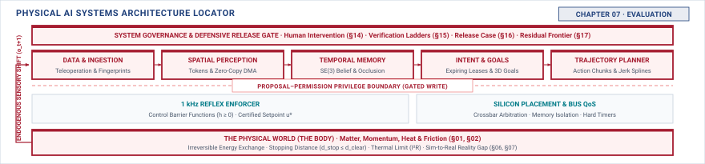

# Evaluation\chaptersubtitle{What Can Be Established About a Policy, and What Cannot} {#sec-evaluation}

{#fig-locator-ch07 fig-pos="H" width=100%}

*How good is this policy, and what does that claim actually cover?*

<!-- HOOK: one substantive paragraph answering the question above. -->



::: {.callout-objective}
After studying this chapter, you will be able to:

1. State what a success rate on N trials actually supports, with its confidence interval.
2. Explain why an open-loop metric misleads in a specific direction.
3. Compute how many trials the claim you want to make would require.
4. State what evaluation cannot establish, and what that implies about monitoring.

**Core Chapter Takeaway:** No evaluation before deployment can establish deployment behaviour, because the policy determines the distribution it will meet. And twenty trials support a far weaker claim than the number feels like it does.

:::

## Introduction {#sec-evaluation-7-1}

<!-- SECTION 7.1 -->
<!-- claim: Evaluation before deployment is necessary, bounded, and far weaker than the numbers make it look. -->
<!-- covers: Open with twenty successes in twenty trials: the observed rate is 100 percent, but the exact one-sided 95 percent lower confidence bound is only 86.1 percent under independent, identically distributed trials. -->
<!-- covers: Separate the recorded fact, “twenty of twenty trials passed,” from the population claim, “the system succeeds with probability at least p.” -->
<!-- covers: State that every evaluation claim depends on a specified policy, machine, condition distribution, outcome rule, and sampling protocol. -->
<!-- covers: Preview the three limits the chapter will establish: open-loop evidence omits feedback, finite trials leave statistical uncertainty, and deployment changes the encountered distribution. -->
<!-- covers: State the useful result positively: predeployment evaluation can support a conditional claim over sampled conditions and expose specific failures. -->
<!-- covers: Turn the limits into an architectural requirement: conditions not established by evaluation must remain observable and enforceable after deployment. -->
<!-- GROUNDING: number — one success rate, and the claim it does and does not support -->
<!-- DERIVE: the 86.1 percent lower bound from the probability p^20 of observing twenty successes, rather than quoting it -->

<!-- BEGIN -->

<!-- END -->

## What You Are Actually Measuring {#sec-evaluation-7-2}

<!-- SECTION 7.2 -->
<!-- claim: Success rate on a task is not a measurement of a policy. It is a measurement of a policy, a machine, an environment, and a day. -->
<!-- covers: Define one trial completely: initial state, route, payload, environmental conditions, policy and software versions, machine configuration, stopping rule, and binary success criterion. -->
<!-- covers: Express the measured success probability as an expectation over the trial distribution, making the sampling protocol part of the quantity being estimated. -->
<!-- covers: Show how lighting, surface friction, battery state, payload, sensor calibration, reset procedure, and operator intervention can change outcomes without changing model weights. -->
<!-- covers: Distinguish ordinary sampling variation from a changed estimand: a different route mixture or machine configuration is not another estimate of the same quantity. -->
<!-- covers: Require the claimed operating conditions to be named before trials are sampled; otherwise the denominator has no defensible population. -->
<!-- covers: Establish the assumptions needed later for confidence bounds, especially independent trial units, fixed outcome definitions, and complete accounting of aborts. -->
<!-- GROUNDING: mechanism — what varies between trials that has nothing to do with the model -->
<!-- FIGURE: How unchanged policy weights produce different success probabilities as the machine configuration, environment distribution, and trial protocol change, showing that the estimand belongs to the whole system -->
<!-- DERIVE: the measured success probability from the explicitly defined joint distribution of trial conditions and show why changing that distribution changes the quantity -->

<!-- BEGIN -->

<!-- END -->

## Open Loop and Closed Loop {#sec-evaluation-7-3}

<!-- SECTION 7.3 -->
<!-- claim: A policy that predicts the demonstrated action well can still fail the moment it is allowed to act. -->
<!-- covers: Define open-loop evaluation as scoring policy outputs on states supplied by recorded demonstrations, so the evaluated policy cannot affect its next input. -->
<!-- covers: Define closed-loop evaluation as repeatedly applying the policy output to a system transition, making each action partly responsible for the next observed state. -->
<!-- covers: Work a moving-platform example in which a persistent 1-degree heading error appears small per prediction but produces about 17 centimeters of lateral displacement over 10 meters. -->
<!-- covers: Trace how the first deviation moves the platform away from demonstrated states, after which the open-loop dataset contains no evidence about the actions the policy will choose. -->
<!-- covers: State the directional result narrowly: open-loop evaluation is optimistically blind to failures caused by self-induced state shift, although action-error metrics can be pessimistic when several actions are equally valid. -->
<!-- covers: Compare the costs and residual uncertainties of recorded replay and closed-loop simulation without treating simulator closure as evidence of hardware fidelity. -->
<!-- GROUNDING: number — an open-loop metric against closed-loop success on the same policy -->
<!-- FIGURE: How a small action error is scored once on demonstrator states in open loop but changes the next state and compounds across a closed-loop rollout -->
<!-- DERIVE: the open-loop blind spot from the state-transition recurrence and the 1-degree trajectory calculation -->

<!-- BEGIN -->

<!-- END -->

## The Evidence Regimes and Their Boundaries {#sec-evaluation-7-4}

<!-- SECTION 7.4 -->
<!-- claim: Recorded replay, simulation, shadow operation, and constrained hardware each establish something different, and none of them establishes deployment. -->
<!-- covers: The four regimes, and the claim each can support -->
<!-- covers: What moves between regimes and what does not -->
<!-- covers: Why climbing a regime is not the same as strengthening a claim -->
<!-- covers: Which regime a given question actually requires -->
<!-- GROUNDING: mechanism — four regimes, and the claim each one can support -->

<!-- BEGIN -->

<!-- END -->

## What Physical Trials Cost, and What They Cannot Cover {#sec-evaluation-7-5}

<!-- SECTION 7.5 -->
<!-- claim: A physical trial costs wall-clock time, wear, and risk, and the machine changes while you run them. That is what limits the evidence, not the arithmetic of confidence. -->
<!-- covers: Budget one trial in the currency that actually binds: wall-clock time, actuator duty, consumables, fixture resets, and the operator hours a hazardous run requires. -->
<!-- covers: Wear-induced nonstationarity: the machine at trial one thousand is not the machine at trial one, so trials are not independent draws from a fixed system and pooling them overstates what they support. -->
<!-- covers: The states you most need are the ones you are least willing to enter, so exposure to hazardous conditions is bounded by something other than statistics. -->
<!-- covers: Correlation through shared fixtures, shared operators, shared software builds, and a shared environment, and why fleet hours are not the independent exposure they are counted as. -->
<!-- covers: Cite the interval arithmetic to a statistics text and state only the conclusion the reader needs: what a given number of clean trials does and does not license. -->
<!-- covers: End on the decision this forces: narrow the claim, buy exposure, or bound the physical authority so that less evidence is required. Chapter 17 works the arithmetic for claims no budget can reach. -->
<!-- GROUNDING: number — the confidence interval on twenty trials, and how many the claim needs -->
<!-- FIGURE: How the exact one-sided 95 percent lower success bound rises with zero-failure trial count, with 20, 299, and 2,995 trials marked -->
<!-- DERIVE: Derive the trial budget from duty cycle, reset time, and wear rate; cite the confidence interval rather than deriving it. -->

<!-- BEGIN -->

<!-- END -->

## What Evaluation Cannot Establish {#sec-evaluation-7-6}

<!-- SECTION 7.6 -->
<!-- claim: No pre-deployment evaluation can establish deployment behaviour, because the policy determines the distribution it will meet. -->
<!-- covers: Write the closed-loop dependency explicitly: the policy selects an action, the action changes the next state, and the resulting state changes what the policy will observe thereafter. -->
<!-- covers: Distinguish the fixed distribution sampled by an evaluation protocol from the state-occupancy distribution induced by a deployed policy. -->
<!-- covers: Explain that closed-loop simulation samples a policy-induced distribution only inside the simulator’s transition model; it does not remove uncertainty about the real machine or world. -->
<!-- covers: State the strongest defensible conclusion: evaluation estimates behavior for the tested system under the sampled conditions, outcome definition, and stated uncertainty. -->
<!-- covers: Show why more trials reduce sampling uncertainty inside that distribution but cannot repair missing conditions, simulator mismatch, or future environmental change. -->
<!-- covers: Convert each boundary of the evaluation claim into a monitoring obligation, such as input support, latency, constraint margin, intervention rate, and environment assumptions. -->
<!-- covers: Require monitoring responses to lead toward escalation, fallback, or refusal outside the supported envelope rather than merely recording the deviation. -->
<!-- GROUNDING: failure — the endogeneity argument, and what evaluation therefore cannot support -->
<!-- FIGURE: How two policies starting from the same state induce different future state distributions, neither of which is fully represented by a fixed predeployment test distribution -->
<!-- DERIVE: the endogenous deployment distribution from the policy-coupled state-transition equation -->

<!-- BEGIN -->

<!-- END -->

## How Evaluation Goes Wrong {#sec-evaluation-7-7}

<!-- SECTION 7.7 -->
<!-- claim: The common failures are not dishonesty. They are a well-chosen environment, a well-timed run, and a metric that answers a different question. -->
<!-- covers: Show environment selection with a policy evaluated only on the widest, best-lit route while the claim silently expands to the full operating envelope; detect it by comparing the condition ledger with the claimed envelope. -->
<!-- covers: Show metric drift when action agreement is reported as task success, even though no closed-loop completion or stopping outcome was measured. -->
<!-- covers: Explain how repeated tuning against the nominal test set turns that set into training evidence; detect it through policy-version and evaluation-history provenance. -->
<!-- covers: Demonstrate unintended cherry-picking through optional stopping: five independent looks at a 5 percent false-positive threshold create a 22.6 percent chance of at least one false positive. -->
<!-- covers: Require all attempted trials, aborts, safety interventions, and operator takeovers to remain in the denominator or be reported explicitly as censored or truncated outcomes. -->
<!-- covers: Distinguish a representative demonstration from a representative sample; a visually convincing run has no special statistical status. -->
<!-- GROUNDING: failure — environment selection, metric drift, and unintended cherry-picking -->
<!-- INCIDENT: needs a documented, citable case. Do not invent one. -->
<!-- DERIVE: the 22.6 percent optional-stopping inflation from 1 minus 0.95 raised to the fifth power -->

<!-- BEGIN -->

<!-- END -->

## The Evaluation Record {#sec-evaluation-7-8}

<!-- SECTION 7.8 -->
<!-- claim: What was measured, under what conditions, with what power, and what it does not support. -->
<!-- covers: State only the fields this chapter adds to the notebook. The schema, its provenance rules, and its versioning are established in Section 4.10 and are not restated here. -->
<!-- covers: Begin the record with the exact claim, its success criterion, its claimed operating conditions, and the population to which the result is meant to generalize. -->
<!-- covers: Record immutable identifiers for model weights, preprocessing, policy configuration, simulator, machine, sensors, firmware, and evaluation code. -->
<!-- covers: Preserve the trial-sampling protocol, randomization or stratification method, reset procedure, dependence structure, and all deviations from the planned protocol. -->
<!-- covers: Report raw outcome counts, aborts, interventions, exclusions, missing observations, and individual trial metadata, not only the aggregate success rate. -->
<!-- covers: State the estimator, confidence method, confidence level, assumptions, supported claim, unsupported claims, and known coverage gaps. -->
<!-- covers: Fill one complete record for the twenty-of-twenty example and demonstrate that another engineer can recompute the bound and discover its limited scope. -->
<!-- covers: Route this record to Chapter 15’s verification argument; Chapter 14 owns human authority and should not be named as the verification chapter. -->

<!-- BEGIN -->

<!-- END -->

## Systems Stress-Tests {#sec-evaluation-7-9}

<!-- SECTION 7.9 -->
<!-- claim: An evaluation that is honest, well-run, and supports nothing. -->
<!-- covers: Give a case in which twenty of twenty runs pass on one route and one day, then require the reader to reject a claim covering different routes, weather, payloads, or machine configurations. -->
<!-- covers: Give a case with 1,000 successes in 1,000 independent trials and a required 99.9 percent minimum success claim; derive that the 95 percent lower bound is only about 99.70 percent. -->
<!-- covers: Require the reader to compute that the zero-failure 99.9 percent claim needs 2,995 trials, nearly two thousand more than the experiment supplied. -->
<!-- covers: Give a high open-loop action-agreement result whose small systematic heading error fails the closed-loop route, and require the reader to identify the missing evidence rather than average the metrics. -->
<!-- covers: For each case, require an exact supported claim, an exact unsupported claim, and the appropriate response: more independent trials, broader condition sampling, a better test regime, or deployment monitoring. -->
<!-- DERIVE: the lower bound and remaining trial requirement in the 1,000-success case -->

<!-- BEGIN -->

<!-- END -->

## Summary {#sec-evaluation-7-10}

<!-- SECTION 7.10 -->
<!-- claim: Part III receives a policy whose limits are known. -->
<!-- covers: Restate that a success rate estimates a defined system under a defined trial distribution, not an isolated policy property. -->
<!-- covers: Preserve the distinction between open-loop prediction quality and closed-loop task behavior. -->
<!-- covers: State that finite trials bound the strength of a reliability claim and that correlated trials provide less evidence than their count suggests. -->
<!-- covers: State that no amount of sampling from a fixed evaluation distribution settles behavior under conditions the deployed policy helps create. -->
<!-- covers: Hand Part III a policy accompanied by a bounded claim, a reproducible evaluation record, named coverage gaps, and explicit monitoring obligations. -->

<!-- BEGIN -->

<!-- END -->
