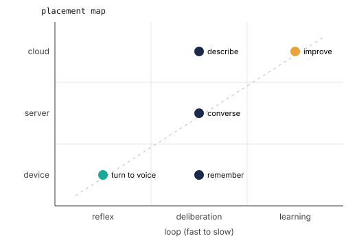

# Placement and Systems

::: {.callout-question}

Where should each capability run, and how do you prove the choice?

:::

Every chapter so far has placed one capability and defended it: tracking on the
device, perception at the knee, meaning weighed against the cloud, the uncertain cases
escalated only when needed, motion kept inside a safety envelope, memory kept
local, improvement pushed off-device. Each was the right call for that capability
in isolation. But the robot does not run one capability at a time. It runs all of
them, on one body, sharing one pool of compute, power, and bandwidth. This chapter
is where the placements meet, and where some that were obviously right alone turn
out to be impossible together.

Placement was the discipline's recurring move. Here it becomes its hardest one,
because now the placements interact.

## The whole map

The artifact that holds them all is the placement map. @fig-placement assembles
the book's capabilities onto one grid: each is placed by which loop it belongs
in, reflex, deliberation, or learning, and which box it runs in, device, server,
or cloud. Reading the map is reading the system. The diagonal is the natural
frontier: fast capabilities sit near the body, slow ones drift toward the cloud,
and a capability far off that line is one you should be ready to defend.

::: {#fig-placement fig-cap="**The placement map**: every capability is placed by loop and by box, and each placement spends some properties to buy others; filling it for a real system is the skill the book has been building toward." fig-alt="A grid with loop from reflex to learning on the horizontal axis and box from device to cloud on the vertical. Capabilities are plotted as dots colored by timescale: track a face at reflex on the device, remember and read meaning and escalate across the deliberation column, and improve at learning in the cloud."}

:::

::: {.column-margin}
**Properties in tension**: all of them, at once. The map is where the elements are
explicitly traded against one another.
:::

The map is not a diagram to admire. It is a worksheet you fill for your own
system, once for the kit you can hold and again for the production robot you are
reading about, so the hero you cannot run is still analyzed by the same budgets as
the kit you can. Even the device row hides a boundary: on the kit it is two
processors, the real-time MCU and the cognitive MPU the preface paired, so a
capability you place on the device still has to choose which of them runs it.

## Placements share a budget

The reason placement gets harder at the system level is that capabilities on the
same box draw from the same finite pool. The budget identity from the foundations
returns, but now it sums across everything placed there:

$$\sum_{c \,\in\, \text{box}} r_c \le R_\text{box}$$

Here $r_c$ is what capability $c$ draws of a shared resource and $R_\text{box}$ is
the box's supply of it. For every such resource, compute, power, and bandwidth,
the demands of all the capabilities you placed on a box have to fit its budget
together. This is
where the isolated decisions collide. Privacy and latency both argued for keeping
the VLM on the device, and so did the tracking loop, and the memory, and the
reflexes. Add up what they each need and the device's compute or power budget
overflows. The placement that was right for meaning alone is impossible once the
control loop also needs the cycles.

So the resolution is not local. You buy a shared budget back by moving some
capability off the device, which spends the privacy or latency you were
protecting to free the compute or power that something else needs more. The map
is where you see that trade whole, instead of discovering it as a robot that
stutters because two placements quietly wanted the same cores. The order is not
arbitrary: place the capability whose binding constraint is tightest first, the
one with the least slack, then fit the rest around it, and when two collide, the
one whose property binds hardest keeps its box. Criticality first turns
guess-and-check into a defensible sequence.

## Re-placing ripples

This is the system effect, and it is the chapter's real lesson: move one
capability and the whole map shifts. Push meaning to the cloud and the device
gets its cycles back, so the control loop holds its deadline again, but now the
frame leaves the room and the response waits on a round trip. Pull improvement
back on-device and you spend power the reflexes wanted. There is no placement that
is locally optimal and globally free. A good system is not a stack of individually
perfect choices; it is a set of placements balanced against one another, each
giving a little so the whole body fits its budgets.

## Build

::: {.callout-build title="Fill the map, then move one thing"}

Instrument the whole robot and fill the placement map with measured numbers, not
guesses: for each capability, its loop, its box, and what it actually costs in
latency, energy, and bytes that leave the device. The map you get is your system's
real design, often different from the one you thought you had.

Then change exactly one placement. Move a capability from the device to the cloud,
or the reverse, and measure the system effect: what budget freed up, what the move
cost elsewhere, whether another capability now fits or now fails. Write the
before-and-after of two budgets and one sentence on whether the system as a whole
got better.

If full instrumentation is out of reach, use the provided per-capability
measurements to fill the map and reason the re-placement through; the decision and
its ripple are the lesson, not the wiring.

:::

## What the number says

The map almost always reveals a placement you cannot afford once everything is on
it, usually a capability you put on the device for good reasons that the device
cannot actually feed alongside the rest. Moving it is not a defeat; it is the
system telling you which property it can spare. The deeper result is that the
robot's character lives in the shape of its map: where its capabilities sit, and
which properties it chose to protect when they could not all be protected at once.
That map, filled and defended with measured numbers, is the deliverable of the
whole discipline.

## Read

The placement question is edge-cloud offloading and computation placement, asked
under tighter, more coupled constraints than a datacenter ever faces; the
measurement habit is the benchmarking discipline of MLPerf carried down to a body;
and the practice of weighing the whole system rather than each part is hardware-
software co-design. None of these is new. What is new is doing all of them at once,
for a system that has to fit a body, a budget, and a home.

::: {.callout-teaching}

- **Hook**: a placement map the students fill in for their own build, capability
  to loop, box, and measured cost. Then have them move one placement and predict
  the ripple before measuring it.
- **Watch**: this chapter retroactively names what every earlier chapter was
  quietly doing. Reference those placements explicitly so it reads as a synthesis,
  not a new topic.
- **Open question**: is this the climax or a lens used throughout? Both: the map is
  foreshadowed from the first placement and formalized here as the whole-system
  view.

:::
