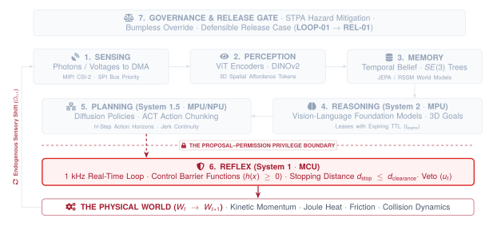

# Real-Time Reflex and Safety Enforcement\chaptersubtitle{Control Barrier Functions, Microsecond Vetoes, and Hardware Interlocks}

{#fig-locator-ch08 width=100% fig-pos="H"}

*Why does a software safety guardrail written in Python fail to stop a robot from injuring a human during an OS memory compaction pause?*

In cloud software systems, safety guardrails are implemented as application-level middleware filters, assertion checks, or wrapper scripts. In Physical AI, software safety checks co-located on a general-purpose operating system share the same execution thread, memory bus, and scheduling vulnerability as the neural models they are meant to supervise. When the host OS suffers a memory compaction stall, thread preemption, or runtime crash, unmanaged motor registers remain latched and moving mass crashes into the environment. Physical AI solves this structural failure through the Proposal–Permission Privilege Split: high-capacity neural models propose actions from an untrusted Linux domain, while a dedicated, bare-metal microcontroller executing in zero-allocation static SRAM holds exclusive electrical authority to evaluate Control Barrier Functions and veto hazardous commands in sub-millisecond real time.



::: {.callout-objective}
By the conclusion of this chapter, you will be able to:

1. **Implement Zero-Allocation 1000 Hz MCU Enforcers:** Construct hard real-time safety filters on dedicated ARM Cortex-M4 microcontroller silicon with bounded execution latency ($< 200\,\mu\text{s}$) and zero dynamic heap allocation.
2. **Formulate Control Barrier Functions (CBFs):** Derive continuously differentiable barrier functions $h(x) \ge 0$ that guarantee the forward invariance of safe operating sets $\mathcal{C}$ under control-affine dynamics.
3. **Solve Minimal-Intervention Quadratic Programs (QPs):** Project unverified candidate action proposals ($p_t$) emitted by high-capacity neural models onto admissible safety half-spaces ($\mathcal{U}_{\text{safe}}$) using closed-form KKT active-set solvers.
4. **Enforce Dynamic Stopping Envelopes ($d_{\text{stop}}$):** Intercept and veto trajectory proposals that violate clearance margins relative to stationary and moving obstacles before physical contact occurs.
5. **Architect Standardized Fallback Escalations:** Realize the IEC 60204-1 emergency stop hierarchy—from Category 2 closed-loop position holds to Category 1 controlled deceleration halts (SS1) and Category 0 hardware Safe Torque Off (STO).
6. **Execute Asynchronous Re-Anchoring Handshakes:** Synchronize the Linux MPU trajectory planner following safety interventions to eliminate integral windup and prevent policy covariate shift in telemetry logs.

**Core Chapter Takeaway:** When learned models hallucinate or host operating systems stall, physical safety cannot rely on application-layer software checks; it requires dedicated bare-metal microcontroller enforcers evaluating Control Barrier Functions in sub-millisecond static SRAM.
:::

## The Final Authority: Deterministic Invariants at the Physical Edge

In modern embodied AI, foundation models—Vision-Language-Action (VLA) transformers, diffusion policies, and large multimodal reasoning graphs—demonstrate remarkable semantic versatility. They can parse open-vocabulary natural language commands, identify novel objects under cluttered lighting, and generate complex multi-step manipulation trajectories.

Yet from a systems engineering perspective, every neural network is an untrusted, stochastic proposal service. A neural policy is a statistical function approximator trained over finite empirical datasets. When exposed to out-of-distribution optical glare, physical contact occlusions, or sensor calibration drift, neural activations can produce arbitrarily dangerous outputs—commanding maximum motor torque directly into a rigid fixture or accelerating an arm into a human operator's workspace.

The central systems insight of Physical AI is that we do not attempt to make neural foundation models mathematically bulletproof. Instead, we cage them. We partition the machine across heterogeneous silicon: the high-capacity, stochastic neural models run on an application processor (Linux MPU) as System 2 (deliberation) and System 1.5 (trajectory generation), while an incorruptible, deterministic mathematical gatekeeper runs on a dedicated microcontroller (bare-metal MCU) as System 1 (real-time reflex).

| Subsystem Domain | Architectural Responsibility & Hardware Substrate | Output Artifact & Privilege Level |
| :--- | :--- | :--- |
| **Linux MPU (System 2 / 1.5)** | Stochastic foundation models (VLMs, Diffusion Policies, ACT) running in user space on Cortex-A / NPU cores | **Untrusted Action Proposals ($p_t$):** Zero direct electrical routing to motor gate drivers |
| **Shared SRAM Mailbox** | Pinned, non-cached internal memory buffer with atomic hardware sequence counters | Lock-free IPC boundary isolating MPU stalls from real-time execution |
| **Bare-Metal MCU (System 1)** | Deterministic 1000 Hz zero-heap Control Barrier Function QP solver on Cortex-M / RISC-V core | **Permitted PWM Setpoints ($u_t$):** Sole electrical authority over inverter gate-driver hardware |

: Heterogeneous Silicon Partitioning across the Proposal-Permission Privilege Boundary. Structural separation of non-deterministic deliberation from hard real-time safety enforcement. {#tbl-silicon-partitioning}

This Proposal–Permission boundary binds identically across all three canonical archetypes: in mobility systems, enforcing aerodynamic geofences and stopping distances; in contact manipulation, detecting axial force spikes to protect gear teeth; and in cybernetic energy, clamping IGBT currents before thermal accumulation triggers semiconductor breakdown.

## Dynamic Stopping Kinematics and Actuator Current Clamps

At every millisecond tick, the microcontroller evaluates whether current kinetic momentum allows the machine to stop before reaching an obstacle, and whether the required currents will exceed thermal limits.

**Dynamic Stopping Distance Envelopes ($d_{\text{stop}}$)**

The required stopping distance incorporates both the reaction delay and the kinematic deceleration:

$$d_{\text{stop}}(t) = \underbrace{v(t) \cdot t_{\text{delay}}}_{\text{Linear Reaction Distance}} + \underbrace{\frac{v(t)^2}{2 \cdot a_{\max}}}_{\text{Quadratic Braking Distance}}$$

For safety, the fundamental invariant $d_{\text{stop}} \le d_{\text{clearance}}$ must be maintained at all times.

| Operating Clearance Margin | Physical Boundary Condition | Enforcer Action |
| :--- | :--- | :--- |
| **Nominal Execution Zone** | $d_{\text{clearance}} \ge d_{\text{stop}}(v) + d_{\text{margin}}$ | Permits candidate action proposal $u_t = p_t$ without modification. |
| **Approach Velocity Clamping** | $d_{\text{stop}}(v) < d_{\text{clearance}} \le d_{\text{stop}}(v) + d_{\text{margin}}$ | Dynamically clamps maximum commanded velocity to $v_{\text{admissible}} = \sqrt{2 a_{\max}(d_{\text{clearance}} - d_{\text{margin}})}$. |
| **Safety Clearance Breach** | $d_{\text{clearance}} \le d_{\text{stop}}(v)$ | **Safety Veto:** Intercepts proposal immediately; triggers **IEC 60204-1 Category 1 Deceleration Halt**. |

: Dynamic stopping distance operating regimes. The real-time enforcer transitions continuously between full task authority, velocity scaling, and emergency deceleration halts. {#tbl-stopping-regimes}

**Actuator Current Clamps and Thermal Protection**

In addition to kinematic limits, sustained stall torques can overheat motor windings and destroy power electronics. The MCU implements a firmware $I^2t$ thermal accumulation current clamp, estimating stator Joule heating over time and gracefully folding back current limits before hardware thermal limits are reached.

**The IEC 60204-1 Standardized Fallback Escalation**

{#fig-fallback-hierarchy width=100%}

| Escalation Level | IEC 60204-1 Standard | Activation Trigger | Hardware Mechanism | Mechanical Consequence |
| :--- | :--- | :--- | :--- | :--- |
| **Level 0** | **Nominal Execution** | $h(x) \ge 0$, $d_{\text{clear}} > d_{\text{stop}}$, unexpired TTL lease | 1000 Hz Minimal-Intervention QP | Actuators energized; full task tracking authority. |
| **Level 1** | **Category 2 Stop** | Intent lease expiry ($t > t_{\text{expire}}$), missing IPC heartbeat ($>15\text{ ms}$) | Closed-loop PID coordinate hold | Actuators remain energized; holds position $x_{\text{hold}}$. |
| **Level 2** | **Category 1 Stop (SS1)**| Clearance breach ($d_{\text{clear}} \le d_{\text{stop}}$), barrier violation $h(x) < 0$ | Active dynamic braking ($a_{\max}$) | Machine decelerates to $v=0$; power de-energized. |
| **Level 3** | **Category 0 Stop (STO)**| Physical E-Stop, watchdog trip ($>50\text{ ms}$), current spike | Hardware optocoupler cuts `EN_GATE` in $<5\,\mu\text{s}$ | Gate power cut; mechanical friction brakes clamp. |

: The 4-tier emergency stop and hardware interlock matrix. Standardized fallback escalations ensure that mild timing jitter results in controlled position holds, while severe boundary breaches trigger hardware power isolation. {#tbl-fallback-matrix}

## Real-Time Control Barrier Functions and Zero-Heap Solvers

While empirical AI safety often relies on reward loss penalties during training, a penalty does not prevent an edge-case failure during deployment. Physical safety cannot be a soft reward; it must be a mathematical guarantee. To provide provable safety guarantees for continuous physical systems, Physical AI leverages **Control Barrier Functions (CBFs)** [@ames2019control; @ames2014control].

**Forward Invariance and the Safe Set $\mathcal{C}$**

Consider a non-linear, control-affine physical system governed by differential state equations:

$$\dot{\mathbf{x}} = f(\mathbf{x}) + g(\mathbf{x})\mathbf{u}$$

where $\mathbf{x} \in \mathcal{D} \subset \mathbb{R}^n$ represents the physical state vector (positions, velocities, temperatures) and $\mathbf{u} \in \mathcal{U} \subset \mathbb{R}^m$ represents the control input vector (motor torques, voltage commands).

We define an admissible **Safe Set $\mathcal{C}$** as the super-level set of a continuously differentiable scalar function $h: \mathcal{D} \to \mathbb{R}$:

$$\begin{aligned}
\mathcal{C} &= \{\mathbf{x} \in \mathcal{D} : h(\mathbf{x}) \ge 0\} \\
\partial \mathcal{C} &= \{\mathbf{x} \in \mathcal{D} : h(\mathbf{x}) = 0\} \\
\text{Int}(\mathcal{C}) &= \{\mathbf{x} \in \mathcal{D} : h(\mathbf{x}) > 0\}
\end{aligned}$$

The set $\mathcal{C}$ is **forward invariant** if for every initial state $\mathbf{x}(0) \in \mathcal{C}$, the trajectory remains within the safe set for all future time: $\mathbf{x}(t) \in \mathcal{C}, \; \forall t \ge 0$. According to the formal CBF definition, $h(\mathbf{x})$ is a valid Control Barrier Function if there exists an extended class-$\mathcal{K}_\infty$ function $\alpha(\cdot)$ such that:

$$\sup_{\mathbf{u} \in \mathcal{U}} \left[ L_f h(\mathbf{x}) + L_g h(\mathbf{x})\mathbf{u} + \alpha(h(\mathbf{x})) \right] \ge 0$$

where $L_f h(\mathbf{x}) = \nabla h(\mathbf{x}) \cdot f(\mathbf{x})$ and $L_g h(\mathbf{x}) = \nabla h(\mathbf{x}) \cdot g(\mathbf{x})$ are the Lie derivatives of $h$.

**Minimal-Intervention Quadratic Program (CBF-QP)**

At every 1 ms control cycle, the microcontroller receives an unverified candidate action proposal $p_t$ from the Linux MPU. The microcontroller computes the safe permitted control setpoint $u_t^*$ by solving a **Minimal-Intervention Quadratic Program (QP)**:

$$u_t^* = \arg\min_{\mathbf{u} \in \mathcal{U}} \frac{1}{2} \|\mathbf{u} - p_t\|^2$$

$$\text{subject to} \quad L_f h_k(\mathbf{x}) + L_g h_k(\mathbf{x})\mathbf{u} + \alpha_k(h_k(\mathbf{x})) \ge 0, \quad \forall k \in \{1, \dots, K\}$$

When the proposal $p_t$ is safe, the solver permits the candidate command unmodified ($u_t^* = p_t$). When $p_t$ threatens to breach a barrier, the QP minimally projects $p_t$ onto the boundary of the admissible half-space.

**Zero-Heap Execution**

{#fig-timing-waterfall width=100%}

Executing these solvers inside an embedded microcontroller requires strict silicon discipline: zero dynamic heap allocation (`malloc = 0`). All data structures and matrix buffers are statically allocated in Tightly Coupled Memory (TCM). The closed-form KKT active-set solvers execute in sub-millisecond static SRAM, ensuring a bounded worst-case execution time ($\text{WCET} \le 250\,\mu\text{s}$).

```c
// BARE-METAL 1000 Hz CBF SAFETY FILTER (STM32 ARM Cortex-M4 / FreeRTOS)
// Statically allocated memory arena - Zero Dynamic Heap Allocation
void cbf_safety_filter_tick(const RobotState_t *state, 
                           const float p_t[NUM_ACTUATORS], 
                           float u_permitted[NUM_ACTUATORS],
                           bool *is_intervention) {
    *is_intervention = false;
    for (int i = 0; i < NUM_ACTUATORS; i++) u_permitted[i] = p_t[i];

    evaluate_geofence_barriers(state);

    for (int k = 0; k < NUM_BARRIERS; k++) {
        float h = s_barriers[k].h_val;
        float Lf = s_barriers[k].Lf_h;
        float *Lg = s_barriers[k].Lg_h;
        float alpha_h = CBF_GAMMA_ALPHA * h;

        float Lg_u = 0.0f, Lg_Lg = 0.0f;
        for (int i = 0; i < NUM_ACTUATORS; i++) {
            Lg_u += Lg[i] * u_permitted[i];
            Lg_Lg += Lg[i] * Lg[i];
        }
        float cbf_lhs = Lf + Lg_u + alpha_h;

        if (cbf_lhs < 0.0f && Lg_Lg > 1e-6f) {
            float lambda_star = -cbf_lhs / Lg_Lg;
            for (int i = 0; i < NUM_ACTUATORS; i++) {
                u_permitted[i] += lambda_star * Lg[i];
            }
            *is_intervention = true;
        }
    }
}
```

## Systems Failure Anatomy: The Late Commanded Deceleration

The necessity of this architecture is highlighted by real-world failures.

::: {.callout-autopsy title="The Late Commanded Deceleration"}
**Platform:** 6-DoF Articulated Material-Handling Arm ($v = 1.8\text{ m/s}$).
**Failure Mechanism:** When an obstacle appeared at $d_{\text{clearance}} = 0.280\text{ m}$, the high-level policy experienced a $140\text{ ms}$ tail latency spike due to background Linux dirty page writeback and memory compaction across the shared LPDDR4 bus.
**Root Cause:** During the blackout, the arm coasted unguided for $0.252\text{ m}$ before braking began, leaving only $0.028\text{ m}$ of clearance when $0.081\text{ m}$ of quadratic braking was required.
**Physical Consequence:** The arm smashed into the steel fixture at $0.92\text{ m/s}$ ($3.4\text{ kN}$ dynamic impact), fracturing the harmonic drive flexspline and bending the elbow link ($7,200\text{ USD}$ overhaul).
:::

{#fig-manipulator-ch08 width=85%}

| Timestamp | Subsystem & Substrate | Recorded State / Telemetry Event | Physical Implication |
| :--- | :--- | :--- | :--- |
| **$T - 0.140\text{ s}$** | Optical ToF Sensor | Detects obstacle intrusion at $d_{\text{clearance}} = 0.280\text{ m}$. | Range data dispatched to Linux MPU driver. |
| **$T - 0.125\text{ s}$** | Linux MPU Kernel | Dirty page writeback triggers memory compaction; user-space planning thread suspended. | $140\text{ ms}$ perception-planning blackout begins. |
| **$T - 0.040\text{ s}$** | Arm Actuators / Linkage | Arm continues coasting forward at $v = 1.8\text{ m/s}$ along un-cancelled trajectory chunk. | Reaction displacement consumes $0.252\text{ m}$ of clearance. |
| **$T - 0.010\text{ s}$** | Linux MPU / Planning Thread | Planning thread resumes; emits emergency stop command to motor drivers. | Remaining clearance is only $0.028\text{ m}$ ($2.8\text{ cm}$). |
| **$T + 0.000\text{ s}$** | Manipulator Wrist / Fixture | Arm strikes steel fixture plate at $0.92\text{ m/s}$ ($3.4\text{ kN}$ dynamic impact). | Harmonic drive flexspline fractures ($7,200\text{ USD}$ overhaul). |
| **Root Cause** | *Systems Bottleneck* | Monolithic software safety supervisor suspended during Linux kernel memory compaction tail blowout ($140\text{ ms}$). |
| **Architectural Flaw** | *Privilege & Co-Design* | Absence of an autonomous bare-metal MCU supervisor evaluating real-time dynamic stopping distance ($d_{\text{stop}}$) at 1000 Hz. |

: Flight-Recorder Telemetry Ledger: The Late Commanded Deceleration Incident. Tracing non-deterministic OS latency tails to mechanical gearbox fracture. {#tbl-telemetry-ch08}

## The Safety Enforcement Interface & Co-Design Checkpoint

To establish a deterministic, hardware-isolated boundary between candidate trajectory proposals and physical motor inverters, the execution subsystem formalizes the **Permitted Inverter Voltages & Gate Signals Contract ($u_t^*$)**.

| Subsystem Domain | Architectural Parameter | Guaranteed Invariant & Verification Boundary |
| :--- | :--- | :--- |
| **MCU Timing Loop** | `freq_hz`<br>`max_exec_us`<br>`heap_bytes` | $1000.0\text{ Hz} \pm 5\,\mu\text{s}$<br>$\text{WCET} \le 175.0\,\mu\text{s}$ ($17.5\%$ load)<br>**$0\text{ Bytes}$ (Static SRAM Only)** |
| **CBF Invariants** | `geofence_box`<br>`min_clear_m`<br>`max_force_n`<br>`cbf_gamma` | $[[-0.35, 0.35], [0.10, 0.60], [0.00, 0.50]]$<br>$0.015\text{ m}$ ($15\text{ mm}$ floor)<br>$12.5\text{ N}$ continuous<br>$\gamma = 15.0\text{ s}^{-1}$ (Class-$\mathcal{K}$) |
| **Stopping Envelope** | `max_decel`<br>`reaction_ms`<br>`margin_m` | $4.0\text{ m/s}^2$ ($a_{\max}$ braking)<br>$12.0\text{ ms}$ (Total delay)<br>$0.020\text{ m}$ ($20\text{ mm}$ buffer) |
| **Fallback Levels** | `cat2_hold_kp`<br>`cat1_decel`<br>`cat0_sto_pin`<br>`watchdog_ms` | $180.0\text{ Nm/rad}$ (Stiffness)<br>$4.0\text{ m/s}^2$ controlled decel<br>`GPIO_PB12` ($<5\,\mu\text{s}$ cut)<br>$15.0\text{ ms}$ heartbeat trip |
| **IPC Re-Anchoring** | `flag_addr`<br>`handshake_ms`<br>`hmac_enabled` | `0x38000400` (Non-Cache SRAM)<br>$25.0\text{ ms}$ flush budget<br>`true` (Cryptographic Lineage) |

: The Real-Time Safety Enforcement Contract Specification ($u_t^*$). Quantitative barrier parameters, dynamic stopping bounds, and hardware interlock mechanisms bridging Planning to Physical Inverters. {#tbl-enf01-ledger}

**The Execution Co-Design Checkpoint Ledger**

We conclude the Execution stage by auditing its resolution across all foundational physical constraints in our 5-column matrix checkpoint:

| Physical Constraint | Execution Systems Tension | Chapter 8 Architectural Resolution |
| :--- | :--- | :--- |
| **Time & Freshness** | Stochastic OS scheduling ($>200\text{ ms}$) blinds safety monitors. | **1 kHz Hard Real-Time Timer Tick ($\text{WCET} \le 175\,\mu\text{s}$)** on isolated MCU. |
| **Inertia & Stopping** | Moving mass requires finite stopping distance before collision. | **Real-Time Dynamic Stopping Distance Invariant ($d_{\text{stop}} \le d_{\text{clearance}}$)**. |
| **Actuation & Jerk** | Second-order motor dynamics limit instantaneous torque response. | Exponential Control Barrier Functions (ECBFs) incorporating velocity state. |
| **Energy & Thermal** | Sustained stall torques overheat motor windings and trip MOSFETs. | Firmware $I^2t$ thermal accumulation current clamping in static SRAM. |
| **Silicon Determinism** | Dynamic memory heap fragmentation crashes long-running controllers. | **Iron Law of Zero-Heap Execution (`malloc = 0`)** in pre-allocated SRAM. |

: Execution Co-Design Checkpoint Ledger. Systematic architectural accounting of real-time execution across the physical constraints. {#tbl-execution-matrix-checkpoint}

::: {.callout-fallacy title="A Policy Trained with Safety Penalties Does Not Need a Hardware Enforcer"}
* **The Fallacy:** Deep reinforcement learning policies trained with collision penalties provide complete safety without needing external hardware filters.
* **The Physical Reality:** Neural policies are stochastic function approximators. While reward penalties reduce collision probabilities in training, they provide zero formal guarantees against out-of-distribution hallucinations or sensor dropouts. Physical safety requires hard mathematical barriers enforced independently in silicon [@ames2019control].
:::

::: {.callout-fallacy title="Implementing Safety Checks in Python or ROS 2 Provides Adequate Protection"}
* **The Fallacy:** Software safety monitors written in Python or C++ on standard Linux provide dependable collision avoidance.
* **The Physical Reality:** Kernel scheduling jitter, memory compaction, and garbage collection introduce multi-millisecond tail latency spikes ($P_{99.9} > 200\text{ ms}$). During an OS freeze, unmanaged motor commands drive gate drivers. Safety enforcement must reside on a bare-metal microcontroller with bounded WCET ($< 250\,\mu\text{s}$).
:::

::: {.callout-fallacy title="Software Collision Detection Can Replace Hardware Safe Torque Off (STO)"}
* **The Fallacy:** High-level collision detection algorithms can replace physical hardware emergency stops.
* **The Physical Reality:** Software collision detection relies on intact CPUs, uncorrupted firmware, and active memory buses. In a firmware lockup or power stage short circuit, software cannot de-energize actuators. Hardware STO provides a physically isolated, optocoupler-gated power cut with zero software dependency.
:::

## Chapter Summary and Part II Synthesis

With the completion of Chapter 8, we conclude **Part II: Physical Agent Architecture**. Across Chapters 4 through 8, we have traversed the cognitive stages of embodied intelligence top-down, establishing the five canonical sensory-motor organs:

1. **Chapter 4 (Perceive):** We resolved the spatial grounding boundary, transforming raw analog photon fluxes into 3D metric affordance tokens in $SE(3)$ using zero-copy DMA ring buffers and hardware PTP exposure midpoints.
2. **Chapter 5 (Remember):** We resolved the temporal persistence boundary, maintaining dynamic $SE(3)$ coordinate frame trees, latent world models, and expanding spatial uncertainty envelopes during visual dropouts.
3. **Chapter 6 (Reason):** We resolved the semantic deliberation boundary, converting open-vocabulary foundation model goals into bounded kinematic proposals protected by time-bounded Expiring Intent Leases ($\mathcal{L}_{\text{intent}}$).
4. **Chapter 7 (Plan):** We resolved the delay amortization boundary, decoding multi-step action chunks ($H=16$) smoothed by $\mathcal{C}^2$ quintic polynomial splines to eliminate mechanical jerk and protect gearboxes.
5. **Chapter 8 (Execute):** We resolved the deterministic physical invariant boundary, implementing zero-allocation 1 kHz Control Barrier Function filters on bare-metal microcontroller silicon to enforce absolute physical safety.

Having engineered the individual sensory-motor organs, we now advance to **Part III: System Integration, Deployment, and Governance**. In **Chapter 9 (Silicon Placement and Memory Fabrics)**, we examine the whole-system integration challenge: placing multi-rate cognitive workloads across heterogeneous compute tiers, managing unified memory interconnect contention, and budgeting system-wide energy and thermal dissipation.
