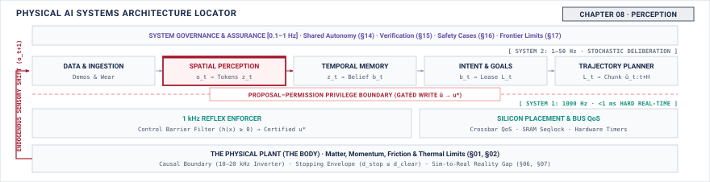

# Perception\chaptersubtitle{What an Observation Must Carry} {#sec-perception}

{#fig-locator-ch08 fig-pos="H" width=100%}

*When was this taken, where from, and how wrong might it be?*

<!-- HOOK: one substantive paragraph answering the question above. -->



::: {.callout-objective}
After studying this chapter, you will be able to:

1. State the three properties every observation must carry and explain what breaks when each is missing.
2. Account for the age accumulated between transduction and use, stage by stage.
3. Compute what a capture configuration costs in bandwidth and name what it takes that from.
4. Name the failure modes of perception and identify which are detectable at runtime.

**Core Chapter Takeaway:** An observation without an age, a frame, and an uncertainty is not usable, and the cost of producing one is taken from the same bus everything else is competing for.

:::

## Introduction {#sec-perception-8-1}

<!-- SECTION 8.1 -->
<!-- claim: The policy Part II produced may implement one of these stages, several, or all of them at once. What follows specifies what each stage must guarantee, not that each must be a separate module. -->
<!-- covers: Open on the joint: Part II delivered a policy with a record attached, and that record is the input to every contract in this chapter. -->
<!-- covers: An end-to-end policy and a staged stack are the same machine at different granularities; the stages are responsibilities that must be discharged somewhere, not boxes that must exist. -->
<!-- covers: What you lose when a stage is implicit: you cannot inspect it, bound it, expire it, or refuse on it. -->
<!-- covers: Why enforcement is the one responsibility that can never be absorbed into the policy, which is the thread Part III follows to its end. -->
<!-- covers: Set up perception as the first handoff: what the machine is allowed to believe it saw, and when it saw it. -->
<!-- GROUNDING: mechanism — the three properties an observation carries, and what each is for -->
<!-- FIGURE: A timeline showing accumulated latency at each physical and software stage between photon arrival and downstream model consumption. -->

<!-- BEGIN -->

<!-- END -->

## What Perception Hands Over {#sec-perception-8-2}

<!-- SECTION 8.2 -->
<!-- claim: Downstream cannot use a measurement it cannot date, locate, or bound. -->
<!-- covers: Contrast raw sensor measurements with the state representations required by downstream control, planning, and memory subsystems. -->
<!-- covers: Define the capture timestamp property ($t_0$) at the integration midpoint and show how using arrival time ($t_{\text{recv}}$) injects phase lag and tracking instability into downstream estimators. -->
<!-- covers: Define the reference frame property ($\mathcal{F}_{\text{sensor}}$ relative to $\mathcal{F}_{\text{body}}$) and explain why uncalibrated mounting extrinsics cause spatial planning errors. -->
<!-- covers: Define the uncertainty envelope property ($\Sigma_z$) and explain how downstream optimizers fail when sensor noise is treated as ground truth. -->
<!-- covers: Establish the handoff contract: downstream components must reject any observation lacking a timestamp, frame identifier, and validity envelope. -->
<!-- GROUNDING: mechanism — the three properties, and what breaks downstream when each is missing -->
<!-- FIGURE: A comparison showing state estimation trajectory tracking error when fed true capture-time observations versus arrival-time observations for a moving body. -->
<!-- DERIVE: The tracking error $\Delta x = v \cdot \tau$ induced when downstream state estimators treat delivery time as capture time for a body moving at velocity $v$ over transport delay $\tau$. -->

<!-- BEGIN -->

<!-- END -->

## Transduction and Sampling {#sec-perception-8-3}

<!-- SECTION 8.3 -->
<!-- claim: Lag has already accumulated before software receives anything at all. -->
<!-- covers: Model physical exposure as a temporal integral over interval $t_{\text{exp}}$, establishing that every frame is a time-averaged measurement rather than an instantaneous snapshot. -->
<!-- covers: Compare global shutter exposure with rolling shutter line-by-line readout, showing how body motion during readout introduces spatial distortion across the image plane. -->
<!-- covers: Trace serialization and transport delays across physical camera interfaces (MIPI CSI-2, GMSL2, USB3, and GigE Vision) into receiver buffers. -->
<!-- covers: Analyze clock domain crossing and quantify oscillator drift between sensor internal crystals and host CPU/SoC monotonic system clocks. -->
<!-- covers: Establish hardware synchronization mechanisms, comparing software polling against hardware GPIO triggers and IEEE 1588 PTP network timestamping. -->
<!-- covers: Account for the total age of a frame at the exact moment DMA completes in host memory: $t_{\text{age}} = t_{\text{exp}}/2 + t_{\text{readout}} + t_{\text{transport}}$. -->
<!-- GROUNDING: number — exposure and rolling shutter as skew, in millimetres at a speed -->
<!-- FIGURE: A geometric diagram showing rolling shutter scanline distortion on a vertical object passed at speed, mapping row index to spatial displacement. -->
<!-- DERIVE: The spatial skew $\Delta x(y) = v \cdot y \cdot t_{\text{row}}$ across scanlines and the motion blur width $\Delta x_{\text{blur}} = v \cdot t_{\text{exp}}$ as functions of body velocity $v$. -->

<!-- BEGIN -->

<!-- END -->

## The Cost of Ingestion {#sec-perception-8-4}

<!-- SECTION 8.4 -->
<!-- claim: Getting a frame into memory takes bandwidth from the same resource the permission path needs, and the quantity that matters is the delay that imposes on a refusal. -->
<!-- covers: Trace one sensor stream end to end and convert it into two numbers only: the age it adds to the observation, and the delay it imposes on the enforcement path competing for the same resource. -->
<!-- covers: Derive the maximum admissible ingestion load from the enforcement deadline and the slack measured in Chapter 2, rather than from what the interface can sustain. -->
<!-- covers: Show why the interesting quantity is burst behaviour rather than average bandwidth, because an average that fits can still push one refusal past its deadline. -->
<!-- covers: State the design consequence: resolution, frame rate, and sensor count are safety parameters, because each is a withdrawal from the budget that pays for refusing. -->
<!-- covers: Name the implementation mechanisms and stop there, citing a systems text. How a descriptor chain is programmed is below the floor. -->
<!-- GROUNDING: number — bandwidth for one capture configuration, against what the bus has -->
<!-- FIGURE: A memory subsystem diagram showing camera DMA streams, OS page caches, and neural inference engines contending for memory controller bandwidth. -->
<!-- DERIVE: Derive the admissible ingestion load from the enforcement deadline and measured slack, not from interface throughput. -->

<!-- BEGIN -->

<!-- END -->

## Spatial Error and Physical Clearance {#sec-perception-8-5}

<!-- SECTION 8.5 -->
<!-- claim: A spatial error is not a number in a representation. Used to authorize motion, it becomes a displacement, and it is spent out of the same clearance that keeps the machine off the obstacle. -->
<!-- covers: Convert each source of spatial error into millimetres of displacement at the point of contact: scale error, frame error, calibration drift, and depth uncertainty. -->
<!-- covers: Propagate it: show how an error at the sensor becomes an error at the end effector through the transform chain, and which term dominates at realistic distances. -->
<!-- covers: Subtract it from clearance. The margin an enforcer defends must be inset by the spatial error of everything upstream of it, and a margin that has not been inset is a fiction. -->
<!-- covers: State the units contract that makes this checkable at an interface: what the number means, in which frame, at which epoch, with what stated uncertainty. -->
<!-- covers: Name the condition under which spatial error must revoke permission rather than merely widen a margin, which is when the error is unbounded or unknown rather than large. -->
<!-- covers: Cite projection, triangulation, and rigid-transform mathematics to a vision or robotics text. The book consumes the error term and does not derive it. -->
<!-- GROUNDING: mechanism — metric grounding, and what depth unprojection assumes -->
<!-- FIGURE: A plot showing depth estimation error scaling quadratically with distance for stereo vision versus constant error for time-of-flight LiDAR. -->
<!-- DERIVE: Derive the clearance inset from the propagated spatial error; cite the projection and triangulation mathematics that produce the error term. -->

<!-- BEGIN -->

<!-- END -->

## How Observations Go Wrong {#sec-perception-8-6}

<!-- SECTION 8.6 -->
<!-- claim: Most perception failures are silent, and a timestamp that lies is worse than a frame that is missing. -->
<!-- covers: Classify perception failures into detectable faults (frame drop, CRC error, timeout) versus silent failures (motion blur, lens flare, optical saturation, out-of-distribution hallucinations). -->
<!-- covers: Analyze physical degradation modes: dynamic range saturation under direct sunlight, low-light SNR collapse, and lens occlusion from rain, dust, or mud. -->
<!-- covers: Analyze transport and timing failures: packet drops, deserializer bit slips, clock jitter, and corrupted timestamps that misreport observation age. -->
<!-- covers: Construct runtime health monitors: pixel intensity histograms, watchdog timers, optical flow plausibility limits, and cross-sensor IMU consistency checks. -->
<!-- covers: Analyze the fundamental boundary of runtime monitors: why single-sensor self-monitoring cannot detect in-distribution semantic errors or optical illusions. -->
<!-- covers: Present a real-world incident case study where an undetected perception failure (such as sensor clock desynchronization or unflagged saturation) propagated directly to an actuator command. -->
<!-- GROUNDING: failure — blur, saturation, dropout, desynchronisation, and a timestamp that lies -->
<!-- INCIDENT: needs a documented, citable case. Do not invent one. -->
<!-- FIGURE: A taxonomy matrix categorizing perception failure modes by observability, detection latency, and required mitigation strategy. -->
<!-- DERIVE: The state estimation error bound $\Delta p = v \cdot \delta t + \frac{1}{2} a \cdot (\delta t)^2$ resulting from an undetected clock desynchronization $\delta t$ under velocity $v$ and acceleration $a$. -->

<!-- BEGIN -->

<!-- END -->

## The Observation Record {#sec-perception-8-7}

<!-- SECTION 8.7 -->
<!-- claim: What must be stated about perception before anything downstream is permitted to trust it. -->
<!-- covers: State only the fields this chapter adds to the notebook. The schema, its provenance rules, and its versioning are established in Section 4.10 and are not restated here. -->
<!-- covers: Define the formal schema of the immutable observation record passed across the perception boundary to downstream subsystems. -->
<!-- covers: Specify mandatory record fields: capture timestamp epoch ($t_{\text{exp\_mid}}$), sequence index, sensor frame identifier ($\mathcal{F}_{\text{sensor}}$), raw tensor payload, and spatial covariance matrix ($\Sigma_z$). -->
<!-- covers: Specify metadata fields: active camera intrinsics, temperature calibration coefficients, and sensor firmware revision hash. -->
<!-- covers: Define the contract for validity flags: degraded confidence, partial occlusion markers, and sensor health status bits. -->
<!-- covers: Specify the test interface: how fault injectors in Chapter 12 and verification suites in Chapter 15 mutate observation record fields to validate downstream resilience. -->
<!-- FIGURE: A memory layout diagram showing the typed byte structure and header fields of the observation record. -->

<!-- BEGIN -->

<!-- END -->

## Systems Stress-Tests {#sec-perception-8-8}

<!-- SECTION 8.8 -->
<!-- claim: An observation that is accurate and useless because of when it arrived. -->
<!-- covers: Stress-test 1: The high-confidence stale observation — demonstrate how an accurate but delayed frame causes an obstacle avoidance planner to clear a collision path that has already closed. -->
<!-- covers: Stress-test 2: Inter-sensor clock skew — demonstrate how two cameras with a $15\text{ ms}$ clock offset observing a target moving at $30\text{ m/s}$ generate phantom duplicate obstacles in downstream state estimators. -->
<!-- covers: Stress-test 3: Bus saturation under optical transients — evaluate how a sudden scene change triggers burst transmission that starves high-priority safety interrupts on a shared interconnect. -->
<!-- covers: Architectural mitigations: enforce freshness deadlines with hard frame drops, hardware-synchronized PTP triggers, and QoS-prioritized DMA channels. -->
<!-- FIGURE: A timing diagram showing how clock skew between two sensors observing a moving vehicle creates phantom split tracks in the downstream world model. -->
<!-- DERIVE: The phantom spatial separation $\Delta d = v_{\text{target}} \cdot \Delta t_{\text{skew}}$ generated between two unsynchronized sensor observations of an object moving at velocity $v_{\text{target}}$. -->

<!-- BEGIN -->

<!-- END -->

## Summary {#sec-perception-8-9}

<!-- SECTION 8.9 -->
<!-- claim: Chapter 6 receives an observation that knows how old it is. -->
<!-- covers: Summarize perception as the physical and computational process of producing dated, localized, and bounded observation records. -->
<!-- covers: Reiterate that latency and bus bandwidth are finite physical budgets consumed during ingestion rather than software afterthoughts. -->
<!-- covers: Reiterate that downstream components require explicit metric coordinates and uncertainty bounds to avoid catastrophic control errors. -->
<!-- covers: State the handoff to Chapter 9 (Memory and State): how the system maintains coherent physical belief across time when observations are delayed, noisy, or occluded. -->

<!-- BEGIN -->

<!-- END -->
