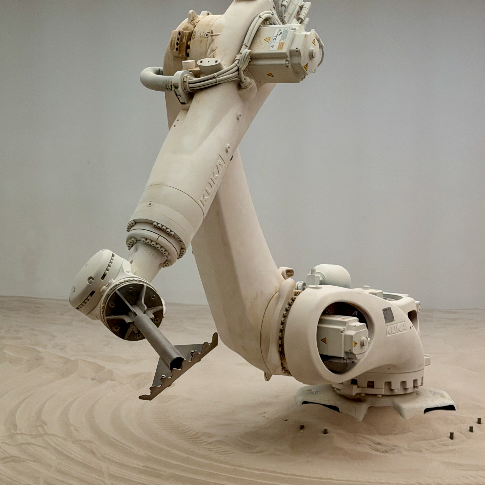

# Reflexes and Safety Enforcement\chaptersubtitle{System 1 1000 Hz Control Barrier Functions, Compliance, and Motor FOC}

{#fig-locator-ch09 width=100% fig-pos="H"}

*Why does a software safety guardrail written in Python fail to stop a robot from injuring a human during an OS memory compaction pause?*

In cloud software systems, safety guardrails are implemented as application-level middleware filters, assertion checks, or wrapper scripts. In Physical AI, software safety checks co-located on a general-purpose operating system share the same execution thread, memory bus, and scheduling vulnerability as the neural models they are meant to supervise. When the host operating system experiences a memory compaction stall, thread preemption, or runtime crash, unmanaged motor registers remain latched and moving mass crashes into the environment. Physical AI resolves this vulnerability through the Proposal–Permission Privilege Split: high-capacity neural models propose actions from an untrusted Linux domain, while a dedicated, bare-metal microcontroller executing in zero-allocation static SRAM holds exclusive electrical authority to evaluate Control Barrier Functions and veto hazardous commands in sub-millisecond real time.



::: {.callout-objective}
After studying this chapter, you will be able to:

1. **Implement Zero-Allocation 1000 Hz MCU Enforcers:** Construct hard real-time safety filters on dedicated ARM Cortex-M7 and lockstep RISC-V microcontroller silicon with bounded worst-case execution latency ($\text{WCET} \le 175\,\mu\text{s}$) and zero dynamic heap allocation (`malloc = 0`).
2. **Formulate Control Barrier Functions (CBFs):** Formulate continuously differentiable barrier certificates $h(\mathbf{x}) \ge 0$ guaranteeing the forward invariance of safe operating sets $\mathcal{C}$ under non-linear control-affine dynamics.
3. **Solve Minimal-Intervention Quadratic Programs (CBF-QPs):** Project unverified candidate action proposals ($\mathbf{u}_{\text{cand}}$) emitted by neural policies onto admissible safety half-spaces ($\mathcal{U}_{\text{safe}}$) using active-set solvers in static SRAM.
4. **Enforce Dynamic Stopping Envelopes ($d_{\text{stop}} \le d_{\text{clearance}}$):** Intercept and veto trajectory proposals that violate clearance margins relative to stationary and moving obstacles before physical contact occurs.
5. **Implement Contact Impedance and Passivity Control:** Formulate virtual spring-damper compliance ($\mathbf{M}_d, \mathbf{D}_d, \mathbf{K}_d$) and passivity energy tanks to stabilize physical contact interactions without kinematic singularities.
6. **Command Motor Field-Oriented Control (FOC):** Direct $20\text{ kHz}$ Space-Vector Pulse-Width Modulation (SVPWM) switching via Clarke and Park transforms in dedicated hardware timer peripherals.
7. **Dissect OS Latency Blowout Collisions:** Analyze the Late Commanded Deceleration autopsy where a $140\text{ ms}$ Linux dirty page writeback stall caused a $3.4\text{ kN}$ collision that fractured a harmonic drive flexspline.
8. **Freeze the Safety Enforcement Interface:** Author the formal engineering specification establishing 1000 Hz timer schedules, CBF parameters, the IEC 60204-1 emergency stop hierarchy, and hardware Safe Torque Off optocoupler lines.

**Core Chapter Takeaway:** Physical safety cannot be delegated to application software or learned neural policies; it requires a dedicated bare-metal System 1 permission authority operating at $1000\text{ Hz}$ in zero-allocation static SRAM (`malloc = 0`) that solves Control Barrier Function Quadratic Programs (CBF-QPs) to minimally perturb candidate actions and guarantee forward set invariance.
:::

## Real-Time Safety Enforcement and the Proposal–Permission Split

In conventional robotics software stacks, motion planning, trajectory optimization, and safety monitoring are frequently bundled into a monolithic application process executing under a standard operating system. In modern Physical AI architectures, where high-level reasoning and trajectory synthesis are driven by multi-billion parameter foundation models and diffusion decoders, this monolithic design is lethal.

A general-purpose operating system such as standard Linux is engineered to optimize average throughput across competing processes. In doing so, it routinely introduces non-deterministic latency spikes: kernel memory compaction pauses, dirty page background flushes, thread preemption, and bus contention across shared DRAM crossbars (@fig-enforcer-timing). If safety monitoring resides in user-space software on the Linux host, any operating system stall halts the safety monitor simultaneously with the neural policy. During that stall, unserviced motor command registers remain latched while moving mass continues to coast forward under unguided momentum ($d_{\text{coast}} = v \cdot \Delta t$). For a robotic manipulator traveling at an operational velocity of $v = 1.5\text{ m/s}$, a modest $140\text{ ms}$ Linux kernel memory compaction stall results in $d_{\text{coast}} = 210\text{ mm}$ ($21\text{ cm}$) of completely unmonitored displacement, converting software scheduling jitter directly into a destructive physical collision.

{#fig-enforcer-timing width=100%}

Physical AI resolves this vulnerability through the Proposal–Permission Privilege Split. The system is partitioned across heterogeneous silicon into two isolated operational domains:

The untrusted proposal domain encompasses large Vision-Language-Action models (VLAs) and generative trajectory decoders (ACT, Diffusion Policies) executing on multi-core Linux Application Processors (MPUs) and edge Neural Processing Units (NPUs). This domain possesses rich semantic intelligence and wide receptive fields but is treated from a safety standpoint as an untrusted proposal service. It generates candidate trajectory chunks accompanied by expiring intent leases ($\tau_{\text{lease}} \approx 50\text{--}100\text{ ms}$), depositing them into lock-free shared memory mailboxes.

The sole hardware permission authority belongs to a dedicated, hard real-time microcontroller (such as an ARM Cortex-M7 or dual-core lockstep RISC-V) executing bare-metal or on a microsecond RTOS kernel in tightly coupled static SRAM. This microcontroller possesses exclusive physical routing to the gate drivers of the motor inverters. It evaluates candidate trajectory chunks against non-negotiable physical invariants at a deterministic $1000\text{ Hz}$ ($1.0\text{ ms} \pm 5\,\mu\text{s}$) cadence. If an intent lease expires without renewal due to an upstream operating system stall, the microcontroller automatically clamps acceleration and executes a safe controlled stop.

Microcontroller firmware strictly obeys the iron law of deterministic execution (`malloc = 0`): zero dynamic heap allocations, zero blocking mutexes, and zero reliance on operating system threads. Every matrix, buffer, and data structure is allocated statically at compile time. By bounding the worst-case execution time to $\text{WCET} \le 175\,\mu\text{s}$, the safety enforcer guarantees that invariants are evaluated with microsecond precision, ensuring the physical survival of the machine even if the host Linux operating system crashes or freezes.

The architecture begins by establishing Control Barrier Functions to guarantee mathematical forward set invariance (Section 9.2), transforming physical safety boundaries into linear constraints on motor inputs that act as a speed governor as clearance decreases. To execute these invariants on real hardware, the microcontroller solves a Minimal-Intervention Quadratic Program at every millisecond tick (Section 9.3), passing safe AI proposals untouched and computing minimal projections when danger threatens. The physical reflex layer couples this mathematical shield with dynamic stopping distance bounds, Cartesian impedance control, passivity energy tanks, and 20 kHz Field-Oriented Control (Section 9.4), grounding digital decisions in the physical realities of friction cones, contact forces, and motor thermal dissipation. When upstream software or hardware fails, the system executes a certified multi-tier escalation hierarchy from trajectory freeze down to hardware-isolated Safe Torque Off (Section 9.5). Finally, we examine the forensic autopsy of an industrial gearbox fracture caused by an operating system latency tail, compile the formal safety enforcement specification, expose pervasive safety fallacies, and synthesize the five sensory-motor organs that conclude Part II.

## Control Barrier Functions and Mathematical Forward Invariance

In empirical machine learning, researchers frequently attempt to enforce safety by adding penalty terms to a reward function during reinforcement learning or by adding loss penalties during behavioral cloning. On physical hardware, soft loss penalties are fundamentally inadequate: they merely alter statistical expectations ($\mathbb{E}[R]$), readily permitting low-probability, catastrophic constraint violations when the system encounters novel out-of-distribution inputs. When an unmodeled optical glare or novel obstacle geometry induces an unfamiliar input state, a neural policy that scored $99.9\%$ in simulation can still command full voltage into a rigid barrier.

Physical safety requires a hard, mathematically provable guarantee of forward set invariance [@ames2014control; @ames2019control]. Consider a continuous non-linear control-affine dynamical system:

$$\dot{\mathbf{x}} = f(\mathbf{x}) + g(\mathbf{x})\mathbf{u}$$

where $\mathbf{x} \in \mathcal{X} \subset \mathbb{R}^n$ represents the physical state vector (joint positions, velocities, and obstacle distances), $\mathbf{u} \in \mathcal{U} \subset \mathbb{R}^m$ represents the commanded actuator control input (motor torques or phase voltages), $f: \mathbb{R}^n \to \mathbb{R}^n$ describes the autonomous drift dynamics, and $g: \mathbb{R}^n \to \mathbb{R}^{n \times m}$ defines the control input mapping.

We define the admissible safe operating set $\mathcal{C} \subset \mathcal{X}$ as the 0-superlevel set of a continuously differentiable scalar barrier certificate function $h: \mathcal{X} \to \mathbb{R}$:

$$\mathcal{C} = \left\{ \mathbf{x} \in \mathcal{X} \;\middle|\; h(\mathbf{x}) \ge 0 \right\}$$

$$\partial \mathcal{C} = \left\{ \mathbf{x} \in \mathcal{X} \;\middle|\; h(\mathbf{x}) = 0 \right\} \quad (\text{Safe Boundary})$$

$$\text{Int}(\mathcal{C}) = \left\{ \mathbf{x} \in \mathcal{X} \;\middle|\; h(\mathbf{x}) > 0 \right\} \quad (\text{Interior Safe Region})$$

The safe set $\mathcal{C}$ is forward invariant if for every initial state starting within the set ($\mathbf{x}(0) \in \mathcal{C}$), the trajectory remains strictly inside the set for all future time ($\mathbf{x}(t) \in \mathcal{C}, \forall t \ge 0$).

Utilizing standard Lie derivative notation, where the row vector gradient $\nabla h(\mathbf{x}) \in \mathbb{R}^{1 \times n}$ is contracted along vector fields $f$ and $g$:
- $L_f h(\mathbf{x}) = \nabla h(\mathbf{x}) f(\mathbf{x}) \in \mathbb{R}$ represents the natural drift rate of the safety margin along unforced physics.
- $L_g h(\mathbf{x}) = \nabla h(\mathbf{x}) g(\mathbf{x}) \in \mathbb{R}^{1 \times m}$ represents the control authority available to modulate the safety margin via actuator inputs $\mathbf{u}$.

The fundamental Control Barrier Function (CBF) condition is expressed as:

$$L_f h(\mathbf{x}) + L_g h(\mathbf{x})\mathbf{u} + \gamma h(\mathbf{x}) \ge 0$$

where $\gamma > 0$ is a positive linear convergence gain.

### The Speed Governor Invariant
The differential inequality $\dot{h}(\mathbf{x}) \ge -\gamma h(\mathbf{x})$ acts as a dynamic speed governor governing the approach toward danger:

1. **Far inside the safe interior ($h(\mathbf{x}) \gg 0$):** The term $-\gamma h(\mathbf{x})$ evaluates to a large negative number. The lower bound on $\dot{h}$ is deeply negative, meaning the robot is permitted to approach obstacles at high speed. The candidate control input $\mathbf{u}$ emitted by the neural policy remains completely unconstrained.
2. **Collapsing clearance ($h(\mathbf{x}) \to 0$):** As physical distance to danger closes, $-\gamma h(\mathbf{x})$ smoothly contracts toward zero. The maximum allowable approach speed ($-\dot{h}$) is throttled in direct linear proportion to remaining clearance.
3. **At the safe boundary ($\mathbf{x} \in \partial \mathcal{C} \implies h(\mathbf{x}) = 0$):** The condition strictly forces $\dot{h} \ge 0$. Any control command that would drive the state across the boundary is actively vetoed, making the boundary $\partial \mathcal{C}$ mathematically impenetrable.

Like a mechanical flyball governor on a steam engine, the barrier condition does not abruptly halt the machine at a distance; it smoothly throttles the maximum allowable approach speed down to zero at the boundary. Formal proofs of forward set invariance via Nagumo's condition and the comparison lemma are documented in Appendix Section 3.

## Minimal-Intervention Quadratic Programming in Microsecond Silicon

To merge unverified candidate action proposals from generative neural models ($\mathbf{u}_{\text{cand}}$) with hard physical safety guarantees, the System 1 microcontroller solves a Minimal-Intervention Control Barrier Function Quadratic Program (CBF-QP) at every $1000\text{ Hz}$ control cycle (@fig-cbf-projection).

{#fig-cbf-projection width=100%}

The optimization problem is formulated as:

$$\mathbf{u}^* = \arg\min_{\mathbf{u} \in \mathbb{R}^m} \frac{1}{2} \left( \mathbf{u} - \mathbf{u}_{\text{cand}} \right)^T \mathbf{W} \left( \mathbf{u} - \mathbf{u}_{\text{cand}} \right)$$

$$\begin{aligned}
\text{subject to} \quad &L_f h_i(\mathbf{x}) + L_g h_i(\mathbf{x})\mathbf{u} + \gamma_i h_i(\mathbf{x}) \ge 0, \quad i = 1, \dots, M_{\text{barriers}} \\
&\mathbf{u}_{\text{min}} \le \mathbf{u} \le \mathbf{u}_{\text{max}} \quad (\text{Actuator Torque / Current Limits})
\end{aligned}$$

where $\mathbf{W} \succ 0$ is a positive-definite weighting matrix calibrating the relative penalty of perturbing distinct actuator channels (for example, penalizing alterations to end-effector orientation more heavily than base positioning adjustments).

### The Minimal Intervention Principle
The optimization embodies the minimal intervention principle:

- **Unconstrained Execution:** As long as the neural policy's candidate proposal $\mathbf{u}_{\text{cand}}$ satisfies all barrier constraints ($L_f h_i + L_g h_i \mathbf{u}_{\text{cand}} + \gamma_i h_i \ge 0$), the unconstrained minimum $\mathbf{u}^* = \mathbf{u}_{\text{cand}}$ is achieved with zero solver iterations. The generative policy's command passes unmodified, preserving full behavioral dexterity.
- **Active-Set Projection:** When a candidate action threatens to breach a barrier (such as driving an arm toward an obstacle or exceeding joint acceleration limits), the corresponding barrier constraint activates. The QP computes the Euclidean projection of $\mathbf{u}_{\text{cand}}$ onto the boundary of the admissible half-space $\mathcal{U}_{\text{safe}}$, modifying the neural command only by the exact mathematical minimum necessary to preserve forward invariance.

### Zero-Allocation Embedded Execution on ARM Cortex-M7
Because this optimization must complete in $\text{WCET} \le 175\,\mu\text{s}$ inside an embedded microcontroller, the firmware employs pre-compiled, statically allocated active-set solvers (such as embedded active-set or operator-splitting algorithms).

Operating in Tightly Coupled Memory (DTCM SRAM) with zero dynamic memory allocation (`malloc = 0`), an ARM Cortex-M7 running at $480\text{ MHz}$ solves a 6-DoF CBF-QP in fewer than $84{,}000$ clock cycles, consuming less than $8\text{ KB}$ of static memory. This guarantees that even during worst-case active-set iterations, execution consumes only $17.5\%$ of the $1000\,\mu\text{s}$ timer interrupt window, leaving ample headroom for sensor telemetry ingestion and inverter modulation. Complete multi-variable KKT matrix expansions and the full embedded C active-set solver implementation are provided in Appendix Section 3.

## Dynamic Stopping Envelopes, Contact Impedance, and Motor Field-Oriented Control

Safety enforcement on physical hardware requires grounding digital optimization in the physical dynamics of moving mass, contact mechanics, and electromagnetic torque generation.

### Dynamic Stopping Clearance and Reaction Drift
At every millisecond tick, the microcontroller monitors physical clearance relative to obstacles. In physical reality, moving mass cannot stop instantaneously: arresting kinetic energy requires finite mechanical distance and time.

The total dynamic stopping distance $d_{\text{stop}}(v)$ is the sum of reaction drift displacement and kinematic braking distance:

$$d_{\text{stop}}(v) = \underbrace{v \cdot \tau_{\text{latency}}}_{\text{Reaction Drift}} + \underbrace{\frac{v^2}{2 a_{\text{max}}}}_{\text{Kinematic Braking}}$$

where $v = \|\dot{\mathbf{x}}\|$ is the operational velocity, $\tau_{\text{latency}}$ is the total worst-case hardware sensorimotor latency (including camera exposure, bus serialization, and inverter filter lag, typically $12.0\text{ ms}$), and $a_{\text{max}}$ is the certified maximum braking deceleration constrained by Coulomb friction, payload stability, or motor torque saturation.

The fundamental safety invariant evaluated at $1000\text{ Hz}$ requires that measured clearance $d_{\text{clearance}}(\mathbf{x})$ strictly exceed the dynamic stopping distance plus a safety margin buffer $d_{\text{margin}}$:

$$d_{\text{clearance}}(\mathbf{x}) \ge d_{\text{stop}}(v) + d_{\text{margin}} = v \cdot \tau_{\text{latency}} + \frac{v^2}{2 a_{\text{max}}} + d_{\text{margin}}$$

When a candidate trajectory chunk commands an operational velocity $v_{\text{cand}}$ that violates this inequality, the microcontroller clamps the setpoint to the exact parabolic braking envelope $v_{\text{safe}}$:

$$v_{\text{safe}} = \sqrt{a_{\text{max}}^2 \tau_{\text{latency}}^2 + 2 a_{\text{max}} \left( d_{\text{clearance}} - d_{\text{margin}} \right)} - a_{\text{max}} \tau_{\text{latency}}$$

**Concrete Numerical Evaluation:** Consider a manipulator traveling at $v_{\text{cand}} = 1.50\text{ m/s}$ with transport latency $\tau_{\text{latency}} = 12.0\text{ ms}$, maximum certified braking deceleration $a_{\text{max}} = 4.0\text{ m/s}^2$, and safety margin $d_{\text{margin}} = 0.020\text{ m}$. If a sensor detects an obstacle at $d_{\text{clearance}} = 0.150\text{ m}$, the unconstrained candidate stopping requirement is:

$$d_{\text{stop}}(1.50) + d_{\text{margin}} = (1.50 \times 0.012) + \frac{1.50^2}{2 \times 4.0} + 0.020 = 0.018 + 0.281 + 0.020 = 0.319\text{ m}$$

Because $0.319\text{ m} > 0.150\text{ m}$, the proposal would cause a collision. In $< 5\,\mu\text{s}$, the microcontroller calculates:

$$v_{\text{safe}} = \sqrt{(4.0 \times 0.012)^2 + 2(4.0)(0.150 - 0.020)} - (4.0 \times 0.012) = \sqrt{0.0023 + 1.040} - 0.048 = 0.973\text{ m/s}$$

The microcontroller instantly clamps the velocity setpoint from $1.50\text{ m/s}$ down to $0.973\text{ m/s}$, containing kinetic energy within the physical braking boundary.

### Contact Impedance Control and Passivity Energy Tanks
While rigid position control is effective for free-space motion, it is hazardous during physical contact manipulation. When a manipulator interacts with a rigid surface (such as inserting a component, polishing a workpiece, or contacting an operator), small calibration errors generate extreme contact force spikes:

$$F_{\text{contact}} = k_{\text{env}} \cdot \Delta x$$

Because the stiffness of steel or aluminum fixtures exceeds $k_{\text{env}} > 10^6\text{ N/m}$, a positional tracking error of just $0.5\text{ mm}$ produces contact forces exceeding $500\text{ N}$, stalling motors and damaging precision gear teeth.

To achieve safe physical interaction, Physical AI replaces rigid position setpoints with Joint and Cartesian Impedance Control [@hogan1985impedance]. Rather than enforcing a rigid coordinate, the microcontroller regulates the dynamic relationship between external interaction forces $\mathbf{F}_{\text{ext}}$ and kinematic tracking error $\mathbf{e}(t) = \mathbf{x}(t) - \mathbf{x}_d(t)$, rendering the end-effector as a programmable virtual mass-spring-damper system:

$$\mathbf{M}_d \ddot{\mathbf{e}}(t) + \mathbf{D}_d \dot{\mathbf{e}}(t) + \mathbf{K}_d \mathbf{e}(t) = \mathbf{M}_d (\ddot{\mathbf{x}} - \ddot{\mathbf{x}}_d) + \mathbf{D}_d (\dot{\mathbf{x}} - \dot{\mathbf{x}}_d) + \mathbf{K}_d (\mathbf{x} - \mathbf{x}_d) = \mathbf{F}_{\text{ext}}$$

where $\mathbf{M}_d, \mathbf{D}_d, \mathbf{K}_d \succ 0$ are the desired virtual inertia, damping, and stiffness matrices, and $\mathbf{x}_d(t)$ is the nominal reference trajectory from the candidate chunk.

To maintain numerical stability without external force-torque sensors, the microcontroller implements Cartesian Stiffness Control at $1000\text{ Hz}$. The Jacobian transpose $\mathbf{J}^T(\mathbf{q})$ projects Cartesian restoring forces directly into joint space without matrix inversion, completely bypassing kinematic singularities:

$$\boldsymbol{\tau}^* = \mathbf{J}^T(\mathbf{q}) \left[ \mathbf{K}_d (\mathbf{x}_d - \mathbf{x}) + \mathbf{D}_d (\dot{\mathbf{x}}_d - \dot{\mathbf{x}}) \right] + \mathbf{g}(\mathbf{q})$$

When impedance parameters vary dynamically during contact transitions, discrete-time integration can inadvertently inject energy, causing limit cycles or contact chatter. The microcontroller guards against instability using Passivity Observers and Energy Tanks [@ferraguti2013energy]. Treating the controller as a virtual energy reservoir, the enforcer monitors power exchange ($P(t) = \mathbf{F}_{\text{ext}}^T \dot{\mathbf{x}}$) and drains the energy tank ($E_{\text{tank}}$) whenever active work is performed. If the tank depletes ($E_{\text{tank}} \le E_{\text{min}}$), virtual stiffness is capped and physical damping is injected, guaranteeing that the closed-loop system remains strictly passive ($\int_0^t P(\tau) d\tau \ge -E_{\text{tank}}(0)$). To prevent excessive virtual energy accumulation during prolonged free-space damping phases, the tank is bounded by an upper saturation capacity ($E_{\text{tank}} \le E_{\text{max}}$), eliminating dangerous transient stiffness bursts upon subsequent workpiece impact.

### Motor Field-Oriented Control and Thermal Safeguards
At the physical boundary where digital control setpoints become analog electromagnetic forces, the microcontroller commands brushless permanent magnet synchronous motors (PMSMs) using Field-Oriented Control (FOC) executing at $20\text{ kHz}$ in hardware timer peripherals.

FOC decouples the three-phase AC stator currents ($i_a, i_b, i_c$) into two orthogonal DC current components rotating synchronously with the rotor magnetic flux:

1. **Clarke Transformation:** Maps three-phase stator currents onto a two-phase stationary orthogonal reference frame ($\alpha, \beta$). Leveraging Kirchhoff's current law in isolated neutral windings ($i_a + i_b + i_c = 0$), the microcontroller computes this using two current shunt measurements:

$$\begin{bmatrix} i_\alpha \\ i_\beta \end{bmatrix} = \begin{bmatrix} 1 & 0 & 0 \\ 0 & \frac{1}{\sqrt{3}} & -\frac{1}{\sqrt{3}} \end{bmatrix} \begin{bmatrix} i_a \\ i_b \\ i_c \end{bmatrix}$$

2. **Park Transformation:** Projects stationary currents onto the rotating rotor reference frame ($d, q$) using the optical joint encoder angle $\theta_e$:

$$\begin{bmatrix} i_d \\ i_q \end{bmatrix} = \begin{bmatrix} \cos\theta_e & \sin\theta_e \\ -\sin\theta_e & \cos\theta_e \end{bmatrix} \begin{bmatrix} i_\alpha \\ i_\beta \end{bmatrix}$$

By rotating with the rotor magnetic field, FOC transforms complex AC sinusoidal currents into two stationary DC quantities. The Direct Axis Current ($i_d$) controls the rotor magnetic flux alignment (regulated to $i_d = 0$ for non-salient motors to maximize electrical efficiency), while the Quadrature Axis Current ($i_q$) produces electromagnetic torque in direct proportion to the motor torque constant $K_t$:

$$\tau_{\text{motor}} = \frac{3}{2} P \cdot \lambda_{\text{pm}} \cdot i_q = K_t \cdot i_q$$

where $P$ is the number of motor pole pairs and $\lambda_{\text{pm}}$ is the permanent magnet flux linkage. The resulting voltage setpoints $(v_d^*, v_q^*)$ are converted into three-phase pulse-width modulation duty cycles using Space-Vector PWM (SVPWM), driving the gate voltages of isolated MOSFET/IGBT H-bridge inverters at $20\text{ kHz}$ with center-aligned ADC sampling.

To protect motor windings from thermal damage during sustained high-torque operations, the firmware executes a real-time discrete $I^2t$ thermal accumulator with first-order cooling dissipation:

$$E_{\text{thermal}}[k] = E_{\text{thermal}}[k-1] + \left( I_{\text{phase}}^2[k] R_{\text{stator}} - \frac{T_{\text{stator}}[k-1] - T_{\text{ambient}}}{R_{\text{thermal}}} \right) \Delta t$$

When estimated stator temperature exceeds the warning threshold ($T_{\text{stator}} > 85^\circ\text{C}$), the microcontroller initiates linear torque derating, preventing enamel insulation breakdown at $155^\circ\text{C}$ (NEMA Class F).

### Autopsy: The Late Commanded Deceleration
The consequences of hosting safety checks in user-space software on a general-purpose operating system are documented in the forensic autopsy of a 6-DoF industrial articulated manipulator (@fig-enforcement-platform).

::: {.callout-autopsy title="The Late Commanded Deceleration"}
* **System:** 6-DoF articulated material-handling manipulator operating at $v = 1.8\text{ m/s}$ in a palletizing workcell.
* **Incident:** Host Linux application processor experienced a $140\text{ ms}$ dirty page writeback memory compaction pause while approaching an obstacle at $d_{\text{clearance}} = 0.280\text{ m}$.
* **Telemetry Snapshot:** At $T-0.140\text{ s}$, ToF sensor reported $d_{\text{clearance}} = 0.280\text{ m}$; at $T-0.125\text{ s}$, kernel suspended user-space safety thread; arm coasted $0.252\text{ m}$ unguided; at $T-0.010\text{ s}$, software resumed with $0.028\text{ m}$ clearance; at $T+0.000\text{ s}$, arm struck fixture at $0.92\text{ m/s}$ ($3.4\text{ kN}$ dynamic impact).
* **Root Cause:** Arm coasted unguided for $0.252\text{ m}$ during the OS pause; when software resumed, remaining clearance was only $0.028\text{ m}$, rendering safe kinematic braking ($d_{\text{brake}} = 0.081\text{ m}$) physically impossible.
* **Architectural Flaw:** Co-locating safety monitoring in user-space software without an independent, bare-metal microcontroller holding exclusive hardware authority.
* **Provenance:** Industrial workcell failure report and flight-recorder telemetry reconstructed for systems instruction.
:::

{#fig-enforcement-platform width=100%}

In this industrial workcell incident, the 6-DoF articulated manipulator was executing high-speed palletizing maneuvers at $v = 1.8\text{ m/s}$. Safety monitoring and trajectory generation were co-located in a user-space process executing under standard Linux on an x86-64 host computer.

At timestamp $T - 0.140\text{ s}$, an optical time-of-flight sensor detected an unexpected fixture protrusion at a distance of $d_{\text{clearance}} = 0.280\text{ m}$. However, at that exact millisecond, the Linux kernel initiated a background memory compaction cycle to service a multi-gigabyte dirty page writeback. The user-space planning and safety process was preempted and suspended for $140\text{ ms}$.

Because the motor inverters were governed by unmanaged user-space setpoints, the actuators held the last commanded velocity. The arm coasted forward unguided:

$$d_{\text{coast}} = v \cdot \Delta t_{\text{pause}} = 1.8\text{ m/s} \times 0.140\text{ s} = 0.252\text{ m}$$

When the Linux kernel finally resumed the safety process at $T - 0.010\text{ s}$, the remaining physical clearance had collapsed to:

$$d_{\text{remaining}} = 0.280\text{ m} - 0.252\text{ m} = 0.028\text{ m} = 2.8\text{ cm}$$

The safety software immediately commanded maximum emergency braking deceleration ($a_{\text{max}} = 20.0\text{ m/s}^2$). However, the quadratic braking distance required to arrest moving mass from $v = 1.8\text{ m/s}$ was:

$$d_{\text{brake}} = \frac{v^2}{2 a_{\text{max}}} = \frac{1.8^2}{2 \times 20.0} = \frac{3.24}{40.0} = 0.081\text{ m} = 8.1\text{ cm}$$

Because the required stopping distance ($8.1\text{ cm}$) exceeded the remaining physical clearance ($2.8\text{ cm}$), the collision was physically unavoidable. The manipulator struck the solid steel fixture plate at an impact velocity of $v_{\text{impact}} \approx 0.92\text{ m/s}$, generating a dynamic shock load of $F_{\text{impact}} \approx 3.4\text{ kN}$. The shock load fractured the precision flexspline teeth of the Joint 4 harmonic drive speed reducer, bent the mounting flange, and damaged internal motor bearings, incurring a $7,200\text{ USD}$ overhaul cost. The flight-recorder telemetry ledger is detailed in @tbl-telemetry-ch09.

| Timestamp | Subsystem & Substrate | Recorded State / Telemetry Event | Physical Implication |
| :--- | :--- | :--- | :--- |
| **$T - 0.140\text{ s}$** | Optical ToF Sensor | Detects obstacle intrusion at $d_{\text{clearance}} = 0.280\text{ m}$. | Range data dispatched to Linux MPU driver. |
| **$T - 0.125\text{ s}$** | Linux MPU Kernel | Dirty page writeback triggers memory compaction; user-space planning thread suspended. | $140\text{ ms}$ perception-planning blackout begins. |
| **$T - 0.040\text{ s}$** | Arm Actuators / Linkage | Arm continues coasting forward at $v = 1.8\text{ m/s}$ along un-cancelled trajectory chunk. | Reaction displacement consumes $0.252\text{ m}$ of clearance. |
| **$T - 0.010\text{ s}$** | Linux MPU / Planning Thread | Planning thread resumes; emits emergency stop command to motor drivers. | Remaining clearance is only $0.028\text{ m}$ ($2.8\text{ cm}$). |
| **$T + 0.000\text{ s}$** | Manipulator Wrist / Fixture | Arm strikes steel fixture plate at $0.92\text{ m/s}$ ($3.4\text{ kN}$ dynamic impact). | Harmonic drive flexspline fractures ($7,200\text{ USD}$ overhaul). |
| **Root Cause** | *Systems Bottleneck* | Monolithic software safety supervisor suspended during Linux kernel memory compaction tail blowout ($140\text{ ms}$). |
| **Architectural Flaw** | *Privilege & Co-Design* | Absence of an autonomous bare-metal MCU supervisor evaluating real-time dynamic stopping distance ($d_{\text{stop}}$) at 1000 Hz. |

: Flight-Recorder Telemetry Ledger: The Late Commanded Deceleration Incident. Tracing non-deterministic OS latency tails to mechanical gearbox fracture. {#tbl-telemetry-ch09}

## Safety Fallback Hierarchy and the Enforcement Specification

To establish a defensible physical safety boundary, the execution subsystem structures emergency responses into a certified functional safety hierarchy aligned with IEC 60204-1, IEC 61800-5-2, and ISO 13849-1 (@fig-fallback-hierarchy).

{#fig-fallback-hierarchy width=100%}

### Functional Safety Escalation Hierarchy
Emergency stops are partitioned into three distinct operational tiers based on severity and hardware isolation:

1. **Category 2 Stop (Controlled Stop with Power Maintained):** Actuators remain energized while the microcontroller commands a controlled deceleration along the nominal trajectory or holds position via Cartesian impedance control. This tier is applied during transient intent lease renewals, minor boundary proximity, or recoverable human pause commands.
2. **Category 1 Stop (Controlled Stop with Dynamic Braking / Safe Stop 1, SS1):** The microcontroller actively applies maximum certified counter-electromotive braking deceleration ($a_{\text{max}}$) to bring all moving joints to a complete stop, after which power to the motor inverters is disconnected. This tier is triggered when an intent lease expires without renewal, when tracking error diverges, or when an obstacle enters the dynamic stopping envelope.
3. **Category 0 Stop (Safe Torque Off / STO):** Immediate, uncoordinated removal of electrical power from motor gate drivers via dedicated physical optocoupler interlocks in $< 5\,\mu\text{s}$. The inverter bridge MOSFETs are forced into high-impedance mode, electrically disconnecting stator coils regardless of microcontroller software state. Category 0 is hardwired to emergency e-stop buttons, hardware watchdog trip circuits, DC-link overvoltage monitors, and gate driver shoot-through protectors.

### The Real-Time Safety Enforcement Specification
The execution subsystem formalizes its quantitative parameters in the Safety Enforcement Specification (@tbl-enf01-ledger).

| Parameter Category | Specification Key | Engineering Target Value | Verification Boundary |
| :--- | :--- | :--- | :--- |
| **Control Cadence** | `loop.freq_hz` | $1000.0\text{ Hz} \pm 5\,\mu\text{s}$ | Deterministic timer ISR interrupt |
| **Execution Latency** | `loop.max_exec_us` | $\text{WCET} \le 175.0\,\mu\text{s}$ | $17.5\%$ CPU load margin |
| **Heap Allocation** | `mem.heap_bytes` | $0\text{ Bytes}$ (`malloc = 0`) | Pre-allocated static DTCM SRAM only |
| **Barrier Convergence** | `cbf.gamma_gain` | $\gamma = 15.0\text{ s}^{-1}$ | Class-$\mathcal{K}$ boundary decay rate |
| **Stopping Deceleration** | `brake.max_decel` | $4.0\text{ m/s}^2$ ($a_{\text{max}}$) | Certified maximum braking capacity |
| **Transport Latency** | `brake.reaction_ms` | $12.0\text{ ms}$ | Worst-case hardware sensorimotor lag |
| **Safety Clearance** | `brake.margin_m` | $0.020\text{ m}$ ($20\text{ mm}$) | Certified minimum obstacle buffer |
| **Category 0 STO** | `safety.sto_gpio` | `GPIO_PB12` | $< 5\,\mu\text{s}$ optocoupler gate cut |

: The Real-Time Safety Enforcement Specification. Quantitative barrier parameters, dynamic stopping bounds, and hardware interlock mechanisms bridging Planning to Physical Inverters. {#tbl-enf01-ledger}

We audit the Execution stage across the Five Physical Columns in the Co-Design Checkpoint Ledger (@tbl-execution-matrix-checkpoint).

| Physical Constraint | Execution Systems Tension | Chapter 9 Architectural Resolution |
| :--- | :--- | :--- |
| **Time & Freshness** | Stochastic OS scheduling ($> 200\text{ ms}$) blinds safety monitors. | **1 kHz Hard Real-Time Timer Tick ($\text{WCET} \le 175\,\mu\text{s}$)** on isolated MCU. |
| **Inertia & Stopping** | Moving mass requires finite stopping distance before collision. | **Real-Time Dynamic Stopping Distance Invariant ($d_{\text{stop}} \le d_{\text{clearance}}$)**. |
| **Actuation & Jerk** | Second-order motor dynamics limit instantaneous torque response. | Exponential Control Barrier Functions (ECBFs) incorporating velocity state. |
| **Energy & Thermal** | Sustained stall torques overheat motor windings and trip MOSFETs. | Firmware $I^2t$ thermal accumulation current clamping in static SRAM. |
| **Silicon Determinism** | Dynamic memory heap fragmentation crashes long-running controllers. | **Iron Law of Zero-Heap Execution (`malloc = 0`)** in pre-allocated SRAM. |

: Execution Co-Design Checkpoint Ledger. Systematic architectural accounting of real-time execution across the physical constraints. {#tbl-execution-matrix-checkpoint}

## Fallacies and Pitfalls in Reflexes and Safety Enforcement

Deploying real-time safety enforcement systems on physical hardware requires confronting the divide between abstract mathematical formulations and the realities of digital silicon, power electronics, and kinematic momentum.

#### Fallacy: Software Safety Checks in Application Code Provide Real-Time Guarantees {.unnumbered}
Believing that implementing safety checks as validation assertions or wrapper nodes in Python or ROS 2 application software provides an adequate safety boundary before commanding robot actuators. User-space software running on a general-purpose operating system shares execution threads, memory buses, and kernel scheduling queues with the generative neural models it supervises. When the host operating system initiates background memory compaction or thread preemption, the user-space safety check is suspended simultaneously with the planning thread. During this scheduling blackout, motor command registers remain latched at previous setpoints, and physical inertia drives the machine forward unmonitored ($d_{\text{coast}} = v \cdot \Delta t_{\text{pause}}$). For a robot traveling at $v = 1.8\text{ m/s}$, a $140\text{ ms}$ compaction stall results in $25.2\text{ cm}$ of unguided displacement. Real-time safety guarantees require the Proposal–Permission Privilege Split: high-level planners propose candidate actions from untrusted user space, while an autonomous bare-metal microcontroller evaluates safety invariants at $1000\text{ Hz}$ in zero-allocation static SRAM with microsecond determinism.

#### Fallacy: Control Barrier Functions Eliminate Certified Hardware Emergency Stops {.unnumbered}
Assuming that because Control Barrier Functions mathematically guarantee forward invariance of the safe set ($\dot{h} \ge -\gamma h$), physical emergency stop circuits and hardware Safe Torque Off (STO) lines are redundant. CBF-QPs are digital control-theoretic filters running on microcontrollers under the assumption that the plant obeys nominal dynamics and actuators execute commanded inputs. They cannot prevent electrical or hardware faults: inverter bridge shoot-through short circuits, DC-link bus collapse, broken encoder wires, or microcontroller brownouts. Functional safety standards (IEC 61508, ISO 13849-1, IEC 60204-1) mandate a tiered emergency fallback hierarchy terminating in Category 0 Safe Torque Off (STO): dedicated optocoupler interlocks that physically de-energize gate driver power rails in $< 5\,\mu\text{s}$, electrically disconnecting stator windings regardless of microcontroller firmware state.

#### Pitfall: Solving CBF-QPs with Dynamic Heap Allocation on Embedded Silicon {.unnumbered}
Calling dynamic memory allocators (`malloc`, `free`, `new`, `std::vector::resize`) inside $1000\text{ Hz}$ interrupt service routines (ISRs) on embedded microcontrollers. Dynamic heap allocators maintain linked-list pool descriptors where search time depends on heap fragmentation. Over millions of control ticks, fragmentation causes worst-case execution time tail spikes that blow past the millisecond timer deadline ($\text{WCET} > 175\,\mu\text{s}$). Worse, heap exhaustion triggers silent HardFault exceptions that halt the microcontroller and leave motor phases floating or latched. Real-time firmware must strictly enforce the iron law of embedded determinism (`malloc = 0`), pre-allocating all QP workspace vectors, barrier gradient buffers, and active-set factorizations statically in DTCM SRAM at compile time.

#### Pitfall: Ignoring Sensorimotor Transport Latency in Clearance Monitoring {.unnumbered}
Formulating dynamic clearance thresholds using solely ideal kinematic braking distance $d_{\text{brake}} = \frac{v^2}{2 a_{\text{max}}}$, assuming braking takes effect immediately upon obstacle detection. In physical systems, sensorimotor transport latency $\tau_{\text{latency}}$ is non-zero. From the instant an obstacle appears to the instant the motor stator coil actually develops counter-torque, the system incurs delays across camera exposure, bus serialization, discrete filter phase lag, and current rise time ($\tau_{\text{latency}} \approx 12\text{--}25\text{ ms}$). During this latency window, the robot coasts forward at full velocity, consuming reaction drift: $d_{\text{drift}} = v \cdot \tau_{\text{latency}}$. For a robot traveling at $v = 1.8\text{ m/s}$ with $\tau_{\text{latency}} = 20\text{ ms}$, drift is $36\text{ mm}$, which alone can exceed the entire safety margin. Safety monitors must evaluate the total dynamic stopping envelope $d_{\text{stop}}(v) = v \cdot \tau_{\text{latency}} + \frac{v^2}{2 a_{\text{max}}}$ at every 1 kHz tick and enforce $d_{\text{clearance}} \ge d_{\text{stop}}(v) + d_{\text{margin}}$.

## Master Capstone Synthesis of Part II

With the completion of the real-time safety enforcement layer, we conclude Part II's systematic journey through the Five Cognitive Organs of Physical AI.

Across Chapters 5 through 9, we have constructed the complete, closed-loop cyber-physical pipeline from first principles:

$$W_t \xrightarrow[\text{Ch 5}]{\text{Perceive}} O_t \xrightarrow[\text{Ch 6}]{\text{Remember}} S_t \xrightarrow[\text{Ch 7}]{\text{Reason}} I_t (\mathcal{L}_{\text{intent}}) \xrightarrow[\text{Ch 8}]{\text{Plan}} \tau_t (p_t) \xrightarrow[\text{Ch 9}]{\text{Execute}} u_t^* \xrightarrow{\text{Actuation}} W_{t+1}$$

1. **Perception (Chapter 5):** Transduced raw photon fluxes into compact 3D metric affordance tokens in $SE(3)$ using zero-copy DMA pipelines and self-supervised ViT spatial encoders.
2. **Memory (Chapter 6):** Sustained continuous spatial belief across visual occlusions through Lie algebra coordinate frame trees, JEPAs, and expanding uncertainty envelopes.
3. **Intent (Chapter 7):** Grounded open-world natural language instructions through System 2 VLAs, emitting time-bounded Expiring Intent Leases ($\mathcal{L}_{\text{intent}}$) screened by kinematic reachability.
4. **Planning (Chapter 8):** Amortized neural inference latency via System 1.5 Action Chunking ($H=16$), enforcing $\mathcal{C}^2$ quintic polynomial spline continuity to eliminate gearbox jerk.
5. **Execution (Chapter 9):** Enforced physical forward invariance on bare-metal microcontroller silicon at $1000\text{ Hz}$ in zero-allocation SRAM (`malloc = 0`) using Minimal-Intervention CBF-QPs and $20\text{ kHz}$ Field-Oriented Control.

### The Cyber-Physical Dataflow Contracts
The five cognitive organs operate across vast disparities in bandwidth and privilege, synchronized through formal engineering contracts:

- **Rate Transitions:** Multi-rate synchronization decouples slow, high-capacity neural inference from fast, low-latency physical control:
  $$\begin{aligned}
  30\text{ Hz (Perception)} &\longrightarrow 100\text{ Hz (Memory)} \longrightarrow 5\text{ Hz (Intent)} \\
  &\longrightarrow 20\text{ Hz (Planning)} \longrightarrow 1000\text{ Hz (Safety Enforcer)} \longrightarrow 20\text{ kHz (Motor FOC)}
  \end{aligned}$$
- **Privilege and Trust Boundaries:** Generative neural policies execute in untrusted user space under standard operating systems, producing candidate trajectories governed by expiring intent leases ($\tau_{\text{lease}} \le 100\text{ ms}$). Exclusive hardware actuation authority is held by bare-metal microcontrollers operating in zero-allocation SRAM (`malloc = 0`).
- **Interface Lineage:** The cyber-physical pipeline is governed by five formal interfaces: Spatial Perception (Tokenization and Spatial Density) $\to$ Temporal Memory (Belief Purity and Latency) $\to$ Semantic Intent (Task Decomposition and Reachability) $\to$ Trajectory Planning (Chunk Horizons and $\mathcal{C}^2$ Jerk Bounding) $\to$ Real-Time Enforcement (Microsecond CBF-QP Projection and IEC 60204-1 Emergency Hierarchy).

### Advancing to Part III: Systems Co-Design, Assurance, and The Frontier
Having fully engineered the five independent sensory-motor organs, we now advance to **Part III: Systems Co-Design, Assurance & The Frontier**. In the upcoming chapters, we confront whole-system integration challenges:

- **Chapter 10 (Heterogeneous Compute Placement and Interconnects):** Mapping multi-rate workloads across host MPUs, edge NPUs, and bare-metal MCUs over PCIe, AXI, and EtherCAT/CAN-FD interconnects.
- **Chapter 11 (Runtime Governance and Safety Watchdogs):** Architecting dual-heartbeat watchdogs, intent lease revocation mechanisms, and runtime safety supervisors.
- **Chapter 12 (Hardware-in-the-Loop Assurance and Verification):** Formulating defensible release testing, fault-injection protocols, and empirical envelope verification before deploying learned policies into the physical world.
- **Chapter 13 (The Frontier of Physical AI):** Exploring emergent physical intelligence, foundation models for multi-embodiment systems, autonomous self-repair, and open problems in physical artificial intelligence.
