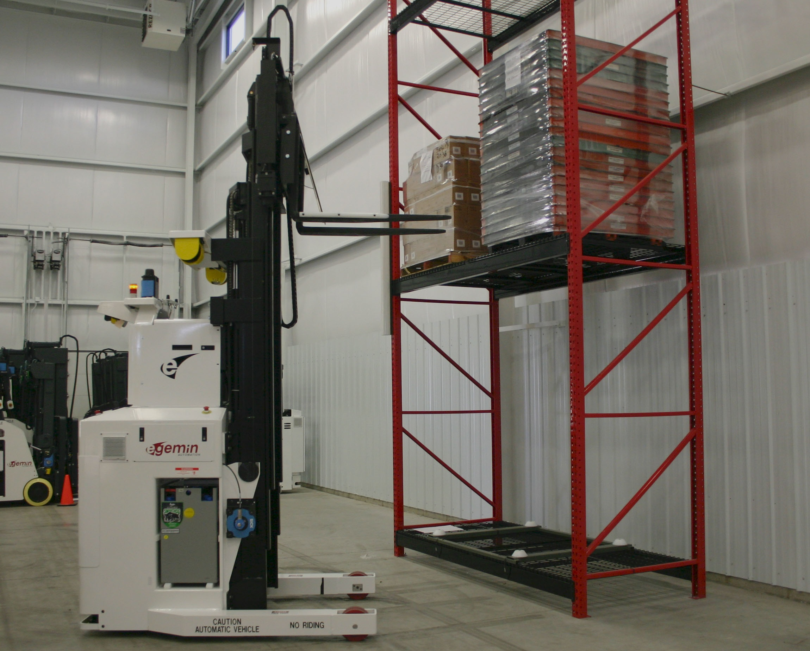

# Human-Machine Governance and the Data Flywheel\chaptersubtitle{Bumpless Override, Intervention Tagging, and Telemetry Lineage}

{#fig-locator-ch10 width=100% fig-pos="H"}

*Why does retraining a robot on logs of human emergency interventions cause it to drive straight into walls?*

In digital software platforms, user interaction logs are routinely ingested into training pipelines to improve recommendation models through passive data flywheels. In Physical AI, an embodied agent actively shapes its own future data distribution. When human operators seize physical controls to prevent an imminent collision, unmanaged telemetry engines record both the dangerous drift and the human correction as an unbroken demonstration, causing behavioral cloning models to learn fatal spurious correlations. Governance in Physical AI is not an administrative afterthought; it is an active systems contract that arbitrates real-time authority between human supervisors and learned policies via $\mathcal{C}^2$ bumpless transfer, prevents policy collapse through microsecond intervention demarcation, and secures cryptographic audit trails for physical operations.



::: {.callout-objective}
By the conclusion of this chapter, you will be able to:

1. **Design Human-Machine Authority State Machines:** Implement deterministic authority transitions (Manual $\leftrightarrow$ Shared $\leftrightarrow$ Autonomous $\leftrightarrow$ E-Stop) with strict hardware preemption guarantees.
2. **Formulate and Implement Bumpless Transfer Filters:** Eliminate motor torque spikes, high-frequency jerk ($\dddot{q}$), and gearbox shock during sudden human joystick takeovers using $\mathcal{C}^2$ smoothstep blending.
3. **Mitigate Policy Endogeneity and Covariate Shift:** Apply microsecond intervention tagging and truncated episode slicing to prevent behavioral cloning policy collapse during continuous data flywheel retraining.
4. **Establish Tamper-Evident Telemetry and Cryptographic Lineage:** Implement IEEE 1588 PTP hardware timestamping and SHA-256 hash chains binding sensory observations, model weights, and physical actuator actions.
5. **Freeze the Human-Authority and Governance Record (GOV-01):** Construct the tenth milestone artifact of the engineering notebook establishing authority contracts, blending bounds, and automated dual-bank firmware rollback protocols.

**Core Chapter Takeaway:** Human intervention in Physical AI is not a passive logging event; without $\mathcal{C}^2$ bumpless control transfer and microsecond intervention tagging, retraining autonomous policies on emergency takeovers leads directly to fatal policy collapse.
:::

::: {.callout-autopsy title="The Flywheel Collapse"}
**Platform:** Fleet Autonomous Pallet Lifter ($v = 1.8\text{ m/s}$).
**Failure Mechanism:** Telemetry engines recorded 10,000 hours of operations without recording human joystick override flags, fusing dangerous obstacle approaches and human swerves into unbroken demonstrations.
**Root Cause:** Behavioral cloning models fitted spurious correlations between high-speed pillar approaches and last-second turns, causing newly deployed policies to accelerate directly at pillars.
**Physical Consequence:** Three vehicles collided with structural columns at full speed ($1.8\text{ m/s}$), causing $\$240,000\text{ USD}$ in structural damage and vehicle write-offs.
:::

## The Illusion of Pure Autonomy

In digital machine learning, an autonomous agent operates in a closed virtual sandbox: if an algorithm makes an erroneous prediction, the runtime engine logs a warning, resets the environment seed, or yields a negative reward penalty. In the physical world, an un-governed motor command shears stainless-steel transmission gears, tears timing belts, or strikes a human collaborator.

No embodied AI system is ever truly isolated from human governance. Whether through direct teleoperation, cooperative shared admittance, dead-man consent heartbeats, or emergency-stop interlocks, human authority remains the foundational safety layer of physical engineering. However, introducing human intervention into an embodied AI architecture creates two severe systems challenges: the mechanical transition shock when sudden joystick deflections inject infinite torque derivatives ($\dot{\mathbf{u}} \to \infty$), tripping inverter overcurrent fuses and damaging gearboxes; and the policy endogeneity trap where un-demarcated human interventions poison data flywheels, causing behavioral cloning models to learn fatal spurious correlations.

Governing physical AI requires a dual-brain architecture: a deterministic, bare-metal microcontroller enforcing hard authority state machines and bumpless blending filters in real time, coupled with an audited data pipeline that enforces cryptographic lineage and truncated episode slicing. We now examine how data flywheels are properly structured to prevent policy collapse.

## Algorithmic Governance: Data Flywheels and Policy Endogeneity

In digital imitation learning, behavioral cloning minimizes empirical supervised loss across demonstrated actions:

$$\mathcal{L}_{\text{BC}}(\theta) = \mathbb{E}_{(s_t, a_t^*) \sim \mathcal{D}} \Big[ \big\| \pi_\theta(s_t) - a_t^* \big\|^2 \Big]$$

### The Policy Endogeneity Trap

In Physical AI, the data distribution is endogenous: the policy's actions shape its future observations ($s_t \to a_t \to s_{t+1}$). When a human operator intervenes to prevent an accident:

1. **Pre-Intervention Phase ($t < t_{\text{takeover}}$):** The autonomous policy experiences out-of-distribution drift, steering toward an obstacle.
2. **Intervention Phase ($t \ge t_{\text{takeover}}$):** The human grabs the joystick and executes an evasive maneuver.

If the trajectory is logged without explicit intervention boundaries, the dataset contains a toxic pair: hazardous states $s_t$ paired with high-velocity evasive turns $a_t^*$. The retrained policy learns that approaching obstacles at high speed is the correct trigger for turning, destabilizing autonomous driving.

### Microsecond Intervention Tagging and Episode Truncation

Physical AI architectures enforce strict **Intervention Demarcation**:

$$\mathcal{D}_{\text{train}} = \mathcal{D}_{\text{pure\_demonstration}} \cup \mathcal{D}_{\text{intervention\_recovery}}$$

Every telemetry tuple is tagged at microsecond resolution:

$$\mathcal{T}_t = \left\langle t_{\text{PTP}}, \; o_t, \; a_{\text{policy}}, \; a_{\text{human}}, \; \mathbf{1}_{\text{human\_active}}, \; \text{Hash}_{\text{prev}} \right\rangle$$

When slicing data for retraining:

* **The Pre-Intervention Segment** is truncated and labeled as an **Autonomous Failure Episode** (used for negative reinforcement or root-cause hazard analysis).
* **The Intervention Recovery Segment** (from human takeover until nominal trajectory re-engagement) is extracted as a **Targeted Recovery Demonstration** using DAgger-style aggregation [@ross2011reduction].

## Mapping Down to Silicon: Tamper-Evident Telemetry and Cryptographic Lineage

In regulated physical systems (ISO 26262, IEC 61508, ISO 10218), operational logs must be tamper-evident:

### Cryptographic Telemetry Lineage (SHA-256 Hash Chains)

Telemetry frames are linked into an append-only cryptographic hash chain in non-volatile storage:

$$H_t = \text{SHA-256}\left( H_{t-1} \,\|\, t_{\text{PTP}} \,\|\, o_t \,\|\, a_t^* \,\|\, \mathbf{1}_{\text{intervention}} \,\|\, \text{ModelID} \right)$$

This hash chain guarantees non-repudiation: neither the operator nor the vendor can retroactively alter sensory-motor logs following an incident without invalidating the cryptographic ledger.

### Dual-Bank A/B Firmware Rollback

To ensure safe over-the-air (OTA) updates, the real-time microcontroller maintains dual flash banks (Bank A and Bank B). New firmware boots conditionally; if the 1000 Hz safety loop fails to execute within $50\text{ ms}$, hardware watchdogs trigger an instantaneous zero-overhead fallback to the golden bootloader.

## Physical Dynamics, Bumpless Transfer & The Flywheel Autopsy Deep-Dive

When an operator seizes control from an autonomous policy, switching control authorities instantaneously induces mechanical jerk:

### $\mathcal{C}^2$ Smoothstep Bumpless Transfer Filtering

To eliminate torque spikes during human takeover, the microcontroller applies a **$\mathcal{C}^2$ Smoothstep Blending Function**:

$$\mathbf{u}_{\text{cmd}}(t) = (1 - S(\alpha)) \cdot \mathbf{u}_{\text{policy}}(t) + S(\alpha) \cdot \mathbf{u}_{\text{human}}(t)$$

$$S(\alpha) = 6\alpha^5 - 15\alpha^4 + 10\alpha^3, \quad \alpha = \frac{t - t_{\text{takeover}}}{T_{\text{blend}}}$$

Evaluating derivatives confirms $\dot{S}(0) = \dot{S}(1) = 0$ and $\ddot{S}(0) = \ddot{S}(1) = 0$. This mathematical property guarantees zero derivative discontinuity at boundary points, bounding joint jerk ($\|\dddot{\mathbf{q}}\| \le j_{\text{max}}$) and protecting mechanical transmissions from shock load.

### Detailed Autopsy Breakdown: The Flywheel Collapse

{#fig-governance-platform width=100%}

In the autopsy introduced in the prologue, an autonomous pallet fleet fine-tuned its behavioral cloning policy on 10,000 hours of continuous teleoperation logs without intervention tags. The model learned that high-speed obstacle approaches were the prerequisite for initiating evasive turns. Upon deployment, vehicles maintained maximum forward speed ($1.8\text{ m/s}$) when approaching pillars, expecting late turning cues that never materialized, resulting in three high-speed collisions ($\$240,000\text{ USD}$ loss).

| Timestamp | Subsystem & Substrate | Recorded State / Telemetry Event | Physical Implication |
| :--- | :--- | :--- | :--- |
| **$T - 2.500\text{ s}$** | Dual Front LiDAR / Cameras | Pallet lifter approaches concrete column at $v = 1.8\text{ m/s}$ ($d_{\text{pillar}} = 4.5\text{ m}$). | Autonomous policy accelerates forward. |
| **$T - 1.200\text{ s}$** | Safety Driver / Joystick | Operator seizes joystick; initiates maximum lateral swerve command ($\dot{\psi} = 0.8\text{ rad/s}$). | Human overrides autonomous steering. |
| **$T - 0.000\text{ s}$** | Cloud Telemetry Engine | Logs unbroken $(s_t, a_t)$ sequence without recording `is_human_intervention` flag. | Telemetry records approach + turn as expert demo. |
| **Fleet Re-Train** | Cloud GPU Training Cluster | Behavioral cloning minimizes loss across un-tagged dataset $\mathcal{D}_{\text{flywheel}}$. | Policy learns spurious causal link: Approach $\implies$ Turn. |
| **Field Deploy** | Vehicle Fleet (3 Units) | Newly deployed policy drives directly at pillars at $1.8\text{ m/s}$, failing to steer. | 3 vehicles crash into structural columns ($\$240,000\text{ USD}$). |
| **Root Cause** | *Systems Bottleneck* | Un-demarcated human intervention telemetry ingested directly into behavioral cloning training pipeline. |
| **Architectural Flaw** | *Privilege & Co-Design* | Lack of microsecond intervention tagging, absence of episode truncation, and lack of bare-metal MCU stopping enforcement. |

: Flight-Recorder Telemetry Ledger: The Un-Tagged Intervention Flywheel Collapse. Tracing un-governed data ingestion to fleet-wide physical destruction. {#tbl-telemetry-ch10}

## The Governance Specification and Systems Contract

To establish a formal contract for human-machine authority and telemetry lineage, the governance subsystem formalizes the **Governance Record Specification (GOV-01)** (@tbl-dossier-gov-01):

| Subsystem Domain | Architectural Parameter | Guaranteed Invariant & Verification Boundary |
| :--- | :--- | :--- |
| **Authority State Machine** | `states` `preemption_priority` `heartbeat_timeout_ms` | `[MANUAL, SHARED, AUTONOMOUS, ESTOP]` `ESTOP > MANUAL > SHARED > AUTONOMOUS` $20.0\text{ ms}$ dead-man switch loss trigger |
| **Bumpless Transfer** | `blend_function` `blend_duration_ms` `max_jerk_rad_s3` | $\mathcal{C}^2$ Quintic Smoothstep ($S(\alpha)$) $150.0\text{ ms}$ transition window $\le 25.0\text{ rad/s}^3$ derivative bound |
| **Telemetry Demarcation** | `tag_resolution_us` `hash_algorithm` `slice_policy` | $\le 10\,\mu\text{s}$ IEEE 1588 PTP hardware timestamp `SHA-256` append-only cryptographic chain `TRUNCATE_AT_TAKEOVER` (DAgger extraction) |
| **Firmware Governance** | `dual_bank_flash` `watchdog_rollback_ms` `signature_scheme` | Bank A / Bank B hardware partition $50.0\text{ ms}$ automatic boot rollback `Ed25519` cryptographic firmware verification |

: The Human-Authority and Governance Record Specification (GOV-01). Quantitative authority parameters, bumpless blending bounds, and cryptographic lineage standards. {#tbl-dossier-gov-01}

### The Governance Co-Design Checkpoint Ledger

We conclude the Governance stage by auditing its resolution across all foundational physical constraints (@tbl-governance-matrix-checkpoint):

| Physical Constraint | Governance Systems Tension | Chapter 10 Architectural Resolution |
| :--- | :--- | :--- |
| **Time & Freshness** | Operator heartbeat packet drops create unguided coasting. | **$20\text{ ms}$ Dead-Man Heartbeat Watchdog** triggering Category 2 hold. |
| **Inertia & Stopping** | Human takeover during high-speed travel risks rollover. | **Dynamic Stopping Supervisor ($d_{\text{stop}}$)** active across all modes. |
| **Actuation & Jerk** | Instantaneous joystick steps shock gear transmissions. | **$\mathcal{C}^2$ Smoothstep Bumpless Transfer Filtering** ($150\text{ ms}$). |
| **Energy & Thermal** | Rapid operator steering reversals overheat motor bridges. | Firmware torque-rate limits ($\dot{\boldsymbol{\tau}} \le \dot{\tau}_{\text{max}}$) enforced in MCU. |
| **Silicon Determinism** | Telemetry logging disk I/O interrupts real-time threads. | **DMA Ring Buffer Logging** isolated from real-time execution cores. |

: Governance Co-Design Checkpoint Ledger. Systematic architectural accounting of human-machine governance across physical constraints. {#tbl-governance-matrix-checkpoint}

### Systems Fallacies in Human-Machine Governance

::: {.callout-fallacy title="Human Teleoperation Data Is Always Ground-Truth Safe"}
* **The Fallacy:** Teleoperation demonstrations recorded by human experts are inherently safe and can be fed directly to behavioral cloning algorithms.
* **The Physical Reality:** Humans possess variable reaction latency ($200\text{--}400\text{ ms}$) and introduce high-frequency joystick tremors. Furthermore, human emergency interventions reflect panic recovery trajectories, not steady-state demonstrations. Training without intervention demarcation induces severe policy collapse [@ross2011reduction].
:::

::: {.callout-fallacy title="Software E-Stops Are Equivalent to Hardware E-Stops"}
* **The Fallacy:** Mapping a keyboard shortcut or ROS message to stop motor commands is sufficient for laboratory and industrial safety.
* **The Physical Reality:** Software stop routines depend on running operating systems, intact memory crossbars, and un-frozen drivers. If an application hangs, software stops fail. Physical safety requires hardwired, optocoupler-isolated Safe Torque Off (STO).
:::

## Chapter Summary and Handoff to Chapter 11

This chapter established the governance layer of Physical AI: arbitrating real-time authority between human operators and learned models while securing data lineage. Physical AI rejects naive data flywheels, enforcing microsecond intervention demarcation, $\mathcal{C}^2$ bumpless transfer, and cryptographic telemetry chains.

By partitioning authority across deterministic MCU state machines and isolating data logging into DMA ring buffers, we prevent mechanical transition shock and eliminate policy collapse.

In the following chapter, **Chapter 11 (Assurance Cases, Verification, and Defensible Release)**, we construct the formal Claims-Arguments-Evidence (CAE) safety assurance cases and hardware qualification pipelines required for evidence-backed physical deployment.
