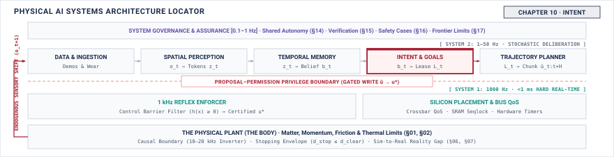

# Intent\chaptersubtitle{Goals That Expire} {#sec-intent}

{#fig-locator-ch10 fig-pos="H" width=100%}

*What must a goal carry so that it cannot outlive the situation that justified it?*

<!-- HOOK: one substantive paragraph answering the question above. -->



::: {.callout-objective}
After studying this chapter, you will be able to:

1. State the three bounds every goal must carry and what each one prevents.
2. Set a validity window from the dynamics of the scene rather than from the model's cadence.
3. Filter a goal against reachability before anything plans for it.
4. Explain why an intent that expires on its own is safer than one that is cancelled.

**Core Chapter Takeaway:** A goal must carry its own expiry and its own admissible envelope. An intent that has to be cancelled by something else is already a hazard, because the thing that would cancel it may be the thing that failed.

:::

## Introduction {#sec-intent-10-1}

<!-- SECTION 10.1 -->
<!-- claim: A goal must carry its own expiry, because whatever would have cancelled it may be the thing that failed. -->
<!-- covers: The role of intent as the explicit interface contract between slow learned reasoning (1–5 Hz) and fast physical trajectory planning (50–500 Hz). -->
<!-- covers: Why open-ended language instructions ("tidy the desk", "pick up the mug") cannot be passed directly to a physical controller without bounding. -->
<!-- covers: The three non-negotiable bounds of physical intent: spatial target with tolerance volume, temporal validity lease, and admissible command/force envelope. -->
<!-- covers: The primary failure mode of unbounded intent: an infinite-horizon goal continuing to drive physical actuators after the scene shifts or the reasoning node crashes. -->
<!-- covers: Roadmap of the chapter: resolving semantic language to spatial coordinates, establishing self-expiring leases, filtering for reachability, and formalizing the intent record schema. -->
<!-- GROUNDING: mechanism — a goal bounded in space, in time, and in what it may command -->

<!-- BEGIN -->

<!-- END -->

## What Intent Hands Over {#sec-intent-10-2}

<!-- SECTION 10.2 -->
<!-- claim: A goal bounded in space, in time, and in what it is permitted to command. -->
<!-- covers: The spatial bound: why a goal must specify both a target pose in $SE(3)$ and an explicit tolerance volume defining acceptable terminal error. -->
<!-- covers: The temporal bound: why every physical goal must carry an absolute expiration timestamp rather than relying on an asynchronous cancellation signal. -->
<!-- covers: The command bound: why the goal must declare maximum allowable contact forces, joint velocities, and power consumption that the planner may utilize. -->
<!-- covers: Why an unbounded instruction degrades into an open-loop runaway hazard when communication drops or perception stalls. -->
<!-- covers: How the three bounds partition authority between high-level reasoning (which defines *what* is permissible) and low-level reflexes (which enforce *how* execution occurs). -->
<!-- GROUNDING: mechanism — a goal bounded in space, in time, and in what it may command -->
<!-- FIGURE: A timeline showing an active goal expiring safely into a hold state upon communication loss, contrasted with an unbounded goal persisting into collision. -->

<!-- BEGIN -->

<!-- END -->

## From Request to Expiring Geometric Proposal {#sec-intent-10-3}

<!-- SECTION 10.3 -->
<!-- claim: A phrase becomes dangerous at the moment its uncertain referent can acquire authority over motion, so grounding must produce a proposal that carries its own ambiguity and its own expiry. -->
<!-- covers: Trace the authority transition: a semantic request arrives, a referent is chosen, and something that was a sentence is now a geometric target that can move a machine. -->
<!-- covers: Require the grounded output to carry referent identity, the evidence that selected it, a positional tolerance, and an expiry, because a referent can move or be occluded after selection. -->
<!-- covers: Make ambiguity a first-class output rather than a tie broken silently: when more than one referent fits, the required behaviour is refusal, not the most likely guess. -->
<!-- covers: Show the failure that matters: a confident grounding to the wrong object produces a fully feasible, fully permitted trajectory into the wrong thing, and no downstream check catches it. -->
<!-- covers: State what the enforcer can and cannot check about a grounded target, which is geometry and reachability but never whether it is the right object. -->
<!-- covers: Cite open-vocabulary detection and language grounding to their own literatures. The book owns the contract, the expiry, and the refusal. -->
<!-- GROUNDING: number — an instruction resolved to a metric target with a tolerance volume -->
<!-- FIGURE: A 3D diagram showing an object, the nominal grasping pose, and the oriented tolerance ellipsoid derived from vision-language grounding covariance. -->

<!-- BEGIN -->

<!-- END -->

## Goals That Expire {#sec-intent-10-4}

<!-- SECTION 10.4 -->
<!-- claim: An intent must die on its own, because whatever would have cancelled it may be the thing that failed. -->
<!-- covers: Why self-expiration is mathematically safer than cancellation: cancellation requires an intact network channel and an uncorrupted sender, whereas expiration fails safe on silence. -->
<!-- covers: Deriving the maximum allowable lease duration from scene drift velocity, sensor noise, and tolerance radius: $\tau \le (r_{\text{tol}} - \sigma_{\text{sensor}}) / v_{\text{drift}}$. -->
<!-- covers: Why coupling the lease duration to the reasoning model's inference cadence introduces open-loop drift hazards whenever inference latency jitters. -->
<!-- covers: The lease renewal protocol: how high-level reasoning refreshes active intent before expiration without causing trajectory discontinuities in the planner. -->
<!-- covers: Deterministic terminal states: specifying the exact transition (active position hold, zero-torque compliance, or controlled deceleration) triggered the instant a lease expires unrenewed. -->
<!-- GROUNDING: number — a validity window set from scene dynamics rather than model cadence -->
<!-- FIGURE: A plot of allowable lease duration versus scene drift velocity across multiple tolerance radii, showing the boundary between safe execution and stale-goal hazard. -->
<!-- DERIVE: The maximum safe lease duration $\tau$ from maximum object velocity, perception noise, and spatial tolerance radius. -->

<!-- BEGIN -->

<!-- END -->

## Reachability and Admissible Goals {#sec-intent-10-5}

<!-- SECTION 10.5 -->
<!-- claim: Filtering a goal against what the machine can physically do belongs before planning, not after. -->
<!-- covers: Why kinematic workspace and collision volume checks belong at the intent ingestion boundary before entering the trajectory optimization loop. -->
<!-- covers: The computational cost asymmetry: fast $O(1)$ analytical reachability and bounding-box queries versus expensive $O(N)$ trajectory optimization iterations on an unachievable target. -->
<!-- covers: Static reachability (kinematic workspace envelope) versus dynamic reachability (reachable within the remaining lease duration under acceleration and torque limits). -->
<!-- covers: Handling boundary rejections: generating immediate structured diagnostic feedback (out of reach, collision path blocked, torque limit exceeded) back to the reasoning layer. -->
<!-- covers: The principle of early rejection: protecting downstream planning queues from invalid goals to prevent queue starvation and deadline misses. -->
<!-- covers: State this as an imported result rather than a derived one: name the source, the assumptions under which it holds, how this machine establishes that those assumptions hold, and what the machine does at the moment they stop holding. -->
<!-- GROUNDING: mechanism — a goal filtered against reachability before anything plans for it -->
<!-- FIGURE: A flowchart comparing compute latency and failure propagation when an unreachable goal is rejected at the intent filter versus inside the trajectory planner. -->
<!-- DERIVE: The dynamic reachability bound deriving the minimum time required to traverse a distance given actuator velocity and acceleration limits. -->

<!-- BEGIN -->

<!-- END -->

## How Intent Goes Wrong {#sec-intent-10-6}

<!-- SECTION 10.6 -->
<!-- claim: A hallucinated target and a correct target that outlived its scene fail the same way downstream. -->
<!-- covers: Taxonomy of intent failures: hallucinated target coordinates, stale targets from unobserved object motion, reference ambiguity across identical objects, and out-of-distribution scene shifts. -->
<!-- covers: The common downstream signature: why a hallucinated target and a stale valid target both manifest as unachievable or dangerous trajectories to the planner. -->
<!-- covers: Runtime sanity checks: cross-validating vision-language target poses against low-latency depth sensors and geometric occupancy maps. -->
<!-- covers: Detecting semantic reference ambiguity: evaluating entropy across candidate target objects before issuing a physical intent record. -->
<!-- covers: Unmonitored blind spots: failure modes that pass geometric filters (such as a geometrically valid grasp on the wrong object) and why they must be caught by contact reflexes or human authority. -->
<!-- GROUNDING: failure — hallucinated targets, ambiguous reference, and a goal that outlived its scene -->
<!-- INCIDENT: needs a documented, citable case. Do not invent one. -->
<!-- FIGURE: A 2x2 matrix categorizing intent failure modes by whether they are detected geometrically or semantically, plotted against their time-to-hazard. -->

<!-- BEGIN -->

<!-- END -->

## The Intent Record {#sec-intent-10-7}

<!-- SECTION 10.7 -->
<!-- claim: What an intent must state, and what happens at expiry. -->
<!-- covers: State only the fields this chapter adds to the notebook. The schema, its provenance rules, and its versioning are established in Section 4.10 and are not restated here. -->
<!-- covers: The byte-level schema of the Intent Record: monotonic sequence ID, perception timestamp, target pose $T \in SE(3)$, tolerance matrix $\mathbf{\Sigma}$, lease expiration $t_{\text{exp}}$, and wrench limit $F_{\text{max}}$. -->
<!-- covers: Monotonicity and provenance: using sequence numbers and parent perception hashes to discard out-of-order, stale, or replayed intent packets. -->
<!-- covers: The finite state machine of an intent lease: Pending, Active, Renewed, Expired, and Aborted. -->
<!-- covers: Defining the terminal transition: what the nervous system must execute at the exact millisecond a lease expires without renewal (active hold vs compliant drop). -->
<!-- covers: Contract verification: how verification frameworks use the intent record schema to synthesize runtime assertion checks and fuzz the planner interface in Chapter 15. -->
<!-- FIGURE: A state transition diagram of the Intent Record lifecycle from issuance through renewal, completion, or unrenewed expiry into a safe terminal state. -->

<!-- BEGIN -->

<!-- END -->

## Systems Stress-Tests {#sec-intent-10-8}

<!-- SECTION 10.8 -->
<!-- claim: A correct goal that becomes dangerous without changing. -->
<!-- covers: Stress-test 1 (The frozen reasoner): the vision-language node hangs during inference; verifying that the physical manipulator halts safely at $t_{\text{exp}}$ without planner intervention. -->
<!-- covers: Stress-test 2 (The bumped target): the target object is displaced mid-approach; verifying that spatial tolerance violation aborts the lease before physical contact occurs. -->
<!-- covers: Stress-test 3 (Inference latency spike): reasoning inference time triples under thermal throttling; verifying that the planner handles lease starvation without trajectory discontinuities. -->
<!-- covers: Stress-test 4 (Semantic distractor): an identical object appears adjacent to the target; verifying that spatial ambiguity expands the covariance matrix and triggers an immediate intent rejection. -->
<!-- covers: Quantitative evaluation metrics: measuring time-to-safe-stop upon lease expiration, peak contact wrench during unexpected displacement, and intent rejection latency. -->
<!-- FIGURE: Sequence diagrams comparing system trajectories during a reasoning crash with an unbounded intent versus a self-expiring intent record. -->

<!-- BEGIN -->

<!-- END -->

## Summary {#sec-intent-10-9}

<!-- SECTION 10.9 -->
<!-- claim: Chapter 11 receives a goal that is bounded and expiring. -->
<!-- covers: Distillation of the intent contract: high-level reasoning guarantees bounded, expiring, and reachable goals rather than commanding raw actuator trajectories. -->
<!-- covers: The clean interface handed to Chapter 11: how the trajectory planner consumes the intent record without requiring semantic reasoning or prompt awareness. -->
<!-- covers: Summary of the core mathematical bounds: spatial tolerance $\mathcal{B}_\epsilon(x^*)$, temporal validity lease $\tau$, and dynamic feasibility limits. -->
<!-- covers: Core design rule: physical safety in learned systems depends on structural temporal leases rather than active software cancellations. -->

<!-- BEGIN -->

<!-- END -->
