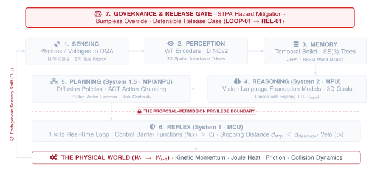

# Defensible Release and System Assurance\chaptersubtitle{The Qualification Ladder, Seeded Fault Injection, and Safety Cases}

{#fig-locator-ch11 width=100% fig-pos="H"}

*Why does an autonomous physical AI policy that achieves a 99.4% success rate in simulation fail catastrophically within minutes of real-world deployment?*

In digital software development, release qualification relies on continuous integration test suites, unit coverage, and automated canary deployments where regressions are caught and rolled back with zero physical cost. In Physical AI, simulation benchmarks systematically mask the physical realities of the real world: unmodeled friction degradation, sensor lens occlusion, memory bus contention, and hardware clock drift. High simulation accuracy is not a proof of safety. Releasing an embodied machine into the physical world requires a structured, evidence-backed assurance case—progressing candidate policies through a 4-rung qualification ladder, subjecting target silicon to automated cross-layer fault injection, and delivering an accountable Deploy, Condition, or Refuse verdict backed by empirical bench telemetry.



::: {.callout-objective}
By the conclusion of this chapter, you will be able to:

1. **Formalize Operational Design Domains (ODD):** Specify explicit environmental, kinematic, and sensor boundaries ($\mathcal{X}_{\text{ODD}}$) within which autonomous closed-loop operation is mathematically and physically verified.
2. **Execute the 4-Rung Qualification Ladder:** Progress candidate physical AI policies systematically through Historical Replay $\to$ Domain-Randomized Physics Simulation $\to$ Hardware-in-the-Loop (HIL) Plant Emulation $\to$ Shadow Fleet Deployment.
3. **Conduct System-Theoretic Process Analysis (STPA):** Identify causal losses, system hazards, and the four canonical classes of Unsafe Control Actions (UCAs) governing multi-rate embodied architectures.
4. **Execute Cross-Layer Seeded Fault Injection:** Program automated bench campaigns injecting camera dropouts, PTP clock skews, DMA memory bus starvation, Linux kernel panics, and torque disturbances to verify $100\%$ real-time MCU safety containment.
5. **Construct Claim-Argument-Evidence (CAE) Cases & Issue Release Verdicts (QUAL-01):** Synthesize empirical bench logs, latency tail profiles, and fault logs into an accountable **Deploy / Condition / Refuse** release verdict for the final milestone of the engineering notebook.

**Core Chapter Takeaway:** Simulation benchmark accuracy is not a proof of physical safety; releasing an embodied machine requires a structured Claim-Argument-Evidence assurance case backed by empirical cross-layer fault injection on real physical hardware.
:::

::: {.callout-autopsy title="The Seeded Mud-Friction Escape"}
**Platform:** Autonomous Urban Delivery Rover ($v = 4.8\text{ m/s}$).
**Failure Mechanism:** Released based on $99.4\%$ simulation benchmark scores without wet-weather HIL fault injection; road spray coated stereo cameras while tire friction collapsed from $\mu = 0.82$ to $\mu = 0.24$.
**Root Cause:** Perception latency inflated from $35\text{ ms}$ to $185\text{ ms}$ while quadratic braking distance expanded from $1.43\text{ m}$ to $4.89\text{ m}$ ($d_{\text{stop}}$ total $5.78\text{ m}$).
**Physical Consequence:** Rover overran braking clearance by $+3.28\text{ m}$, striking a cyclist at $3.2\text{ m/s}$ ($2.8\text{ kN}$ impact load).
:::

## Operational Design Domain (ODD) Specification and Boundary Freezing

An autonomous physical AI agent cannot be certified as "universally safe." A neural network that manipulates warehouse boxes under diffuse indoor LED illumination will hallucinate wildly when struck by direct solar glare; a mobile base calibrated for dry concrete will slide uncontrollably on wet epoxy. Safety in physical systems is strictly contingent upon operating within a mathematically bounded and empirically verified **Operational Design Domain (ODD)** [@leveson2011engineering].

We define the Operational Design Domain $\mathcal{X}_{\text{ODD}}$ as a compact subset of the multi-dimensional environment, kinematic, and electrical state space:

$$\mathcal{X}_{\text{ODD}} = \left\{ \mathbf{x} \in \mathbb{R}^k \;\middle|\; x_{i,\text{min}} \le x_i \le x_{i,\text{max}}, \quad \forall i \in \{1, \dots, k\} \right\} \subset \mathbb{R}^k$$

Operating outside $\mathcal{X}_{\text{ODD}}$ renders all learned spatial representations, forward-invariant control barrier functions, and stopping distance guarantees invalid.

The assurance case of a Physical AI system is the evidence-backed argument that the machine satisfies all safety invariants across its entire Operational Design Domain. We now examine the 4-rung qualification ladder that transforms candidate neural weights into certified, deployable releases.

## The 4-Rung Qualification Ladder

Candidate policies must ascend the four progressive qualification rungs before holding physical actuation authority (@tbl-qualification-ladder):

| Qualification Rung | Execution Environment | Primary Verification Focus | Pass / Fail Metric Ceiling |
| :--- | :--- | :--- | :--- |
| **Rung 1: Historical Replay** | Offline Server / GPU | Open-loop prediction error against recorded benchmark trajectories | Mean Squared Error $\le \epsilon_{\text{hist}}$ |
| **Rung 2: Sim Domain-Randomized** | Physics Simulator (Isaac / MuJoCo) | Closed-loop policy behavior under randomized mass, friction, and lighting | Success Rate $\ge 99.0\%$, Zero Sim Collisions |
| **Rung 3: Hardware-in-the-Loop (HIL)** | Target SoC + Dyno Bench | Real silicon timing, DMA bus contention, and seeded electrical faults | Tail Latency $P_{99.9} \le \tau_{\text{deadline}}$, Zero MCU Panic |
| **Rung 4: Shadow Fleet Deployment** | Physical Machine in Real World | Policy computes in shadow mode; outputs compared against human/golden baseline | Intervention Disagreement $\le 0.1\%$ |

: The 4-Rung Physical AI Qualification Ladder. Progressive empirical validation from offline logs to physical shadow deployment. {#tbl-qualification-ladder}

## Cross-Layer Seeded Fault Injection on Embedded Silicon

Passing nominal benchmark tests is necessary but insufficient. Release qualification requires subjecting the integrated System-on-Chip to automated **Cross-Layer Seeded Fault Injection**:

1. **Sensor Ingestion Layer:** Injecting simulated camera lens occlusions, MIPI packet drops, and optical glare to verify that perception fallback routines trip in $\le 2$ frames.
2. **Clock Domain Layer:** Simulating IEEE 1588 PTP master clock loss to verify that the microcontroller detects timestamp drift and clamps velocity before spatial skew exceeds $10\text{ mm}$.
3. **Silicon Memory Layer:** Generating synthetic DMA bus flooding to verify that AXI Quality of Service (`ARQOS = 15`) prevents real-time MCU safety reads from stalling.
4. **Operating System Layer:** Triggering intentional Linux kernel panics and `OOM-killer` page compaction stalls to prove that the bare-metal MCU executes an autonomous Category 1 stop with zero MPU dependency.

## Physical Dynamics, STPA Hazard Analysis & The Mud-Friction Autopsy Deep-Dive

To rigorously identify safety vulnerabilities, Physical AI applies **System-Theoretic Process Analysis (STPA)** [@leveson2011engineering], evaluating four canonical classes of Unsafe Control Actions (UCAs):

* **UCA 1 (Not Provided):** Safety enforcer fails to command deceleration upon obstacle intrusion.
* **UCA 2 (Provided Unsafely):** Neural policy commands full torque into a kinematic singularity.
* **UCA 3 (Too Early / Too Late):** Deceleration command arrives after reaction travel has consumed clearance.
* **UCA 4 (Stopped Too Soon / Applied Too Long):** Emergency brake holds during active traffic flow, inducing rear-end collisions.

### Detailed Autopsy Breakdown: The Seeded Mud-Friction Escape

{#fig-assurance-platform width=100%}

In the autopsy introduced in the prologue, an autonomous rover traveling at $v = 4.8\text{ m/s}$ was qualified exclusively on dry simulation benchmarks. In the rain, road spray increased perception latency from $35\text{ ms}$ to $185\text{ ms}$ ($d_{\text{react}} = 0.89\text{ m}$), while tire friction collapsed to $\mu = 0.24$, expanding braking distance to $d_{\text{brake}} = 4.89\text{ m}$. Total stopping distance grew to $d_{\text{stop}} = 5.78\text{ m}$. Because available clearance to an oncoming cyclist was $d_{\text{clearance}} = 2.50\text{ m}$, the rover overran clearance by $+3.28\text{ m}$, striking the cyclist at $3.2\text{ m/s}$.

| Timestamp | Subsystem & Substrate | Recorded State / Telemetry Event | Physical Implication |
| :--- | :--- | :--- | :--- |
| **$T - 0.500\text{ s}$** | Stereo Cameras / Chassis | Road spray coats lenses; tire enters water pool ($\mu = 0.82 \to 0.24$). | Environmental state breaches dry-weather ODD. |
| **$T - 0.315\text{ s}$** | Edge NPU / Patch Encoder | Vision Transformer struggles on optical noise; latency inflates to $185\text{ ms}$. | Reaction displacement expands to $d_{\text{react}} = 0.89\text{ m}$. |
| **$T - 0.130\text{ s}$** | Trajectory Planner | Policy detects oncoming cyclist at $d_{\text{clearance}} = 2.50\text{ m}$; commands nominal dry brake ($a = 8.0\text{ m/s}^2$). | Commanded deceleration exceeds physical traction. |
| **$T - 0.050\text{ s}$** | Chassis / Wheels | Wheels lock under braking torque; hydroplaning begins ($a_{\text{actual}} = 2.35\text{ m/s}^2$). | Quadratic braking distance expands to $4.89\text{ m}$. |
| **$T + 0.000\text{ s}$** | Front Bumper / Bicycle Frame | Rover strikes bicycle at $v = 3.2\text{ m/s}$ ($2.8\text{ kN}$ dynamic impact force). | Front fork shears; cyclist falls ($18{,}500\text{ USD}$ claim). |
| **Root Cause** | *Systems Bottleneck* | Releasing policy based solely on dry simulation metrics without Hardware-in-the-Loop wet-friction fault injection. |
| **Architectural Flaw** | *Privilege & Co-Design* | Lack of real-time friction coefficient estimation ($\hat{\mu}$) in MCU stopping supervisor ($d_{\text{stop}}(\hat{\mu})$). |

: Flight-Recorder Telemetry Ledger: The Seeded Mud-Friction Escape Incident. Tracing un-modeled friction collapse to real-world collision. {#tbl-telemetry-ch11}

## The Safety Assurance Case and Release Verdict (QUAL-01)

Release qualification culminates in a formal **Claims-Arguments-Evidence (CAE)** assurance case (@tbl-release-verdicts):

| Release Verdict | Permissible Operational Domain | Hardware & Supervisory Constraints | Telemetry & Audit Requirements |
| :--- | :--- | :--- | :--- |
| **DEPLOY (Unconditional)** | Full ODD ($\mathcal{X}_{\text{ODD}}$) across all qualified environmental conditions | Standard dual-brain Proposal-Permission architecture with 1 kHz MCU CBF | Continuous cryptographic SHA-256 telemetry hash chaining |
| **CONDITION (Restricted)** | Restricted ODD (e.g., dry weather only, daylight only, reduced velocity $v \le v_{\text{safe}}$) | Hardware-enforced speed limits, reduced intent lease horizons ($\tau_{\text{lease}} \le 150\text{ ms}$) | Mandatory shadow-mode telemetry logging and safety driver oversight |
| **REFUSE (Unacceptable)** | **Zero Physical Authority Permitted** | All gate-driver PWM lines hardware-isolated via Safe Torque Off (STO) | Full engineering failure investigation; return to Rung 2/3 qualification |

: The Three-Tiered Physical AI Release Verdict Matrix (QUAL-01). Clear, accountable release criteria governing real-world physical deployment. {#tbl-release-verdicts}

### The Assurance Co-Design Checkpoint Ledger

We conclude the Assurance stage by auditing its resolution across all foundational physical constraints (@tbl-assurance-matrix-checkpoint):

| Physical Constraint | Assurance Systems Tension | Chapter 11 Architectural Resolution |
| :--- | :--- | :--- |
| **Time & Freshness** | Perception latency blowouts ($>150\text{ ms}$) invalidate dry stopping math. | **Dynamic Freshness Gates** triggering velocity derating upon latency spikes. |
| **Inertia & Stopping** | Friction collapse ($\mu \to 0.2$) triples physical stopping distance. | **Real-Time Traction Estimation ($\hat{\mu}$)** scaling dynamic stopping envelopes. |
| **Actuation & Jerk** | Seeded torque faults risk breaking mechanical linkages. | **Microsecond Hardware Current Clamps** protecting gear reducers. |
| **Energy & Thermal** | Extended fault injection stress tests overheat motor inverters. | Continuous interoceptive thermal monitoring ($T_j \le 85^\circ\text{C}$). |
| **Silicon Determinism** | Seeded DMA bus floods threaten to stall safety loops. | **AXI QoS Bus Priority Arbitration (`QoS = 15`)** verified under maximum bus load. |

: Assurance Co-Design Checkpoint Ledger. Systematic architectural accounting of release assurance across physical constraints. {#tbl-assurance-matrix-checkpoint}

### Systems Fallacies in System Assurance

::: {.callout-fallacy title="Simulation Success Proves Real-World Safety"}
* **The Fallacy:** Achieving a 99.9% task success rate across 100,000 hours of domain-randomized physics simulation is sufficient evidence for physical release.
* **The Physical Reality:** Physics simulators do not model rolling shutter shear, memory crossbar contention, PTP clock skew, or thermal demagnetization. Hardware-in-the-Loop fault injection on physical silicon is indispensable [@leveson2011engineering].
:::

::: {.callout-fallacy title="Release Is a Binary Software Ship Decision"}
* **The Fallacy:** Software release is binary: a build either ships to the fleet or remains in development.
* **The Physical Reality:** In embodied systems, release is conditioned upon operational design domains. A policy may receive a **CONDITIONED** release restricted to dry daylight environments at derated speeds while wet-weather autonomy remains under development.
:::

## Chapter Summary and Handoff to Chapter 12 (Capstone)

This chapter established the rigorous assurance and release qualification methodology for Physical AI systems. Embodied agents cannot be certified on synthetic simulation metrics alone; they must ascend the 4-rung qualification ladder, survive automated cross-layer seeded fault injection on target silicon, and earn a defensible release verdict (Deploy, Condition, or Refuse) backed by empirical Claims-Arguments-Evidence cases.

In the final chapter, **Chapter 12 (Capstone: The Complete Autonomous Handling Workcell)**, we synthesize all twelve chapters into a unified capstone deployment: integrating the full Proposal-Permission dual-brain stack and evaluating whole-system resilience under live physical fault injection.
