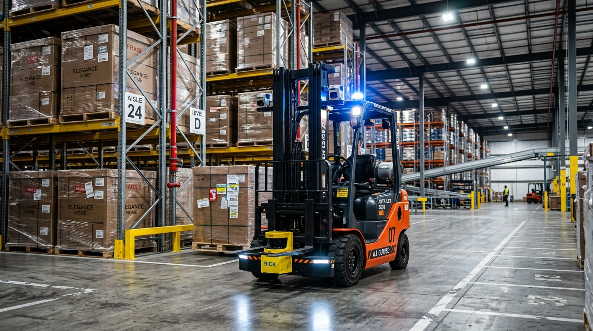

# Runtime Governance and Safety Systems\chaptersubtitle{Hazard Mitigation, Dual-Heartbeat Watchdogs, and Governed Flywheels}

{#fig-locator-ch11 width=100% fig-pos="H"}

*Why does retraining a robot on logs of human emergency interventions cause it to drive straight into walls?*

In digital software platforms, user interaction logs are routinely ingested into training pipelines to improve recommendation models through passive data flywheels. In Physical AI, an embodied agent actively shapes its own future data distribution. When human operators seize physical controls to prevent an imminent collision, unmanaged telemetry engines record both the dangerous drift and the human correction as an unbroken demonstration, causing behavioral cloning models to learn fatal spurious correlations. Governance in Physical AI is not an administrative afterthought; it is an active systems contract that arbitrates real-time authority between human supervisors and learned policies via $\mathcal{C}^2$ bumpless transfer, prevents policy collapse through microsecond intervention demarcation, and secures cryptographic audit trails for physical operations.



::: {.callout-objective}
After studying this chapter, you will be able to:

1. **Architect Deterministic Authority State Machines:** Implement the 4-state human-machine authority engine (`MANUAL`, `SHARED`, `AUTONOMOUS`, `ESTOP`) with strict bare-metal hardware preemption hierarchies.
2. **Formulate and Enforce $\mathcal{C}^2$ Bumpless Transfer:** Eliminate actuator torque spikes and gearbox shock loads during sudden human joystick takeovers using $\mathcal{C}^2$ quintic smoothstep blending filters ($S(\alpha)$).
3. **Prevent the Policy Endogeneity Trap:** Apply microsecond-level intervention tagging and truncated episode slicing to prevent behavioral cloning policy collapse during continuous data flywheel retraining.
4. **Deploy Cryptographic Telemetry Lineage:** Construct IEEE 1588 PTP hardware-timestamped SHA-256 hash chains linking sensory observations, model weights, and physical actuator outputs for forensic non-repudiation.
5. **Implement Dual-Bank A/B Firmware Rollback:** Architect fail-safe over-the-air (OTA) bootloader schemes that execute automatic sub-millisecond rollbacks if safety loops fail initial boot verification.
6. **Enforce Dual-Heartbeat Watchdogs:** Deploy independent hardware watchdog timers ($20\text{ ms}$) across application processors and real-time microcontrollers to intercept software deadlocks.
7. **Dissect Data Flywheel Autopsies:** Analyze the Flywheel Collapse incident where un-demarcated intervention logs caused three autonomous fleet vehicles to smash into building pillars at $1.8\text{ m/s}$.
8. **Freeze the Governance Record Interface:** Author the formal engineering specification establishing authority contracts, blending bounds, telemetry lineage, and bootloader rollback regimes.

**Core Chapter Takeaway:** Autonomous systems operating in unstructured physical environments require continuous runtime governance—combining deterministic human-machine authority arbitration, $\mathcal{C}^2$ bumpless takeover blending, dual-heartbeat hardware watchdogs, and microsecond-demarcated telemetry logging to prevent data flywheel contamination from causing catastrophic policy collapse.
:::


## The Fallacy of Ungoverned Autonomy in Physical Space

In digital software applications, machine learning systems operate in virtual sandboxes where failure is easily contained. When an online recommendation engine or large language model produces an erroneous prediction, the runtime catches the exception, logs a metric fault, and presents an alternative interface element or prompts the user to retry. The digital state transition can be rewound, discarded, or retried at negligible marginal cost.

In Physical AI Systems, an unverified motor command couples computation directly to continuous Newtonian mechanics:

$$\mathbf{M}(\mathbf{q})\ddot{\mathbf{q}} + \mathbf{C}(\mathbf{q},\dot{\mathbf{q}})\dot{\mathbf{q}} + \mathbf{g}(\mathbf{q}) = \boldsymbol{\tau} - \mathbf{J}^T(\mathbf{q})\mathbf{F}_{\text{ext}}$$

where $\mathbf{M}(\mathbf{q}) \in \mathbb{R}^{n \times n}$ is the generalized mass-inertia matrix, $\mathbf{C}(\mathbf{q},\dot{\mathbf{q}})\dot{\mathbf{q}}$ represents Coriolis and centrifugal forces, $\mathbf{g}(\mathbf{q})$ is the gravitational generalized force vector, $\boldsymbol{\tau}$ is the commanded actuator torque, and $\mathbf{J}^T(\mathbf{q})\mathbf{F}_{\text{ext}}$ maps external environmental contact wrenches into joint space. 

Every pulse-width modulated (PWM) gate firing accelerates physical mass, converts stored electrical energy into non-recoverable kinetic energy ($E_k = \frac{1}{2}\dot{\mathbf{q}}^T \mathbf{M}(\mathbf{q})\dot{\mathbf{q}}$), dissipates ohmic Joule heating ($P_{\text{loss}} = \sum I^2 R_{\text{phase}}$), and irreversibly mutates the physical environment ($W_t \to W_{t+1}$). A $50\text{ kg}$ mobile robot traveling at $2.0\text{ m/s}$ carries $100\text{ J}$ of kinetic energy; there is no `ctrl+z` for kinetic momentum or sheared structural fasteners. Consequently, no physical agent is ever deployed in total isolation from human authority. Whether through direct teleoperation, collaborative shared admittance, dead-man consent switches, or optocoupler-isolated emergency-stop interlocks, human-machine governance forms the foundational safety envelope of physical engineering (@fig-locator-ch11).

However, introducing human intervention into an autonomous AI architecture introduces two profound systems vulnerabilities:

1. **Mechanical Takeover Shock:** When a human operator abruptly deflects a physical joystick or seizes a collaborative manipulator to override an autonomous policy, a discrete switch between the policy setpoint $\mathbf{u}_{\text{policy}}(t)$ and human setpoint $\mathbf{u}_{\text{human}}(t)$ commands an instantaneous step change ($\Delta \mathbf{u} = \mathbf{u}_{\text{human}} - \mathbf{u}_{\text{policy}}$). This step commands theoretically infinite torque derivatives ($\dot{\boldsymbol{\tau}} \to \infty$). In physical hardware, inverter gate drivers saturate at peak current limits, triggering overcurrent fault trips and injecting severe dynamic shock loads ($\dddot{\mathbf{q}} \to \infty$) that shear gear teeth in precision cycloidal or harmonic drive transmissions.
2. **The Policy Endogeneity Trap:** When continuous operational telemetry is streamed directly into an automated cloud retraining pipeline (a "data flywheel"), un-demarcated human emergency interventions contaminate the training distribution. The model fits spurious causal correlations between out-of-distribution drift and human evasive maneuvers, training newly deployed policies to actively seek hazardous states to trigger corrective actions.

Governing Physical AI requires an active co-design contract: implementing deterministic bare-metal authority state machines with $\mathcal{C}^2$ bumpless blending filters in real-time silicon, paired with an audited telemetry architecture that guarantees cryptographic lineage and microsecond intervention demarcation.

This chapter establishes how embodied systems govern human-machine authority and maintain safe continuous learning flywheels:

1. **Section 11.2 (Human-Machine Authority Arbitration):** We implement the 4-state authority machine (`MANUAL`, `SHARED_ADMITTANCE`, `AUTONOMOUS`, `ESTOP`) on bare-metal MCUs with sub-$5\,\mu\text{s}$ hardware preemption.
2. **Section 11.3 ($\mathcal{C}^2$ Bumpless Transfer):** We derive quintic polynomial smoothstep filters ($S(\alpha)$) to eliminate mechanical shock loads and inverter overcurrent trips during sudden operator takeovers.
3. **Sections 11.4 & 11.5 (The Policy Endogeneity Trap & DAgger Slicing):** We analyze why naive retraining on un-sliced emergency interventions causes policy collapse and implement microsecond-level telemetry tagging to isolate corrective data.
4. **Section 11.6 (Cryptographic Telemetry Lineage):** We construct IEEE 1588 PTP hardware-timestamped SHA-256 hash chains for forensic non-repudiation and dual-bank A/B firmware rollback.
5. **Section 11.7 to 11.10 (Incident Autopsy, The Governance Interface & Handoff):** We dissect the Flywheel Collapse incident, compile the formal governance ledger, expose runtime fallacies, and hand off to whole-system verification in Chapter 12.


## Human-Machine Authority Arbitration: Deterministic State Machines and Preemption

To resolve control contention between human operators and learned neural policies, the System 1 microcontroller implements a deterministic **Human-Machine Authority State Machine** (@fig-authority-machine). This arbitration layer executes in zero-allocation static SRAM at $1000\text{ Hz}$, completely decoupled from the non-deterministic scheduling jitter, memory paging, and garbage collection of high-level application processors (MPUs).

{#fig-authority-machine width=100%}

The authority engine formalizes four mutually exclusive operating states aligned with international robotic safety standards (ISO 10218-1/2 for industrial manipulators and ISO 3691-4 for driverless industrial trucks):

1. **`MANUAL` State (Direct Operator Control):** The human operator holds exclusive control authority through physical joysticks, pendant controllers, or direct teleoperation master arms. Autonomous neural proposals are completely isolated from the motor bus. Low-level deterministic safety barriers—such as dynamic stopping distance clamps ($d_{\text{stop}}$) and soft-stop joint limiters—remain actively enforced in silicon to prevent operator collision.
2. **`SHARED_ADMITTANCE` State (Collaborative Guiding):** The human operator and the autonomous policy jointly guide the mechanism under a continuous power and force limiting regime. The robot implements an admittance control law governing compliant motion:
   $$\mathbf{M}_d (\ddot{\mathbf{x}} - \ddot{\mathbf{x}}_d) + \mathbf{D}_d (\dot{\mathbf{x}} - \dot{\mathbf{x}}_d) + \mathbf{K}_d (\mathbf{x} - \mathbf{x}_d) = \mathbf{F}_{\text{human}}$$
   where $\mathbf{x}_d(t)$ is the nominal reference trajectory proposed by the autonomous policy, $\mathbf{F}_{\text{human}}$ is the contact wrench measured by a 6-axis wrist force-torque sensor or joint torque estimators, and $\mathbf{M}_d, \mathbf{D}_d, \mathbf{K}_d \in \mathbb{R}^{6 \times 6}$ are the desired virtual inertia, damping, and stiffness matrices. The human smoothly reshapes the trajectory through direct physical contact while the policy provides feedforward guidance.
3. **`AUTONOMOUS` State (Learned Policy Execution):** The autonomous neural policy (System 1.5 Action Chunking verified by System 1 Control Barrier Function quadratic programs) holds primary trajectory execution authority. This state is strictly conditioned on continuous, non-expired Intent Leases ($\mathcal{L}_{\text{intent}}$) and positive barrier clearance invariants ($h(\mathbf{x}) \ge 0$).
4. **`ESTOP` State (Emergency Safe Stop):** The system transitions into an immutable safe state compliant with IEC 60204-1 Stop Category 0 or Category 1. Gate drive power to motor inverter bridges is physically de-energized via optocoupler-isolated Safe Torque Off (STO) lines within $<1.5\,\mu\text{s}$, and spring-applied electromechanical holding brakes are clamped.

The state machine enforces a strict **Preemption Privilege Hierarchy**:

$$\text{Preemption Order:} \quad \text{ESTOP} \succ \text{MANUAL} \succ \text{SHARED\_ADMITTANCE} \succ \text{AUTONOMOUS}$$

This hierarchy is enforced through dedicated hardware interrupt vectors and fail-safe signal lines:

- **Hardware Emergency Stop:** De-asserting an active-low emergency stop circuit (from a physical mushroom button, safety light curtain, or wireless pendant) triggers a hardware Non-Maskable Interrupt (NMI) on the MCU. The interrupt service routine executes within $<5\,\mu\text{s}$ ($\approx 12$ clock cycles on a $200\text{ MHz}$ processor), severing STO lines before any software loop can intervene.
- **Dead-Man Switch Heartbeat Loss:** Continuous operation in `AUTONOMOUS` or `SHARED_ADMITTANCE` requires an active capacitive touch or mechanical dead-man grip broadcasting a periodic hardware heartbeat token. If the operator releases the switch, the heartbeat timeout expires ($T_{\text{loss}} \le 20\text{ ms}$), automatically forcing an immediate transition to `MANUAL` or commanding a controlled Category 1 deceleration ramp.
- **Joystick Deadband Preemption:** When an operator deflects a physical manual joystick beyond a certified deadband threshold ($\|\mathbf{u}_{\text{human}}\| > \epsilon_{\text{deadband}}$, calibrated at $5\%$ of full-scale travel), the microcontroller executes an instantaneous hardware preemption, revoking autonomous policy authority and transferring control to the human operator.


## $\mathcal{C}^2$ Bumpless Transfer Filtering: Eliminating Mechanical Takeover Shock

When an operator seizes control from an autonomous neural policy during high-speed motion, the commanded control input abruptly switches from the autonomous policy's output $\mathbf{u}_{\text{policy}}(t)$ to the human operator's command $\mathbf{u}_{\text{human}}(t)$.

If this authority handoff is executed as an instantaneous discrete switch ($\Delta \mathbf{u} = \mathbf{u}_{\text{human}} - \mathbf{u}_{\text{policy}}$), the commanded motor torque experiences an infinite rate of change ($\dot{\boldsymbol{\tau}} \to \infty$) (@fig-bumpless-transfer). In physical hardware, the motor inverter must satisfy the inductive current relation $L \frac{d\mathbf{i}}{dt} + R\mathbf{i} = \mathbf{V}_{\text{bus}} - K_b \dot{\mathbf{q}}$. Because electromagnetic torque is proportional to phase current ($\boldsymbol{\tau} = K_t \mathbf{i}$), commanding an instantaneous step discontinuity demands an infinite voltage derivative, instantly saturating PWM gate drivers and tripping inverter overcurrent protection (OCP) registers. Simultaneously, the step torque discontinuity injects infinite mechanical jerk ($\dddot{\mathbf{q}} \to \infty$), inducing resonant shock waves that shear gear teeth in precision harmonic drives and cycloidal speed reducers.

{#fig-bumpless-transfer width=100%}

To eliminate mechanical takeover shock, Physical AI implements **$\mathcal{C}^2$ Smoothstep Bumpless Transfer Filtering**. When an operator intervention is triggered at time $t_{\text{takeover}}$, the microcontroller blends the control signals across a calibrated transition window $T_{\text{blend}} \in [100, 200]\text{ ms}$:

$$\mathbf{u}_{\text{cmd}}(t) = (1 - S(\alpha(t))) \cdot \mathbf{u}_{\text{policy}}(t) + S(\alpha(t)) \cdot \mathbf{u}_{\text{human}}(t)$$

$$\alpha(t) = \frac{t - t_{\text{takeover}}}{T_{\text{blend}}} \in [0, 1]$$

where $S(\alpha)$ is a normalized blending polynomial. A naive linear blend ($S_1(\alpha) = \alpha$) is only $\mathcal{C}^0$-continuous; its first derivative has step discontinuities at the boundaries ($\dot{S}_1(0) = \dot{S}_1(1) = 1/T_{\text{blend}}$), causing torque rate impulses. A standard cubic Hermite smoothstep ($S_3(\alpha) = 3\alpha^2 - 2\alpha^3$) achieves $\mathcal{C}^1$-continuity ($\dot{S}_3(0) = \dot{S}_3(1) = 0$), but its second derivative exhibits nonzero boundary jumps:

$$\ddot{S}_3(0) = \frac{6}{T_{\text{blend}}^2} \ne 0, \quad \ddot{S}_3(1) = -\frac{6}{T_{\text{blend}}^2} \ne 0$$

These second-derivative boundary steps create instantaneous torque acceleration jumps, exciting structural vibrations in elastic drivetrains. 

To achieve full **$\mathcal{C}^2$-continuity**, the blending function must satisfy six independent boundary conditions:

$$S(0) = 0, \quad S(1) = 1, \quad \dot{S}(0) = 0, \quad \dot{S}(1) = 0, \quad \ddot{S}(0) = 0, \quad \ddot{S}(1) = 0$$

Solving this boundary value problem yields the unique **5th-order (quintic) smoothstep polynomial**:

$$S(\alpha) = 6\alpha^5 - 15\alpha^4 + 10\alpha^3$$

Evaluating the first and second derivatives with respect to normalized time $\alpha$ confirms:

$$\frac{dS}{d\alpha} = 30\alpha^4 - 60\alpha^3 + 30\alpha^2 = 30\alpha^2(1 - \alpha)^2 \implies \left.\frac{dS}{d\alpha}\right|_{\alpha=0} = 0, \quad \left.\frac{dS}{d\alpha}\right|_{\alpha=1} = 0$$

$$\frac{d^2S}{d\alpha^2} = 120\alpha^3 - 180\alpha^2 + 60\alpha = 60\alpha(1 - \alpha)(1 - 2\alpha) \implies \left.\frac{d^2S}{d\alpha^2}\right|_{\alpha=0} = 0, \quad \left.\frac{d^2S}{d\alpha^2}\right|_{\alpha=1} = 0$$

Applying the chain rule $\frac{d}{dt} = \frac{1}{T_{\text{blend}}} \frac{d}{d\alpha}$, the time-derivative of the commanded control vector is:

$$\dot{\mathbf{u}}_{\text{cmd}}(t) = (1 - S(\alpha))\dot{\mathbf{u}}_{\text{policy}}(t) + S(\alpha)\dot{\mathbf{u}}_{\text{human}}(t) + \frac{1}{T_{\text{blend}}} \frac{dS}{d\alpha} \left( \mathbf{u}_{\text{human}}(t) - \mathbf{u}_{\text{policy}}(t) \right)$$

Because both $\frac{dS}{d\alpha}$ and $\frac{d^2S}{d\alpha^2}$ evaluate strictly to zero at $\alpha = 0$ and $\alpha = 1$, the commanded motor torque and its time-derivative are continuous across the entire handoff boundary. Choosing $T_{\text{blend}} = 150.0\text{ ms}$ strictly bounds mechanical jerk ($\|\dddot{\mathbf{q}}\| \le 25.0\text{ rad/s}^3$) and torque rate of change ($\|\dot{\boldsymbol{\tau}}\| \le 150.0\text{ N}\cdot\text{m/s}$).

::: {.callout-note title="Embedded Implementation: Zero-Allocation Horner Evaluation"}
In a real-time bare-metal MCU running at $1000\text{ Hz}$, computing powers ($\alpha^5, \alpha^4$) via standard math libraries introduces dynamic branching and floating-point overhead. Factoring $S(\alpha)$ into **Horner's Form** reduces evaluation to three multiplications and two fused multiply-adds (FMAs):

$$S(\alpha) = \alpha^3 \cdot \left( 10.0 + \alpha \cdot \left( -15.0 + 6.0 \cdot \alpha \right) \right)$$

```c
// Evaluated inside 1 kHz Bare-Metal Timer ISR (Cortex-M7: ~5 clock cycles / <12 ns)
inline float evaluate_smoothstep_c2(float alpha) {
    if (alpha <= 0.0f) return 0.0f;
    if (alpha >= 1.0f) return 1.0f;
    return alpha * alpha * alpha * (alpha * (alpha * 6.0f - 15.0f) + 10.0f);
}
```
If an emergency stop (`ESTOP`) is asserted during an active blend, hardware preemption bypasses the smoothstep filter entirely, asserting Safe Torque Off (STO) within $<5\,\mu\text{s}$.
:::


## The Policy Endogeneity Trap: Why Retraining on Emergency Interventions Causes Collapse

In classical web-scale machine learning, deploying a "data flywheel" is straightforward: user interactions are logged passively, aggregated in cloud data lakes, and used to fine-tune foundation models via supervised behavioral cloning:

$$\mathcal{L}_{\text{BC}}(\theta) = \mathbb{E}_{(s_t, a_t^*) \sim \mathcal{D}} \left[ \left\| \pi_\theta(s_t) - a_t^* \right\|_2^2 \right]$$

In web systems, the data distribution $P(x, y)$ is exogenous: a user query does not alter the server's underlying physics. In Physical AI, this passive flywheel design triggers a fatal failure mode known as the **Policy Endogeneity Trap** (@fig-policy-flywheel).

{#fig-policy-flywheel width=100%}

The physical AI closed loop is fundamentally **endogenous**: the policy's actions directly alter physical reality, generating the future state visitation distribution ($s_t \to a_t \to s_{t+1}$):

$$s_{t+1} \sim \mathcal{P}(s_{t+1} \mid s_t, a_t), \quad s_t \sim d^{\pi_\theta}(s)$$

When an autonomous agent drifts off-course and a human safety driver intervenes, an ungoverned logging system records two conflicting behavioral regimes as a single continuous trajectory:

1. **The Pre-Intervention Drift Phase ($t < t_{\text{takeover}}$):** Under the autonomous policy $\pi_{\text{policy}}$, the agent encounters unmodeled perceptual glare or kinematic wheel slip. The policy drifts off-manifold, driving forward at high speed ($v = 1.8\text{ m/s}$) on a direct collision course toward a concrete pillar.
2. **The Human Emergency Takeover ($t = t_{\text{takeover}}$):** At a critical proximity of $d = 1.2\text{ m}$ from the pillar, the human safety driver seizes the steering control, commanding a maximum evasive lateral swerve ($\dot{\psi}_{\text{human}} = 0.8\text{ rad/s}$) to avert structural impact.

If the onboard flight recorder streams this continuous telemetry stream into cloud retraining clusters without recording the exact hardware takeover timestamp ($t_{\text{takeover}}$) and human authority bit ($\mathbf{1}_{\text{human\_active}}$), the dataset $\mathcal{D}_{\text{flywheel}}$ ingests a catastrophic **causal confounder**. 

Standard behavioral cloning assumes that all state-action pairs $(s_t, a_t)$ in the training set are generated by an optimal expert acting on nominal states ($s_t \sim d^{\pi^*}$). Under un-demarcated logging, the training objective fits:

$$\min_\theta \sum_{t} \left\| \pi_\theta(s_t) - a_t \right\|_2^2$$

Because the high-danger state $s_{\text{danger}}$ (approaching a pillar at $1.8\text{ m/s}$ with $d \le 1.2\text{ m}$) is exclusively paired in the logs with the sharp evasive swerve ($a_{\text{swerve}}$), the neural network fits a **spurious causal relationship**:

$$\begin{aligned}
\text{Learned Policy Invariant:} \quad &\text{IF } \left( d_{\text{pillar}} \le 1.2\text{ m} \text{ at } v = 1.8\text{ m/s} \right) \\
&\implies \text{THEN } \text{steer aggressively } (\dot{\psi} = 0.8\text{ rad/s})
\end{aligned}$$

High-capacity policy representations—such as Diffusion Policies and Action Chunking Transformers (ACT)—excel at memorizing multi-timestep temporal conditioning prefixes. The model does not learn to avoid pillars; it learns that *charging directly at concrete pillars at maximum speed is the necessary precondition for initiating a turn*.

When the retrained policy is deployed to the fleet, the vehicles actively accelerate toward structural columns. The kinematic margin of safety is razor-thin:

$$\Delta t_{\text{reaction}} = \frac{d_{\text{takeover}}}{v} = \frac{1.2\text{ m}}{1.8\text{ m/s}} = 0.667\text{ s} = 667\text{ ms}$$

If optical camera glare, dust accumulation, or neural inference jitter delays the perception of the $1.2\text{ m}$ visual trigger by just $\Delta t_{\text{jitter}} = 50\text{ ms}$, the vehicle travels an additional:

$$\Delta d = v \cdot \Delta t_{\text{jitter}} = 1.8\text{ m/s} \times 0.050\text{ s} = 0.090\text{ m} \quad (9\text{ cm})$$

Because the human emergency swerve was performed at the physical friction limit ($\mu g$), losing $9\text{ cm}$ of clearance exhausts the vehicle's lateral turning envelope. The vehicle crashes into the structural pillar at full speed ($1.8\text{ m/s}$), producing fleet-wide destruction.


## Microsecond Intervention Tagging and Episode Truncation (DAgger Principles)

To defeat the policy endogeneity trap, Physical AI architectures enforce strict microsecond intervention demarcation and dataset slicing protocols grounded in Dataset Aggregation (DAgger) principles [@ross2011reduction]. In classical digital pipelines, interaction logs are ingested as continuous, homogeneous streams. In physical systems, an un-demarcated log conflates two diametrically opposed behaviors: the autonomous policy's hazardous drift and the human operator's corrective intervention.

Every telemetry frame recorded by the real-time logging engine is structured as a cryptographically bounded tuple:

$$\mathcal{T}_t = \left\langle t_{\text{PTP}}, \; o_t, \; \hat{s}_t, \; a_{\text{policy}}, \; a_{\text{human}}, \; \mathbf{1}_{\text{human\_active}}, \; \text{InterventionReason}, \; H_{\text{prev}} \right\rangle$$

where $t_{\text{PTP}}$ is a 64-bit IEEE 1588 Precision Time Protocol hardware timestamp with sub-microsecond resolution, $o_t$ is the synchronized sensory observation, $\hat{s}_t$ is the filtered kinematic state estimate, $a_{\text{policy}}$ is the action proposed by the neural network, $a_{\text{human}}$ is the physical command measured at the operator interface, $\mathbf{1}_{\text{human\_active}} \in \{0, 1\}$ is a non-forgeable hardware register bit asserted by the microcontroller authority state machine, $\text{InterventionReason}$ is the categorical fault code, and $H_{\text{prev}}$ is the cryptographic digest of the preceding frame.

When ingestion pipelines prepare recorded fleet telemetry for model retraining, the raw logs are mathematically partitioned into disjoint training and diagnostic sets:

$$\mathcal{D}_{\text{train}} = \mathcal{D}_{\text{nominal\_demo}} \cup \mathcal{D}_{\text{recovery\_dagger}}$$

$$\mathcal{D}_{\text{failure}} = \left\{ \mathcal{T}_{t} \;\middle|\; t \in [t_{\text{takeover}} - T_{\text{pre}}, \; t_{\text{takeover}}) \right\}$$

$$\mathcal{D}_{\text{recovery\_dagger}} = \left\{ (\hat{s}_t, a_{\text{human}}) \;\middle|\; t \in [t_{\text{takeover}}, \; t_{\text{re\_engage}}] \right\}$$

This slicing protocol separates the telemetry into two functionally distinct pipelines:

1. **Truncated Failure Episodes ($\mathcal{D}_{\text{failure}}$):** The telemetry segment preceding takeover over a calibrated lookback window ($T_{\text{pre}} = 2.0\text{ s}$) captures the system drifting out-of-distribution while under autonomous control. Ingesting this window into behavioral cloning causes the model to associate dangerous states with subsequent recovery maneuvers. Purging these frames from $\mathcal{D}_{\text{train}}$ eliminates the spurious correlation. The truncated episodes are routed to root-cause hazard pipelines, out-of-distribution detector benchmarking, and negative trajectory sets for offline reinforcement learning.
2. **DAgger Recovery Demonstrations ($\mathcal{D}_{\text{recovery\_dagger}}$):** The segment beginning at human takeover and ending when the system returns within nominal state tolerance ($\|\hat{s}_t - s_{\text{nominal}}\| \le \epsilon_{\text{tol}}$ at $t_{\text{re\_engage}}$) captures expert corrections initiated from perturbed, off-distribution states. Retraining on this sliced recovery dataset trains the policy to steer back toward the safe manifold without reinforcing the erroneous drift that necessitated the takeover:

$$\mathcal{L}_{\text{DAgger}}(\theta) = \mathbb{E}_{(s_t, a_t^*) \sim \mathcal{D}_{\text{train}}} \left[ \left\| \pi_\theta(s_t) - a_t^* \right\|_2^2 \right]$$


## Cryptographic Lineage & Tamper-Evident Black-Box Recorders: IEEE 1588 PTP and SHA-256 Chains

Industrial safety standards, including ISO 26262 for road vehicles, IEC 61508 for functional safety, and ISO 10218 for industrial robots, require forensic non-repudiation. Following a collision, near-miss, or emergency stop, engineering and regulatory auditors must be able to reconstruct the exact causal chain linking sensor inputs, neural inferences, human actions, and actuator responses.

Physical AI platforms implement tamper-evident black-box recording using recursive SHA-256 cryptographic hash chains:

$$H_t = \text{SHA-256}\left( H_{t-1} \,\|\, t_{\text{PTP}} \,\|\, \text{Hash}(o_t) \,\|\, a_{\text{policy}} \,\|\, a_{\text{human}} \,\|\, \mathbf{1}_{\text{human\_active}} \,\|\, \text{ModelDigest} \right)$$

where $H_t$ is the 256-bit digest of the current telemetry frame, $H_{t-1}$ is the digest of the preceding frame, $\text{Hash}(o_t)$ is the cryptographic hash of the raw sensory payload, and $\text{ModelDigest}$ is the immutable SHA-256 fingerprint of the deployed neural network weights.

This recursive architecture enforces three properties:

1. **Mathematical Tamper Evidence:** Because each frame incorporates the digest of its predecessor, any retroactive alteration to historical logs, such as clearing an intervention flag or modifying recorded camera frames, breaks the downstream hash chain. A cryptographic audit over $N$ frames detects modifications in $\mathcal{O}(N)$ time.
2. **Forensic Trajectory Reconstruction:** By co-registering microsecond PTP timestamps, model digests, human inputs, and kinematic states, investigators can calculate exact operator reaction latencies ($\Delta t = t_{\text{takeover}} - t_{\text{hazard}}$) and verify whether dynamic limits were exceeded during autonomous planning or manual takeover.
3. **Deterministic DMA Telemetry Isolation:** Logging a $1000\text{ Hz}$ telemetry stream produces approximately $1\text{ MB/s}$ of structured binary data. To prevent flash storage writes from introducing interrupt latency into high-frequency motor control loops, telemetry frames are assembled in double-buffered static SRAM and transferred to dedicated non-volatile storage partitions (such as UFS 3.1 or NVMe) via a zero-copy Direct Memory Access (DMA) controller. The cryptographic hashing is offloaded to a hardware cryptographic engine, executing in under $2\,\mu\text{s}$ and leaving real-time processor cores entirely free for $1\text{ kHz}$ control execution.


## Systems Failure Anatomy: The Flywheel Collapse & Structural Pillar Collisions

The catastrophic physical consequences of ingesting un-governed, un-demarcated human intervention logs into a continuous machine learning data flywheel are documented in the forensic autopsy of a commercial autonomous pallet lifter fleet.

::: {.callout-autopsy title="The Flywheel Collapse"}
**Platform:** Fleet of Autonomous Heavy Pallet Lifters ($m = 1{,}200\text{ kg}$, $v = 1.8\text{ m/s}$).  
**Failure Mechanism:** Cloud data flywheel ingested 10,000 hours of continuous autonomous driving and human joystick override logs without recording intervention boundary demarcation flags (`is_human_intervention`), fusing high-speed obstacle approaches and human swerves into unbroken demonstrations.  
**Root Cause:** Behavioral cloning diffusion policies fitted spurious causal correlations between high-speed structural pillar approaches and last-second evasive turns, causing newly deployed policies to actively accelerate directly toward building columns.  
**Physical Consequence:** Three fleet vehicles collided head-on with reinforced concrete columns at full operational velocity ($v = 1.8\text{ m/s}$, $E_k = 1{,}944\text{ J}$ each; $5{,}832\text{ J}$ total kinetic impact), shearing front steering kingpins, rupturing high-pressure hydraulic mast cylinders, and cracking building structural support columns ($\$240{,}000\text{ USD}$ total overhaul and structural repair costs).  
:::

{#fig-governance-platform width=100%}

In this industrial incident, a fleet of 20 autonomous heavy pallet lifters was deployed in a high-throughput logistics distribution center, operating at transit speeds up to $v = 1.8\text{ m/s}$ ($6.48\text{ km/h}$) (@fig-governance-platform). Each machine had an unladen mass of $m = 1{,}200\text{ kg}$. To maximize fleet navigation dexterity in tight warehouse aisles, the engineering team implemented an automated "self-improving" continuous data flywheel: every evening during charging cycles, all recorded multi-camera video streams, LiDAR scans, and commanded steering angles were uploaded to a cloud GPU cluster, filtered by route completion status, and ingested to fine-tune the onboard end-to-end diffusion driving policy.

The fatal architectural flaw resided in the flight-recorder telemetry schema. The telemetry logging daemon ran in Linux user space and recorded camera frames and wheel velocity setpoints, but omitted the hardware register bit asserting human joystick intervention ($\mathbf{1}_{\text{human\_active}}$). When safety drivers seized manual joysticks to avert impending collisions near warehouse columns, the telemetry system recorded the pre-intervention drift ($v = 1.8\text{ m/s}$, heading directly toward a concrete pillar) and the operator's last-second emergency turn ($\dot{\psi} = 0.8\text{ rad/s}$) as a single, unbroken expert demonstration.

Over 10,000 operational fleet hours, the cloud training cluster optimized the behavioral cloning policy across thousands of these toxic demonstrations:

$$\min_\theta \sum_{(s_t, a_t) \in \mathcal{D}_{\text{flywheel}}} \left\| \pi_\theta(s_t) - a_t \right\|_2^2$$

Because the dataset coupled extreme obstacle proximity ($s_{\text{danger}}$) with sharp turning maneuvers ($a_{\text{swerve}}$), the neural network fitted a **spurious causal relationship**: it learned that accelerating directly toward a concrete pillar at maximum velocity was the necessary precursor state that triggered an evasive turn.

Upon deploying the fine-tuned Model v4.2 to the fleet, the vehicles approached structural building columns at full speed without initiating early deceleration. In three separate warehouse aisles, minor camera lens dust and slight ambient lighting variations delayed the visual trigger threshold by just $40\text{ ms}$—corresponding to $7.2\text{ cm}$ of forward travel:

$$\Delta d = v \cdot \Delta t_{\text{delay}} = 1.8\text{ m/s} \times 0.040\text{ s} = 0.072\text{ m}$$

The vehicles failed to execute the turning maneuver in time. All three machines collided head-on with reinforced concrete pillars at full operational speed ($v = 1.8\text{ m/s}$). For each $1{,}200\text{ kg}$ machine, the kinetic energy dissipated during impact was:

$$E_k = \frac{1}{2} m v^2 = \frac{1}{2} \times 1{,}200\text{ kg} \times (1.8\text{ m/s})^2 = 1{,}944\text{ Joules}$$

Across the three simultaneous collisions, a cumulative $5{,}832\text{ Joules}$ of kinetic energy was transferred into the building columns. The impact crushed the front sheet-metal chassis, sheared the $45\text{ mm}$ alloy-steel steering kingpins, ruptured the $210\text{ bar}$ hydraulic mast lift cylinders, and cracked the load-bearing concrete pillars, inflicting $\$240{,}000\text{ USD}$ in total damage. The reconstructed flight-recorder telemetry ledger is detailed in @tbl-telemetry-ch11.

| Timestamp | Subsystem & Substrate | Recorded State / Telemetry Event | Physical & Causal Implication |
| :--- | :--- | :--- | :--- |
| **$T - 2.500\text{ s}$** | Dual Front Cameras / LiDAR | Pallet lifter heads toward concrete column at $v = 1.8\text{ m/s}$ ($d_{\text{pillar}} = 4.5\text{ m}$). | Autonomous policy continues forward acceleration; clearance buffer shrinks. |
| **$T - 1.200\text{ s}$** | Safety Driver / Joystick | Operator seizes joystick; commands maximum lateral swerve ($\dot{\psi} = 0.8\text{ rad/s}$). | Human overrides autonomous steering; vehicle clears pillar by $15\text{ cm}$. |
| **$T - 0.000\text{ s}$** | User-Space Logging Daemon | Logs unbroken $(s_t, a_t)$ sequence without recording `is_human_intervention` flag. | Telemetry erroneously records approach + emergency swerve as expert demonstration. |
| **Fleet Re-Train** | Cloud GPU Training Cluster | Behavioral cloning minimizes loss across un-demarcated dataset $\mathcal{D}_{\text{flywheel}}$ (10,000 hours). | Model v4.2 learns toxic causal pairing: High-Speed Obstacle Approach $\implies$ Evasive Turn. |
| **Field Deploy** | Vehicle Fleet (3 Units) | Newly deployed Model v4.2 drives directly at columns at $1.8\text{ m/s}$; sensor dust delays trigger by $40\text{ ms}$. | Turning maneuver initiates too late; vehicles fail to clear structural pillars. |
| **$T_{\text{impact}}$** | Chassis / Building Column | Three vehicles strike concrete pillars at $1.8\text{ m/s}$ ($E_k = 1{,}944\text{ J}$ each; $5{,}832\text{ J}$ total). | Kingpins shear; hydraulic lines rupture; concrete cracks ($\$240{,}000\text{ USD}$ damage). |
| **Root Cause** | *Systems Bottleneck* | Un-demarcated human intervention telemetry ingested directly into behavioral cloning training pipeline. |
| **Architectural Flaw** | *Privilege & Co-Design* | Lack of microsecond hardware intervention tagging, absence of DAgger episode slicing, and lack of bare-metal MCU stopping enforcement. |

: Flight-Recorder Telemetry Ledger: The Un-Tagged Intervention Flywheel Collapse. Tracing un-governed data ingestion to fleet-wide physical destruction. {#tbl-telemetry-ch11}


## Engineering Contract & The Governance Record: Standardizing Authority and Rollback

To guarantee deterministic human-machine authority, enforce smooth transition dynamics, secure telemetry provenance, and protect firmware integrity, the governance subsystem formalizes the **Human-Authority and Governance Record Specification** (@tbl-dossier-gov-01).

| Parameter Category | Specification Key | Engineering Target Value | Guaranteed Invariant & Verification Boundary |
| :--- | :--- | :--- | :--- |
| **Authority State Machine** | `auth.states` | `[MANUAL, SHARED, AUTONOMOUS, ESTOP]` | Mutually exclusive 4-state MCU finite state machine |
| **Authority State Machine** | `auth.preemption_hierarchy` | `ESTOP > MANUAL > SHARED > AUTONOMOUS` | Bare-metal hardware override executed in $<5.0\,\mu\text{s}$ |
| **Authority State Machine** | `auth.heartbeat_timeout_ms` | $20.0\text{ ms}$ | Dead-man switch / operator heartbeat loss trigger |
| **Authority State Machine** | `auth.deadband_threshold` | $\|\mathbf{u}_{\text{human}}\| > 0.05\cdot u_{\text{max}}$ | Hardware preemption threshold for joystick override |
| **Bumpless Transfer** | `blend.function` | $\mathcal{C}^2$ Quintic Smoothstep ($S(\alpha)$) | $\dot{S}(0)=\dot{S}(1)=0, \quad \ddot{S}(0)=\ddot{S}(1)=0$ |
| **Bumpless Transfer** | `blend.duration_ms` | $150.0\text{ ms}$ ($T_{\text{blend}} \in [100, 200]\text{ ms}$) | Continuous authority transition window |
| **Bumpless Transfer** | `blend.max_jerk_rad_s3` | $\le 25.0\text{ rad/s}^3$ | Actuator angular jerk acceleration bound |
| **Bumpless Transfer** | `blend.max_torque_rate` | $\le 150.0\text{ N}\cdot\text{m/s}$ | Motor torque derivative rate limit ($\dot{\boldsymbol{\tau}}$) |
| **Telemetry Demarcation** | `telem.timestamp_precision` | $\le 10.0\,\mu\text{s}$ | IEEE 1588 PTP hardware clock synchronization |
| **Telemetry Demarcation** | `telem.hash_chain_algo` | `SHA-256` | Append-only tamper-evident black-box hash chain |
| **Telemetry Demarcation** | `telem.slice_policy` | `TRUNCATE_AT_TAKEOVER` | DAgger separation: $\mathcal{D}_{\text{failure}}$ vs $\mathcal{D}_{\text{recovery\_dagger}}$ |
| **Telemetry Demarcation** | `telem.dma_ring_buffer_kb` | $512\text{ KB}$ lock-free SRAM | Zero-copy non-blocking background DMA transfer |
| **Firmware Governance** | `boot.dual_bank_partition` | Bank A / Bank B hardware flash | Isolated execution and rollback partitions |
| **Firmware Governance** | `boot.watchdog_rollback_ms` | $50.0\text{ ms}$ boot window | Automatic hardware fallback to golden Bank A image |
| **Firmware Governance** | `boot.signature_scheme` | `Ed25519` asymmetric verification | Cryptographic image digest signed by offline root of trust |

: The Human-Authority and Governance Record Specification. Quantitative authority parameters, bumpless blending bounds, cryptographic lineage standards, and dual-bank bootloader invariants bridging Governance to Verification. {#tbl-dossier-gov-01}

We audit the Governance stage across the Five Physical Columns in the Co-Design Checkpoint Ledger (@tbl-governance-matrix-checkpoint).

| Physical Constraint | Governance Systems Tension | Chapter 11 Architectural Resolution |
| :--- | :--- | :--- |
| **Time & Freshness** | Operator heartbeat packet drops create unguided coasting. | **$20\text{ ms}$ Dead-Man Heartbeat Watchdog** triggering Category 2 hold. |
| **Inertia & Stopping** | Human takeover during high-speed travel risks vehicle rollover. | **Dynamic Stopping Supervisor ($d_{\text{stop}}$)** active across all modes. |
| **Actuation & Jerk** | Instantaneous joystick steps shock gear transmissions. | **$\mathcal{C}^2$ Smoothstep Bumpless Transfer Filtering** ($150\text{ ms}$). |
| **Energy & Thermal** | Rapid operator steering reversals overheat motor bridges. | **Firmware torque-rate limits** ($\dot{\boldsymbol{\tau}} \le \dot{\tau}_{\text{max}}$) enforced in MCU. |
| **Silicon Determinism** | Telemetry logging disk I/O interrupts real-time threads. | **DMA Ring Buffer Logging** isolated from real-time execution cores. |

: Governance Co-Design Checkpoint Ledger. Systematic architectural accounting of human-machine governance across physical constraints. {#tbl-governance-matrix-checkpoint}


## Fallacies and Pitfalls in Runtime Governance and Data Flywheels

Deploying continuous data flywheels and runtime safety interlocks onto embodied hardware requires dismantling digital software abstractions that treat human data as universally beneficial, operating systems as deterministic safety arbiters, control handoffs as instantaneous switches, and disk logging as a free background task.

#### Fallacy: Passive Ingestion of Human Interventions Automatically Improves Policies {.unnumbered}
Assuming that because web-scale foundation models scale monotonically with passively scraped interaction logs, autonomous robotic fleets can achieve self-improving performance simply by continuously uploading all operational telemetry—including human safety interventions—into cloud retraining pipelines. In digital platforms, user interactions are passive and exogenous. In physical AI, the closed loop is fundamentally endogenous ($s_t \to a_t \to s_{t+1}$). When a human safety driver intervenes to avert a crash, the pre-intervention trajectory represents an out-of-distribution failure mode ($s_{\text{danger}}$), while the intervention represents a corrective maneuver ($a_{\text{swerve}}$). Ingesting these sequences without microsecond demarcation flags creates a fatal spurious correlation in behavioral cloning: the neural network learns that entering an extreme, near-collision state is the necessary trigger for initiating an evasive turn, causing the deployed policy to steer toward obstacles at high speed. Embodied learning requires **DAgger-principled dataset slicing**: truncating the pre-intervention approach as a negative failure episode ($\mathcal{D}_{\text{failure}}$) and extracting only the post-takeover recovery trajectory as a supervised corrective demonstration ($\mathcal{D}_{\text{recovery\_dagger}}$).

#### Fallacy: Software-Based Emergency Stop Handlers in User Space Are Sufficient {.unnumbered}
Believing that registering a software signal handler (`SIGINT`/`SIGTERM`), a ROS 2 subscriber callback, or a high-level Python exception handler to intercept Emergency Stop button events is sufficient to satisfy functional safety requirements. General-purpose operating systems are non-deterministic. User-space signal delivery can be delayed by hundreds of milliseconds or blocked indefinitely due to memory allocator heap locks (`malloc` mutex contention), kernel page faults, thread priority inversions, or kernel panics. If an operator triggers an E-Stop while a user-space process is stalled on dynamic memory allocation, the robot continues driving under its last latched motor command. Functional safety standards (**ISO 13849-1 Category 4 / PL e** and **IEC 62061 SIL 3**) strictly forbid relying on complex software stacks for primary safety shutoff. Primary E-Stop interlocks must be implemented through hardwired, optocoupler-isolated **Safe Torque Off (STO)** lines that directly de-energize the gate driver power rails of motor inverters in $<5.0\,\mu\text{s}$.

#### Pitfall: Instantaneous Control Authority Switching Causing Mechanical Jerk {.unnumbered}
Switching control authority between an autonomous neural policy and a human operator as an instantaneous discrete step change ($\Delta \mathbf{u} = \mathbf{u}_{\text{human}} - \mathbf{u}_{\text{policy}}$) within a single control cycle ($1.0\text{ ms}$). An instantaneous step discontinuity in commanded setpoints implies an infinite torque rate of change ($\dot{\boldsymbol{\tau}} \to \infty$) and infinite commanded jerk ($\dddot{\mathbf{q}} \to \infty$). Demanding an instantaneous torque step forces the field-oriented controller (FOC) to drive a step increase in quadrature-axis current ($i_q$), inducing massive inductive flyback voltage spikes ($V = L \frac{di}{dt}$) that trip overcurrent registers ($I_{\text{trip}}$) and leave the mechanism unpowered mid-maneuver. Simultaneously, the shock load causes severe gearbox backlash collisions and tooth shear. Governance runtimes must enforce $\mathcal{C}^2$ quintic smoothstep bumpless transfer filtering across a calibrated blending window ($T_{\text{blend}} = 150\text{ ms}$) to ensure continuous torque rates and strictly bounded jerk ($\|\dddot{\mathbf{q}}\| \le 25.0\text{ rad/s}^3$).

#### Pitfall: Synchronous Blocking Flash Disk Writes in Real-Time Logging Loops {.unnumbered}
Executing synchronous, blocking file write calls (`write()`, `fsync()`, or blocking SPI NOR / eMMC flash writes) directly within high-frequency telemetry logging loops or real-time control threads. Non-volatile flash architectures require physical erase-before-write operations managed by internal flash translation layers (FTLs). While single-page writes require $1\text{--}5\text{ ms}$, periodic flash block erase cycles, wear-leveling re-allocations, and garbage collection passes routinely block storage buses for $10\text{--}100\text{ ms}$. When a real-time control thread ($1000\text{ Hz}$) invokes a synchronous disk write, the CPU stalls awaiting flash bus acknowledgment, misses timer interrupts, starves PWM commutation loops, fails to service hardware watchdogs, and trips an uncommanded emergency stop. Telemetry collection must be decoupled from non-volatile storage using zero-allocation, lock-free ring buffers in static SRAM streamed asynchronously via DMA.


## Chapter Summary and Forward Handoff to Chapter 12

This chapter established the governance layer of Physical AI: arbitrating real-time physical authority between human operators and learned neural policies while securing immutable telemetry lineage. Physical AI rejects naive data flywheels and user-space safety illusions, enforcing deterministic state transitions, bumpless physical blending, and microsecond-demarcated cryptographic audit trails.

The architectural discipline of runtime governance rests on three core pillars:

1. **Deterministic Authority State Machines & Bare-Metal Preemption:** Physical authority is governed by a 4-state finite state machine (`ESTOP > MANUAL > SHARED > AUTONOMOUS`) implemented in zero-allocation static SRAM on the bare-metal microcontroller. Hardware E-Stops de-energize motor inverters via optocoupler-isolated Safe Torque Off (STO) lines within $<5.0\,\mu\text{s}$, while independent dual-heartbeat hardware watchdogs ($20.0\text{ ms}$) intercept software freezes and communications dropouts.
2. **$\mathcal{C}^2$ Bumpless Transfer & Mechanical Shock Elimination:** Control authority transitions between human operators and autonomous policies are filtered through a 5th-order quintic smoothstep polynomial ($S(\alpha)$) over a $150.0\text{ ms}$ window. Enforcing zero boundary derivatives ($\dot{S}(0)=\dot{S}(1)=0, \ddot{S}(0)=\ddot{S}(1)=0$) eliminates torque step discontinuities, bounding mechanical jerk ($\|\dddot{\mathbf{q}}\| \le 25.0\text{ rad/s}^3$) and preventing inverter overcurrent tripping.
3. **Microsecond DAgger Telemetry & Cryptographic Lineage:** Continuous data flywheels defeat the policy endogeneity trap by tagging every telemetry frame at microsecond resolution using hardware IEEE 1588 PTP clocks. Ingestion pipelines enforce DAgger dataset slicing—quarantining pre-takeover drift as negative failure episodes ($\mathcal{D}_{\text{failure}}$) and extracting human corrections as recovery demonstrations ($\mathcal{D}_{\text{recovery\_dagger}}$). Telemetry frames are chained via append-only SHA-256 hashes for forensic non-repudiation, while Dual-Bank A/B firmware flash schemes with Ed25519 signatures and $50.0\text{ ms}$ watchdog rollbacks secure the physical substrate.

### Advancing to Chapter 12: Whole-System Verification, Assurance & Defensible Release

Having established how physical agents are governed and how data flywheels are disciplined in Chapter 11, we now advance to the final integration milestone of Physical AI: **Chapter 12 (Whole-System Verification, Assurance & Defensible Release: Hardware-in-the-Loop, Seeded Faults, and Replay)**.

In Chapter 12, we transition from architectural design to rigorous physical qualification and defensible release:

- **The Verification Crisis in Physical AI:** Why high simulation-to-real benchmark scores conceal fatal real-world failure modes, and how to construct formal Claims-Arguments-Evidence (CAE) safety cases.
- **The 4-Rung Qualification Ladder:** Progressing candidate neural policies systematically from Historical Telemetry Replay $\to$ Software-in-the-Loop (SIL) $\to$ Hardware-in-the-Loop (HIL) on Target Silicon $\to$ Shadow Fleet Deployment.
- **System-Theoretic Process Analysis (STPA):** Formally identifying losses, system hazards, and Unsafe Control Actions (UCAs) across multi-rate cyber-physical loops.
- **Automated Cross-Layer Seeded Fault Injection:** Validating runtime governance and safety fallbacks under deliberate hardware-level fault injections—including sensor packet corruption, memory bit flips, thermal throttling cliffs, and actuator power brownouts.
- **The Release Qualification Criteria:** Formulating the definitive engineering gatekeeper criteria to certify whether an embodied AI system is qualified to deploy, requires conditional staging, or must be refused physical release.

