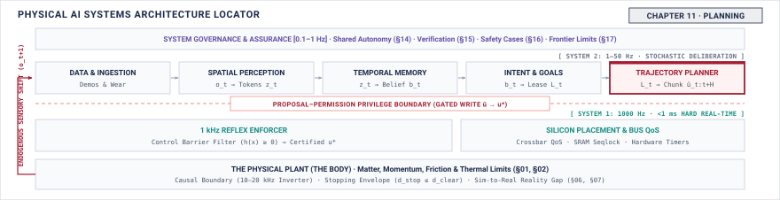

# Planning\chaptersubtitle{Feasible Paths, and What Happens When the Next Is Late} {#sec-planning}

{#fig-locator-ch11 fig-pos="H" width=100%}

*Can the machine follow this, and what does it do if the replacement never arrives?*

<!-- HOOK: one substantive paragraph answering the question above. -->



::: {.callout-objective}
After studying this chapter, you will be able to:

1. Set a planning horizon from an inference latency distribution rather than a round number.
2. Predict what a discontinuity at a chunk boundary does to a transmission.
3. Specify the behaviour of a plan whose replacement never arrives, and defend it as part of the plan.
4. Identify which trajectory failures are visible before execution and which appear only during it.

**Core Chapter Takeaway:** A plan must define what happens when its replacement is late, because the replacement will be late. The seam between one plan and the next is where mechanisms break, not the middle of either.

:::

## Introduction {#sec-planning-11-1}

<!-- SECTION 11.1 -->
<!-- claim: A plan is a promise about the near future, and the interesting question is what happens when the next one is late. -->
<!-- covers: Open with a timing trace in which the tracking loop consumes references every \(10\text{ ms}\) while replacement-plan latency varies from one invocation to the next. -->
<!-- covers: Distinguish the current plan’s horizon, the replacement-request time, the expected arrival time, the expiry time, and the uncovered interval after expiry. -->
<!-- covers: Show why one-step prediction leaves the nervous system without a reference whenever inference exceeds one control period. -->
<!-- covers: Establish that chunking buys finite time; it does not eliminate the latency tail or guarantee that a replacement arrives. -->
<!-- covers: State that the planner proposes a trajectory to the tracker and enforcer rather than commanding the body directly. -->
<!-- covers: Bound the chapter’s ownership: planning supplies feasibility claims and late-arrival behavior, while Chapter 12 independently decides whether either may be used. -->
<!-- GROUNDING: number — the interval between one plan and its replacement -->
<!-- DERIVE: the need for both a horizon and seam behavior from the mismatch between the control period and the nonzero tail of replacement latency -->

<!-- BEGIN -->

<!-- END -->

## What Planning Hands Over {#sec-planning-11-2}

<!-- SECTION 11.2 -->
<!-- claim: A path the machine can follow, valid over a stated horizon, with defined behaviour if it is never replaced. -->
<!-- covers: Distinguish a geometric path from an executable trajectory: the latter assigns states or commands to times and therefore exposes rates and deadlines. -->
<!-- covers: Define the handoff as a feasibility claim under declared body limits, not as proof that the machine can follow the trajectory under every future condition. -->
<!-- covers: Bind the trajectory to a coordinate frame, an initial state, a state timestamp, and a validity interval so the consumer can determine what the samples mean. -->
<!-- covers: State the required boundary conditions at both ends, including the derivative order that must remain continuous at a replacement seam. -->
<!-- covers: Include the assumptions under which feasibility was checked, such as payload, available actuation, contact state, and environmental clearance. -->
<!-- covers: Require a finite terminal suffix or other explicit behavior if no replacement arrives; an unspecified indefinite hold is not a valid field. -->
<!-- covers: Make the tracker and enforcer the named consumers, with each field justified by a check one of them must perform. -->
<!-- GROUNDING: mechanism — a path valid over a horizon, with defined behaviour if never replaced -->
<!-- DERIVE: the handoff fields from the information the tracker and enforcer require for time alignment, bound checking, expiry detection, and fallback selection -->

<!-- BEGIN -->

<!-- END -->

## From Goal to Trajectory {#sec-planning-11-3}

<!-- SECTION 11.3 -->
<!-- claim: A plan exists because a goal cannot be executed and inference is slower than the control period. -->
<!-- covers: Explain that an intent names a desired outcome, whereas a trajectory assigns the intermediate states and times the nervous system can consume. -->
<!-- covers: Define replacement latency end to end, including queuing, inference, transfer, validation, and admission, rather than using isolated accelerator latency. -->
<!-- covers: Derive the admissible per-plan exhaustion probability from mission duration and replacement frequency; show that an arbitrary percentile can imply many late seams per mission. -->
<!-- covers: Choose the replacement request lead so the remaining horizon exceeds the selected latency quantile plus validation and seam reserves. -->
<!-- covers: Derive the minimum chunk length as \(N=\lceil(T_{\mathrm{request}}+Q_{1-\epsilon}(L)+T_{\mathrm{reserve}})/T_c\rceil\), with every term measured under representative contention. -->
<!-- covers: Work a labeled illustrative example with a \(10\text{ ms}\) control period, a measured latency tail, and an explicit reserve, then compare the result with a round-number horizon. -->
<!-- covers: Use a generative policy only as the worked producer of the latency distribution; sampling internals remain below the first budgetable quantity. -->
<!-- GROUNDING: number — horizon length derived from the inference tail -->
<!-- FIGURE: A calibrated latency distribution and chunk timeline showing how the selected tail quantile, request lead, and reserve determine the minimum number of trajectory samples -->
<!-- DERIVE: the horizon length and chosen latency percentile from control cadence, end-to-end latency, mission exposure, and the allowed exhaustion probability -->

<!-- BEGIN -->

<!-- END -->

## Feasibility and Continuity {#sec-planning-11-4}

<!-- SECTION 11.4 -->
<!-- claim: A path the mechanism cannot follow is not a plan, and a discontinuous command is absorbed by the transmission. -->
<!-- covers: Put within-plan feasibility first: test the time-parameterized trajectory against speed, acceleration, actuator, contact, clearance, and stopping bounds already established for the body. -->
<!-- covers: Show how a machinery-specific model maps trajectory derivatives to budgetable quantities such as torque or current, while citing rather than teaching general kinematics or dynamics. -->
<!-- covers: Demonstrate why checking only sampled waypoints can miss a violation between samples, and derive a sampling or interpolation bound from the maximum permitted rate of change. -->
<!-- covers: Open the second section by concatenating two individually feasible trajectories at a common state and timestamp and checking the resulting boundary values. -->
<!-- covers: Explain that required continuity depends on the interface: continuous position alone does not prevent a velocity jump, and continuous velocity alone does not bound an acceleration jump. -->
<!-- covers: Derive a seam-load example from reflected inertia, velocity change, and measured stopping deflection or compliance; do not infer shock load from command-step size alone. -->
<!-- covers: Treat blending as a newly constructed trajectory that must pass the same feasibility checks rather than as cosmetic smoothing. -->
<!-- covers: State this as an imported result rather than a derived one: name the source, the assumptions under which it holds, how this machine establishes that those assumptions hold, and what the machine does at the moment they stop holding. -->
<!-- covers: Treat output chatter as a physical cost rather than an aesthetic one: high-frequency variation in a learned proposal is absorbed by the transmission, and it is paid in wear over thousands of duty cycles even when every individual command is feasible. -->
<!-- GROUNDING: number — a step command into a transmission, and the shock load it produces -->
<!-- FIGURE: Two individually feasible trajectories joined on aligned time axes, showing a boundary derivative jump and the resulting transmission-load excursion beyond its declared limit -->
<!-- DERIVE: the between-sample feasibility bound and the seam load from cadence, derivative limits, reflected inertia, and measured stopping deflection -->

<!-- BEGIN -->

<!-- END -->

## Behavior at the Seam {#sec-planning-11-5}

<!-- SECTION 11.5 -->
<!-- claim: The replacement will be late, and what the machine does in that interval belongs to the plan rather than to exception handling. -->
<!-- covers: Define lateness as the interval between the last admissible replacement time and the arrival of an accepted replacement, not merely inference exceeding its median. -->
<!-- covers: Distinguish the request point, blend deadline, fallback commitment point, plan expiry, and terminal-state deadline. -->
<!-- covers: Encode fallback as a finite suffix with an explicit entry condition, duration, required resources, and terminal state. -->
<!-- covers: Separate holding the last command, holding position, and continuing at the last velocity; these consume different energy and clearance and are not interchangeable meanings of “hold.” -->
<!-- covers: Derive whether deceleration fits inside the remaining time and distance from current speed and available deceleration, including latency accumulated before the suffix begins. -->
<!-- covers: Show that blending consumes overlap and can violate velocity, acceleration, or actuator bounds even when both source trajectories pass independently. -->
<!-- covers: Require the never-replaced case to reach a bounded terminal condition or an explicit refusal request that Chapter 12 can enforce. -->
<!-- GROUNDING: number — the interval when a replacement is late, and what the machine does in it -->
<!-- FIGURE: A calibrated seam timeline showing on-time replacement, late-but-blendable replacement, fallback commitment, expiry, and the never-replaced terminal outcome -->
<!-- DERIVE: the admissibility of hold, blend, or decelerate from remaining horizon, stopping distance, actuation limits, clearance, and thermal budget -->

<!-- BEGIN -->

<!-- END -->

## How Plans Go Wrong {#sec-planning-11-6}

<!-- SECTION 11.6 -->
<!-- claim: A plan can be feasible when issued and infeasible by the time it executes. -->
<!-- covers: Classify failures by first visibility: before admission, at concatenation, after execution begins, or only across a sequence of plans. -->
<!-- covers: Pair infeasible samples with a pre-execution bound checker that reports the violated quantity, limit, time, and margin. -->
<!-- covers: Pair seam discontinuity with a boundary checker that compares the terminal derivatives of the active plan with the initial derivatives of its candidate replacement. -->
<!-- covers: Pair changed-world infeasibility with runtime monitors for state divergence, tracking error, contact change, and loss of the assumptions recorded with the plan. -->
<!-- covers: Detect horizon exhaustion from plan age and remaining executable duration rather than waiting for a missing array access or stale command. -->
<!-- covers: Detect cross-plan oscillation from a bounded history of reversals, alternating goals, or excessive total variation, because no single plan exposes the pattern. -->
<!-- covers: Present the sheared-drive-pin incident only as a sourced autopsy whose command history, physical load path, detector behavior, and missing boundary check are known. -->
<!-- GROUNDING: failure — infeasible paths, seam discontinuity, and oscillation between plans -->
<!-- INCIDENT: needs a documented, citable case. Do not invent one. -->
<!-- FIGURE: A phase-aligned detector map showing when each named plan failure first becomes observable, which signal reveals it, and which failures require history across plans -->
<!-- DERIVE: each detector threshold from a recorded plan limit, validity assumption, or tracking allowance rather than assigning an unexplained constant -->

<!-- BEGIN -->

<!-- END -->

## The Trajectory Record {#sec-planning-11-7}

<!-- SECTION 11.7 -->
<!-- claim: Horizon, validity, and the defined behaviour on lateness. -->
<!-- covers: State only the fields this chapter adds to the notebook. The schema, its provenance rules, and its versioning are established in Section 4.10 and are not restated here. -->
<!-- covers: Record the trajectory samples or parameterization, cadence, horizon, coordinate frame, units, and initial-state timestamp in an immutable handoff. -->
<!-- covers: Link the record to the originating intent, planner version, model version, configuration, and random seed when reproduction depends on it. -->
<!-- covers: Preserve the state estimate and environmental assumptions against which feasibility was evaluated. -->
<!-- covers: Store every checked limit, the checker version, the resulting margin, and any unresolved condition instead of retaining only a pass bit. -->
<!-- covers: Record the boundary state, required continuity order, replacement deadline, fallback commitment point, terminal suffix, and terminal condition. -->
<!-- covers: Preserve request, completion, validation, admission, activation, and expiry timestamps so Chapter 15 can inject delay and determine whether the correct detector fired. -->
<!-- DERIVE: every record field from a downstream enforcement check, failure detector, reproduction need, or fault-injection claim -->

<!-- BEGIN -->

<!-- END -->

## Systems Stress-Tests {#sec-planning-11-8}

<!-- SECTION 11.8 -->
<!-- claim: A feasible plan that becomes infeasible while it is being executed. -->
<!-- covers: Given a trajectory that clears a stationary obstacle, move the obstacle after admission and identify the first signal that makes the recorded feasibility assumptions false. -->
<!-- covers: Join two plans that independently satisfy every bound but alternate direction at successive seams, then specify the history needed to detect the oscillation. -->
<!-- covers: Extend replacement latency beyond the largest observed sample and determine which recorded deadline commits the machine to fallback. -->
<!-- covers: Construct a blend whose endpoints are feasible but whose intermediate acceleration exceeds the actuator limit, then identify which checker must reject it. -->
<!-- covers: Change payload or contact state during the committed horizon and determine whether the resulting failure appears first as model invalidity, tracking error, or actuator saturation. -->
<!-- covers: Shorten the terminal suffix below the derived stopping requirement and identify which defect should have been visible before execution. -->

<!-- BEGIN -->

<!-- END -->

## Summary {#sec-planning-11-9}

<!-- SECTION 11.9 -->
<!-- claim: Chapter 12 receives something to check. -->
<!-- covers: Distill that the executable planning artifact is a time-parameterized trajectory, not a goal or geometric path. -->
<!-- covers: Restate that horizon length follows from measured end-to-end replacement latency, mission exposure, and an allowed exhaustion probability. -->
<!-- covers: Preserve the distinction between within-plan feasibility and continuity across the seam between plans. -->
<!-- covers: State that feasibility remains conditional on recorded state and environmental assumptions throughout execution. -->
<!-- covers: Reaffirm that behavior after a missed replacement deadline is part of the plan contract rather than unspecified exception handling. -->
<!-- covers: Hand Chapter 12 a dated trajectory, declared bounds, boundary conditions, validity assumptions, and a finite terminal behavior to check independently. -->

<!-- BEGIN -->

<!-- END -->
