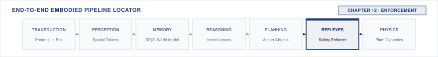

# Enforcement\chaptersubtitle{From Command to Force, and the Part That Can Say No} {#sec-enforcement}

{#fig-locator-ch12 fig-pos="H" width=100%}

*How does a command become force, and what must be true before a proposal is allowed to move a motor?*

<!-- HOOK: one substantive paragraph answering the question above. -->



::: {.callout-objective}
After studying this chapter, you will be able to:

1. Explain why a correction rate is set by how fast the plant deviates, not by preference.
2. Predict what an actuator at saturation does to a loop that does not know it has saturated.
3. Explain why delay in a loop causes oscillation rather than lag alone.
4. State the tracking error bound a controller guarantees, and inset a safety margin by it.

**Core Chapter Takeaway:** The nervous system's job end to end: track a permitted command into force, and refuse one that should not become force. The enforcer's margin is only as good as the tracking error of the loop beneath it.

:::

## Introduction {#sec-enforcement-12-1}

<!-- SECTION 12.1 -->
<!-- claim: This is the only part of the machine permitted to move an actuator, and the only part that can refuse. -->
<!-- covers: The dual responsibility of the nervous system: converting upstream learned policy proposals into physical force while maintaining independent authority to refuse execution. -->
<!-- covers: Why tracking and safety enforcement must be co-located at the machine boundary rather than delegated to upstream models or remote planners. -->
<!-- covers: The fundamental dependency: a safety enforcer's spatial clearance is mathematically bounded by the worst-case tracking error of the underlying control loop. -->
<!-- covers: The limits of deterministic safety: how enforcers fail through latency overruns, stale state estimates, and shared-mode hardware faults. -->
<!-- covers: Chapter roadmap: moving from inner feedback mechanics to outer barrier certificates, minimal intervention projection, fallback escalation, and fail-safe contracts. -->
<!-- GROUNDING: mechanism — the two jobs of the permission path: turn a command into force, or refuse it -->
<!-- FIGURE: A block diagram showing proposal flow from the learned policy through the enforcer filter to the tracking loop and physical plant, highlighting the autonomous veto path. -->

<!-- BEGIN -->

<!-- END -->

## What Control Hands Over {#sec-enforcement-12-2}

<!-- SECTION 12.2 -->
<!-- claim: Enforcement consumes one number from the loop beneath it: a bound on how far the machine may be from where it was commanded to be. Everything else about the controller is somebody else's subject. -->
<!-- covers: State the tracking contract: under stated conditions the loop keeps the machine within a bounded distance of the commanded trajectory, and that bound is the only thing enforcement needs. -->
<!-- covers: Work one command-to-response example concretely enough that the reader sees the bound is a physical distance rather than an abstraction. -->
<!-- covers: Name the conditions the bound rests on, and what happens to it outside them: disturbance beyond the modelled range, a rate the loop cannot follow, and an actuator already at its limit. -->
<!-- covers: Show how that bound insets every margin downstream, so a loosened tracking bound silently shrinks the clearance an enforcer thought it had. -->
<!-- covers: Require the bound to be published with its conditions and monitored at run time, because a tracking bound that is never checked is an assumption rather than a contract. -->
<!-- covers: Cite loop design, stability, and tuning to a controls text. This book states what a controller guarantees and never derives it. -->
<!-- GROUNDING: number — a step command, the response, and the tracking error between them -->
<!-- FIGURE: Step response of a closed-loop plant showing reference command, actual trajectory, settling corridor, and the worst-case tracking error bound $\epsilon_{\text{track}}$. -->
<!-- DERIVE: The worst-case steady-state tracking error bound $\epsilon_{\text{track}}$ as a function of maximum disturbance force $d_{\text{max}}$ and closed-loop stiffness $K$. -->

<!-- BEGIN -->

<!-- END -->

## The Authority to Refuse {#sec-enforcement-12-3}

<!-- SECTION 12.3 -->
<!-- claim: The permission path exists to say no, and everything else it does is secondary to that. -->
<!-- covers: Architectural primacy of refusal: the permission path is fundamentally a safety gate with actuation capabilities, not an actuator pipeline with safety logging. -->
<!-- covers: Authority asymmetry: upstream learned models propose desired trajectories, but the nervous system retains absolute authority to deny or modify execution. -->
<!-- covers: Fail-operational autonomy: why the refusal mechanism must maintain local state and continue enforcing safety even during complete brain or network crashes. -->
<!-- covers: Command filtering versus veto: defining clear criteria for when proposals should be geometrically projected versus when motion must be aborted entirely. -->
<!-- covers: The zero-command floor: establishing the safe physical equilibrium state (zero-torque coasting, dynamic braking, or mechanical brake locking) when authority is severed. -->
<!-- GROUNDING: mechanism — refusal as the defining capability, not an exceptional case -->
<!-- FIGURE: Timing diagram illustrating an upstream policy crash, heartbeat watchdog timeout, and the immediate autonomous transition of the nervous system to local position hold. -->

<!-- BEGIN -->

<!-- END -->

## Where the Enforcer Sits {#sec-enforcement-12-4}

<!-- SECTION 12.4 -->
<!-- claim: The enforcer sits where it can be reached in time, and it may only check quantities it can establish without asking the component it is checking. -->
<!-- covers: Reference checking (pre-control): validating planned trajectory waypoints before controller execution, providing broad geometric foresight but blind to tracking overshoots. -->
<!-- covers: Command checking (post-control): validating raw torque and velocity commands immediately before actuator output, ensuring physical limits at the expense of horizon foresight. -->
<!-- covers: Latency and visibility trade-offs: why reference checkers fail to catch loop-induced resonances and command checkers cannot anticipate multi-step dynamic traps. -->
<!-- covers: Co-processor architectures: comparing sequential in-line filtering against parallel asynchronous safety monitoring. -->
<!-- covers: The dual-stage enforcement pattern: pairing a pre-control kinematic corridor filter with a post-control instantaneous limit clamp. -->
<!-- covers: Constrain what the enforcer is allowed to read: a quantity it can sense or bound independently of the proposal path, never one produced by the component it is checking. Where no independent source exists, say so, and state that the guarantee is then conditional on the learned estimate rather than independent of it. -->
<!-- GROUNDING: mechanism — checking a reference against checking a command, and what each cannot see -->
<!-- FIGURE: Architectural comparison of pre-control reference filtering, post-control command monitoring, and dual-stage enforcement showing their respective visibility and latency horizons. -->

<!-- BEGIN -->

<!-- END -->

## Stopping Envelopes {#sec-enforcement-12-5}

<!-- SECTION 12.5 -->
<!-- claim: Knowing continuously that a stop is still available costs achievable speed, and that trade is the design. -->
<!-- covers: Kinematic stopping physics: calculating minimum stopping distance as a function of instantaneous velocity, maximum deceleration, and total nervous system delay. -->
<!-- covers: Insetting safety boundaries: expanding static and dynamic obstacle envelopes by the lower-level tracking error bound $\epsilon_{\text{track}}$ from 12.3. -->
<!-- covers: Continuous feasibility verification: verifying at every loop cycle that a safe stopping trajectory remains available from the current state. -->
<!-- covers: The throughput tax: how maintaining continuous stopping guarantees imposes a strict upper bound on achievable operational speed. -->
<!-- covers: Dynamic envelope adaptation: adjusting stopping distances online based on payload mass variations, surface friction estimates, and actuator thermal limits. -->
<!-- GROUNDING: number — the stopping envelope, inset by the tracking bound from 12.2 -->
<!-- FIGURE: A phase-plane diagram (velocity vs position) showing the physical stopping boundary, the tracking-error inset envelope, and an admissible nominal trajectory. -->
<!-- DERIVE: The minimum safe stopping distance $d_{\text{stop}}(v) = v \cdot \tau_{\text{delay}} + \frac{v^2}{2 a_{\text{max}}} + \epsilon_{\text{track}}$ from kinematic first principles. -->

<!-- BEGIN -->

<!-- END -->

## When the Enforcer Runs Out of Authority {#sec-enforcement-12-6}

<!-- SECTION 12.6 -->
<!-- claim: Saturation is not a control problem here. It is the moment the permission path no longer has the actuation it needs to keep the promise it made. -->
<!-- covers: Define it in the book's terms: the enforcer's guarantee assumed it could apply a corrective action, and at saturation that action is not available at any commanded value. -->
<!-- covers: Show the consequence: a stopping envelope computed with full authority is wrong once the actuator is at its limit, and the margin was already spent before anyone noticed. -->
<!-- covers: Detect it, because saturation is one of the few failures with a cheap and reliable detector: commanded against achievable, continuously, at the loop rate. -->
<!-- covers: Export it upstream. Saturation is information the planner needs, and a plan that keeps requesting what cannot be delivered must be revoked rather than tracked. -->
<!-- covers: Fold it into the stopping calculation so the envelope shrinks as authority is consumed, rather than being recomputed after the fact. -->
<!-- covers: Cite integrator windup and its remedies to a controls text. That is controller design, and this book is deciding whether a machine may keep moving. -->
<!-- GROUNDING: number — a loop at saturation, and error accumulating while nothing improves -->
<!-- FIGURE: Time-series of commanded effort versus actual actuator output during saturation, highlighting accumulated integrator error and the resulting recovery delay. -->
<!-- DERIVE: Derive the stopping envelope under reduced authority, showing how much margin is lost per unit of authority consumed. -->

<!-- BEGIN -->

<!-- END -->

## Safe Sets as Conditional Permission {#sec-enforcement-12-7}

<!-- SECTION 12.7 -->
<!-- claim: A safe set gives the enforcer something it can check every cycle. What it gives is a conditional warrant, and the conditions are the subject of this section. -->
<!-- covers: Introduce one barrier as an example of a per-cycle checkable rule, in the smallest form that makes the check concrete, and move on. The technique is not the subject. -->
<!-- covers: Name the five conditions the warrant rests on: a plant model of stated fidelity, bounded disturbances, actuation authority sufficient to realise the correction, a solver that completes inside the period, and a sampling interval short enough that the continuous-time argument survives discretisation. -->
<!-- covers: For each condition, say what establishes it on a real machine, which of the five Chapter 2 measures, and which remain assumptions the release argument has to carry. -->
<!-- covers: Attach a detector to each condition, because a conditional guarantee whose conditions are unmonitored is an unconditional assertion. -->
<!-- covers: State the required behaviour when a condition is violated at run time, and make it a transition to a fallback rather than a continued claim. -->
<!-- covers: Cite forward invariance, relative degree, and barrier construction to the safe-control literature. This book consumes the result and audits its conditions. -->
<!-- GROUNDING: number — the safe set and the condition that keeps the machine inside it -->
<!-- FIGURE: State-space vector field showing unconstrained policy trajectories vectoring toward an unsafe boundary being deflected tangentially along the safe set boundary $\partial \mathcal{C}$. -->
<!-- DERIVE: Derive the per-cycle check and the margin the tracking bound insets; cite the invariance result rather than proving it. -->

<!-- BEGIN -->

<!-- END -->

## Minimal Intervention {#sec-enforcement-12-8}

<!-- SECTION 12.8 -->
<!-- claim: Change a proposal as little as possible, because maximal intervention is a hazard with a different shape. -->
<!-- covers: The principle of minimal intervention: granting the learned policy complete operational authority unless a proposed action violates barrier constraints. -->
<!-- covers: Quadratic Programming (QP) projection: formulating real-time safety filtering as the smallest correction $\min_u \frac{1}{2}\|u - u_{\text{nom}}\|^2$ subject to linear barrier constraints. -->
<!-- covers: The hazard of uncoordinated clipping: why independent per-axis saturation or clipping creates unmodeled net torques, severe chattering, and mechanical stress. -->
<!-- covers: Boundary chattering mitigation: smoothing techniques and boundary layer margins to prevent high-frequency switching during sustained operation on safe set limits. -->
<!-- covers: Upstream policy health monitoring: tracking cumulative intervention magnitude $\int \|u - u_{\text{nom}}\| dt$ as an early detector of model drift or distribution shift. -->
<!-- covers: State this as an imported result rather than a derived one: name the source, the assumptions under which it holds, how this machine establishes that those assumptions hold, and what the machine does at the moment they stop holding. -->
<!-- GROUNDING: number — the smallest change that makes a proposal admissible -->
<!-- FIGURE: Geometric representation of control input space showing the nominal policy command $u_{\text{nom}}$, the half-space of admissible inputs, and the orthogonal QP projection $u^*$. -->
<!-- DERIVE: The closed-form analytical solution for the QP projection of a nominal input $u_{\text{nom}}$ onto a single linear half-space barrier constraint. -->

<!-- BEGIN -->

<!-- END -->

## The Fallback Ladder {#sec-enforcement-12-9}

<!-- SECTION 12.9 -->
<!-- claim: When nothing admissible remains, the response is graded, and each rung costs more than the one before. -->
<!-- covers: The escalation hierarchy: a deterministic ladder of defensive actions triggered when no admissible control input exists within primary barrier constraints. -->
<!-- covers: Rung 1 — Least-squares projection: modifying nominal commands to the closest admissible action while maintaining active mission progress. -->
<!-- covers: Rung 2 — Active position hold: arresting motion at the current position using active closed-loop motor regulation. -->
<!-- covers: Rung 3 — Controlled dynamic stop: executing an open-loop or profile-based dynamic braking maneuver along a dedicated fallback trajectory. -->
<!-- covers: Rung 4 — Hard power cutoff: opening safety contactors to remove bus power and engage passive mechanical friction brakes. -->
<!-- covers: Justification and cost accounting: evaluating latency to engage, structural stress, mechanical wear, and mission abort penalties for each escalation tier. -->
<!-- GROUNDING: mechanism — four rungs, each with what it costs and what it guarantees -->
<!-- FIGURE: The four-tier fallback ladder illustrating triggering conditions, transition latencies, mechanical wear costs, and mission reversibility for each rung. -->

<!-- BEGIN -->

<!-- END -->

## How Enforcement Goes Wrong {#sec-enforcement-12-10}

<!-- SECTION 12.10 -->
<!-- claim: A second processor is not automatically independent, and determinism is not safety. -->
<!-- covers: The fallacy of redundant processors: how shared power rails, common oscillators, board-level buses, and ground loops create single-point common-mode failures. -->
<!-- covers: Latency overruns: failure modes where safety calculations exceed real-time deadlines, executing interventions that are physically out of phase with plant dynamics. -->
<!-- covers: Stale state and sensor corruption: how estimation latency, encoder slip, or sensor bias blinds the enforcer to physical barrier violations. -->
<!-- covers: Determinism versus safety: why a deterministic system executing an incorrect or stale plant model merely produces deterministic crashes. -->
<!-- covers: Incident anatomy: analyzing a real-world failure where safety enforcer CPU starvation caused by SPI bus contention prevented timely emergency braking. -->
<!-- GROUNDING: failure — shared rails and clocks, and what determinism does not buy -->
<!-- INCIDENT: needs a documented, citable case. Do not invent one. -->
<!-- FIGURE: Fault tree diagram of an enforcement subsystem showing common-mode failure paths across shared power supplies, clock lines, and communication buses. -->

<!-- BEGIN -->

<!-- END -->

## The Enforcement Record {#sec-enforcement-12-11}

<!-- SECTION 12.11 -->
<!-- claim: What the permission path guarantees, under what conditions, and where those guarantees stop. -->
<!-- covers: State only the fields this chapter adds to the notebook. The schema, its provenance rules, and its versioning are established in Section 4.10 and are not restated here. -->
<!-- covers: The specification contract: formal definition of the enforcement record data structure handed to system integration, deployment, and placement layers. -->
<!-- covers: Quantified parameters: recording the verified tracking error bound $\epsilon_{\text{track}}$, maximum stopping time $t_{\text{stop}}$, barrier function parameters, and loop period $T_{\text{loop}}$. -->
<!-- covers: Provenance tracking: documenting whether safety bounds originate from analytic derivation, physics simulation, or hardware worst-case stress testing. -->
<!-- covers: Threshold definitions: specifying exact numerical triggers for escalating down the fallback ladder from QP filtering to emergency power cutoff. -->
<!-- covers: Environmental assumptions: formalizing the operating envelope (friction limits, payload bounds, temperature ranges) required for safety guarantees to hold. -->

<!-- BEGIN -->

<!-- END -->

## Systems Stress-Tests {#sec-enforcement-12-12}

<!-- SECTION 12.12 -->
<!-- claim: An enforcer that is correct and too slow to matter. -->
<!-- covers: Stress-Test 1 — Real-time deadline violation: injecting synthetic compute jitter into the barrier QP solver to verify watchdog fallback triggering. -->
<!-- covers: Stress-Test 2 — Actuator saturation under shock load: applying peak external step loads during maximum-velocity maneuvers to verify anti-windup clamping. -->
<!-- covers: Stress-Test 3 — Sudden upstream policy death: killing the policy process mid-trajectory to verify autonomous nervous system transition to controlled stopping. -->
<!-- covers: Stress-Test 4 — Sensor estimate corruption: introducing synthetic bias and drift into state feedback to evaluate tracking error detection thresholds. -->
<!-- covers: Stress telemetry: logging minimum boundary clearance, intervention latency, and mechanical peak forces across all injected fault scenarios. -->
<!-- FIGURE: Telemetry time-series during a simulated policy crash showing heartbeat loss, watchdog timeout, fallback ladder transition, and physical arrest before the safe boundary. -->

<!-- BEGIN -->

<!-- END -->

## Summary {#sec-enforcement-12-13}

<!-- SECTION 12.13 -->
<!-- claim: Chapter 10 receives two things that must share a machine. -->
<!-- covers: Synthesis of tracking and refusal: the nervous system as the authoritative bridge between learned intent and physical mechanics. -->
<!-- covers: The composite safety margin: how total clearance compounds tracking bounds, transport delay, actuator saturation limits, and state estimation error. -->
<!-- covers: Invariance over prediction: why continuous barrier enforcement provides deterministic safety guarantees that multi-step trajectory planners cannot match. -->
<!-- covers: Autonomy of the permission path: why enforcement must execute independently at the hardware floor regardless of upstream software health. -->
<!-- covers: Handover to Chapter 13: how the computational and bandwidth demands of enforcement dictate compute placement across edge, nervous system, and brain. -->

<!-- BEGIN -->

<!-- END -->
