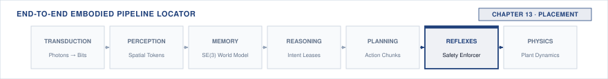

# Placement\chaptersubtitle{What Happens When Everything Shares One Chip} {#sec-placement}

{#fig-locator-ch13 fig-pos="H" width=100%}

*The boundaries were drawn on a diagram. Do they exist on the die?*

<!-- HOOK: one substantive paragraph answering the question above. -->



::: {.callout-objective}
After studying this chapter, you will be able to:

1. Name every claimant on each shared resource in a given design.
2. Measure the timing of the enforcement path under load on the proposal path.
3. State what experimental result would falsify an independence claim, then run it.
4. Predict how a thermal excursion in one path changes the timing of the other.

**Core Chapter Takeaway:** Independence claimed on a block diagram is not independence measured under load. Two paths on one die share a bus, a rail, and a thermal mass, and the separation has to be demonstrated rather than asserted.

:::

## Introduction {#sec-placement-13-1}

<!-- SECTION 13.1 -->
<!-- claim: Everything built so far now shares one piece of silicon, and the independence claimed in Chapter 4 meets a real bus. -->
<!-- covers: Open with a flow-regulating machine whose learned proposal path and enforcement path occupy separate compute domains on one system-on-chip but share the route to memory and the actuator interface. -->
<!-- covers: Define independence operationally: proposal-path activity must neither move enforcement latency beyond its bound nor prevent the enforcer from refusing a command. -->
<!-- covers: Count the common resources explicitly, including the memory controller, last-level cache, interconnect, power rail, clock and reset domains, and thermal package. -->
<!-- covers: Frame the chapter as a falsification exercise that proceeds from claimant inventory to loaded measurement, warm measurement, and a recorded placement decision. -->
<!-- GROUNDING: number — two paths and what they share, counted -->

<!-- BEGIN -->

<!-- END -->

## Two Paths on One Die {#sec-placement-13-2}

<!-- SECTION 13.2 -->
<!-- claim: Placement cannot be deferred to integration, because it decides whether the separation is real. -->
<!-- covers: Specify each path by its inputs, outputs, execution rate, deadline, and privilege, making clear that only the enforcement path can issue an actuator command. -->
<!-- covers: Map proposal inference, state exchange, enforcement, device I/O, and logging onto concrete execution domains before assigning performance numbers. -->
<!-- covers: Calculate the unloaded execution demand of each path and expose the slack between enforcement completion and the body-imposed deadline. -->
<!-- covers: Distinguish core separation from failure-domain separation by tracing which kernel, interrupt controller, clock, reset, and memory services remain common. -->
<!-- covers: Compare candidate placements by computation time, communication time, interference exposure, and the time required to reach a safe state after a fault. -->
<!-- GROUNDING: mechanism — what runs where, and what that decision costs everything else -->
<!-- FIGURE: Show that separate compute lanes still converge on common memory, power, clock, reset, and thermal resources that can defeat the claimed separation. -->
<!-- DERIVE: Derive placement feasibility from execution demand, communication cost, deadline slack, and shared failure domains instead of asserting that compute is not fungible. -->

<!-- BEGIN -->

<!-- END -->

## Contention for Shared Resources {#sec-placement-13-3}

<!-- SECTION 13.3 -->
<!-- claim: Every shared resource has more than one claimant, and a number that does not say what it competes with is not yet a systems number. -->
<!-- covers: Inventory the digital claimants, including sensor direct-memory-access traffic, model weights and activations, enforcement-state reads, actuator writes, cache maintenance, and logging. -->
<!-- covers: Derive each claimant’s average demand from bytes per event and event rate, then retain burst size and burst duration because equal averages can produce different interference. -->
<!-- covers: Use arithmetic intensity only to determine whether a workload tends to be compute- or memory-bound; use arbitration, burst timing, cache residency, and priority to determine which request waits. -->
<!-- covers: Calculate the enforcement delay produced when its request arrives behind the longest permitted overlapping burst, and compare that delay with the available slack. -->
<!-- covers: Inventory power claimants separately by their current steps, shared source impedance, regulator response, and susceptibility to voltage droop, clock reduction, or reset. -->
<!-- covers: Name a detector for each coupling mechanism, such as memory-controller counters, cache-miss counters, request timestamps, rail telemetry, throttle flags, and reset-cause registers. -->
<!-- GROUNDING: number — every claimant on one memory controller, and arithmetic intensity -->
<!-- FIGURE: Show, in two aligned panels, how a memory burst adds enforcement delay while a proposal-path current step reduces timing headroom through the shared rail. -->
<!-- DERIVE: Derive digital demand as bytes per event times event rate and derive rail disturbance from current step and supply impedance; arithmetic intensity alone cannot predict which claimant wins. -->

<!-- BEGIN -->

<!-- END -->

## The Boundary Contract {#sec-placement-13-4}

<!-- SECTION 13.4 -->
<!-- claim: What crosses between the two paths is a contract with a production time, a validity interval, and a defined behaviour on every way it can be missing, not a pointer into shared memory. -->
<!-- covers: State the boundary contract as the latest complete proposal plus its production time, sequence, validity interval, and provenance, rather than as an unqualified pointer into shared memory. -->
<!-- covers: Size the bounded exchange from producer rate and maximum consumer stall, then state whether overflow discards the oldest proposal, rejects the newest, or forces a fallback. -->
<!-- covers: Trace a writer preempted before, during, and after publication to show how the reader detects an incomplete or torn record. -->
<!-- covers: State the required memory-order relationship without descending into instruction-set-specific fence configuration. -->
<!-- covers: Require the enforcement path to detect stale, missing, overwritten, and malformed records and to continue with a bounded fallback in every case. -->
<!-- covers: Prohibit mutex ownership, allocation pressure, or backpressure from the proposal side from delaying the enforcement path. -->
<!-- GROUNDING: mechanism — what crosses the trust boundary, with its production time and its behaviour on every way of being missing -->
<!-- FIGURE: Show every point at which the writer can stop while the reader either obtains one complete version or detects failure without blocking. -->
<!-- DERIVE: Derive ring capacity from production rate and worst-case consumer stall, and derive why the publication protocol cannot expose a mixed-version record. -->

<!-- BEGIN -->

<!-- END -->

## Thermal Coupling and Timing {#sec-placement-13-5}

<!-- SECTION 13.5 -->
<!-- claim: Heat produced by one path throttles the other, which makes thermal design a timing concern. -->
<!-- covers: Account for proposal inference, enforcement, memory traffic, and regulator losses as heat sources coupled through one package and enclosure. -->
<!-- covers: Predict junction-temperature rise from measured power and the package or system thermal step response, rather than treating room temperature as device temperature. -->
<!-- covers: Map the predicted temperature to the processor’s documented or measured throttle state, then measure how that state changes enforcement execution time. -->
<!-- covers: Recompute deadline margin at the hottest allowed starting condition, including throttle hysteresis and the time required for frequency recovery. -->
<!-- covers: Separate thermal coupling from power-rail coupling by identifying whether the observed delay follows temperature, voltage, or both. -->
<!-- covers: Show that moving a workload to avoid throttling changes communication traffic, memory contention, and power distribution, forcing the placement calculation to be repeated. -->
<!-- GROUNDING: number — a throttle event, and the deadline it moves -->
<!-- FIGURE: Show proposal-path power raising junction temperature until throttling lengthens enforcement execution past a marked deadline. -->
<!-- DERIVE: Derive temperature rise from power and measured thermal response, then derive the moved deadline from the resulting frequency or execution-time change. -->

<!-- BEGIN -->

<!-- END -->

## Testing the Separation {#sec-placement-13-6}

<!-- SECTION 13.6 -->
<!-- claim: An independence claim is a hypothesis, and this is the experiment that tries to refute it. -->
<!-- covers: Express the independence claim as a measurable bound on enforcement latency and refusal availability under specified proposal workloads, temperatures, and operating modes. -->
<!-- covers: Stress memory bandwidth, cache capacity, accelerator traffic, sensor transfers, and logging with workloads that reproduce the largest permitted bursts rather than merely high average utilization. -->
<!-- covers: Timestamp enforcement-path entry, decision completion, and actuator-interface publication so interference can be localized rather than inferred from end-to-end delay alone. -->
<!-- covers: Run a factorial test covering cold and warm states, idle and stressed proposal paths, logging disabled and enabled, and ordinary and refusal-producing commands. -->
<!-- covers: Set the falsification threshold from the body-imposed deadline minus fixed sensing and output costs, including measurement uncertainty. -->
<!-- covers: Report the latency distribution, maximum observed excursion, sample count, test duration, and uncovered operating conditions rather than claiming absolute independence from a passing run. -->
<!-- covers: Use a documented incident or explicitly labeled composite case to trace the coupling mechanism, the missing detector, and the field condition absent from the bench test. -->
<!-- GROUNDING: number — enforcement timing with and without load, measured warm -->
<!-- INCIDENT: needs a documented, citable case. Do not invent one. -->
<!-- FIGURE: Show enforcement-latency distributions for idle and loaded proposal paths at cold and warm conditions, with the falsification threshold and sample counts visible. -->
<!-- DERIVE: Derive the permitted enforcement-path latency from the physical deadline and the other fixed delay terms before choosing the experimental pass threshold. -->

<!-- BEGIN -->

<!-- END -->

## Isolation and Re-placement Decisions {#sec-placement-13-7}

<!-- SECTION 13.7 -->
<!-- claim: Falsifying an independence claim tells you it is broken. Choosing among reservation, partitioning, workload reduction, and separate silicon is the decision that follows. -->
<!-- covers: The options, and what each costs -->
<!-- covers: When a software reservation is enough and when it is not -->
<!-- covers: What forces a move to separate silicon -->
<!-- covers: Re-placement as a cascade: moving one workload moves the others -->
<!-- GROUNDING: mechanism — reservation, partitioning, reduction, separate silicon, and what each costs -->

<!-- BEGIN -->

<!-- END -->

## The Placement Record {#sec-placement-13-8}

<!-- SECTION 13.8 -->
<!-- claim: Where each part runs, what it shares, and what was measured under contention. -->
<!-- covers: State only the fields this chapter adds to the notebook. The schema, its provenance rules, and its versioning are established in Section 4.10 and are not restated here. -->
<!-- covers: Record each function’s execution domain, privilege, activation rate, deadline, and measured loaded execution bound. -->
<!-- covers: List every shared resource, its claimants, its arbitration or isolation mechanism, and the largest interference observed. -->
<!-- covers: Preserve the test configuration, including model and firmware versions, clock policy, enclosure, ambient condition, instrumentation, workload, and sample count. -->
<!-- covers: Record the predeclared falsification criterion, the observed result, any mitigation applied, and the conditions not exercised. -->
<!-- covers: Hand the record forward to Chapter 15 for fault injection and Chapter 16 for the release argument; Chapter 12 cannot inject against a record produced later. -->

<!-- BEGIN -->

<!-- END -->

## Systems Stress-Tests {#sec-placement-13-9}

<!-- SECTION 13.9 -->
<!-- claim: A separation that holds at room temperature and fails warm. -->
<!-- covers: Apply an accelerator current step at the least favorable enforcement phase and determine whether shared-rail droop, clock reduction, or reset changes the refusal deadline. -->
<!-- covers: Trigger a shared clock or reset-domain fault and measure whether the enforcement path remains available or reaches the recorded safe state within its bound. -->
<!-- covers: Align sensor direct-memory-access traffic and logging flushes with an enforcement-state read to expose phase-dependent contention hidden by average bandwidth. -->
<!-- covers: Crash or stall the proposal runtime while its last record is being published and verify that the boundary detector rejects the incomplete record without blocking. -->
<!-- covers: For each case, state the predicted coupling, the detector expected to fire, the measured result, and whether the placement claim survives. -->

<!-- BEGIN -->

<!-- END -->

## Summary {#sec-placement-13-10}

<!-- SECTION 13.10 -->
<!-- claim: Part II closes: five handoffs, one enforcer, one machine. -->
<!-- covers: Distill the placement result as a claim limited to the tested workload, thermal envelope, clock policy, and fault domain. -->
<!-- covers: State the quantities the placement record contributes: loaded enforcement latency, shared-resource headroom, common-mode failures, detector coverage, and untested conditions. -->
<!-- covers: Close Part III by showing that the five handoffs now form one measured machine whose logical boundaries do not automatically constitute physical independence. -->
<!-- covers: Hand Part IV a bounded architecture whose human authority, verification evidence, and release verdict can now be examined without assuming separation. -->

<!-- BEGIN -->

<!-- END -->
