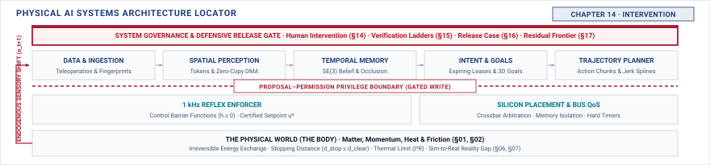

# Intervention\chaptersubtitle{Taking Authority Away From the Machine} {#sec-intervention}

{#fig-locator-ch14 fig-pos="H" width=100%}

*Who can take authority away from the machine, and what happens to what it was already doing?*

<!-- HOOK: one substantive paragraph answering the question above. -->



::: {.callout-objective}
After studying this chapter, you will be able to:

1. Specify which operations a person may command, under what conditions, within what deadline.
2. Hand over a moving machine without a step change in command, and measure the result.
3. Mark the moment authority changed hands, and the earlier moment the policy diverged, so Chapter 5 can tell a rescue from a nominal episode.
4. State what an operational log must contain for a claim to rest on it months later.

**Core Chapter Takeaway:** Authority attaches to named operations with deadlines, not to a person drawn in a loop. Taking control is a different mechanism from refusing a command, and a handover that leaves a moving machine with no coherent command is a hazard rather than a rescue.

:::

## Introduction {#sec-intervention-14-1}

<!-- SECTION 14.1 -->
<!-- claim: A person is a third holder of authority over a running machine, and authority attaches to operations rather than to a role. -->
<!-- covers: The human operator is an untrusted, high-latency, third holder of authority over the machine alongside the learned policy and the real-time nervous system. -->
<!-- covers: "Human-in-the-loop" is a dangerous abstraction when treated as a generic safety net; authority must attach to explicit operational primitives with bounded execution deadlines. -->
<!-- covers: Intervening on a moving machine involves two coupled problems: continuous physical transition without mechanical shock and discrete state arbitration without ambiguity. -->
<!-- covers: Rescued runs create a subtle ML trap: recording and training on the human takeover without marking truncation teaches the next policy to replicate the failure state that caused the rescue. -->
<!-- covers: The chapter builds the complete authority lifecycle: operational scoping, state arbitration, bumpless transfer, authenticated command paths, evidence logging, and retraining hygiene. -->
<!-- GROUNDING: mechanism — authority attached to a named operation with a deadline -->

<!-- BEGIN -->

<!-- END -->

## Human Authority Over Actuation {#sec-intervention-14-2}

<!-- SECTION 14.2 -->
<!-- claim: A person in the loop is not an authority model; naming the operations is. -->
<!-- covers: Replacing the generic "human supervisor" icon with an explicit capability matrix mapping specific operations (e-stop, velocity trim, path veto, full manual steering) to authorized roles. -->
<!-- covers: Human cognitive and physical response time is a hard real-time latency budget: sensory recognition ($150\text{--}300\text{ ms}$), situational assessment ($500\text{--}1500\text{ ms}$), and motor actuation ($200\text{--}400\text{ ms}$). -->
<!-- covers: A machine moving at speed $v$ travels a blind distance $d_{\text{human}} = v \cdot T_{\text{takeover}}$ before human intervention takes physical effect; at $5\text{ m/s}$ with a $1.5\text{ s}$ takeover budget, the machine covers $7.5\text{ m}$ under unchecked policy authority. -->
<!-- covers: Deadman switches, keep-alive leases, and bounded delegation windows: why authority must automatically expire if the operator stops actively renewing it. -->
<!-- covers: The authority boundary between the human and the safety enforcer: even an authorized human override cannot command an actuation that violates the hardware-enforced barrier certificate or kinematic floor limits. -->
<!-- covers: Separate the two mechanisms explicitly, because they are routinely conflated: enforcement withholds permission from a proposal and leaves the machine autonomous, while intervention transfers authority to someone else and ends autonomous operation. A system with one and not the other is incomplete in a way no amount of the other fixes. -->
<!-- GROUNDING: mechanism — authority attached to operations with deadlines, not to a role -->
<!-- FIGURE: A timing diagram showing the human intervention latency breakdown (perception, cognitive orientation, motor action) against physical vehicle travel distance at varying operational speeds. -->
<!-- DERIVE: The minimum safe intervention distance $d_{\text{intervene}} = v \cdot T_{\text{reaction}} + \frac{v^2}{2 a_{\text{max}}}$ required for a human to prevent a collision given human response latency and maximum plant deceleration. -->

<!-- BEGIN -->

<!-- END -->

## Authority States and Transitions {#sec-intervention-14-3}

<!-- SECTION 14.3 -->
<!-- claim: Who holds control at any instant must be a state, not an inference. -->
<!-- covers: Control authority at every tick $t$ is a mutually exclusive discrete state $S_t \in \{\text{Autonomous}, \text{Handover-Pending}, \text{Human-Manual}, \text{Degraded-Fallback}\}$, never a continuous blend or implicit inference. -->
<!-- covers: The four-phase handshake protocol: Request (human initiates or policy relinquishes), Acknowledge (enforcer verifies prerequisites), Commit (control source switches at boundary), and Confirm (feedback confirms active holder). -->
<!-- covers: Unacknowledged takeover requests: defining the hard timeout $T_{\text{timeout}}$ after which an unanswered handover request automatically drops into a deterministic Category 1 safe stop. -->
<!-- covers: Loss of human presence: monitoring operator engagement via physical sensors (capacitive touch, torque sensing, optical gaze) and triggering monotonic fallback ladders on signal loss. -->
<!-- covers: Resolving conflicting simultaneous inputs: the deterministic arbitration hierarchy where safety enforcer overrides human manual input, and human manual input overrides learned policy proposals. -->
<!-- GROUNDING: mechanism — states, transitions, and what happens when a request is unanswered -->
<!-- FIGURE: A finite state machine diagram showing exact transition guards, handshake timeouts, and fallback edges between Autonomous, Handover-Pending, Human-Manual, and Safe-Stop states. -->

<!-- BEGIN -->

<!-- END -->

## Transfer Without Discontinuity {#sec-intervention-14-4}

<!-- SECTION 14.4 -->
<!-- claim: Handing over something already moving without a step change in command. -->
<!-- covers: An instantaneous switch between policy command $\mathbf{u}_{\text{policy}}(t)$ and human command $\mathbf{u}_{\text{human}}(t)$ creates a step discontinuity $\Delta \mathbf{u} = \mathbf{u}_{\text{human}} - \mathbf{u}_{\text{policy}}$ producing infinite jerk, driveline shock, or loss of tire traction. -->
<!-- covers: The bumpless transfer equation: dynamic blending over a finite window $\tau_{\text{blend}}$ using a continuous transition filter $\mathbf{u}(t) = (1 - \alpha(t))\mathbf{u}_{\text{policy}}(t) + \alpha(t)\mathbf{u}_{\text{human}}(t)$ with smooth $\mathcal{C}^1$ interpolation $\alpha(t)$. -->
<!-- covers: The latency-jerk tradeoff: increasing $\tau_{\text{blend}}$ reduces peak actuator jerk $j_{\text{max}} = \frac{\Delta u}{\tau_{\text{blend}}}$ but delays full human control authority, lengthening the stopping path. -->
<!-- covers: Initial condition matching: pre-biasing the human input integrator or tracking loop state to match the plant's current dynamic state at the instant of takeover. -->
<!-- covers: Quantifying handover jerk: measuring the acceleration derivative $j(t) = \frac{d^3 x}{dt^3}$ on the physical chassis across blended versus unblended transitions. -->
<!-- GROUNDING: number — a handover measured, blended and not blended -->
<!-- FIGURE: Paired time-series plots comparing unblended step handover versus $\mathcal{C}^1$ blended handover, showing the resulting spikes in motor torque, chassis jerk, and wheel slip. -->
<!-- DERIVE: The minimum blending duration $\tau_{\text{blend}} \ge \frac{|\mathbf{u}_{\text{human}} - \mathbf{u}_{\text{policy}}|}{j_{\text{allowable}}}$ required to satisfy actuator and mechanical jerk limits from first principles. -->

<!-- BEGIN -->

<!-- END -->

## Authenticating an Intervention {#sec-intervention-14-5}

<!-- SECTION 14.5 -->
<!-- claim: Authentication has to keep a hostile party from acquiring physical authority without keeping a legitimate one from stopping the machine in time. Those two requirements pull in opposite directions and the trade has to be made explicitly. -->
<!-- covers: Classify intervention operations by what they can cause: removing power is not the same as commanding motion, and they do not warrant the same verification. -->
<!-- covers: Give each class a freshness and latency budget derived from the physical situation it exists to interrupt, rather than from a security policy written elsewhere. -->
<!-- covers: Make the emergency path fail safe rather than fail closed: a stop that cannot be authenticated in time must still stop the machine, and say plainly what that costs. -->
<!-- covers: Inventory the shadow paths that can reach actuation without passing the check: a maintenance port, a debug interface, a bench harness, a bootloader. -->
<!-- covers: State the residual: which classes of hostile authority this design does not defend against, and why that is a scope decision rather than an oversight. -->
<!-- covers: Cite signing schemes and key management to a security text. This book owns which operations require verification and what verification costs when a machine is moving. -->
<!-- GROUNDING: failure — why training on rescues teaches the wrong lesson, and over how many rounds -->
<!-- FIGURE: A sequence diagram contrasting an unauthenticated CAN injection vulnerability with a cryptographically signed, timestamped, nonce-verified intervention path. -->
<!-- DERIVE: Derive each freshness and latency budget from the physical situation the operation exists to interrupt. -->

<!-- BEGIN -->

<!-- END -->

## Trustworthy Operational Logs {#sec-intervention-14-6}

<!-- SECTION 14.6 -->
<!-- claim: A record that has to support an argument months later has requirements a debug log does not. -->
<!-- covers: The distinction between a developer debug log (best-effort, lossy, mutable) and a forensic operational log (tamper-evident, deterministic, legally defensible). -->
<!-- covers: High-frequency pre-trigger circular ring buffering: continuously recording full plant state, enforcer decisions, policy proposals, and raw sensor frames at $100\text{--}1000\text{ Hz}$, freezing a 10-second pre/post window on takeover or fault. -->
<!-- covers: Clock synchronization and timestamp integrity: using hardware-timestamped PTP (IEEE 1588) to guarantee sub-microsecond causal ordering between operator input, bus transit, and actuator response. -->
<!-- covers: Cryptographic append-only structures: chaining log segments with SHA-256 hashes and periodically anchoring root hashes to write-once media or secure enclaves to prevent post-incident log tampering. -->
<!-- covers: Evidence schema: defining the minimal immutable tuple $\langle t_{\text{PTP}}, S_{\text{auth}}, \mathbf{x}_{\text{state}}, \mathbf{u}_{\text{prop}}, \mathbf{u}_{\text{enf}}, \mathbf{u}_{\text{act}}, \text{ID}_{\text{operator}}\rangle$ required to reconstruct the exact causal chain of an intervention. -->
<!-- covers: Record the moment of divergence, not only the moment of takeover, because Section 5.5 cannot separate a rescue from a nominal episode without it. -->
<!-- GROUNDING: mechanism — what a record must carry to support a claim months later -->
<!-- FIGURE: A systems diagram of the dual-rate circular evidence buffer, showing continuous high-frequency SRAM caching, write-freeze triggering, and cryptographic hash-chain anchoring. -->

<!-- BEGIN -->

<!-- END -->

## How Handover Goes Wrong {#sec-intervention-14-7}

<!-- SECTION 14.7 -->
<!-- claim: The most common handover failure is that nobody was sure who had control. -->
<!-- covers: Mode confusion and authority ambiguity: the classic "who is flying the airplane?" failure where both human and autonomous policy assume the other holds lateral or longitudinal authority. -->
<!-- covers: Out-of-the-loop latency trap: an operator monitoring an autonomous system experiences severe situational awareness decay, inflating takeover reaction time from $0.5\text{ s}$ to over $5\text{ s}$. -->
<!-- covers: Fighting the controls: simultaneous opposing inputs when an enforcer's rate limiter or barrier filter resists the human operator's aggressive evasive maneuver, creating high-frequency limit-cycle oscillation. -->
<!-- covers: Silent dataset poisoning: an unflagged fleet intervention dataset quietly incorporated into nightly training pipelines, causing next-generation models to hallucinate sharp corrective steering in nominal lanes. -->
<!-- covers: Incident autopsy: an in-depth analysis of a real physical AI handover failure (e.g., autonomous vehicle collision during delayed handover or robotic flywheel/actuator structural failure under torque step). -->
<!-- GROUNDING: failure — late transfer, ambiguous authority, shock, and a poisoned retraining set -->
<!-- INCIDENT: needs a documented, citable case. Do not invent one. -->
<!-- FIGURE: An autopsy timeline diagram mapping operator gaze, system warning alert, torque fighting between human and motor, and resultant mechanical failure. -->

<!-- BEGIN -->

<!-- END -->

## The Authority Record {#sec-intervention-14-8}

<!-- SECTION 14.8 -->
<!-- claim: Who may command what, under which conditions, with what deadline. -->
<!-- covers: State only the fields this chapter adds to the notebook. The schema, its provenance rules, and its versioning are established in Section 4.10 and are not restated here. -->
<!-- covers: The structure of the Authority Record: the definitive ledger specifying every permitted human operation, role credential, response time budget, blending duration, and fallback state. -->
<!-- covers: Declaring the timing contracts: tabular specification of $T_{\text{react}}$, $T_{\text{handshake}}$, $T_{\text{timeout}}$, and $\tau_{\text{blend}}$ mapped to physical platform limits from Chapter 2. -->
<!-- covers: Declaring the log schema: explicit bitfield definitions and serialization formats for the tamper-evident intervention log. -->
<!-- covers: Invariants for verification: how Chapter 15 uses the Authority Record to design automated fault-injection suites (simulating dropped packets, operator freeze, spoofed overrides). -->
<!-- covers: Evidence for release: how Chapter 16 evaluates the Authority Record to certify that human takeover paths do not compromise deterministic safety boundaries. -->

<!-- BEGIN -->

<!-- END -->

## Systems Stress-Tests {#sec-intervention-14-9}

<!-- SECTION 14.9 -->
<!-- claim: A handover that succeeds mechanically and fails operationally. -->
<!-- covers: Stress-test 1: The Incapacitated Operator — a handover request issued to a distracted or incapacitated human who fails to respond before $T_{\text{timeout}}$, testing autonomous fallback to minimum-risk maneuver. -->
<!-- covers: Stress-test 2: Destructive Panic Override — an operator seizing manual control and commanding a violent maneuver directly into a physical obstacle, verifying that the nervous system barrier filter refuses the command. -->
<!-- covers: Stress-test 3: Babbling Field Bus — high-frequency spoofed takeover requests flooding the CAN bus, testing cryptographic authentication throughput and real-time command rejection without stalling the control loop. -->
<!-- covers: Stress-test 4: Cascading Retraining Degradation — injecting uncurated human intervention logs into a simulated 10-generation continuous training pipeline to measure the rate of policy capability collapse. -->

<!-- BEGIN -->

<!-- END -->

## Summary {#sec-intervention-14-10}

<!-- SECTION 14.10 -->
<!-- claim: Chapter 12 receives a system whose authority is defined. -->
<!-- covers: Human authority is an engineered real-time interface with explicit operational scope, cryptographic identity, and timing bounds, not an informal safety net. -->
<!-- covers: Bumpless transfer requires continuous actuator blending bounded by plant jerk limits to prevent driveline shock and loss of physical stability. -->
<!-- covers: Operational intervention data requires cryptographic tamper-evidence for post-incident liability and rigorous causal truncation to prevent retraining bias. -->
<!-- covers: The Authority Record provides Chapter 15 with explicit fault-injection targets and Chapter 16 with the foundational evidence for human-machine safety claims. -->

<!-- BEGIN -->

<!-- END -->
