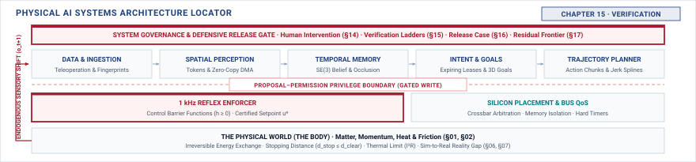

# Verification\chaptersubtitle{Breaking the Assembled Machine to See If Its Claims Hold} {#sec-verification}

{#fig-locator-ch15 fig-pos="H" width=100%}

*Do the claims this machine rests on survive a deliberate attack on each one?*

<!-- HOOK: one substantive paragraph answering the question above. -->



::: {.callout-objective}
After studying this chapter, you will be able to:

1. State an operating envelope precisely enough that a condition outside it can be deliberately created.
2. Derive a fault list by walking the records from Chapters 5 to 14 and violating each stated property.
3. Inject a stale observation, a late plan, and an expired intent on real hardware, and record what happened.
4. Say what a given rung of the qualification ladder can establish and what it cannot.

**Core Chapter Takeaway:** The fault list is derived from what the design claims, not chosen from a menu of techniques. Every property recorded in Parts II and III is a fault waiting to be injected, and the intervention mechanism is under test alongside everything else.

:::

## Introduction {#sec-verification-15-1}

<!-- SECTION 15.1 -->
<!-- claim: A machine that worked in front of you is not evidence that it works, and this chapter is about what would be. -->
<!-- covers: Open on a machine that has run successfully for weeks, and separate the existence claim one successful run establishes from the reliability, envelope, and fault-tolerance claims it cannot. -->
<!-- covers: Show that a nominal success rate is conditional on the sampled operating distribution and says nothing about excluded boundaries, rare faults, or correlated disturbances. -->
<!-- covers: Trace a flow regulator that succeeds repeatedly at nominal pressure and has never encountered a delayed level observation near the overflow boundary. -->
<!-- covers: Name the ingredients that turn a run into evidence: a bounded claim, defined test conditions, a precommitted oracle, a stated sampling or injection procedure, and provenance. The chapter builds each in turn. -->
<!-- GROUNDING: failure — what a working demonstration establishes, and what it does not -->
<!-- DERIVE: why a successful trajectory cannot support a claim over unobserved conditions -->

<!-- BEGIN -->

<!-- END -->

## The Operating Envelope {#sec-verification-15-2}

<!-- SECTION 15.2 -->
<!-- claim: The conditions under which the machine is claimed to work, stated precisely enough to be violated on purpose. -->
<!-- covers: Express the envelope as measurable ranges and combinations for physical state, environment, sensing quality, timing, compute load, power, and human availability. -->
<!-- covers: Distinguish the claimed operating envelope from the larger survival envelope within which enforcement must still bring the machine to a bounded state. -->
<!-- covers: Derive the remaining reaction time of a pumped reservoir from usable volume margin divided by worst-case net inflow. -->
<!-- covers: Show why independent minimum-and-maximum tables are insufficient when pressure, viscosity, valve response, and observation age interact. -->
<!-- covers: Require every boundary to have units, measurement provenance, uncertainty, and an accountable owner who can accept or narrow the claim. -->
<!-- covers: Select test points on, just inside, and just outside each consequential boundary rather than testing only nominal interior points. -->
<!-- GROUNDING: mechanism — the operating envelope stated precisely enough to violate on purpose -->
<!-- FIGURE: a boundary plot showing where the claimed operating envelope, survival envelope, and deliberately violated conditions separate -->
<!-- DERIVE: the flow regulator’s time-to-limit boundary from conservation of volume rather than asserting a permissible delay -->

<!-- BEGIN -->

<!-- END -->

## Deriving the Fault List {#sec-verification-15-3}

<!-- SECTION 15.3 -->
<!-- claim: Inverting your own records produces every fault your design already anticipated, which is exactly the set that will not surprise you. A second, independent source is required. -->
<!-- covers: Correct the source inventory: Chapters 5–7 supply learned-policy properties, Chapters 8–13 supply interface and architecture properties, and Chapter 14 supplies authority-transfer properties. -->
<!-- covers: Convert each property into a testable chain consisting of its negation, injection point, expected detector, bounded response, and observable pass condition. -->
<!-- covers: Invert data provenance, simulation-validity, and evaluation assumptions as well as runtime properties; distribution shift and misleading metrics are faults even when no packet is dropped. -->
<!-- covers: Invert observation freshness, state validity, intent lifetime, planning deadline, enforcement independence, and placement-resource claims at their actual handoffs. -->
<!-- covers: Include bus starvation, clock disagreement, and power loss only where the design claims tolerance; a generic technique menu must not invent requirements. -->
<!-- covers: Mark properties that cannot be injected or observed as verification gaps requiring instrumentation, a narrower claim, or a changed design. -->
<!-- covers: State the method's limit plainly: negating recorded properties finds faults the design team already modelled, and cannot find a hazard, a common-cause failure, or a foreseeable misuse that nobody wrote down. -->
<!-- covers: Add the second source: work forward from the physical machine rather than backward from the records, enumerating what the body, the power path, and the environment can do regardless of what the software believes. -->
<!-- covers: Enumerate the fault classes no software record implies: clock loss, supply brownout, electromagnetic interference, a stuck or floating output, corrupted boot state, and a reset path shared between the two domains. -->
<!-- covers: Add common-cause analysis across the independence claims made in Chapters 4 and 13, because two paths that fail together defeat a fault list that treats them separately. -->
<!-- covers: Include foreseeable misuse and the operator error modes from Chapter 14, which are hazards of the machine rather than faults of the machine. -->
<!-- covers: Include the claims Chapter 14 makes: that authority can be taken, within a deadline, from a machine in motion, and that the machine cannot resist it. Those are claims like any other and they are falsifiable like any other. -->
<!-- GROUNDING: mechanism — each record from the body, inverted into a fault -->
<!-- FIGURE: a traceability matrix showing every prior claim connected to its violated condition, injection point, detector, required response, and evidence record, with unsupported links exposed -->
<!-- DERIVE: the completeness boundary of the fault list from the completeness of the recorded claims and hazards -->

<!-- BEGIN -->

<!-- END -->

## The Qualification Ladder {#sec-verification-15-4}

<!-- SECTION 15.4 -->
<!-- claim: Each rung establishes something different, and none of them establishes the next one. -->
<!-- covers: Derive what replay can establish from the fact that recorded inputs are real while feedback, new states, and physical consequences are absent. -->
<!-- covers: Derive what simulation can establish from which plant, sensor, timing, and fault mechanisms the simulator represents and validates. -->
<!-- covers: Show that bench testing exposes target clocks, buses, power paths, and actuator interfaces while covering only a constrained physical environment. -->
<!-- covers: Show that shadow operation supplies deployment workloads and environmental exposure but cannot establish the consequences of commands that were never allowed to act. -->
<!-- covers: Treat the four modes as complementary evidence scopes rather than a staircase whose higher rung subsumes every lower one. -->
<!-- covers: Require every reported result to name which causal-loop elements were real, simulated, replayed, bypassed, or unobserved. -->
<!-- GROUNDING: mechanism — four rungs, and what each can and cannot establish -->
<!-- FIGURE: a qualification matrix showing which parts of the causal loop are real, modeled, replayed, or absent in each test mode -->
<!-- DERIVE: what each qualification mode can establish from the causal-loop elements it actually exercises -->

<!-- BEGIN -->

<!-- END -->

## Fault Oracles and Acceptance Criteria {#sec-verification-15-5}

<!-- SECTION 15.5 -->
<!-- claim: A fault test without a precommitted detector and an acceptable response is an anecdote about a machine that did something. -->
<!-- covers: The oracle: what counts as detecting this fault, decided before the test -->
<!-- covers: The response-time bound, and the state trajectory that remains acceptable -->
<!-- covers: The invalid-test rule: what makes a run not count -->
<!-- covers: Why precommitment is what separates evidence from a story -->
<!-- GROUNDING: mechanism — the detector, the response bound, and the invalid-test rule, all precommitted -->

<!-- BEGIN -->

<!-- END -->

## Fault Injection on Hardware {#sec-verification-15-6}

<!-- SECTION 15.6 -->
<!-- claim: A fault injected in simulation tests the simulator. -->
<!-- covers: Run injections through the production handoff, target clocks, shared buses, and enforcement path while holding the physical consequence within an independent test-containment bound. -->
<!-- covers: Inject a stale observation by withholding renewal while preserving its original acquisition timestamp, then measure when the freshness detector reacts. -->
<!-- covers: Inject a late plan by delaying delivery at the planner-to-enforcer boundary, then compare refusal time with the remaining physical margin of the flow process. -->
<!-- covers: Inject an expired intent by stopping lease renewal, then verify that subsequent plans lose authority even if their values remain numerically plausible. -->
<!-- covers: Record the state trajectory, detector identity, command substitution or refusal, and time to bounded state with instrumentation independent of the path under test. -->
<!-- covers: Reject a supposed pass when the machine survived because of an unrelated power interruption, actuator jam, logger failure, or other response absent from the claim. -->
<!-- covers: Test the intervention mechanism itself, under the conditions that would make anyone want to use it: does a takeover actually acquire control when the proposal path is saturated, when a deadline has already been missed, and when the machine is moving? A mechanism that works on an idle bench is not the mechanism anyone needs. -->
<!-- GROUNDING: case — injection on the real target, and a machine that survived for the wrong reason -->
<!-- FIGURE: a synchronized timing trace showing injection, deadline or lease expiry, detector firing, enforced response, and the process state remaining inside its survival bound -->
<!-- DERIVE: the claim that hardware injection adds evidence by identifying the target-specific timing, contention, power, and actuation mechanisms absent from the simulation -->

<!-- BEGIN -->

<!-- END -->

## The Fault Record {#sec-verification-15-7}

<!-- SECTION 15.7 -->
<!-- claim: What the faults showed, and with equal prominence, what was never tested. -->
<!-- covers: State only the fields this chapter adds to the notebook. The schema, its provenance rules, and its versioning are established in Section 4.10 and are not restated here. -->
<!-- covers: Keep “The Fault Record” for the claim attacked, envelope point, injected magnitude and duration, target version, raw trace, detector, response, outcome, and anomalies. -->
<!-- covers: Record invalid and unobservable trials separately from passes so missing telemetry cannot increase apparent coverage. -->
<!-- covers: Report coverage by dimension, including requirements, envelope boundaries, injection sites, timing tails, hardware configurations, and fault combinations, rather than as one percentage. -->
<!-- covers: Add “What Repetition Can Establish” to distinguish repeated stochastic trials from repeated execution of the same deterministic test. -->
<!-- covers: Derive that 299 independent zero-failure trials bound an event probability near 1 percent at 95 percent confidence, while naming the independence and representativeness assumptions. -->
<!-- covers: Give untested conditions and unsupported probability claims equal prominence with successful results, then pass the record to Chapter 16. -->
<!-- FIGURE: a zero-failure confidence curve showing how the upper probability bound falls with trial count and where independence or representativeness can invalidate it -->
<!-- DERIVE: the trial-count claim from a one-sided binomial bound, including its independence and sampling assumptions -->

<!-- BEGIN -->

<!-- END -->

## Systems Stress-Tests {#sec-verification-15-8}

<!-- SECTION 15.8 -->
<!-- claim: A fault that passes individually and fails in combination. -->
<!-- covers: Derive compound tests from shared resources, common causes, detector dependencies, and budgets that add across handoffs rather than enumerating every fault pair. -->
<!-- covers: Show a flow regulator in which 120 ms of observation delay and 150 ms of planning delay each satisfy a local 200 ms limit but together exceed a 250 ms end-to-end physical margin. -->
<!-- covers: Test whether bus saturation simultaneously delays observations, plans, enforcement telemetry, and the evidence logger. -->
<!-- covers: Include a case in which one fault disables the detector needed to contain the second fault. -->
<!-- covers: Treat an unobservable outcome as an invalid test and an instrumentation defect, never as evidence that the machine held. -->
<!-- covers: Record the interaction responsible for failure so Chapter 16 can condition or refuse release on that shared cause. -->
<!-- DERIVE: compound fault priorities from common causes, shared resources, and composed margins rather than selecting combinations arbitrarily -->

<!-- BEGIN -->

<!-- END -->

## Summary {#sec-verification-15-9}

<!-- SECTION 15.9 -->
<!-- claim: Chapter 13 receives evidence rather than confidence. -->
<!-- covers: Distill the distinction between a successful demonstration and evidence tied to a bounded claim. -->
<!-- covers: Restate that the operating envelope determines which violations are meaningful and reproducible. -->
<!-- covers: Carry forward the traceability from each prior property through its injected fault, detector, response, and measured outcome. -->
<!-- covers: State that every qualification mode leaves explicit evidentiary limits and that untested conditions remain open claims. -->
<!-- covers: Hand Chapter 16 a versioned fault record containing passes, failures, invalid tests, coverage gaps, and unsupported probability claims. -->

<!-- BEGIN -->

<!-- END -->
