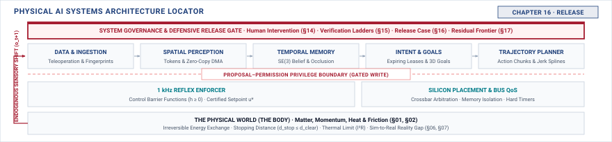

# Release\chaptersubtitle{Deciding Whether It Should Operate} {#sec-release}

{#fig-locator-ch16 fig-pos="H" width=100%}

*Should this machine be allowed to operate?*

<!-- HOOK: one substantive paragraph answering the question above. -->



::: {.callout-objective}
After studying this chapter, you will be able to:

1. Assemble a claim, an argument, and the evidence supporting each link.
2. Trace every condition in a verdict back to a specific measurement.
3. Render operate, operate-with-conditions, or do not, and state what each obliges afterwards.
4. Attack an argument you wrote and identify its weakest link.

**Core Chapter Takeaway:** A verdict is an argument from evidence to a claim, and it is only as strong as its weakest link. Release is a decision rather than another test, and what it decides is one machine, inside a stated envelope, for a stated period.

:::

## Introduction {#sec-release-16-1}

<!-- SECTION 16.1 -->
<!-- claim: Everything the book has recorded now has to become an argument that someone could attack. -->
<!-- covers: Establish the chapter's purpose: taking the accumulated records from Chapters 2 through 15 and compiling them into a defensible, auditable argument that decides whether the machine may physically operate. -->
<!-- covers: Explain why release introduces no new engineering mechanisms or learned models: it is an act of systems adjudication over existing evidence. -->
<!-- covers: Frame the release verdict not as a binary prediction of future perfection, but as an explicit, bounded contract between an operational claim, empirical evidence, and runtime enforcement. -->
<!-- covers: Introduce the three possible verdicts—Operate, Operate with Conditions, and Do Not Operate—and establish that refusal is a successful engineering outcome rather than a project failure. -->
<!-- covers: Preview the chapter's worked case: an autonomous tactile manipulation cell that touches workpieces and humans, whose release rests on an unbroken chain of timing, force, and refusal bounds. -->
<!-- GROUNDING: frame — the claim being decided, and who is accountable for it -->
<!-- FIGURE: A flowchart showing the aggregation of evidence records from Parts I through IV converging into an argument graph that evaluates against a release claim to produce one of three verdicts. -->

<!-- BEGIN -->

<!-- END -->

## The Release Question {#sec-release-16-2}

<!-- SECTION 16.2 -->
<!-- claim: What is actually being decided, by whom, and against which claim. -->
<!-- covers: Distinguish the engineering release question ("Does the evidence justify delegating physical authority under these conditions?") from statistical performance ("What is the test accuracy?") and demonstration ("Did it work during the demo?"). -->
<!-- covers: Formulate the Operational Design Domain (ODD) as a rigorous set of physical invariants: geometric workspace bounds, payload mass and friction limits, environmental lighting/temperature ranges, and human co-presence states. -->
<!-- covers: Define the release claim as a falsifiable physical proposition: bounding the maximum force ($F_{\max} \le 50\text{ N}$), stopping time ($t_{\text{stop}} \le 40\text{ ms}$), and energy transfer under all single-point failures within the ODD. -->
<!-- covers: Establish the accountability boundary: defining who holds the authority to sign a release verdict, what technical artifacts they attest to, and why safety authority cannot be diffused across model developers and system integrators. -->
<!-- covers: Map the boundary conditions where the release question becomes invalid: operational drift, out-of-distribution physical interactions, and unmodeled mechanical wear. -->
<!-- GROUNDING: mechanism — what is actually being decided, by whom, and against which claim -->
<!-- FIGURE: A coordinate map showing the multidimensional Operational Design Domain boundary with safe operating regions, degraded conditional zones, and the hard refusal boundary where physical invariants cannot be guaranteed. -->
<!-- DERIVE: The maximum permissible kinetic energy and stopping distance for a touching machine from contact mechanics and human tissue injury thresholds ($F = \Delta p / \Delta t$). -->

<!-- BEGIN -->

<!-- END -->

## Claims, Argument, and Evidence {#sec-release-16-3}

<!-- SECTION 16.3 -->
<!-- claim: An argument connects a claim to evidence through links, and every link is attackable. -->
<!-- covers: Formalize the structure of a safety case using claim-argument-evidence trees (adapted from Goal Structuring Notation) without introducing bureaucratic overhead. -->
<!-- covers: Define the four structural elements: the top-level Claim (the physical safety goal), Strategies/Arguments (decomposition by hazard or operational sub-regime), Evidence (calibrated empirical data and formal proofs), and Context/Assumptions (stated boundary conditions). -->
<!-- covers: Distinguish genuine evidence (bounded fault injection runs, worst-case timing measurements, calibrated sensor error bounds) from mere demonstration (curated success runs with unquantified variance). -->
<!-- covers: Define the warrant (inductive link) that connects evidence to a claim, explaining why statistical empirical testing on finite samples requires a deterministic physical enforcer (Chapter 12) to close the inductive gap. -->
<!-- covers: Identify the unstated link failure: uncovering hidden assumptions (e.g., constant ambient illumination, non-degraded gripper friction, zero network jitter on the local bus) that silently break the argument when violated. -->
<!-- covers: Establish the rule of the weakest link: a multi-tiered safety case fails completely if any single critical hazard mitigation link lacks empirical backing. -->
<!-- GROUNDING: mechanism — a claim connected to evidence through links, each one attackable -->
<!-- FIGURE: An argument tree diagram showing a top-level claim decomposed into sub-claims, warrants, and backing evidence, with callouts contrasting a sound link against a broken link with a hidden assumption. -->
<!-- DERIVE: The relationship between empirical test sample size $N$, target hazard rate $\lambda$, and statistical confidence level $1 - \alpha$ ($N = -\ln(\alpha)/\lambda$), proving why physical safety claims in continuous state spaces cannot rely on black-box testing alone. -->

<!-- BEGIN -->

<!-- END -->

## The Three Verdicts {#sec-release-16-4}

<!-- SECTION 16.4 -->
<!-- claim: Operate, operate with stated conditions, or do not, and each obliges something afterwards. -->
<!-- covers: Define the criteria for Verdict 1 (Operate): every hazard identified in Chapter 15 verification has an unbroken evidence link supported by deterministic enforcement (Chapter 12) and hardware physical limits (Chapter 2). -->
<!-- covers: Define the criteria and mechanics for Verdict 2 (Operate with Conditions): restricting the operational design domain, de-rating motor torque/velocity, enforcing human physical exclusion barriers, or requiring runtime telemetry guardrails. -->
<!-- covers: Establish the conditional monitoring contract: every condition attached to a release verdict MUST be tied to a measurable, real-time hardware or nervous-system observable with a deterministic trigger threshold. -->
<!-- covers: Define the criteria for Verdict 3 (Do Not Operate / Refuse): identifying conflicting evidence, uncharacterized tail latencies, missing fault-injection coverage, or unmonitored failure modes. -->
<!-- covers: Articulate the engineering legitimacy of refusal: demonstrating how a refusal verdict isolates the specific missing evidence link, converting an organizational deadlock into a concrete testing mandate. -->
<!-- covers: Specify the post-verdict obligations: defining periodic recalibration intervals, telemetry drift budgets, and the logging infrastructure required to maintain release validity during continuous deployment. -->
<!-- GROUNDING: mechanism — three verdicts, and what each one obliges afterwards -->
<!-- FIGURE: A decision matrix mapping evidence completeness and hazard severity combinations directly to the three release verdicts, showing the required telemetry bindings for conditional release. -->

<!-- BEGIN -->

<!-- END -->

## The Verdict's Standing Conditions {#sec-release-16-5}

<!-- SECTION 16.5 -->
<!-- claim: A release verdict is not a property of the machine. It is a claim conditional on premises that must still be true tomorrow, which makes monitoring them part of the verdict rather than an operational afterthought. -->
<!-- covers: Extract the premises the verdict rests on and mark each one as continuously monitored, periodically re-established, or assumed for the life of the release. -->
<!-- covers: Give every monitored premise a runtime detector and a defined response, because a premise nobody checks has silently become an assumption. -->
<!-- covers: Make the distinction the chapter turns on: envelope membership known-true, known-false, and unknown are three states, not two, and unknown must be treated as outside rather than inside. -->
<!-- covers: Specify what the machine does when a premise cannot be evaluated: degrade, restrict authority, or stop, chosen in advance rather than at the moment of confusion. -->
<!-- covers: Attach an expiry to the verdict itself, because wear, software change, and environmental drift each invalidate premises on their own schedule. -->
<!-- covers: Route enforcement of these conditions through the mechanism of Chapter 12, so a standing condition is checked by the part that can refuse rather than by a monitoring dashboard. -->
<!-- GROUNDING: mechanism — a verdict decomposed into premises, each marked monitored, re-established, or assumed -->
<!-- DERIVE: Derive the response to an unevaluable premise from the physical consequence of continuing, not from the severity of the premise. -->

<!-- BEGIN -->

<!-- END -->

## A Case Worked in Full {#sec-release-16-6}

<!-- SECTION 16.6 -->
<!-- claim: One machine, from its recorded limits to a verdict, with every link shown. -->
<!-- covers: Introduce the physical system: an autonomous robotic tactile manipulation workstation inserting machined components near human operators, drawing specifications from Chapters 2, 4, 8, 11, 12, and 15. -->
<!-- covers: State the top-level release claim: the manipulator will never exert normal contact force exceeding $50\text{ N}$ or shear force exceeding $20\text{ N}$ on an unexpected object or human hand, even during model misclassification or sensor dropouts. -->
<!-- covers: Trace the supporting evidence links: mechanical compliance and joint torque limits from Chapter 2, worst-case tactile perception latency ($12\text{ ms}$) from Chapter 8, deterministic safety reflex tripping time ($8\text{ ms}$) from Chapter 12, and fault-injection matrix results from Chapter 15. -->
<!-- covers: Expose the broken link in the initial argument: uncovering that tactile slip detection fails under oil contamination, creating an unmonitored hazard where shear forces can exceed limits before slip is declared. -->
<!-- covers: Evaluate the adjudication: rejecting the unconditional "Operate" verdict due to the broken slip-detection link, and deriving the exact conditions required for a "Operate with Conditions" verdict. -->
<!-- covers: Issue the final verdict and its contract: release granted under restricted payload mass ($\le 1.5\text{ kg}$), dry-part optical pre-check, and real-time current-monitoring tripwires that shut down the inverter if shear estimates stall. -->
<!-- GROUNDING: case — one machine taken from its recorded limits to a verdict, every link shown -->
<!-- FIGURE: The complete, annotated argument tree for the tactile workstation, color-coding verified evidence links in green, the broken slip-detection link in red, and the compensatory conditional branch in amber. -->
<!-- DERIVE: The total stopping force profile and contact impulse integral ($\int F \, dt$) of the manipulator from the moment tactile slip is missed until the secondary motor-current tripwire arrests motion. -->

<!-- BEGIN -->

<!-- END -->

## Adversarial Review {#sec-release-16-7}

<!-- SECTION 16.7 -->
<!-- claim: The useful question is not whether you believe your argument but where someone else would break it. -->
<!-- covers: Define the adversarial review discipline: a structured red-team audit that treats the safety argument not as a defense brief to justify deployment, but as a target system to be broken. -->
<!-- covers: Execute the four adversarial probes: challenging empirical sufficiency (did test distributions cover the physical extremes?), probing domain transfer (does simulation evidence hold on hardware?), testing independence (do the model and enforcer share a single point of failure?), and identifying unmonitored state drift. -->
<!-- covers: Formulate defeaters and counter-evidence: systematically constructing physical scenarios (e.g., concurrent sensor degradation and mechanical backlash) that invalidate specific warrants without triggering standard error handlers. -->
<!-- covers: Audit the independence of the permission path: verifying that safety enforcer assertions (Chapter 12) and human authority overrides (Chapter 14) cannot be bypassed, corrupted, or starved by high-priority model inference tasks. -->
<!-- covers: Detail the protocol when an attack succeeds: decomposing the broken warrant into missing physical limits, inadequate verification suites, or uncharacterized latencies, and routing remediation back to the owning subsystem chapter. -->
<!-- GROUNDING: failure — unsupported links, untested conditions, and evidence that does not say what is claimed -->
<!-- FIGURE: A checklist-driven attack taxonomy diagram illustrating the four adversarial probe vectors applied against each node of an argument tree. -->

<!-- BEGIN -->

<!-- END -->

## How Release Arguments Go Wrong {#sec-release-16-8}

<!-- SECTION 16.8 -->
<!-- claim: Arguments that were accepted and should not have been share a small number of patterns. -->
<!-- covers: Classify the canonical failure modes of physical AI safety cases into four recurring structural pathologies. -->
<!-- covers: Pathology 1 (The Simulation-to-Reality Leap): substituting high-volume synthetic or simulated pass rates for physical world verification without bounding unmodeled contact dynamics or sensor noise floors. -->
<!-- covers: Pathology 2 (The Proxy Metric Fallacy): relying on statistical loss functions, mAP, or average reward as evidence for physical safety, ignoring the fat-tailed distribution of hazardous physical states. -->
<!-- covers: Pathology 3 (The Unmonitored Condition): issuing an "Operate with Conditions" verdict without deploying continuous, hardware-enforced runtime monitors to detect when operational boundaries are exceeded. -->
<!-- covers: Pathology 4 (Organizational Normalization of Deviance): degrading safety margins over time as non-catastrophic edge-case anomalies are observed without triggering argument invalidation or re-review. -->
<!-- covers: Walk through an autopsy of a catastrophic physical system release failure, demonstrating exactly which argument link was flawed and how an adversarial audit would have caught it. -->
<!-- GROUNDING: case — arguments that were accepted and should not have been -->
<!-- INCIDENT: needs a documented, citable case. Do not invent one. -->
<!-- FIGURE: A failure taxonomy diagram contrasting four flawed argument structures against their resulting physical failure mechanisms in deployed hardware. -->

<!-- BEGIN -->

<!-- END -->

## The Release Record {#sec-release-16-9}

<!-- SECTION 16.9 -->
<!-- claim: The verdict, its conditions, and what must be revisited and when. -->
<!-- covers: State only the fields this chapter adds to the notebook. The schema, its provenance rules, and its versioning are established in Section 4.10 and are not restated here. -->
<!-- covers: Define the Release Record: the formal, immutable engineering artifact that encapsulates the claim, argument tree, verified evidence traces, exact software/model hashes, hardware revisions, and signed verdict. -->
<!-- covers: Specify the metadata and provenance requirements: linking every piece of evidence back to calibrated test bench logs, simulation run identifiers, and hardware serial numbers to ensure end-to-end reproducibility. -->
<!-- covers: Enumerate the explicit Invalidation Triggers: defining the physical, operational, and software changes (e.g., model weight retraining, sensor supplier changes, mechanical wear exceeding tolerances, or ODD expansion) that automatically void the release verdict. -->
<!-- covers: Detail the Continuous Re-decision Protocol: establishing how field telemetry feeds into scheduled safety audits and how anomalous sensor drift triggers an automatic rollback to a safe state or operational shutdown. -->
<!-- covers: Close the loop with the whole book: showing how the Release Record completes the journey from Chapter 1's causal boundary to a verified, accountable physical machine operating safely in the real world. -->
<!-- FIGURE: A schematic showing the structure of a signed Release Record artifact, illustrating its links back to test evidence and forward to runtime telemetry monitors and automatic invalidation triggers. -->

<!-- BEGIN -->

<!-- END -->
