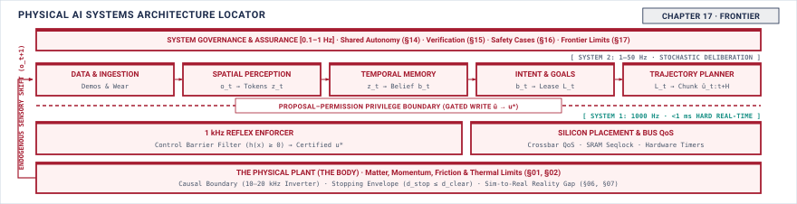

# Frontier\chaptersubtitle{What This Method Cannot Settle, and What Would Change That} {#sec-frontier}

{#fig-locator-ch17 fig-pos="H" width=100%}

*What can a record like this not answer, and what would it take to answer it?*

A systems engineering framework that teaches practitioners to demand rigorous evidence must be equally transparent about the boundaries of its own methodology. No finite amount of empirical testing can certify open-world safety against catastrophic rare events, and several critical failure modes in physical systems lack practical real-time detectors. The frontier of physical AI is not a catalog of speculative algorithms, but the formal register where unproven premises and detectorless gaps are openly documented. Recognizing what current evidence cannot settle—and enforcing the physical authority limits and operational restrictions needed to render the unknown harmless—is the definitive mark of professional engineering discipline.



::: {.callout-objective}
After studying this chapter, you will be able to:

1. Identify, for a machine of your own, which claims your evidence cannot currently support.
2. Name a failure mode from this book for which no practical detector exists.
3. State what advance would close a specific gap, and how you would know it had.
4. Apply the four properties to a machine this book never described.

**Core Chapter Takeaway:** A complete record still leaves claims unsupported. Several failure modes named in this book have no practical detector, and some claims cannot be supported by any evidence obtainable today. Naming those is the register of the discipline, not a weakness in it.

:::

## Introduction {#sec-frontier-17-1}

<!-- SECTION 17.1 -->
<!-- claim: A book that teaches engineers to demand evidence has to be honest about the evidence its own method cannot produce. -->
<!-- covers: Reopen the Chapter 16 verdict and show that it authorizes only a stated machine, operating envelope, duration, and set of monitored conditions. -->
<!-- covers: Compare three apparently complete records: a moving machine whose stopping claim assumes available friction, a touching machine whose force limit assumes material integrity, and a flow regulator whose bound assumes an undrifted reference sensor. -->
<!-- covers: Distinguish completeness within the method from completeness of knowledge; every required record field may be filled while a necessary premise remains unsupported. -->
<!-- covers: Establish the chapter’s test for a useful gap: name the affected claim, the missing evidence or observable, the present operational response, and the result that would close it. -->
<!-- covers: Explain that a new model or benchmark matters here only if it changes one of those four entries and can therefore alter a release verdict. -->
<!-- GROUNDING: frame — what the method establishes, and the boundary where it stops -->

<!-- BEGIN -->
A safety case assembled through rigorous systems engineering concludes with an explicit verdict. When an engineering review accepts that verdict, it does not certify that the physical machine is unconditionally safe. The verdict authorizes a specific hardware revision running a designated software build, restricted to a defined operating envelope, validated for an explicit operational duration such as $2000\text{ h}$, and conditioned on the continuous functioning of specified runtime monitors. As illustrated in the systems stage locator (@fig-locator-ch17), a rigorous engineering framework maps every cataloged physical failure mode against available runtime detectors across the machine's architecture. Where verified detectors and deterministic reflexes exist, the nervous system can enforce physical boundaries, clip unsafe commands, and arrest motion within budgeted latency windows. But where detectors are absent, the matrix reveals empty cells—unclosable epistemic gaps where empirical evidence ends and operational restrictions must govern. It establishes that across the validated parameter space, every cataloged hazard has an assigned mitigation path with verified latency budgets and bounded actuation forces. The authority of that authorization depends entirely on the validity of its underlying physical premises. A book that teaches engineers to demand evidence has to be honest about the evidence its own method cannot produce.

Consider three machines, each possessing an apparently complete safety record whose line items close without a single arithmetic deficit. The first is a mobile transport platform moving at $1.5\text{ m/s}$, whose stopping distance claim of $0.49\text{ m}$ assumes an available tire-to-floor friction coefficient of $\mu \ge 0.60$. If unmonitored liquid on the concrete floor reduces that coefficient to $\mu = 0.15$, the kinematic braking distance derived from friction limits quadruples from $0.19\text{ m}$ to $0.76\text{ m}$. Combined with the $0.30\text{ m}$ traversed during a $200\text{ ms}$ perception and actuation latency, the total stopping distance expands to $1.06\text{ m}$, breaching the $0.80\text{ m}$ clearance buffer before the vehicle halts. The second is an articulated manipulator commanded to limit contact force to $40\text{ N}$ during workpiece assembly, where the force-limiting guarantee assumes structural stiffness and material integrity across the end-effector mount. If fatigue micro-cracking introduces unmodeled compliance into the mount, mechanical deflection stores strain energy under load and releases it abruptly during surface transitions, delivering an unmeasured $120\text{ N}$ transient peak to the workpiece while the joint torque sensors register nominal values. The third is a chemical flow regulator maintaining downstream line pressure below $200\text{ kPa}$, whose control loop assumes an undrifted diaphragm pressure transducer. If chemical deposition on the diaphragm induces a steady calibration drift of $0.5\text{ kPa/h}$, the nervous system throttles the valve against a phantom pressure spike or opens it into an actual overpressure state of $240\text{ kPa}$, unaware that its reference sensor has drifted from physical ground truth.

These failures expose the difference between completeness within an engineering method and completeness of physical knowledge. In all three systems, every required cell in the verification matrix was populated with valid data. The timing budgets closed, the safety reflexes passed fault injection, the thermal dissipation of the actuators remained below the $80\,^{\circ}\text{C}$ winding limit, and the runtime enforcer executed deterministically at $1000\text{ Hz}$. Yet a necessary physical premise in each system remained unsupported by direct, continuous evidence. The record documented compliance with the specification, but the specification treated environmental friction, structural mechanics, and sensor calibration as static invariants rather than dynamic physical states. When an unmonitored invariant shifts, the physical machine departs from the verified envelope while telemetry continues to report normal operation.

Treating these blind spots with systems engineering rigor requires defining an **evidentiary gap** as an operational quantity rather than a general caveat. An evidentiary gap exists when a safety-critical claim relies on an assumption that cannot be continuously verified during execution or established through prior testing. To be actionable, every gap must satisfy a four-part specification. First, it must state the affected claim, such as maintaining deceleration within a designated spatial buffer. Second, it must identify the missing observable or unattainable evidence, such as the instantaneous friction coefficient between the wheel contact patch and an oily surface. Third, it must state the present operational response, such as derating the maximum transit speed to $0.6\text{ m/s}$ or restricting the machine to dry indoor flooring. Fourth, it must define the physical measurement, sensor modality, or analytical result that would close the gap and permit the operational restriction to be lifted.

Framing the frontier in these terms clarifies how to evaluate new machine learning models, training regimes, and empirical benchmarks. In software machine learning, progress is often tracked by aggregate scores on standardized test datasets. In physical AI, a new model architecture, an expanded parameter count, or an improved benchmark score is irrelevant to a deployment authority unless it alters one of the four entries in an evidentiary gap. If a learned policy achieves higher average accuracy on an offline manipulation dataset but still requires an external mechanical guard to prevent over-torque, the safety case remains identical. Conversely, if an algorithmic advance provides verifiable bounds on out-of-distribution visual inputs, or if an improved model reduces inference latency from $80\text{ ms}$ to $10\text{ ms}$ at the $P_{99}$ tail and thereby recovers $0.10\text{ m}$ of stopping margin, that improvement directly alters the release verdict.

The frontier of the discipline is not a survey of emerging software techniques, which date quickly as tooling evolves. It is the boundary where measurable evidence ends and operational containment begins. An engineer who builds machines that act on the physical world must know exactly which claims their safety record proves, which claims it merely assumes, and what instrumentation or physical insight would be required to transform an assumption into evidence.
<!-- END -->

## What the Method Cannot Establish {#sec-frontier-17-2}

<!-- SECTION 17.2 -->
<!-- claim: A complete record still leaves things undecided, and knowing which is part of the discipline. -->
<!-- covers: Decompose a release claim into necessary links such as domain membership, measured physical bounds, component contracts, enforcement independence, detector coverage, and continued monitoring. -->
<!-- covers: Classify each link as measured, derived from measured premises, assumed, decided by accountable judgment, unsupported, or explicitly outside the threat model. -->
<!-- covers: Show from the logic of necessary premises that strong evidence for five links cannot compensate for a sixth link that is unsupported. -->
<!-- covers: Mark the friction premise, material-damage threshold, and sensor-independence premise in the three example records, then state exactly how each limits its verdict. -->
<!-- covers: Separate measurement from judgment: evidence can estimate exposure and uncertainty, but it cannot choose an acceptable residual risk or decide who may bear it. -->
<!-- covers: State the adversarial boundary precisely; tests of accidental faults do not support claims about intentional sensor manipulation, model tampering, or denial of enforcement. -->
<!-- covers: Define the claimed failure probability, unit of exposure, confidence level, and independence assumptions before counting a single trial. -->
<!-- covers: Derive from $(1-p)^n$ that zero observed failures require $n \ge \ln(\alpha)/\ln(1-p)$ independent representative exposures to support a bound $p$ at confidence $1-\alpha$. -->
<!-- covers: Work the number: supporting $p \le 10^{-9}$ per operating hour at 95 percent confidence takes roughly $3.0\times10^{9}$ failure-free hours, about 342,000 machine-years. -->
<!-- covers: Explain why correlated fleet hours, changing software, censored interventions, and unvalidated simulation do not automatically count as independent representative exposure. -->
<!-- covers: Distinguish unaffordable evidence from logically insufficient evidence, because more testing can address the first and only a narrower claim or a structural argument can address the second. -->
<!-- covers: State the defensible alternatives: narrow the domain, bound physical authority, add independent enforcement, shorten the verdict, assign the residual risk explicitly, or refuse. -->
<!-- GROUNDING: number — the exposure a rare-event claim would require, against what is affordable -->
<!-- FIGURE: SHOW the reciprocal growth of required exposure as the target failure rate falls, with universal open-world claims placed outside every finite-exposure curve. -->
<!-- DERIVE: the zero-failure exposure bound, including its confidence, independence, and representativeness assumptions -->

<!-- BEGIN -->
A safety release claim for a physical AI system is not a monolithic assertion of competence. It is a conjunction of discrete, necessary links that must all hold simultaneously for a physical guarantee to remain valid. A complete argument requires establishing domain membership for incoming sensor observations, measured physical bounds on actuator authority and stopping distances, formal component contracts across software boundaries, strict execution independence between the learned policy and the safety enforcement path, quantified detector coverage across all identified fault modes, and continuous runtime monitoring of system invariants. Because these premises form a logical conjunction, the strength of the overall claim is governed by its weakest constituent link. Generating extensive, high-confidence empirical evidence for five of these links cannot compensate for a sixth link that remains unsupported, because a failure in any single premise causes the deductive safety argument to fail entirely.[^popper_falsification]

Every link in a safety case requires an explicit epistemic classification, identifying each premise as measured directly through physical instrumentation, derived analytically from measured premises, assumed on physical or operational grounds, decided by accountable judgment, left unsupported by existing data, or explicitly declared outside the threat model. In the three reference machines examined throughout this text, these classifications reveal the exact boundary where evidence ends. For the wheeled mobile robot, the stopping-distance guarantee relies on an assumed friction coefficient between tire and floor that cannot be measured before braking begins. For the articulated manipulator, the collision-containment argument depends on an assumed material-damage threshold for surrounding equipment, which is an engineering judgment about structural yield rather than a measured property of the controller. For the aerial vehicle, the state-estimation envelope assumes statistical independence between optical flow and inertial sensors, an assumption that collapses under sudden illumination changes or frame resonance. Naming these premises explicitly does not weaken the release record. It establishes the physical envelope within which the release verdict is justified, and outside of which the verdict ceases to apply.

Separating measurement from judgment is fundamental to systems engineering discipline. Empirical testing and statistical characterization can estimate physical exposure, quantify sensor noise, and bound parametric uncertainty, but no measurement can choose an acceptable residual risk or decide which individuals in an operational environment must bear that risk. Those choices are accountable human decisions that must be recorded as explicit judgments rather than disguised as empirical findings. In the same way, the threat model establishes an absolute boundary on the validity of the record. Empirical testing across nominal fleet operations and accidental component faults provides no evidence regarding intentional adversarial attacks. A safety record demonstrating that a vision pipeline handles sensor noise, lens blur, and partial occlusions provides zero statistical support for claims about resilience against adversarial optical projection, model parameter tampering, or intentional denial of service across the internal communication bus.

When an engineering claim relies on statistical testing to bound the probability of a hazardous event, the claim requires rigorous formal definition before conducting trials. The engineering specification must define the target failure probability $p$, the physical unit of exposure, the required statistical confidence level $1-\alpha$, and the necessary independence assumptions before counting a single hour or trial. If a dangerous failure occurs with constant probability $p$ per independent, identically distributed exposure unit, the probability of observing zero failures across $n$ units of exposure is $(1-p)^n$. To assert with confidence $1-\alpha$ that the true failure rate does not exceed $p$, the probability of observing zero failures purely by chance must not exceed $\alpha$, yielding the inequality $(1-p)^n \le \alpha$. Taking the natural logarithm of both sides gives $n \ln(1-p) \le \ln(\alpha)$. Because $p \in (0, 1)$, the quantity $\ln(1-p)$ is negative, and dividing by it reverses the inequality, yielding the required exposure bound:
$$n \ge \frac{\ln(\alpha)}{\ln(1-p)}$$
For rare failure events where $p \ll 1$, the first-order Taylor approximation $\ln(1-p) \approx -p$ simplifies this relation to $n \ge \ln(1/\alpha)/p$.

As an analytical example, consider a safety requirement specifying that a high-consequence physical failure must occur with probability $p \le 10^{-9}$ per operating hour at a 95 percent confidence level ($1-\alpha = 0.95$, so $\alpha = 0.05$). Substituting these values into the exact relation demonstrates the scale of empirical testing required to support the claim. With $\ln(0.05) \approx -2.9957$ and $\ln(1 - 10^{-9}) \approx -1.0000 \times 10^{-9}$, the required number of independent, failure-free operational hours is:
$$n \ge \frac{-2.9957}{-1.0000 \times 10^{-9}} \approx 3.0 \times 10^{9}\text{ operating hours}$$
Accumulating $3.0 \times 10^{9}\text{ operating hours}$ without a single observed failure requires approximately 342,000 machine-years of continuous execution. This arithmetic demonstrates why claims of ultra-rare failure rates in open physical environments cannot be established through operational fleet testing alone.[^statutory_sil4_testing]

Operational fleet data rarely satisfies the statistical assumptions underlying this derivation. Aggregating runtime across a fleet of one thousand machines operating in parallel does not yield one thousand independent hours per wall-clock hour, because shared environmental conditions, correlated fleet-wide software updates, and common spatial layouts introduce systematic dependencies. Furthermore, learned systems undergo continuous modification; deploying an updated neural network checkpoint, retuned sensor filter, or modified calibration table resets the statistical trial counter, because the new software constitutes a distinct statistical distribution. Human safety interventions further distort empirical records through censoring. When an attentive human operator intercepts an erratic motion before contact occurs, the intervention truncates a potential accident, converting an uncontained failure into an unrecorded counterfactual. Similarly, unvalidated physics simulations cannot substitute for physical exposure, because simulation trials test only the disturbance distributions and contact dynamics that the modeler explicitly programmed, leaving real-world transfer discrepancies unmeasured.

An engineer must therefore distinguish between evidence that is unaffordable and evidence that is logically insufficient. Demonstrating a failure rate bound of $p \le 10^{-4}$ per operating hour on a mechanical brake actuator may be unaffordable within an eight-week test campaign, but it remains a tractable physical hypothesis that additional test benches and capital can establish. Conversely, attempting to prove open-world safety bounds for an end-to-end vision-language-action model through empirical sampling is logically insufficient, because no finite dataset can span the unbounded combinatorial possibilities of unconstrained physical environments. When a required premise cannot be settled by evidence, accumulating further empirical test hours is futile. The defensible engineering responses are structural. An engineer can narrow the operational design domain to eliminate untestable environmental states, bound the mechanical authority of the actuators so that maximum kinetic energy remains below structural damage limits, install an independent deterministic safety enforcer in the nervous system with veto authority over the learned policy, shorten the temporal duration of the release verdict to mandate frequent physical re-inspection, assign the residual risk explicitly to a designated human operator through formal interface contracts, or refuse to issue a release verdict.

[^popper_falsification]: **Karl Popper and the Asymmetry of Empirical Falsification.** Karl Popper formalized the fundamental asymmetry of empirical induction: no finite sequence of successful observations ($\forall t \le T, \text{safe}(t)$) can logically establish a universal proposition ($\forall t, \text{safe}(t)$), whereas a single observable counterexample instantly refutes it (Karl Popper, *The Logic of Scientific Discovery*, London: Routledge, 1959). In physical AI, millions of failure-free operating hours establish only a bounded empirical survival rate under a stationary operational distribution; they provide zero deductive guarantee against out-of-distribution physical edge cases.

[^statutory_sil4_testing]: **Statutory Safety Standards and Ultra-Reliability Bounds.** In safety-critical systems engineering, standards such as IEC 61508 (Safety Integrity Level 4) and ISO 26262 (Automotive Safety Integrity Level D) target dangerous failure rates on the order of $10^{-9}\text{ failures/h}$ for high-demand functions. As Butler and Finelli demonstrated (*The Infeasibility of Quantifying the Reliability of Life-Critical Software*, IEEE TSE, 1993), directly verifying such failure rates via statistical black-box testing is mathematically infeasible due to the astronomical exposure required ($>10^9\text{ h}$). Consequently, statutory standards require architectural fault tolerance, formal methods, and deterministic runtime enforcers rather than purely empirical testing of complex learned components. Modern autonomous safety standards such as UL 4600 (*Standard for Safety for the Evaluation of Autonomous Products*) similarly codify this principle by mandating a structured Safety Case that explicitly tracks residual risks, unmonitored assumptions, and detector blind spots.
<!-- END -->

## A Residual-Claims Register {#sec-frontier-17-3}

<!-- SECTION 17.3 -->
<!-- claim: Every claim the evidence does not support gets an entry: what is missing, what is done instead, who owns it, and what would close it. -->
<!-- covers: The register, and what one entry contains -->
<!-- covers: Linking a claim to the observable that is missing -->
<!-- covers: The operational response chosen while the gap is open -->
<!-- covers: The closure test, written before the gap is closed -->
<!-- GROUNDING: mechanism — one entry: the missing observable, the response, the owner, the closure test -->

<!-- BEGIN -->
An unproven premise does not vanish when an engineer omits it from a safety report. When empirical testing cannot establish a safety bound, the unproven premise must be entered into a formal **residual-claims register**. The register serves as an auditable ledger of every property the safety case assumes but cannot substantiate with evidence. An engineering team cannot treat an unverified physical assumption as an unwritten risk or a temporary modeling convenience. Every entry in the register translates an epistemic shortfall into four mandatory components, comprising the unsupported claim and its missing physical observable, the structural operational response that contains the hazard, the named engineer who owns the operational risk, and the closure test that defines what evidence would retire the entry. Without these four components, an unresolved claim is simply an unmonitored defect.

Every entry begins by linking the unsupported claim to the specific physical observable that cannot be measured. In an embodied system with physical authority over mass, a learned policy fails to settle a safety property because sensors cannot transduce the relevant environmental state, the computing substrate cannot process the measurement within the control deadline, or the physical interaction cannot be observed before contact occurs. An engineer must define the missing observable with physical precision rather than statistical abstractions. Characterizing an unknown failure as an out-of-distribution latent state provides no actionable signal for an enforcement loop. Stating an unmeasured surface friction coefficient, an undetected optical flare across a camera lens array, or an unobservable micro-fracture in an actuator housing identifies the exact physical deficit. Naming the missing observable establishes the boundary where learned inference stops and physical uncertainty begins.

In an analytical example, consider a $450\text{ kg}$ autonomous mobile transport robot moving palletized goods across an industrial logistics depot. The safety case asserts that the learned navigation policy will never command a turning maneuver that causes wheel slip and lateral skidding on smooth concrete floors contaminated with spilled lubricant. The missing observable is the local surface friction coefficient $\mu$, which varies from $\mu = 0.70$ on clean dry concrete down to $\mu = 0.12$ under a lubricant slick. Standard RGB cameras and structured-light depth sensors cannot detect a transparent, two-millimeter layer of synthetic machine oil before the drive wheels make contact. Because this observable cannot be transduced prior to traversal, empirical fleet hours cannot establish that the learned policy will maintain traction during high-speed turns.

An open entry in the register requires an immediate operational response enforced in the nervous system or the physical plant. The response cannot consist of a warning label, an advisory note in an operator manual, or a software retry loop. It must be a structural constraint that prevents the unmeasured observable from causing damage. In the transport robot example, the nervous system microcontroller clamps the maximum translational velocity from the nominal $2.2\text{ m/s}$ down to $v_{\text{clamp}} = 0.9\text{ m/s}$, and derates maximum allowable lateral acceleration to $a_{\text{lat}} \le 1.0\text{ m/s}^2$ within its static configuration table. This velocity restriction drops the vehicle's kinetic energy from $\frac{1}{2}(450\text{ kg})(2.2\text{ m/s})^2 = 1089\text{ J}$ down to $\frac{1}{2}(450\text{ kg})(0.9\text{ m/s})^2 = 182\text{ J}$, an $83\text{ percent}$ reduction in destructive potential. At $0.9\text{ m/s}$, the worst-case stopping distance on an oil slick with $\mu = 0.12$ (producing a deceleration of $a = \mu g \approx 1.18\text{ m/s}^2$) under a $50\text{ ms}$ sensorimotor reaction delay is $d_{\text{stop}} = (0.9 \times 0.050) + \frac{0.9^2}{2 \times 1.18} = 0.045 + 0.343 = 0.388\text{ m}$. This stopping distance keeps the machine within the $0.50\text{ m}$ safety margin maintained by its proximity sensors.

Every operational response requires a named owner with the authority to maintain the constraint against organizational pressure. If ownership is assigned to an entire development team or an anonymous safety committee, the constraint will erode whenever deployment schedules tighten or customer throughput targets slip. The owner is an individual engineer or an operational manager whose signature appears on the release verdict. In the transport robot system, the drivetrain engineering lead and the depot operations manager serve as co-owners. The drivetrain lead owns the firmware parameter lock on the velocity clamp, ensuring that no software update can override the $0.9\text{ m/s}$ ceiling. The operations manager owns the physical operating environment, guaranteeing that pedestrian walkways remain separated by physical barriers wherever transport paths intersect. Both owners legally accept the throughput penalty as the direct operational price of operating with an unproven claim.

Every entry must define its closure test at the moment the gap is identified. If an engineering team defines the closure test after gathering new data, the criteria will inevitably shift to match whatever measurements were inexpensive to collect. A closure test specifies the verifiable physical measurement, sensor modality, or mathematical invariant that eliminates the dependency on the operational constraint. For the mobile transport robot, the closure test requires integrating an onboard polarimetric surface reflectivity sensor validated across $N = 1000$ empirical trials under controlled surface contaminants, combined with a firmware-level wheel-encoder differential slip detector that executes at $1000\text{ Hz}$ and triggers emergency braking within $10\text{ ms}$ of slip onset. Once that instrumentation is installed, calibrated, and proven to satisfy the $P_{99.9}$ detection bound, the entry is retired and the velocity clamp is removed.

Specifying a closure test forces an engineering organization to determine whether a gap can be resolved with improved instrumentation and testing, or whether it represents a permanent unobservable state. When a closure test requires a physical transducer that cannot be manufactured or a computational budget that the edge platform cannot support, the register entry remains open for the operating lifetime of the machine. The operational response becomes a permanent architectural boundary. The danger arises when an organization treats an unclosable entry as a temporary backlog item, assuming that every physical failure mode can eventually be trapped by an onboard runtime detector.
<!-- END -->

## Failures Without Detectors {#sec-frontier-17-4}

<!-- SECTION 17.4 -->
<!-- claim: Several failure modes named in this book have no practical detector, and pretending otherwise is the greater hazard. -->
<!-- covers: Define a practical detector by coverage, false-alarm rate, and detection latency relative to time-to-harm; a label produced after irreversible harm is diagnostic evidence, not a runtime detector. -->
<!-- covers: Derive the detectability limit: if two physical states produce the same available observations until the action deadline but require different permissions, no algorithm using those observations can reliably distinguish them in time. -->
<!-- covers: Trace silent distribution shift in which a learned policy remains confident because the shifted input produces an ordinary-looking internal representation; confidence therefore cannot serve as an independent shift detector. -->
<!-- covers: Trace slow flow-sensor drift and a real process change to the same reported value, showing why a single measurement channel cannot identify which world the machine occupies. -->
<!-- covers: Use a touching machine whose object has an unobserved internal defect to show a failure for which the safe force is unknowable before contact with the available sensing. -->
<!-- covers: State the available responses when detection is absent: reduce authority, narrow the operating envelope, add a measurement based on an independent physical principle, schedule proof tests, or refuse operation. -->
<!-- covers: Require the record to preserve the detector’s blind region and maximum undetected exposure rather than silently substituting a proxy for the missing detector. -->
<!-- GROUNDING: failure — failure modes named in this book with no practical detector -->
<!-- FIGURE: SHOW that two physically different world states can produce identical observations before the deadline while requiring opposite enforcement decisions -->
<!-- DERIVE: the impossibility of timely detection from observational indistinguishability and the body’s time-to-harm -->

<!-- BEGIN -->
A runtime detector is not an abstract classifier. A **practical detector** is a physical subsystem governed by three coupled parameters, namely coverage across the failure distribution, a bounded false-alarm rate, and a detection latency strictly shorter than the physical system's time-to-harm. If a mobile transport base traveling at $1.5\text{ m/s}$ requires $180\text{ ms}$ of braking actuation to avoid colliding with an obstacle, a perception pipeline requiring $250\text{ ms}$ of sensor aggregation and compute latency is not a detector for that hazard. It is a post-incident logging mechanism. Producing an accurate classification label after the physical body has crossed an irreversible threshold generates diagnostic evidence for an investigation, but it cannot participate in the safety case as a runtime safeguard.

The fundamental limit of runtime detection arises from observational indistinguishability. Consider two physical states of the world, $S_A$ and $S_B$. In state $S_A$, a commanded actuator trajectory $u(t)$ is safe. In state $S_B$, the identical trajectory $u(t)$ causes structural damage or human injury, requiring the nervous system to intervene and execute a stopping reflex. The dynamics of the body impose a hard deadline $t_{\text{deadline}}$, determined by actuator response time and system momentum, after which physical contact or mechanical yield cannot be prevented. If the telemetry history $y(t)$ provided by onboard instrumentation is identical for $S_A$ and $S_B$ across the entire interval $t \le t_{\text{deadline}}$, no algorithm operating on those observations can reliably distinguish the benign state from the hazardous one. When two physical realities produce identical sensor traces up to the action deadline, the probability of safe intervention cannot exceed the unconditioned prior, regardless of model scale or compute capacity.

In learned policies, this detectability limit appears as silent distribution shift. A neural policy processing camera frames produces intermediate latent activations through successive non-linear layers. If the operating environment introduces an unfamiliar optical glare or a novel background pattern, the raw input may deviate from the training distribution while the intermediate activations project directly into the nominal activation envelope. The policy generates a high-confidence action command with low output entropy and minimal ensemble disagreement, driving the body along an unsafe trajectory while its own internal metrics indicate nominal behavior. Because the policy relies on the same corrupted features to evaluate its own epistemic uncertainty, confidence metrics cannot serve as an independent detector of perceptual shift. In this failure mode, onboard detection is entirely absent.

Physical sensing hardware exhibits an identical lack of identifiability over longer operating durations. In a fluid regulation system, an inline thermal mass flow sensor subjected to surface fouling or thermal aging drifts downward at an analytical example rate of $0.02\text{ L/min}$ per $100\text{ h}$ of operation. Over the same timescale, an incipient pipe constriction or supply pressure drop produces an identical, genuine reduction in mass flow. A single measurement channel measuring heat dissipation reports a declining scalar signal $q(t)$. The nervous system receives the telemetry stream, but no algorithm processing that single signal can identify whether the physical process has changed or the transducer calibration has degraded. Both physical conditions generate the exact same observation sequence. Without an independent reference transducer or a direct differential measurement, the drift is undetectable at runtime.[^sensor_drift_physics]

Mechanical manipulation reveals failures where the threshold for safe action cannot be known before physical contact occurs. Consider a robotic manipulator grasping ceramic workpieces. A sound workpiece safely tolerates a normal gripping force of $50\text{ N}$, whereas a workpiece containing an internal structural void fractures when normal force exceeds $15\text{ N}$. Exterior optical cameras and tactile skin arrays inspect the workpiece before grasping, but internal voids produce zero surface signatures. Prior to contact, the force sensors report $0.0\text{ N}$. Once contact occurs, the gripper jaws close, ramping normal force at an analytical example rate of $400\text{ N/s}$. The boundary between safe load application and brittle fracture is crossed in $38\text{ ms}$, which is shorter than the combined latency of the force sensor filter, the serial bus transfer, and the motor drive's current-decay response. The safe force cannot be determined before contact, and fracture occurs before the nervous system can arrest jaw motion. The failure mode has no runtime detector.[^contact_mechanics_lipschitz]

When a failure mode lacks a practical detector, software engineering teams often attempt to construct heuristic proxies, such as autoencoder reconstruction errors or sliding-window telemetry variance. These proxies offer the appearance of safety while leaving the physical hazard unmitigated. When a failure cannot be detected within the time-to-harm, only five architectural responses are physically sound. The machine can reduce actuator authority, capping velocities, forces, or pressures so that undetected transitions remain non-destructive. It can narrow the operational design domain, physically excluding conditions where unobservable states occur. It can install a complementary sensor based on an independent physical principle, such as pairing optical cameras with acoustic emission sensors. It can establish scheduled proof tests and physical inspections to bound the exposure duration of silent degradation. If none of these measures is feasible, the only valid engineering decision is to refuse operation.

The safety case must document these gaps explicitly rather than concealing them beneath unverified detection claims. The residual-claims register records the detector's blind region, defining the set of physical states that produce indistinguishable observations, along with the maximum exposure duration permitted between physical proof tests. Treating an undetectable failure as a solved runtime problem undermines the validity of the safety case. Preserving the exact boundary where sensing stops forces the engineering organization to rely on physical constraints rather than software optimism.

[^sensor_drift_physics]: **Piezoresistive Fatigue and Latent Zero-Point Drift.** Silicon piezoresistive diaphragms, strain gauges, and electrochemical cells undergo mechanical creep, crystal lattice fatigue, and chemical passivation over continuous thermal cycles. These physical aging mechanisms manifest as a slow, monotonic shift in the sensor's baseline offset voltage ($V_{\text{offset}}(t) = V_0 + \kappa t$). Because downstream analog frontends (AFEs) and delta-sigma ADCs digitize these signals into plausible, low-noise codes within normal operating bounds, single-channel software filters cannot distinguish transducer aging from genuine physical state changes without out-of-band reference calibration or redundant differential channels.

[^contact_mechanics_lipschitz]: **Non-Smooth Contact Mechanics and Lipschitz Discontinuities.** In classical rigid-body dynamics with Coulomb friction, impact transitions and frictional sliding can exhibit Painlevé paradoxes—singular configurations where the algebraic-differential equations of motion have either no solution or non-unique accelerations (Paul Painlevé, *Sur les lois du frottement de glissement*, 1895). Because impact transitions represent non-smooth velocity jumps ($\dot{q}^+ \neq \dot{q}^-$), the physical system's sensitivity to initial conditions is locally unbounded. Learned neural policies, which lack uniform Lipschitz bounds ($L = \sup \|f(x_1) - f(x_2)\| / \|x_1 - x_2\|$) in continuous state spaces, cannot guarantee closed-loop reachability across non-smooth impact manifolds without mechanical compliance or deterministic hardware limiters.
<!-- END -->

## What Would Change These Answers {#sec-frontier-17-5}

<!-- SECTION 17.5 -->
<!-- claim: Each gap has a specific advance that would close it, and naming it turns a caveat into work. -->
<!-- covers: Classify each recorded gap by what is missing: an observable, evidence-efficient evaluation, a bounded theory, or a narrower claim that can actually be supported. -->
<!-- covers: For an observability gap, require a new measurement to separate previously indistinguishable states before the action deadline and quantify its coverage, false alarms, latency, and failure independence. -->
<!-- covers: For a rare-event gap, require an evaluation method to demonstrate conservative or unbiased estimation on known failure-generating distributions and report effective independent exposure rather than raw simulated trials. -->
<!-- covers: For a theory gap, state the bounded claim and assumptions the theory would establish, then identify how those assumptions would be checked during operation. -->
<!-- covers: Predeclare a closure test that names the unsupported link, the required threshold, and independent evidence; an advance has not closed the gap if it merely replaces one hidden assumption with another. -->
<!-- covers: Evaluate research directions only by whether they convert a named unsupported link into measured or derived support that could change the verdict; unrelated benchmark improvement does not count. -->
<!-- covers: Admit gaps that cannot be closed and show that narrowing authority or refusing operation is an engineering resolution, not a research failure. -->
<!-- GROUNDING: mechanism — each gap paired with the advance that would close it -->
<!-- FIGURE: SHOW the trace from unsupported claim through missing capability and candidate advance to a falsifiable closure test, with advances that merely relocate assumptions stopped before the verdict -->
<!-- DERIVE: the sufficiency of each proposed advance from the exact missing argument link and its predeclared closure threshold -->

<!-- BEGIN -->
Every entry in the residual-claims register marks an unsupported link in the safety case where argument gives way to assumption. Transforming these recorded caveats into an engineering agenda requires sorting them by what is physically or theoretically missing. A recorded gap falls into one of four classes, defined by the missing element. It stems from an unmeasured observable when the physical state cannot be distinguished from sensor data before the deadline for action; from an evaluation deficit when the tail probability of failure cannot be bounded because rare events require intractable physical exposure; from a theoretical deficit when the learned policy lacks a bounded relationship between training conditions and execution stability; or from a scope mismatch when the target claim exceeds what the system architecture can physically support. Naming the missing capability defines the exact physical or mathematical requirement that would discharge the entry.

Closing an observability gap requires a new physical measurement that separates previously indistinguishable states within the nervous system's deadline. For the ceramic grasping failure where an internal void is undetectable prior to contact, an advance cannot be a software filter or a learned estimator operating on the same surface sensors. The advance must introduce a transducer operating on an independent physical channel, such as an ultrasonic pulse-echo transducer or an active acoustic resonance detector. To close the gap, the measurement must satisfy a budgetable engineering threshold. It must resolve the defect within a latency that leaves sufficient margin for the actuator to halt, while maintaining a bounded false-alarm rate and demonstrating failure independence from the primary optical stream. If the transducer takes an analytical example duration of $12\text{ ms}$ to measure acoustic damping, and the mechanical brake halts the jaw in $10\text{ ms}$, the total detection-and-arrest budget of $22\text{ ms}$ fits within the $38\text{ ms}$ time-to-fracture. The gap closes because the physical deadline is met, not because the estimator improved in expectation.

Closing a rare-event evaluation gap requires replacing raw sample counts with structured estimation whose bias and variance can be analytically bounded. A safety claim asserting a tail failure rate below $10^{-6}\text{ failures/hr}$ cannot be verified by logging $10^{6}\text{ hours}$ of unperturbed physical operation, nor by running $10^{8}$ simulated episodes whose fidelity in the tail is unknown. An advance that closes this gap must construct an importance sampling or adaptive stress-testing scheme that demonstrates conservative probability estimation on known, analytical benchmark distributions. The evaluation must report effective independent exposure rather than raw trial counts. If ten thousand simulated trajectories explore the identical local basin of a collision surface, the effective independent sample size is one, not ten thousand. An advance closes the evaluation gap only when it provides an estimator whose variance decreases at a verifiable rate and whose assumptions about the tail geometry are independently checkable.

Closing a theory gap requires a bounded analytical claim paired with a runtime mechanism that checks its premises. When a policy is trained by imitation or reinforcement learning, the gap is the absence of an inductive bias that guarantees bounded outputs under distribution shift. A theoretical advance cannot close this gap by proving asymptotic convergence or by deriving bounds that depend on uncheckable Lipschitz constants across high-dimensional activation spaces. The theory must state the precise invariance it guarantees, define the support over which that invariance holds, and provide an operational detector that flags when physical state trajectories leave that support. If a learned tracking controller is proven stable assuming the payload mass remains within $[1.0\text{ kg}, 2.5\text{ kg}]$ and actuator bandwidth exceeds $40\text{ Hz}$, the theoretical advance closes the safety link only if an online estimator monitors payload inertia at $P_{99}$ intervals and transitions to a mechanical brake if the mass assumption is violated.

To prevent research optimism from corrupting the safety case, every candidate advance must be evaluated against a predeclared closure test. The test defines the missing argument link, the numerical threshold required for sufficiency, and the independent evidence necessary to verify it. An advance fails the test if it merely relocates an assumption to a less visible layer of the system. Replacing a neural network controller with a control-barrier function whose certificate assumes perfectly known linear dynamics does not close a theory gap. It relocates the unmodeled dynamics from the network weights to the barrier derivative. A candidate advance is stopped before it can alter the safety verdict whenever its validation relies on the exact unverified properties it was designed to establish.[^hamming_error_bounding]

Research directions in physical machine learning must be judged solely by whether they convert an open residual claim into verified evidence capable of altering the operational verdict. General improvements on benchmark leaderboards, such as a three percent reduction in average tracking error or higher reward on a standard task suite, provide zero evidence toward closing an unsupported safety link. A research project becomes relevant to physical deployment only when its deliverable targets a specific entry in the claims register, whether by providing the missing transducer, bounding the tail estimator, or furnishing the runtime-checked stability proof. If an advance improves mean performance but leaves the detector blind spot or the tail uncertainty unchanged, the authority limits of the machine remain exactly where they were.

Certain gaps cannot be closed by any known sensor, sampling regime, or mathematical framework. When physical laws, computational limits, or economic constraints preclude the necessary measurement or proof, the safety case cannot remain suspended in anticipation of future discovery. Narrowing the actuator's physical authority, restricting the operational design domain, or refusing to operate the machine is not an admission of research defeat. It is the definitive engineering resolution. A machine whose authority is physically bounded to non-destructive force levels does not require an ultrasonic sensor to survive an undetected void. The residual-claims register records the boundary of verifiable knowledge, and the nervous system enforces the physical constraints that render the remaining unknown harmless.

[^hamming_error_bounding]: **Hamming's Error-Bounding Discipline.** Richard W. Hamming observed that reliable computation cannot assume an infallible medium; true reliability arises from architecting systems such that unmitigated errors are detected and bounded by structural invariants before they propagate (Richard W. Hamming, *Coding and Information Theory*, Prentice-Hall, 1980). In physical AI systems, this principle establishes the Proposal–Permission architecture: learned models may propose complex actions, but deterministic nervous-system shields retain exclusive authority to bound forces, velocities, and energy transfer.
<!-- END -->

## Closing {#sec-frontier-17-6}

<!-- SECTION 17.6 -->
<!-- claim: The four properties, in a form usable on a machine this book never described. -->
<!-- covers: Apply the method to an unfamiliar automated food-processing cell that moves trays, contacts packages, and regulates steam, so all three forms of physical consequence appear in one machine. -->
<!-- covers: Identify the irreversible state changes: tray momentum, seal deformation, and heat delivered to product, then state which affected state cannot be restored by a software retry. -->
<!-- covers: Compute how far a tray travels during the full age of the observation-to-enforcement path and compare that distance with the remaining clearance. -->
<!-- covers: Trace which learned components may propose position, contact, and temperature changes and which independent nervous-system mechanisms may clip, substitute, or refuse them. -->
<!-- covers: Build the release claim from the resulting physical bounds, information-age budget, authority split, and evidence record, explicitly marking detectorless and unsupported links. -->
<!-- covers: Render the verdict the evidence permits and state what new observation, method, theory, or scope restriction could change it. -->
<!-- covers: Close with the reusable discipline: locate irreversible consequence, derive the deadline from the body, separate proposal from permission, and claim no more than the record supports. -->
<!-- GROUNDING: frame — the four properties, in a form usable on an unfamiliar machine -->
<!-- FIGURE: SHOW how the four properties expose the decisive budgets, authority boundary, and unsupported claim in a machine not otherwise used by the book -->
<!-- DERIVE: the unfamiliar machine’s freshness bound from its physical speed, end-to-end information age, and remaining clearance -->

<!-- BEGIN -->
Applying the framework developed across this book to a machine not previously examined demonstrates how the four properties, consisting of physical bounds, information-age budgets, the authority split, and the evidence record, isolate hazards before hardware is energized. Consider an automated packaging cell designed for prepared meals. The machine moves rigid plastic trays along a linear track, presses a heated sealing head onto tray perimeters to bond plastic barrier film, and injects pressurized steam into product cavities to blanch ingredients immediately prior to sealing. This cell exercises all three modalities of physical consequence within a single enclosure, spanning kinetic mass transport, mechanical contact force, and thermodynamic energy transfer. Evaluating this system does not require specialized food-processing heuristics. It requires evaluating the physical envelope, computing the timing deadlines imposed by the body, enforcing strict boundaries on what learned software can touch, and determining what the available evidence can prove.

Every evaluation begins by cataloging the irreversible state changes the cell can produce. A loaded food tray traversing a linear transfer rail carries momentum. When a tray strikes an obstruction, the kinetic energy is dissipated through plastic deformation of the container and structural deflection of the frame, a state transition that cannot be reversed by commanding the drive motor in reverse. The sealing mechanism introduces a second irreversible boundary. An actuator drives an aluminum sealing head at $180^\circ\text{C}$ against the tray flange to melt polymer bonding layers. If the actuator exerts force beyond the compressive yield strength of the container wall, the flange buckles, destroying the hermetic geometry. The steam subsystem introduces a third irreversible boundary through enthalpy exchange. Saturated steam injected at $120^\circ\text{C}$ delivers heat directly into biological tissue. Once proteins denature and cell walls rupture under excessive thermal exposure, cooling the chamber cannot restore product texture. Software retries do not exist in thermodynamic or structural domains. Once an actuator delivers energy beyond the yield threshold of a material, the physical state is altered permanently.

Because state changes cannot be undone, the nervous system must intervene before physical clearances are consumed. In an analytical baseline, let the linear carriage transport a loaded tray at a nominal velocity of $v = 1.5\text{ m/s}$ toward an inspection station whose mechanical gate provides a clearance margin of $d_{\text{clear}} = 60\text{ mm}$ before contacting a rigid stop. Determining whether an onboard vision system can halt the carriage prior to an impact requires computing the end-to-end information age across the full observation-to-enforcement path. Optical image capture and sensor readout at $60\text{ Hz}$ consume $16\text{ ms}$, direct memory access serialization and image normalization consume $8\text{ ms}$, neural inference on an edge accelerator takes $25\text{ ms}$ at $P_{99}$, nervous-system trajectory arbitration consumes $3\text{ ms}$, and communication across the controller area network bus to the drive consumes $2\text{ ms}$. The motor drive introduces an additional $10\text{ ms}$ of current rise time before the mechanical brake engages, yielding a total information age of $\tau = 64\text{ ms}$. Over this interval, the carriage travels unchecked for a distance of $d_{\text{lag}} = v \cdot \tau = (1.5\text{ m/s})(0.064\text{ s}) = 96\text{ mm}$. If the emergency brake decelerates the carriage at $a = 15.0\text{ m/s}^2$, the subsequent braking distance is $d_{\text{brake}} = v^2 / (2a) = (1.5\text{ m/s})^2 / (30.0\text{ m/s}^2) = 75\text{ mm}$. The total stopping envelope is $d_{\text{total}} = d_{\text{lag}} + d_{\text{brake}} = 171\text{ mm}$. Because $171\text{ mm}$ exceeds the $60\text{ mm}$ clearance by $111\text{ mm}$, the machine cannot be protected against an obstruction at this velocity by relying on perception software. The physical deadline is missed before the brake begins to generate torque.

Resolving this hazard requires separating proposal from permission through an explicit authority boundary. In this cell, learned models propose actions across all three domains. A vision model infers tray contents to propose carriage transit speeds, a multimodal network estimates packaging film thickness to propose sealing forces and dwell durations, and a thermal estimator proposes steam valve pulse widths based on incoming product temperature. The nervous system prevents these proposals from reaching actuators directly. An independent kinematic governor operating at $1000\text{ Hz}$ monitors optical encoders along the track, clipping carriage velocity setpoints so that the stopping envelope never exceeds the instantaneous clearance measured by hardware rangefinders. For the sealing head, an analog pressure relief valve mechanically vents pneumatic pressure above $220\text{ N}$, preventing structural flange collapse regardless of what force command the policy issues. For the steam delivery system, a redundant thermocouple and hard-wired bimetallic switch interrupt power to the solenoid valve if chamber temperature exceeds $105^\circ\text{C}$ or if dwell time exceeds $400\text{ ms}$. The learned policy retains authority to optimize throughput and seal quality within these bounds, but the nervous system retains sole authority to permit physical execution.

With the physical bounds, information-age budget, and authority split established, the safety case is compiled into a formal release claim. The evidence record supports specific operational guarantees through deterministic test logs and physical proofs. The kinetic hazard is mitigated by constraining carriage velocity to $v \le 0.50\text{ m/s}$, where $d_{\text{lag}} = 32\text{ mm}$ and $d_{\text{brake}} = 8.3\text{ mm}$, yielding a total stopping distance of $40.3\text{ mm}$ that fits within the $60\text{ mm}$ clearance. Mechanical flange crushing is bounded by the relief valve spring constant, and gross thermal destruction is bounded by the electrical cutoff. However, assembling the evidence record also uncovers claims that remain unsupported. To verify package sterility and seal hermeticity, the engineering team evaluates a vision model that inspects optical scattering through the steam chamber to detect micro-tears in the sealing film. Within the chamber, localized steam condensation creates optical refraction patterns that mimic film defects while masking genuine punctures. Because no independent physical sensor exists in the cell to measure film seal integrity in real time under dense vapor, this claim has no practical detector. Marking this link as detectorless and unsupported in the claims register is not an omission in the documentation, but an accurate statement of what the evidence can justify.

The verdict permitted by this record divides the machine into approved and restricted operating modes. The physical cell is released for automated transport, mechanical sealing, and thermal processing because all kinetic, crushing, and thermal hazards are bounded by independent nervous-system mechanisms that do not rely on the learned policy. The cell is denied release for autonomous packaging sign-off. The machine cannot certify its own output because the evidence record contains an unclosed, detectorless link regarding seal integrity under vapor. Closing this gap cannot be achieved by gathering more training images or increasing the capacity of the perception model. The verdict can change only through one of four engineering actions. The team can add an independent physical transducer, such as a post-cooling ultrasonic leak detector or downstream vacuum-decay sensor, that verifies seal integrity after steam clears. They can construct a thermodynamic proof demonstrating that the mechanical dwell and temperature envelope guaranteed by the hardware switches ensures a complete seal across all specified film thicknesses. They can alter the packaging chemistry to use a self-indicating colorimetric barrier film. Or they can narrow the operational scope, routing every packaged unit to an external secondary inspection line before distribution.

This evaluation illustrates the discipline that governs every physical machine operating under learned control. The engineering process does not begin with model architecture, training losses, or benchmark scores. It begins at the physical body, identifying every point where mass, force, or energy creates an irreversible state change. From those physical mechanics, the engineer derives the freshness deadlines that the nervous system must meet, verifies that the end-to-end information age fits within physical clearances, and enforces a strict authority split that denies learned software unmediated access to actuators. Finally, the engineer assembles the evidence record, acknowledging where mathematical proofs and sensor capabilities end, marking open links without equivocation, and restricting operational authority to match the boundaries of what has been proven. Building physical systems that learn and act requires accepting that gravity, inertia, and thermodynamics do not yield to statistical expectations.

Across the seventeen chapters and four parts of this book, this discipline has unfolded across every layer of the physical AI stack. In Part I (Chapters 1–4), we established the foundational systems premise: *the Causal Boundary*. Crossing this boundary marks the transition from decoupled software living safely behind glass—where errors are caught by runtime exception handlers and transactions are rolled back without consequence—to continuous physical reality, where bits modulate motor drives, accelerate inertial mass, and dissipate irreversible Joule heat. We decomposed the embodied machine into its three constitutive organs: the *Body* governed by mechanics and thermodynamics, the *Brain* built from high-capacity learned policies, and the deterministic *Nervous System* that enforces real-time timing deadlines and holds sole authority over safety refusal. In Part II (Chapters 5–7), we demonstrated why closing the sensorimotor loop breaks the foundational i.i.d. assumptions of classical machine learning. Because every physical action alters the pose of the hardware and shapes future sensor inputs, observation streams are endogenous and non-stationary, requiring rigorous demonstration budgeting, distribution-shift characterization, and finite-sample exposure arithmetic.

In Part III (Chapters 8–13), we constructed the online real-time execution engine. We traced perception latencies across direct memory access transfers, maintained temporal state freshness in structured memory, negotiated multi-cadence intent horizons, planned kinematically bounded trajectories, enforced deterministic invariant shields at the hardware interface, and placed compute across heterogeneous edge silicon fabrics to satisfy hard physical deadlines. In Part IV (Chapters 14–17), we governed the physical machine in operation: managing shared human-machine interventions, verifying fault tolerance through empirical stress testing, compiling Claim-Argument-Evidence trees into auditable release verdicts, and now, at the Frontier, confronting what finite empirical evidence can never settle.

The central question posed at the opening of this book—*why does an error that costs nothing on a screen destroy hardware in the physical world?*—finds its ultimate resolution at this frontier. Software operating behind glass enjoys the luxury of idempotency. An embodied machine operating in the physical world is bound by conservation laws: delay is paid in physical displacement ($d = v \tau$), kinetic energy cannot be recalled once released, and unmonitored physical invariants drift regardless of model confidence. The frontier of physical AI is therefore not a catalog of speculative algorithms, but the permanent boundary where measurable evidence ends and structural containment begins. A machine is safe to operate not when its learned models appear competent, but when its nervous system ensures that failure remains physically bounded.
<!-- END -->
