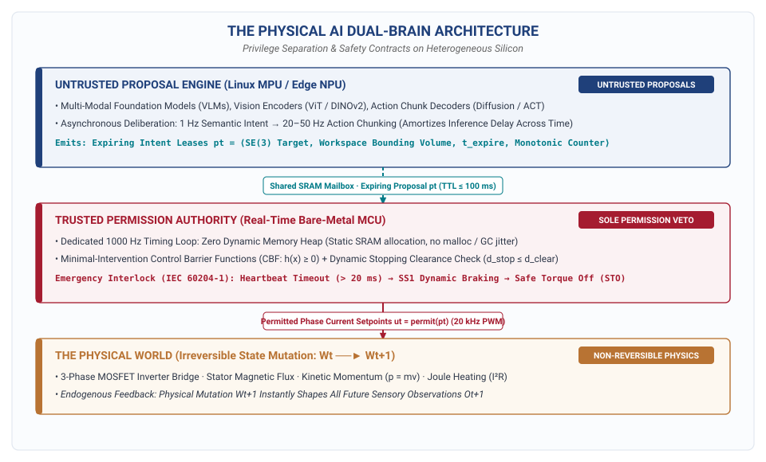
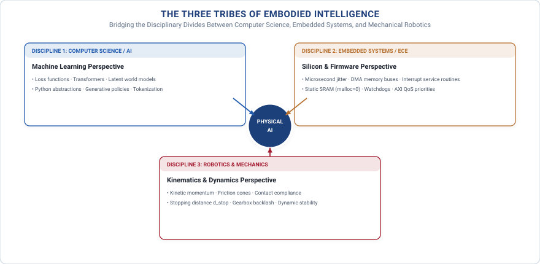

# Welcome {.unnumbered}

**Physical AI Systems** is an open, backward-designed engineering discipline for
building, measuring, constraining, and qualifying learned systems that exercise
delegated physical authority over matter and energy. This site carries the
course syllabus, the reference manuscript, and the dual-brain lab track.

{#fig-dual-brain width=100%}

::: {.grid}

::: {.g-col-12 .g-col-md-6}
::: {.callout-note title="📖 The Book Spine" icon=false}
Follow the 11-chapter cumulative spine—from physical boundary definitions and microsecond metrology to multi-rate runtimes, spatial belief, VLM reasoning, action chunks, and 1 kHz safety vetoes.

[Start Reading: Chapter 1 — Physical Causality](chapters/01-boundary/01-boundary.qmd){.btn .btn-primary .btn-sm role="button"}
:::
:::

::: {.g-col-12 .g-col-md-6}
::: {.callout-tip title="🔬 13 Hands-On Labs (GitHub)" icon=false}
Every chapter is accompanied by an executable bench laboratory on the Arduino UNO Q dual-brain hardware kit. All firmware contracts, tests, and harnesses are open-source.

[Explore Labs on GitHub](https://github.com/harvard-edge/PhysicalAI/tree/dev/labs){.btn .btn-outline-primary .btn-sm role="button"}
:::
:::

::: {.g-col-12 .g-col-md-6}
::: {.callout-important title="📋 Course Syllabus and Schedule" icon=false}
Designed for university courses (ETH Zurich / Harvard, 6 ECTS) and serious self-learners. Includes the 14-week schedule, milestone rubrics, team presentations, and capstone oral defense.

[View Course Syllabus](https://github.com/harvard-edge/PhysicalAI/blob/dev/course/syllabus.md){.btn .btn-outline-secondary .btn-sm role="button"}
:::
:::

::: {.g-col-12 .g-col-md-6}
::: {.callout-contract title="🛡️ Cumulative Design Dossier" icon=false}
Student teams accumulate an 11-artifact engineering dossier (`LOOP-01` to `REL-01`), culminating in an evidence-backed **Deploy / Condition / Refuse** release verdict.

[View Dossier Templates](appendix/dossier-templates.qmd){.btn .btn-outline-info .btn-sm role="button"}
:::
:::

:::

---

## The 13 Hands-On Laboratory Spine

Every chapter in the book directly binds to an executable hardware laboratory in the [`labs/`](https://github.com/harvard-edge/PhysicalAI/tree/dev/labs) directory of the repository:

| Lab | Milestone Title | Pipeline Organ & Focus | Dossier Deliverable | GitHub Contract |
| :---: | :--- | :--- | :---: | :---: |
| **`00`** | **Kit Bring-Up & Dual-Brain Boot** | Dual-Brain hardware verification, UART loopback, FreeRTOS blink | `KIT-00` | [`labs/00-kit-bringup`](https://github.com/harvard-edge/PhysicalAI/tree/dev/labs/00-kit-bringup) |
| **`01`** | **Closing the Causal Loop** | Advisory mode vs. Actuating mode, physical state mutation ($W_{t+1}$) | `LOOP-01` | [`labs/01-close-the-loop`](https://github.com/harvard-edge/PhysicalAI/tree/dev/labs/01-close-the-loop) |
| **`02`** | **The Freshness Wall** | Sensory decay ($\Delta t$), IEEE 1588 PTP timestamps, stopping bounds ($d_{\text{stop}}$) | `REQ-01` | [`labs/02-freshness-wall`](https://github.com/harvard-edge/PhysicalAI/tree/dev/labs/02-freshness-wall) |
| **`03`** | **Measure Both Brains** | Complete-path $P_{99}$ latency profiler, UMA bus contention, GPIO toggles | `REQ-01` | [`labs/03-measure-both-brains`](https://github.com/harvard-edge/PhysicalAI/tree/dev/labs/03-measure-both-brains) |
| **`04`** | **Multi-Rate Fault Containment** | Lock-free SRAM IPC, watchdog leases, surviving Linux MPU crashes | `RUN-01` | [`labs/04-runtime-fault-containment`](https://github.com/harvard-edge/PhysicalAI/tree/dev/labs/04-runtime-fault-containment) |
| **`05`** | **Perception Frontier** | Pre-inference DMA tax, ViT vs. CNN memory budgets, 3D spatial tokens | `OBS-01` | [`labs/05-perception-frontier`](https://github.com/harvard-edge/PhysicalAI/tree/dev/labs/05-perception-frontier) |
| **`06`** | **Belief & Drift** | $SE(3)$ frame graph trees, prediction buffers, state validity TTL leases | `STATE-01` | [`labs/06-belief-drift`](https://github.com/harvard-edge/PhysicalAI/tree/dev/labs/06-belief-drift) |
| **`07`** | **Two-Speed Intent** | MPU VLM spatial grounding, expiring intent leases ($t_{\text{expire}}$), KV-cache | `INTENT-01` | [`labs/07-two-speed-intent`](https://github.com/harvard-edge/PhysicalAI/tree/dev/labs/07-two-speed-intent) |
| **`08`** | **MCU Safety Enforcer (Signature Lab)** | 1 kHz bare-metal CBF projection ($\Pi_{\mathcal{U}_{\text{safe}}}(p_t)$), dynamic stopping vetoes | `ENF-01` | [`labs/08-mcu-enforcer`](https://github.com/harvard-edge/PhysicalAI/tree/dev/labs/08-mcu-enforcer) |
| **`09`** | **Placement Ripple** | Heterogeneous resource ledger (FLOPs, SRAM, Watts, CAN/PCIe QoS) | `PLACE-01` | [`labs/09-placement-ripple`](https://github.com/harvard-edge/PhysicalAI/tree/dev/labs/09-placement-ripple) |
| **`10`** | **Shadow Mode & Faults** | Passive shadow execution, PTP telemetry logging, discrepancy scoring | `AUTH-01` | [`labs/10-shadow-and-faults`](https://github.com/harvard-edge/PhysicalAI/tree/dev/labs/10-shadow-and-faults) |
| **`11`** | **Authority Paths & Bumpless Transfer** | Bumpless joystick takeover, truncated episode slicing, OTA rollback | `AUTH-01` | [`labs/11-authority-paths`](https://github.com/harvard-edge/PhysicalAI/tree/dev/labs/11-authority-paths) |
| **`12`** | **The Learning Turn** | Policy endogeneity mitigation, counterfactual log filtering, fine-tuning | `REL-01` | [`labs/12-learning-turn`](https://github.com/harvard-edge/PhysicalAI/tree/dev/labs/12-learning-turn) |
| **`13`** | **Ship Gate & Fault Defense** | Cross-layer fault injection rig, Claim-Argument-Evidence safety case | `REL-01` | [`labs/13-ship-gate`](https://github.com/harvard-edge/PhysicalAI/tree/dev/labs/13-ship-gate) |
| **`99`** | **Capstone Final Review** | Live oral defense under unannounced seeded hardware/software bench faults | **Final Release** | [`labs/99-design-review`](https://github.com/harvard-edge/PhysicalAI/tree/dev/labs/99-design-review) |

---

# Preface

For over seven decades, computer systems engineering operated under a comforting physical guarantee: **digital computation is reversible**. 

If a cloud server throws an exception, an operating system supervisor restarts the process. If a database transaction encounters a conflict, it rolls back. If an early machine learning classifier mislabels an image or a large language model hallucinates a token, the mistake is contained within an epistemic sandbox. The software logs an HTTP 500 status code, catches the error with a `try/catch` handler, and prompts the user for a retry. The external physical universe remains completely untouched and unaware:

$$\text{Software Exception} \xrightarrow{\quad \text{try/catch} \quad} \text{HTTP 500 Retry} \quad (\text{Physical World State } W_t \text{ Unchanged})$$

**Physical AI Systems begin when that digital boundary dissolves.**

The moment a learned neural network commands an electric motor inverter, opens a hydraulic proportional valve, adjusts an aircraft control surface, or modulates a high-voltage battery contactor, the luxury of software idempotency vanishes. Electrical power is converted into kinetic momentum ($\mathbf{p} = m\mathbf{v}$) and thermal dissipation ($I^2 R$). 

By the fundamental laws of classical mechanics and thermodynamics, physical actions cannot be rewound:

$$\text{Physical Actuation } A_t \implies \text{Matter \& Momentum Mutate } (W_t \longrightarrow W_{t+1}) \implies \text{Altered Sensory Stream } O_{t+1}$$

Because physical actions permanently alter the environment, every subsequent sensor observation is an endogenous consequence of the system's own prior decisions. The machine must live with the physical consequences of its choices. **You cannot `ctrl+z` kinetic energy.**

---

## The Evolutionary Arc: How We Arrived at Physical AI

Physical AI Systems is neither an overnight disruption nor a rebranding of classical robotics. It is the natural culmination of a decade-long evolution in machine learning systems engineering:

### Phase 1: Disembodied Digital ML (The Cloud Era, 2012–2020)
The deep learning revolution began in hyperscale datacenters [@krizhevsky2012imagenet; @vaswani2017attention]. Systems engineering concentrated on distributed training clusters, parameter servers, low-latency inference serving engines, and compiler graph optimizations for stateless perception and language models. In this era, models operated exclusively as advisory software inside digital sandboxes.

### Phase 2: Constrained Edge Sensing (The TinyML Era, 2018–2023)
As neural networks demonstrated utility, the community tackled a fundamental silicon barrier: *How do we compress and execute deep learning models on resource-constrained microcontrollers with only kilobytes of memory and milliwatts of power?* This era established integer quantization (INT8/INT4), static memory arenas, and optimized DSP micro-kernels. However, these deployments were primarily **open-loop sensory detectors**—acoustic wake-word recognizers, vibration monitors, and anomaly detectors. They emitted alerts, but did not close an autonomous physical control loop over moving matter.

### Phase 3: Semantic Deliberation (The Foundation Model Era, 2023–2026)
Large multimodal foundation models introduced open-world semantic scene understanding, spatial reasoning, and natural language task decomposition. Vision-Language Models (VLMs) demonstrated the ability to interpret unstructured environments and reason over extended horizons. Yet these models operate at low temporal frequencies ($0.5\text{--}2\text{ Hz}$), draw significant computational power, exhibit heavy tail latency ($P_{99}$), and possess no innate awareness of physical inertia, torque limits, or microsecond safety invariants.

### Phase 4: Physical AI Systems (Closed-Loop Actuation — 2026 and Beyond)
Today, machine learning systems have reached a new frontier. In this era, learned components leave the digital sandbox and exercise **delegated physical authority** over matter and energy under hard real-time constraints. Rather than running open-loop or relying on human confirmation, the system continuously ingests raw sensor streams, tracks spatial state, deliberates on high-level intent, decodes smooth multi-step trajectories, and enforces mathematical safety invariants at high frequency ($1000\text{ Hz}$).

{#fig-eras-preface width=100%}

---

## The Three Tribes: Who This Book Is For

Physical AI is the convergence point where three distinct engineering disciplines meet—each possessing critical strengths, yet each constrained by a fundamental blind spot:

1. **The Machine Learning & AI Practitioner (The "Brain"):** Masters high-capacity foundation models, representation learning, and simulation-based training. *The Blindspot:* The Digital Sandbox Illusion—assuming that simulation benchmarks equal physical proof, ignoring tail latency ($P_{99}$), and assuming operating systems cleanly de-energize hardware during software crashes.
2. **The Embedded & Silicon Engineer (The "Nervous System"):** Masters microsecond clocks, zero-copy memory transport, hardware bus firewalls, and real-time determinism. *The Blindspot:* The Static Automation Illusion—treating systems as rigid, hand-crafted sensor-to-actuator pipelines that cannot parse unstructured, open-world environments.
3. **The Mechanical & Robotics Engineer (The "Body & Control"):** Masters dynamics, kinematics, contact mechanics, and classical control stability. *The Blindspot:* The Closed-World Illusion—distrusting learned models as uncontrollable black boxes, relying on brittle geometric estimators that fail when lighting, friction, or object compliance deviates from CAD models.

{#fig-tribes-preface width=100%}

**Physical AI Systems is the grand synthesis.** It provides the architectural contracts, multi-rate runtimes, and mathematical envelopes needed to connect learned semantic models (The Brain) across real-time silicon transport (The Nervous System) to physical actuators moving matter (The Body).

---

## The Backward Design: What You Will Master

Every transformative systems discipline is defined by what it enables practitioners to build—and what comforting illusions it forces them to abandon:

| Tribe | What You Leave Behind | What You Master |
| :--- | :--- | :--- |
| **1. ML / AI (The "Brain")** | The illusion that simulation proves safety; reliance on average latency; assuming the operating system de-energizes motors on a process crash. | Complete-path sensory-motor metrology down to the microsecond; tail-latency budgets ($P_{99}$); zero-copy memory pipelines; isolating untrusted neural proposals from physical power stages. |
| **2. Embedded / ECE (The "Nervous System")** | Treating the machine as a static, rule-based controller; struggling to host multi-gigabyte stochastic models without missing real-time deadlines. | Multi-rate asynchronous IPC architectures; shared SRAM ring buffers; hosting foundation VLMs and Action Chunk decoders as untrusted proposal services without compromising determinism. |
| **3. Robotics (The "Body & Control")** | The belief that the open world can be hand-modeled in CAD; rejecting neural networks out of fear of non-determinism. | Grounding Vision Transformers and Diffusion Policies into physical space ($SE(3)$); caging stochastic AI with real-time Control Barrier Functions (CBFs); $I^2t$ thermal energy envelopes. |

By the time you complete this book and its hands-on laboratories, you will possess four durable systems engineering capabilities:

1. **Architect the Proposal–Permission Dual-Brain:** Partition an autonomous machine across heterogeneous silicon—running stochastic neural models as untrusted proposal services on application processors, while running deterministic safety enforcers on real-time microcontrollers so that a complete software crash never causes physical harm.
2. **Profile Complete-Path Sensory-Motor Latency:** Trace every microsecond across the physical loop—from photon arrival and Direct Memory Access (DMA) bus contention to neural inference, inter-core mailboxes, and motor phase current rise times—proving why tail latency ($P_{99}$) governs dynamic stopping distance ($d_{\text{stop}}$).
3. **Solve for Semantic Competence and Physical Invariants Simultaneously:** Move beyond single-number accuracy scores to evaluate physical AI systems across both task progress and mathematical safety envelopes ($h(x) \ge 0$), using minimal-intervention quadratic programs to project candidate proposals onto forward-invariant safe sets.
4. **Compile an Evidence-Backed Release Dossier:** Move beyond cherry-picked video demos to compile a versioned, 11-artifact **Cumulative Design Dossier** that validates the machine against cross-layer fault injection and renders an accountable **Deploy / Condition / Refuse** release verdict.

---

## The Durable Systems Question

This book is not a guide to training larger foundation models in cloud clusters, nor is it a classical robotics textbook deriving 50 pages of kinematic matrices. The durable question governing every architectural pattern, mathematical contract, and hardware laboratory in this text is:

> **"What must the surrounding system know, measure, enforce, preserve, and prove before an unverified learned proposal may produce a physical consequence?"**

---

## The 4 Bedrock Laws of Physical AI Systems

Every system design, firmware interface, and qualification checkpoint in this book is anchored in four inescapable physical laws:

::: {.callout-objective}
**Law 1: The Law of Physical Causality and Irreversibility.** Software state can be caught with a `try/catch` block or rewound. Physical actions ($W_t \to W_{t+1}$) governed by mass, inertia, friction ($\mu$), and gravity ($g$) are permanent and irreversible. Every action mutates the environment, consumes energy, and alters all future sensory observations endogenously ($A_t \to W_{t+1} \to O_{t+1}$).
:::

::: {.callout-decision}
**Law 2: The Law of Information Freshness (The Time Law).** The physical world does not pause while an AI model computes. Sensor observations age the microsecond they are sampled. Mean latency is a dangerous lie; tail latency ($P_{99}$), memory bus contention, and information age ($\Delta t$) dictate physical closed-loop stability and dynamic stopping distances ($d_{\text{stop}}$).
:::

::: {.callout-contract}
**Law 3: The Law of Proposal–Permission Privilege (The Architecture Law).** No stochastic, learned neural network (VLM, VLA, or Diffusion Policy) may hold direct physical authority over actuators. Learned models running on application processors (MPU) are *untrusted proposal services*. Real-time physical permission belongs exclusively to dedicated, zero-allocation microcontrollers (MCU) running deterministic safety envelopes and physical fallbacks.
:::

::: {.callout-autopsy}
**Law 4: The Law of Governed Change and Defensible Release (The Safety Law).** A physical agent shapes its own future data. Naive training on raw logs without isolating safety interventions induces severe covariate shift and policy collapse. A cherry-picked video demo or simulation benchmark is not evidence of safety; release requires cross-layer fault injection and a Claim-Argument-Evidence (CAE) safety case rendering an accountable **Deploy / Condition / Refuse** verdict.
:::

---

## What We Own vs. What We Explicitly Exclude

To keep our systems focus razor-sharp and provide maximum value to students and practitioners, we maintain strict editorial boundaries:

| What We Explicitly Exclude (Let others teach) | What We Uniquely Own (Our core contribution) |
| :--- | :--- |
| ✗ 50 pages of robot arm kinematics & DH parameters | ✓ **The Proposal–Permission (Dual-Brain) Architecture** |
| ✗ Training a 70B VLA model from scratch on 1000 GPUs | ✓ **The 3 Speeds of Intelligence (1 Hz VLM $\to$ 20 Hz VLA $\to$ 1 kHz MCU)** |
| ✗ Cloud LLM prompt chaining / chat agent wrappers | ✓ **Sensory-Motor Metrology ($P_{99}$ tails, UMA bus contention, $\Delta t$)** |
| ✗ Pure physics simulation / PINNs | ✓ **Continuous Multi-Rate Runtimes & surviving MPU panics** |
| ✗ Decorative compliance manuals without bench proof | ✓ **The Cumulative Design Dossier (Deploy / Condition / Refuse)** |

---

## Concept vs. Realization: The Anatomy of a Physical Agent and the Physical AI Kit

The curriculum connects platform-neutral theory to tangible, zero-magic bench hardware:

* **The Conceptual Framework:** **The Physical AI Co-Design Matrix** crossing Physical Constraints (Columns) $\times$ Cognitive Agency (Rows).
* **The Reference Hardware Realization:** **The Physical Agent on the Physical AI Kit** (Arduino UNO Q Dual-Brain: Linux MPU + Real-Time MCU).

### The Three Defining Criteria of Physical AI

Across every embodiment—from high-profile humanoid robots to deep energy infrastructure—three universal criteria define a **Physical AI System** and distinguish it from digital machine learning and classical automation:

1. **A Learned Foundation Component (VLA, World Model, Diffusion Policy):**  
   It does not rely exclusively on hardcoded rule trees or pre-programmed CAD paths; it learns from multimodal data and generalizes to open-world unstructured variability.
2. **Operations Across the Analog $\longleftrightarrow$ Digital Boundary:**  
   Digital computations (discrete clock ticks, token embeddings, tensor matrices) directly command continuous analog energy fluxes (3-phase motor inverters, hydraulic valves, magnetic fields, chemical reactions).
3. **Governed by Irreversible Physical Laws:**  
   If a model hallucinates or an algorithm experiences a latency tail spike, it cannot `ctrl+z`—it risks physical collisions, sheared gear teeth, thermal runaway ($I^2R$), or human injury.

---

| Dimension | Archetype 1: Locomotion & Mobility | Archetype 2: Contact Manipulation | Archetype 3: Cybernetic Energy & Process |
| :--- | :--- | :--- | :--- |
| **Physical Interaction** | Moving in Free Space | Touching & Shaping Matter | Regulating Continuous State Flows |
| **Primary Physical Law** | Inertial Momentum ($\mathbf{p} = m\mathbf{v}$) & Stopping Kinematics | Contact Forces, Friction & Torque Derivatives ($\dot{\boldsymbol{\tau}}$) | Thermodynamics ($I^2R$ Heat) & Energy Conservation |
| **Primary Silicon Tension**| High-speed sensory DMA & $P_{99}$ latency tails | Multi-rate trajectory IPC & $\mathcal{C}^2$ jerk continuity | ADC sampling latency & hard thermal safe sets |
| **Real-World Anchors** | • Humanoid Walking • Autonomous Cars (Waymo) • Flying Drones (Skydio) | • Dexterous Manipulators • Humanoid Hands (Optimus) • Surgical Robotic Tools | • EV Battery Thermal Management • Smart Grid Inverters • Closed-Loop Medical Infusion |
| **Role in the Curriculum** | Teaches Time, Freshness, Stopping Distance & Latency Tails | **The Primary Teaching Spine & Desk Lab Kit** (Arduino UNO Q) | Proves Physical AI spans the entire Analog–Digital Seam! |

: The Three Canonical Archetypes of Physical AI. Grounding every physical system into three universal interaction regimes. {#tbl-canonical-archetypes-preface}

| Chapter & Organ | The Conceptual Framework *(The Physical AI Co-Design Matrix)* | The Reference Hardware Realization *(The Physical Agent on the Physical AI Kit)* | Dossier Deliverable |
| :---: | :--- | :--- | :---: |
| **01** | The Causal Boundary & Irreversibility | Actuator power bus isolation and hardware emergency stop loop | `LOOP-01` |
| **02** | Physical Constraints & Freshness Wall | 4-probe GPIO logic analyzer $P_{99}$ latency tail metrology & stopping physics | `REQ-01` |
| **03** | Cognitive Dimensions & Multi-Rate Cadences | Dual-Brain lock-free IPC skeleton (1 Hz, 20 Hz, 1000 Hz) & watchdog leases | `FLOW-01` |
| **04** | Stage 1: Perceive (VLA Spatial Tokens) | Zero-copy MIPI CSI-2 DMA ring buffers & DINOv2 3D spatial tokens | `OBS-01` |
| **05** | Stage 2: Remember (Latent World Models) | 3D dynamic coordinate frame graph ($SE(3)$) and state validity TTL leases | `STATE-01` |
| **06** | Stage 3: Reason (Multimodal VLM Intent) | MPU VLM spatial bounding boxes and expiring intent leases ($t_{\text{expire}}$) | `INTENT-01` |
| **07** | Stage 4: Plan (Diffusion Action Chunking) | MPU VLA multi-step action chunk unrolling ($H$-steps) and $\mathcal{C}^2$ jerk splines | `PLAN-01` |
| **08** | Stage 5: Execute (1 kHz Safety Reflex) | Dedicated MCU bare-metal 1 kHz safety enforcer and CBF QP solver | `ENF-01` |
| **09** | Workload Placement & Memory QoS | Whole-system heterogeneous resource ledger (FLOPs, SRAM, Watts, bus QoS) | `PLACE-01` |
| **10** | Human Governance & Data Flywheels | $\mathcal{C}^2$ bumpless joystick override state machine and truncated logs | `AUTH-01` |
| **11** | Defensible Assurance & Safety Cases | Cross-layer injected seeded fault defense and CAE safety case | `REL-01` |
| **99** | Capstone: Whole-System Defense | Live unannounced seeded fault defense and Capstone certification | **Final Release** |

