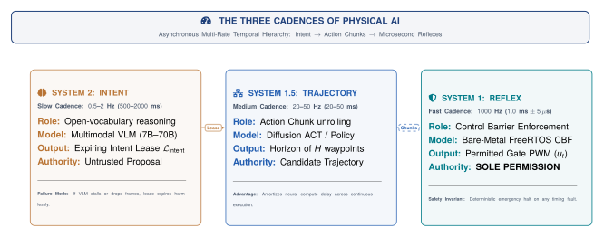
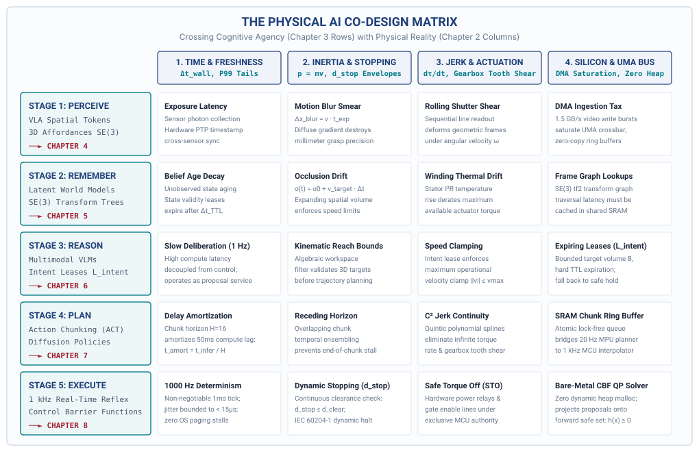

# Physical AI Systems — Course & Studio Guide

**Course Portal:** [`physical.mlsysbook.ai`](https://physical.mlsysbook.ai)  
**Academic Offering:** ETH Zurich (D-ITET / D-INFK) · 6 ECTS Project Seminar & Hardware Studio  
**Instructors:** **Prof. Vijay Janapa Reddi** (Harvard / Visiting Prof, ETH Zurich) & **Dr. Andrea Mattia Garavagno** (ETH Zurich)

---

## 1. Course Vision: What is Physical AI?

Standard machine learning ends at digital output. A classifier emits a label; a large language model emits text. In the digital realm, software errors are safely contained behind glass: transactions roll back, exceptions are caught, and dropped packets are retried.

**Physical AI Systems begin at the exact moment digital software commands physical actuators—accelerating mass, consuming energy, interacting with humans, and permanently altering the physical world ($W_t \to W_{t+1}$).**

Because physical actions cannot be rewound (**you cannot `ctrl+z` kinetic momentum or Joule heat**), this course answers one central systems question:

> **"What must the surrounding system know, measure, enforce, preserve, and prove before an unverified learned proposal may produce a physical consequence?"**

---

## 2. The Three Defining Properties & Canonical Archetypes

An engineered system is defined as **Physical AI** if and only if it satisfies three universal criteria:

1. **Learned Foundation Component:** High-capacity learned models (Vision-Language-Action models, Latent World Models, Diffusion Policies) that generalize over open-world environmental variability.
2. **Operations Across the Analog $\longleftrightarrow$ Digital Boundary:** Discrete digital tensors and tokens directly commanding continuous physical energy fluxes (inverters, motor coils, valves, momentum).
3. **Governed by Irreversible Physical Laws:** Conservation of energy, momentum ($p=mv$), Joule heating ($I^2R$), and friction.

### The Three Canonical Archetypes
* **1. Locomotion & Mobility:** Autonomous vehicles (Waymo), high-speed delivery drones (Skydio), quadrupeds ($P_{99}$ latency tails & dynamic stopping envelopes $d_{\text{stop}}$).
* **2. Contact Manipulation:** Humanoid hands (Optimus, Figure), 6-DoF robot arms, surgical tools (Torque rates $\dot{\boldsymbol{\tau}}$, harmonic drive flexspline shear).
* **3. Cybernetic Process & Energy:** Smart grid inverters, EV battery thermal management ($I^2R$ Joule heating & AC phase synchronization).
* **The Desk Bench Twin:** The **Arduino UNO Q Dual-Brain Kit** (Linux Application MPU + Real-Time Cortex-M4 MCU) grounding every concept on real bench hardware.

---

## 3. The Grand Systems Conflict & The Three Cadences

The foundational tension of Physical AI is the structural collision between two opposing vectors:

* **Physics Demands *Less Time* ($t \to 0$):** Kinetic momentum carries mass forward; coils accumulate heat; sensor data ages instantly; transport delays erode phase margin.
* **Cognition Demands *More Time* ($t \to \infty$):** Foundation models, spatial transformers, and diffusion decoders need time and compute to deliberate over open-world ambiguity.

{#fig-three-cadences width=100%}

{#fig-mcu-sbc-loop width=100%}

### The Three Cadences of Intelligence
We resolve this conflict by decoupling execution across three asynchronous temporal tiers:

1. **System 2 (Slow · $0.5\text{--}2\text{ Hz}$ · Linux MPU):** Semantic deliberation and open-world goal decomposition. Operates as an *untrusted proposal service* emitting expiring intent leases.
2. **System 1.5 (Medium · $20\text{--}50\text{ Hz}$ · Edge NPU):** Trajectory decoding and action chunking (ACT / Diffusion), amortizing compute latency across physical time using $\mathcal{C}^2$ jerk splines.
3. **System 1 (Fast · $1000\text{ Hz}$ · Bare-Metal MCU):** Real-time safety reflexes and Control Barrier Functions (CBF). Operates with strictly **zero dynamic heap allocation (`malloc = 0`)** as the sole hardware permission authority.

---

## 4. The Thematic Curriculum Arc

The course is structured into three progressive thematic parts, systematically exploring the **Physical AI Co-Design Matrix**:

{#fig-codesign-matrix width=100%}

### Part I: Foundations & The Co-Design Challenge
* **The Causal Boundary:** Closed-loop state mutation ($W_t \to W_{t+1}$) vs. open-loop digital inference.
* **The Physical Constraints:** Time constants ($\tau_{\text{world}}$), $P_{99}$ latency tails, dynamic stopping distance ($d_{\text{stop}}$), jerk ($\dddot{\mathbf{q}}$), Joule heating ($I^2R$), and UMA DRAM bus contention.
* **The Cognitive Dimensions:** Spatial tokens, world models, semantic intent, action chunking, and safety reflexes.

### Part II: The Embodied Lifecycle (Perceive $\to$ Act)
* **Stage 1 (Perceive):** 3D spatial affordance tokens in $SE(3)$, CMOS exposure limits, and MIPI DMA ingestion taxes.
* **Stage 2 (Remember):** Latent world models (JEPAs), dynamic $SE(3)$ frame trees, and occlusion uncertainty decay.
* **Stage 3 (Reason):** Multimodal Vision-Language Models (VLMs) and expiring intent leases.
* **Stage 4 (Plan):** Diffusion Policies and Action Chunking with Transformers (ACT) with $\mathcal{C}^2$ jerk splines.
* **Stage 5 (Execute):** 1 kHz bare-metal Control Barrier Functions, dynamic stopping vetoes, and STO interlocks.

### Part III: Placement, Governance & Defensible Release
* **Heterogeneous Placement:** Partitioning workloads across MPU, NPU, and MCU substrates under thermal and bus QoS limits.
* **Human Governance:** Bumpless human takeover, shared autonomy, and governed policy flywheels.
* **Assurance & Release:** Cross-layer fault injection trials, safety cases, and the final capstone defense.

---

## 5. Hardware Studio & Evaluation

Students work in interdisciplinary pairs (combining ML/software with embedded/hardware backgrounds) to build, profile, and defend a complete physical agent on the **Arduino UNO Q Dual-Brain Kit**:

* **Process & Studio Checkpoints (20%):** Weekly hands-on lab progress and firmware bring-up.
* **Midterm System Review (15%):** Live bench demonstration of the closed-loop proposal-permission pipeline.
* **Final Capstone Defense (25%):** Oral jury defense with live recovery from an instructor-seeded bench fault.
* **Cumulative Design Dossier (40%):** The evolving, versioned engineering record documenting the system's requirements, contracts, safety bounds, and release case.

### Studio Infrastructure
* **Host Brain (MPU):** Qualcomm Linux Application Processor running PyTorch, TensorRT, VLMs, and ACT Action Chunk decoders.
* **Reflex Brain (MCU):** Dedicated ARM Cortex-M4 Microcontroller running bare-metal / FreeRTOS with strictly **zero dynamic heap allocation (`malloc = 0`)**.
* **Sensory & Actuation:** MIPI CSI-2 camera with DMA ring buffers, high-resolution optical encoders, 6-DoF IMU, and multi-axis motion stage with Safe Torque Off (STO) relays.
