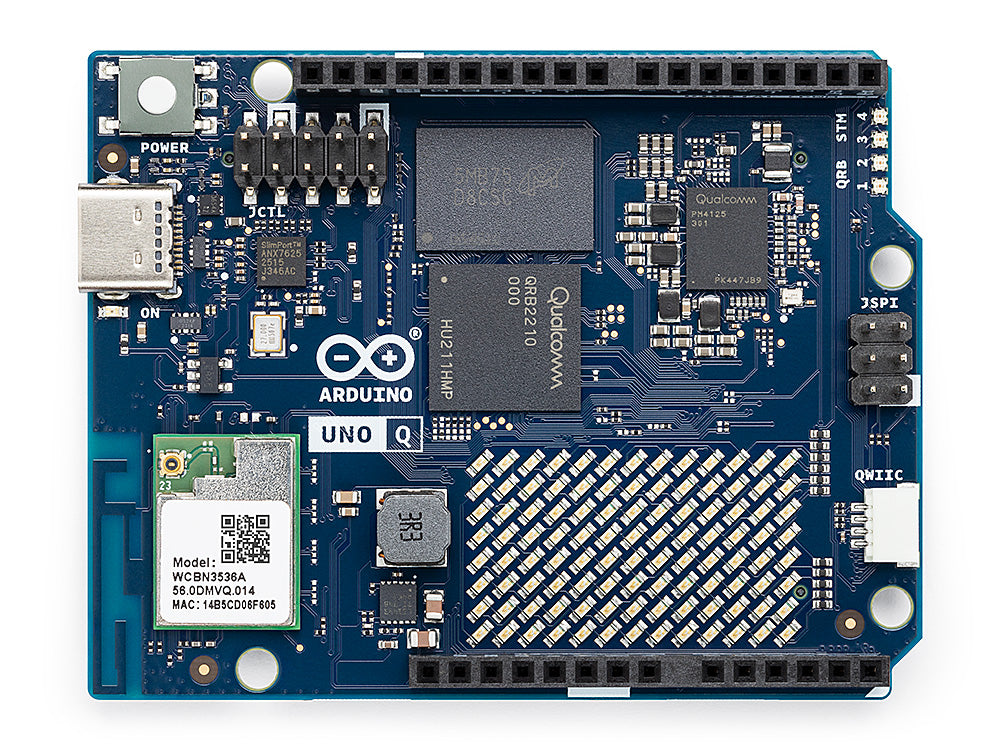
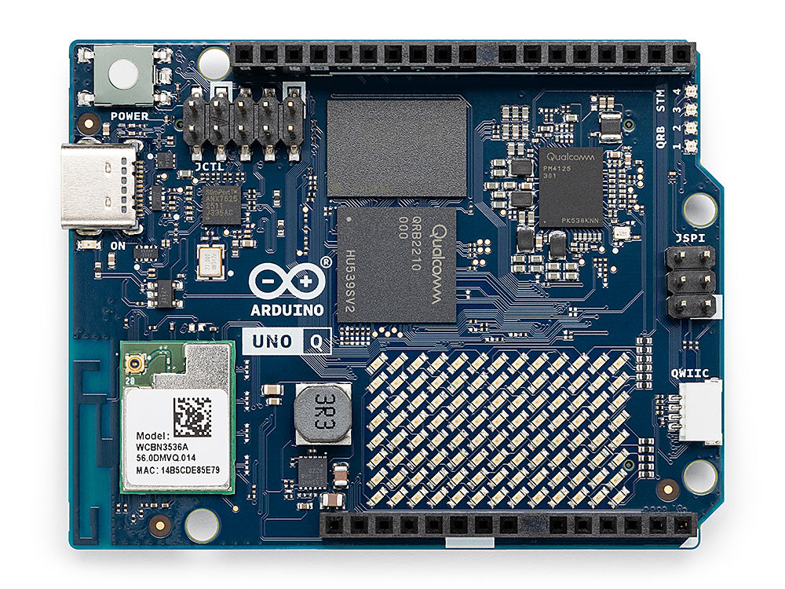

# Physical AI Systems

**Student-facing course syllabus.** This Markdown file is the syllabus—view it on GitHub or any Markdown preview. ETH packaging notes live in [`syllabus.md`](syllabus.md). The textbook is the separate Quarto project in [`../book/`](../book/).

**Project seminar & hardware studio** · ETH Zurich / open follow-along

| | |
| --- | --- |
| **Credits** | 6 ECTS *(proposed)* |
| **Format** | Weekly seminar + kit studio · **no written exam** |
| **Language** | English |
| **Level** | Advanced Bachelor & Master |
| **Instructor** | Prof. Vijay Janapa Reddi · [vj@eecs.harvard.edu](mailto:vj@eecs.harvard.edu) · ETZ F 83 |
| **Portal** | [physical.mlsysbook.ai](https://physical.mlsysbook.ai) |
| **Book** | *Physical AI: Machine Learning Systems That Sense and Act* |

## What you will learn

Machine learning usually ends **behind glass**. A wrong label is a retry. **Physical AI** begins when software moves mass and spends energy—the world permanently changes. You cannot `ctrl+z` kinetic energy.

This is the systems course for that transition: not a kinematics survey, not TinyML “fit a model on a chip,” and not an LLM-agents lab. You learn the nuggets that matter when a learned model may act in the physical world—

> **know · measure · enforce · preserve · prove** — then **deploy, condition, or refuse.**

**Who this is for.** Students from **ML / AI**, **embedded / ECE**, or **robotics / control** who want to build and measure systems where learned software can command actuators. Studio teams usually mix software-heavy and hardware-heavy backgrounds.

**Prerequisites.** Intro ML systems (models as components with latency, memory, energy) · comfortable Python and/or C/C++ · willingness to work in a small team on hardware. Helpful: embedded / TinyML. Not required: LLM-agents or a full robotics sequence. Baseline (quantize, prune, serve) → [mlsysbook.ai](https://mlsysbook.ai).

**What you will do.** Build a physical agent across the semester · measure end-to-end paths · put permission on the MCU · keep a short engineering notebook · defend **deploy / condition / refuse** under a seeded fault.

## The curriculum sandwich

Eleven chapters + capstone. Same spine as the book. Labs track the chapters; contracts live in [`labs/`](../labs/).

### Part I — Foundations

| # | Topic |
| ---: | --- |
| 1 | Causal boundary — when is it Physical AI? |
| 2 | Physical constraints — freshness, $P_{99}$, stopping, energy |
| 3 | Cognitive dimensions — co-design, multi-rate lifecycle |

### Materials (the filling)

| | |
| --- | --- |
| **Book** | *Physical AI: Machine Learning Systems That Sense and Act* — chapter text, figures, contracts |
| **Labs** | Kit bring-up → measure both brains → **MCU enforcer** → ship gate → capstone |
| **Notebook** | Short chapter checkpoints you freeze as you go (no classical written exam) |
| **Baseline** | [mlsysbook.ai](https://mlsysbook.ai) for quantize / prune / serve (not re-taught here) |

### Part II — Agent architecture

| # | Topic |
| ---: | --- |
| 4 | Perception & spatial encoders |
| 5 | Memory & world models |
| 6 | Intent as expiring proposal |
| 7 | Planning — trajectories / action chunks |
| 8 | Enforcement — independent MCU permission |

### Part III — Integration & release

| # | Topic |
| ---: | --- |
| 9 | Heterogeneous placement |
| 10 | Governance — human authority, governed data |
| 11 | Assurance — evidence → release verdict |
| — | Capstone — whole-system defense |

### Labs (outline)

| Labs | Focus |
| ---: | --- |
| 00–01 | Bring-up · close the loop |
| 02–04 | Freshness · measure both brains · fault containment |
| 05–07 | Perception · belief · intent |
| **08** | **MCU enforcer** *(signature)* |
| 09–13 | Placement · authority · ship gate |
| Capstone | Seeded-fault defense |

## The kit

After the method is clear, you put it on silicon. Studio work uses the **Arduino UNO Q**—Arduino’s new dual-brain boards built with **Qualcomm Dragonwing** (Linux MPU) plus a real-time **STM32 MCU** on one UNO-shaped PCB.

You develop on this kit all semester and learn the Physical AI nuggets on real hardware—not slides alone.

| UNO Q · 2&nbsp;GB / 16&nbsp;GB eMMC | UNO Q · 4&nbsp;GB / 32&nbsp;GB eMMC |
| :---: | :---: |
|  |  |

| | |
| --- | --- |
| **MPU** | Qualcomm Dragonwing™ QRB2210 · Debian Linux · models, vision, proposals |
| **MCU** | STM32U585 · real-time I/O, timing, permission |
| **SKUs** | Same board family: **2&nbsp;GB** for lean studio work · **4&nbsp;GB** when vision / larger models need headroom |
| **Why here** | One PCB that matches the course: intelligence proposes; the microcontroller can still refuse |

Lab details fill in bring-up and firmware. For the syllabus: **this is the kit.**

## Semester at a glance

| Weeks | Theme |
| ---: | --- |
| 1–4 | Foundations on kit · project proposal |
| 5–8 | Build the agent · midterm · **MCU enforcer** |
| 9–11 | Place · govern · release draft |
| 12–14 | Dry-run · capstone defense |

**Assessment (indicative):** studio 20% · midterm 15% · capstone 25% · engineering notebook 40%.

## Contact

| | |
| --- | --- |
| **Instructor** | Prof. Vijay Janapa Reddi · [vj@eecs.harvard.edu](mailto:vj@eecs.harvard.edu) · ETZ F 83 |
| **Book / course** | [physical.mlsysbook.ai](https://physical.mlsysbook.ai) |
| **Baseline ML systems** | [mlsysbook.ai](https://mlsysbook.ai) |
| **ETH detail notes** | [`syllabus.md`](syllabus.md) |

Use subject **`[Physical AI]`** in email.
